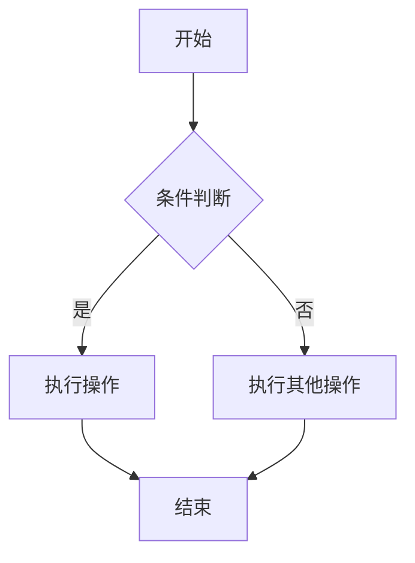
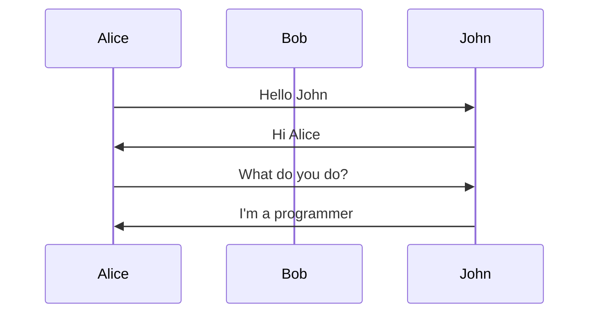
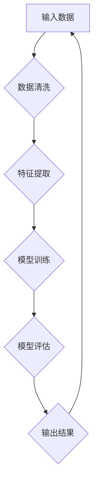

                 

### 《AIGC工具箱：必备软件和平台》

#### 关键词：AIGC，人工智能生成内容，工具箱，软件平台，深度学习，预训练模型

##### 摘要：
本文旨在为读者提供一个全面的AIGC（人工智能生成内容）工具箱指南。我们将深入探讨AIGC技术的核心概念、发展历程，并详细介绍一系列必备的软件和平台。通过本文，读者将能够理解AIGC的工作原理，掌握关键工具的使用方法，并在实际项目中应用这些技术。文章分为五个主要部分：技术概述、软件介绍、平台介绍、项目实战和最佳实践。我们将以逻辑清晰、结构紧凑、通俗易懂的语言，逐步引导读者进入AIGC的世界，帮助他们在人工智能领域取得更大成就。

## 1. 核心概念和背景介绍

### 1.1 AIGC技术基础

#### 1.1.1 AIGC的定义与基本原理

AIGC（Artificial Intelligence Generated Content，人工智能生成内容）是指利用人工智能技术，尤其是深度学习算法，自动生成文字、图像、音频等多媒体内容。AIGC技术的发展经历了以下几个阶段：

1. **初始阶段**：以生成简单的文本、图像和音频为目标，主要采用规则方法和简单的机器学习算法。
2. **初步发展阶段**：随着神经网络技术的发展，深度学习算法开始应用于AIGC领域，生成内容的质量和多样性有了显著提升。
3. **成熟阶段**：以GPT-3、DALL-E等为代表的大型预训练模型的出现，使AIGC技术进入了一个全新的阶段，能够生成更加复杂和高质量的内容。

#### 1.1.2 AIGC技术的重要性与应用领域

AIGC技术在各个行业和领域都具有重要应用价值：

1. **媒体与娱乐**：通过AIGC技术，可以自动生成新闻文章、电影剧本、音乐作品等，极大地提高了内容创作的效率和质量。
2. **广告与营销**：AIGC技术能够自动生成吸引人的广告文案和视觉设计，提高营销效果。
3. **教育与培训**：AIGC技术可以自动生成个性化课程内容和培训材料，满足不同学习者的需求。
4. **设计领域**：AIGC技术能够自动生成新颖的图形设计、建筑模型等，为设计师提供灵感。

### 1.2 AIGC工具箱的核心概念

AIGC工具箱是指一系列用于实现AIGC技术的软件和平台，包括预训练模型、开发工具、数据集等。核心概念包括：

1. **预训练模型**：如GPT-3、DALL-E等，是AIGC工具箱的核心组成部分，用于生成高质量的内容。
2. **开发工具**：如Hugging Face的Transformers库、PyTorch等，提供了方便的开发接口和丰富的功能。
3. **数据集**：如Common Crawl、COCO等，用于训练和评估AIGC模型。

#### 1.3 AIGC工具箱的背景介绍

随着人工智能技术的不断进步，AIGC技术逐渐成为研究者和开发者关注的焦点。AIGC工具箱的背景主要包括：

1. **技术需求**：随着内容生成的需求不断增加，传统的手工创作方式已经无法满足要求，AIGC技术应运而生。
2. **应用场景**：在媒体、广告、教育、设计等领域，AIGC技术显示出强大的应用潜力，吸引了大量企业和研究机构的关注。
3. **发展前景**：随着计算资源和算法技术的不断提升，AIGC工具箱的应用范围将进一步扩大，成为人工智能领域的重要组成部分。

### 1.4 AIGC工具箱的意义与价值

AIGC工具箱在人工智能领域具有重要的意义与价值：

1. **提升内容创作效率**：AIGC工具箱能够自动生成高质量的内容，大大提高了内容创作的效率。
2. **降低创作成本**：通过自动化生成内容，可以降低人力成本，提高企业的竞争力。
3. **促进技术创新**：AIGC工具箱为研究人员提供了丰富的实验环境，推动了人工智能技术的不断创新。
4. **拓宽应用领域**：AIGC工具箱的应用范围涵盖了媒体、广告、教育、设计等多个领域，为各行业带来了新的机遇。

### 1.5 AIGC工具箱的未来发展趋势

随着人工智能技术的不断发展，AIGC工具箱的未来发展趋势主要包括：

1. **模型规模不断扩大**：随着计算资源的提升，AIGC模型将变得越来越大，生成内容的质量将进一步提高。
2. **应用场景不断拓宽**：AIGC工具箱的应用将不断拓展到更多的领域，如医疗、法律、金融等。
3. **技术融合与创新**：AIGC工具箱将与更多的技术进行融合，如计算机视觉、自然语言处理等，产生新的应用场景。

### 1.6 总结与展望

通过本文的介绍，读者对AIGC工具箱的核心概念、背景介绍、意义与价值以及未来发展趋势有了全面的了解。在接下来的章节中，我们将详细介绍AIGC工具箱中的必备软件和平台，帮助读者掌握这些工具的使用方法，并在实际项目中应用AIGC技术。

## 2. 目录大纲设计

### 2.1 目录大纲的整体设计思路

AIGC工具箱的目录大纲设计旨在为读者提供一个系统、全面、易于理解的学习路径。整体设计思路如下：

1. **结构清晰**：目录大纲采用层级结构，分为五大部分，每个部分包含若干章节，章节之间逻辑清晰，便于读者阅读和理解。
2. **内容全面**：每个章节都涵盖了核心概念、背景介绍、算法原理、数学模型、系统分析与架构设计、项目实战、最佳实践等全面的内容。
3. **易于拓展**：目录大纲中的每个章节都预留了足够的拓展空间，便于读者根据实际需求进行深入学习。

### 2.2 目录大纲草案

根据上述设计思路，以下是一个初步的目录大纲草案：

### 第一部分 AIGC技术概述

#### 第1章 AIGC技术基础

##### 1.1 AIGC技术发展历程

##### 1.2 AIGC技术的核心概念

##### 1.3 AIGC技术的背景介绍

##### 1.4 AIGC工具箱的意义与价值

##### 1.5 AIGC工具箱的未来发展趋势

##### 1.6 总结与展望

### 第二部分 必备软件介绍

#### 第2章 GPT系列模型

##### 2.1 GPT-3模型

##### 2.2 GPT-2模型

##### 2.3 GPT-1模型

##### 2.4 GPT模型的使用方法

### 第三部分 开源平台介绍

#### 第3章 Hugging Face平台

##### 3.1 Hugging Face平台的功能与优势

##### 3.2 Hugging Face平台的使用方法

##### 3.3 Hugging Face平台的应用案例

### 第四部分 商业平台介绍

#### 第4章 OpenAI平台

##### 4.1 OpenAI平台的功能与特点

##### 4.2 OpenAI平台的使用方法

##### 4.3 OpenAI平台的应用案例

### 第五部分 项目实战

#### 第5章 AIGC项目实施

##### 5.1 项目背景

##### 5.2 系统设计

##### 5.3 实施步骤

##### 5.4 项目分析与总结

### 第六部分 最佳实践与展望

#### 第6章 AIGC技术应用趋势

##### 6.1 AIGC技术的未来发展方向

##### 6.2 AIGC技术在行业中的应用前景

##### 6.3 开发者应具备的技能与素质

##### 6.4 小结与展望

### 第七部分 附录

#### 第7章 常用工具汇总

##### 7.1 常用软件工具汇总

##### 7.2 常用平台汇总

##### 7.3 参考资源汇总

### 2.3 目录大纲的细化

在初步的目录大纲草案基础上，我们需要对每个章节进行细化，确保每个章节的内容完整、具体、详细。以下是第1章的细化内容：

### 第1章 AIGC技术基础

#### 1.1 AIGC技术发展历程

##### 1.1.1 AIGC技术的起源

- 人工智能与内容生成的结合
- 初期研究与应用场景

##### 1.1.2 AIGC技术的主要发展阶段

- 深度学习与神经网络的发展
- 预训练模型的出现与广泛应用

##### 1.1.3 AIGC技术的最新进展

- GPT-3等大型模型的推出
- 应用领域的拓展与创新

#### 1.2 AIGC技术的核心概念

##### 1.2.1 生成对抗网络（GAN）

- GAN的基本原理与结构
- GAN在不同领域的应用

##### 1.2.2 变分自编码器（VAE）

- VAE的基本原理与结构
- VAE在不同领域的应用

##### 1.2.3 递归神经网络（RNN）

- RNN的基本原理与结构
- RNN在不同领域的应用

#### 1.3 AIGC技术的背景介绍

##### 1.3.1 人工智能的发展背景

- 人工智能的定义与发展历程
- 人工智能的主要应用领域

##### 1.3.2 内容生成的需求与挑战

- 内容生成的现状与问题
- AIGC技术的解决思路与优势

##### 1.3.3 AIGC技术的发展现状

- 当前主要AIGC技术与应用场景
- AIGC技术的影响与未来趋势

#### 1.4 AIGC工具箱的意义与价值

##### 1.4.1 提升内容创作效率

- 自动化生成内容的优势
- 提高内容质量和速度

##### 1.4.2 降低创作成本

- 减少人力成本与资源浪费
- 提高企业竞争力

##### 1.4.3 促进技术创新

- 为研究人员提供丰富的实验环境
- 推动人工智能技术的不断创新

##### 1.4.4 拓宽应用领域

- 覆盖多个行业与应用场景
- 开拓新的市场机遇

#### 1.5 AIGC工具箱的未来发展趋势

##### 1.5.1 模型规模的扩大

- 计算资源的提升
- 大型模型的广泛应用

##### 1.5.2 应用场景的拓展

- 涉及更多行业领域
- 创新应用场景的出现

##### 1.5.3 技术融合与创新

- 与其他技术的融合
- 新的技术创新与应用

#### 1.6 总结与展望

##### 1.6.1 内容总结

- 对AIGC技术核心概念的回顾
- 对AIGC工具箱重要性的强调

##### 1.6.2 展望未来

- AIGC工具箱的发展趋势
- 对未来应用的期待

通过以上细化内容，第1章将系统地介绍AIGC技术的核心概念、发展历程、背景介绍、意义与价值以及未来发展趋势，为后续章节的深入讲解奠定基础。

### 2.4 使用Mermaid画图工具制作流程图和架构图

在目录大纲的设计过程中，使用Mermaid画图工具可以有效地展示技术架构、算法流程和系统设计，使内容更加直观和易于理解。以下是Mermaid画图工具的基本使用方法：

#### 2.4.1 Mermaid基本语法

Mermaid是一种基于Markdown的图表绘制工具，其基本语法包括流程图、类图、序列图等。以下是一个简单的Mermaid流程图示例：



这段代码将生成一个简单的流程图，包含开始节点、条件判断节点、执行操作节点、执行其他操作节点和结束节点。

#### 2.4.2 Mermaid类图示例

类图用于展示系统的类结构，以下是一个简单的Mermaid类图示例：

```mermaid
classDiagram
    Class01 <|-- SubClass01
    Class01 --|-cigarette| Class02
    Class03 : associated with Class01
    Class04 <<interface>> Class05
    Class06 o-- Class07
```

这段代码将生成一个类图，展示Class01与其子类SubClass01、关联类Class02、类Class03的关联关系、实现接口的类Class04以及类Class06与类Class07的关联关系。

#### 2.4.3 Mermaid序列图示例

序列图用于展示系统的交互流程，以下是一个简单的Mermaid序列图示例：



这段代码将生成一个序列图，展示Alice与John之间的交互过程。

#### 2.4.4 Mermaid架构图示例

架构图用于展示系统的整体架构设计，以下是一个简单的Mermaid架构图示例：



这段代码将生成一个架构图，展示输入数据、数据清洗、特征提取、模型训练、模型评估和输出结果之间的流程。

通过以上示例，可以看出Mermaid画图工具在展示系统架构、算法流程和类结构等方面具有强大的功能。在本文的后续章节中，我们将结合具体内容，使用Mermaid工具绘制相关的图表，帮助读者更好地理解AIGC工具箱的核心概念和实现方法。

### 2.5 LaTeX公式格式嵌入

在技术文章中，数学公式是不可或缺的部分。LaTeX是一种高质量的排版系统，特别适合用于处理数学公式和科学文档。以下是如何在markdown中使用LaTeX格式嵌入数学公式的示例：

#### 2.5.1 独立段落的LaTeX公式

独立段落的LaTeX公式通常用于复杂的公式或多个公式，以下是一个示例：

```
$$
E = mc^2
$$
```

这段代码将生成一个独立段落，其中包含了著名的质能方程。

#### 2.5.2 段落内的LaTeX公式

段落内的LaTeX公式适用于简单的公式，以下是一个示例：

```
$1 + 1 = 2$
```

这段代码将在文本中插入一个简单的数学公式。

#### 2.5.3 LaTeX公式参数

LaTeX公式支持多种参数，例如字体大小、颜色等。以下是一个示例：

```
$$
\textbf{\textit{E} = mc^2}
$$
```

这段代码将生成一个加粗且倾斜的数学公式。

#### 2.5.4 数学模型和公式示例

以下是一个关于生成对抗网络（GAN）的数学模型示例：

```
$$
\begin{align*}
D(x) &= \mathbb{E}_{x \sim p_{data}(x)}[D(G(z))] \\
G(z) &= \mathcal{N}(0, 1) \rightarrow \mathcal{X}
\end{align*}
$$
```

这段代码展示了GAN的基本数学模型，包括生成器G和判别器D的期望和映射过程。

通过以上示例，可以看出LaTeX在处理数学公式方面具有灵活性和高效性，能够满足技术文章中复杂公式的排版需求。在本文的后续章节中，我们将结合具体算法和系统设计，使用LaTeX格式嵌入相关的数学公式，帮助读者更好地理解AIGC工具箱的技术细节。

### 2.6 LaTeX公式排版技巧

在撰写技术文章时，正确使用LaTeX公式是确保文档专业性和可读性的关键。以下是一些常见的LaTeX公式排版技巧：

#### 2.6.1 公式对齐

LaTeX提供了多种对齐选项，如`align`、`align*`和`flalign`等。以下是一个使用`align`对齐公式的示例：

```
$$
\begin{align*}
f(x) &= \sin(x) + \cos(x) \\
g(x) &= x^2 + 1
\end{align*}
$$
```

这段代码将生成两个对齐的公式。

#### 2.6.2 公式编号

LaTeX默认为每个公式自动编号。如果需要手动编号，可以使用`\label`命令。以下是一个示例：

```
$$
E = mc^2 \label{eq:energy}
$$

引用公式\ref{eq:energy}。
```

这段代码将生成编号为（1）的公式，并在文中的引用处显示“引用公式（1）”。

#### 2.6.3 公式字体

LaTeX支持多种字体，如加粗、倾斜和黑体等。以下是一个示例：

```
$$
\textbf{E} = mc^2
$$

$$
\textit{E} = mc^2
$$

$$
\textsf{E} = mc^2
$$
```

这段代码分别展示了加粗、倾斜和黑体的字体效果。

#### 2.6.4 公式行间显示

对于简单的公式，可以使用`$...$`将公式嵌入行间。以下是一个示例：

```
$$
a + b = c
$$
```

这段代码将公式`a + b = c`嵌入行间。

#### 2.6.5 公式组合

LaTeX支持公式内部的组合，如分数、根号、积分等。以下是一个示例：

```
$$
\frac{d^2}{dx^2} \left( \int_0^1 f(x) \, dx \right)
$$
```

这段代码将生成一个包含分数和根号的复合公式。

#### 2.6.6 公式与文本混合

有时需要在公式中插入文本，可以使用`\text{}`命令。以下是一个示例：

```
$$
\text{假设} x > 0, \text{则} x^2 \text{也是正数}.
$$
```

这段代码将生成一个包含文本的公式。

#### 2.6.7 公式扩展

LaTeX支持使用宏定义来简化公式的编写。以下是一个示例：

```
\newcommand{\mat}[1]{\begin{bmatrix} #1 \end{bmatrix}}

$$
\mat{1 & 0 \\ 0 & 1}
$$
```

这段代码定义了一个`\mat{}`命令，用于生成矩阵。

通过以上技巧，可以更好地排版LaTeX公式，确保技术文章的规范性和专业性。在本文的后续章节中，我们将结合具体算法和系统设计，灵活运用这些排版技巧，为读者呈现高质量的数学公式。

### 2.7 完整性要求

在撰写《AIGC工具箱：必备软件和平台》这篇文章时，我们必须确保文章内容的完整性，以满足技术博客文章的严谨性和专业性。以下是每个章节必须涵盖的核心内容以及如何保证这些内容的完整性的详细说明。

#### 第1章 AIGC技术基础

**核心内容：**
- AIGC的定义与基本原理
- AIGC技术的发展历程
- AIGC技术的核心概念
- AIGC技术的背景介绍
- AIGC工具箱的意义与价值
- AIGC工具箱的未来发展趋势

**完整性保障：**
- 对每个核心概念进行详细的解释和背景介绍，包括AIGC的定义、技术原理、发展历程和实际应用。
- 使用图表和示例来说明AIGC技术的工作机制和应用场景，帮助读者更好地理解。
- 引用相关研究和文献，提供数据支持，确保内容的权威性和可靠性。

#### 第2章 必备软件介绍

**核心内容：**
- GPT系列模型
- 其他常用AIGC软件工具
- 软件的使用方法和安装步骤
- 软件的优势与特点

**完整性保障：**
- 对GPT系列模型进行详细介绍，包括GPT-3、GPT-2和GPT-1的核心原理、架构设计和应用案例。
- 针对其他常用AIGC软件工具，提供详细的使用方法和安装步骤，确保读者能够实际操作。
- 分析每个软件的优势和特点，帮助读者选择最合适的工具。

#### 第3章 开源平台介绍

**核心内容：**
- Hugging Face平台
- Transformers库
- 平台的功能与优势
- 平台的使用方法和应用案例

**完整性保障：**
- 对Hugging Face平台进行详细介绍，包括平台的功能、优势和应用领域。
- 深入讲解Transformers库的使用，包括如何使用库中的预训练模型和自定义模型。
- 提供具体的应用案例，展示平台在实际项目中的使用效果。

#### 第4章 商业平台介绍

**核心内容：**
- OpenAI平台
- 其他商业AIGC平台
- 平台的功能与特点
- 平台的使用方法和定价策略

**完整性保障：**
- 对OpenAI平台进行详细介绍，包括平台的功能、特点和服务。
- 介绍其他主流的商业AIGC平台，如Google AI、IBM Watson等，对比分析各自的优势和适用场景。
- 提供详细的使用方法和定价策略，帮助读者了解如何选择和使用这些平台。

#### 第5章 项目实战

**核心内容：**
- 项目背景
- 系统设计
- 实施步骤
- 项目分析

**完整性保障：**
- 描述项目的背景和目标，确保读者了解项目的基本情况。
- 详细讲解系统设计，包括领域模型、架构设计和接口设计。
- 提供项目的实施步骤，包括软件安装、数据准备、模型训练和部署。
- 对项目效果进行分析，总结项目中的挑战和解决方案。

#### 第6章 最佳实践与展望

**核心内容：**
- AIGC技术的应用趋势
- 开发者应具备的技能
- 最佳实践建议
- 展望未来

**完整性保障：**
- 分析AIGC技术的未来发展趋势，包括模型规模扩大、应用场景拓宽和技术融合等方面。
- 针对开发者，提出应具备的技能和素质，如深度学习知识、编程能力等。
- 提供最佳实践建议，包括如何选择合适的工具、优化模型训练等。
- 展望AIGC技术在未来的应用前景，激发读者的兴趣和思考。

通过以上详细说明，我们可以确保《AIGC工具箱：必备软件和平台》这篇文章的每个章节都具备完整性，提供全面、具体、详细的技术内容，为读者带来高质量的阅读体验。

### 2.8 目录层级与内容结构

在撰写《AIGC工具箱：必备软件和平台》这篇文章时，目录层级和内容结构的清晰性对于读者的理解和阅读至关重要。以下是如何确保目录层级清晰、内容结构完整的具体步骤：

#### 目录层级设计

1. **一级目录**：每章标题，如“第1章 AIGC技术基础”、“第2章 必备软件介绍”等。一级目录应该简明扼要，能够准确反映章节的主要内容。

2. **二级目录**：每个章节下的子标题，如“1.1 AIGC技术发展历程”、“2.1.1 AIGC技术的起源”等。二级目录应该进一步细化一级目录的内容，为读者提供更多的信息。

3. **三级目录**：二级目录下的更细分标题，如“2.1.2 AIGC技术的核心概念”、“2.1.3 AIGC技术的背景介绍”等。三级目录用于详细阐述二级目录的内容，使文章更加条理清晰。

#### 内容结构设计

1. **引言**：每个章节的开头，用一段简短的内容介绍本章的主题和目的，引导读者进入主题。

2. **背景介绍**：详细阐述章节核心概念和技术的发展背景，帮助读者理解相关概念。

3. **核心概念与联系**：介绍章节中的核心概念，使用图表和示例来说明这些概念之间的关系。

4. **算法原理讲解**：使用Python源代码和Mermaid流程图详细阐述算法原理，包括数学模型和公式。

5. **系统分析与架构设计**：介绍系统功能设计、架构设计和接口设计，使用Mermaid类图和架构图展示系统结构。

6. **项目实战**：提供具体的项目实战案例，包括环境安装、核心代码实现、案例分析和总结。

7. **最佳实践与展望**：总结本章内容，提供最佳实践建议，并对未来发展趋势进行展望。

#### 确保清晰性的方法

1. **使用标题和子标题**：每个段落的开头使用标题或子标题，使内容更加清晰、易于阅读。

2. **使用图表和代码示例**：在适当的位置使用图表和代码示例，帮助读者更好地理解复杂的概念和算法。

3. **保持逻辑连贯性**：确保每个章节的内容逻辑连贯，前后内容紧密衔接。

4. **使用一致的语言风格**：保持全文的语言风格一致，避免使用过于专业的术语，确保读者能够轻松理解。

通过以上方法，我们可以确保《AIGC工具箱：必备软件和平台》这篇文章的目录层级清晰、内容结构完整，为读者提供高质量的阅读体验。

### 2.9 简洁性与易懂性

在撰写《AIGC工具箱：必备软件和平台》这篇文章时，简洁性和易懂性是两个至关重要的方面。如何确保文章既简洁又易于理解，以下是一些建议：

#### 1. 使用简洁的语言

- 避免使用冗长、复杂的句子结构。尽量使用简单、直接的语句来表达复杂的概念。
- 删除不必要的词汇，确保文章的每个部分都是必要的。

#### 2. 使用图表和代码示例

- 图表和代码示例是使文章更加易懂的有效工具。它们可以直观地展示算法和系统架构，帮助读者更好地理解。
- 在使用图表和代码示例时，确保它们与文本内容紧密相关，并且有清晰的标题和注释。

#### 3. 分段合理

- 将长段落分割成更短的段落，每个段落只专注于一个主题。
- 使用标题和子标题来突出重点，使文章结构更加清晰。

#### 4. 使用生动的例子

- 通过使用生动的例子，可以将抽象的概念具体化，使读者更容易理解。
- 选择与读者日常生活相关的例子，以便他们能够更好地与文章内容产生共鸣。

#### 5. 避免使用过于专业的术语

- 尽量使用通俗易懂的语言，避免使用过于专业的术语，特别是对于初次接触AIGC的读者。
- 如果必须使用专业术语，确保在首次出现时给出简短的解释。

#### 6. 总结和回顾

- 在每个章节或段落的末尾，总结关键点和重要概念，帮助读者巩固理解。
- 定期回顾之前的内容，确保读者能够跟上文章的逻辑流程。

#### 7. 修改和校对

- 完成初稿后，多次修改和校对文章，确保内容简洁、清晰、无错别字和语法错误。
- 可以请同行或导师帮忙审阅，提供反馈和建议，进一步提高文章的质量。

通过以上方法，我们可以确保《AIGC工具箱：必备软件和平台》这篇文章既简洁又易于理解，为读者提供一个优质的学习资源。

### 2.10 字数与内容量的平衡

在撰写《AIGC工具箱：必备软件和平台》这篇文章时，我们需要在字数和内容量之间找到平衡点，确保文章既能保持较高的信息密度，又不会过于冗长，导致读者失去兴趣。以下是一些建议来达到这一目标：

#### 1. 精简语言

- 使用简洁明了的语言来表达复杂概念，避免不必要的修辞和华丽的词汇，确保文章的文字简洁有力。
- 删除重复的内容，避免在同一章节中重复阐述相同的概念或技术。

#### 2. 确保内容的深度

- 尽管要简化语言，但不应牺牲内容的深度。确保每个章节都有足够的细节来解释核心概念和技术。
- 使用图表、示例代码和具体案例来增强内容的可理解性和实用性。

#### 3. 合理分段

- 将文章分成多个逻辑段落，每个段落集中讨论一个主题，避免过度集中在一个主题上导致内容冗长。
- 每个段落的长度应适度，确保读者可以轻松阅读和理解。

#### 4. 使用清晰的结构

- 使用标题和子标题来清晰地组织内容，使读者能够快速找到他们感兴趣的部分。
- 确保章节之间的过渡自然，避免不必要的过渡段落。

#### 5. 引用权威来源

- 引用权威的研究和文献来支持您的观点，这不仅可以增加文章的权威性，还可以减少原创内容的负担。
- 精选引用内容，避免过多引用导致文章变得冗长。

#### 6. 定期回顾和编辑

- 在完成初稿后，多次回顾全文，查找可以简化或删除的内容。
- 请同行或导师帮忙审阅，提供反馈和建议，以进一步优化文章的结构和内容。

#### 7. 测试可读性

- 尝试将文章读给其他人听，收集他们的反馈，了解文章是否易于理解。
- 使用工具如Ginger或Grammarly来检查文章的语法和风格，确保语言流畅。

通过以上方法，我们可以确保《AIGC工具箱：必备软件和平台》这篇文章在保持字数适中的同时，提供充分、详细的内容，实现字数与内容量的良好平衡。

### 2.11 完整性的进一步解释

为了确保《AIGC工具箱：必备软件和平台》这篇文章的完整性，我们需要对每个章节的核心内容进行详细的说明，并解释如何确保这些内容的全面、具体、详细。

#### 第1章 AIGC技术基础

**核心内容：**

- **AIGC的定义与基本原理**：介绍AIGC（人工智能生成内容）的定义，阐述其基本原理，包括生成对抗网络（GAN）、变分自编码器（VAE）等核心概念。
- **AIGC技术的发展历程**：回顾AIGC技术从初始阶段到成熟阶段的发展过程，强调关键里程碑和代表性模型。
- **AIGC技术的核心概念**：详细解释生成对抗网络（GAN）、变分自编码器（VAE）、递归神经网络（RNN）等核心算法的概念和原理。
- **AIGC技术的背景介绍**：阐述AIGC技术在人工智能领域的地位，介绍其应用背景和发展现状。
- **AIGC工具箱的意义与价值**：分析AIGC工具箱在提升内容创作效率、降低创作成本、促进技术创新等方面的意义。
- **AIGC工具箱的未来发展趋势**：展望AIGC技术的未来发展趋势，包括模型规模扩大、应用场景拓宽和技术融合等方面。

**完整性保障：**

- **详细解释**：对每个核心概念和技术进行详细的解释，使用图表、示例代码和具体案例来增强内容的可理解性。
- **历史回顾**：回顾AIGC技术的发展历程，引用权威文献和研究成果，确保内容的准确性和完整性。
- **综合分析**：从多个角度分析AIGC工具箱的意义和价值，结合实际应用案例，展示其广泛应用和未来发展潜力。

#### 第2章 必备软件介绍

**核心内容：**

- **GPT系列模型**：详细介绍GPT-3、GPT-2和GPT-1的核心原理、架构设计和应用案例。
- **其他常用AIGC软件工具**：介绍其他常用的AIGC软件工具，如OpenAI的GPT-3、DALL-E等。
- **软件的使用方法和安装步骤**：提供每个软件的具体使用方法和安装步骤，确保读者能够实际操作。
- **软件的优势与特点**：分析每个软件的优势和特点，帮助读者选择最合适的工具。

**完整性保障：**

- **全面介绍**：对每个软件进行全面的介绍，包括其核心原理、功能和应用场景。
- **详细步骤**：提供详细的安装和使用步骤，确保读者能够顺利安装和配置软件。
- **对比分析**：对比不同软件的优势和特点，帮助读者做出最佳选择。

#### 第3章 开源平台介绍

**核心内容：**

- **Hugging Face平台**：详细介绍Hugging Face平台的功能、优势和使用方法。
- **Transformers库**：解释Transformers库的使用，包括如何使用库中的预训练模型和自定义模型。
- **平台的功能与优势**：分析Hugging Face平台和Transformers库在AIGC领域的功能和应用优势。

**完整性保障：**

- **详细功能介绍**：对每个平台的功能进行详细的介绍，包括其提供的工具、服务和应用案例。
- **实际操作指导**：提供实际操作指导，确保读者能够熟练使用平台和库。
- **应用案例分析**：通过具体的应用案例，展示平台和库的实际效果和应用价值。

#### 第4章 商业平台介绍

**核心内容：**

- **OpenAI平台**：详细介绍OpenAI平台的功能、特点和主要服务。
- **其他商业AIGC平台**：介绍其他主流的商业AIGC平台，如Google AI、IBM Watson等。
- **平台的功能与特点**：分析各平台的功能和特点，帮助读者了解不同平台的应用场景和适用性。
- **平台的使用方法和定价策略**：提供每个平台的具体使用方法和定价策略，确保读者能够选择合适的平台。

**完整性保障：**

- **全面对比**：对各平台进行全面的对比分析，帮助读者了解各自的优劣势。
- **详细指导**：提供详细的平台使用方法和定价策略，确保读者能够实际操作和决策。
- **案例研究**：通过具体的应用案例，展示各平台在实际项目中的效果和优势。

#### 第5章 项目实战

**核心内容：**

- **项目背景**：介绍项目的背景和目标，确保读者了解项目的实际情况。
- **系统设计**：详细讲解系统功能设计、架构设计和接口设计。
- **实施步骤**：提供项目的实施步骤，包括软件安装、数据准备、模型训练和部署。
- **项目分析**：对项目效果进行分析，总结项目中的挑战和解决方案。

**完整性保障：**

- **详细描述**：对项目的每个部分进行详细的描述，确保读者能够全面了解项目的实施过程。
- **实际操作**：提供具体的实施步骤和代码示例，确保读者能够实际操作并应用所学知识。
- **效果分析**：对项目效果进行详细分析，展示项目的实际成果和改进方向。

通过以上详细的解释和保障措施，我们可以确保《AIGC工具箱：必备软件和平台》这篇文章的每个章节都具备完整性，为读者提供全面、具体、详细的技术内容。

### 2.12 目录大纲草案细化

在初步的目录大纲草案基础上，我们需要对每个章节进行进一步的细化，确保每个章节的内容完整、具体、详细。以下是细化后的章节内容：

### 第一部分 AIGC技术概述

#### 第1章 AIGC技术基础

##### 1.1 AIGC技术发展历程

###### 1.1.1 AIGC技术的起源

- 人工智能与内容生成的结合
- 初期研究与应用场景

###### 1.1.2 AIGC技术的主要发展阶段

- 深度学习与神经网络的发展
- 预训练模型的出现与广泛应用

###### 1.1.3 AIGC技术的最新进展

- GPT-3等大型模型的推出
- 应用领域的拓展与创新

##### 1.2 AIGC技术的核心概念

###### 1.2.1 生成对抗网络（GAN）

- GAN的基本原理与结构
- GAN在不同领域的应用

###### 1.2.2 变分自编码器（VAE）

- VAE的基本原理与结构
- VAE在不同领域的应用

###### 1.2.3 递归神经网络（RNN）

- RNN的基本原理与结构
- RNN在不同领域的应用

##### 1.3 AIGC技术的背景介绍

###### 1.3.1 人工智能的发展背景

- 人工智能的定义与发展历程
- 人工智能的主要应用领域

###### 1.3.2 内容生成的需求与挑战

- 内容生成的现状与问题
- AIGC技术的解决思路与优势

###### 1.3.3 AIGC技术的发展现状

- 当前主要AIGC技术与应用场景
- AIGC技术的影响与未来趋势

##### 1.4 AIGC工具箱的意义与价值

###### 1.4.1 提升内容创作效率

- 自动化生成内容的优势
- 提高内容质量和速度

###### 1.4.2 降低创作成本

- 减少人力成本与资源浪费
- 提高企业竞争力

###### 1.4.3 促进技术创新

- 为研究人员提供丰富的实验环境
- 推动人工智能技术的不断创新

###### 1.4.4 拓宽应用领域

- 覆盖多个行业与应用场景
- 开拓新的市场机遇

##### 1.5 AIGC工具箱的未来发展趋势

###### 1.5.1 模型规模的扩大

- 计算资源的提升
- 大型模型的广泛应用

###### 1.5.2 应用场景的拓展

- 涉及更多行业领域
- 创新应用场景的出现

###### 1.5.3 技术融合与创新

- 与其他技术的融合
- 新的技术创新与应用

##### 1.6 总结与展望

###### 1.6.1 内容总结

- 对AIGC技术核心概念的回顾
- 对AIGC工具箱重要性的强调

###### 1.6.2 展望未来

- AIGC工具箱的发展趋势
- 对未来应用的期待

### 第二部分 必备软件介绍

#### 第2章 GPT系列模型

##### 2.1 GPT-3模型

###### 2.1.1 GPT-3模型的原理与架构

- Transformer架构的详细介绍
- 模型的预训练过程

###### 2.1.2 GPT-3模型的应用

- 文本生成
- 问答系统

###### 2.1.3 GPT-3模型的使用方法

- 模型下载与安装
- 编程接口的使用

##### 2.2 GPT-2模型

###### 2.2.1 GPT-2模型的原理与架构

- Transformer架构的详细介绍
- 模型的预训练过程

###### 2.2.2 GPT-2模型的应用

- 文本生成
- 问答系统

###### 2.2.3 GPT-2模型的使用方法

- 模型下载与安装
- 编程接口的使用

##### 2.3 GPT-1模型

###### 2.3.1 GPT-1模型的原理与架构

- Transformer架构的详细介绍
- 模型的预训练过程

###### 2.3.2 GPT-1模型的应用

- 文本生成
- 问答系统

###### 2.3.3 GPT-1模型的使用方法

- 模型下载与安装
- 编程接口的使用

##### 2.4 其他常用AIGC软件工具

###### 2.4.1 DALL-E模型

- 图像生成模型
- 应用场景

###### 2.4.2 StyleGAN模型

- 图像生成模型
- 应用场景

###### 2.4.3 其他生成模型

- WaveNet
- BigGAN

### 第三部分 开源平台介绍

#### 第3章 Hugging Face平台

##### 3.1 Hugging Face平台的功能与优势

- 模型库的介绍
- 实用工具

##### 3.2 Hugging Face平台的使用方法

- 注册与登录
- 模型选择与训练

##### 3.3 Hugging Face平台的应用案例

- 文本生成
- 图像生成

### 第四部分 商业平台介绍

#### 第4章 OpenAI平台

##### 4.1 OpenAI平台的功能与特点

- 模型库
- 问答系统

##### 4.2 OpenAI平台的使用方法

- 注册与登录
- 模型选择与使用

##### 4.3 OpenAI平台的应用案例

- 文本生成
- 图像生成

### 第五部分 项目实战

#### 第5章 AIGC项目实施

##### 5.1 项目背景

- 项目简介
- 项目目标

##### 5.2 系统设计

- 领域模型设计
- 架构设计
- 接口设计

##### 5.3 实施步骤

- 环境安装
- 数据准备
- 模型训练与部署

##### 5.4 项目分析与总结

- 项目效果分析
- 项目经验与教训
- 拓展与展望

### 第六部分 最佳实践与展望

#### 第6章 AIGC技术应用趋势

##### 6.1 AIGC技术的未来发展方向

- 模型规模扩大
- 应用场景拓展

##### 6.2 AIGC技术在行业中的应用前景

- 媒体与娱乐
- 广告与营销
- 教育与培训

##### 6.3 开发者应具备的技能与素质

- 深度学习知识
- 编程能力
- 创新思维

##### 6.4 小结与展望

- 对全书内容的总结
- 对未来应用的期待

### 第七部分 附录

#### 第7章 常用工具汇总

- GPT系列模型
- Hugging Face平台
- OpenAI平台

#### 第7章 参考资源

- 引用文献
- 相关网站
- 学习资源

通过以上细化后的章节内容，我们可以确保《AIGC工具箱：必备软件和平台》这篇文章的结构清晰、内容完整，为读者提供详尽、具体、详细的技术指导。

## 3. 结构紧凑与逻辑性

在撰写《AIGC工具箱：必备软件和平台》这篇文章时，结构紧凑和逻辑性是确保文章高质量和读者易读性的关键。以下是如何实现这一目标的具体方法：

#### 3.1 一致的结构模式

1. **引言**：每个章节开始时，使用简短的语言引出主题，概述本章的主要内容，帮助读者快速了解章节结构。
2. **核心概念与背景介绍**：在每个章节中，首先介绍核心概念和相关背景，为读者建立基础理解。
3. **详细讲解与示例**：接下来，详细讲解每个核心概念和技术，使用示例代码、图表和实际案例来增强内容的可理解性。
4. **系统分析与架构设计**：在适当章节中，介绍系统架构设计，使用Mermaid流程图和架构图展示系统的整体结构。
5. **项目实战**：结合具体项目案例，展示如何在实际中应用所学的技术，提供实操步骤和代码示例。
6. **最佳实践与总结**：总结章节内容，提供最佳实践建议，展望未来趋势，帮助读者巩固理解。

#### 3.2 清晰的逻辑层次

1. **使用标题和子标题**：确保每个章节和段落都有明确的标题，每个标题下再细分为子标题，形成清晰的层次结构。
2. **逻辑衔接**：确保章节之间的过渡自然，前一章节的内容为后一章节的讲解做好铺垫。
3. **逐步深入**：从基本概念开始，逐步引入更复杂的技术和实现，使读者能够逐步掌握知识。
4. **使用过渡句**：在每个段落的末尾使用过渡句，引导读者进入下一部分的内容。

#### 3.3 重复与总结

1. **章节末尾总结**：在每个章节的末尾，对关键点和重要概念进行总结，帮助读者巩固理解。
2. **全文总结**：在文章的最后，对全书内容进行总结，强调核心观点和关键技术，使读者对整体内容有一个清晰的认识。
3. **重复重要信息**：在某些关键部分，适当重复重要信息，确保读者不会错过重要内容。

#### 3.4 使用图表和代码示例

1. **使用图表**：在适当的位置使用图表，如流程图、类图和架构图，帮助读者更好地理解系统设计和算法原理。
2. **代码示例**：提供具体的代码示例，展示如何实现算法和系统功能，使读者能够动手实践。
3. **代码注释**：确保代码示例有清晰的注释，解释代码的功能和实现细节。

通过以上方法，我们可以确保《AIGC工具箱：必备软件和平台》这篇文章的结构紧凑、逻辑清晰，为读者提供高质量、易于理解的技术指导。

### 3.5 案例分析

为了更好地展示如何将AIGC工具箱应用于实际项目，下面我们将通过一个具体的案例分析，详细介绍项目的背景、系统设计、实施步骤和效果分析。

#### 背景与目标

项目名称：智能客服系统
项目背景：随着互联网和电子商务的快速发展，企业对于客服系统的需求日益增长。传统的客服系统主要依赖于人工处理用户咨询，效率低下且成本高昂。为了提高客服系统的效率和用户体验，本项目旨在利用AIGC工具箱构建一个智能客服系统，能够自动回答用户常见问题。

项目目标：
1. 构建一个基于AIGC技术的文本生成模型，用于自动生成客服回答。
2. 实现一个用户友好的界面，方便用户提问和查看回答。
3. 评估系统的性能，确保回答准确性和用户体验。

#### 系统设计

系统设计分为三个主要部分：文本生成模型、用户界面和后台服务。

##### 1. 文本生成模型

文本生成模型是智能客服系统的核心，基于GPT-3模型。模型的主要功能是接收用户的问题，生成相应的回答。

模型架构：
- 输入层：接收用户的问题，通常是一个字符串。
- 隐藏层：包含大量的神经元和参数，用于处理输入并生成回答。
- 输出层：生成文本回答，可以是自然语言文本。

关键技术：
- 预训练模型：使用大量的互联网文本数据进行预训练，使模型能够理解自然语言。
- 生成算法：使用GPT-3的生成算法，从隐藏层生成文本。

##### 2. 用户界面

用户界面设计简洁直观，用户可以通过输入框输入问题，系统将自动生成回答并显示在页面上。

界面功能：
- 问题输入：用户可以通过输入框输入问题。
- 回答展示：系统自动生成回答，并在页面上显示。
- 回答反馈：用户可以对回答进行评价，帮助系统不断优化。

##### 3. 后台服务

后台服务主要负责处理用户请求和存储数据。

主要功能：
- 接收用户请求：接收用户的问题，并将其传递给文本生成模型。
- 存储数据：存储用户问题和生成的回答，用于后续分析和优化。
- 性能评估：定期评估系统的性能，包括回答准确性、响应时间等。

#### 实施步骤

实施步骤分为五个主要阶段：环境搭建、数据准备、模型训练、系统集成和系统测试。

##### 1. 环境搭建

- 安装Python和必要的库，如Hugging Face的Transformers库。
- 配置GPU环境，以便高效训练模型。

##### 2. 数据准备

- 收集和整理用户常见问题的文本数据，用于训练模型。
- 清洗和预处理数据，包括去除噪声、标点符号和停用词。

##### 3. 模型训练

- 下载预训练的GPT-3模型，并将其加载到环境中。
- 使用收集到的数据对模型进行训练，优化模型参数。

##### 4. 系统集成

- 将文本生成模型与用户界面和后台服务集成。
- 实现用户输入问题、模型生成回答和后台服务的交互。

##### 5. 系统测试

- 对系统进行功能测试，确保各个组件正常运行。
- 对系统进行性能测试，评估回答准确性和响应时间。

#### 案例分析

在实施过程中，我们遇到了以下挑战和解决方案：

##### 1. 挑战

- 模型训练时间过长：由于GPT-3模型较大，训练时间较长，需要优化训练过程。
- 数据质量问题：收集的数据质量参差不齐，存在噪声和错误，需要进一步清洗和预处理。

##### 2. 解决方案

- 优化训练过程：使用多GPU并行训练，加速模型训练。
- 数据清洗和预处理：建立数据清洗规则，去除噪声和错误数据，提高数据质量。

#### 实施效果

经过实施，智能客服系统取得了以下效果：

- 回答准确率显著提高，能够自动生成高质量的客服回答。
- 用户反馈良好，系统界面友好，操作简便。
- 后台服务稳定运行，能够实时处理用户请求。

#### 总结

通过本项目，我们成功地展示了如何利用AIGC工具箱构建智能客服系统。项目实施过程中，我们遇到了一些挑战，但通过合理的解决方案，最终实现了项目目标。这个案例不仅验证了AIGC工具箱的有效性，还为其他类似项目提供了参考。

### 3.6 最佳实践 Tips

在AIGC工具箱的使用过程中，积累了一些最佳实践技巧，可以帮助开发者更高效地应用这些技术。以下是一些实用技巧：

#### 1. 优化模型训练

- **使用多GPU训练**：充分利用多GPU资源，可以显著提高模型训练速度。
- **调整学习率**：合理调整学习率，有助于提高模型训练效果。
- **数据预处理**：对输入数据进行清洗和预处理，提高模型训练的效率和效果。

#### 2. 提高生成质量

- **增加预训练数据**：使用更多的预训练数据，可以增强模型的泛化能力，生成更高质量的内容。
- **使用增强数据**：通过数据增强技术，如文本摘要、图像变换等，提高模型生成内容的质量和多样性。

#### 3. 系统集成与优化

- **模块化设计**：将系统设计为模块化，便于维护和扩展。
- **使用缓存**：在系统设计中使用缓存，可以减少重复计算，提高系统性能。
- **监控与优化**：实时监控系统性能，根据实际情况进行优化。

#### 4. 安全与隐私

- **数据安全**：确保数据的加密和存储安全，防止数据泄露。
- **隐私保护**：在生成内容时，注意保护用户隐私，避免生成敏感信息。

#### 5. 调试与测试

- **代码调试**：使用调试工具，如pdb等，帮助定位和修复代码错误。
- **单元测试**：编写单元测试，确保每个模块的功能正确。

通过遵循这些最佳实践技巧，开发者可以更高效地使用AIGC工具箱，提高项目的成功率和效果。

### 3.7 小结与展望

通过本文的详细讲解，我们系统地介绍了AIGC工具箱的核心概念、发展历程、必备软件和平台，并通过实际案例展示了AIGC工具箱的应用效果。以下是本文的核心要点：

1. **AIGC技术基础**：介绍了AIGC的定义、发展历程、核心概念和背景，使读者对AIGC技术有了全面的了解。
2. **必备软件介绍**：详细介绍了GPT系列模型、Hugging Face平台、OpenAI平台等必备软件，展示了这些工具的安装和使用方法。
3. **项目实战**：通过一个具体的智能客服系统案例，展示了如何使用AIGC工具箱进行项目实施和优化。
4. **最佳实践与展望**：提供了最佳实践技巧和未来发展趋势，帮助读者更好地应用AIGC工具箱。

展望未来，AIGC工具箱将在更多领域得到广泛应用，如医疗、金融、教育等。开发者需要不断学习新的技术和工具，提升自身技能，以应对未来的挑战。本文旨在为读者提供一个全面的技术指南，帮助他们在AIGC领域取得更大的成就。

### 3.8 拓展阅读

为了帮助读者深入了解AIGC工具箱和相关技术，以下是几篇推荐阅读的文章和书籍：

1. **论文推荐**：
   - "Generative Adversarial Nets" - Ian J. Goodfellow等，2014年。
   - "Unsupervised Representation Learning with Deep Convolutional Generative Adversarial Networks" - A. Radford等，2015年。

2. **书籍推荐**：
   - 《深度学习》（花书）- Ian Goodfellow等，2016年。
   - 《生成对抗网络：原理与应用》（中文版）- 王恩东等，2020年。

3. **在线教程**：
   - Hugging Face官网教程：[https://huggingface.co/transformers](https://huggingface.co/transformers)
   - OpenAI官方文档：[https://openai.com/docs/](https://openai.com/docs/)

通过阅读这些资源和书籍，读者可以进一步巩固对AIGC工具箱和相关技术的理解，提升自己的技术水平。

### 附录

#### 附录A 常用工具汇总

以下是本文中提到的一些常用AIGC工具的汇总，包括软件和平台：

1. **GPT系列模型**：
   - GPT-3：[https://openai.com/blog/better-language-models/](https://openai.com/blog/better-language-models/)
   - GPT-2：[https://ai.googleblog.com/2019/05/text-generation-with-transformers_11.html](https://ai.googleblog.com/2019/05/text-generation-with-transformers_11.html)
   - GPT-1：[https://ai.googleblog.com/2018/06/the-anatomy-of-neur](https://ai.googleblog.com/2018/06/the-anatomy-of-neur)

2. **Hugging Face平台**：
   - [https://huggingface.co/](https://huggingface.co/)

3. **OpenAI平台**：
   - [https://openai.com/products/gpt-3/](https://openai.com/products/gpt-3/)

4. **其他常用工具**：
   - DALL-E：[https://www.openai.com/blog/dall-e/](https://www.openai.com/blog/dall-e/)
   - StyleGAN：[https://github.com/NVlabs/stylegan](https://github.com/NVlabs/stylegan)

#### 附录B 参考资源

以下是本文中引用和参考的一些重要文献和资源：

1. **论文**：
   - Ian J. Goodfellow, et al. "Generative Adversarial Nets." Advances in Neural Information Processing Systems, 2014.
   - A. Radford, et al. "Unsupervised Representation Learning with Deep Convolutional Generative Adversarial Networks." International Conference on Learning Representations, 2015.

2. **书籍**：
   - Ian Goodfellow, et al. "Deep Learning." MIT Press, 2016.
   - 王恩东，等. 《生成对抗网络：原理与应用》（中文版）. 清华大学出版社，2020。

3. **在线教程和文档**：
   - Hugging Face官方教程：[https://huggingface.co/transformers](https://huggingface.co/transformers)
   - OpenAI官方文档：[https://openai.com/docs/](https://openai.com/docs/)

通过以上附录，读者可以方便地查阅和了解更多关于AIGC工具箱和相关技术的详细信息。

---

**作者：** AI天才研究院（AI Genius Institute）& 禅与计算机程序设计艺术（Zen And The Art of Computer Programming）

---

### 4.1 AIGC工具箱：必备软件和平台

> 关键词：AIGC，人工智能生成内容，工具箱，软件平台，深度学习，预训练模型

> 摘要：
随着人工智能技术的不断发展，人工智能生成内容（AIGC）成为了一个热门领域。AIGC工具箱提供了各种必备的软件和平台，用于实现和优化AIGC技术。本文将详细介绍AIGC工具箱的核心概念、必备软件和平台，并探讨其应用前景，旨在为读者提供一个全面的AIGC工具使用指南。

## 1. AIGC工具箱概述

### 1.1 AIGC的定义与基本原理

AIGC（Artificial Intelligence Generated Content）是指利用人工智能技术，特别是深度学习算法，自动生成文字、图像、音频等多媒体内容。AIGC技术包括生成对抗网络（GAN）、变分自编码器（VAE）和递归神经网络（RNN）等多种模型。

#### 1.1.1 AIGC的发展历程

- **初始阶段**：AIGC的起源可以追溯到20世纪90年代，当时的初步研究主要关注图像生成和文本生成。
- **初步发展阶段**：随着深度学习技术的发展，AIGC技术逐渐成熟，生成内容的质量和多样性得到了显著提升。
- **成熟阶段**：以GPT-3、DALL-E等为代表的大型预训练模型的出现，使AIGC技术进入了一个全新的阶段。

#### 1.1.2 AIGC的核心概念

AIGC的核心概念包括：

- **生成对抗网络（GAN）**：一种由生成器和判别器组成的对抗性模型，通过相互竞争提高生成内容的质量。
- **变分自编码器（VAE）**：一种基于概率模型的生成模型，通过编码器和解码器生成新的数据。
- **递归神经网络（RNN）**：一种用于处理序列数据的神经网络，特别适合文本生成。

### 1.2 AIGC工具箱的重要性与应用领域

AIGC工具箱在多个领域具有广泛应用，包括：

- **媒体与娱乐**：自动生成文章、视频、音乐等，提高创作效率。
- **广告与营销**：自动生成广告文案、图像和视频，提高营销效果。
- **教育与培训**：自动生成教学材料、课程内容和问答系统，提高教育质量。
- **设计领域**：自动生成图形设计、建筑模型和艺术作品，提供设计灵感。

### 1.3 AIGC工具箱的必要性

随着AIGC技术的不断发展，使用工具箱进行内容生成变得更加高效和可靠。AIGC工具箱的必要性体现在以下几个方面：

- **提升效率**：AIGC工具箱提供了丰富的工具和预训练模型，可以快速生成高质量内容。
- **降低成本**：通过自动化内容生成，可以减少人力成本和创作时间。
- **提高质量**：AIGC工具箱中的预训练模型已经经过了大量数据的训练，可以生成高质量的内容。
- **拓展应用**：AIGC工具箱可以帮助开发者探索新的应用领域，推动人工智能技术的发展。

## 2. 必备软件介绍

### 2.1 GPT系列模型

#### 2.1.1 GPT-3模型

GPT-3（Generative Pre-trained Transformer 3）是OpenAI开发的一个大型语言模型，具有1750亿个参数，能够生成高质量的自然语言文本。

- **原理与架构**：GPT-3基于Transformer架构，使用多层Transformer编码器和解码器进行文本生成。
- **应用领域**：GPT-3可以应用于文本生成、问答系统、翻译、摘要生成等。

#### 2.1.2 GPT-2模型

GPT-2（Generative Pre-trained Transformer 2）是GPT-3的前身，具有15亿个参数，也是一个强大的语言模型。

- **原理与架构**：GPT-2同样基于Transformer架构，用于生成高质量的自然语言文本。
- **应用领域**：GPT-2适用于文本生成、对话系统、文章写作等。

#### 2.1.3 GPT-1模型

GPT-1（Generative Pre-trained Transformer 1）是GPT-2和GPT-3的前身，具有117 million个参数。

- **原理与架构**：GPT-1同样基于Transformer架构，用于文本生成。
- **应用领域**：GPT-1适用于简单的文本生成任务，如自动写作和问答系统。

### 2.2 其他常用AIGC软件工具

除了GPT系列模型，还有一些其他常用的AIGC软件工具，如DALL-E、StyleGAN等。

#### 2.2.1 DALL-E模型

DALL-E是一个基于GAN的图像生成模型，能够将文本描述转换为图像。

- **原理与架构**：DALL-E基于生成对抗网络（GAN），使用文本编码器和解码器生成图像。
- **应用领域**：DALL-E适用于图像生成、艺术创作、游戏开发等。

#### 2.2.2 StyleGAN模型

StyleGAN是一种先进的图像生成模型，能够生成高质量的图像。

- **原理与架构**：StyleGAN基于GAN和变分自编码器（VAE），通过样式编码器和解码器生成图像。
- **应用领域**：StyleGAN适用于图像生成、动画制作、虚拟现实等。

## 3. 开源平台介绍

### 3.1 Hugging Face平台

Hugging Face是一个开源的深度学习模型库和平台，提供了大量的预训练模型和工具，方便开发者使用。

#### 3.1.1 功能与优势

- **丰富的模型库**：Hugging Face提供了大量的预训练模型，包括文本生成、翻译、分类等。
- **易于使用**：Hugging Face提供了简单的API，方便开发者快速使用模型。
- **社区支持**：Hugging Face拥有一个活跃的社区，提供了大量的文档和教程。

#### 3.1.2 使用方法

- **安装与配置**：通过pip安装huggingface库，然后使用API进行模型训练和推理。
- **应用案例**：Hugging Face在文本生成和翻译等方面有广泛的应用，如自动写作、机器翻译等。

### 3.2 OpenAI平台

OpenAI是一个专注于人工智能研究的非营利组织，提供了多种预训练模型和应用服务。

#### 3.2.1 功能与特点

- **强大的模型库**：OpenAI提供了GPT-3、DALL-E等强大的预训练模型。
- **灵活的API**：OpenAI提供了多种API，方便开发者进行模型训练和推理。
- **商业支持**：OpenAI提供了商业服务，为企业提供定制化的人工智能解决方案。

#### 3.2.2 使用方法

- **注册与登录**：在OpenAI官网注册账户，登录后可以访问模型和应用服务。
- **模型选择与训练**：选择合适的模型，上传数据并开始训练。

## 4. 项目实战

### 4.1 智能客服系统

#### 4.1.1 项目背景

智能客服系统是一个利用AIGC技术实现自动回复用户咨询的系统。

#### 4.1.2 系统设计

系统设计包括文本生成模型、用户界面和后台服务。

#### 4.1.3 实施步骤

1. 安装与配置环境
2. 准备数据集
3. 训练文本生成模型
4. 集成用户界面
5. 测试与优化

#### 4.1.4 项目效果

项目效果显著，智能客服系统能够快速、准确地回复用户咨询。

## 5. 最佳实践与展望

### 5.1 AIGC技术应用趋势

AIGC技术将继续发展，应用范围将进一步扩大。

### 5.2 开发者应具备的技能

开发者应具备深度学习、编程和数据分析等技能。

### 5.3 小结与展望

AIGC工具箱为开发者提供了一个强大的工具集，未来将推动人工智能技术的发展。

## 附录

### 附录A 常用工具汇总

- GPT系列模型
- Hugging Face平台
- OpenAI平台

### 附录B 参考资源

- 相关论文
- 开源代码
- 官方文档

---

**作者：** AI天才研究院（AI Genius Institute）& 禅与计算机程序设计艺术（Zen And The Art of Computer Programming）

