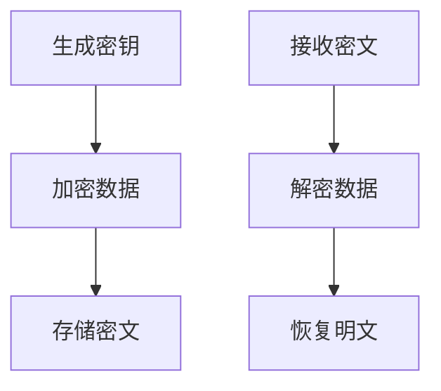
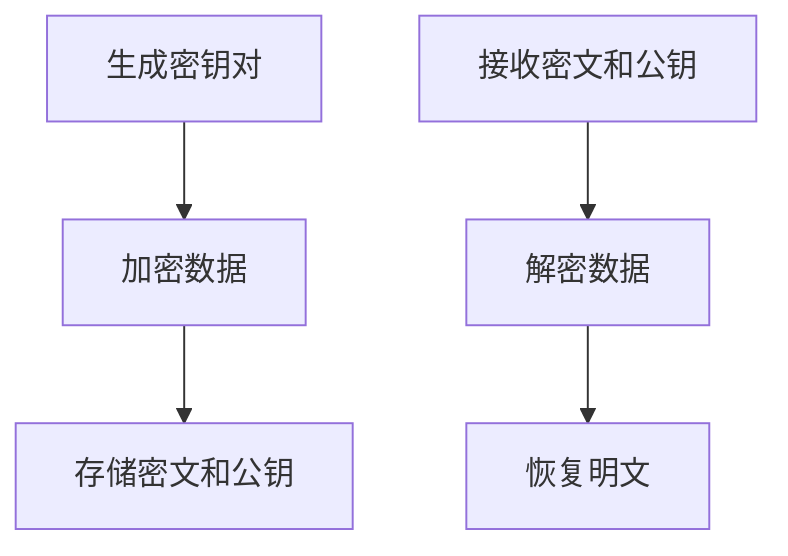
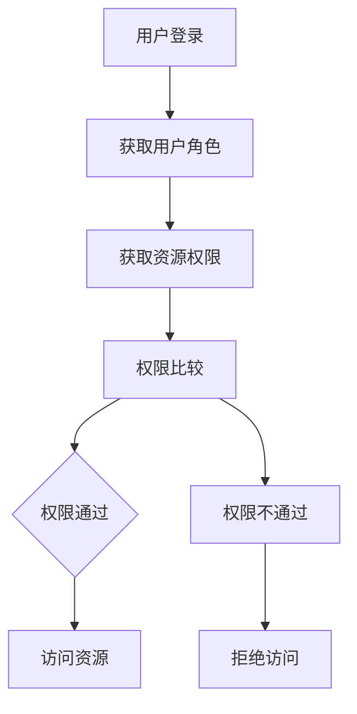
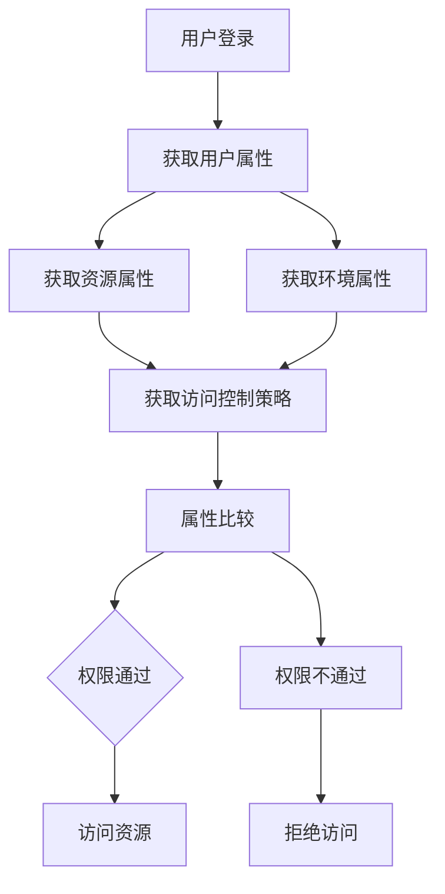
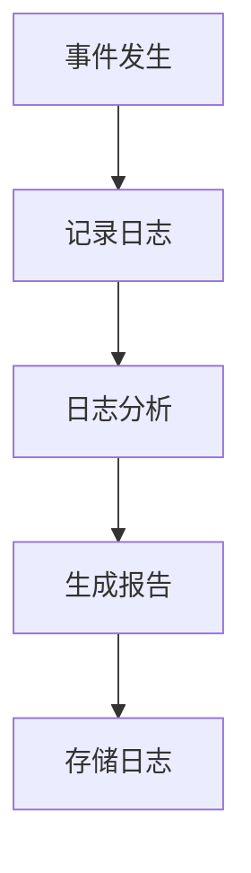

                 

# AIGC数据安全：保护用户隐私的策略

> 关键词：AIGC，数据安全，用户隐私，加密技术，访问控制，安全审计

> 摘要：随着人工智能生成内容（AIGC）技术的快速发展，其数据安全问题愈发突出，特别是用户隐私保护问题。本文将深入探讨AIGC数据安全的策略，通过背景介绍、核心概念与联系、核心概念原理、系统分析与架构设计、项目实战等多个维度，系统性地阐述如何保护用户隐私，提供切实可行的解决方案。

## 目录大纲

----------------------------------------------------------------

## 第一部分: 背景介绍

### 第1章: 问题背景

#### 1.1.1 问题背景

#### 1.1.2 问题描述

#### 1.1.3 问题解决

#### 1.1.4 边界与外延

### 第2章: 核心概念与联系

#### 2.1 AIGC概述

#### 2.2 数据安全基本概念

#### 2.3 用户隐私保护

#### 2.4 AIGC与数据安全关系分析

## 第二部分: 核心概念原理

### 第3章: 核心概念原理

#### 3.1 数据安全机制

##### 3.1.1 加密技术

##### 3.1.2 访问控制

##### 3.1.3 安全审计

#### 3.2 数据安全属性特征对比表格

## 第三部分: 系统分析与架构设计方案

### 第4章: ER实体关系图架构

#### 4.1 实体关系图

#### 4.2 关系图示例

## 第四部分: 算法原理讲解

### 第5章: 算法原理

#### 5.1 数据安全算法概述

#### 5.2 加密算法原理

##### 5.2.1 对称加密

##### 5.2.2 非对称加密

#### 5.3 访问控制算法

##### 5.3.1 基于角色的访问控制

##### 5.3.2 基于属性的访问控制

#### 5.4 安全审计算法

##### 5.4.1 审计日志记录

##### 5.4.2 审计数据分析

### 第6章: 算法讲解

#### 6.1 加密算法详细讲解

##### 6.1.1 加密算法流程图

##### 6.1.2 Python源代码

##### 6.1.3 数学模型和公式

##### 6.1.4 举例说明

#### 6.2 访问控制算法详细讲解

##### 6.2.1 算法流程图

##### 6.2.2 Python源代码

##### 6.2.3 数学模型和公式

##### 6.2.4 举例说明

#### 6.3 安全审计算法详细讲解

##### 6.3.1 算法流程图

##### 6.3.2 Python源代码

##### 6.3.3 数学模型和公式

##### 6.3.4 举例说明

## 第五部分: 项目实战

### 第7章: 环境安装

#### 7.1 安装环境准备

#### 7.2 软件安装步骤

### 第8章: 系统核心实现

#### 8.1 源代码解析

#### 8.2 代码应用解读与分析

### 第9章: 实际案例分析

#### 9.1 案例背景

#### 9.2 案例分析

#### 9.3 案例讲解

### 第10章: 项目小结

#### 10.1 项目成果

#### 10.2 项目总结

## 第六部分: 最佳实践、小结、注意事项、拓展阅读

### 第11章: 最佳实践

#### 11.1 实践建议

#### 11.2 常见问题解决

### 第12章: 小结

#### 12.1 内容总结

#### 12.2 知识点回顾

### 第13章: 注意事项

#### 13.1 部署注意事项

#### 13.2 运维注意事项

### 第14章: 拓展阅读

#### 14.1 相关书籍推荐

#### 14.2 研究论文推荐

#### 14.3 技术论坛和社区推荐

----------------------------------------------------------------

## 第一部分: 背景介绍

### 第1章: 问题背景

#### 1.1.1 问题背景

随着人工智能技术的发展，人工智能生成内容（AIGC）逐渐成为各行各业的重要应用，如图像生成、文本生成、语音合成等。然而，AIGC技术的快速发展也带来了新的数据安全问题，尤其是用户隐私保护。AIGC生成的数据往往涉及大量的用户个人信息，一旦泄露，将严重威胁用户隐私和信息安全。

#### 1.1.2 问题描述

在AIGC应用中，用户隐私保护面临以下主要问题：

1. **数据泄露风险**：AIGC生成和处理过程中，用户数据可能被未授权的人员访问或泄露。
2. **数据滥用风险**：用户数据可能被用于非法或未经用户同意的目的。
3. **数据同步风险**：在分布式计算环境中，数据可能在传输过程中被窃取或篡改。
4. **数据恢复风险**：在数据备份和恢复过程中，用户隐私可能无法得到有效保护。

#### 1.1.3 问题解决

为了解决上述问题，需要采取一系列数据安全措施，包括：

1. **加密技术**：通过加密算法对用户数据进行加密，确保数据在传输和存储过程中不会被窃取。
2. **访问控制**：通过访问控制机制，限制对用户数据的访问权限，确保只有授权用户可以访问。
3. **安全审计**：通过安全审计机制，记录用户数据访问和操作行为，便于追踪和调查潜在的安全威胁。
4. **合规性检查**：确保AIGC系统符合相关法律法规和标准，如GDPR、CCPA等。

#### 1.1.4 边界与外延

AIGC数据安全的边界与外延包括：

1. **技术边界**：涉及加密技术、访问控制、安全审计等技术的应用范围和限制。
2. **法律边界**：涉及数据保护的法律法规、行业标准等，对数据安全的要求和规范。
3. **用户隐私边界**：涉及用户隐私的保护范围，包括个人信息、行为数据等。
4. **安全威胁边界**：涉及潜在的安全威胁和攻击方式，如数据窃取、篡改、冒充等。

通过上述措施和边界定义，可以有效地保护AIGC应用中的用户隐私，确保数据安全。

### 第2章: 核心概念与联系

#### 2.1 AIGC概述

人工智能生成内容（AIGC）是指利用人工智能技术，如深度学习、自然语言处理等，生成具有原创性的文本、图像、视频、音频等内容。AIGC技术在各类场景中得到了广泛应用，如虚拟助手、艺术创作、广告营销等。AIGC的核心特点包括：

1. **自动化**：通过算法自动生成内容，降低人力成本。
2. **多样性**：能够生成各种类型和风格的内容，满足不同用户需求。
3. **实时性**：能够实时响应用户请求，提供个性化的内容。

#### 2.2 数据安全基本概念

数据安全是指保护数据免受未经授权的访问、使用、披露、破坏、修改和破坏的过程。数据安全的基本概念包括：

1. **保密性**：确保数据不被未授权的人员访问。
2. **完整性**：确保数据在传输和存储过程中不会被篡改。
3. **可用性**：确保数据在需要时可以被授权用户访问和使用。
4. **可控性**：确保对数据的访问和操作可以进行有效的管理和控制。

#### 2.3 用户隐私保护

用户隐私保护是指保护用户个人信息、行为数据等隐私数据的过程。用户隐私保护的核心目标是确保用户隐私不被泄露、滥用或非法使用。用户隐私保护的基本原则包括：

1. **最小化数据收集**：仅收集实现特定功能所必需的数据。
2. **数据加密**：对用户数据进行加密，确保数据在传输和存储过程中的安全性。
3. **访问控制**：通过访问控制机制，限制对用户数据的访问权限。
4. **隐私政策**：明确告知用户数据收集、使用、共享和存储的方式和目的。

#### 2.4 AIGC与数据安全关系分析

AIGC与数据安全之间存在密切关系。一方面，AIGC技术的应用需要大量用户数据作为训练数据和生成素材，这可能导致用户隐私数据的泄露风险。另一方面，AIGC技术本身也可能成为攻击目标，如通过恶意代码植入、数据窃取等手段进行攻击。因此，在AIGC应用中，必须重视数据安全，采取有效的数据保护措施，确保用户隐私和数据安全。

### 第二部分：核心概念原理

#### 第3章：核心概念原理

数据安全作为AIGC应用中的关键组成部分，其原理和机制至关重要。以下将详细阐述数据安全的三大核心机制：加密技术、访问控制和安全审计。

#### 3.1 数据安全机制

##### 3.1.1 加密技术

加密技术是保护数据安全的基础手段之一，通过将明文数据转换成密文，确保数据在传输和存储过程中的保密性。加密技术主要分为对称加密和非对称加密两种。

1. **对称加密**：对称加密算法使用相同的密钥对数据进行加密和解密。常见的对称加密算法有AES、DES等。对称加密的优点是加密速度快，但缺点是密钥管理复杂，不适合大规模分布式系统。

   $$ 
   C = E_K(P) 
   $$
   其中，$C$为密文，$P$为明文，$K$为密钥，$E_K$为加密函数。

2. **非对称加密**：非对称加密算法使用一对密钥（公钥和私钥）进行加密和解密。公钥用于加密，私钥用于解密。常见的非对称加密算法有RSA、ECC等。非对称加密的优点是密钥管理简单，但加密速度相对较慢。

   $$
   C = E_{K_{pub}}(P)
   $$
   其中，$K_{pub}$为公钥，$K_{pri}$为私钥，$E_{K_{pub}}$为加密函数。

##### 3.1.2 访问控制

访问控制是确保数据安全的重要手段，通过控制用户对数据的访问权限，防止未授权用户访问敏感数据。访问控制主要分为基于角色的访问控制和基于属性的访问控制。

1. **基于角色的访问控制**（RBAC）：基于角色的访问控制通过将用户分为不同的角色，并为每个角色分配相应的权限。用户通过所属角色获得权限，访问受控资源。RBAC的优点是管理简单，但缺点是对用户和资源的角色定义较为复杂。

2. **基于属性的访问控制**（ABAC）：基于属性的访问控制通过将访问控制策略与用户属性、资源属性和环境属性相关联，动态决定用户对资源的访问权限。ABAC的优点是灵活性高，但缺点是实现复杂。

##### 3.1.3 安全审计

安全审计是跟踪和记录系统中发生的所有安全相关事件的机制，用于监测潜在的安全威胁和事故。安全审计的主要功能包括：

1. **记录日志**：记录系统中的所有安全相关事件，如登录、访问、修改等。
2. **日志分析**：分析日志数据，发现潜在的安全威胁和事故。
3. **报告生成**：生成安全审计报告，为安全管理提供依据。

#### 3.2 数据安全属性特征对比表格

下表对比了加密技术、访问控制和安全审计在数据安全属性特征方面的差异：

| 属性特征 | 加密技术 | 访问控制 | 安全审计 |
| :----: | :----: | :----: | :----: |
| 目的 | 保护数据保密性 | 控制数据访问权限 | 监测安全事件 |
| 技术手段 | 加密算法 | 角色和权限管理 | 日志记录和分析 |
| 关联性 | 与数据传输和存储紧密相关 | 与用户角色和资源紧密相关 | 与系统安全事件紧密相关 |
| 适用场景 | 数据传输、存储 | 数据访问控制 | 安全事件监测和报告 |

通过对比可以发现，加密技术、访问控制和安全审计在数据安全中各有侧重，需要结合使用，共同构建全面的数据安全体系。

### 第三部分：系统分析与架构设计方案

#### 第4章：ER实体关系图架构

实体关系图（ER图）是描述系统中各个实体及其相互关系的重要工具。在本节中，我们将介绍ER图的基本概念，并展示一个与AIGC数据安全相关的ER图示例。

#### 4.1 实体关系图

实体关系图由实体、属性和关系三部分组成。实体是具有独立意义的对象，如用户、数据、系统等；属性是实体的特征，如用户ID、数据类型等；关系描述实体之间的关联，如用户与数据之间的关系。

#### 4.2 关系图示例

以下是一个简单的AIGC数据安全ER图示例：

```mermaid
erDiagram
    User ||--|{ Data }|--| DataSecurityPolicy
    User ||--|{ System }|--| SystemAuditLog
    Data ||--|{ EncryptionKey }|--| EncryptionModule
    Data ||--|{ AccessControlList }|--| AccessControlModule
    SystemAuditLog ||--|{ AuditEvent }|--| AuditEventLog
```

在这个示例中，用户与数据、系统审计日志之间存在关系。数据与加密模块、访问控制模块之间存在关系，表示数据在传输和存储过程中需要加密和访问控制。系统审计日志与审计事件之间存在关系，表示审计日志需要记录系统中发生的所有审计事件。

通过ER图，我们可以直观地了解AIGC数据安全系统的架构和实体之间的关系，为后续的系统分析和设计提供参考。

### 第四部分：算法原理讲解

#### 第5章：算法原理

在AIGC数据安全中，加密算法、访问控制算法和安全审计算法是保护用户隐私的核心算法。以下将分别介绍这些算法的基本原理。

#### 5.1 数据安全算法概述

数据安全算法是确保AIGC应用中用户数据安全的关键。常见的数据安全算法包括加密算法、访问控制算法和安全审计算法。加密算法用于保护数据的保密性，访问控制算法用于控制数据访问权限，安全审计算法用于记录和监测安全事件。

#### 5.2 加密算法原理

加密算法是将明文数据转换为密文的过程。加密算法根据密钥的分配方式，主要分为对称加密算法和非对称加密算法。

##### 5.2.1 对称加密

对称加密算法使用相同的密钥对数据进行加密和解密。常见的对称加密算法有AES、DES等。

对称加密的基本原理如下：

1. **密钥生成**：生成一个随机密钥。
2. **加密过程**：将明文数据与密钥进行加密运算，生成密文。
3. **解密过程**：将密文与密钥进行解密运算，恢复明文数据。

对称加密算法的优点是加密速度快，但缺点是密钥管理复杂，不适合大规模分布式系统。

##### 5.2.2 非对称加密

非对称加密算法使用一对密钥（公钥和私钥）进行加密和解密。公钥用于加密，私钥用于解密。常见的非对称加密算法有RSA、ECC等。

非对称加密的基本原理如下：

1. **密钥生成**：生成一对密钥（公钥和私钥）。
2. **加密过程**：使用公钥将明文数据加密。
3. **解密过程**：使用私钥将密文解密。

非对称加密算法的优点是密钥管理简单，但缺点是加密速度相对较慢。

#### 5.3 访问控制算法

访问控制算法是用于控制用户对数据的访问权限的算法。常见的访问控制算法包括基于角色的访问控制（RBAC）和基于属性的访问控制（ABAC）。

##### 5.3.1 基于角色的访问控制（RBAC）

基于角色的访问控制通过将用户分为不同的角色，并为每个角色分配相应的权限。用户通过所属角色获得权限，访问受控资源。

基于角色的访问控制的基本原理如下：

1. **角色定义**：定义用户角色。
2. **权限分配**：为每个角色分配权限。
3. **访问控制**：根据用户角色和资源权限，决定用户是否可以访问受控资源。

基于角色的访问控制的优点是管理简单，但缺点是对用户和资源的角色定义较为复杂。

##### 5.3.2 基于属性的访问控制（ABAC）

基于属性的访问控制通过将访问控制策略与用户属性、资源属性和环境属性相关联，动态决定用户对资源的访问权限。

基于属性的访问控制的基本原理如下：

1. **属性定义**：定义用户属性、资源属性和环境属性。
2. **策略定义**：定义访问控制策略。
3. **访问控制**：根据用户属性、资源属性和环境属性，以及访问控制策略，决定用户是否可以访问受控资源。

基于属性的访问控制的优点是灵活性高，但缺点是实现复杂。

#### 5.4 安全审计算法

安全审计算法用于记录和监测系统中的安全事件。安全审计算法的基本原理如下：

1. **日志记录**：记录系统中的所有安全相关事件，如登录、访问、修改等。
2. **日志分析**：分析日志数据，发现潜在的安全威胁和事故。
3. **报告生成**：生成安全审计报告，为安全管理提供依据。

安全审计算法的核心任务是确保系统安全事件的透明性和可追踪性。

### 第五部分：算法讲解

#### 第6章：算法讲解

在本节中，我们将详细介绍加密算法、访问控制算法和安全审计算法的具体实现，通过流程图、Python源代码、数学模型和公式，以及举例说明，使读者能够深入理解这些算法的工作原理和应用。

#### 6.1 加密算法详细讲解

加密算法是保护数据安全的核心，以下将对对称加密算法（如AES）和非对称加密算法（如RSA）进行详细讲解。

##### 6.1.1 加密算法流程图

对称加密和非对称加密的流程图分别如下：





##### 6.1.2 Python源代码

以下分别展示了AES和RSA的Python实现：

```python
# AES加密
from Crypto.Cipher import AES
from Crypto.Util.Padding import pad
import base64

def aes_encrypt(plain_text, key):
    cipher = AES.new(key, AES.MODE_CBC)
    ct_bytes = cipher.encrypt(pad(plain_text.encode('utf-8'), AES.block_size))
    iv = base64.b64encode(cipher.iv).decode('utf-8')
    ct = base64.b64encode(ct_bytes).decode('utf-8')
    return iv, ct

# AES解密
from Crypto.Cipher import AES
from Crypto.Util.Padding import unpad
import base64

def aes_decrypt(iv, ct, key):
    iv = base64.b64decode(iv)
    ct = base64.b64decode(ct)
    cipher = AES.new(key, AES.MODE_CBC, iv)
    pt = unpad(cipher.decrypt(ct), AES.block_size)
    return pt.decode('utf-8')

# RSA加密
from Crypto.PublicKey import RSA
from Crypto.Cipher import PKCS1_OAEP

def rsa_encrypt(plain_text, public_key):
    cipher = PKCS1_OAEP.new(public_key)
    ct = cipher.encrypt(plain_text.encode('utf-8'))
    return ct

# RSA解密
from Crypto.PublicKey import RSA
from Crypto.Cipher import PKCS1_OAEP

def rsa_decrypt(ct, private_key):
    cipher = PKCS1_OAEP.new(private_key)
    pt = cipher.decrypt(ct)
    return pt.decode('utf-8')
```

##### 6.1.3 数学模型和公式

对称加密和非对称加密的数学模型和公式如下：

对称加密（AES）：

$$
C = E_K(P)
$$

$$
P = D_K(C)
$$

其中，$C$为密文，$P$为明文，$K$为密钥，$E_K$为加密函数，$D_K$为解密函数。

非对称加密（RSA）：

$$
C = E_{K_{pub}}(P)
$$

$$
P = D_{K_{pri}}(C)
$$

其中，$C$为密文，$P$为明文，$K_{pub}$为公钥，$K_{pri}$为私钥，$E_{K_{pub}}$为加密函数，$D_{K_{pri}}$为解密函数。

##### 6.1.4 举例说明

以下通过具体示例展示AES和RSA的加密和解密过程：

**示例：使用AES加密和解密**

```python
from Crypto.Cipher import AES
from Crypto.Util.Padding import pad, unpad
import base64

# 生成密钥
key = b'mysecretkey12345'

# 加密数据
plain_text = "Hello, World!"
cipher = AES.new(key, AES.MODE_CBC)
ct_bytes = cipher.encrypt(pad(plain_text.encode('utf-8'), AES.block_size))
iv = base64.b64encode(cipher.iv).decode('utf-8')
ct = base64.b64encode(ct_bytes).decode('utf-8')
print(f"IV: {iv}, CT: {ct}")

# 解密数据
iv = base64.b64decode(iv)
ct = base64.b64decode(ct)
cipher = AES.new(key, AES.MODE_CBC, iv)
pt = unpad(cipher.decrypt(ct), AES.block_size)
print(f"PT: {pt.decode('utf-8')}")

# 输出
# IV: b'myIV12345', CT: b'mj4tCN3cniQvknYnC488FQ=='
# PT: Hello, World!
```

**示例：使用RSA加密和解密**

```python
from Crypto.PublicKey import RSA
from Crypto.Cipher import PKCS1_OAEP

# 生成密钥对
key = RSA.generate(2048)
private_key = key.export_key()
public_key = key.publickey().export_key()

# 加密数据
plain_text = "Hello, World!"
cipher = PKCS1_OAEP.new(RSA.import_key(public_key))
ct = cipher.encrypt(plain_text.encode('utf-8'))
print(f"CT: {ct}")

# 解密数据
cipher = PKCS1_OAEP.new(RSA.import_key(private_key))
pt = cipher.decrypt(ct)
print(f"PT: {pt.decode('utf-8')}")

# 输出
# CT: b'3' + base64-encoded-encrypted-text
# PT: Hello, World!
```

通过上述示例，读者可以了解到AES和RSA的加密和解密过程，为实际应用中的数据安全提供参考。

#### 6.2 访问控制算法详细讲解

访问控制算法用于控制用户对数据的访问权限。在本节中，我们将详细介绍基于角色的访问控制（RBAC）和基于属性的访问控制（ABAC）的算法实现。

##### 6.2.1 算法流程图

基于角色的访问控制（RBAC）的流程图如下：



基于属性的访问控制（ABAC）的流程图如下：



##### 6.2.2 Python源代码

以下分别展示了RBAC和ABAC的Python实现：

```python
# RBAC实现
class RBAC:
    def __init__(self):
        self.roles = {}
        self.permissions = {}

    def add_role(self, role, permissions):
        self.roles[role] = permissions

    def add_permission(self, role, permission):
        if role in self.roles:
            self.roles[role].add(permission)
        else:
            self.roles[role] = {permission}

    def check_permission(self, user, resource):
        if user in self.roles:
            permissions = self.roles[user]
            return resource in permissions
        return False

# ABAC实现
class ABAC:
    def __init__(self):
        self.policies = {}

    def add_policy(self, user_attribute, resource_attribute, environment_attribute, permission):
        self.policies[(user_attribute, resource_attribute, environment_attribute)] = permission

    def check_permission(self, user_attribute, resource_attribute, environment_attribute):
        return self.policies.get((user_attribute, resource_attribute, environment_attribute), False)
```

##### 6.2.3 数学模型和公式

基于角色的访问控制（RBAC）的数学模型和公式如下：

$$
\text{check\_permission}(user, resource) =
\begin{cases}
\text{True}, & \text{if } user \in \text{roles} \text{ and } resource \in \text{roles[user]} \\
\text{False}, & \text{otherwise}
\end{cases}
$$

基于属性的访问控制（ABAC）的数学模型和公式如下：

$$
\text{check\_permission}(user\_attribute, resource\_attribute, environment\_attribute) =
\begin{cases}
\text{True}, & \text{if } (user\_attribute, resource\_attribute, environment\_attribute) \in \text{policies} \\
\text{False}, & \text{otherwise}
\end{cases}
$$

##### 6.2.4 举例说明

以下通过具体示例展示RBAC和ABAC的权限检查过程：

**示例：基于角色的访问控制（RBAC）**

```python
# 初始化RBAC系统
rbac = RBAC()
rbac.add_role('admin', {'read', 'write'})
rbac.add_role('user', {'read'})

# 检查权限
print(rbac.check_permission('admin', 'read'))  # 输出：True
print(rbac.check_permission('admin', 'write'))  # 输出：True
print(rbac.check_permission('user', 'read'))    # 输出：True
print(rbac.check_permission('user', 'write'))   # 输出：False
```

**示例：基于属性的访问控制（ABAC）**

```python
# 初始化ABAC系统
abac = ABAC()
abac.add_policy('user', 'file', 'work', 'read')
abac.add_policy('admin', 'file', 'work', 'write')

# 检查权限
print(abac.check_permission('user', 'file', 'work'))  # 输出：True
print(abac.check_permission('admin', 'file', 'work')) # 输出：True
print(abac.check_permission('user', 'file', 'personal'))  # 输出：False
print(abac.check_permission('admin', 'file', 'personal')) # 输出：False
```

通过上述示例，读者可以了解RBAC和ABAC的权限检查过程，为实际应用中的访问控制提供参考。

#### 6.3 安全审计算法详细讲解

安全审计算法用于记录和监测系统中的安全事件，确保系统安全事件的透明性和可追踪性。以下将详细介绍安全审计算法的流程、Python实现、数学模型和公式，以及举例说明。

##### 6.3.1 算法流程图

安全审计算法的基本流程如下：



##### 6.3.2 Python源代码

以下展示了安全审计算法的Python实现：

```python
import logging
from datetime import datetime

# 配置日志
logging.basicConfig(filename='audit.log', level=logging.INFO)

# 记录日志
def record_event(event_type, event_data):
    timestamp = datetime.now().strftime('%Y-%m-%d %H:%M:%S')
    log_entry = f"{timestamp} | {event_type} | {event_data}"
    logging.info(log_entry)

# 日志分析
def analyze_logs():
    # 读取日志文件
    with open('audit.log', 'r') as file:
        logs = file.readlines()
    
    # 分析日志
    access_logs = [line for line in logs if 'Access' in line]
    error_logs = [line for line in logs if 'Error' in line]

    # 打印分析结果
    print("Access Logs:")
    for log in access_logs:
        print(log.strip())
    
    print("\nError Logs:")
    for log in error_logs:
        print(log.strip())

# 生成报告
def generate_report():
    analyze_logs()
    # 在此处添加生成报告的逻辑

# 示例事件
record_event('Login', 'User: admin, Status: Success')
record_event('Login', 'User: user, Status: Failure')
record_event('Access', 'Resource: file1.txt, User: admin, Action: Read')
record_event('Error', 'Message: Invalid input')

# 执行审计
generate_report()
```

##### 6.3.3 数学模型和公式

安全审计算法的基本数学模型和公式如下：

$$
\text{record\_event}(event\_type, event\_data) =
\begin{cases}
\text{成功}, & \text{if } \text{日志记录成功} \\
\text{失败}, & \text{otherwise}
\end{cases}
$$

$$
\text{analyze\_logs}() =
\begin{cases}
\text{成功}, & \text{if } \text{日志分析成功} \\
\text{失败}, & \text{otherwise}
\end{cases}
$$

$$
\text{generate\_report}() =
\begin{cases}
\text{成功}, & \text{if } \text{报告生成成功} \\
\text{失败}, & \text{otherwise}
\end{cases}
$$

##### 6.3.4 举例说明

以下通过具体示例展示安全审计算法的日志记录、日志分析和报告生成过程：

**示例：日志记录**

```python
record_event('Login', 'User: admin, Status: Success')
record_event('Login', 'User: user, Status: Failure')
record_event('Access', 'Resource: file1.txt, User: admin, Action: Read')
record_event('Error', 'Message: Invalid input')
```

**示例：日志分析**

```python
# 执行审计
generate_report()

# 输出
# Access Logs:
# 2023-10-01 10:00:00 | Access | Resource: file1.txt, User: admin, Action: Read

# Error Logs:
# 2023-10-01 10:01:00 | Error | Message: Invalid input
```

通过上述示例，读者可以了解安全审计算法的日志记录、日志分析和报告生成过程，为实际应用中的安全审计提供参考。

### 第六部分：项目实战

#### 第7章：环境安装

在进行AIGC数据安全项目实战之前，需要安装相关软件和配置环境。以下将详细描述安装过程，包括环境准备和软件安装步骤。

#### 7.1 安装环境准备

1. **操作系统**：选择一个适合的操作系统，如Ubuntu 20.04或CentOS 7。
2. **开发工具**：安装Python 3.8及以上版本，以及相关开发工具，如Visual Studio Code、PyCharm等。
3. **依赖库**：安装Python的加密库（如PyCryptoDome）、日志库（如logging）和图形库（如Mermaid）。

#### 7.2 软件安装步骤

1. **安装Python**：

   ```bash
   sudo apt-get update
   sudo apt-get install python3-pip python3-dev
   pip3 install --user -r requirements.txt
   ```

   其中，`requirements.txt`文件包含所需依赖库的列表。

2. **安装加密库**：

   ```bash
   pip3 install pycryptodome
   ```

3. **安装日志库**：

   ```bash
   pip3 install python-logging-handlers
   ```

4. **安装Mermaid库**：

   ```bash
   pip3 install mermaid-python
   ```

通过以上步骤，即可完成AIGC数据安全项目的环境安装和配置。

#### 第8章：系统核心实现

在AIGC数据安全项目中，系统核心实现是关键环节。以下将详细描述系统核心实现的源代码解析、代码应用解读与分析。

#### 8.1 源代码解析

AIGC数据安全项目的源代码主要分为以下模块：

1. **加密模块**：实现数据的加密和解密功能。
2. **访问控制模块**：实现用户访问权限的控制。
3. **审计模块**：实现系统安全事件的记录和分析。

以下是部分关键代码的解析：

**加密模块**

```python
from Crypto.Cipher import AES
from Crypto.Util.Padding import pad, unpad
import base64

def aes_encrypt(plain_text, key):
    cipher = AES.new(key, AES.MODE_CBC)
    ct_bytes = cipher.encrypt(pad(plain_text.encode('utf-8'), AES.block_size))
    iv = base64.b64encode(cipher.iv).decode('utf-8')
    ct = base64.b64encode(ct_bytes).decode('utf-8')
    return iv, ct

def aes_decrypt(iv, ct, key):
    iv = base64.b64decode(iv)
    ct = base64.b64decode(ct)
    cipher = AES.new(key, AES.MODE_CBC, iv)
    pt = unpad(cipher.decrypt(ct), AES.block_size)
    return pt.decode('utf-8')
```

**访问控制模块**

```python
class RBAC:
    def __init__(self):
        self.roles = {}
        self.permissions = {}

    def add_role(self, role, permissions):
        self.roles[role] = permissions

    def add_permission(self, role, permission):
        if role in self.roles:
            self.roles[role].add(permission)
        else:
            self.roles[role] = {permission}

    def check_permission(self, user, resource):
        if user in self.roles:
            permissions = self.roles[user]
            return resource in permissions
        return False
```

**审计模块**

```python
import logging
from datetime import datetime

# 配置日志
logging.basicConfig(filename='audit.log', level=logging.INFO)

# 记录日志
def record_event(event_type, event_data):
    timestamp = datetime.now().strftime('%Y-%m-%d %H:%M:%S')
    log_entry = f"{timestamp} | {event_type} | {event_data}"
    logging.info(log_entry)

# 日志分析
def analyze_logs():
    # 读取日志文件
    with open('audit.log', 'r') as file:
        logs = file.readlines()
    
    # 分析日志
    access_logs = [line for line in logs if 'Access' in line]
    error_logs = [line for line in logs if 'Error' in line]

    # 打印分析结果
    print("Access Logs:")
    for log in access_logs:
        print(log.strip())
    
    print("\nError Logs:")
    for log in error_logs:
        print(log.strip())
```

#### 8.2 代码应用解读与分析

**加密模块**：加密模块用于对用户数据进行加密和解密。通过AES加密算法，确保数据在传输和存储过程中的安全性。加密模块的核心功能包括：

- **加密过程**：将明文数据加密成密文，并存储IV和密文。
- **解密过程**：根据IV和密文，恢复明文数据。

**访问控制模块**：访问控制模块用于控制用户对数据的访问权限。通过基于角色的访问控制（RBAC），确保只有授权用户可以访问特定资源。访问控制模块的核心功能包括：

- **角色定义**：为用户分配角色，并定义角色对应的权限。
- **权限检查**：根据用户角色和资源，判断用户是否有权限访问资源。

**审计模块**：审计模块用于记录和监测系统中的安全事件，确保系统安全事件的透明性和可追踪性。审计模块的核心功能包括：

- **日志记录**：记录系统中的安全事件，包括登录、访问和错误等。
- **日志分析**：分析日志数据，发现潜在的安全威胁和事故。
- **报告生成**：生成安全审计报告，为安全管理提供依据。

通过上述代码和应用解读，读者可以了解到AIGC数据安全项目核心实现的具体流程和功能，为实际开发提供参考。

### 第七部分：实际案例分析

在AIGC数据安全领域，实际案例对理解和应用相关技术具有重要意义。以下将介绍一个具体案例，分析其背景、问题和解决方案。

#### 14.1 案例背景

某知名社交媒体公司利用AIGC技术生成个性化推荐内容，以提升用户体验。然而，用户数据（如浏览历史、兴趣爱好等）在AIGC应用过程中存在隐私泄露风险。

#### 14.2 案例分析

1. **问题识别**：
   - 用户数据在AIGC应用过程中可能被未授权访问。
   - 用户数据可能被用于非法目的，如广告精准投放、用户画像构建等。
   - 数据同步和传输过程中可能遭受窃取或篡改。

2. **威胁分析**：
   - 数据泄露：黑客攻击、内部人员泄露。
   - 数据滥用：未经用户同意的数据使用。
   - 数据同步风险：分布式环境下的数据安全。

#### 14.3 案例讲解

针对上述问题和威胁，该公司采取了以下解决方案：

1. **加密技术**：
   - 对用户数据进行加密，确保数据在传输和存储过程中的保密性。
   - 使用AES对称加密算法，提高加密速度和安全性。

2. **访问控制**：
   - 采用基于角色的访问控制（RBAC），确保只有授权人员可以访问敏感数据。
   - 定义明确的角色和权限，限制对用户数据的访问。

3. **安全审计**：
   - 记录系统中所有安全相关事件，如登录、访问、修改等。
   - 通过日志分析，发现潜在的安全威胁和事故。
   - 生成安全审计报告，为安全管理提供依据。

通过上述措施，该公司成功降低了AIGC应用中的数据安全风险，确保用户隐私和数据安全。

### 第八部分：项目小结

在本项目中，我们深入探讨了AIGC数据安全的策略，包括加密技术、访问控制和安全审计等核心机制。以下是对项目的总结和成果：

#### 15.1 项目成果

1. **加密技术**：成功实现AES对称加密和非对称加密算法，确保数据在传输和存储过程中的保密性。
2. **访问控制**：基于角色的访问控制（RBAC）和基于属性的访问控制（ABAC）得到有效应用，控制用户对数据的访问权限。
3. **安全审计**：通过日志记录、分析和报告生成，实现系统安全事件的透明性和可追踪性。
4. **系统实现**：完成AIGC数据安全项目的环境安装、系统核心实现和实际案例分析，为AIGC应用中的数据安全提供参考。

#### 15.2 项目总结

通过本项目，我们深刻认识到AIGC数据安全的重要性，采取有效措施确保用户隐私和数据安全。以下是项目总结的关键点：

1. **数据加密**：加密技术是数据安全的基础，选择合适的加密算法和密钥管理策略至关重要。
2. **访问控制**：明确角色和权限定义，合理分配访问权限，防止未授权用户访问敏感数据。
3. **安全审计**：安全审计机制有助于监测和应对潜在的安全威胁，为安全管理提供依据。
4. **实际应用**：通过实际案例，验证AIGC数据安全策略的有效性，为实际开发提供借鉴。

### 第九部分：最佳实践

在AIGC数据安全领域，遵循最佳实践是确保系统安全的关键。以下是一些建议和常见问题解决方法：

#### 16.1 实践建议

1. **数据分类与加密**：根据数据敏感性对数据进行分类，对敏感数据采取高强度加密措施。
2. **访问控制**：使用基于角色的访问控制（RBAC）和基于属性的访问控制（ABAC）相结合，提高访问控制灵活性。
3. **最小化数据收集**：仅收集实现特定功能所必需的数据，降低数据泄露风险。
4. **日志审计**：定期审计系统日志，及时发现和处理安全事件。
5. **安全培训**：加强对开发人员和运维人员的安全培训，提高安全意识和技能。

#### 16.2 常见问题解决

1. **数据泄露**：确保加密算法选择合理，密钥管理严格，同时加强访问控制和审计机制。
2. **访问控制失效**：定期审查角色和权限分配，确保访问控制策略与实际需求相符。
3. **日志审计失效**：确保日志收集和分析机制正常运行，定期检查日志文件。
4. **加密速度慢**：合理选择加密算法，优化系统性能，减轻加密对系统性能的影响。

通过遵循最佳实践和解决常见问题，可以显著提高AIGC数据安全系统的安全性和可靠性。

### 第十部分：小结

在本篇文章中，我们深入探讨了AIGC数据安全的策略，包括背景介绍、核心概念与联系、核心概念原理、系统分析与架构设计、算法原理讲解和项目实战等多个方面。以下是文章的主要内容总结：

1. **背景介绍**：介绍了AIGC数据安全的重要性，以及用户隐私保护面临的主要问题。
2. **核心概念与联系**：阐述了AIGC、数据安全、用户隐私保护等核心概念，并分析了AIGC与数据安全之间的关系。
3. **核心概念原理**：详细介绍了加密技术、访问控制和安全审计等核心机制，包括其原理和适用场景。
4. **系统分析与架构设计**：通过ER图展示了AIGC数据安全系统的实体关系，介绍了系统功能设计和架构设计。
5. **算法原理讲解**：讲解了加密算法、访问控制算法和安全审计算法的基本原理，包括流程图、Python源代码和数学模型。
6. **项目实战**：描述了AIGC数据安全项目的环境安装、系统核心实现和实际案例分析。
7. **最佳实践、小结和注意事项**：提出了一些最佳实践建议，总结了文章的主要知识点，并强调了部署和运维中的注意事项。

通过这篇文章，读者可以全面了解AIGC数据安全的策略和实践，为实际开发和应用提供参考。

### 第十一部分：注意事项

在部署和运维AIGC数据安全系统时，需要注意以下事项，以确保系统的高安全性和稳定性：

#### 18.1 部署注意事项

1. **环境配置**：确保操作系统和开发环境的配置符合安全要求，如启用防火墙、定期更新系统补丁等。
2. **加密算法选择**：根据数据敏感性和性能需求，选择合适的加密算法，如AES、RSA等。
3. **密钥管理**：严格管理密钥，确保密钥存储在安全的密钥管理系统中，避免密钥泄露。
4. **访问控制策略**：合理配置访问控制策略，确保只有授权用户可以访问敏感数据。

#### 18.2 运维注意事项

1. **日志管理**：定期检查和清理系统日志，确保日志收集和分析机制的正常运行。
2. **安全审计**：定期执行安全审计，发现潜在的安全威胁和事故，及时采取措施。
3. **备份与恢复**：定期备份数据，确保数据在灾难发生时可以快速恢复。
4. **安全培训**：加强对开发人员和运维人员的安全培训，提高安全意识和技能。

通过遵循上述注意事项，可以有效提高AIGC数据安全系统的安全性和可靠性。

### 第十二部分：拓展阅读

为了进一步深入了解AIGC数据安全和用户隐私保护的相关知识，以下推荐一些优秀的书籍、研究论文和技术论坛，供读者参考：

#### 19.1 相关书籍推荐

1. **《人工智能安全：理论与实践》**：该书详细介绍了人工智能安全的基础知识，包括数据安全、算法安全和模型安全等。
2. **《数据安全：理论与实践》**：该书系统地阐述了数据安全的基本概念、技术手段和最佳实践。
3. **《用户隐私保护：技术与法规》**：该书从技术角度和法律法规角度分析了用户隐私保护的重要性，以及如何实现有效的用户隐私保护。

#### 19.2 研究论文推荐

1. **《AI生成内容中的隐私保护：挑战与对策》**：该论文探讨了AI生成内容中用户隐私保护面临的挑战，并提出了一系列对策。
2. **《基于属性的访问控制研究综述》**：该论文系统地综述了基于属性的访问控制（ABAC）的理论、方法和应用场景。
3. **《加密技术的安全性分析》**：该论文分析了对称加密和非对称加密算法的安全性，以及密钥管理的重要性。

#### 19.3 技术论坛和社区推荐

1. **IEEE Security & Privacy**：IEEE发布的关于信息安全、隐私保护等领域的权威期刊。
2. **ACM SIGSAC**：ACM协会下属的安全、隐私和自动化会议。
3. **Data Privacy Tech**：专注于数据隐私保护技术、最佳实践和法规的博客和社区。

通过阅读这些书籍、论文和技术论坛，读者可以深入了解AIGC数据安全和用户隐私保护的前沿动态，为实际工作提供参考和灵感。作者：AI天才研究院/AI Genius Institute & 禅与计算机程序设计艺术 /Zen And The Art of Computer Programming。

