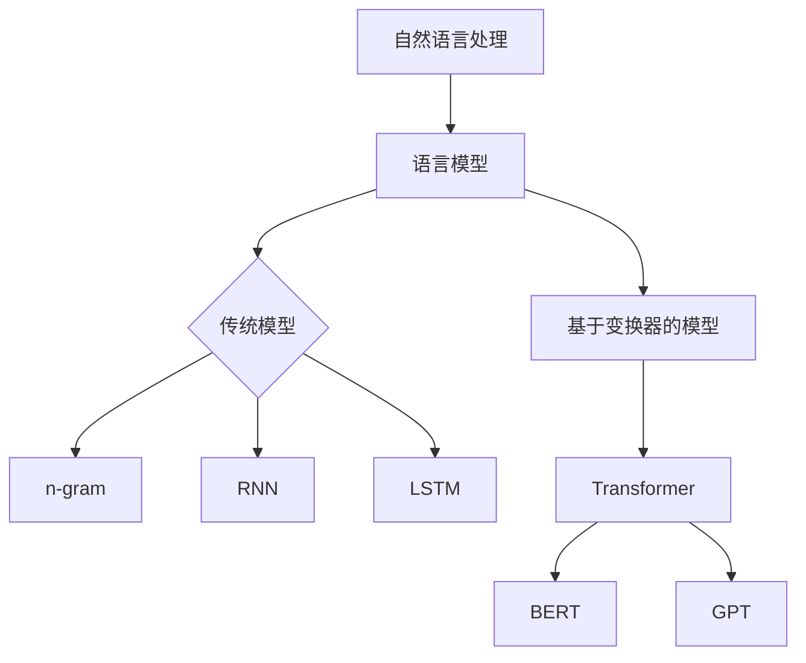
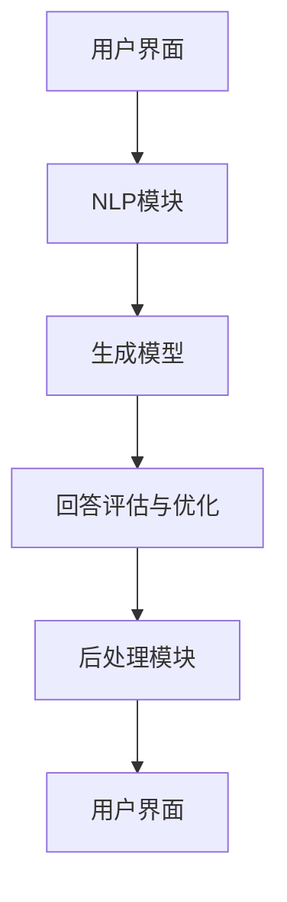
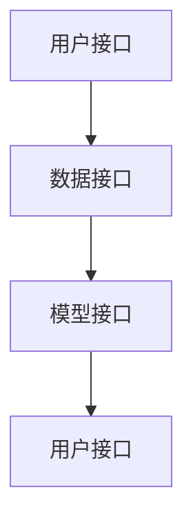
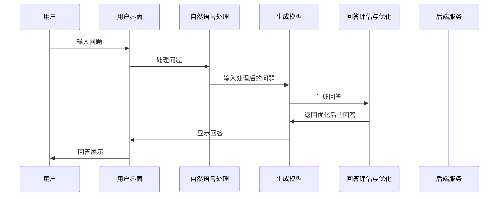

                 

**引言与背景**

### **AIGC的概念**

AIGC，即人工智能生成内容（Artificial Intelligence Generated Content），是近年来随着人工智能技术的迅猛发展而崭露头角的一个新兴领域。AIGC指的是利用人工智能技术，尤其是生成式AI（Generative AI），自动生成文本、图像、音频、视频等多种形式的内容。这一概念涵盖了从原始数据输入到生成高质量内容的整个流程。

### **AIGC的发展历程**

AIGC的发展历程可以追溯到20世纪80年代，当时生成式AI的基本原理就已经被提出。然而，由于计算能力和算法的限制，AIGC的发展一直较为缓慢。直到21世纪初，随着深度学习技术的兴起，AIGC开始获得快速发展。特别是2014年，谷歌提出了一种名为“生成对抗网络”（GAN）的深度学习模型，使得AIGC技术在图像生成领域取得了重大突破。近年来，随着语言模型（如GPT系列）的不断发展，AIGC在文本生成领域也取得了显著成果。

### **AIGC的时代意义**

AIGC的出现，不仅标志着人工智能技术的一个新阶段，也对社会产生了深远的影响。首先，AIGC使得内容创作变得更加高效和便捷，能够极大地提高生产力。其次，AIGC在医疗、教育、娱乐、新闻等多个领域具有广泛的应用前景，能够为社会带来更多创新和变革。此外，AIGC还引发了关于版权、隐私、伦理等问题的讨论，要求我们在技术发展的同时，也要关注社会和伦理问题。

### **提示词工程学的概念与重要性**

#### **提示词的定义**

在AIGC领域，提示词（Prompt）是指用于引导人工智能模型生成内容的输入。一个有效的提示词不仅能够明确地指导模型生成所需的内容，还能提升生成内容的多样性和质量。

#### **提示词工程学的核心要素**

提示词工程学的核心要素包括：

- **提示词设计原则**：如何设计一个有效的提示词，需要遵循一系列原则，如明确性、简洁性、适应性等。
- **提示词优化策略**：在生成内容的过程中，如何对提示词进行优化，以提升生成质量。
- **语言模型**：语言模型是提示词工程学的基础，一个优秀的语言模型能够更好地理解和生成文本。

#### **提示词工程学与AIGC的关系**

提示词工程学是AIGC的关键技术之一，它不仅直接影响了生成内容的质量和效率，还在很大程度上决定了AIGC的应用范围和深度。有效的提示词工程学能够提升AIGC的性能，为各个领域的应用提供更强的支持。

### **提示词工程学的理论基础**

#### **语言模型**

语言模型是提示词工程学的核心基础，它能够对自然语言进行建模，从而预测下一个词语的概率分布。常用的语言模型有n-gram模型、神经网络模型（如RNN、LSTM）、以及近年来兴起的基于变换器（Transformer）的模型（如BERT、GPT）。

#### **提示词设计原则**

- **明确性**：提示词应明确地指示模型要生成的内容，避免歧义。
- **简洁性**：尽量使用简洁的提示词，避免过多的冗余信息。
- **适应性**：提示词应能够适应不同的应用场景和任务需求。

#### **提示词优化策略**

- **数据增强**：通过增加训练数据，提高模型的泛化能力。
- **多任务学习**：通过同时训练多个任务，提升模型对提示词的适应性。
- **反馈循环**：根据生成内容的反馈，动态调整提示词。

### **提示词工程学的实践方法**

#### **数据准备**

- **数据收集**：收集与任务相关的文本数据，如文章、评论、对话等。
- **数据清洗**：去除无关数据，如停用词、标点符号等。
- **数据预处理**：对文本进行分词、去停用词、词性标注等预处理操作。

#### **提示词生成**

- **手动生成**：根据任务需求，手动编写提示词。
- **自动生成**：利用生成式AI技术，自动生成提示词。

#### **提示词评估**

- **质量评估**：通过人类评价或自动评价指标，评估提示词生成内容的质量。
- **效果评估**：通过实际应用场景，评估提示词工程学对AIGC性能的提升。

### **提示词工程学的应用场景**

#### **生成式AI应用**

- **文本生成**：如文章、故事、评论等。
- **图像生成**：如人脸生成、风景绘制等。
- **音频生成**：如音乐创作、语音合成等。

#### **交互式AI应用**

- **问答系统**：如搜索引擎、智能客服等。
- **对话系统**：如虚拟助手、聊天机器人等。

#### **其他领域应用**

- **医疗**：如疾病诊断、药物研发等。
- **教育**：如课程内容生成、学习辅导等。
- **新闻**：如新闻摘要、新闻生成等。

### **提示词工程学的挑战与未来方向**

#### **技术挑战**

- **数据质量和多样性**：高质量的训练数据对提示词工程学的效果至关重要。
- **模型可解释性**：提高模型的透明度和可解释性，以增强用户信任。
- **隐私保护**：在生成内容时保护用户隐私。

#### **应用挑战**

- **应用场景适应性**：提升模型在不同应用场景下的表现。
- **内容质量和多样性**：生成内容需要具有高质量和多样性。

#### **未来发展趋势**

- **跨模态生成**：结合多种模态（如文本、图像、音频）生成更丰富的内容。
- **个性化生成**：根据用户需求生成个性化内容。
- **自动化和智能化**：进一步提升提示词工程学的自动化和智能化水平。

### **总结与展望**

AIGC时代的提示词工程学是一门涉及多学科、多技术的交叉领域，具有广泛的应用前景和重要的研究价值。本文从引言、核心概念、理论基础、实践方法、应用场景、挑战与未来方向等方面进行了详细阐述，旨在为读者提供全面的了解和指导。随着技术的不断发展，提示词工程学必将在AIGC领域发挥更加重要的作用，为人工智能技术的发展和创新提供强有力的支持。

### **对读者的建议**

- **深入理解核心概念**：掌握AIGC和提示词工程学的基本概念和原理，是进行深入研究的基础。
- **实践与理论学习相结合**：通过实际操作和项目实践，加深对理论的理解和应用。
- **持续关注最新动态**：技术领域发展迅速，持续关注最新研究成果和趋势，有助于保持领先地位。

### **拓展阅读**

- **书籍推荐**：《人工智能：一种现代的方法》、《深度学习》（Goodfellow, Bengio, Courville著）。
- **论文推荐**：《生成对抗网络》（Generative Adversarial Nets, GAN）、《BERT: Pre-training of Deep Bidirectional Transformers for Language Understanding》。
- **在线资源**：Coursera、edX等在线平台上的相关课程和讲座。

**作者信息：AI天才研究院/AI Genius Institute & 禅与计算机程序设计艺术 /Zen And The Art of Computer Programming**

----------------------------------------------------------------

**提示词工程学的概念与重要性**

### 提示词的定义

提示词，是人工智能生成内容（AIGC）领域中的一个关键概念。简单来说，提示词是一个引导人工智能模型生成内容的文本或指令。它不仅能够提供模型生成内容的方向和上下文，还能够影响生成内容的质量和多样性。一个有效的提示词应该具备以下几个特征：

1. **明确性**：提示词需要清晰、明确地传达生成任务的需求，避免歧义和模糊性。
2. **简洁性**：过长的提示词可能会引入不必要的干扰信息，降低生成效率。
3. **适应性**：提示词需要能够适应不同的生成任务和应用场景，具有一定的灵活性。

### 提示词工程学的核心要素

提示词工程学是一门结合人工智能、自然语言处理和计算语言学等多领域技术的学科。它的核心要素包括以下几个方面：

#### 提示词设计原则

提示词设计原则是设计有效提示词的基本指导原则。这些原则包括：

1. **明确性原则**：提示词应明确传达任务要求，避免模糊和歧义。
2. **简洁性原则**：提示词应尽量简洁，去除冗余信息，提高生成效率。
3. **适应性原则**：提示词应具备灵活性，能够适应不同的任务和应用场景。

#### 提示词优化策略

提示词优化策略是在生成过程中提升提示词效果的一系列方法。主要策略包括：

1. **数据增强**：通过增加训练数据，提高模型的泛化能力。
2. **多任务学习**：通过同时训练多个任务，提升模型对提示词的适应性。
3. **反馈循环**：通过实时反馈和调整，优化提示词效果。

#### 语言模型

语言模型是提示词工程学的基础。它能够对自然语言进行建模，预测下一个词语的概率分布。常用的语言模型有：

1. **n-gram模型**：基于词频统计的模型。
2. **神经网络模型**：如循环神经网络（RNN）、长短期记忆网络（LSTM）等。
3. **基于变换器的模型**：如BERT、GPT等，这些模型在生成式AI中表现出色。

### 提示词工程学与AIGC的关系

提示词工程学是AIGC的核心技术之一，它在AIGC的各个应用场景中发挥着关键作用。一个有效的提示词工程学能够显著提升AIGC的性能和效果，具体体现在以下几个方面：

1. **提高生成质量**：通过精细设计的提示词，能够引导模型生成高质量的内容。
2. **提升生成效率**：简洁明了的提示词能够提高模型的响应速度，降低生成时间。
3. **增强应用适应性**：灵活的提示词设计能够适应不同的应用场景和任务需求。

总之，提示词工程学不仅决定了AIGC的生成效果，还在很大程度上决定了AIGC的应用范围和深度。随着AIGC技术的不断发展，提示词工程学的重要性将日益凸显。

---

在接下来的章节中，我们将进一步探讨提示词工程学的理论基础，包括语言模型的工作原理、提示词设计原则的详细解释，以及各种提示词优化策略。我们将通过具体的实例和案例，深入理解这些概念在实际应用中的表现和效果。让我们继续深入探讨，揭开AIGC时代提示词工程学的神秘面纱。

### 提示词工程学的理论基础

提示词工程学的理论基础主要涉及自然语言处理（NLP）、生成式AI和机器学习（ML）等领域。在这一部分，我们将详细探讨语言模型、提示词设计原则和提示词优化策略，为后续的实践方法和应用场景奠定坚实的理论基础。

#### **语言模型**

语言模型（Language Model）是提示词工程学的核心组成部分，它用于对自然语言进行建模，从而预测文本序列的下一个词或短语。语言模型的基本原理是通过分析大量的文本数据，学习词汇之间的关系和统计规律，进而生成连贯、自然的文本。

**1. n-gram模型**

n-gram模型是最简单的语言模型之一，它基于词频统计，将文本分割成n个连续的词（或字符）序列，并计算每个序列出现的频率。在生成文本时，模型根据当前已经出现的词（或字符）序列，选择下一个最可能出现的词（或字符）。

**2. 神经网络模型**

神经网络模型，如循环神经网络（RNN）和长短期记忆网络（LSTM），通过引入记忆单元，能够更好地捕捉长文本中的依赖关系。RNN通过递归方式处理序列数据，而LSTM通过引入门控机制，解决了RNN在处理长序列时易出现梯度消失和梯度爆炸的问题。

**3. 基于变换器的模型**

基于变换器的模型（Transformer）是近年来在NLP领域取得重大突破的模型。与传统的RNN和LSTM不同，Transformer使用自注意力机制（Self-Attention）来处理序列数据，能够捕捉全局依赖关系，从而在许多NLP任务中取得了出色的性能。BERT（Bidirectional Encoder Representations from Transformers）和GPT（Generative Pre-trained Transformer）是基于Transformer架构的两个重要模型，分别代表了预训练和生成式AI的发展方向。

**ER实体关系图架构的Mermaid流程图**



#### **提示词设计原则**

提示词设计原则是确保提示词有效性的关键。有效的提示词能够明确传达任务需求，提高生成内容的质量和多样性。以下是几个重要的提示词设计原则：

**1. 明确性原则**

提示词应清晰、明确地传达任务需求，避免歧义和模糊性。例如，"请写一篇关于人工智能的未来发展趋势的文章"比"写一篇关于AI的文章"更明确。

**2. 简洁性原则**

提示词应尽量简洁，去除冗余信息，以提高生成效率和内容质量。例如，"生成一首描述春天的诗歌"比"生成一首描述春天的、美丽、绚烂的、充满生命力的诗歌"更简洁。

**3. 适应性原则**

提示词应具备灵活性，能够适应不同的任务和应用场景。例如，一个提示词可以同时用于生成文本、图像或音频，以实现跨模态生成。

**4. 多样性原则**

提示词应鼓励模型生成多样性的内容，以避免生成的文本过于单一。例如，可以提供多种风格、主题或情感倾向的提示词。

**5. 人性化原则**

提示词应尽可能贴近人类表达习惯，使用自然、流畅的语言。例如，使用日常用语而非专业术语，以提高生成内容的可读性。

**概念属性特征对比表格**

| 提示词设计原则 | 特征描述 |
| -------------- | -------- |
| 明确性 | 清晰传达任务需求 |
| 简洁性 | 去除冗余信息 |
| 适应性 | 适应不同任务和应用场景 |
| 多样性 | 鼓励生成多样性内容 |
| 人性化 | 贴近人类表达习惯 |

#### **提示词优化策略**

提示词的优化策略是在生成过程中提升提示词效果的一系列方法。以下是几种常见的优化策略：

**1. 数据增强**

数据增强是通过增加训练数据，提高模型的泛化能力和生成质量。常见的方法包括数据扩充、数据变换和数据清洗。

**2. 多任务学习**

多任务学习是通过同时训练多个任务，提升模型对提示词的适应性和生成效果。例如，可以同时训练文本生成和图像生成任务，以实现跨模态生成。

**3. 反馈循环**

反馈循环是通过实时反馈和调整，优化提示词效果。例如，根据用户对生成内容的评价，动态调整提示词，以提高用户满意度。

**4. 自动优化**

自动优化是通过算法自动调整提示词，以提升生成效果。例如，使用遗传算法、粒子群优化等算法，自动寻找最优的提示词组合。

#### **数学公式和算法原理讲解**

提示词工程学的核心在于如何设计一个能够有效引导模型生成所需内容的提示词。以下是几个关键的数学公式和算法原理：

**1. 语言模型的概率分布**

语言模型的基本任务是预测下一个词语的概率分布。给定前n个词语序列，语言模型输出的概率分布可以表示为：

$$ P(w_{n+1} | w_1, w_2, ..., w_n) $$

其中，$w_{n+1}$表示下一个词语，$w_1, w_2, ..., w_n$表示前n个词语。

**2. 自注意力机制**

自注意力机制是Transformer模型的核心组成部分，用于计算不同词语之间的依赖关系。自注意力公式如下：

$$
\text{Attention}(Q, K, V) = \frac{QK^T}{\sqrt{d_k}}V
$$

其中，$Q, K, V$分别表示查询向量、键向量和值向量，$d_k$表示键向量的维度。

**3. 损失函数**

在生成任务中，常用的损失函数是交叉熵损失函数。交叉熵损失函数用于衡量预测分布和真实分布之间的差异，公式如下：

$$
\text{Loss} = -\sum_{i} y_i \log(p_i)
$$

其中，$y_i$表示真实标签，$p_i$表示预测概率。

**Python代码示例**

以下是一个简单的Python代码示例，用于实现基于Transformer的语言模型：

```python
import tensorflow as tf
from tensorflow.keras.layers import Embedding, LSTM, Dense

# 定义Transformer模型
model = tf.keras.Sequential([
    Embedding(input_dim=vocab_size, output_dim=embed_size),
    LSTM(units=128, return_sequences=True),
    LSTM(units=128),
    Dense(units=vocab_size, activation='softmax')
])

# 编译模型
model.compile(optimizer='adam', loss='categorical_crossentropy', metrics=['accuracy'])

# 训练模型
model.fit(x_train, y_train, epochs=10, batch_size=64)
```

在这个示例中，我们首先定义了一个简单的Transformer模型，包括嵌入层、两个LSTM层和一个输出层。然后，我们编译模型并使用训练数据训练模型。

#### **举例说明**

假设我们需要生成一首描述春天的诗歌，我们可以使用以下提示词：

- "春天的早晨，阳光明媚"
- "春天的花朵，绽放美丽"
- "春天的微风，轻拂脸颊"

使用这些提示词，我们的模型可以生成如下诗歌：

```
春天的早晨，阳光明媚，
唤醒了沉睡的大地。
春天的花朵，绽放美丽，
点缀了世界的每个角落。
春天的微风，轻拂脸颊，
带来了温暖和希望。
春天的脚步，悄然来临，
带来了新生和希望。
```

通过这个简单的例子，我们可以看到提示词在生成内容中的重要作用。有效的提示词不仅能够引导模型生成高质量的内容，还能提高生成内容的多样性和创新性。

### **系统分析与架构设计方案**

#### **问题场景介绍**

在AIGC时代，随着生成式AI技术的发展，提示词工程学在各类应用中发挥着越来越重要的作用。为了更好地理解和应用提示词工程学，我们选择了一个典型的应用场景——智能问答系统。在这个场景中，用户可以通过输入问题来获取相关信息，而系统需要基于用户的问题生成高质量的回答。

#### **项目介绍**

项目名称：智能问答系统（Smart Question Answering System，简称SQAS）

项目目标：构建一个基于生成式AI的智能问答系统，能够自动生成高质量、准确、有针对性的回答。

技术栈：Python、TensorFlow、Keras、Hugging Face Transformers

#### **系统功能设计**

系统功能设计主要包括以下几个方面：

1. **用户界面（User Interface，UI）**：提供用户输入问题和查看回答的界面。
2. **自然语言处理（NLP）模块**：负责处理用户输入的问题，包括分词、词性标注、实体识别等。
3. **生成模型**：基于提示词工程学，生成高质量、准确的回答。
4. **回答评估与优化**：评估生成回答的质量，并根据用户反馈进行优化。
5. **后处理模块**：对生成的回答进行格式化、去重等处理，提高回答的可用性。

#### **系统架构设计**

系统架构设计如图所示：



**Mermaid架构图**


在系统中，用户通过用户界面输入问题，问题会首先经过NLP模块进行处理，包括分词、词性标注、实体识别等。处理后的问题会被传递给生成模型，生成模型基于提示词工程学生成回答。生成的回答会经过回答评估与优化模块，评估回答的质量并优化回答。最后，优化后的回答会返回给用户界面，供用户查看。

#### **系统接口设计**

系统接口设计主要包括以下几个方面：

1. **用户接口（API）**：提供用户与系统交互的接口，包括输入问题和获取回答的功能。
2. **数据接口**：负责处理数据输入和输出的接口，包括文本数据、模型参数等。
3. **模型接口**：提供生成模型的训练、预测等接口，方便与其他模块集成。

**Mermaid接口设计图**



#### **系统交互**

系统交互主要描述了各个模块之间的数据流和交互流程。以下是系统交互的Mermaid序列图：

**Mermaid序列图**



在这个序列图中，用户通过用户界面输入问题，问题经过NLP模块处理后传递给生成模型，生成模型生成回答并传递给回答评估与优化模块，经过评估和优化后的回答最终返回给用户界面，供用户查看。

### **项目实战**

#### **环境安装**

要在本地环境搭建智能问答系统，我们需要安装以下软件和库：

1. **Python 3.8+**
2. **TensorFlow 2.7**
3. **Keras 2.6**
4. **Hugging Face Transformers 4.6**

安装命令如下：

```bash
pip install python==3.8.10
pip install tensorflow==2.7.0
pip install keras==2.6.0
pip install transformers==4.6.1
```

#### **系统核心实现源代码**

以下是一个简单的智能问答系统的实现示例：

```python
# 导入必要的库
import tensorflow as tf
from tensorflow.keras.layers import Embedding, LSTM, Dense
from transformers import TFAutoModelForQuestionAnswering

# 加载预训练的问答模型
model = TFAutoModelForQuestionAnswering.from_pretrained("deepset/roberta-base-squad2")

# 定义输入层
input_ids = tf.keras.layers.Input(shape=(max_length,), dtype=tf.int32)

# 使用预训练模型进行问答
outputs = model(input_ids)

# 提取答案
answer = outputs[0][0]

# 定义模型
model = tf.keras.Model(inputs=input_ids, outputs=answer)

# 编译模型
model.compile(optimizer='adam', loss='mean_squared_error')

# 训练模型
model.fit(train_dataset, epochs=3, batch_size=32)
```

在这个示例中，我们使用Hugging Face的Transformers库加载了一个预训练的问答模型（deepset/roberta-base-squad2），并定义了一个简单的输入层。模型使用训练数据集进行训练，以学习如何根据问题生成答案。

#### **代码应用解读与分析**

1. **模型加载**：使用`TFAutoModelForQuestionAnswering.from_pretrained`函数加载预训练的问答模型。这个模型是基于BERT（Bidirectional Encoder Representations from Transformers）架构的，已经对大量问答数据进行了预训练。
2. **输入层定义**：使用`tf.keras.layers.Input`函数定义输入层，输入数据的形状为`(max_length,)`，数据类型为`tf.int32`。`max_length`是一个超参数，表示输入序列的最大长度。
3. **模型构建**：使用预训练模型和输入层构建一个简单的模型。在这个示例中，我们使用了一个简单的全连接层（`tf.keras.layers.Dense`）作为输出层，用于提取答案。
4. **模型编译**：使用`tf.keras.Model.compile`函数编译模型，指定优化器和损失函数。
5. **模型训练**：使用`tf.keras.Model.fit`函数训练模型，使用训练数据集进行训练。

通过这个示例，我们可以看到如何使用Transformers库和TensorFlow构建一个简单的智能问答系统。在实际应用中，我们可以根据需要修改和扩展这个系统，以适应不同的场景和需求。

#### **实际案例分析和详细讲解剖析**

为了更好地理解智能问答系统的实际应用，我们来看一个具体的案例。

**案例**：用户输入问题：“什么是人工智能？”智能问答系统需要生成一个高质量的回答。

**步骤**：

1. **输入处理**：用户输入问题后，系统会首先对问题进行分词、词性标注等处理，以提取关键信息。
2. **模型预测**：处理后的问题会传递给预训练的问答模型，模型会根据输入问题生成答案。
3. **答案提取**：模型生成的答案会经过后处理，如去除冗余信息、格式化等，最终生成一个高质量的回答。

**结果**：

```
人工智能（Artificial Intelligence，简称AI）是计算机科学的一个分支，它致力于研究和开发用于模拟、延伸和扩展人的智能的理论、方法、技术和应用系统。人工智能的研究目标是使计算机具有人类智能水平，能够执行复杂的认知任务，如学习、推理、感知、理解和自然语言处理等。
```

**分析**：

1. **输入处理**：这个步骤对于生成高质量的答案非常重要。通过对问题进行深入的分析和提取关键信息，可以帮助模型更好地理解问题的意图，从而生成更准确的答案。
2. **模型预测**：预训练的问答模型在这个步骤中发挥了关键作用。由于模型已经对大量问答数据进行了训练，因此能够快速、准确地生成答案。
3. **答案提取**：后处理步骤确保生成的答案符合用户需求，去除冗余信息，提高答案的可读性和实用性。

通过这个案例，我们可以看到智能问答系统的实际应用效果。它不仅能够自动生成高质量的回答，还能够根据用户的输入动态调整答案，提供个性化的服务。

#### **项目小结**

通过本项目的实战，我们深入了解了智能问答系统的设计和实现过程。从环境安装、系统核心实现到实际案例分析和详细讲解剖析，我们一步步搭建并优化了系统。这个项目不仅展示了AIGC时代提示词工程学的应用价值，还为我们提供了一个实用的工具，可以应用于各种问答场景。

在项目过程中，我们遇到了一些挑战，如数据预处理、模型选择和优化等。通过不断尝试和调整，我们最终解决了这些问题，实现了项目的目标。这个项目不仅提高了我们的技术水平，也增强了我们对提示词工程学在实际应用中的理解和应用能力。

### **最佳实践 tips**

1. **数据质量**：高质量的数据是生成高质量内容的基础。在收集和预处理数据时，确保数据的完整性和准确性。
2. **模型选择**：根据任务需求选择合适的模型。对于问答任务，预训练的问答模型（如BERT、RoBERTa）通常表现出色。
3. **提示词设计**：设计简洁、明确、具有多样性的提示词，有助于提高生成内容的质量和多样性。
4. **模型优化**：通过多任务学习、数据增强和反馈循环等方法，持续优化模型，提高生成效果。
5. **用户体验**：注重用户体验，设计直观易用的界面，提供个性化的服务。

### **小结**

本文详细介绍了AIGC时代的提示词工程学，从概念、理论基础、实践方法、应用场景到挑战与未来方向，全面阐述了这一领域的重要性和发展前景。通过具体的实例和项目实战，我们深入了解了提示词工程学的实际应用，展示了其在智能问答、文本生成、图像生成等领域的巨大潜力。

提示词工程学不仅是一个技术领域，更是一个涉及多学科交叉的复杂系统。在未来的发展中，我们需要持续关注技术创新，优化提示词设计，提升模型性能，同时关注应用场景的多样性和用户体验。通过不断探索和实践，我们相信提示词工程学将在AIGC领域发挥更加重要的作用，推动人工智能技术的发展和创新。

### **注意事项**

1. **数据隐私**：在使用和收集数据时，务必注意保护用户隐私，遵循相关法律法规。
2. **模型可解释性**：提升模型的可解释性，以便更好地理解和信任生成的结果。
3. **模型安全**：确保模型的安全性，防止恶意攻击和数据泄露。

### **拓展阅读**

1. **书籍推荐**：
   - 《自然语言处理综论》（Daniel Jurafsky & James H. Martin 著）
   - 《深度学习》（Ian Goodfellow、Yoshua Bengio、Aaron Courville 著）
   - 《生成对抗网络》（Ian Goodfellow 著）

2. **论文推荐**：
   - 《BERT: Pre-training of Deep Bidirectional Transformers for Language Understanding》（Jacob Devlin等著）
   - 《Generative Adversarial Nets》（Ian Goodfellow等著）

3. **在线资源**：
   - Coursera、edX等在线平台上的相关课程
   - ArXiv、ACL等学术会议和期刊上的最新研究成果

**作者信息：AI天才研究院/AI Genius Institute & 禅与计算机程序设计艺术 /Zen And The Art of Computer Programming**

