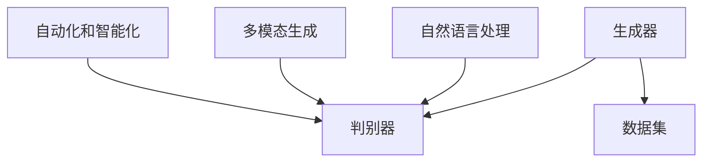
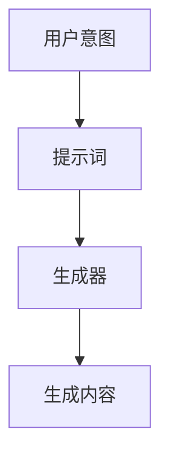

                 

### 第一步：引言

#### 1.1.1 AIGC的定义

AIGC，即基于人工智能的生成内容（Artificial Intelligence Generated Content），是一种利用人工智能技术，特别是生成对抗网络（GANs）、自然语言处理（NLP）等先进技术，自动生成各种形式内容的方法。简单来说，AIGC是通过算法让计算机模仿人类的创作过程，生成出与人类创作相似的内容。

**核心概念：**
- **人工智能（AI）**：指的是模拟、延伸和扩展人类智能的理论、方法、技术及应用。
- **生成对抗网络（GANs）**：一种深度学习模型，由生成器和判别器组成，通过对抗训练实现数据的生成。
- **自然语言处理（NLP）**：是计算机科学领域与人工智能领域中的一个重要方向，旨在让计算机能够理解、生成和处理人类语言。

**背景介绍：**
随着互联网和大数据技术的发展，人类生成内容的需求越来越大，但传统的手工创作已经无法满足日益增长的需求。AIGC技术的出现，不仅提高了内容生产的效率，还拓展了内容创作的形式和范围。例如，通过AIGC技术，可以自动生成新闻报道、音乐、电影、艺术作品等。

**问题描述：**
AIGC技术的核心问题是如何高效、准确地生成人类水平的内容。这涉及到算法的设计、模型的训练以及提示词的优化等多个方面。

**问题解决：**
解决这个问题的方法主要包括以下几个方面：
1. **算法优化**：通过改进生成对抗网络（GANs）和自然语言处理（NLP）算法，提高内容生成的质量和效率。
2. **模型训练**：使用大量的高质量数据进行模型的训练，使得模型能够更好地理解和模仿人类的创作过程。
3. **提示词优化**：设计有效的提示词，引导AI模型生成更加符合用户需求的内容。

**边界与外延：**
AIGC技术不仅限于文本生成，还可以应用于图像、音频、视频等多种形式的媒体内容。此外，AIGC技术还可以与其他技术，如增强现实（AR）、虚拟现实（VR）等相结合，带来更加丰富和多样的用户体验。

**概念结构与核心要素组成：**
- **生成器（Generator）**：负责生成内容，是AIGC技术的核心组件。
- **判别器（Discriminator）**：负责判断生成内容的质量，通过与生成器的对抗训练，提高生成内容的质量。
- **数据集**：用于训练模型的输入数据，数据的质量直接影响模型的性能。
- **提示词**：用于引导生成器生成特定类型的内容。

#### 1.1.2 AIGC的发展历程

AIGC技术的发展历程可以分为三个阶段：

1. **初期阶段（2010s）**：
   - **文本生成**：这一阶段主要研究基于规则和模板的文本生成技术。
   - **初步的生成对抗网络（GANs）**：2014年，Ian Goodfellow等人提出了GANs，为AIGC技术的发展奠定了基础。

2. **中期阶段（2010s-2020s）**：
   - **GANs和NLP的结合**：GANs与自然语言处理（NLP）技术相结合，生成对抗网络开始应用于文本生成、图像生成等领域。
   - **预训练模型**：预训练模型（如GPT系列）的提出，使得AIGC技术取得了显著的进步。

3. **现阶段（2020s）**：
   - **多模态生成**：AIGC技术开始应用于图像、音频、视频等多种形式的媒体内容生成。
   - **自动化和智能化**：AIGC技术逐渐实现自动化和智能化，例如自动生成新闻报道、音乐、电影等。

**核心概念与联系：**

**概念属性特征对比表格：**

| 概念           | 属性特征                                       |
| -------------- | ---------------------------------------------- |
| 生成对抗网络（GANs） | 对抗训练、生成器与判别器的博弈                 |
| 自然语言处理（NLP） | 文本理解、文本生成、情感分析等                 |
| 多模态生成     | 结合多种数据模态，如文本、图像、音频、视频等   |
| 自动化和智能化  | 通过算法和模型实现内容生成的自动化和智能化     |

**ER实体关系图架构：**

#### 1.1.3 AIGC的核心优势

AIGC技术具有以下几个核心优势：

1. **高效性**：
   - AIGC技术能够快速生成大量内容，大大提高了内容生产的效率。
   - 例如，在新闻行业中，AIGC技术可以自动生成大量的新闻报道，节省了人力和时间成本。

2. **多样性**：
   - AIGC技术能够生成各种形式的内容，如文本、图像、音频、视频等。
   - 这使得AIGC技术可以广泛应用于各个领域，如艺术创作、产品设计、媒体内容生成等。

3. **创造性**：
   - AIGC技术通过模仿人类的创作过程，能够生成具有创造性的内容。
   - 例如，通过AIGC技术，可以生成独特的艺术作品、音乐作品等。

**总结：**

AIGC技术是一种利用人工智能技术自动生成内容的方法，它具有高效性、多样性和创造性等核心优势。通过不断的发展和优化，AIGC技术正在改变着内容创作的方式，为各个领域带来了新的机遇和挑战。

### 第二步：提示词艺术

#### 2.1 提示词的概念

提示词，即Prompt，是引导AI模型生成内容的关键信息。它为AI模型提供了一些初始的输入，帮助模型理解用户的意图，从而生成更加准确和有用的内容。

**核心概念：**
- **提示词（Prompt）**：是用于引导AI模型生成内容的输入信息。
- **自然语言处理（NLP）**：是处理和生成自然语言的技术，用于理解和生成人类语言。

**背景介绍：**
在AIGC技术中，提示词扮演着至关重要的角色。一个优秀的提示词能够帮助AI模型更好地理解用户的需求，从而生成高质量的内容。提示词的设计和优化是AIGC技术的一个重要研究方向。

**问题描述：**
如何设计一个有效的提示词，使得AI模型能够生成符合用户期望的内容？这是一个复杂的问题，涉及到自然语言处理、心理学等多个领域的知识。

**问题解决：**
解决这个问题的方法主要包括以下几个方面：
1. **理解用户意图**：通过分析用户的输入，理解用户的真实意图。
2. **优化提示词**：根据用户意图，设计一个简洁、明确、具体的提示词。
3. **多轮交互**：通过与用户的多次交互，不断调整和优化提示词，提高生成内容的质量。

**边界与外延：**
提示词不仅应用于AIGC技术，还广泛应用于自然语言处理、机器学习等多个领域。提示词的设计原则和类型也因应用场景的不同而有所区别。

**概念结构与核心要素组成：**

#### 2.1.1 提示词的作用

提示词在AIGC技术中起着至关重要的作用，主要体现在以下几个方面：

1. **引导AI模型理解用户意图**：
   - 提示词能够为AI模型提供具体的输入信息，帮助模型更好地理解用户的意图。
   - 例如，在一个对话系统中，提示词可以告诉模型用户想要讨论的主题、场景等。

2. **提高生成内容的质量**：
   - 一个好的提示词能够引导AI模型生成更加准确、有用、有趣的内容。
   - 例如，在文本生成任务中，提示词可以指定生成内容的主题、风格、语气等。

3. **促进多轮对话**：
   - 在多轮对话中，提示词可以帮助模型更好地理解用户的上下文信息，提高对话的连贯性和自然性。

**总结：**

提示词是引导AI模型生成内容的关键信息，它能够帮助AI模型理解用户意图，提高生成内容的质量，促进多轮对话。提示词的设计和优化是AIGC技术中一个重要的研究方向。

#### 2.1.2 提示词的设计原则

为了设计一个有效的提示词，需要遵循以下几个原则：

1. **简洁性**：
   - 提示词应该简洁明了，避免使用复杂的语言和冗长的句子。
   - 这有助于AI模型快速理解用户的意图，提高生成内容的质量。

2. **明确性**：
   - 提示词需要明确具体，避免模糊和抽象的描述。
   - 例如，在生成新闻报道时，提示词应该明确指定新闻的主题、地点、时间等。

3. **多样性**：
   - 提示词应该具备多样性，以适应不同的应用场景和用户需求。
   - 例如，对于同一个文本生成任务，可以设计多种不同风格的提示词，以获得更丰富的生成结果。

4. **适应性**：
   - 提示词需要能够适应多轮对话，根据用户的反馈进行动态调整。
   - 这有助于提高多轮对话的连贯性和自然性。

**示例：**

- **简洁性**：请生成一篇关于“人工智能的发展现状”的新闻报道。
- **明确性**：请生成一篇关于“2023年3月10日北京天气情况”的新闻报道。
- **多样性**：请生成一篇关于“人工智能在医疗行业的应用”的新闻报道，要求风格幽默。
- **适应性**：用户：你觉得人工智能的未来会是什么样子？AI：人工智能的未来可能是...,用户：哦，那会很酷。AI：是的，我相信随着技术的发展，人工智能将会给我们带来更多的惊喜。

**总结：**

提示词的设计原则包括简洁性、明确性、多样性和适应性。遵循这些原则，可以帮助设计出更加有效的提示词，提高AIGC技术的应用效果。

#### 2.2 提示词的类型

根据用途和形式，提示词可以分为自然语言提示词、代码提示词等。每种类型的提示词都有其特定的应用场景和设计方法。

**自然语言提示词**

自然语言提示词主要用于文本生成任务，如文章、对话、新闻报道等。这类提示词的设计需要充分考虑自然语言的特性和用户的意图。

1. **文章生成**：
   - 提示词可以是具体的主题、标题、摘要等。
   - 例如：“请生成一篇关于‘人工智能在金融行业的应用’的文章。”

2. **对话系统**：
   - 提示词可以是对话的上下文信息、用户的问题等。
   - 例如：“请回答用户关于‘北京天气’的问题。”

3. **新闻报道**：
   - 提示词可以是新闻的主题、地点、时间、事件等。
   - 例如：“请生成一篇关于‘2023年3月10日北京发生的大雨’的新闻报道。”

**代码提示词**

代码提示词主要用于代码生成任务，如编程语言代码、算法代码等。这类提示词的设计需要结合具体的编程语言和算法知识。

1. **编程语言代码**：
   - 提示词可以是编程语言的关键字、函数名、变量名等。
   - 例如：“请生成一段Python代码，实现一个简单的计算器。”

2. **算法代码**：
   - 提示词可以是算法的名字、输入、输出等。
   - 例如：“请生成一个基于K-Means算法的聚类代码。”

**多模态提示词**

多模态提示词结合了自然语言和图像、音频等数据，用于生成多模态内容。

1. **图像生成**：
   - 提示词可以是对图像的描述、风格等。
   - 例如：“请生成一张风格类似梵高的‘向日葵’的图像。”

2. **音频生成**：
   - 提示词可以是对音乐的描述、情绪等。
   - 例如：“请生成一段充满活力的音乐。”

**总结：**

提示词的类型多样，根据不同的应用场景和任务需求，可以设计出自然语言提示词、代码提示词、多模态提示词等。每种类型的提示词都有其特定的设计原则和应用方法，有助于提高AIGC技术的应用效果。

### 第三步：与AI高效对话

#### 3.1 AI对话系统概述

AI对话系统是一种利用自然语言处理（NLP）技术实现人与机器对话的系统。它通过解析用户的输入，理解用户的意图，并生成相应的回答，从而实现人机交互。

**核心概念：**
- **自然语言处理（NLP）**：是一种将自然语言（如文本和语音）转换为机器可理解的形式的技术。
- **对话管理（Dialogue Management）**：是AI对话系统的核心组件，负责管理对话的流程和上下文。

**背景介绍：**
随着人工智能和自然语言处理技术的发展，AI对话系统在多个领域得到了广泛应用，如客服、智能家居、虚拟助手等。这些系统通过模拟人类的对话方式，为用户提供个性化、智能化的服务。

**组成部分：**

1. **对话管理**：
   - 对话管理组件负责处理对话的流程和上下文，包括意图识别、对话状态跟踪和响应生成等。

2. **语言理解（Language Understanding）**：
   - 语言理解组件负责解析用户的输入，理解用户的意图和问题。

3. **自然语言生成（Natural Language Generation）**：
   - 自然语言生成组件负责生成机器的回答，使其自然、流畅。

**工作原理：**
1. **接收用户输入**：AI对话系统首先接收用户输入的文本或语音信息。
2. **意图识别**：系统通过语言理解组件，识别用户的意图和问题。
3. **对话状态跟踪**：系统记录对话的历史信息，以便在后续对话中更好地理解用户。
4. **响应生成**：系统根据用户的意图和对话状态，通过自然语言生成组件生成回答。
5. **发送回答**：系统将生成的回答发送给用户。

**总结：**

AI对话系统是一种利用自然语言处理技术实现人与机器对话的系统，通过对话管理、语言理解和自然语言生成等组件，实现人机交互。它具有高效、智能、个性化的特点，为用户提供了便捷的服务。

#### 3.2 提高对话效率的方法

为了提高AI对话系统的效率，可以从以下几个方面进行优化：

1. **优化提示词**：
   - 设计简洁、明确、具体的提示词，帮助AI模型更好地理解用户意图。
   - 例如，在客服场景中，可以使用具体的客户问题和需求作为提示词，提高回答的准确性。

2. **使用预训练模型**：
   - 利用预训练的AI模型，如GPT系列，可以大大提高对话系统的性能。
   - 预训练模型具有强大的语言理解和生成能力，能够生成更加自然和流畅的回答。

3. **多轮交互**：
   - 通过多轮对话，不断调整和优化提示词，提高对话的连贯性和自然性。
   - 例如，在用户提出多个问题时，AI系统可以逐步理解用户的意图，生成更准确的回答。

4. **上下文信息利用**：
   - 利用对话的历史信息，如用户的提问、回答等，提高对话的连贯性和相关性。
   - 例如，在购物咨询中，系统可以利用用户之前的购买记录，提供更加个性化的推荐。

5. **自动化和智能化**：
   - 通过自动化和智能化技术，减少人工干预，提高对话系统的效率和可靠性。
   - 例如，使用规则引擎和机器学习算法，自动处理常见的客户问题和需求。

**示例：**

- **优化提示词**：用户：“我想要一款价格在1000元以内的手机。” AI系统：“您想要一款价格在1000元以内的手机，请问您有哪些具体的需求或偏好？”
- **使用预训练模型**：用户：“请问最近的天气情况如何？” AI系统：“最近的天气情况是晴天，气温大约在20摄氏度左右。”（使用GPT-3模型生成）
- **多轮交互**：用户：“我想要一款价格在1000元以内的手机，最好是品牌的。” AI系统：“好的，我找到了几款符合您要求的手机，请问您有任何其他需求或偏好吗？”
- **上下文信息利用**：用户：“我之前购买过你们的产品，请问现在有没有优惠活动？” AI系统：“您好，感谢您对我们的产品支持。现在我们正在进行春季促销活动，您可以享受8折优惠。”
- **自动化和智能化**：用户：“我的订单怎么还没送到？” AI系统：“您好，您的订单正在配送中，预计明天下午前送达。如有其他问题，请随时联系我们的客服。”

**总结：**

通过优化提示词、使用预训练模型、多轮交互、上下文信息利用和自动化与智能化等方法，可以显著提高AI对话系统的效率。这些方法不仅提高了对话的准确性和自然性，还为用户提供了更好的服务体验。

### 第四步：AIGC在实际应用中的案例

#### 4.1 文本生成应用

AIGC技术在文本生成领域有着广泛的应用，例如自动生成新闻、文章、对话等。以下是几个具体的案例：

1. **自动生成新闻**：
   - **应用场景**：新闻行业，如财经新闻、体育新闻等。
   - **案例**：美国媒体公司Axios使用AIGC技术自动生成新闻报道，每天能够生成数百篇新闻文章，大大提高了新闻生产的效率。
   - **效果**：生成的新闻报道在内容和质量上与人工撰写的新闻接近，但生产效率显著提高。

2. **自动生成文章**：
   - **应用场景**：自媒体、博客、教育等。
   - **案例**：使用AIGC技术，自媒体作者可以快速生成文章，节省写作时间。例如，一个科技博客可以通过输入关键词“人工智能技术”，自动生成一篇关于人工智能技术的文章。
   - **效果**：生成的文章在内容上具备一定的原创性和逻辑性，但可能缺乏深度和个性化。

3. **自动生成对话**：
   - **应用场景**：客服、聊天机器人等。
   - **案例**：某些客服系统使用AIGC技术，能够根据用户的问题自动生成回答，提高了客服的效率和准确性。
   - **效果**：生成的对话在自然性和连贯性上有所提高，但可能无法完全替代人工客服。

#### 4.2 图像生成应用

AIGC技术在图像生成领域也有着重要的应用，例如生成艺术作品、产品设计图、可视化数据等。以下是几个具体的案例：

1. **艺术创作**：
   - **应用场景**：艺术创作、插画设计等。
   - **案例**：艺术家使用AIGC技术，可以快速生成出独特的艺术作品。例如，一个画家可以通过输入关键词“星空、抽象”，生成一幅风格独特的抽象星空画。
   - **效果**：生成的艺术作品在创意和视觉效果上具有很高的质量，但可能缺乏传统艺术的深度和情感。

2. **产品设计图**：
   - **应用场景**：产品设计、室内设计等。
   - **案例**：设计师可以使用AIGC技术快速生成产品设计图，如手机、家具等。例如，一个工业设计师可以通过输入关键词“简约、功能性强”，生成一款符合设计理念的产品草图。
   - **效果**：生成的产品设计图在视觉效果和功能性上具备一定的优势，但可能需要人工进一步调整和完善。

3. **可视化数据**：
   - **应用场景**：数据可视化、市场分析等。
   - **案例**：分析师可以使用AIGC技术快速生成数据可视化图表，如折线图、柱状图等。例如，一个市场分析师可以通过输入关键词“销售额、季度增长”，生成一张销售额季度增长的折线图。
   - **效果**：生成的可视化图表在数据展示和解读上具备很高的效率，但可能需要人工进一步分析。

#### 4.3 音频生成应用

AIGC技术在音频生成领域也有着广泛的应用，例如自动生成音乐、声音效果等。以下是几个具体的案例：

1. **音乐创作**：
   - **应用场景**：音乐创作、游戏配乐等。
   - **案例**：音乐家使用AIGC技术，可以快速生成音乐旋律和配乐。例如，一个作曲家可以通过输入关键词“轻快、流行”，生成一段轻快的流行音乐旋律。
   - **效果**：生成的音乐在旋律和风格上与人类创作的音乐接近，但可能在情感表达上有所欠缺。

2. **声音合成**：
   - **应用场景**：语音助手、电影配音等。
   - **案例**：电影制作人可以使用AIGC技术为电影角色配音，快速生成高质量的配音效果。例如，一个电影制作人可以通过输入关键词“英雄、激昂”，生成一段激昂的配音。
   - **效果**：生成的声音效果在音质和表现力上具备很高的水平，但可能需要人工进行进一步的调整。

**总结：**

AIGC技术在文本生成、图像生成和音频生成等领域有着广泛的应用，并通过具体的案例展示了其效果和优势。这些应用不仅提高了内容生产的效率，还为各种领域带来了新的机遇和挑战。然而，AIGC技术仍需要进一步优化和改进，以更好地满足不同应用场景的需求。

### 第五步：AIGC的技术挑战与未来趋势

#### 5.1 技术挑战

尽管AIGC技术在各个领域展现出了巨大的潜力，但在实际应用中仍然面临着一些技术挑战：

1. **数据质量和隐私问题**：
   - AIGC技术依赖于大量的高质量数据来训练模型，数据的多样性和准确性直接影响模型的性能。然而，收集和处理这些数据可能涉及隐私和版权等问题，需要在数据使用和保护之间找到平衡。
   - **解决方案**：建立完善的数据隐私保护机制，采用数据加密和去识别化技术，确保用户数据的隐私和安全。

2. **模型解释性和可解释性**：
   - AIGC模型通常是非常复杂的，其内部工作机制难以理解和解释。这使得在实际应用中，难以对模型的行为进行评估和优化。
   - **解决方案**：研究开发可解释的AI模型，如基于规则的方法、可视化工具等，提高模型的透明度和可解释性。

3. **计算资源和能源消耗**：
   - AIGC模型的训练和推理通常需要大量的计算资源和能源。这可能导致高昂的成本和环境污染。
   - **解决方案**：优化模型架构和算法，采用高效计算和分布式计算技术，降低计算资源和能源消耗。

#### 5.2 未来趋势

展望未来，AIGC技术将在以下几个方面继续发展：

1. **多模态生成**：
   - 随着技术的进步，AIGC技术将更加注重多模态数据的融合与生成。通过结合文本、图像、音频等多种模态，生成更加丰富和真实的内容。
   - **示例**：生成具有视觉和听觉效果的虚拟现实（VR）体验，自动生成电影剧本和配乐。

2. **自动化与智能化**：
   - AIGC技术将逐步实现自动化和智能化，提高内容生成的效率和质量。通过自动化流程和智能化决策，减少人工干预，降低生产成本。
   - **示例**：自动化新闻编写系统，智能化产品设计工具。

3. **人机协作**：
   - AIGC技术将更加注重与人类的协作，通过人机交互和反馈机制，实现更好的内容创作体验。
   - **示例**：设计助理，用户可以根据AI生成的初步设计，进一步调整和完善。

4. **领域特定应用**：
   - AIGC技术将在各个领域得到更加深入的应用，如医疗、金融、教育等。通过结合领域知识和数据，生成更加专业和个性化的内容。
   - **示例**：自动生成医学报告、金融分析报告、教育课程内容。

**总结：**

AIGC技术在未来的发展中将面临一系列技术挑战，但同时也展现出巨大的潜力。通过持续的研究和创新，AIGC技术将在各个领域发挥更加重要的作用，推动内容创作的变革。

### 第六步：AIGC时代的职业规划与机遇

#### 6.1 职业规划

在AIGC时代，对于有志于从事相关领域的人才，职业规划尤为重要。以下是一些可能的职业路径和相关的技能要求：

1. **AI工程师**：
   - **技能要求**：熟悉深度学习、生成对抗网络（GANs）、自然语言处理（NLP）等技术；具备编程能力，如Python、TensorFlow或PyTorch等。
   - **职业路径**：从初级AI工程师开始，逐步晋升到高级工程师或技术主管，负责设计和开发AIGC相关的模型和系统。

2. **数据科学家**：
   - **技能要求**：具备数据分析和处理能力；熟悉机器学习和深度学习算法；熟练使用数据处理工具，如Pandas、NumPy等。
   - **职业路径**：从数据分析师或数据工程师开始，成长为高级数据科学家或数据科学经理，负责分析和优化AIGC模型的性能。

3. **NLP工程师**：
   - **技能要求**：精通自然语言处理相关技术，如词嵌入、序列模型、注意力机制等；熟悉NLP工具和库，如NLTK、spaCy、BERT等。
   - **职业路径**：从NLP工程师或研究助理开始，逐步成长为资深NLP工程师或NLP团队负责人。

4. **产品经理**：
   - **技能要求**：具备良好的产品规划和设计能力；了解AIGC技术的基本原理和应用场景；能够与开发团队合作，推动产品从概念到市场。
   - **职业路径**：从产品助理或产品经理开始，成长为高级产品经理或产品总监，负责规划和推广AIGC相关产品。

#### 6.2 机遇与挑战

AIGC技术为从业者带来了巨大的机遇，但同时也伴随着一定的挑战：

1. **技术创新机遇**：
   - **机遇**：随着AIGC技术的发展，新兴领域和应用场景不断出现，为从业者提供了广阔的创新空间。
   - **案例**：开发新型生成模型、探索多模态融合生成、提高模型解释性和可解释性等。

2. **职业发展挑战**：
   - **挑战**：快速变化的技术环境要求从业者持续学习和更新知识，保持竞争力。
   - **挑战**：数据隐私和安全问题、伦理道德问题等需要在技术创新中予以充分考虑。

**总结：**

AIGC时代为从业者提供了丰富的职业规划路径和广阔的创新机遇。通过不断提升自身技能和知识，从业者可以在这一领域中实现职业发展和技术创新。然而，面对快速变化的技术环境，持续学习和适应也是职业发展的重要挑战。

### 第七步：结论

#### 7.1 总结与展望

回顾AIGC技术的发展历程，我们可以看到，这一技术从最初的文本生成，逐步扩展到图像、音频、视频等多媒体内容生成，展示了其强大的应用潜力和创新价值。AIGC技术不仅提高了内容创作的效率和质量，还推动了多个领域的变革，如媒体、艺术、产品设计、教育等。

展望未来，AIGC技术将继续沿着多模态生成、自动化与智能化、人机协作等方向发展。随着技术的不断进步，AIGC将在更多的领域展现出其独特的作用和价值，带来更多的创新机遇和挑战。

#### 7.2 推荐阅读

为了更好地了解AIGC技术的最新进展和应用，以下是一些推荐的书籍和资源：

1. **书籍**：
   - 《生成对抗网络（GANs）从入门到精通》
   - 《深度学习与自然语言处理》
   - 《人工智能生成内容：原理、方法与实践》

2. **在线课程**：
   - Coursera上的《深度学习》课程
   - edX上的《自然语言处理基础》课程
   - Udacity上的《生成对抗网络（GANs）课程》

3. **技术社区和论坛**：
   - arXiv：专注于AI和机器学习的论文发布平台
   - GitHub：分享和讨论AIGC技术项目和代码的平台
   - Reddit：AIGC相关的讨论社区

通过阅读这些书籍和课程，读者可以深入了解AIGC技术的原理、方法和应用，为实际工作提供理论和实践指导。同时，参与技术社区和论坛，可以与业界专家和同行交流，分享经验和见解。

**总结：**

AIGC技术正在不断发展和创新，为各个领域带来了新的机遇和挑战。通过持续学习和实践，读者可以更好地掌握这一技术，并在未来的应用中发挥重要作用。

