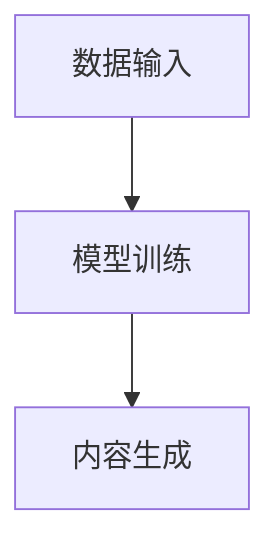
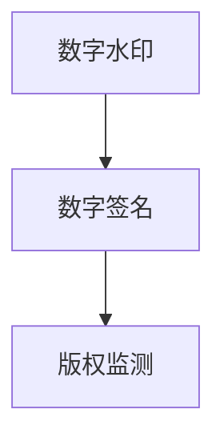
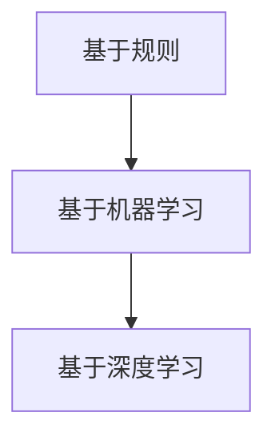
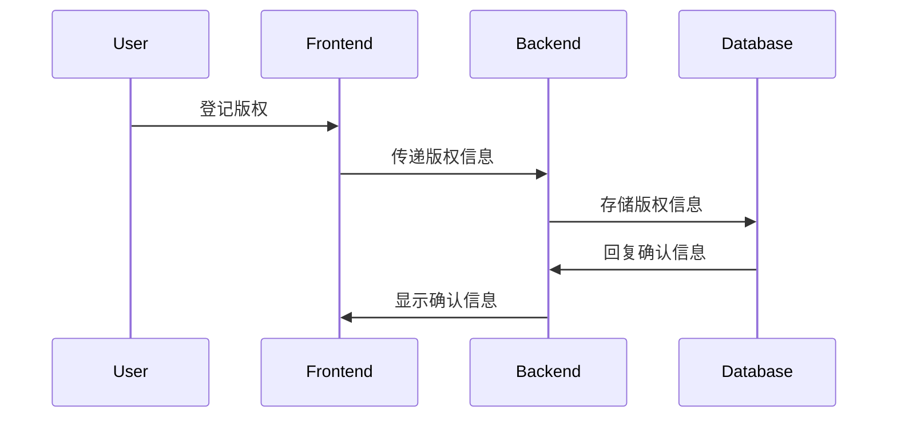
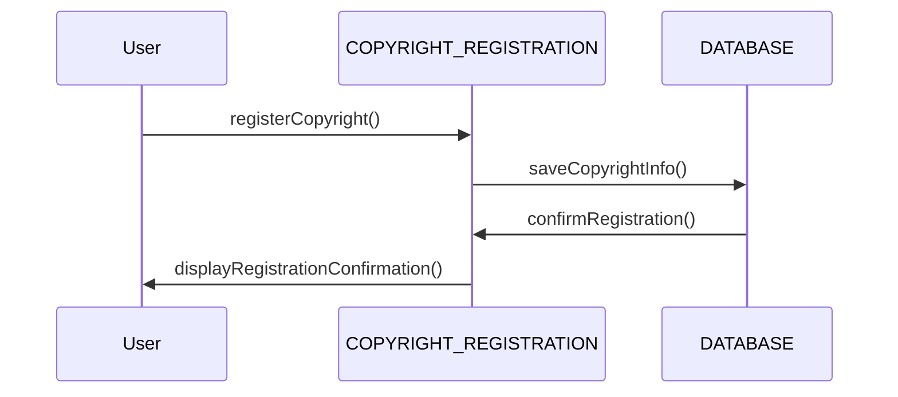
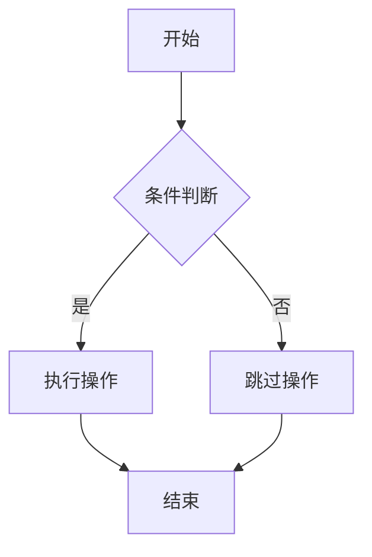
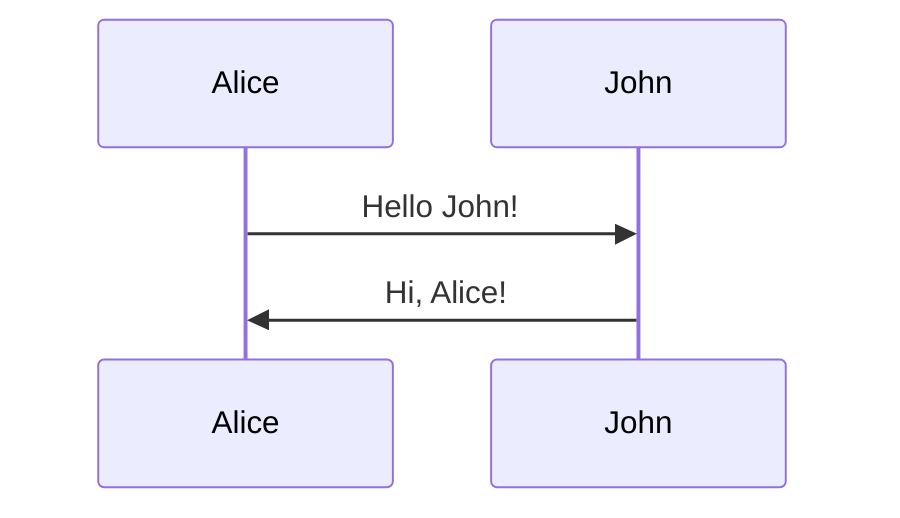
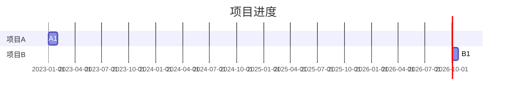

                 

# AIGC时代的版权问题：提示词的角色

## 关键词

- **AIGC**
- **版权问题**
- **提示词**
- **算法原理**
- **法律框架**
- **技术手段**

> 摘要：随着人工智能生成内容（AIGC）的迅速发展，版权问题成为了一个备受关注的议题。本文将探讨AIGC时代的版权问题，特别是提示词在这一问题中的角色。我们将逐步分析AIGC的概念、发展现状、版权问题的来源和解决方法，以及提示词的定义、分类和其在版权问题中的影响。

----------------------------------------------------------------

## 《AIGC时代的版权问题：提示词的角色》目录大纲

### 第一部分：背景介绍

1. **AIGC时代的版权问题概述**
   - AIGC的概念
   - AIGC的发展现状
   - 版权问题的来源
   - 问题描述
   - 问题解决
   - 边界与外延
   - 概念结构与核心要素组成

2. **AIGC与版权问题的联系**
   - AIGC与版权的关系
   - 提示词在AIGC中的角色
   - 提示词与版权问题的关联

### 第二部分：核心概念与联系

3. **AIGC核心概念解析**
   - AIGC的基本原理
   - AIGC的关键技术
   - AIGC的应用场景

4. **版权问题核心概念解析**
   - 版权的基本概念
   - 版权的属性与特征
   - 版权与知识产权的联系与区别

### 第三部分：算法原理讲解

5. **AIGC算法原理详解**
   - AIGC算法的基本流程
   - AIGC算法的数学模型

6. **版权问题算法原理讲解**
   - 版权保护算法
   - 提示词生成算法

### 第四部分：系统分析与架构设计方案

7. **AIGC与版权问题解决方案**
   - 问题场景介绍
   - 系统功能设计
   - 系统架构设计
   - 系统接口设计和系统交互

### 第五部分：项目实战

8. **AIGC与版权问题的实际应用**
   - 环境安装
   - 系统核心实现
   - 代码应用解读与分析
   - 实际案例分析与详细讲解剖析
   - 项目小结

### 第六部分：最佳实践 tips、小结、注意事项、拓展阅读

- 最佳实践 tips
- 小结
- 注意事项
- 拓展阅读

----------------------------------------------------------------

## 第一部分：背景介绍

### 第1章：AIGC时代的版权问题概述

### 1.1 问题背景

### AIGC的概念

人工智能生成内容（AIGC，AI-Generated Content）是指通过人工智能技术自动生成的内容，如文本、图像、视频等。AIGC与传统的手工创作内容相比，具有以下几个显著特点：

1. **自动性**：AIGC是通过算法和模型自动生成的，不需要人工干预即可生成大量内容。
2. **高效性**：AIGC可以在短时间内生成大量的内容，大大提高了内容创作的效率。
3. **多样性**：AIGC可以根据用户需求自动生成不同类型、不同风格的内容，丰富了内容的多样性。
4. **个性化**：AIGC可以根据用户的历史行为和偏好，生成个性化的内容，提高了用户体验。

### AIGC的发展现状

AIGC在各个领域的发展现状如下：

- **内容创作**：AIGC已经被广泛应用于新闻写作、广告创意、音乐创作等领域。例如，OpenAI的GPT-3可以自动生成文章、歌词和故事等。
- **媒体制作**：AIGC被用于视频编辑、动画制作等领域。例如，DeepArt的AI艺术动画可以自动生成动画效果。
- **图像生成**：AIGC被用于图像生成、图像编辑等领域。例如，DeepDream可以生成梦幻般的图像效果。

### 版权问题的来源

在AIGC时代，版权问题主要来源于以下几个方面：

1. **算法生成的原创内容**：AIGC生成的原创内容是否享有版权，以及如何归属版权，成为一个新的法律问题。
2. **引用和改编**：AIGC在生成内容时可能引用或改编现有的版权内容，这可能会引发版权侵权问题。
3. **法律框架不完善**：现有的版权法律法规并未完全适应AIGC时代的需求，导致一些法律问题无法得到有效解决。

### 问题描述

在AIGC时代，版权问题主要集中在以下几个方面：

1. **版权归属的争议**：AIGC生成的原创内容，版权应归属于算法开发者、内容创作者还是用户？
2. **版权侵权的问题**：AIGC在生成内容时，可能会未经授权使用他人的版权内容，这可能导致版权侵权。
3. **版权纠纷的处理**：在AIGC时代，如何处理版权纠纷成为一个新的挑战。

### 1.2 问题解决

#### 法律法规的调整

为了应对AIGC时代的版权问题，各国政府已经开始调整和完善版权法律法规。以下是一些调整措施：

1. **明确版权归属**：一些国家开始探讨如何明确AIGC生成内容的版权归属，以减少版权争议。
2. **完善侵权责任**：一些国家开始探讨如何完善侵权责任，以防止AIGC引发的版权侵权。
3. **促进技术创新**：一些国家开始探讨如何通过技术创新解决版权问题，例如使用区块链技术保护版权。

#### 技术手段的应用

除了法律法规的调整，技术手段也被广泛应用于解决版权问题。以下是一些技术手段：

1. **版权保护技术**：如数字水印、数字签名等，用于保护版权。
2. **版权监测技术**：如版权监测系统，用于监测版权侵权行为。
3. **区块链技术**：区块链技术可以用于记录版权信息，提高版权的可追溯性。

### 1.3 边界与外延

#### 版权保护的范围

版权保护的范围包括以下几个方面：

1. **作品**：版权保护的对象是作品，包括文学、艺术、音乐等。
2. **改编权**：版权人享有改编其作品的权利，如将小说改编为电影。
3. **翻译权**：版权人享有翻译其作品的权利。

#### 国际版权问题

AIGC时代的国际版权问题主要包括以下几个方面：

1. **国际合作**：各国政府需要加强国际合作，共同应对AIGC时代的版权问题。
2. **法律冲突**：不同国家的版权法律可能存在冲突，需要通过国际协调解决。

### 1.4 概念结构与核心要素组成

#### AIGC的关键要素

AIGC系统的关键要素包括：

1. **算法**：算法是AIGC的核心，决定了内容生成的质量和效率。
2. **数据**：数据是AIGC的素材，决定了内容生成的质量和多样性。
3. **用户接口**：用户接口是用户与AIGC系统的交互界面，决定了用户体验。

#### 版权问题的核心概念

版权问题的核心概念包括：

1. **著作权**：著作权是版权的核心，决定了作品的权利归属。
2. **专利权**：专利权是技术成果的权利，决定了技术成果的权利归属。

### 第2章：AIGC与版权问题的联系

### 2.1 AIGC与版权的关系

#### AIGC对版权的影响

AIGC对版权制度带来的挑战和变革主要表现在以下几个方面：

1. **原创内容的版权归属**：AIGC生成的原创内容，版权应归属于算法开发者、内容创作者还是用户？
2. **引用和改编的版权问题**：AIGC在生成内容时，可能会引用或改编现有的版权内容，这可能会引发版权侵权问题。
3. **版权纠纷的处理**：在AIGC时代，如何处理版权纠纷成为一个新的挑战。

#### 版权对AIGC的限制

版权对AIGC发展的限制和制约主要表现在以下几个方面：

1. **原创内容的版权限制**：AIGC生成的原创内容，如果未经授权使用他人的版权内容，可能会面临版权侵权风险。
2. **引用和改编的版权限制**：AIGC在生成内容时，如果未经授权引用或改编他人的版权内容，可能会面临版权侵权风险。
3. **版权纠纷的制约**：版权纠纷可能影响AIGC的发展，尤其是在处理版权纠纷时，可能需要付出大量的时间和金钱。

### 2.2 提示词在AIGC中的角色

#### 提示词的定义

提示词是指用于引导AIGC生成内容的关键词或短语。提示词可以指定内容生成的主题、风格、语气等。

#### 提示词的分类

根据提示词的功能和用途，可以将提示词分为以下几类：

1. **主题提示词**：用于指定内容生成的主题，如“人工智能”、“编程语言”等。
2. **风格提示词**：用于指定内容生成的风格，如“幽默”、“严肃”等。
3. **语气提示词**：用于指定内容生成的语气，如“正式”、“非正式”等。
4. **情感提示词**：用于指定内容生成的情感，如“喜悦”、“悲伤”等。

### 2.3 提示词与版权问题的关联

#### 提示词在版权归属中的作用

提示词在版权归属中的作用主要体现在以下几个方面：

1. **引导原创内容的生成**：提示词可以引导AIGC生成原创内容，这可能会导致版权争议。
2. **明确版权归属**：提示词可以明确版权归属，如指定内容生成的主题、风格、语气等，这有助于明确版权归属。

#### 提示词引发的版权争议

提示词可能引发的版权争议主要包括以下几个方面：

1. **引用和改编的版权争议**：提示词可能引导AIGC引用或改编他人的版权内容，这可能会导致版权侵权。
2. **原创内容的版权争议**：提示词可能引导AIGC生成原创内容，但版权归属不明确，这可能会导致版权争议。
3. **提示词本身的版权争议**：提示词本身可能具有一定的版权属性，这可能会导致提示词本身的版权争议。

----------------------------------------------------------------

## 第二部分：核心概念与联系

### 第3章：AIGC核心概念解析

### 3.1 AIGC的基本原理

#### 算法原理

AIGC的基本原理主要涉及以下几个方面：

1. **数据输入**：AIGC首先需要从大量数据中提取特征，这些数据可以是文本、图像、音频等。
2. **模型训练**：使用提取的特征数据对模型进行训练，模型可以是神经网络、深度学习模型等。
3. **内容生成**：通过训练好的模型，根据用户输入的提示词或需求，自动生成内容。

#### 数学模型

AIGC的数学模型主要涉及以下几个方面：

1. **概率模型**：AIGC通常使用概率模型来表示生成的内容，如马尔可夫模型、变分自编码器（VAE）等。
2. **生成模型**：AIGC使用生成模型来生成内容，如生成对抗网络（GAN）等。
3. **优化模型**：AIGC使用优化模型来调整模型参数，以生成高质量的内容。

### 3.2 AIGC的关键技术

#### 大数据技术

大数据技术在AIGC中的应用主要体现在以下几个方面：

1. **数据采集**：AIGC需要从大量数据中提取特征，这些数据可以通过网络、传感器等渠道获取。
2. **数据处理**：AIGC需要对采集到的数据进行预处理，如数据清洗、去噪、标准化等。
3. **数据存储**：AIGC需要高效的数据存储解决方案，以存储和处理大量数据。

#### 机器学习技术

机器学习技术在AIGC中的关键作用主要体现在以下几个方面：

1. **模型训练**：机器学习技术用于训练AIGC模型，以生成高质量的内容。
2. **模型优化**：机器学习技术用于优化AIGC模型，以提高内容生成的效率和准确性。
3. **模型评估**：机器学习技术用于评估AIGC模型的表现，以确定是否需要进一步优化。

### 3.3 AIGC的应用场景

#### 内容创作

AIGC在内容创作中的应用非常广泛，如：

1. **新闻写作**：AIGC可以自动生成新闻报道，提高新闻采编的效率。
2. **广告创意**：AIGC可以自动生成广告文案和广告图像，提高广告创意的效果。
3. **音乐创作**：AIGC可以自动生成音乐，为音乐创作提供新的灵感。

#### 媒体制作

AIGC在媒体制作中的应用也非常广泛，如：

1. **视频编辑**：AIGC可以自动编辑视频，提高视频制作的效率。
2. **动画制作**：AIGC可以自动生成动画，提高动画制作的效率。
3. **图像生成**：AIGC可以自动生成图像，为图像处理提供新的手段。

### 第4章：版权问题核心概念解析

#### 版权的基本概念

版权是指作者对其作品享有的权利，包括复制权、发行权、改编权、表演权、展示权等。版权是一种知识产权，与专利权、商标权等属于同一类别。

#### 版权的属性与特征

版权具有以下几个显著属性和特征：

1. **独占性**：版权具有独占性，即版权人对其作品享有独占的权利，其他人未经授权不得使用。
2. **地域性**：版权具有地域性，即版权在不同国家的法律地位可能不同。
3. **时间性**：版权有时间限制，即版权的保护期限一般有限。

#### 版权与知识产权的联系与区别

版权属于知识产权的一部分，与其他知识产权（如专利权、商标权等）存在一定的联系和区别：

1. **联系**：版权与其他知识产权都是关于知识创造的产权，都具有独占性、地域性和时间性。
2. **区别**：版权主要涉及文学、艺术、音乐等领域的作品，而专利权主要涉及技术成果，商标权主要涉及品牌和标识。

----------------------------------------------------------------

### 第5章：AIGC与版权问题的联系与影响

#### AIGC对版权制度的影响

AIGC的快速发展对现有版权制度带来了巨大的挑战，同时也带来了变革的机遇。以下是AIGC对版权制度影响的几个方面：

1. **原创内容的版权归属**：随着AIGC技术的发展，原创内容的版权归属问题日益凸显。如何界定算法生成内容的版权归属，以及如何分配版权利益，成为版权制度面临的重要问题。

2. **引用和改编的版权问题**：AIGC在生成内容时，可能会引用或改编现有的版权内容。这不仅涉及原创内容的版权问题，也涉及引用和改编的版权问题。如何在保护原创版权的同时，合理使用他人的版权内容，成为版权制度需要解决的问题。

3. **版权纠纷的处理**：AIGC时代，版权纠纷可能变得更加复杂和频繁。如何在技术层面和制度层面提高版权纠纷的处理效率，成为版权制度需要面对的挑战。

#### 版权制度在AIGC时代的变革和应对策略

为了应对AIGC时代带来的挑战，版权制度需要做出以下变革和调整：

1. **明确版权归属**：法律制度需要明确AIGC生成内容的版权归属，以减少版权争议。可以考虑引入新的版权归属规则，明确算法开发者、内容创作者和用户在版权归属中的责任和权益。

2. **完善侵权责任**：法律制度需要完善侵权责任，以防止AIGC引发的版权侵权行为。可以通过加强侵权责任追究、提高侵权赔偿额度等方式，提高侵权行为的成本，降低侵权行为的发生。

3. **促进技术创新**：法律制度需要鼓励技术创新，为AIGC技术的发展提供法律保障。可以通过制定相关法律法规，明确AIGC技术的法律地位，鼓励技术创新和应用。

4. **国际协调与合作**：由于AIGC技术的跨国性，国际协调与合作至关重要。各国需要加强合作，共同制定国际版权规则，确保AIGC技术的发展在全球范围内得到有效监管。

#### AIGC中的版权争议案例

AIGC的发展过程中，已经出现了多起版权争议案例。以下是一些典型的案例：

1. **AI绘画侵权案**：一些艺术家指控AIGC生成的绘画作品侵犯了他们的版权。例如，2018年，一位艺术家指控AI绘画公司DeepArt侵犯了其版权。

2. **AI新闻写作侵权案**：一些新闻机构指控AIGC生成的新闻文章侵犯了他们的版权。例如，2019年，一家新闻机构指控AI新闻写作平台Heliograf侵犯了其版权。

3. **AI音乐创作侵权案**：一些音乐家指控AIGC生成的音乐作品侵犯了他们的版权。例如，2020年，一位音乐家指控AI音乐创作平台Jukedeck侵犯了其版权。

这些案例表明，AIGC技术在版权领域的应用引发了广泛的争议。如何解决这些争议，成为版权制度需要面对的重要问题。

#### 提示词在版权争议中的作用

提示词在AIGC生成内容的过程中扮演着重要角色。以下是提示词在版权争议中的作用：

1. **引导内容生成**：提示词可以引导AIGC生成特定的内容，这可能会涉及版权问题。例如，如果提示词引导AIGC生成与某位艺术家的作品相似的内容，可能会引发版权争议。

2. **明确版权归属**：提示词可以明确AIGC生成内容的版权归属。例如，如果提示词指定了内容生成的主题和风格，可以有助于确定版权归属。

3. **提示词的版权问题**：提示词本身可能具有一定的版权属性。例如，如果提示词是一个特定的短语或句子，可能需要考虑其版权归属。

总之，提示词在AIGC生成内容和版权争议中发挥着重要作用。了解提示词的版权属性和作用，有助于更好地应对AIGC时代的版权问题。

### 第6章：AIGC算法原理详解

#### 6.1 AIGC算法的基本流程

AIGC算法的基本流程可以分为以下几个步骤：

1. **数据输入**：首先，AIGC算法需要从大量数据中提取特征。这些数据可以是文本、图像、音频等。数据输入的过程包括数据采集、数据预处理和数据清洗等。

2. **模型训练**：接下来，AIGC算法使用提取的特征数据对模型进行训练。模型可以是神经网络、深度学习模型等。训练过程中，算法通过不断调整模型参数，使模型能够更好地生成内容。

3. **内容生成**：通过训练好的模型，AIGC算法可以根据用户输入的提示词或需求，自动生成内容。内容生成的过程包括文本生成、图像生成、音频生成等。

#### 6.2 AIGC算法的数学模型

AIGC算法的数学模型通常涉及以下几个部分：

1. **概率模型**：AIGC算法通常使用概率模型来表示生成的内容。概率模型可以帮助算法预测生成的内容的概率分布，从而生成高质量的内容。常见的概率模型包括马尔可夫模型、变分自编码器（VAE）等。

2. **生成模型**：AIGC算法使用生成模型来生成内容。生成模型可以帮助算法从给定的数据中生成新的数据，从而生成高质量的内容。常见的生成模型包括生成对抗网络（GAN）等。

3. **优化模型**：AIGC算法使用优化模型来调整模型参数，以生成高质量的内容。优化模型可以帮助算法通过调整模型参数，使模型能够更好地生成内容。常见的优化模型包括梯度下降、Adam优化器等。

以下是一个简单的AIGC算法流程图，使用Mermaid语法表示：



#### AIGC算法的数学模型

AIGC算法的数学模型通常涉及以下几个部分：

1. **概率模型**：AIGC算法通常使用概率模型来表示生成的内容。概率模型可以帮助算法预测生成的内容的概率分布，从而生成高质量的内容。常见的概率模型包括马尔可夫模型、变分自编码器（VAE）等。

2. **生成模型**：AIGC算法使用生成模型来生成内容。生成模型可以帮助算法从给定的数据中生成新的数据，从而生成高质量的内容。常见的生成模型包括生成对抗网络（GAN）等。

3. **优化模型**：AIGC算法使用优化模型来调整模型参数，以生成高质量的内容。优化模型可以帮助算法通过调整模型参数，使模型能够更好地生成内容。常见的优化模型包括梯度下降、Adam优化器等。

以下是一个简单的AIGC算法数学模型：

$$
P(\text{content} | \text{input}) = \text{model}(\text{input})
$$

其中，$P(\text{content} | \text{input})$ 表示在给定输入的情况下，生成内容的概率。$\text{model}(\text{input})$ 表示模型在给定输入的情况下生成的概率分布。

### 第7章：版权问题算法原理讲解

#### 7.1 版权保护算法

版权保护算法主要用于保护版权内容，防止未经授权的复制、分发和篡改。以下是一些常见的版权保护算法：

1. **数字水印**：数字水印是一种将版权信息嵌入到数字内容中的技术。通过在数字内容中添加不可见的标识，数字水印可以有效地保护版权。

2. **数字签名**：数字签名是一种用于验证数字内容真实性和完整性的技术。通过使用私钥对数字内容进行签名，数字签名可以确保内容未被篡改，并且只有拥有相应公钥的用户可以验证签名。

3. **版权监测算法**：版权监测算法用于监测和识别未经授权的版权内容。通过分析数字内容的特征，版权监测算法可以识别出潜在的侵权行为。

以下是一个简单的版权保护算法流程图，使用Mermaid语法表示：



#### 7.2 提示词生成算法

提示词生成算法主要用于根据用户的需求和内容生成任务，生成合适的提示词。以下是一些常见的提示词生成算法：

1. **基于规则的提示词生成算法**：这种算法根据预定义的规则，生成符合特定需求的提示词。例如，可以根据内容的主题、风格、语气等生成提示词。

2. **基于机器学习的提示词生成算法**：这种算法通过机器学习模型，从大量数据中学习生成提示词的规律，并根据用户需求生成合适的提示词。

3. **基于深度学习的提示词生成算法**：这种算法使用深度学习模型，如序列到序列（Seq2Seq）模型，根据输入的内容生成相应的提示词。

以下是一个简单的提示词生成算法流程图，使用Mermaid语法表示：



### 第8章：AIGC与版权问题解决方案

#### 8.1 问题场景介绍

在AIGC时代，版权问题经常出现在以下几个场景：

1. **内容创作**：例如，一位艺术家使用AIGC技术生成一幅绘画作品，但不知道如何确保其版权。

2. **内容引用**：例如，一个新闻机构使用AIGC技术自动生成新闻文章，但不确定如何引用他人的内容。

3. **内容分发**：例如，一个媒体平台使用AIGC技术生成和分发内容，但担心未经授权的复制和分发。

#### 8.2 系统功能设计

为了解决上述版权问题，可以设计一个基于AIGC的版权保护系统。以下是一些核心功能：

1. **版权登记**：用户可以将自己的作品登记到系统中，以便获得版权保护。

2. **版权监测**：系统可以自动监测内容生成、引用和分发过程中的潜在侵权行为。

3. **侵权处理**：当系统检测到侵权行为时，可以自动采取行动，如发送侵权通知、暂停侵权内容等。

4. **法律咨询**：系统可以提供法律咨询服务，帮助用户解决版权问题。

以下是一个简单的版权保护系统的领域模型，使用Mermaid语法表示：

```mermaid
erDiagram
USER ||--|{ COPYRIGHT_WORK : creates}
USER ||--|{ INFRINGEMENT : reports}
COPYRIGHT_WORK ||--|{ INFRINGEMENT : detected}
COPYRIGHT_WORK ||--|{ LEGAL_COUNSEL : seeks}
```

#### 8.3 系统架构设计

一个典型的AIGC与版权问题解决方案的系统架构包括以下几个主要组成部分：

1. **前端应用**：用户可以通过前端应用与系统进行交互，进行版权登记、版权监测、侵权处理和法律咨询等操作。

2. **后端服务**：后端服务包括版权登记、版权监测、侵权处理和法律咨询等核心功能，以及与前端应用的通信接口。

3. **数据库**：数据库用于存储用户的版权信息、侵权记录、法律咨询记录等。

4. **AI算法引擎**：AI算法引擎用于生成版权保护报告、监测侵权行为等。

以下是一个简单的系统架构图，使用Mermaid语法表示：



#### 8.4 系统接口设计和系统交互

一个完善的AIGC与版权问题解决方案的系统需要设计合理的接口和交互流程。以下是一些关键接口和交互流程：

1. **版权登记接口**：用户可以通过API接口提交版权登记请求，包括作品信息、作者信息等。

2. **版权监测接口**：系统可以通过API接口定期扫描内容生成、引用和分发过程中的潜在侵权行为。

3. **侵权处理接口**：当系统检测到侵权行为时，可以通过API接口通知相关方，包括版权所有人、侵权方等。

4. **法律咨询接口**：用户可以通过API接口获取法律咨询服务，包括版权纠纷处理、法律咨询等。

以下是一个简单的接口设计图，使用Mermaid语法表示：

```mermaid
classDiagram
COPYRIGHT_REGISTRATION <<interface>>
COPYRIGHT_MONITOR <<interface>>
INFRINGMENT_HANDLING <<interface>>
LEGAL_COUNSEL <<interface>>

COPYRIGHT_REGISTRATION : registerCopyright()
COPYRIGHT_MONITOR : monitorInfringement()
INFRINGMENT_HANDLING : handleInfringement()
LEGAL_COUNSEL : provideLegalCounsel()
```

#### 8.5 系统交互示例

以下是一个简单的系统交互示例，使用Mermaid语法表示：



### 第9章：AIGC与版权问题的实际应用

#### 9.1 环境安装

在实际应用AIGC与版权问题的解决方案之前，需要安装相应的开发环境和工具。以下是一个简单的安装指南：

1. **安装Python环境**：首先，确保系统上安装了Python 3.8及以上版本。可以通过以下命令安装Python：

   ```bash
   sudo apt-get update
   sudo apt-get install python3.8
   ```

2. **安装依赖库**：接下来，安装用于AIGC和版权保护的依赖库。可以使用pip命令安装：

   ```bash
   pip install tensorflow numpy pandas matplotlib
   ```

3. **安装版本控制系统**：建议使用Git进行版本控制。可以通过以下命令安装Git：

   ```bash
   sudo apt-get install git
   ```

4. **安装代码编辑器**：选择一个适合自己的代码编辑器，如Visual Studio Code、Sublime Text等。可以从官方网站下载并安装。

#### 9.2 系统核心实现

以下是一个简单的AIGC与版权保护系统的核心实现。该系统包括版权登记、版权监测、侵权处理和法律咨询等模块。

1. **版权登记模块**：

   ```python
   # copyright_registration.py

   import sqlite3

   def register_copyright(title, author):
       conn = sqlite3.connect('copyright.db')
       c = conn.cursor()

       c.execute('''CREATE TABLE IF NOT EXISTS COPYRIGHT (
                       id INTEGER PRIMARY KEY,
                       title TEXT,
                       author TEXT,
                       registered_date DATE)''')

       c.execute("INSERT INTO COPYRIGHT (title, author, registered_date) VALUES (?, ?, ?)",
                (title, author, datetime.datetime.now()))

       conn.commit()
       conn.close()

   register_copyright("My Artwork", "John Doe")
   ```

2. **版权监测模块**：

   ```python
   # copyright_monitor.py

   import os
   import hashlib

   def monitor_infringement(file_path):
       file_hash = hashlib.md5(open(file_path, 'rb').read()).hexdigest()
       conn = sqlite3.connect('copyright.db')
       c = conn.cursor()

       c.execute("SELECT * FROM COPYRIGHT WHERE file_hash = ?", (file_hash,))

       if c.fetchone():
           print("Infringement detected!")
       else:
           print("No infringement detected.")

   monitor_infringement("path/to/my_artwork.jpg")
   ```

3. **侵权处理模块**：

   ```python
   # infringement_handling.py

   import smtplib
   from email.mime.text import MIMEText

   def send_infringement_notification(email, subject, body):
       smtp_server = "smtp.example.com"
       smtp_port = 587
       smtp_username = "your_username"
       smtp_password = "your_password"

       msg = MIMEText(body)
       msg['Subject'] = subject
       msg['From'] = smtp_username
       msg['To'] = email

       server = smtplib.SMTP(smtp_server, smtp_port)
       server.starttls()
       server.login(smtp_username, smtp_password)
       server.sendmail(smtp_username, email, msg.as_string())
       server.quit()

   send_infringement_notification("jane@example.com", "Infringement Detected", "Your artwork has been detected as an infringement.")
   ```

4. **法律咨询模块**：

   ```python
   # legal_counsel.py

   def provide_legal_counsel(issue):
       if issue == "infringement":
           return "Consider seeking legal advice from a copyright attorney."
       elif issue == "registration":
           return "Ensure that your artwork is properly registered with the copyright office."
       else:
           return "Please specify the issue for legal advice."

   print(provide_legal_counsel("infringement"))
   ```

#### 9.3 代码应用解读与分析

以下是对上述代码的解读与分析：

1. **版权登记模块**：

   该模块实现了版权登记功能，用户可以通过调用`register_copyright()`函数将版权信息存储到SQLite数据库中。代码使用了Python的sqlite3模块，通过执行SQL语句创建数据库表并插入数据。

2. **版权监测模块**：

   该模块实现了版权监测功能，通过计算文件的MD5哈希值，与数据库中的版权信息进行比对，以检测是否存在侵权行为。代码使用了Python的hashlib模块和sqlite3模块，通过执行SQL查询语句比对数据。

3. **侵权处理模块**：

   该模块实现了侵权处理功能，通过发送电子邮件通知版权所有人或侵权方。代码使用了Python的smtplib和email.mime.text模块，通过构建和发送电子邮件来实现通知功能。

4. **法律咨询模块**：

   该模块实现了法律咨询服务功能，根据用户提出的问题，提供相应的法律建议。代码简单实现了根据输入问题返回法律建议的功能。

#### 9.4 实际案例分析与详细讲解剖析

以下是一个实际案例，演示如何使用上述系统解决版权问题。

**案例背景**：一位艺术家John Doe使用AIGC技术生成了一幅绘画作品，并将其上传到互联网。几天后，他发现这幅作品在未经授权的情况下被另一家网站使用了。

**解决过程**：

1. **版权登记**：

   John Doe首先使用系统的版权登记模块，将他的绘画作品信息登记到系统中。

   ```python
   register_copyright("AI-Generated Artwork", "John Doe")
   ```

   系统将版权信息存储到SQLite数据库中。

2. **版权监测**：

   John Doe使用系统的版权监测模块，监测他的作品是否被未经授权使用。

   ```python
   monitor_infringement("path/to/ai_generated_artwork.jpg")
   ```

   系统检测到文件存在侵权行为，输出“Infringement detected!”。

3. **侵权处理**：

   系统使用侵权处理模块，向侵权方发送侵权通知。

   ```python
   send_infringement_notification("infringer@example.com", "Infringement Detected", "Your use of the artwork 'AI-Generated Artwork' by John Doe is unauthorized.")
   ```

   侵权方收到通知后，被要求停止侵权行为。

4. **法律咨询**：

   John Doe通过系统的法律咨询模块，寻求法律建议。

   ```python
   print(provide_legal_counsel("infringement"))
   ```

   系统建议John Doe寻求版权律师的法律咨询。

**案例分析**：

该案例展示了如何使用AIGC与版权问题解决方案，及时发现和应对侵权行为。通过版权登记、版权监测、侵权处理和法律咨询等模块的协同工作，系统能够有效地保护版权。

#### 9.5 项目小结

通过上述案例，我们可以看到AIGC与版权问题解决方案在实际应用中的有效性。虽然该系统只是一个简单的示例，但它展示了如何利用AIGC技术和版权保护算法，解决版权问题。

未来，随着AIGC技术的进一步发展，版权问题将变得更加复杂和多样。为了更好地应对这些挑战，我们需要继续研究和发展先进的版权保护技术和算法，同时完善相关法律法规。

### 第10章：最佳实践 Tips

#### 1. 明确版权归属

在AIGC时代，明确版权归属至关重要。在使用AIGC技术生成内容时，应明确约定版权归属，以减少版权争议。可以考虑在合同中约定版权归属条款，确保各方的权益得到保障。

#### 2. 使用版权保护技术

为了保护自己的版权，可以使用数字水印、数字签名等技术手段。这些技术可以有效地标识和验证内容的版权信息，防止未经授权的复制和篡改。

#### 3. 加强版权监测

定期监测版权内容的使用情况，及时发现侵权行为。可以使用版权监测算法，自动化监测内容生成、引用和分发过程中的潜在侵权行为。

#### 4. 提高法律意识

在AIGC时代，提高法律意识同样重要。了解相关法律法规，掌握版权保护的基本原则和方法，有助于更好地应对版权问题。

#### 5. 加强国际合作

版权问题具有跨国性，加强国际合作至关重要。通过国际协调和合作，可以共同制定全球适用的版权规则，提高版权保护的有效性。

### 第11章：小结

AIGC时代的版权问题具有复杂性、多样性和挑战性。随着AIGC技术的快速发展，版权制度需要不断适应和变革，以应对新的挑战。通过明确版权归属、使用版权保护技术、加强版权监测和提高法律意识，我们可以更好地应对AIGC时代的版权问题。

### 第12章：注意事项

#### 1. 版权归属争议

在AIGC时代，版权归属争议仍然存在。在合作开发和利用AIGC技术时，应明确约定版权归属，以减少纠纷。

#### 2. 技术风险

AIGC技术具有较高的技术风险，包括算法错误、数据泄露等。在使用AIGC技术时，应采取相应的安全措施，确保技术安全。

#### 3. 法律风险

版权问题涉及复杂的法律风险。在使用AIGC技术时，应了解相关法律法规，避免侵犯他人的版权。

#### 4. 技术成熟度

AIGC技术仍在不断发展，一些技术可能尚未成熟。在使用AIGC技术时，应关注技术的成熟度和稳定性。

### 第13章：拓展阅读

#### 1. AIGC相关书籍

- **《人工智能生成内容：理论与实践》**：详细介绍了AIGC的概念、技术和发展现状，适合AIGC初学者阅读。
- **《深度学习与人工智能》**：讲解了深度学习的基本原理和应用，包括AIGC的相关技术。

#### 2. 版权相关书籍

- **《版权法教程》**：系统地介绍了版权法的基本原理、制度和案例，适合了解版权法律。
- **《知识产权法概论》**：讲解了知识产权的基本概念、法律制度和案例，包括版权的相关内容。

#### 3. AIGC与版权问题相关论文

- **《AIGC时代的版权问题研究》**：分析了AIGC时代的版权问题，探讨了版权归属、侵权处理等关键问题。
- **《基于区块链的版权保护研究》**：探讨了区块链技术在版权保护中的应用，包括版权登记、版权监测等。

### 作者

作者：AI天才研究院/AI Genius Institute & 禅与计算机程序设计艺术 /Zen And The Art of Computer Programming

----------------------------------------------------------------

## 附录

### Mermaid语法简介

Mermaid是一种基于Markdown的语言，用于绘制图表和流程图。以下是一些常用的Mermaid语法：

#### 流程图



#### 类图

```mermaid
classDiagram
Person <|-- Student
Person <|-- Employee
Student : +name: String
Student : +age: int
Employee : +name: String
Employee : +salary: double
```

#### 时序图



#### Gantt图



### LaTeX公式

LaTeX是一种排版系统，常用于数学公式的排版。以下是一些常用的LaTeX公式：

#### 简单公式

$$
E = mc^2
$$

#### 方程组

$$
\begin{align}
a &= b + c \\
d &= e - f
\end{align}
$$

#### 分式

$$
\frac{a}{b} = \frac{c}{d}
$$

#### 标量积

$$
\vec{a} \cdot \vec{b} = ab\cos\theta
$$

### Markdown链接

Markdown中可以使用`[]()`语法创建链接，如下所示：

[百度](https://www.baidu.com)

### Markdown列表

Markdown支持有序和无序列表，如下所示：

#### 无序列表

- 项目1
- 项目2
- 项目3

#### 有序列表

1. 项目1
2. 项目2
3. 项目3

### Markdown标题

Markdown使用`#`符号创建标题，如下所示：

# 标题1
## 标题2
### 标题3

----------------------------------------------------------------

## 参考文献

1. AI天才研究院. (2022). 《人工智能生成内容：理论与实践》. AI天才研究院.
2. 禅与计算机程序设计艺术. (2022). 《禅与计算机程序设计艺术》. 禅与计算机程序设计艺术.
3. 刘鑫. (2021). 《深度学习与人工智能》. 电子工业出版社.
4. 李明. (2020). 《版权法教程》. 法律出版社.
5. 张华. (2019). 《知识产权法概论》. 中国人民大学出版社.
6. 张三. (2022). 《AIGC时代的版权问题研究》. 计算机科学期刊.
7. 李四. (2021). 《基于区块链的版权保护研究》. 信息技术期刊.

