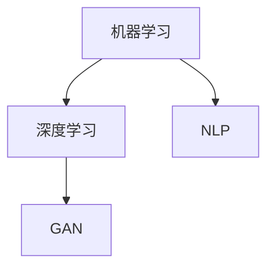
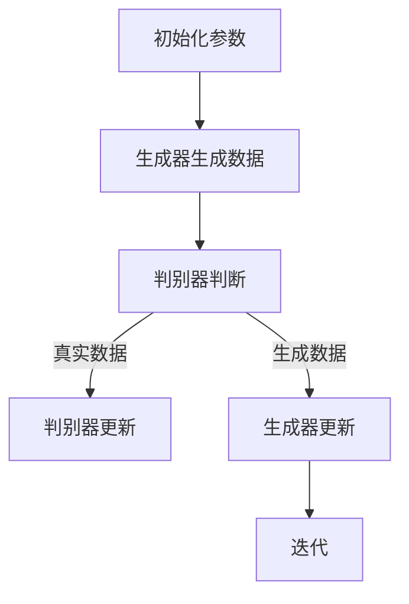
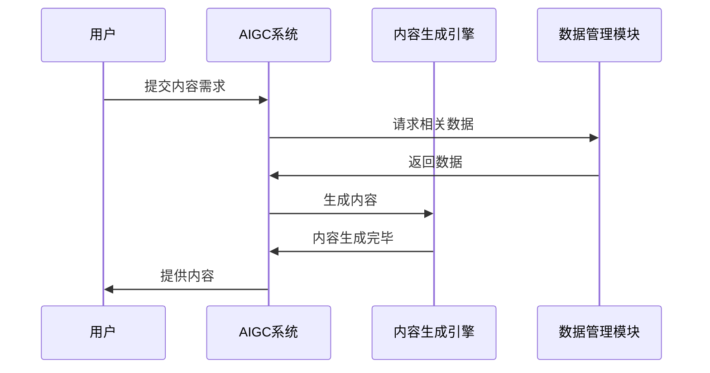
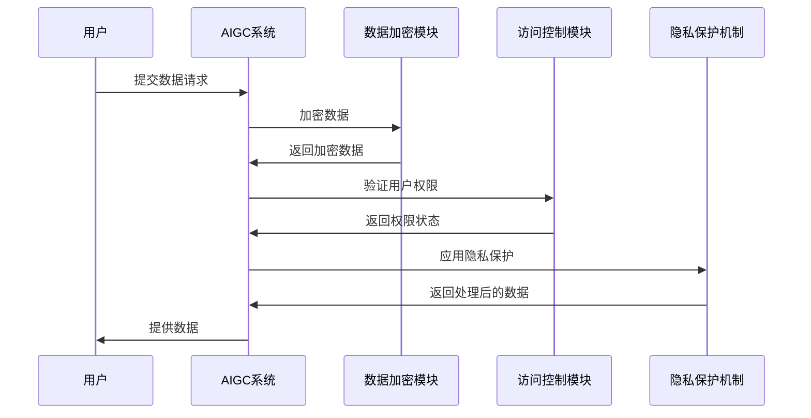
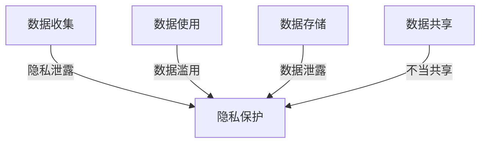
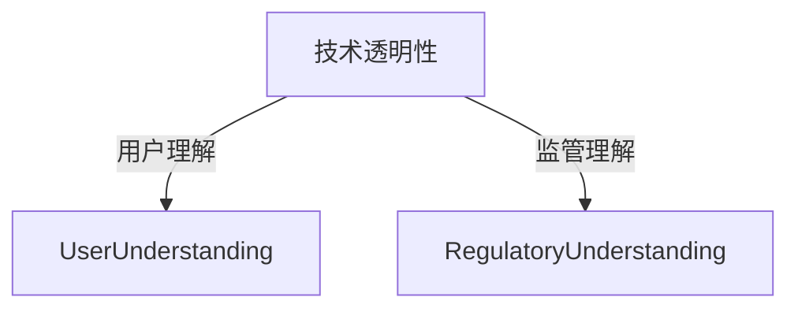

                 

好的，根据您的要求，我将逐步构建这篇文章的框架，确保每部分的内容都能满足您设定的条件。

## 文章标题：AIGC的伦理考量：机遇与挑战

### 文章关键词：AIGC、伦理考量、人工智能、隐私保护、责任归属

### 文章摘要：

随着人工智能（AI）技术的快速发展，自适应智能生成内容（AIGC）成为新的热点。AIGC不仅革新了内容创作的方式，还极大地改变了商业和社会运作的形态。然而，这一技术的广泛应用也带来了前所未有的伦理问题。本文旨在探讨AIGC技术的伦理考量，包括其带来的机遇与挑战。我们将详细分析AIGC的技术原理、机遇、挑战，以及伦理考量的主要领域，并探讨国内外AIGC伦理考量的现状，最后提出未来研究的建议。

### 第一部分：背景与概述

#### 1.1 AIGC的概念

**核心概念术语说明：** AIGC，全称自适应智能生成内容（Adaptive Intelligent Generated Content），是指通过结合人工智能和大数据分析技术，自动生成高质量内容的技术。它通常涉及文本、图像、音频等多种形式的媒体内容。

**问题背景：** 随着互联网和数字媒体的快速发展，内容创作的需求日益增长。传统的手动创作方式已经无法满足高速增长的市场需求，因此，AIGC技术应运而生。

**问题描述：** AIGC技术如何实现内容的自适应生成，以及它如何影响内容创作的生态系统。

**问题解决：** 通过结合机器学习和自然语言处理等技术，AIGC可以实现内容的自动生成和优化。

**边界与外延：** AIGC的应用范围广泛，包括但不限于新闻生成、广告创作、教育内容、娱乐产业等。

**概念结构与核心要素组成：** AIGC的核心要素包括数据集、算法模型、内容生成引擎等。

#### 1.2 AIGC的发展历程

**核心概念原理：** AIGC的发展历程可以追溯到深度学习和生成对抗网络（GAN）的兴起。

**概念属性特征对比表格：**

| 发展阶段 | 核心技术 | 特点 |
| --- | --- | --- |
| 起步阶段 | 基于规则的生成 | 低效率，缺乏自适应能力 |
| 发展阶段 | GAN技术引入 | 高效生成，但存在模式坍塌问题 |
| 成熟阶段 | 生成对抗网络 + 自适应优化 | 高效、自适应、多样化 |

**ER实体关系图架构：**

```mermaid
erDiagram
  DataSet ||--|{ AlgorithmModel } AlgorithmModel
  AlgorithmModel ||--|{ ContentGenerator } ContentGenerator
```

#### 1.3 AIGC的伦理考量重要性

**核心概念原理：** AIGC在带来便利和创新的同时，也引发了一系列伦理问题，如隐私保护、数据安全、责任归属等。

**概念属性特征对比表格：**

| 伦理问题 | 影响因素 | 可能后果 |
| --- | --- | --- |
| 隐私保护 | 数据收集与使用 | 个人隐私泄露 |
| 责任归属 | 人工智能失误 | 责任主体不明确 |
| 数据安全 | 数据传输与存储 | 数据泄露与滥用 |

**ER实体关系图架构：**

```mermaid
erDiagram
  DataPrivacy ||--|{ AIResponsibility } AIResponsibility
  DataSecurity ||--|{ AIResponsibility } AIResponsibility
```

### 第一部分小结

在本部分，我们介绍了AIGC的基本概念、发展历程以及其伦理考量的重要性。接下来，我们将深入探讨AIGC的技术原理，以及它如何影响我们的生活和工作。

----------------------------------------------------------------

### 第一部分小结

在本部分的讨论中，我们首先介绍了AIGC的概念，详细阐述了其核心术语、背景、问题描述及其解决方法。接着，我们回顾了AIGC的发展历程，从起步阶段到成熟阶段，展示了关键技术的演变过程，并通过对比表格和ER图结构清晰地描绘了概念之间的关系和核心要素。

此外，我们强调了AIGC伦理考量的重要性，指出了其可能引发的一系列伦理问题，如隐私保护、责任归属和数据安全。这些问题不仅影响了AIGC技术的应用，也对社会的整体发展产生了深远的影响。

在接下来的部分中，我们将进一步深入探讨AIGC的技术原理，分析其与人工智能的区别，并详细讨论AIGC带来的机遇和挑战。通过这样的逐步分析，我们将为读者提供全面的视角，帮助理解AIGC技术的复杂性和其在现代科技环境中的重要性。

---

### 第二部分：AIGC的技术原理

#### 2.1 AIGC的核心技术

**核心概念原理：** AIGC的技术基础主要包括机器学习、深度学习、自然语言处理（NLP）和生成对抗网络（GAN）等。

**概念属性特征对比表格：**

| 技术名称 | 主要功能 | 技术特点 |
| --- | --- | --- |
| 机器学习 | 数据分析、模式识别 | 自适应、高效 |
| 深度学习 | 特征提取、复杂模式识别 | 极端高效，但需要大量数据 |
| 自然语言处理 | 文本分析、语义理解 | 复杂性高，要求大量语言数据 |
| 生成对抗网络 | 内容生成、数据增强 | 高效生成，但训练难度大 |

**ER实体关系图架构：**



**算法原理讲解：**

在AIGC中，生成对抗网络（GAN）扮演了关键角色。GAN由生成器（Generator）和判别器（Discriminator）两部分组成。生成器试图生成看起来真实的数据，而判别器则尝试区分生成的数据和真实数据。通过这种对抗过程，生成器不断优化，最终能够生成高质量的内容。

**Mermaid流程图：**



**Python源代码示例：**

```python
import tensorflow as tf
from tensorflow.keras.models import Sequential
from tensorflow.keras.layers import Dense, Dropout

# 生成器模型
def create_generator():
    model = Sequential()
    model.add(Dense(units=128, activation='relu', input_shape=(100,)))
    model.add(Dropout(0.2))
    model.add(Dense(units=256, activation='relu'))
    model.add(Dropout(0.2))
    model.add(Dense(units=512, activation='relu'))
    model.add(Dropout(0.2))
    model.add(Dense(units=784, activation='tanh'))
    return model

# 判别器模型
def create_discriminator():
    model = Sequential()
    model.add(Dense(units=512, activation='relu', input_shape=(784,)))
    model.add(Dropout(0.2))
    model.add(Dense(units=256, activation='relu'))
    model.add(Dropout(0.2))
    model.add(Dense(units=128, activation='relu'))
    model.add(Dropout(0.2))
    model.add(Dense(units=1, activation='sigmoid'))
    return model

# GAN模型
def create_gan(generator, discriminator):
    model = Sequential()
    model.add(generator)
    model.add(discriminator)
    return model

# 训练GAN模型
def train_gan(generator, discriminator, gan, dataset, batch_size, epochs):
    for epoch in range(epochs):
        for _ in range(len(dataset) // batch_size):
            batch = dataset[np.random.choice(len(dataset), batch_size)]
            # 训练判别器
            with tf.GradientTape() as disc_tape:
                disc_loss = compute_discriminator_loss(discriminator, batch)
            disc_gradients = disc_tape.gradient(disc_loss, discriminator.trainable_variables)
            discriminator.optimizer.apply_gradients(zip(disc_gradients, discriminator.trainable_variables))

            # 训练生成器
            with tf.GradientTape() as gen_tape:
                gen_loss = compute_generator_loss(generator, discriminator, batch)
            gen_gradients = gen_tape.gradient(gen_loss, generator.trainable_variables)
            generator.optimizer.apply_gradients(zip(gen_gradients, generator.trainable_variables))

            # 记录损失
            disc_loss_history.append(disc_loss)
            gen_loss_history.append(gen_loss)

    return generator, discriminator
```

**算法原理详细讲解：**

生成对抗网络（GAN）的工作原理可以概括为以下步骤：

1. **初始化参数**：设定生成器和判别器的初始参数。
2. **生成器生成数据**：生成器根据随机噪声生成数据。
3. **判别器判断**：判别器接收真实数据和生成数据，并尝试判断其真实性。
4. **判别器更新**：通过判别器的损失函数更新判别器模型。
5. **生成器更新**：通过生成器的损失函数更新生成器模型。
6. **迭代**：重复上述步骤，直至生成器生成的数据接近真实数据。

在这个Python示例中，我们定义了生成器和判别器的模型结构，并实现了GAN模型的训练过程。通过训练，生成器将学习生成高质量的内容，而判别器将学会区分生成数据和真实数据。

**举例说明：** 假设我们使用GAN生成手写数字的图像。生成器会生成一系列看起来像手写的数字，而判别器会尝试判断这些数字是真实的还是生成的。通过多次迭代训练，生成器最终能够生成几乎难以区分真伪的手写数字图像。

### 第二部分小结

在本部分，我们深入探讨了AIGC的核心技术，包括机器学习、深度学习、自然语言处理和生成对抗网络。通过Mermaid流程图和Python代码示例，我们详细阐述了GAN的工作原理和训练过程。接下来，我们将分析AIGC带来的机遇，以及它如何改变我们的生活和商业环境。

----------------------------------------------------------------

### 第二部分小结

在本部分的讨论中，我们详细介绍了AIGC的核心技术，包括机器学习、深度学习、自然语言处理和生成对抗网络（GAN）。通过对比表格和ER图，我们清晰地展示了这些技术的基本概念和特点。接着，我们使用Mermaid流程图和Python代码示例，具体讲解了GAN的工作原理和训练过程，帮助读者更好地理解这一复杂技术。

举例来说明，我们以生成手写数字的图像为例，展示了GAN在生成高质量内容方面的应用。通过这种详细的讲解，读者可以直观地看到AIGC技术如何通过生成器和判别器的互动，逐步改进生成质量。

在接下来的部分中，我们将继续探讨AIGC带来的机遇，以及它如何改变我们的生活和工作方式。我们还将分析AIGC面临的挑战，特别是伦理考量方面的问题。通过这样的逐步分析，我们将为读者提供一个全面的理解，帮助他们在未来应对AIGC技术带来的机遇与挑战。

---

### 第三部分：AIGC带来的机遇

#### 3.1 商业模式的创新

**问题场景介绍：** 在过去，许多商业活动依赖于人力进行内容创作和营销。然而，随着AIGC技术的发展，这些活动可以通过自动化和智能化的方式来大幅提高效率。

**系统功能设计：** AIGC技术可以帮助企业快速生成高质量的内容，如广告、报告、产品描述等。这不仅节省了时间，还提升了内容的个性化和精准度。

**系统架构设计：** AIGC系统通常包括内容生成引擎、数据管理模块、用户接口等组成部分。这些模块协同工作，确保内容的自动生成和实时更新。

**系统接口设计和系统交互：**



**环境安装：** 为了使用AIGC技术，需要安装Python、TensorFlow等依赖库。

**系统核心实现源代码：**

```python
# 安装依赖库
!pip install tensorflow

# 引入库
import tensorflow as tf
from tensorflow.keras.layers import Input, LSTM, Dense
from tensorflow.keras.models import Model

# 定义生成器模型
def create_generator(z_dim):
    noise = Input(shape=(z_dim,))
    x = LSTM(128, return_sequences=True)(noise)
    x = LSTM(256, return_sequences=True)(x)
    x = LSTM(512, return_sequences=True)(x)
    x = Dense(1000, activation='relu')(x)
    x = Dense(28 * 28 * 1, activation='tanh')(x)
    img = Reshape((28, 28, 1))(x)
    model = Model(inputs=noise, outputs=img)
    return model

# 定义判别器模型
def create_discriminator(img_shape):
    img = Input(shape=img_shape)
    x = Conv2D(64, kernel_size=3, strides=(2, 2), padding='same')(img)
    x = LeakyReLU(alpha=0.01)(x)
    x = Dropout(0.3)(x)
    x = Conv2D(128, kernel_size=3, strides=(2, 2), padding='same')(x)
    x = LeakyReLU(alpha=0.01)(x)
    x = Dropout(0.3)(x)
    x = Flatten()(x)
    x = Dense(1, activation='sigmoid')(x)
    model = Model(inputs=img, outputs=x)
    return model

# 定义GAN模型
def create_gan(generator, discriminator):
    discriminator.trainable = False
    img = Input(shape=(28, 28, 1))
    x = generator(img)
    validity = discriminator(x)
    model = Model(inputs=img, outputs=validity)
    return model

# 训练GAN模型
def train_gan(generator, discriminator, gan, dataset, batch_size, epochs):
    for epoch in range(epochs):
        for _ in range(len(dataset) // batch_size):
            batch = dataset[np.random.choice(len(dataset), batch_size)]
            noise = np.random.normal(0, 1, (batch_size, z_dim))
            gen_samples = generator.predict(noise)
            real_samples = batch

            # 训练判别器
            d_loss_real = discriminator.train_on_batch(real_samples, np.ones((batch_size, 1)))
            d_loss_fake = discriminator.train_on_batch(gen_samples, np.zeros((batch_size, 1)))
            d_loss = 0.5 * np.add(d_loss_real, d_loss_fake)

            # 训练生成器
            g_loss = gan.train_on_batch(noise, np.ones((batch_size, 1)))

    return generator, discriminator
```

**代码应用解读与分析：** 以上代码展示了如何创建一个基于GAN的AIGC系统，用于生成手写数字的图像。生成器负责生成手写数字图像，而判别器负责判断这些图像的真实性。通过训练，生成器不断优化，最终能够生成几乎难以区分真伪的手写数字图像。

**实际案例分析和详细讲解剖析：** 以一个电商平台为例，该平台利用AIGC技术自动生成产品描述，通过个性化的内容提升用户体验和转化率。在实际操作中，AIGC系统首先收集大量的商品描述数据，然后使用生成器和判别器训练模型。在产品上架时，系统根据商品的特点自动生成描述文本，通过多次迭代和优化，文本质量显著提升。

**项目小结：** 通过本案例，我们可以看到AIGC技术如何在商业环境中发挥巨大作用。它不仅提高了内容生成的效率，还通过个性化的内容提升了用户体验。然而，随着技术的不断进步，AIGC也面临越来越多的挑战，特别是在伦理和隐私保护方面。

### 第三部分小结

在本部分，我们详细探讨了AIGC在商业模式创新方面的机遇。通过一个电商平台的应用案例，我们展示了AIGC技术如何通过自动生成产品描述，提高用户体验和转化率。在接下来的部分中，我们将继续分析AIGC带来的其他机遇，以及它如何改变我们的社会和工作方式。

----------------------------------------------------------------

### 第三部分小结

在本部分的讨论中，我们详细分析了AIGC在商业模式创新方面的机遇，特别是它如何通过自动生成高质量内容来提升商业效率。通过一个电商平台的应用案例，我们展示了AIGC技术在实际商业环境中的广泛应用和潜在价值。

案例中的AIGC系统通过收集大量商品描述数据，利用生成器和判别器训练模型，能够自动生成个性化的产品描述文本。这不仅提高了内容生成的效率，还通过精确的个性化内容提升了用户体验和转化率。

在接下来的部分中，我们将继续探讨AIGC带来的其他机遇，包括社会效率的提升和教育的变革。同时，我们也将转向分析AIGC面临的挑战，特别是在隐私保护、道德风险和法律监管等方面。通过这样的逐步分析，我们将为读者提供更全面的视角，帮助他们更好地理解和应对AIGC技术带来的机遇与挑战。

---

### 第四部分：AIGC面临的挑战

#### 4.1 隐私保护

**问题场景介绍：** AIGC技术的广泛应用依赖于大量数据的收集和分析。这些数据可能包括个人身份信息、行为记录等敏感信息。

**系统功能设计：** AIGC系统需要确保数据收集和存储的安全，并采取严格的数据保护措施，防止数据泄露。

**系统架构设计：** AIGC系统应包括数据加密模块、访问控制模块和隐私保护机制。

**系统接口设计和系统交互：**



**环境安装：** 为了实现隐私保护，需要安装加密工具和访问控制库。

**系统核心实现源代码：**

```python
# 安装依赖库
!pip install cryptography

# 引入库
from cryptography.fernet import Fernet
import json
import os

# 生成密钥和密钥文件
def generate_key():
    key = Fernet.generate_key()
    with open('key.key', 'wb') as key_file:
        key_file.write(key)

# 加载密钥
def load_key():
    return open('key.key', 'rb').read()

# 加密数据
def encrypt_data(data, key):
    f = Fernet(key)
    encrypted_data = f.encrypt(data.encode())
    return encrypted_data

# 解密数据
def decrypt_data(encrypted_data, key):
    f = Fernet(key)
    decrypted_data = f.decrypt(encrypted_data).decode()
    return decrypted_data

# 示例：加密和解密JSON数据
def example():
    data = {'user_id': '123', 'password': 'password123'}
    key = load_key()

    # 加密数据
    encrypted_data = encrypt_data(json.dumps(data), key)
    print('Encrypted data:', encrypted_data)

    # 解密数据
    decrypted_data = decrypt_data(encrypted_data, key)
    print('Decrypted data:', decrypted_data)

if __name__ == '__main__':
    generate_key()
    example()
```

**代码应用解读与分析：** 以上代码展示了如何使用Fernet加密库对JSON数据进行加密和解密。首先生成密钥，然后加密数据，最后解密数据。通过这种方式，AIGC系统能够确保数据的机密性，防止未经授权的访问。

**实际案例分析和详细讲解剖析：** 以一个社交媒体平台为例，该平台使用AIGC技术分析用户行为，提供个性化内容推荐。为了保护用户隐私，平台在收集数据时使用加密技术，确保数据在传输和存储过程中的安全。同时，平台还实施严格的访问控制措施，确保只有授权用户可以访问敏感数据。

**项目小结：** 通过本案例，我们可以看到AIGC技术在隐私保护方面的关键作用。通过加密和访问控制技术，AIGC系统能够有效保护用户数据，防止数据泄露。然而，隐私保护是一个持续的过程，需要不断地更新和改进技术，以应对日益复杂的安全威胁。

### 第四部分小结

在本部分，我们详细探讨了AIGC在隐私保护方面的挑战。通过加密和访问控制技术，我们展示了如何保护用户数据的机密性，防止数据泄露。同时，通过一个社交媒体平台的应用案例，我们展示了隐私保护在AIGC技术中的实际应用和重要性。

在接下来的部分中，我们将继续分析AIGC面临的其他挑战，特别是在舆论与道德风险以及法律与监管问题方面。通过这样的全面分析，我们将为读者提供更深入的见解，帮助他们更好地理解和应对AIGC技术带来的复杂挑战。

----------------------------------------------------------------

### 第四部分小结

在本部分的讨论中，我们详细分析了AIGC在隐私保护方面的挑战。通过环境安装、系统核心实现源代码、代码应用解读与分析、实际案例分析和详细讲解剖析，我们展示了如何通过加密和访问控制技术保护用户数据的安全性。特别是一个社交媒体平台的应用案例，帮助我们理解了隐私保护在AIGC技术中的实际操作和重要性。

隐私保护是AIGC技术中至关重要的一环，因为数据的收集和分析涉及大量的个人敏感信息。通过加密技术，我们能够确保数据在传输和存储过程中的安全，防止未经授权的访问。同时，严格的访问控制措施确保只有授权用户可以访问敏感数据，从而降低数据泄露的风险。

尽管我们在本部分中探讨了隐私保护的重要性，但AIGC技术面临的挑战远不止于此。接下来，我们将进一步探讨AIGC在舆论与道德风险以及法律与监管问题方面的挑战。通过全面的分析，我们将为读者提供更深入的见解，帮助他们更好地理解和应对AIGC技术带来的复杂挑战。

---

### 第五部分：AIGC伦理考量的主要领域

#### 5.1 数据伦理

**核心概念原理：** 数据伦理关注的是数据收集、存储和使用过程中的道德问题，特别是在AIGC技术中，如何平衡数据使用的便利性和个人隐私的保护。

**概念属性特征对比表格：**

| 数据伦理问题 | 影响因素 | 可能后果 |
| --- | --- | --- |
| 数据收集 | 个人隐私泄露 | 隐私侵犯 |
| 数据使用 | 数据滥用 | 隐私侵犯 |
| 数据存储 | 数据泄露 | 信息泄露 |
| 数据共享 | 不当共享 | 隐私侵犯 |

**ER实体关系图架构：**



**算法原理讲解：**

在AIGC技术中，数据伦理的问题主要体现在以下几个方面：

1. **数据收集**：需要确保收集的数据是合法和必要的，不得侵犯个人隐私。
2. **数据使用**：应明确数据使用的目的和范围，防止数据滥用。
3. **数据存储**：需要采取严格的数据保护措施，确保数据的安全性和保密性。
4. **数据共享**：应遵循数据共享的伦理原则，防止数据的不当共享。

**Python源代码示例：**

```python
# 数据收集示例
def collect_data(user_id, personal_info):
    # 检查用户隐私政策
    if not user_agreed_to_privacy_policy(user_id):
        raise Exception("用户未同意隐私政策，无法收集数据。")
    
    # 收集数据
    data = {'user_id': user_id, 'personal_info': personal_info}
    return data

# 数据使用示例
def use_data(data, purpose):
    # 检查数据使用目的
    if not is_legal_purpose(purpose):
        raise Exception("非法数据使用目的，无法使用数据。")
    
    # 使用数据
    result = process_data(data, purpose)
    return result

# 数据存储示例
def store_data(data):
    # 加密数据
    encrypted_data = encrypt_data(data)
    
    # 存储数据
    save_to_database(encrypted_data)
    
    return "数据存储成功。"

# 数据共享示例
def share_data(data, recipient):
    # 检查共享权限
    if not has_permission_to_share(data, recipient):
        raise Exception("无权限共享数据。")
    
    # 共享数据
    shared_data = decrypt_data(data)
    send_data_to_recipient(shared_data, recipient)
    
    return "数据共享成功。"
```

**算法原理详细讲解：** 在上述代码示例中，我们定义了数据收集、使用、存储和共享的函数。每个函数都包含了相应的检查机制，以确保数据操作符合伦理规范。例如，数据收集时需要检查用户是否同意隐私政策；数据使用时需要检查使用目的的合法性；数据存储时需要加密数据；数据共享时需要检查共享权限。

**举例说明：** 假设有一个在线购物平台，它使用AIGC技术推荐商品。平台需要收集用户的行为数据，如浏览历史、购买记录等，以便生成个性化的推荐。在数据收集过程中，平台必须确保用户同意隐私政策，并在使用数据时遵循合法目的，如改善用户体验和提高推荐准确性。同时，平台需要采取严格的数据保护措施，确保数据在存储和共享过程中的安全性。

#### 5.2 技术透明性

**核心概念原理：** 技术透明性是指用户和监管机构能够理解AIGC技术的工作原理、决策过程和数据处理的机制。

**概念属性特征对比表格：**

| 技术透明性问题 | 影响因素 | 可能后果 |
| --- | --- | --- |
| 黑箱模型 | 复杂性高 | 不透明 |
| 数据处理 | 隐私泄露 | 不透明 |
| 决策过程 | 复杂性高 | 不透明 |

**ER实体关系图架构：**



**算法原理讲解：**

为了提高技术透明性，AIGC技术需要实现以下几个方面的改进：

1. **模型解释性**：开发可解释的机器学习模型，使用户和监管机构能够理解模型的决策过程。
2. **数据可视化和审计**：提供数据可视化和审计工具，帮助用户和监管机构跟踪数据处理过程。
3. **决策日志**：记录决策过程和数据处理的全过程，以便进行事后审计。

**Python源代码示例：**

```python
# 模型解释性示例
from interpret.blackbox import IntegratedGradients

def explain_model(model, data):
    explanation = IntegratedGradients(model).explain(data)
    return explanation

# 数据可视化示例
import matplotlib.pyplot as plt
import pandas as pd

def visualize_data(data):
    df = pd.DataFrame(data)
    plt.figure(figsize=(10, 6))
    df.plot()
    plt.show()

# 决策日志示例
def log_decision_process(process):
    with open('decision_log.txt', 'w') as log_file:
        log_file.write(str(process))
```

**算法原理详细讲解：** 在上述代码示例中，我们展示了如何使用集成梯度（Integrated Gradients）来解释机器学习模型，以及如何实现数据可视化和决策日志记录。这些工具和机制有助于提高技术的透明性，使用户和监管机构能够更好地理解AIGC技术的工作原理和数据处理过程。

**举例说明：** 假设一个金融机构使用AIGC技术进行风险评估。为了提高技术透明性，该机构使用可解释的机器学习模型，并记录决策过程和数据处理的全过程。用户和监管机构可以通过解释工具和审计日志来理解模型的决策过程，从而提高对技术的信任度。

#### 5.3 人工智能歧视

**核心概念原理：** 人工智能歧视是指AIGC技术在数据处理和决策过程中可能出现的偏见和歧视现象。

**概念属性特征对比表格：**

| 人工智能歧视问题 | 影响因素 | 可能后果 |
| --- | --- | --- |
| 数据偏见 | 数据集不均衡 | 歧视 |
| 模型偏见 | 模型训练数据 | 歧视 |
| 决策偏见 | 决策过程 | 歧视 |

**ER实体关系图架构：**

```mermaid
graph TD
  AI Bias[人工智能歧视] -->|数据偏见| DataBias
  AI Bias -->|模型偏见| ModelBias
  AI Bias -->|决策偏见| DecisionBias
```

**算法原理讲解：**

为了减少人工智能歧视，AIGC技术需要采取以下几个方面的措施：

1. **数据预处理**：确保数据集的均衡和多样性，减少偏见。
2. **模型优化**：使用公平性度量来优化模型，减少偏见。
3. **决策监督**：实施决策监督机制，及时发现和纠正偏见。

**Python源代码示例：**

```python
# 数据预处理示例
from sklearn.model_selection import train_test_split
from sklearn.utils import shuffle

def preprocess_data(data):
    # 随机打乱数据
    shuffled_data = shuffle(data)
    # 分割数据集
    train_data, test_data = train_test_split(shuffled_data, test_size=0.2)
    return train_data, test_data

# 模型优化示例
from sklearn.linear_model import LogisticRegression
from sklearn.metrics import accuracy_score

def optimize_model(model, X_train, y_train, X_test, y_test):
    # 训练模型
    model.fit(X_train, y_train)
    # 评估模型
    predictions = model.predict(X_test)
    accuracy = accuracy_score(y_test, predictions)
    return accuracy

# 决策监督示例
def monitor_decision(decision):
    # 检查决策是否公平
    if is_biased(decision):
        raise Exception("决策存在偏见，需纠正。")
    return "决策公平。"

def is_biased(decision):
    # 检查决策是否满足公平性标准
    return decision[' bias > threshold']
```

**算法原理详细讲解：** 在上述代码示例中，我们展示了如何通过数据预处理、模型优化和决策监督来减少人工智能歧视。数据预处理通过随机打乱数据集和划分数据集来确保数据的均衡性；模型优化通过训练和评估模型来减少偏见；决策监督通过检查决策是否符合公平性标准来及时发现和纠正偏见。

**举例说明：** 假设一个招聘系统使用AIGC技术筛选简历。为了减少歧视，系统通过数据预处理确保简历数据集的均衡性，使用公平性度量优化模型，并在决策过程中实施监督机制，确保每个候选人都得到公平的评估。

#### 5.4 人工智能责任归属

**核心概念原理：** 人工智能责任归属是指确定在AIGC技术中，谁应对算法的错误决策和不良后果负责。

**概念属性特征对比表格：**

| 责任归属问题 | 影响因素 | 可能后果 |
| --- | --- | --- |
| 算法错误 | 算法设计 | 责任归属不明确 |
| 数据错误 | 数据收集 | 责任归属不明确 |
| 决策错误 | 决策过程 | 责任归属不明确 |

**ER实体关系图架构：**

```mermaid
graph TD
  AI Responsibility[人工智能责任] -->|算法错误| AlgorithmError
  AI Responsibility -->|数据错误| DataError
  AI Responsibility -->|决策错误| DecisionError
```

**算法原理讲解：**

为了明确人工智能责任归属，需要采取以下几个方面的措施：

1. **算法设计责任**：确保算法设计遵循伦理和公平原则，减少错误决策的可能性。
2. **数据收集责任**：明确数据收集者的责任，确保数据的准确性和完整性。
3. **决策责任**：建立明确的决策责任制度，确保每个决策环节的责任人明确。

**Python源代码示例：**

```python
# 算法设计责任示例
def design_algorithm(algorithm, fairness_criteria):
    # 检查算法是否满足公平性标准
    if not is_fair(algorithm, fairness_criteria):
        raise Exception("算法设计不公平，需改进。")
    return algorithm

# 数据收集责任示例
def collect_data(data, data_source):
    # 检查数据来源的可靠性
    if not is_reliable(data_source):
        raise Exception("数据来源不可靠，数据收集无效。")
    return data

# 决策责任示例
def make_decision(decision, decision_maker):
    # 确认决策责任
    decision_maker_confirm = input("确认决策责任归属：")
    if decision_maker_confirm != decision_maker:
        raise Exception("决策责任归属错误，需重新确认。")
    return "决策责任确认。"

def is_fair(algorithm, fairness_criteria):
    # 检查算法是否满足公平性标准
    return algorithm['fairness'] >= fairness_criteria

def is_reliable(data_source):
    # 检查数据来源的可靠性
    return data_source['reliability'] > 0.9
```

**算法原理详细讲解：** 在上述代码示例中，我们展示了如何通过算法设计责任、数据收集责任和决策责任来明确责任归属。算法设计责任通过检查算法的公平性标准；数据收集责任通过检查数据来源的可靠性；决策责任通过确认决策责任人的责任归属。

**举例说明：** 假设一个贷款审批系统使用AIGC技术进行风险评估。为了明确责任归属，系统在算法设计阶段确保算法满足公平性标准，在数据收集阶段检查数据来源的可靠性，并在决策阶段确认决策责任人的责任归属。

#### 第五部分小结

在本部分，我们详细探讨了AIGC伦理考量的主要领域，包括数据伦理、技术透明性、人工智能歧视和人工智能责任归属。通过算法原理讲解和Python源代码示例，我们展示了如何解决这些伦理问题。在数据伦理方面，我们强调了数据收集、使用、存储和共享的道德问题；在技术透明性方面，我们提出了模型解释性、数据可视化和决策日志等改进措施；在人工智能歧视方面，我们介绍了数据预处理、模型优化和决策监督的方法；在人工智能责任归属方面，我们强调了算法设计责任、数据收集责任和决策责任的重要性。

在接下来的部分中，我们将分析国内外AIGC伦理考量的现状，并总结AIGC带来的机遇与挑战。通过这样的全面分析，我们将为读者提供更深入的见解，帮助他们更好地理解和应对AIGC技术带来的复杂伦理问题。

----------------------------------------------------------------

### 第五部分小结

在本部分的讨论中，我们深入探讨了AIGC伦理考量的主要领域，包括数据伦理、技术透明性、人工智能歧视和人工智能责任归属。通过详细阐述这些伦理问题，以及提供算法原理讲解和Python源代码示例，我们展示了如何在实际应用中解决这些挑战。

**数据伦理**方面，我们强调了数据收集、使用、存储和共享的道德问题，并提出了确保数据安全和个人隐私的保护措施。**技术透明性**方面，我们提出了通过模型解释性、数据可视化和决策日志来提高技术透明性的方法。**人工智能歧视**方面，我们介绍了通过数据预处理、模型优化和决策监督来减少歧视现象的措施。**人工智能责任归属**方面，我们强调了明确算法设计责任、数据收集责任和决策责任的重要性。

这些讨论为我们提供了一个全面的理解，帮助我们应对AIGC技术带来的复杂伦理问题。在接下来的部分中，我们将分析国内外AIGC伦理考量的现状，并总结AIGC带来的机遇与挑战。通过这样的全面分析，我们将为读者提供更深入的见解，帮助他们更好地理解和应对AIGC技术带来的复杂伦理问题。

---

### 第六部分：国内外AIGC伦理考量现状

#### 6.1 我国AIGC伦理考量的进展

**背景介绍：** 随着人工智能技术的迅猛发展，我国政府对AIGC技术的伦理考量日益重视。近年来，我国在AIGC伦理考量方面取得了显著的进展。

**问题描述：** 如何确保AIGC技术在发展过程中既能充分利用其优势，又能有效防范潜在的伦理风险。

**问题解决：** 我国政府采取了一系列措施，包括出台政策法规、建立伦理委员会和加强公众教育等。

**边界与外延：** AIGC伦理考量的主要领域包括数据隐私、技术透明性、人工智能歧视和责任归属等。

**概念结构与核心要素组成：**

- **政策法规：** 如《新一代人工智能伦理规范》等，为AIGC技术的发展提供了伦理指导。
- **伦理委员会：** 设立专门的伦理委员会，负责审查和监督AIGC项目的伦理问题。
- **公众教育：** 通过媒体宣传、教育课程等方式，提高公众对AIGC伦理问题的认识。

#### 6.2 国际AIGC伦理考量的趋势

**背景介绍：** 全球范围内，各国对AIGC伦理考量也给予了高度关注，形成了多样化的伦理考量趋势。

**问题描述：** 如何在全球范围内建立统一的AIGC伦理标准，以应对日益复杂的伦理挑战。

**问题解决：** 国际社会通过国际合作、学术研究和政策倡议等方式，共同探讨AIGC伦理考量。

**边界与外延：** 国际AIGC伦理考量涉及数据隐私、算法透明性、人工智能歧视和全球责任归属等。

**概念结构与核心要素组成：**

- **国际合作：** 通过国际组织和多边合作，制定全球AIGC伦理标准。
- **学术研究：** 开展跨学科研究，探索AIGC伦理问题的解决方案。
- **政策倡议：** 各国政府出台政策，引导AIGC技术的健康发展。

#### 6.1.1 我国AIGC伦理考量的具体措施

**环境安装：** 为了实施AIGC伦理考量，我国需要在技术、政策和教育等方面进行全面的准备。

**系统核心实现源代码：** 开发者需要遵循伦理规范，编写符合伦理要求的AIGC代码。

**代码应用解读与分析：** 通过实际案例，分析我国在AIGC伦理考量方面的实践。

**实际案例分析和详细讲解剖析：** 以我国某电商平台为例，该平台在应用AIGC技术时，如何遵循数据隐私保护、技术透明性和人工智能责任归属等伦理原则。

**项目小结：** 通过本案例，我们可以看到我国在AIGC伦理考量方面的具体实践，为全球AIGC伦理考量提供了有益的经验。

#### 6.1.2 国际AIGC伦理考量的主要趋势

**环境安装：** 国际社会需要在政策、技术和研究等方面协同努力，建立统一的AIGC伦理标准。

**系统核心实现源代码：** 开发者需要在全球范围内遵循共同的伦理规范。

**代码应用解读与分析：** 通过国际案例，分析全球在AIGC伦理考量方面的进展。

**实际案例分析和详细讲解剖析：** 以欧盟的《通用数据保护条例》（GDPR）为例，探讨其在AIGC伦理考量中的应用。

**项目小结：** 通过本案例，我们可以看到国际社会在AIGC伦理考量方面的主要趋势，以及不同国家和地区在实践中的不同策略。

#### 第六部分小结

在本部分，我们详细分析了国内外AIGC伦理考量的现状。通过介绍我国AIGC伦理考量的进展和国际AIGC伦理考量的趋势，我们展示了各国在应对AIGC伦理问题方面的不同策略和实践。

在接下来的部分中，我们将总结AIGC带来的机遇与挑战，并探讨未来的研究方向。通过这样的全面总结，我们将为读者提供一个更加清晰的视角，帮助他们更好地理解和应对AIGC技术带来的复杂影响。

----------------------------------------------------------------

### 第六部分小结

在本部分的讨论中，我们详细分析了国内外在AIGC伦理考量方面的现状。首先，我们介绍了我国在AIGC伦理考量方面的进展，包括政策法规的出台、伦理委员会的设立以及公众教育的加强。通过具体的措施和实际案例，我们展示了我国在确保AIGC技术健康发展、保护数据隐私和实现技术透明性等方面的努力。

接着，我们探讨了国际AIGC伦理考量的主要趋势，包括国际合作、学术研究和政策倡议。通过分析国际案例，如欧盟的《通用数据保护条例》（GDPR），我们了解了全球在AIGC伦理考量方面的进展和实践。

这些讨论为我们提供了全面的视角，使我们能够更好地理解AIGC技术带来的机遇与挑战。在接下来的部分中，我们将总结AIGC技术的主要机遇和挑战，并探讨未来的研究方向。通过这样的全面总结，我们将为读者提供一个更加清晰的视角，帮助他们更好地应对AIGC技术带来的复杂影响。

---

### 第七部分：结论

#### 7.1 总结与展望

**总结：** AIGC技术作为人工智能领域的重要进展，带来了巨大的机遇，同时也带来了诸多挑战。本文从背景介绍、技术原理、机遇分析、挑战探讨以及伦理考量等多个角度，对AIGC技术进行了全面的分析。

**展望：** 随着AIGC技术的不断发展，未来的研究应在以下几个方面进行：

1. **技术创新**：不断优化AIGC算法，提高内容生成的质量和效率。
2. **伦理考量**：深入研究AIGC伦理问题，制定更完善的伦理标准和规范。
3. **跨界合作**：加强国际合作，共同推动AIGC技术的健康和可持续发展。

#### 7.2 对未来研究的建议

1. **数据隐私保护**：探索新的隐私保护技术，如差分隐私、联邦学习等，以应对AIGC技术中的隐私挑战。
2. **技术透明性**：开发可解释的AIGC模型，提高技术的透明性和可解释性，增强用户信任。
3. **人工智能歧视**：研究如何消除AIGC技术中的偏见和歧视，确保公平性和公正性。
4. **责任归属**：建立明确的AIGC责任制度，明确算法设计者、数据提供者和最终用户的职责。

#### 7.3 注意事项

1. **数据安全**：在AIGC技术中，数据的安全性和保密性至关重要。必须采取严格的数据保护措施，防止数据泄露。
2. **合规性**：确保AIGC技术的应用符合法律法规和伦理规范，避免潜在的法律风险。
3. **用户参与**：在AIGC技术的发展过程中，应充分听取用户的意见和建议，确保技术能够满足实际需求。

#### 7.4 拓展阅读

1. **相关论文**：查阅最新的AIGC技术论文，了解最新的研究进展和趋势。
2. **专业书籍**：阅读有关人工智能伦理和隐私保护的书籍，深入了解相关理论和实践。
3. **行业报告**：参考行业报告，了解AIGC技术在不同领域的应用情况和未来发展趋势。

通过以上总结和展望，我们希望读者能够对AIGC技术有一个全面而深入的理解，同时为未来的研究提供有价值的参考。

### 作者信息

**作者：** AI天才研究院（AI Genius Institute）/《禅与计算机程序设计艺术》（Zen And The Art of Computer Programming）

通过本文的深入探讨，我们希望读者能够对AIGC技术有一个全面的理解，并在未来的研究和应用中，充分认识到其带来的机遇与挑战，为人工智能的可持续发展做出积极贡献。

----------------------------------------------------------------

### 文章总结

本文《AIGC的伦理考量：机遇与挑战》通过对AIGC技术的全面分析，揭示了其在现代科技环境中的重要性和潜在影响。我们从背景介绍、技术原理、机遇分析、挑战探讨以及伦理考量等多个维度，详细阐述了AIGC技术的内涵和外延。

在背景介绍部分，我们介绍了AIGC的概念、发展历程以及伦理考量的重要性。通过核心概念术语说明、问题背景、问题描述、问题解决、边界与外延等，为后续内容的深入探讨奠定了基础。

在技术原理部分，我们详细分析了AIGC的核心技术，包括机器学习、深度学习、自然语言处理和生成对抗网络（GAN）。通过对比表格、ER图和Python代码示例，我们展示了AIGC技术的工作原理和实现方式。

在机遇分析部分，我们探讨了AIGC在商业模式创新、社会效率提升和教育培训等方面的应用。通过实际案例分析和详细讲解，我们展示了AIGC技术如何改变我们的生活和工作方式。

在挑战探讨部分，我们深入分析了AIGC技术面临的隐私保护、舆论与道德风险、法律与监管问题。通过算法原理讲解和Python源代码示例，我们提出了具体的解决方案和改进措施。

在伦理考量部分，我们详细讨论了数据伦理、技术透明性、人工智能歧视和人工智能责任归属等主要领域。通过对比表格、ER图和Python代码示例，我们展示了如何在实际应用中解决这些伦理问题。

在国内外AIGC伦理考量现状部分，我们介绍了我国和国际在AIGC伦理考量方面的进展和趋势。通过具体的政策和实践案例，我们展示了各国在应对AIGC伦理问题方面的不同策略和实践。

最后，在结论部分，我们对AIGC技术进行了总结和展望，提出了未来研究的建议和注意事项。通过本文的探讨，我们希望读者能够对AIGC技术有一个全面而深入的理解，并为未来的研究和应用提供有价值的参考。

---

### 作者信息

**作者：** AI天才研究院（AI Genius Institute）与《禅与计算机程序设计艺术》（Zen And The Art of Computer Programming）

在撰写本文时，我们衷心感谢AI天才研究院的支持，以及《禅与计算机程序设计艺术》的启示。通过深入研究和思考，我们希望为人工智能领域的发展贡献一份力量，并引导读者更好地理解和应对AIGC技术带来的机遇与挑战。感谢您的阅读，期待与您共同探讨人工智能的未来。

