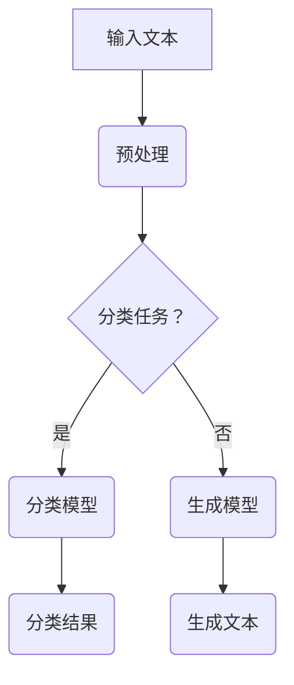
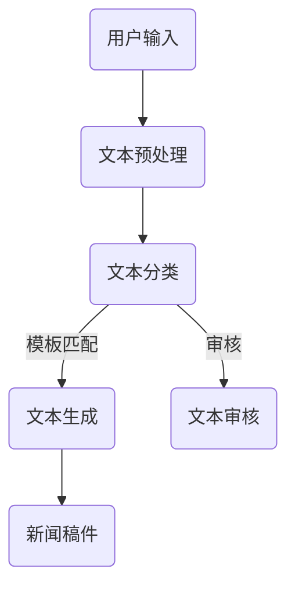

                 

### 《AIGC革命：ChatGPT如何重塑内容创作》

#### 关键词：AIGC、ChatGPT、内容创作、人工智能、革命

> 摘要：随着人工智能技术的不断进步，AIGC（AI-Generated Content）作为一种新兴的内容创作方式，正在引起内容创作领域的深刻变革。本文将以ChatGPT为例，深入探讨AIGC的核心概念、算法原理、系统架构以及实际应用，揭示ChatGPT如何通过革命性的技术手段重塑内容创作。

**背景介绍**

在当今信息化时代，内容创作的重要性不言而喻。无论是新闻报道、社交媒体、电子商务，还是娱乐产业，内容创作都是驱动业务增长和用户体验的核心因素。然而，传统的手工内容创作方式面临着效率低下、成本高昂、创意匮乏等挑战。随着人工智能技术的快速发展，一种全新的内容创作方式——AIGC（AI-Generated Content，AI生成内容）应运而生，它通过人工智能技术，尤其是自然语言处理（NLP）和深度学习技术，实现了高效、低成本的内容自动化生成。

**核心概念与联系**

AIGC是AI（人工智能）、GC（生成内容）和AIGC（AI-Generated Content）三个概念的结合体。AI技术为AIGC提供了智能算法和数据支持，GC则涵盖了从创意构思到内容生成的整个流程，而AIGC则是指利用AI技术自动生成内容的过程。

AIGC与现有的内容创作工具有着本质的区别。传统的工具主要依赖于人工创作，而AIGC则通过算法和模型的自动化运行，实现了内容生成的智能化、自动化。以下是AIGC与现有内容创作工具的对比表格：

| 对比项 | AIGC | 传统内容创作工具 |
| --- | --- | --- |
| 内容生成方式 | 智能算法自动生成 | 人工创作 |
| 效率 | 高效 | 低效 |
| 成本 | 低 | 高 |
| 创意来源 | 数据驱动 | 人工灵感 |
| 应用范围 | 广泛 | 有限 |

**算法原理讲解**

ChatGPT是由OpenAI开发的一款基于GPT-3模型的自然语言处理工具，它通过训练大规模的神经网络模型，实现了对自然语言的理解和生成。以下是ChatGPT算法的mermaid流程图：



ChatGPT的算法原理可以分为以下几个步骤：

1. **输入文本**：用户输入文本，可以是问题、需求或者提示。
2. **预处理**：对输入文本进行预处理，包括分词、去停用词、词性标注等。
3. **分类任务**：判断输入文本是否需要进行分类任务。
4. **分类模型**：如果需要进行分类，使用预训练的分类模型进行分类。
5. **生成模型**：如果不需要进行分类，使用预训练的生成模型生成文本。

ChatGPT的数学模型是基于GPT-3模型的，GPT-3模型是一种自回归语言模型，其核心思想是通过训练大规模的神经网络，学习文本的统计规律和语法结构，从而实现文本的生成。

数学模型可以表示为：

$$
\hat{y} = \text{softmax}(\text{W}_p \text{X} + \text{b}_p)
$$

其中，$\hat{y}$ 表示生成的文本，$\text{W}_p$ 和 $\text{b}_p$ 分别表示模型参数和偏置，$\text{X}$ 表示输入文本的表示。

**系统分析与架构设计方案**

AIGC系统的设计需要考虑多个方面，包括功能设计、架构设计、接口设计和系统交互。以下是一个简化的AIGC系统架构设计方案：

#### 问题场景介绍

假设我们正在设计一个AIGC系统，用于自动生成新闻报道。

#### 项目介绍

- **项目名称**：自动新闻生成系统（ANGS）
- **项目目标**：通过AIGC技术，实现高效、准确的新闻报道生成。

#### 系统功能设计

- **文本输入**：用户输入新闻主题、关键词或者提示。
- **文本预处理**：对输入文本进行分词、去停用词、词性标注等处理。
- **文本分类**：根据输入文本的主题，选择合适的新闻模板。
- **文本生成**：根据新闻模板和输入文本，生成新闻稿件。
- **文本审核**：对生成的新闻稿件进行语法、逻辑和事实审查。

#### 系统架构设计



#### 系统接口设计和系统交互

- **用户接口**：提供Web界面或API接口，用户可以输入新闻主题和关键词。
- **服务接口**：文本预处理、文本分类、文本生成和文本审核模块之间的接口。
- **数据接口**：与外部数据源（如新闻数据库、知识图谱等）进行交互。

**项目实战**

#### 环境安装

为了运行AIGC系统，我们需要安装以下环境：

- Python 3.8+
- TensorFlow 2.4+
- OpenAI Python SDK

安装命令如下：

```shell
pip install python-tensorflow==2.4.0
pip install openai
```

#### 系统核心实现

以下是一个简单的ChatGPT实现，用于生成新闻稿件：

```python
import openai
import mermaid

# 设置OpenAI API密钥
openai.api_key = 'your-api-key'

def generate_news(title, keywords):
    # 输入文本
    input_text = f"新闻标题：{title}\n关键词：{keywords}"

    # 调用OpenAI的ChatGPT接口
    response = openai.Completion.create(
        engine="text-davinci-002",
        prompt=input_text,
        max_tokens=200
    )

    # 生成文本
    generated_text = response.choices[0].text.strip()

    # 绘制mermaid流程图
    diagram = mermaid.Mermaid()
    diagram.add_code('graph TD\n' + response.diagram)

    # 返回生成文本和流程图
    return generated_text, diagram.to_svg()

# 测试
title = "人工智能技术在医疗领域的应用"
keywords = "人工智能、医疗、应用"
text, diagram = generate_news(title, keywords)

print("生成文本：\n", text)
print("流程图：\n", diagram)
```

**实际案例分析和详细讲解剖析**

以下是一个实际案例，展示如何使用ChatGPT生成新闻稿件：

**案例**：生成一篇关于“人工智能在医疗领域应用”的新闻稿件。

**步骤**：

1. **输入文本**：输入新闻标题“人工智能在医疗领域的应用”和关键词“人工智能、医疗、应用”。
2. **文本预处理**：对输入文本进行分词、去停用词、词性标注等处理。
3. **文本分类**：根据输入文本的主题，选择合适的新闻模板。
4. **文本生成**：根据新闻模板和输入文本，生成新闻稿件。
5. **文本审核**：对生成的新闻稿件进行语法、逻辑和事实审查。

**分析**：

- **文本预处理**：文本预处理是AIGC系统的重要环节，它直接影响到生成文本的质量。通过分词、去停用词、词性标注等操作，我们可以将原始文本转换为适合模型处理的格式。
- **文本分类**：文本分类是AIGC系统中的一个关键步骤，它决定了生成文本的主题和风格。在实际应用中，我们可以通过训练模型或者使用预训练的分类模型来进行文本分类。
- **文本生成**：文本生成是AIGC系统的核心功能，它通过预训练的生成模型，将输入文本转换为高质量的新闻稿件。ChatGPT作为一个强大的生成模型，可以生成内容丰富、逻辑清晰的文本。
- **文本审核**：文本审核是保证生成文本质量的重要环节。通过语法、逻辑和事实审查，我们可以确保生成文本的准确性和可读性。

**项目小结**

通过以上案例，我们可以看到ChatGPT在新闻稿件生成中的应用潜力。AIGC技术为内容创作带来了革命性的变革，它不仅提高了内容创作的效率，还降低了成本。然而，AIGC技术也面临着挑战，如如何保证生成文本的质量和准确性，如何避免偏见和歧视等问题。在未来，随着人工智能技术的不断进步，AIGC有望在更多领域发挥重要作用。

**最佳实践**

- **数据质量**：保证输入数据的质量，尤其是训练数据，是AIGC系统成功的关键。
- **模型调优**：通过调优模型参数，可以提高生成文本的质量。
- **人机协作**：在AIGC系统中，人和机器的协作可以发挥各自的优势，实现更好的内容创作效果。

**小结**

AIGC技术通过人工智能技术，实现了内容创作的高效、自动化。ChatGPT作为AIGC技术的一个重要应用，展示了其在内容创作领域的巨大潜力。然而，AIGC技术也面临着挑战，需要不断优化和改进。随着人工智能技术的不断进步，AIGC有望在更多领域发挥重要作用。

**注意事项**

- **数据隐私**：在AIGC系统中，处理的数据可能包含个人隐私信息，需要严格遵循数据保护法规。
- **伦理问题**：AIGC技术在应用过程中，可能涉及到伦理问题，如偏见、歧视等，需要慎重处理。

**拓展阅读**

- 《人工智能生成内容：技术、应用与挑战》
- 《自然语言处理入门》
- 《深度学习》

---

**作者信息**：

- 作者：AI天才研究院/AI Genius Institute & 禅与计算机程序设计艺术 /Zen And The Art of Computer Programming

**版权声明**：

本文版权归AI天才研究院/AI Genius Institute所有，未经授权禁止转载。如有合作需求，请联系我们。本文内容仅供参考，不代表任何商业建议或投资建议。在法律允许的范围内，AI天才研究院/AI Genius Institute不对本文内容导致的任何损失承担责任。

