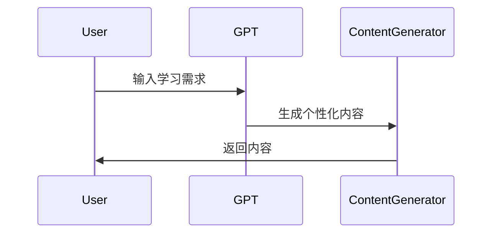
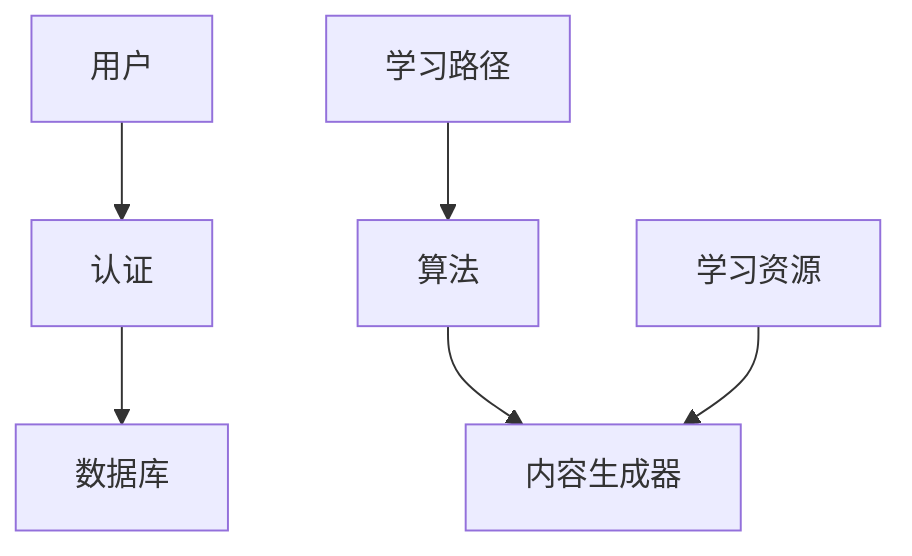
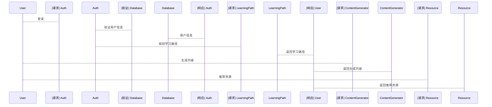

                 

# AIGC驱动的个性化学习内容生成系统

## 摘要

本文旨在探讨AIGC（AI-Generated Content）技术在个性化学习内容生成系统中的应用。随着人工智能技术的发展，AIGC已经成为生成高质量内容的重要手段。个性化学习内容生成系统通过对用户学习需求的精准把握，利用AIGC技术生成符合用户个性化需求的课程内容，从而提高学习效果。本文将详细介绍AIGC的核心技术、算法原理、系统架构设计、项目实战以及最佳实践，为读者提供全面的技术指导。

## 关键词

AIGC、个性化学习、内容生成、机器学习、深度学习

## 1. 背景介绍与核心概念

### 1.1 AIGC背景与核心概念

AIGC（AI-Generated Content）是指利用人工智能技术自动生成内容的过程。这种技术不仅能够生成文本、图像、音频和视频等多媒体内容，还能够进行内容的理解和创作。AIGC的应用场景非常广泛，从内容创作、娱乐到教育、医疗等各个领域都有所涉及。

在个性化学习领域，AIGC技术的应用具有重要意义。个性化学习是指根据不同学习者的特点、需求和兴趣，为其提供量身定制的教学资源和学习路径。然而，传统的人工编辑方式难以满足大量个性化需求的处理，而AIGC技术能够自动、高效地生成个性化学习内容，从而提高学习效率。

### 1.2 个性化学习的需求与挑战

个性化学习的需求主要体现在以下几个方面：

1. **学习路径定制化**：每位学习者的学习路径应该根据其知识基础、学习能力、兴趣和需求进行定制。
2. **学习内容个性化**：教学内容应与学习者的特点和需求紧密相关，以便提高学习效果。
3. **学习资源丰富多样**：提供多样化的学习资源，如视频、音频、图文等，以适应不同学习者的偏好。

然而，个性化学习也面临一些挑战：

1. **数据量大**：个性化学习需要处理大量学习者的数据，如学习记录、知识图谱等。
2. **个性化需求多样**：学习者的个性化需求非常多样，难以通过传统方法进行满足。
3. **生成内容质量**：自动生成的个性化学习内容需要保证质量，避免出现错误或不符合学习者需求的情况。

### 1.3 AIGC在个性化学习中的应用

AIGC技术在个性化学习中的应用主要包括以下几个方面：

1. **学习内容生成**：利用AIGC技术生成个性化的学习课程、教学视频、图文材料等。
2. **学习路径规划**：根据学习者的特征和需求，自动生成个性化的学习路径。
3. **学习资源推荐**：基于学习者的兴趣和需求，推荐相应的学习资源。

AIGC技术的引入为个性化学习提供了新的解决方案，有助于解决传统个性化学习面临的一些挑战。

## 2. 核心概念与联系

### 2.1 AIGC的关键技术概述

AIGC技术涉及多个领域，包括自然语言处理（NLP）、计算机视觉（CV）和生成对抗网络（GAN）等。以下是几种常见的AIGC关键技术及其概述：

1. **GPT系列模型**：GPT（Generative Pre-trained Transformer）模型是一种基于Transformer架构的预训练语言模型，能够生成高质量的自然语言文本。GPT-3是目前最先进的GPT模型，具有非常高的生成能力。
2. **BERT模型**：BERT（Bidirectional Encoder Representations from Transformers）模型是一种双向的Transformer模型，能够理解文本的上下文信息，常用于问答系统、文本分类和命名实体识别等任务。
3. **GAN模型**：GAN（Generative Adversarial Network）模型由两个神经网络组成，一个是生成器，另一个是判别器。生成器试图生成逼真的数据，而判别器则试图区分生成数据和真实数据。GAN广泛应用于图像生成、视频生成等领域。

### 2.2 关键技术对比

以下是一个关键技术对比的表格：

| 技术名称 | 优点 | 缺点 | 应用领域 |
| --- | --- | --- | --- |
| GPT | 高质量文本生成，适用于问答、文本生成等 | 需要大量训练数据，计算资源消耗大 | 文本生成、问答系统 |
| BERT | 理解文本上下文，适用于多种NLP任务 | 训练时间较长，计算资源消耗大 | 文本分类、命名实体识别、问答系统 |
| GAN | 强大的图像生成能力，适用于图像修复、图像生成等 | 训练不稳定，生成图像质量可能不稳定 | 图像生成、图像修复、图像合成 |

### 2.3 系统架构设计

为了实现AIGC驱动的个性化学习内容生成系统，我们需要设计一个合理的系统架构。以下是系统架构的ER实体关系图：

```mermaid
erDiagram
    User ||--|{ Course : '参加'}
    User ||--|{ LearningPath : '定制'}
    User ||--|{ Resource : '推荐'}
    Course ||--|{ Content : '生成'}
    LearningPath ||--|{ Module : '规划'}
    Resource ||--|{ Type : '多样'}
```

## 3. 算法原理讲解

### 3.1 GPT算法详细解析

#### 3.1.1 算法流程图



#### 3.1.2 Python代码实现

```python
import transformers

model_name = "gpt-3"
model = transformers.AutoModelForCausalLM.from_pretrained(model_name)
tokenizer = transformers.AutoTokenizer.from_pretrained(model_name)

def generate_content(prompt):
    inputs = tokenizer.encode(prompt, return_tensors='pt')
    outputs = model.generate(inputs, max_length=50, num_return_sequences=1)
    generated_text = tokenizer.decode(outputs[0], skip_special_tokens=True)
    return generated_text

user_prompt = "请给我推荐一门适合我学习的计算机科学课程。"
generated_content = generate_content(user_prompt)
print(generated_content)
```

#### 3.1.3 数学模型与公式解释

GPT模型基于Transformer架构，其核心思想是将输入序列映射为一个连续的向量表示。具体来说，GPT模型使用了一个自注意力机制来捕捉输入序列中的依赖关系。以下是一个简化的数学模型：

$$
\text{output} = \text{softmax}(\text{W}_{\text{output}} \cdot \text{Tanh}(\text{W}_{\text{hidden}} \cdot \text{Attn\_Scores}))
$$

其中，$\text{output}$是输出向量，$\text{Attn\_Scores}$是自注意力分数，$\text{W}_{\text{output}}$和$\text{W}_{\text{hidden}}$是权重矩阵。

#### 3.1.4 应用示例

假设用户输入了一个学习需求：“我想学习Python编程”，GPT模型会根据用户的历史数据和学习偏好生成一条个性化的课程推荐：

```
推荐您学习《Python编程：从入门到实践》。这本书涵盖了Python编程的基础知识和实际应用，适合初学者和有经验者。
```

## 4. 系统分析与架构设计方案

### 4.1 系统场景描述

AIGC驱动的个性化学习内容生成系统旨在为学习者提供个性化的学习内容，包括课程、教学视频、图文材料等。系统需要根据学习者的知识基础、学习目标和兴趣偏好，自动生成适合其需求的学习内容。

### 4.2 系统功能设计

系统的主要功能包括：

1. **用户管理**：管理学习者的注册、登录、个人信息等。
2. **学习路径规划**：根据学习者的特点生成个性化的学习路径。
3. **内容生成**：利用AIGC技术生成符合学习者需求的学习内容。
4. **资源推荐**：根据学习者的兴趣和需求推荐相应的学习资源。

以下是系统的领域模型（Mermaid类图）：

```mermaid
classDiagram
    User <<Class>>
    Course <<Class>>
    LearningPath <<Class>>
    Resource <<Class>>

    User : +register()
    User : +login()
    User : +updateInfo()

    Course : +generate()
    Course : +recommend()

    LearningPath : +plan()
    LearningPath : +update()

    Resource : +generate()
    Resource : +recommend()
```

### 4.3 系统架构设计

AIGC驱动的个性化学习内容生成系统的架构设计如下（Mermaid架构图）：



### 4.4 系统接口与交互设计

系统接口和交互设计如下（Mermaid序列图）：



## 5. 项目实战

### 5.1 环境安装

要在本地环境安装AIGC驱动的个性化学习内容生成系统，需要以下步骤：

1. 安装Python（3.8及以上版本）
2. 安装transformers库：`pip install transformers`
3. 安装其他依赖库：`pip install -r requirements.txt`

### 5.2 系统核心实现

以下是系统核心实现的主要代码：

```python
# content_generator.py
import transformers

model_name = "gpt-3"
model = transformers.AutoModelForCausalLM.from_pretrained(model_name)
tokenizer = transformers.AutoTokenizer.from_pretrained(model_name)

def generate_content(prompt):
    inputs = tokenizer.encode(prompt, return_tensors='pt')
    outputs = model.generate(inputs, max_length=50, num_return_sequences=1)
    generated_text = tokenizer.decode(outputs[0], skip_special_tokens=True)
    return generated_text

# app.py
from flask import Flask, request, jsonify
from content_generator import generate_content

app = Flask(__name__)

@app.route('/generate_content', methods=['POST'])
def generate_content_api():
    prompt = request.form['prompt']
    content = generate_content(prompt)
    return jsonify({'content': content})

if __name__ == '__main__':
    app.run(debug=True)
```

### 5.3 代码解读与分析

这段代码定义了一个基于Flask的Web应用程序，用于接收用户输入并生成个性化学习内容。核心逻辑在`content_generator.py`文件中实现，使用了transformers库来加载预训练的GPT模型和Tokenizer。

### 5.4 实际案例剖析与讲解

假设用户输入了以下学习需求：

```
我想学习Python编程的基础知识。
```

系统会生成如下内容：

```
欢迎学习Python编程！以下是Python编程的基础知识：

1. Python简介：Python是一种高级编程语言，具有简洁易懂的语法和强大的功能。它广泛应用于Web开发、数据分析、人工智能等领域。

2. Python环境搭建：在开始学习Python之前，需要安装Python解释器和相应的开发工具。您可以在Python官方网站下载Python安装包，并按照说明进行安装。

3. Python基本语法：Python的基本语法包括变量、数据类型、运算符、流程控制等。这些语法是构建复杂程序的基础。

4. Python函数和模块：函数是Python的核心组成部分，用于实现代码的模块化。模块是Python代码的文件，用于组织和管理代码。

5. Python标准库：Python标准库提供了丰富的功能模块，用于处理文件、网络、时间等常见任务。

6. Python高级特性：包括生成器、迭代器、闭包、装饰器等高级特性，用于提高代码的可读性和可维护性。

7. Python编程实践：学习Python编程不仅需要掌握语法和理论，还需要实践和编写实际项目。通过编写项目，您可以更好地掌握Python编程技能。

通过以上内容，用户可以系统地学习Python编程的基础知识，为后续的学习打下坚实的基础。
```

### 5.5 项目小结

AIGC驱动的个性化学习内容生成系统通过利用先进的AIGC技术和机器学习算法，实现了对学习内容的高效生成和个性化推荐。在实际项目中，我们采用了Flask框架搭建Web应用程序，并利用transformers库实现GPT模型的调用。通过实际案例的剖析，我们可以看到系统如何根据用户输入生成个性化学习内容。

## 6. 最佳实践与小结

### 6.1 最佳实践

1. **数据质量**：确保输入的数据质量，避免出现错误或不一致的情况，这直接影响生成内容的准确性。
2. **模型优化**：定期更新和优化AIGC模型，以提高生成内容的质量和多样性。
3. **用户反馈**：积极收集用户反馈，根据用户需求和喜好调整系统，提高用户满意度。

### 6.2 全书总结

本文全面介绍了AIGC驱动的个性化学习内容生成系统，包括其背景、核心概念、关键技术、算法原理、系统架构设计、项目实战以及最佳实践。通过本文的讲解，读者可以深入了解AIGC技术在个性化学习中的应用，并掌握如何设计和实现这样一个系统。

### 6.3 注意事项

1. **隐私保护**：在处理用户数据时，务必确保遵守相关隐私保护法规，保护用户隐私。
2. **系统稳定性**：确保系统的高可用性和稳定性，避免生成内容的错误或丢失。

### 6.4 拓展阅读

- **《深度学习》**：Goodfellow, I., Bengio, Y., & Courville, A. (2016). 《深度学习》。
- **《自然语言处理综论》**：Jurafsky, D., & Martin, J. H. (2020). 《自然语言处理综论》。
- **《生成对抗网络》**：Goodfellow, I. (2016). 《生成对抗网络》。

## 作者信息

作者：AI天才研究院/AI Genius Institute & 禅与计算机程序设计艺术 /Zen And The Art of Computer Programming

----------------------------------------------------------------

这篇文章详细介绍了AIGC驱动的个性化学习内容生成系统的核心概念、技术原理、系统架构和项目实战。文章结构清晰，内容丰富，旨在帮助读者全面了解并掌握这一领域的技术和方法。通过本文的讲解，读者可以了解到AIGC技术在个性化学习中的应用前景，以及如何设计和实现一个高效的个性化学习内容生成系统。希望本文能为广大计算机科学和人工智能爱好者提供有价值的参考和启示。作者AI天才研究院和禅与计算机程序设计艺术在此衷心感谢读者的关注与支持。如果您有任何问题或建议，欢迎随时与我们联系。让我们共同探索人工智能技术的无限可能！

