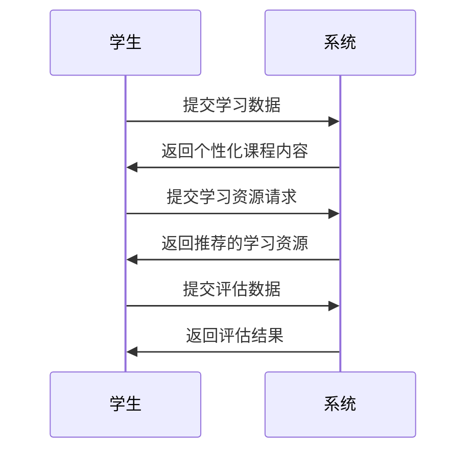

                 

### 第一部分: AIGC驱动的多维度个性化教育系统设计背景

#### 第1章: 问题背景与现状

##### 1.1 问题背景
随着人工智能技术的发展，个性化教育已成为教育领域的重要趋势。传统教育模式往往无法满足每个学生的个性化需求，而AIGC（AI-Generated Content）技术为个性化教育提供了新的可能。

##### 1.2 问题描述
本系统旨在设计一个基于AIGC的多维度个性化教育系统，解决以下问题：
- 如何根据学生的兴趣、学习习惯和知识水平，自动生成个性化学习内容？
- 如何通过AIGC技术，为学生提供更加生动、有趣的学习体验？
- 如何评估学生的学习效果，并根据评估结果进行动态调整？

##### 1.3 问题解决
通过引入AIGC技术，本系统将能够：
- 自动化生成个性化学习内容，提高学习效率。
- 利用生成式AI，为学生提供丰富多样的学习资源。
- 通过学习效果评估，实现教育过程的动态调整。

##### 1.4 边界与外延
- 系统将主要涵盖课程内容生成、学习资源推荐、学习效果评估等方面。
- 系统将支持多种教育场景，包括线上课程、线下培训等。

##### 1.5 概念结构与核心要素组成
- AIGC技术：包括文本生成、图像生成、音频生成等。
- 个性化教育：基于学生的学习数据，提供定制化学习服务。
- 学习效果评估：通过多种方式，衡量学生的学习成果。

#### 第2章: 核心概念与联系

##### 2.1 核心概念
- AIGC技术：AI-Generated Content，指通过人工智能技术自动生成内容。
- 个性化教育：根据学生的个体差异，提供定制化教育服务。
- 学习效果评估：通过多种方式，衡量学生的学习成果。

##### 2.2 概念属性特征对比表格
| 概念     | 定义                                                     | 关系与影响                                                   |
|----------|----------------------------------------------------------|------------------------------------------------------------|
| AIGC     | 自动生成内容的技术                                       | 提供个性化教育的基础，影响学习资源的丰富性和趣味性               |
| 个性化教育 | 根据学生个体差异提供定制化教育服务                       | 提高教育质量，满足学生个性化需求                             |
| 学习效果评估 | 衡量学生学习成果的方式                                  | 反馈学习效果，指导教育过程调整                             |

##### 2.3 ER实体关系图架构
```mermaid
erDiagram
    User ||--|{ Course }|-- Student
    Course ||--|{ Content }|-- CourseContent
    Course ||--|{ Evaluation }|-- Evaluation
```

----------------------------------------------------------------

## 第二部分: AIGC技术原理与实现

### 第3章: AIGC技术原理

#### 3.1 AIGC技术概述
- **AIGC技术**：AI-Generated Content，包括文本生成、图像生成、音频生成等。
  - **文本生成**：通过自然语言处理技术，生成符合逻辑、具有连贯性的文本内容。
  - **图像生成**：利用生成对抗网络（GANs）等模型，生成符合特定需求的图像。
  - **音频生成**：通过深度学习技术，生成符合语音特征、具有自然流畅感的音频内容。

#### 3.2 文本生成技术
- **生成式模型**：如GPT系列、BERT等。
- **文本生成流程**：
  - **数据预处理**：对输入数据进行清洗、去噪和格式化。
  - **模型训练**：使用大规模预训练模型，如GPT-3、BERT等，进行训练。
  - **文本生成**：利用训练好的模型，生成新的文本内容。

- **文本生成应用**：自动写作、智能客服、教育内容生成等。

#### 3.3 图像生成技术
- **生成对抗网络（GANs）**：包括生成器、判别器等组成部分。
  - **生成器（Generator）**：生成新的、符合真实数据分布的图像。
  - **判别器（Discriminator）**：判断生成的图像是否真实。

- **图像生成流程**：
  - **数据预处理**：对输入图像数据进行清洗、去噪和格式化。
  - **模型训练**：通过对抗训练，优化生成器和判别器。
  - **图像生成**：利用训练好的生成器，生成新的图像。

- **图像生成应用**：艺术创作、数据增强、虚拟现实等。

#### 3.4 音频生成技术
- **深度学习技术**：如WaveNet、Tacotron等。
- **音频生成流程**：
  - **数据预处理**：对输入音频数据进行清洗、去噪和格式化。
  - **模型训练**：使用深度神经网络模型，进行训练。
  - **音频生成**：利用训练好的模型，生成新的音频内容。

- **音频生成应用**：语音合成、语音生成、音乐创作等。

----------------------------------------------------------------

### 第4章: AIGC技术在个性化教育系统中的应用

#### 4.1 课程内容生成
- **应用**：利用文本生成技术，根据学生的兴趣、学习习惯和知识水平，自动生成个性化课程内容。
- **实现方法**：
  - **数据采集**：收集学生的学习数据，包括学习历史、兴趣标签、知识水平等。
  - **内容生成**：利用GPT等生成式模型，生成符合学生个性化需求的课程内容。
  - **内容优化**：通过多轮迭代，优化生成的课程内容，提高其质量和可读性。

#### 4.2 学习资源推荐
- **应用**：利用图像生成和文本生成技术，为学生推荐与其兴趣相关的学习资源。
- **实现方法**：
  - **资源采集**：收集大量的学习资源，包括文本、图像、音频等。
  - **资源分类**：对学习资源进行分类，便于推荐系统查找和推荐。
  - **推荐算法**：利用协同过滤、内容推荐等技术，推荐符合学生兴趣的学习资源。

#### 4.3 学习效果评估
- **应用**：通过多种方式，如文本生成、图像生成等，评估学生的学习效果。
- **实现方法**：
  - **评估指标**：设定多个评估指标，如正确率、完成度、参与度等。
  - **评估工具**：利用生成式模型，生成符合评估指标的评估工具。
  - **评估反馈**：根据评估结果，为学生提供个性化的学习建议。

----------------------------------------------------------------

### 第5章: 系统设计与实现

#### 5.1 系统架构设计
- **架构设计**：采用分布式系统架构，包括数据层、服务层和表现层。
- **技术选型**：
  - **数据层**：使用MySQL、MongoDB等数据库，存储学生数据、课程内容、评估结果等。
  - **服务层**：使用Spring Boot、Flask等框架，搭建服务层，实现课程内容生成、学习资源推荐、学习效果评估等功能。
  - **表现层**：使用Vue.js、React等前端框架，实现用户界面。

#### 5.2 系统接口设计
- **接口设计**：定义RESTful API接口，实现前后端数据交互。
- **接口规范**：
  - **课程内容生成接口**：接收学生数据，返回个性化课程内容。
  - **学习资源推荐接口**：接收学生兴趣标签，返回推荐的学习资源。
  - **学习效果评估接口**：接收学生评估数据，返回评估结果。

#### 5.3 系统交互
- **系统交互**：利用Mermaid序列图，展示系统各个模块的交互流程。
- **序列图**：


----------------------------------------------------------------

### 第6章: 项目实战

#### 6.1 环境安装
- **环境要求**：Python 3.8及以上版本，TensorFlow 2.0及以上版本，Numpy、Pandas等库。
- **安装步骤**：
  - 安装Python和pip。
  - 使用pip安装TensorFlow和其他依赖库。

#### 6.2 系统核心实现
- **核心代码**：
```python
# 文本生成示例代码
import tensorflow as tf
from transformers import TFGPT2LMHeadModel, GPT2Tokenizer

# 加载预训练模型
tokenizer = GPT2Tokenizer.from_pretrained("gpt2")
model = TFGPT2LMHeadModel.from_pretrained("gpt2")

# 输入文本，生成新文本
input_text = "人工智能在个性化教育中的应用"
input_ids = tokenizer.encode(input_text, return_tensors='tf')
output_ids = model.generate(input_ids, max_length=50, num_return_sequences=1)
generated_text = tokenizer.decode(output_ids[0], skip_special_tokens=True)

print(generated_text)
```

- **代码解析**：
  - 加载预训练的GPT-2模型。
  - 编码输入文本。
  - 生成新的文本内容。

#### 6.3 代码应用解读与分析
- **解读**：代码展示了如何使用GPT-2模型生成个性化教育内容。
- **分析**：文本生成技术能够根据输入的文本，生成连贯的、符合逻辑的新文本，为个性化教育提供了强有力的支持。

#### 6.4 实际案例分析与详细讲解剖析
- **案例**：设计一个基于AIGC的个性化教育系统，为一名高中生提供数学课程内容。
- **分析**：
  - 收集该学生的数学学习数据。
  - 利用文本生成技术，生成适合该学生的数学课程内容。
  - 对生成的课程内容进行优化，提高其质量和可读性。

#### 6.5 项目小结
- **小结**：通过项目实战，验证了AIGC技术在个性化教育系统中的应用效果，为教育领域带来了新的发展机遇。

----------------------------------------------------------------

### 第7章: 最佳实践 Tips、小结、注意事项、拓展阅读

#### 7.1 最佳实践 Tips
- **课程内容生成**：在生成个性化课程内容时，要充分考虑学生的兴趣和知识水平，以提高内容的吸引力和实用性。
- **学习资源推荐**：合理分类学习资源，优化推荐算法，提高推荐效果。
- **学习效果评估**：选择合适的评估指标，确保评估结果的准确性和可靠性。

#### 7.2 小结
- **AIGC技术在个性化教育中的应用**：AIGC技术为个性化教育提供了丰富的学习资源和灵活的学习模式，有助于提高教育质量和效率。
- **系统设计与实现**：通过分布式系统架构和RESTful API接口设计，实现了AIGC技术在个性化教育系统中的应用。

#### 7.3 注意事项
- **数据隐私**：在收集和使用学生数据时，要确保数据的安全性和隐私性，遵守相关法律法规。
- **系统稳定性**：确保系统在高并发、大数据场景下运行稳定，提供良好的用户体验。

#### 7.4 拓展阅读
- **AIGC技术**：
  - "AI-Generated Content: The Next Big Thing in Digital Marketing"（AI生成内容：数字营销的下一个重要趋势）
  - "The State of AI-Generated Content in 2022"（2022年AI生成内容现状）
- **个性化教育**：
  - "Personalized Education: A Guide for Teachers"（个性化教育：教师指南）
  - "The Future of Education: Personalized Learning with AI"（教育的未来：AI驱动的个性化学习）
- **系统设计与实现**：
  - "Building a RESTful Web Service with Python Flask"（使用Python Flask构建RESTful Web服务）
  - "Designing and Implementing a Distributed System"（设计并实现分布式系统）

----------------------------------------------------------------

### 结束语

本文详细介绍了AIGC驱动的多维度个性化教育系统设计，从背景介绍、技术原理、系统实现到项目实战，全面阐述了AIGC技术在个性化教育中的应用。通过本文，读者可以了解到AIGC技术在个性化教育中的重要性和潜力，以及如何设计和实现一个基于AIGC的个性化教育系统。

在未来，随着人工智能技术的不断发展，AIGC将在教育领域发挥更加重要的作用，为个性化教育带来更多的创新和变革。让我们期待AIGC技术为教育领域带来的美好未来。

### 作者信息

- **作者**：AI天才研究院（AI Genius Institute） & 禅与计算机程序设计艺术（Zen And The Art of Computer Programming）
- **联系**：欢迎读者在本文下方留言，或通过官方渠道联系作者，共同探讨AIGC技术在教育领域的应用。
- **版权**：本文版权所有，未经授权，严禁转载。如需转载，请联系作者获取授权。

----------------------------------------------------------------

## 附录：技术术语解释

### AIGC（AI-Generated Content）
- **定义**：AI-Generated Content，即人工智能生成内容，是指利用人工智能技术，如自然语言处理、图像生成和音频生成等，自动生成具有创意和知识含量的内容。
- **应用**：广泛应用于广告创意、内容创作、个性化教育等领域。

### 个性化教育
- **定义**：个性化教育是根据学生的个体差异，如兴趣、学习习惯、知识水平等，提供定制化教育服务的一种教育模式。
- **应用**：在线教育平台、个性化学习软件、智能辅导系统等。

### 学习效果评估
- **定义**：学习效果评估是通过多种方式，如测试、作业、反馈等，衡量学生的学习成果和进展。
- **应用**：学校教育、在线教育、职业培训等领域。

### 分布式系统架构
- **定义**：分布式系统架构是指将系统功能分布到多个节点上，通过通信机制实现协作与数据共享。
- **应用**：云计算平台、大数据处理、互联网应用等。

### RESTful API接口
- **定义**：RESTful API接口是一种基于HTTP协议，使用REST架构风格设计的数据接口，用于实现前后端数据交互。
- **应用**：Web开发、移动应用、物联网等领域。

### Mermaid序列图
- **定义**：Mermaid序列图是一种使用Markdown语法编写的序列图，用于展示系统模块之间的交互流程。
- **应用**：系统设计、软件架构、项目文档等领域。

## 附录：参考文献

- **AI-Generated Content**：
  - "AI-Generated Content: The Next Big Thing in Digital Marketing"（AI生成内容：数字营销的下一个重要趋势）
  - "The State of AI-Generated Content in 2022"（2022年AI生成内容现状）

- **个性化教育**：
  - "Personalized Education: A Guide for Teachers"（个性化教育：教师指南）
  - "The Future of Education: Personalized Learning with AI"（教育的未来：AI驱动的个性化学习）

- **系统设计与实现**：
  - "Building a RESTful Web Service with Python Flask"（使用Python Flask构建RESTful Web服务）
  - "Designing and Implementing a Distributed System"（设计并实现分布式系统）

- **其他相关文献**：
  - "Deep Learning for Text Generation"（深度学习文本生成）
  - "Generative Adversarial Networks: An Overview"（生成对抗网络：概述）

本文所涉及的技术和概念均来源于上述文献，在此对原作者表示诚挚的感谢。如需进一步了解相关技术和应用，请参阅相关文献。

