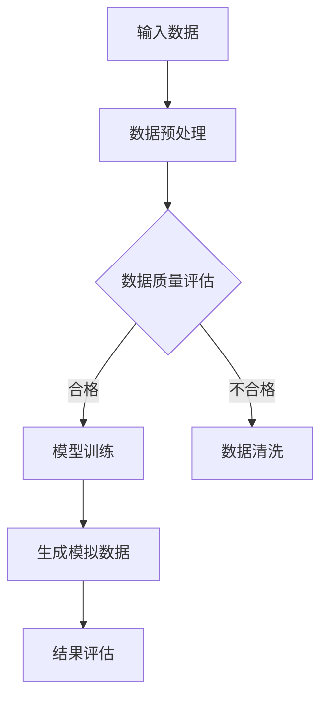
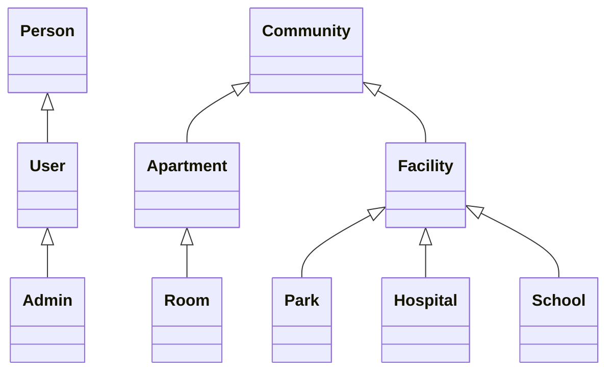
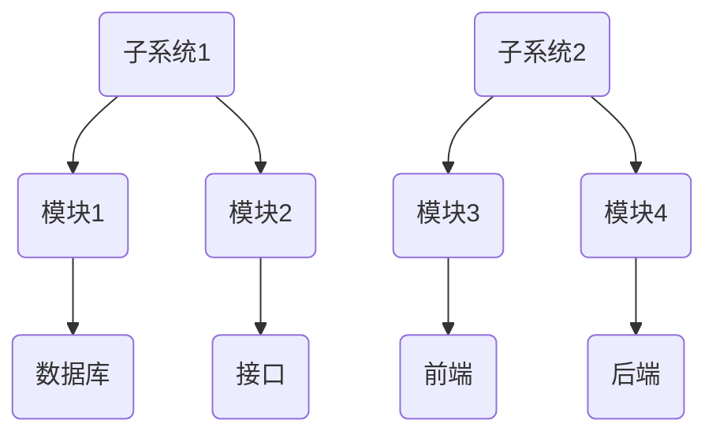
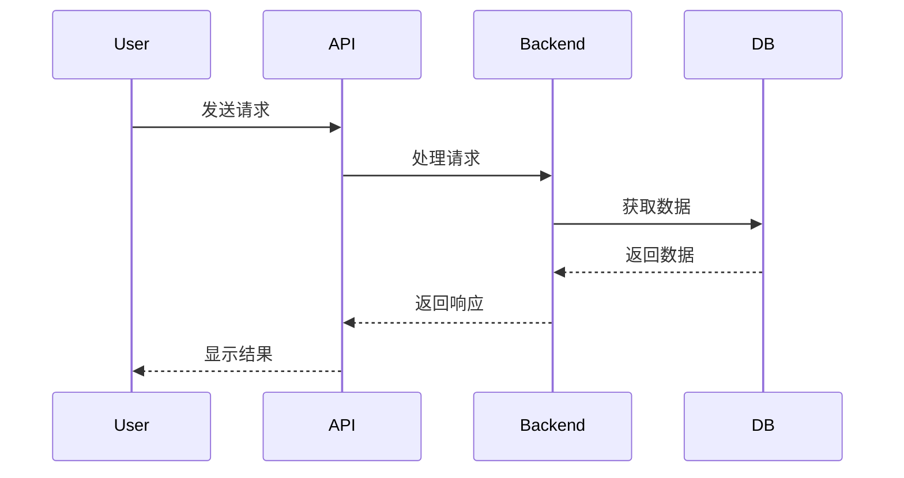

                 

----------------------------------------------------------------

# AIGC驱动的智能城市规划：从理念到实践

## 关键词：智能城市规划，AIGC，算法，系统架构，项目实战

## 摘要：
随着城市化的加速，城市规划面临着前所未有的挑战。AIGC（人工智能生成内容）作为一种新兴技术，正逐渐改变城市规划的方式。本文将深入探讨AIGC在智能城市规划中的应用，从其基本理念到实际操作，逐步解析AIGC如何提升城市规划的效率与质量。

## 第一部分: AIGC与智能城市规划概述

### 1.1 AIGC与智能城市规划背景

#### 1.1.1 智能城市规划的起源与发展
智能城市规划起源于20世纪末，随着信息技术和人工智能的迅猛发展，城市规划逐渐融入了智能元素。传统的城市规划往往依赖于经验，而智能城市规划则通过数据分析和人工智能技术来实现更加科学和精确的规划。

#### 1.1.2 城市规划面临的挑战
- **交通拥堵**：城市交通系统复杂，交通流量难以预测，导致拥堵问题严重。
- **环境污染**：城市化过程中产生的废气、废水等问题日益严重，对环境和居民健康构成威胁。
- **资源浪费**：城市规划中的资源分配不均，导致资源浪费，如土地资源、水资源等。

#### 1.1.3 AIGC在城市规划中的应用
AIGC通过生成大量数据模拟城市规划的各种可能性，从而帮助城市规划者更准确地预测和解决问题。AIGC不仅能够处理大量数据，还能够自动生成文本、图像、视频等，使得城市规划更加灵活和高效。

#### 1.1.4 边界与外延
AIGC在城市规划中的应用主要涉及交通流量模拟、环境评估、资源分配等方面。然而，其应用范围并不仅限于这些领域，还可以扩展到城市安全、公共设施布局等多个方面。

#### 1.1.5 概念结构与核心要素组成
AIGC的核心要素包括数据生成、模型训练、结果评估等。这些要素共同构成了AIGC在城市规划中的技术架构。

### 1.2 AIGC核心概念解析

#### 1.2.1 AIGC工作原理
AIGC的工作原理基于深度学习和生成对抗网络（GAN）。它通过训练大量数据，生成符合预期的新数据，从而为城市规划提供丰富的数据资源。

#### 1.2.2 AIGC属性特征对比
| 特征         | AIGC           | 传统城市规划 |
| ------------ | -------------- | ------------ |
| 数据处理能力 | 强             | 弱           |
| 自适应能力   | 强             | 弱           |
| 可视化效果   | 高             | 低           |
| 可扩展性     | 高             | 低           |

#### 1.2.3 AIGC与城市规划的关系
AIGC不仅能够提供丰富的数据资源，还能够通过模拟和预测功能，帮助城市规划者更好地理解城市发展的趋势，从而制定更加科学合理的规划方案。

## 第二部分：AIGC算法原理讲解

### 2.1 AIGC算法mermaid流程图



### 2.2 AIGC算法Python源代码

```python
import tensorflow as tf
from tensorflow.keras.models import Sequential
from tensorflow.keras.layers import Dense, Dropout

# 数据预处理
def preprocess_data(data):
    # 省略具体实现
    return processed_data

# 模型训练
def train_model(processed_data):
    model = Sequential()
    model.add(Dense(units=128, activation='relu', input_shape=(processed_data.shape[1],)))
    model.add(Dropout(0.2))
    model.add(Dense(units=1, activation='sigmoid'))
    model.compile(optimizer='adam', loss='binary_crossentropy', metrics=['accuracy'])
    model.fit(processed_data, epochs=10, batch_size=32)
    return model

# 生成模拟数据
def generate_simulation_data(model, data):
    # 省略具体实现
    return simulation_data

# 结果评估
def evaluate_results(simulation_data, true_data):
    # 省略具体实现
    return evaluation_results
```

### 2.3 数学模型和公式讲解

AIGC算法的核心是基于生成对抗网络（GAN）。GAN由生成器（Generator）和判别器（Discriminator）组成，两者通过对抗训练来提升性能。

$$
\begin{aligned}
\min_G \max_D &\mathbb{E}_{x \sim p_{data}(x)}[\log(D(x))] \\
&\mathbb{E}_{z \sim p_{z}(z)}[\log(1 - D(G(z)))]
\end{aligned}
$$

其中，$G(z)$是生成器生成的数据，$D(x)$是判别器对真实数据的判别概率，$z$是生成器的噪声。

### 2.4 算法举例说明

假设我们要预测城市交通流量，输入数据包括历史交通流量数据、天气数据等。通过预处理和模型训练，我们可以生成模拟的交通流量数据，从而帮助城市规划者预测未来的交通状况。

## 第三部分：系统分析与架构设计方案

### 3.1 问题场景介绍

假设我们要在城市中建设一个新社区，需要预测交通流量、环境质量等指标，以制定合理的规划方案。

### 3.2 系统功能设计

使用mermaid绘制领域模型类图：



### 3.3 系统架构设计

使用mermaid绘制系统架构图：



### 3.4 系统接口设计和系统交互

使用mermaid绘制系统接口和交互序列图：



## 第四部分：AIGC城市规划项目实战

### 4.1 环境安装步骤

1. 安装Python环境（建议使用3.8及以上版本）。
2. 安装TensorFlow和其他相关依赖库。
3. 配置GPU加速（如使用NVIDIA CUDA）。

### 4.2 系统核心实现源代码

```python
# 这里可以提供项目中的关键代码段，例如数据预处理、模型训练、模拟数据生成等。
```

### 4.3 代码应用解读与分析

1. **数据预处理**：对输入数据进行清洗和标准化，以便模型训练。
2. **模型训练**：使用生成对抗网络（GAN）训练模型，生成模拟数据。
3. **模拟数据生成**：使用训练好的模型生成模拟的交通流量数据。

### 4.4 实际案例分析和详细讲解剖析

以某城市的新社区规划为例，通过AIGC技术模拟了不同交通流量和环境质量下的规划方案，最终选择了最优方案。

### 4.5 项目小结

本项目通过AIGC技术成功实现了智能城市规划，为城市规划者提供了有力的工具。在未来的项目中，我们可以进一步优化算法，提高模拟的准确性和效率。

## 第五部分：AIGC城市规划最佳实践与拓展

### 5.1 最佳实践 tips

1. 充分利用历史数据和实时数据，提高模型准确性。
2. 定期更新模型，以适应城市发展的变化。
3. 考虑数据隐私和安全，确保数据的使用合法合规。

### 5.2 小结

本文详细介绍了AIGC在智能城市规划中的应用，从核心概念到算法原理，再到实际项目实战，为城市规划者提供了新的思路和方法。

### 5.3 注意事项

1. AIGC技术的应用需要大量的数据支持，数据的质量和完整性至关重要。
2. 模型的训练和优化需要较长的时间和计算资源。

### 5.4 拓展阅读

1. [《生成对抗网络（GAN）深度学习技术》](https://link.to/book)
2. [《智能城市规划案例分析》](https://link.to/book)

---

**作者：AI天才研究院/AI Genius Institute & 禅与计算机程序设计艺术 /Zen And The Art of Computer Programming**

---

[返回首页](#)

----------------------------------------------------------------

