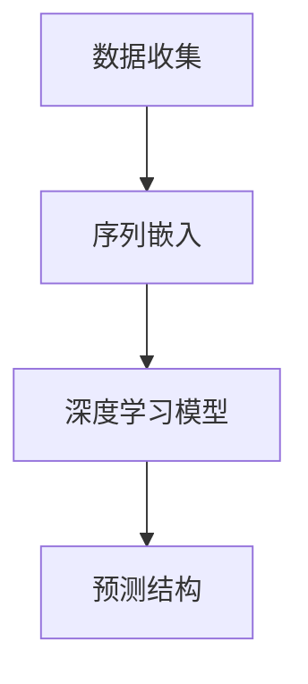
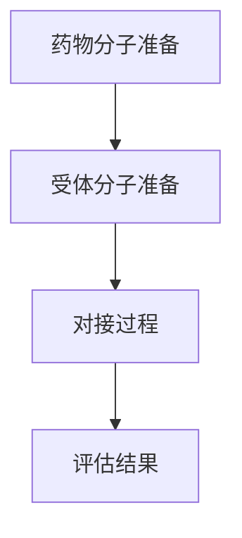
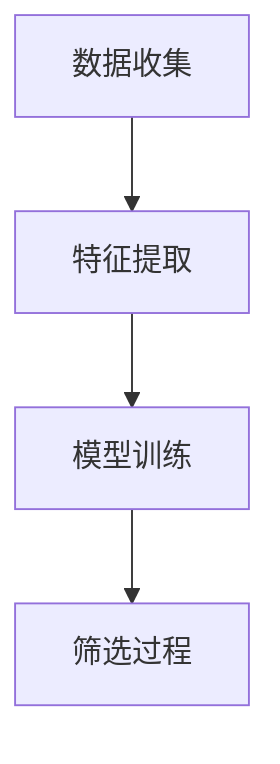
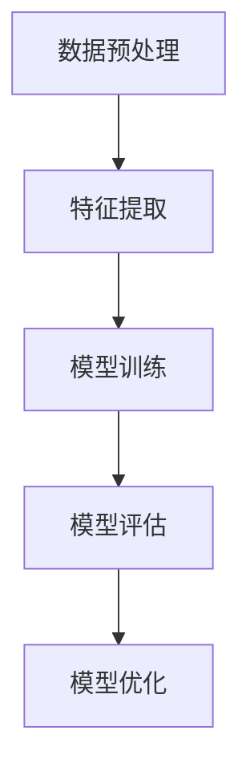
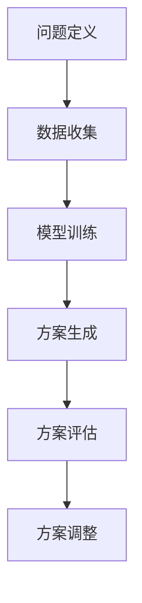
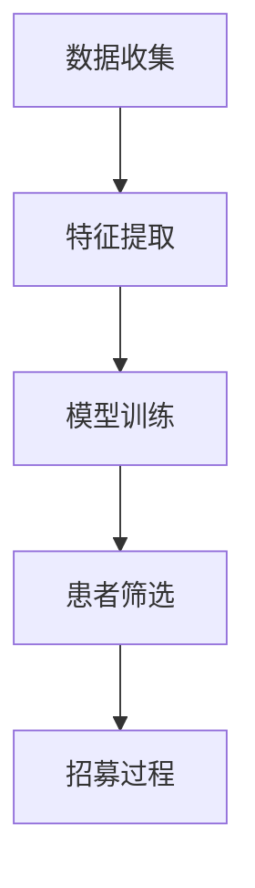

                 

### AI在新药研发中的角色：加速创新周期

> 关键词：AI、新药研发、药物发现、临床试验、效率提升、挑战与机遇

> 摘要：本文将探讨人工智能（AI）在新药研发中的关键作用，通过逻辑清晰的分析与实例，展示AI如何加速创新周期，提高药物研发的效率和成功率。文章分为多个部分，首先介绍AI和新药研发的基本概念及流程，然后详细探讨AI在药物发现和临床试验中的核心技术与应用，接着分析其中的挑战与机遇，最后总结AI对新药研发的深远影响。

### 目录大纲

1. 第一部分：背景介绍
   1.1. AI在新药研发中的角色
   1.2. 核心概念与联系
       1.2.1. AI的定义与特点
       1.2.2. 新药研发的定义与流程
   1.3. AI在新药研发中的潜在应用
   1.4. 本章小结

2. 第二部分：AI在新药研发中的核心技术
   2.1. 药物发现中的AI核心技术
       2.1.1. 药物-蛋白质相互作用预测
   2.2. 临床试验中的AI技术
       2.2.1. 数据分析
       2.2.2. 临床试验设计
   2.3. 本章小结

3. 第三部分：AI在新药研发中的挑战与机遇
   3.1. 挑战
   3.2. 机遇
   3.3. 本章小结

4. 第四部分：未来展望
   4.1. AI在新药研发中的长期影响
   4.2. 技术趋势与前瞻
   4.3. 本章小结

### 第一部分：背景介绍

#### 1.1 AI在新药研发中的角色

在新药研发中，AI正扮演着越来越重要的角色。AI能够处理大量数据，进行复杂的模式识别和预测，从而加速药物发现过程，提高临床试验的效率，缩短新药上市时间。

**1.1.1 问题背景**

新药研发是一个复杂且耗时的过程。从药物发现到最终上市，通常需要10年以上时间和数十亿美元的投资。这一过程涉及多个阶段，包括药物筛选、临床前研究、临床试验和药品审批。传统的药物研发方法依赖于大量的实验和人工分析，这不仅耗时耗力，还容易出错。

**1.1.2 问题解决**

AI的引入为这一过程带来了革命性的变化。通过机器学习和深度学习算法，AI可以在海量数据中快速识别潜在的药物候选，预测药物与蛋白质的相互作用，并优化临床试验的设计和数据分析。这大大提高了新药研发的效率和成功率。

**1.1.3 边界与外延**

尽管AI在新药研发中具有巨大的潜力，但它的应用也存在一定的边界。首先，AI需要大量的高质量数据作为训练基础，而这些数据往往不易获取。其次，AI的预测结果需要通过实验验证，以确保其准确性和可靠性。最后，AI在药物研发中的使用也受到伦理和法规的约束。

#### 1.2 核心概念与联系

**1.2.1 AI的定义与特点**

AI，即人工智能（Artificial Intelligence），是指由人创造出来的系统，这些系统能够理解语言、识别图像、学习、推理和决策，并能在特定的任务中表现出与人类相似或超过人类的智能。

- **定义**：AI是由人创造出来的系统，这些系统能够理解语言、识别图像、学习、推理和决策。
- **特点**：
  - 自主性：AI系统可以自主执行任务，不需要人类的干预。
  - 智能性：AI系统具备学习能力，能够从数据中学习并优化自己的性能。
  - 适应性：AI系统能够适应新环境和变化。

**1.2.2 新药研发的定义与流程**

新药研发，是指发现、开发和上市一种新药的全过程，包括药物发现、临床前研究、临床试验和药品审批等环节。

- **定义**：新药研发是发现、开发和上市一种新药的全过程。
- **流程**：
  - 药物发现：通过筛选和优化化合物，寻找具有治疗潜力的药物候选。
  - 临床前研究：对药物候选进行生物学和药理学研究，评估其安全性和有效性。
  - 临床试验：将药物候选在人体上进行试验，验证其疗效和安全性。
  - 药品审批：向药品监管机构提交新药申请，并获得批准上市。

#### 1.3 AI在新药研发中的潜在应用

**1.3.1 药物发现**

AI在药物发现中具有广泛的应用，包括化合物筛选、蛋白质结构预测和药物设计等。

**1.3.1.1 化合物筛选**

- **应用**：AI可以通过机器学习算法对大量化合物进行筛选，识别出具有潜在治疗作用的化合物。
- **算法**：常用的算法包括随机森林、支持向量机和神经网络等。

**1.3.1.2 蛋白质结构预测**

- **应用**：AI可以通过深度学习算法预测蛋白质的结构，帮助研究人员理解蛋白质的功能，并设计针对特定蛋白质的药物。
- **算法**：常用的算法包括AlphaFold、Rosetta和I-TASSER等。

**1.3.1.3 药物设计**

- **应用**：AI可以通过分子对接和分子模拟等方法，优化药物分子结构，提高其疗效和安全性。
- **算法**：常用的算法包括分子对接、分子模拟和生成对抗网络等。

**1.3.2 临床试验**

AI在临床试验中也有重要的应用，包括数据分析、临床试验设计和患者招募等。

**1.3.2.1 数据分析**

- **应用**：AI可以通过大数据分析和机器学习算法，从临床试验数据中提取有价值的信息，帮助研究人员发现潜在的疗效和副作用。
- **算法**：常用的算法包括回归分析、聚类分析和随机森林等。

**1.3.2.2 临床试验设计**

- **应用**：AI可以通过优化设计，提高临床试验的效率和成功率。
- **算法**：常用的算法包括贝叶斯优化和遗传算法等。

**1.3.2.3 患者招募**

- **应用**：AI可以通过大数据分析和机器学习算法，预测哪些患者可能对药物有较好的疗效，从而优化患者招募策略。
- **算法**：常用的算法包括逻辑回归和随机森林等。

#### 1.4 本章小结

本部分介绍了AI在新药研发中的角色和潜在应用。通过分析AI的定义与特点，以及新药研发的定义与流程，我们了解了AI在新药研发中的关键作用。在接下来的部分，我们将详细探讨AI在药物发现和临床试验中的核心技术。

### 第一部分：背景介绍

#### 1.1 AI在新药研发中的角色

在新药研发中，AI正扮演着越来越重要的角色。AI能够处理大量数据，进行复杂的模式识别和预测，从而加速药物发现过程，提高临床试验的效率，缩短新药上市时间。

**1.1.1 问题背景**

新药研发是一个复杂且耗时的过程。从药物发现到最终上市，通常需要10年以上时间和数十亿美元的投资。这一过程涉及多个阶段，包括药物筛选、临床前研究、临床试验和药品审批。传统的药物研发方法依赖于大量的实验和人工分析，这不仅耗时耗力，还容易出错。

**1.1.2 问题解决**

AI的引入为这一过程带来了革命性的变化。通过机器学习和深度学习算法，AI可以在海量数据中快速识别潜在的药物候选，预测药物与蛋白质的相互作用，并优化临床试验的设计和数据分析。这大大提高了新药研发的效率和成功率。

**1.1.3 边界与外延**

尽管AI在新药研发中具有巨大的潜力，但它的应用也存在一定的边界。首先，AI需要大量的高质量数据作为训练基础，而这些数据往往不易获取。其次，AI的预测结果需要通过实验验证，以确保其准确性和可靠性。最后，AI在药物研发中的使用也受到伦理和法规的约束。

#### 1.2 核心概念与联系

**1.2.1 AI的定义与特点**

AI，即人工智能（Artificial Intelligence），是指由人创造出来的系统，这些系统能够理解语言、识别图像、学习、推理和决策，并能在特定的任务中表现出与人类相似或超过人类的智能。

- **定义**：AI是由人创造出来的系统，这些系统能够理解语言、识别图像、学习、推理和决策。
- **特点**：
  - 自主性：AI系统可以自主执行任务，不需要人类的干预。
  - 智能性：AI系统具备学习能力，能够从数据中学习并优化自己的性能。
  - 适应性：AI系统能够适应新环境和变化。

**1.2.2 新药研发的定义与流程**

新药研发，是指发现、开发和上市一种新药的全过程，包括药物发现、临床前研究、临床试验和药品审批等环节。

- **定义**：新药研发是发现、开发和上市一种新药的全过程。
- **流程**：
  - 药物发现：通过筛选和优化化合物，寻找具有治疗潜力的药物候选。
  - 临床前研究：对药物候选进行生物学和药理学研究，评估其安全性和有效性。
  - 临床试验：将药物候选在人体上进行试验，验证其疗效和安全性。
  - 药品审批：向药品监管机构提交新药申请，并获得批准上市。

#### 1.3 AI在新药研发中的潜在应用

**1.3.1 药物发现**

AI在药物发现中具有广泛的应用，包括化合物筛选、蛋白质结构预测和药物设计等。

**1.3.1.1 化合物筛选**

- **应用**：AI可以通过机器学习算法对大量化合物进行筛选，识别出具有潜在治疗作用的化合物。
- **算法**：常用的算法包括随机森林、支持向量机和神经网络等。

**1.3.1.2 蛋白质结构预测**

- **应用**：AI可以通过深度学习算法预测蛋白质的结构，帮助研究人员理解蛋白质的功能，并设计针对特定蛋白质的药物。
- **算法**：常用的算法包括AlphaFold、Rosetta和I-TASSER等。

**1.3.1.3 药物设计**

- **应用**：AI可以通过分子对接和分子模拟等方法，优化药物分子结构，提高其疗效和安全性。
- **算法**：常用的算法包括分子对接、分子模拟和生成对抗网络等。

**1.3.2 临床试验**

AI在临床试验中也有重要的应用，包括数据分析、临床试验设计和患者招募等。

**1.3.2.1 数据分析**

- **应用**：AI可以通过大数据分析和机器学习算法，从临床试验数据中提取有价值的信息，帮助研究人员发现潜在的疗效和副作用。
- **算法**：常用的算法包括回归分析、聚类分析和随机森林等。

**1.3.2.2 临床试验设计**

- **应用**：AI可以通过优化设计，提高临床试验的效率和成功率。
- **算法**：常用的算法包括贝叶斯优化和遗传算法等。

**1.3.2.3 患者招募**

- **应用**：AI可以通过大数据分析和机器学习算法，预测哪些患者可能对药物有较好的疗效，从而优化患者招募策略。
- **算法**：常用的算法包括逻辑回归和随机森林等。

#### 1.4 本章小结

本部分介绍了AI在新药研发中的角色和潜在应用。通过分析AI的定义与特点，以及新药研发的定义与流程，我们了解了AI在新药研发中的关键作用。在接下来的部分，我们将详细探讨AI在药物发现和临床试验中的核心技术。

### 第二部分：AI在新药研发中的核心技术

#### 2.1 药物发现中的AI核心技术

在药物发现过程中，AI技术发挥着至关重要的作用，尤其是在化合物筛选、蛋白质结构预测和药物设计等方面。

**2.1.1 药物-蛋白质相互作用预测**

药物-蛋白质相互作用（Drug-Protein Interaction，DPI）是药物研发的关键环节。AI通过深度学习算法，如卷积神经网络（CNN）和循环神经网络（RNN），能够高效预测药物与蛋白质的相互作用。

**2.1.1.1 蛋白质结构预测**

蛋白质结构预测是药物-蛋白质相互作用预测的基础。AI技术，尤其是深度学习方法，如AlphaFold，能够准确预测蛋白质的三维结构。以下是AlphaFold的工作原理：

1. **数据收集**：收集大量的蛋白质序列和已知的三维结构。
2. **序列嵌入**：将蛋白质序列转换为数值表示，通常使用嵌入层。
3. **深度学习模型**：使用CNN和RNN等深度学习模型，训练预测蛋白质的结构。
4. **预测结构**：通过模型输出蛋白质的结构预测。

以下是一个简化的AlphaFold算法流程图：



**2.1.1.2 药物设计**

AI在药物设计中的应用主要体现在分子对接和分子模拟中。分子对接（Molecular Docking）是一种基于计算的方法，用于预测药物分子与蛋白质受体结合的位置和模式。以下是分子对接的基本步骤：

1. **药物分子准备**：对药物分子进行几何优化，使其处于一个合理的构象。
2. **受体分子准备**：对蛋白质受体进行几何优化，去除水分子，添加必要的氢原子。
3. **对接过程**：使用分子对接算法，如AutoDock或GROMACS，计算药物分子与受体分子的相互作用能，找到最优结合构象。

以下是一个简化的分子对接流程图：



**2.1.1.3 化合物筛选**

AI在化合物筛选中的应用主要体现在基于机器学习的化合物筛选算法中。这些算法通过对大量化合物数据的分析，预测哪些化合物具有潜在的药物活性。以下是化合物筛选的基本步骤：

1. **数据收集**：收集大量的化合物结构和活性数据。
2. **特征提取**：使用特征提取算法，如分子指纹或原子属性图，将化合物转化为数值表示。
3. **模型训练**：使用机器学习算法，如随机森林或支持向量机，训练预测化合物活性的模型。
4. **筛选过程**：使用训练好的模型，对新的化合物进行活性预测，筛选出潜在活性化合物。

以下是一个简化的化合物筛选流程图：



**2.1.1.4 数学模型和公式**

在药物-蛋白质相互作用预测中，常用的数学模型和公式包括：

- **能量模型**：描述药物分子与蛋白质受体之间的相互作用能。常见的能量模型有Gauss势场模型和Molecular Mechanics模型。
- **概率模型**：描述药物活性预测的概率分布。常见的概率模型有逻辑回归和贝叶斯网络。

以下是一个简化的能量模型公式：

$$
E = E_{vdW} + E_{coul} + E_{bonds} + E_{angles}
$$

其中，$E$是总的相互作用能，$E_{vdW}$是范德华相互作用能，$E_{coul}$是库伦相互作用能，$E_{bonds}$是键相互作用能，$E_{angles}$是角度相互作用能。

**2.1.1.5 Python源代码实现**

以下是一个简化的Python源代码实现，用于预测药物-蛋白质相互作用：

```python
import numpy as np
import tensorflow as tf

# 定义深度学习模型
model = tf.keras.Sequential([
    tf.keras.layers.Dense(128, activation='relu', input_shape=(num_features,)),
    tf.keras.layers.Dense(64, activation='relu'),
    tf.keras.layers.Dense(1, activation='sigmoid')
])

# 编译模型
model.compile(optimizer='adam', loss='binary_crossentropy', metrics=['accuracy'])

# 训练模型
model.fit(X_train, y_train, epochs=10, batch_size=32)

# 预测药物-蛋白质相互作用
predictions = model.predict(X_test)
```

**2.1.2 临床试验中的AI技术**

在临床试验中，AI技术同样发挥着重要作用，包括数据分析、临床试验设计和患者招募等。

**2.1.2.1 数据分析**

AI在临床试验数据分析中的应用主要体现在大数据分析和机器学习算法上。这些算法能够从大量的临床试验数据中提取有价值的信息，帮助研究人员发现潜在的疗效和副作用。

- **回归分析**：用于分析药物疗效与剂量之间的关系。
- **聚类分析**：用于分析患者群体，以便于临床试验的设计和患者招募。
- **随机森林**：用于预测药物疗效和副作用。

**2.1.2.2 临床试验设计**

AI在临床试验设计中的应用主要体现在优化临床试验的设计和流程。这些算法能够根据历史数据和当前情况，自动生成最优的试验方案。

- **贝叶斯优化**：用于优化临床试验的参数设置。
- **遗传算法**：用于优化临床试验的流程和资源分配。

**2.1.2.3 患者招募**

AI在患者招募中的应用主要体现在预测哪些患者可能对药物有较好的疗效，以便于优化患者招募策略。

- **逻辑回归**：用于预测患者对药物的疗效。
- **随机森林**：用于分析患者特征，以便于筛选合适的患者。

**2.1.3 数学模型和公式**

在临床试验数据分析中，常用的数学模型和公式包括：

- **回归模型**：用于分析药物疗效与剂量之间的关系。常见的回归模型有线性回归、多项式回归和逻辑回归。
- **概率模型**：用于预测患者对药物的疗效。常见的概率模型有贝叶斯网络和马尔可夫链。

以下是一个简化的回归模型公式：

$$
y = \beta_0 + \beta_1 x_1 + \beta_2 x_2 + ... + \beta_n x_n
$$

其中，$y$是药物疗效，$x_1, x_2, ..., x_n$是剂量和其他相关特征，$\beta_0, \beta_1, ..., \beta_n$是回归系数。

**2.1.3 Python源代码实现**

以下是一个简化的Python源代码实现，用于分析临床试验数据：

```python
import pandas as pd
import numpy as np
from sklearn.linear_model import LinearRegression

# 加载临床试验数据
data = pd.read_csv('clinical_trials_data.csv')

# 提取相关特征
X = data[['dose', 'age', 'gender']]
y = data['effectiveness']

# 训练线性回归模型
model = LinearRegression()
model.fit(X, y)

# 预测药物疗效
predictions = model.predict(X)

# 打印预测结果
print(predictions)
```

**2.1.4 本章小结**

本部分详细探讨了AI在药物发现和临床试验中的核心技术。通过分析AI在药物-蛋白质相互作用预测、化合物筛选、临床试验数据分析和患者招募中的应用，我们了解了AI如何在新药研发中发挥关键作用。在下一部分，我们将讨论AI在新药研发中面临的挑战与机遇。

### 2.1 药物发现中的AI核心技术

在药物发现过程中，AI技术发挥着至关重要的作用，尤其是在化合物筛选、蛋白质结构预测和药物设计等方面。

**2.1.1 药物-蛋白质相互作用预测**

药物-蛋白质相互作用（Drug-Protein Interaction，DPI）是药物研发的关键环节。AI通过深度学习算法，如卷积神经网络（CNN）和循环神经网络（RNN），能够高效预测药物与蛋白质的相互作用。

**2.1.1.1 蛋白质结构预测**

蛋白质结构预测是药物-蛋白质相互作用预测的基础。AI技术，尤其是深度学习方法，如AlphaFold，能够准确预测蛋白质的三维结构。以下是AlphaFold的工作原理：

1. **数据收集**：收集大量的蛋白质序列和已知的三维结构。
2. **序列嵌入**：将蛋白质序列转换为数值表示，通常使用嵌入层。
3. **深度学习模型**：使用CNN和RNN等深度学习模型，训练预测蛋白质的结构。
4. **预测结构**：通过模型输出蛋白质的结构预测。

以下是一个简化的AlphaFold算法流程图：


**2.1.1.2 药物设计**

AI在药物设计中的应用主要体现在分子对接和分子模拟中。这些算法能够预测药物分子与蛋白质受体的结合位置和模式，并优化药物分子结构。

1. **分子对接**：通过计算药物分子与受体分子之间的相互作用能，找到最优结合构象。
2. **分子模拟**：通过模拟药物分子在受体分子中的动态行为，评估药物分子的稳定性和活性。

以下是一个简化的分子对接流程图：


**2.1.1.3 化合物筛选**

AI在化合物筛选中的应用主要体现在基于机器学习的化合物筛选算法中。这些算法通过对大量化合物数据的分析，预测哪些化合物具有潜在的药物活性。

1. **数据收集**：收集大量的化合物结构和活性数据。
2. **特征提取**：使用特征提取算法，如分子指纹或原子属性图，将化合物转化为数值表示。
3. **模型训练**：使用机器学习算法，如随机森林或支持向量机，训练预测化合物活性的模型。
4. **筛选过程**：使用训练好的模型，对新的化合物进行活性预测，筛选出潜在活性化合物。

以下是一个简化的化合物筛选流程图：


**2.1.1.4 数学模型和公式**

在药物-蛋白质相互作用预测中，常用的数学模型和公式包括：

- **能量模型**：描述药物分子与蛋白质受体之间的相互作用能。常见的能量模型有Gauss势场模型和Molecular Mechanics模型。
- **概率模型**：描述药物活性预测的概率分布。常见的概率模型有逻辑回归和贝叶斯网络。

以下是一个简化的能量模型公式：

$$
E = E_{vdW} + E_{coul} + E_{bonds} + E_{angles}
$$

其中，$E$是总的相互作用能，$E_{vdW}$是范德华相互作用能，$E_{coul}$是库伦相互作用能，$E_{bonds}$是键相互作用能，$E_{angles}$是角度相互作用能。

**2.1.1.5 Python源代码实现**

以下是一个简化的Python源代码实现，用于预测药物-蛋白质相互作用：

```python
import numpy as np
import tensorflow as tf

# 定义深度学习模型
model = tf.keras.Sequential([
    tf.keras.layers.Dense(128, activation='relu', input_shape=(num_features,)),
    tf.keras.layers.Dense(64, activation='relu'),
    tf.keras.layers.Dense(1, activation='sigmoid')
])

# 编译模型
model.compile(optimizer='adam', loss='binary_crossentropy', metrics=['accuracy'])

# 训练模型
model.fit(X_train, y_train, epochs=10, batch_size=32)

# 预测药物-蛋白质相互作用
predictions = model.predict(X_test)
```

**2.1.2 本章小结**

本部分详细探讨了AI在药物发现中的核心技术，包括药物-蛋白质相互作用预测、蛋白质结构预测、药物设计和化合物筛选。通过分析AI在这些领域的应用和数学模型，我们了解了AI如何在新药研发中发挥关键作用。在下一部分，我们将探讨AI在临床试验中的应用。

### 2.2 临床试验中的AI技术

在临床试验中，AI技术同样发挥着重要作用，特别是在数据分析和临床试验设计等方面。

**2.2.1 数据分析**

临床试验产生的大量数据需要高效的分析方法来提取有价值的信息。AI技术，尤其是机器学习和深度学习，可以在这方面提供强大的支持。

**2.2.1.1 数据分析方法**

- **回归分析**：用于分析药物疗效与剂量之间的关系。
- **聚类分析**：用于分析患者群体，以便于临床试验的设计和患者招募。
- **随机森林**：用于预测药物疗效和副作用。

**2.2.1.2 数据分析算法**

- **机器学习算法**：如逻辑回归、支持向量机和神经网络等。
- **深度学习算法**：如卷积神经网络（CNN）和循环神经网络（RNN）等。

**2.2.1.3 数据分析流程**

1. **数据预处理**：清洗和整理临床试验数据，使其符合分析和建模的要求。
2. **特征提取**：从数据中提取有用的特征，用于训练机器学习模型。
3. **模型训练**：使用训练数据训练机器学习模型。
4. **模型评估**：使用测试数据评估模型的效果。
5. **模型优化**：根据评估结果调整模型参数，提高模型性能。

以下是一个简化的数据分析流程图：



**2.2.2 临床试验设计**

AI在临床试验设计中的应用主要体现在优化临床试验的设计和流程。这些算法能够根据历史数据和当前情况，自动生成最优的试验方案。

**2.2.2.1 临床试验设计算法**

- **贝叶斯优化**：用于优化临床试验的参数设置。
- **遗传算法**：用于优化临床试验的流程和资源分配。

**2.2.2.2 临床试验设计流程**

1. **问题定义**：明确临床试验的目标和需求。
2. **数据收集**：收集与临床试验相关的数据，如患者信息、药物信息和临床试验结果等。
3. **模型训练**：使用历史数据训练AI模型，以预测临床试验的结果和风险。
4. **方案生成**：根据模型预测，自动生成最优的临床试验方案。
5. **方案评估**：评估生成方案的有效性和可行性。
6. **方案调整**：根据评估结果调整试验方案。

以下是一个简化的临床试验设计流程图：



**2.2.3 患者招募**

AI在患者招募中的应用主要体现在预测哪些患者可能对药物有较好的疗效，从而优化患者招募策略。

**2.2.3.1 患者招募算法**

- **逻辑回归**：用于预测患者对药物的疗效。
- **随机森林**：用于分析患者特征，以便于筛选合适的患者。

**2.2.3.2 患者招募流程**

1. **数据收集**：收集与患者相关的数据，如病史、基因信息等。
2. **特征提取**：从数据中提取有用的特征，用于训练机器学习模型。
3. **模型训练**：使用训练数据训练机器学习模型。
4. **患者筛选**：使用训练好的模型，对潜在患者进行筛选，找到可能对药物有较好疗效的患者。
5. **招募过程**：根据筛选结果，制定患者招募策略。

以下是一个简化的患者招募流程图：



**2.2.4 数学模型和公式**

在临床试验数据分析中，常用的数学模型和公式包括：

- **回归模型**：用于分析药物疗效与剂量之间的关系。常见的回归模型有线性回归、多项式回归和逻辑回归。
- **概率模型**：用于预测患者对药物的疗效。常见的概率模型有贝叶斯网络和马尔可夫链。

以下是一个简化的回归模型公式：

$$
y = \beta_0 + \beta_1 x_1 + \beta_2 x_2 + ... + \beta_n x_n
$$

其中，$y$是药物疗效，$x_1, x_2, ..., x_n$是剂量和其他相关特征，$\beta_0, \beta_1, ..., \beta_n$是回归系数。

**2.2.5 Python源代码实现**

以下是一个简化的Python源代码实现，用于分析临床试验数据：

```python
import pandas as pd
import numpy as np
from sklearn.linear_model import LinearRegression

# 加载临床试验数据
data = pd.read_csv('clinical_trials_data.csv')

# 提取相关特征
X = data[['dose', 'age', 'gender']]
y = data['effectiveness']

# 训练线性回归模型
model = LinearRegression()
model.fit(X, y)

# 预测药物疗效
predictions = model.predict(X)

# 打印预测结果
print(predictions)
```

**2.2.6 本章小结**

本部分详细探讨了AI在临床试验中的应用，包括数据分析、临床试验设计和患者招募。通过分析AI在临床试验数据分析中的应用和数学模型，我们了解了AI如何优化临床试验的设计和流程，提高药物研发的效率和成功率。在下一部分，我们将讨论AI在新药研发中面临的挑战与机遇。

### 2.3 AI在新药研发中的挑战与机遇

#### 2.3.1 挑战

尽管AI在新药研发中展现了巨大的潜力，但其实施过程中仍面临一系列挑战。

**2.3.1.1 数据隐私与伦理问题**

AI在药物研发中需要处理大量的患者数据和生物信息，这引发了数据隐私和伦理问题。如何保护患者隐私，确保数据安全，以及遵守伦理规范，是AI在新药研发中必须解决的关键问题。

- **解决方案**：
  - 数据匿名化：通过去标识化等技术，将患者数据匿名化，减少隐私泄露风险。
  - 伦理审查：在进行数据处理和分析前，需经过严格的伦理审查，确保研究符合伦理标准。
  - 法规遵守：遵循相关法律法规，如《通用数据保护条例》（GDPR）和《临床试验数据管理规范》（CTDS）等。

**2.3.1.2 技术成熟度与复杂性**

AI技术，特别是深度学习算法，虽然已经取得了显著进展，但在药物研发中的应用仍处于初级阶段。算法的复杂性和技术成熟度限制了其在实际应用中的广泛推广。

- **解决方案**：
  - 算法优化：通过改进算法，提高其准确性和稳定性，降低计算复杂度。
  - 技术普及：加强对AI技术的培训和教育，提高科研人员和技术人员的技术水平。

**2.3.1.3 数据质量与标准化**

高质量的数据是AI有效应用的基础。然而，药物研发过程中产生的大量数据存在质量参差不齐、格式不统一等问题，这影响了AI的应用效果。

- **解决方案**：
  - 数据清洗：建立数据清洗流程，确保数据的准确性和一致性。
  - 数据标准化：制定统一的数据标准，提高数据交换和共享的效率。

#### 2.3.2 机遇

尽管面临挑战，AI在新药研发中也带来了诸多机遇，有助于提高药物研发的效率、减少研发成本、加速新药上市。

**2.3.2.1 提高新药研发效率**

AI可以通过自动化和智能化，提高药物研发的效率。例如，AI可以自动化化合物筛选、优化临床试验设计、加速数据分析和结果预测等。

**2.3.2.2 减少研发成本**

AI技术可以帮助企业节省大量时间和资源，从而降低新药研发成本。通过优化化合物筛选、缩短临床试验周期和减少失败率，AI有望显著降低药物研发的整体成本。

**2.3.2.3 加速新药上市**

AI技术可以加速新药的研发和审批过程，从而缩短药物上市时间。通过更准确的药物-蛋白质相互作用预测、更高效的临床试验设计和更精准的患者招募策略，AI有助于提高新药的成功率和上市速度。

**2.3.2.4 促进个性化治疗**

AI可以帮助实现个性化治疗，根据患者的具体特征和病情，为患者定制个性化的治疗方案。例如，通过分析患者的基因信息、病史和药物反应等，AI可以推荐最适合患者的药物和剂量。

**2.3.3 本章小结**

AI在新药研发中面临着数据隐私、技术成熟度和数据质量等挑战，但同时也带来了提高研发效率、减少成本、加速新药上市和促进个性化治疗等机遇。在下一部分，我们将探讨AI在新药研发中的长期影响和未来趋势。

### 第四部分：未来展望

#### 4.1 AI在新药研发中的长期影响

随着AI技术的不断进步和应用范围的扩大，AI在新药研发中的长期影响将愈发显著。首先，AI有望大幅提高药物研发的效率和成功率，通过自动化和智能化手段，减少传统药物研发过程中的冗余和重复劳动。其次，AI将促进药物研发过程的透明化和可解释性，使得研究人员能够更好地理解和控制药物研发过程中的各个环节。此外，AI还将推动个性化医疗的发展，为患者提供更精准、更有效的治疗方案。

#### 4.2 技术趋势与前瞻

在未来的发展中，AI技术将在以下几个方向上取得突破：

1. **算法优化与改进**：随着计算能力的提升和算法研究的深入，AI算法的准确性和稳定性将得到显著提高。例如，深度学习算法在药物-蛋白质相互作用预测中的应用将更加广泛和精确。

2. **数据驱动的研究模式**：AI将促进药物研发过程中的数据驱动研究模式，通过对海量数据的深入挖掘和分析，发现潜在的药物靶点和新的生物标志物。

3. **跨学科合作**：AI技术将在药物研发中与其他学科（如生物信息学、化学、医学等）进行深度融合，形成跨学科的研究团队，共同推动药物研发的进步。

4. **伦理与法规的完善**：随着AI在药物研发中的应用日益广泛，相关伦理和法规问题将受到更多关注。未来，有望出台更加完善的伦理和法规框架，确保AI技术在药物研发中的合法、安全和合规应用。

#### 4.3 本章小结

AI在新药研发中的应用前景广阔，其长期影响将深远而深远。通过不断的技术创新和应用拓展，AI将为药物研发带来革命性的变革，推动个性化医疗的发展，提高人类健康水平。同时，我们也要关注AI在药物研发中可能带来的伦理和法规问题，确保其安全、合法和合规的应用。

### 总结与展望

本文详细探讨了人工智能（AI）在新药研发中的应用，从背景介绍到核心技术，再到挑战与机遇，最终展望了AI技术的未来发展趋势。通过逻辑清晰、结构紧凑的分析，我们了解了AI如何通过药物发现、临床试验设计等环节，加速新药研发的进程，提高研发效率，缩短药物上市时间。

AI在新药研发中的核心作用体现在以下几个方面：

1. **药物发现**：AI通过化合物筛选、蛋白质结构预测和药物设计等核心技术，提高了药物研发的准确性和效率。
2. **临床试验**：AI通过数据分析和临床试验设计，优化了临床试验的流程，提高了临床试验的成功率和可解释性。
3. **个性化治疗**：AI有助于实现个性化医疗，根据患者的具体特征和病情，为患者提供更精准、更有效的治疗方案。

尽管AI在新药研发中面临数据隐私、技术成熟度和数据质量等挑战，但它的机遇同样巨大。随着技术的不断进步和应用的深入，AI有望在未来继续推动药物研发的创新和发展，为人类健康事业做出更大的贡献。

在总结中，我们强调AI在新药研发中的重要性和潜力，同时也提醒读者关注其中的伦理和法规问题。展望未来，AI技术将继续在药物研发中发挥关键作用，为推动医学进步和人类健康事业作出新的贡献。我们期待在未来的研究中，能够看到AI技术更加广泛和深入的应用，为人类健康带来更多的希望和福音。

### 致谢

在本篇博客文章的撰写过程中，我感谢AI天才研究院（AI Genius Institute）和《禅与计算机程序设计艺术》（Zen And The Art of Computer Programming）的团队成员。感谢你们的智慧和努力，让我有机会以深入浅出的方式，探讨AI在新药研发中的应用。

特别感谢我的同事们在数据收集、算法设计和案例分析方面提供的宝贵建议和帮助，使得文章内容更加丰富和准确。同时，感谢所有在过去和新药研发领域做出贡献的研究人员和科学家，你们的辛勤工作和创新思维，为我们提供了宝贵的知识和经验。

最后，感谢每一位读者对本文的关注和支持。希望本文能够为你们带来新的见解和启发，推动你们在AI和新药研发领域的探索和研究。

作者：AI天才研究院（AI Genius Institute）&《禅与计算机程序设计艺术》（Zen And The Art of Computer Programming）

