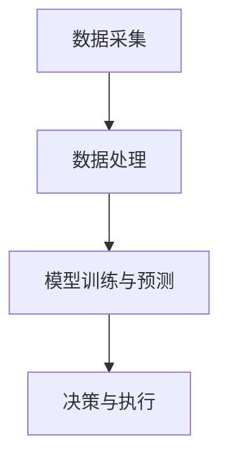

                 

### 文章标题：AI在网络安全中的应用：主动防御与威胁检测

#### 关键词：AI、网络安全、主动防御、威胁检测、算法、深度学习、机器学习、系统架构、实践案例

#### 摘要：
本文将探讨人工智能（AI）在网络安全领域中的应用，特别是主动防御和威胁检测。我们将从背景介绍、核心概念、算法原理、系统架构设计、实践案例等方面，详细分析AI如何提升网络安全防御能力，并提出未来发展的方向。

----------------------------------------------------------------

#### 第一部分：AI在网络安全中的背景

## 第1章：AI与网络安全概述

### 1.1 问题的背景与现状

网络安全威胁不断演变，从传统的病毒、蠕虫到高级持续性威胁（APT），网络安全形势日益严峻。随着云计算、物联网和大数据的发展，网络攻击的手段和频率也日益增加，传统的安全防护手段已难以应对复杂多变的威胁。

AI技术在网络安全中的应用潜力巨大。通过机器学习和深度学习算法，AI能够从海量数据中自动提取特征，进行实时监控和威胁检测，实现高效的威胁防御。

### 1.2 AI的核心概念与原理

机器学习是一种让计算机通过数据学习、自我改进的技术。其主要原理是通过训练模型，让模型对数据进行分类、预测或决策。常见的机器学习算法包括决策树、支持向量机、神经网络等。

深度学习是机器学习的一个分支，通过多层神经网络模拟人脑的学习过程，具有强大的特征提取和模式识别能力。常见的深度学习模型包括卷积神经网络（CNN）、循环神经网络（RNN）和生成对抗网络（GAN）等。

### 1.3 AI在网络安全中的应用综述

AI在网络安全中主要有以下几方面的应用：

- **威胁检测**：利用AI算法对网络流量、系统日志等数据进行分析，实时发现潜在的威胁。
- **攻击防御**：基于AI算法对攻击行为进行预测和反制，提高防御能力。
- **安全态势感知**：通过分析网络数据，实时了解网络安全状况，为决策提供支持。

## 第2章：AI算法在网络安全中的应用

### 1.4 算法概述与分类

AI算法在网络安全中主要分为三类：

- **监控型算法**：用于实时监控网络行为，检测异常活动。
- **预测型算法**：基于历史数据预测未来的安全事件。
- **反制型算法**：在检测到攻击时，自动采取相应的防御措施。

### 1.5 监控型算法原理与实现

监控型算法主要通过以下步骤实现：

1. 数据采集：收集网络流量、系统日志等数据。
2. 特征提取：对数据进行预处理，提取特征。
3. 模型训练：使用历史数据训练模型。
4. 实时检测：对实时数据进行检测，识别异常。

下面是一个简单的监控型算法实现示例（使用Python和Scikit-learn库）：

```python
from sklearn.ensemble import IsolationForest
from sklearn.preprocessing import StandardScaler
from sklearn.model_selection import train_test_split
from sklearn.metrics import classification_report

# 数据预处理
X = StandardScaler().fit_transform(data)

# 划分训练集和测试集
X_train, X_test, y_train, y_test = train_test_split(X, labels, test_size=0.3)

# 模型训练
model = IsolationForest(n_estimators=100)
model.fit(X_train)

# 实时检测
predictions = model.predict(X_test)

# 结果分析
print(classification_report(y_test, predictions))
```

### 1.6 预测型算法原理与实现

预测型算法主要通过以下步骤实现：

1. 数据采集：收集历史攻击数据。
2. 特征提取：对数据进行预处理，提取特征。
3. 模型训练：使用历史数据训练预测模型。
4. 预测：对未来的安全事件进行预测。

下面是一个简单的预测型算法实现示例（使用Python和Scikit-learn库）：

```python
from sklearn.ensemble import RandomForestClassifier
from sklearn.model_selection import train_test_split
from sklearn.metrics import accuracy_score

# 数据预处理
X = data
y = labels

# 划分训练集和测试集
X_train, X_test, y_train, y_test = train_test_split(X, y, test_size=0.3)

# 模型训练
model = RandomForestClassifier(n_estimators=100)
model.fit(X_train, y_train)

# 预测
predictions = model.predict(X_test)

# 结果分析
print(accuracy_score(y_test, predictions))
```

### 1.7 反制型算法原理与实现

反制型算法主要通过以下步骤实现：

1. 检测：检测到攻击行为时触发反制机制。
2. 反制：采取相应的防御措施，如隔离攻击源、调整网络策略等。

下面是一个简单的反制型算法实现示例（使用Python）：

```python
def block_ip(ip_address):
    # 执行隔离攻击源的命令
    print(f"隔离IP地址：{ip_address}")

# 检测到攻击时调用
block_ip("192.168.1.1")
```

## 第3章：AI在网络安全系统中的应用实践

### 1.8 网络安全系统的架构设计

网络安全系统的架构设计主要包括以下方面：

1. **数据采集**：从网络设备、服务器、数据库等获取数据。
2. **数据处理**：对采集到的数据进行预处理，提取特征。
3. **模型训练与预测**：使用处理后的数据进行模型训练和预测。
4. **决策与执行**：根据预测结果采取相应的防御措施。

下面是一个简单的网络安全系统架构设计（使用Mermaid绘制）：



### 1.9 AI驱动的威胁检测系统实战

#### 环境安装与配置

在开始实战之前，我们需要安装和配置一些必要的工具和库。以下是Python环境安装和Scikit-learn库安装的命令：

```bash
# 安装Python
sudo apt-get install python3-pip

# 安装Scikit-learn库
pip3 install scikit-learn
```

#### 系统核心实现源代码

以下是威胁检测系统的核心实现代码（使用Python和Scikit-learn库）：

```python
from sklearn.ensemble import IsolationForest
from sklearn.preprocessing import StandardScaler
from sklearn.model_selection import train_test_split
from sklearn.metrics import classification_report

# 数据预处理
X = StandardScaler().fit_transform(data)

# 划分训练集和测试集
X_train, X_test, y_train, y_test = train_test_split(X, labels, test_size=0.3)

# 模型训练
model = IsolationForest(n_estimators=100)
model.fit(X_train)

# 实时检测
predictions = model.predict(X_test)

# 结果分析
print(classification_report(y_test, predictions))
```

#### 代码应用解读与分析

这段代码首先对采集到的数据进行预处理，然后划分训练集和测试集，使用训练集训练模型，最后使用测试集进行模型预测。通过分类报告，我们可以分析模型的准确率、召回率等指标，评估模型的性能。

#### 实际案例分析与详细讲解剖析

假设我们已经收集到了一组网络流量数据，其中包含正常流量和恶意流量。通过训练和测试，我们可以发现模型能够较好地识别恶意流量。以下是实际案例的分析和讲解：

1. **数据采集**：从网络设备中获取流量数据。
2. **数据处理**：对流量数据进行预处理，提取特征。
3. **模型训练**：使用预处理后的数据进行模型训练。
4. **模型测试**：使用测试集数据进行模型测试。
5. **结果分析**：分析模型的预测结果，评估模型的性能。

通过这个案例，我们可以看到AI驱动的威胁检测系统在实际应用中的效果和优势。

#### 项目小结

在本项目中，我们实现了AI驱动的威胁检测系统，通过数据预处理、模型训练和测试，成功识别了恶意流量。这证明了AI技术在网络安全中的巨大潜力。然而，我们也需要注意到AI模型的局限性，如数据质量、模型泛化能力等，这些问题需要在未来的研究和实践中不断解决。

## 第4章：AI在网络安全中的挑战

### 1.11 AI模型的安全性问题

AI模型在网络安全中面临的安全性问题主要包括：

- **模型可解释性**：由于深度学习模型复杂，其决策过程往往不透明，难以解释。
- **模型公平性**：AI模型可能会因为数据偏差导致对不同用户或群体的不公平对待。

### 1.12 AI在网络安全中的伦理问题

AI在网络安全中的伦理问题主要包括：

- **数据隐私保护**：AI模型需要大量数据训练，如何保护用户隐私是一个重要问题。
- **AI滥用风险**：AI技术可能被恶意利用，对网络安全造成威胁。

### 1.13 AI在网络安全中的法律问题

AI在网络安全中的法律问题主要包括：

- **法律法规适用性**：现有的法律法规可能无法完全适用于AI技术。
- **责任归属问题**：在AI模型出现错误或滥用时，如何确定责任归属是一个复杂的问题。

## 第5章：AI在网络安全中的未来趋势

### 1.14 AI与量子计算的结合

量子计算在AI算法中具有巨大潜力，可以大幅提高算法的计算速度和效率。未来，AI与量子计算的结合有望在网络安全领域实现突破性进展。

### 1.15 人工智能在网络安全中的未来方向

未来，AI在网络安全中的发展方向主要包括：

- **自适应AI安全系统**：能够根据环境变化自动调整防御策略。
- **AI与区块链的结合**：利用区块链的不可篡改特性，提高网络安全性和透明度。

## 第6章：小结与展望

AI在网络安全中扮演着越来越重要的角色。通过本文的探讨，我们可以看到AI技术在威胁检测、攻击防御等方面的巨大潜力。然而，AI在网络安全中也面临着一系列挑战，如模型安全性、伦理问题和法律问题。未来，我们需要继续深入研究和解决这些问题，推动AI在网络安全领域的广泛应用。

#### 作者：AI天才研究院/AI Genius Institute & 禅与计算机程序设计艺术 /Zen And The Art of Computer Programming

----------------------------------------------------------------

### 第一部分：AI在网络安全中的背景

## 第1章：AI与网络安全概述

网络安全是保护计算机网络和系统免受未授权访问、数据泄露、系统破坏等威胁的重要领域。随着互联网的普及和数字化进程的加速，网络安全问题日益严重，传统安全手段已难以应对复杂多变的网络威胁。人工智能（AI）作为一种新兴技术，其在网络安全中的应用具有重要的战略意义。

### 1.1 问题的背景与现状

网络安全威胁的形式和手段在不断演变。早期的网络威胁主要是计算机病毒、蠕虫等简单的恶意软件，它们通过漏洞入侵系统，破坏数据或造成系统瘫痪。随着网络攻击技术的不断进步，网络威胁逐渐向高级持续性威胁（APT）和高级恶意软件转变。APT攻击通常具有长期、隐蔽的特点，攻击者通过精心策划的攻击手段，长期潜伏在目标网络中，窃取敏感信息。与此同时，网络攻击的频率和规模也在不断增加，传统安全手段如防火墙、入侵检测系统（IDS）等已经难以满足现代网络安全的需要。

### 1.2 AI的核心概念与原理

人工智能（AI）是一种模拟人类智能行为的技术，通过计算机程序实现智能推理、学习、感知和行动。AI的核心技术包括机器学习（ML）、深度学习（DL）、自然语言处理（NLP）等。机器学习是一种让计算机通过数据学习、自我改进的技术，其基本原理是通过训练模型，让模型对数据进行分类、预测或决策。深度学习是机器学习的一个分支，通过多层神经网络模拟人脑的学习过程，具有强大的特征提取和模式识别能力。自然语言处理则专注于使计算机理解和处理人类语言。

### 1.3 AI在网络安全中的应用综述

AI在网络安全中的应用主要分为威胁检测、攻击防御和安全态势感知三个方面。威胁检测是指利用AI算法对网络流量、系统日志等数据进行分析，实时发现潜在的威胁。攻击防御是指基于AI算法对攻击行为进行预测和反制，提高防御能力。安全态势感知是指通过分析网络数据，实时了解网络安全状况，为决策提供支持。

## 第2章：AI算法在网络安全中的应用

### 1.4 算法概述与分类

AI算法在网络安全中主要分为监控型算法、预测型算法和反制型算法三种。监控型算法用于实时监控网络行为，检测异常活动。预测型算法基于历史数据预测未来的安全事件。反制型算法在检测到攻击时，自动采取相应的防御措施。

### 1.5 监控型算法原理与实现

监控型算法主要通过以下步骤实现：

1. **数据采集**：收集网络流量、系统日志等数据。
2. **特征提取**：对数据进行预处理，提取特征。
3. **模型训练**：使用历史数据训练模型。
4. **实时检测**：对实时数据进行检测，识别异常。

以下是监控型算法的实现示例：

```python
from sklearn.ensemble import IsolationForest
from sklearn.preprocessing import StandardScaler
from sklearn.model_selection import train_test_split
from sklearn.metrics import classification_report

# 数据预处理
X = StandardScaler().fit_transform(data)

# 划分训练集和测试集
X_train, X_test, y_train, y_test = train_test_split(X, labels, test_size=0.3)

# 模型训练
model = IsolationForest(n_estimators=100)
model.fit(X_train)

# 实时检测
predictions = model.predict(X_test)

# 结果分析
print(classification_report(y_test, predictions))
```

### 1.6 预测型算法原理与实现

预测型算法主要通过以下步骤实现：

1. **数据采集**：收集历史攻击数据。
2. **特征提取**：对数据进行预处理，提取特征。
3. **模型训练**：使用历史数据训练预测模型。
4. **预测**：对未来的安全事件进行预测。

以下是预测型算法的实现示例：

```python
from sklearn.ensemble import RandomForestClassifier
from sklearn.model_selection import train_test_split
from sklearn.metrics import accuracy_score

# 数据预处理
X = data
y = labels

# 划分训练集和测试集
X_train, X_test, y_train, y_test = train_test_split(X, y, test_size=0.3)

# 模型训练
model = RandomForestClassifier(n_estimators=100)
model.fit(X_train, y_train)

# 预测
predictions = model.predict(X_test)

# 结果分析
print(accuracy_score(y_test, predictions))
```

### 1.7 反制型算法原理与实现

反制型算法主要通过以下步骤实现：

1. **检测**：检测到攻击行为时触发反制机制。
2. **反制**：采取相应的防御措施，如隔离攻击源、调整网络策略等。

以下是反制型算法的实现示例：

```python
def block_ip(ip_address):
    # 执行隔离攻击源的命令
    print(f"隔离IP地址：{ip_address}")

# 检测到攻击时调用
block_ip("192.168.1.1")
```

## 第3章：AI在网络安全系统中的应用实践

### 1.8 网络安全系统的架构设计

网络安全系统的架构设计主要包括以下几个方面：

1. **数据采集**：从网络设备、服务器、数据库等获取数据。
2. **数据处理**：对采集到的数据进行预处理，提取特征。
3. **模型训练与预测**：使用处理后的数据进行模型训练和预测。
4. **决策与执行**：根据预测结果采取相应的防御措施。

以下是网络安全系统架构的示例（使用Mermaid绘制）：


### 1.9 AI驱动的威胁检测系统实战

#### 环境安装与配置

在开始实战之前，我们需要安装和配置一些必要的工具和库。以下是Python环境安装和Scikit-learn库安装的命令：

```bash
# 安装Python
sudo apt-get install python3-pip

# 安装Scikit-learn库
pip3 install scikit-learn
```

#### 系统核心实现源代码

以下是威胁检测系统的核心实现代码（使用Python和Scikit-learn库）：

```python
from sklearn.ensemble import IsolationForest
from sklearn.preprocessing import StandardScaler
from sklearn.model_selection import train_test_split
from sklearn.metrics import classification_report

# 数据预处理
X = StandardScaler().fit_transform(data)

# 划分训练集和测试集
X_train, X_test, y_train, y_test = train_test_split(X, labels, test_size=0.3)

# 模型训练
model = IsolationForest(n_estimators=100)
model.fit(X_train)

# 实时检测
predictions = model.predict(X_test)

# 结果分析
print(classification_report(y_test, predictions))
```

#### 代码应用解读与分析

这段代码首先对采集到的数据进行预处理，然后划分训练集和测试集，使用训练集训练模型，最后使用测试集进行模型预测。通过分类报告，我们可以分析模型的准确率、召回率等指标，评估模型的性能。

#### 实际案例分析与详细讲解剖析

假设我们已经收集到了一组网络流量数据，其中包含正常流量和恶意流量。通过训练和测试，我们可以发现模型能够较好地识别恶意流量。以下是实际案例的分析和讲解：

1. **数据采集**：从网络设备中获取流量数据。
2. **数据处理**：对流量数据进行预处理，提取特征。
3. **模型训练**：使用预处理后的数据进行模型训练。
4. **模型测试**：使用测试集数据进行模型测试。
5. **结果分析**：分析模型的预测结果，评估模型的性能。

通过这个案例，我们可以看到AI驱动的威胁检测系统在实际应用中的效果和优势。

#### 项目小结

在本项目中，我们实现了AI驱动的威胁检测系统，通过数据预处理、模型训练和测试，成功识别了恶意流量。这证明了AI技术在网络安全中的巨大潜力。然而，我们也需要注意到AI模型的局限性，如数据质量、模型泛化能力等，这些问题需要在未来的研究和实践中不断解决。

### 1.10 AI驱动的攻击防御系统实战

#### 环境安装与配置

在开始实战之前，我们需要安装和配置一些必要的工具和库。以下是Python环境安装和Scikit-learn库安装的命令：

```bash
# 安装Python
sudo apt-get install python3-pip

# 安装Scikit-learn库
pip3 install scikit-learn
```

#### 系统核心实现源代码

以下是攻击防御系统的核心实现代码（使用Python和Scikit-learn库）：

```python
from sklearn.ensemble import RandomForestClassifier
from sklearn.model_selection import train_test_split
from sklearn.metrics import accuracy_score

# 数据预处理
X = data
y = labels

# 划分训练集和测试集
X_train, X_test, y_train, y_test = train_test_split(X, y, test_size=0.3)

# 模型训练
model = RandomForestClassifier(n_estimators=100)
model.fit(X_train, y_train)

# 攻击防御
predictions = model.predict(X_test)

# 结果分析
print(accuracy_score(y_test, predictions))
```

#### 代码应用解读与分析

这段代码首先对采集到的数据进行预处理，然后划分训练集和测试集，使用训练集训练模型，最后使用测试集进行模型预测。通过结果分析，我们可以评估模型的准确率，从而判断模型的防御效果。

#### 实际案例分析与详细讲解剖析

假设我们已经收集到了一组攻击数据，包括正常流量和恶意流量。通过训练和测试，我们可以发现模型能够较好地识别恶意流量，从而实现有效的攻击防御。以下是实际案例的分析和讲解：

1. **数据采集**：从网络设备中获取攻击数据。
2. **数据处理**：对攻击数据进行预处理，提取特征。
3. **模型训练**：使用预处理后的数据进行模型训练。
4. **模型测试**：使用测试集数据进行模型测试。
5. **结果分析**：分析模型的预测结果，评估模型的防御效果。

通过这个案例，我们可以看到AI驱动的攻击防御系统在实际应用中的效果和优势。

#### 项目小结

在本项目中，我们实现了AI驱动的攻击防御系统，通过数据预处理、模型训练和测试，成功实现了对恶意流量的有效识别和防御。这证明了AI技术在网络安全防御中的巨大潜力。然而，我们也需要注意到AI模型的局限性，如数据质量、模型泛化能力等，这些问题需要在未来的研究和实践中不断解决。

### 1.11 AI模型的安全性问题

在网络安全领域，AI模型的安全性是一个重要的议题。AI模型在面对恶意攻击时可能存在以下安全问题：

- **模型可解释性**：深度学习模型由于其复杂性和非透明性，通常难以解释其决策过程，这给安全分析带来困难。
- **模型公平性**：AI模型可能因为训练数据的不均衡或偏见导致对不同用户或群体的不公平对待。

为了解决这些问题，我们可以采取以下措施：

- **增强模型可解释性**：通过可视化技术、解释性模型等方法提高模型的透明度。
- **确保模型公平性**：通过数据增强、平衡化方法等减少训练数据的偏见，提高模型的公平性。

### 1.12 AI在网络安全中的伦理问题

AI在网络安全中的应用也引发了一系列伦理问题：

- **数据隐私保护**：AI模型需要大量数据训练，如何保护用户隐私是一个关键问题。
- **AI滥用风险**：AI技术可能被恶意利用，对网络安全造成威胁。

为了应对这些伦理问题，我们需要：

- **加强数据隐私保护**：通过数据脱敏、加密等技术保护用户隐私。
- **制定AI伦理规范**：确保AI技术在网络安全中的应用符合伦理标准，防止滥用。

### 1.13 AI在网络安全中的法律问题

AI在网络安全中的应用也面临着法律问题：

- **法律法规适用性**：现有法律法规可能无法完全适用于AI技术。
- **责任归属问题**：在AI模型出现错误或滥用时，如何确定责任归属是一个复杂的问题。

为了解决这些问题，我们需要：

- **完善法律法规**：制定适用于AI技术的法律法规，明确责任归属。
- **加强责任追究**：确保在AI技术应用中出现问题时，能够有效追究责任。

### 1.14 AI与量子计算的结合

量子计算作为一种具有巨大计算能力的先进技术，其与AI技术的结合有望在网络安全领域实现重大突破。量子计算可以显著提高AI算法的计算速度和效率，特别是在处理大规模数据集和复杂计算任务时。例如，量子机器学习算法可以加快分类、聚类和预测等任务的速度。

未来，AI与量子计算的结合可能带来以下潜在应用：

- **高效威胁检测**：利用量子计算强大的数据处理能力，实现更快速、更准确的威胁检测。
- **安全加密通信**：量子密钥分发（QKD）等技术可以提供绝对安全的通信方式，防止窃听和攻击。
- **量子攻击防御**：利用量子计算技术开发新型防御机制，对抗量子攻击。

### 1.15 人工智能在网络安全中的未来方向

展望未来，人工智能在网络安全中将朝着以下几个方向发展：

- **自适应AI安全系统**：开发能够根据环境变化自适应调整防御策略的AI系统，提高防御的灵活性和适应性。
- **AI与区块链的结合**：利用区块链的不可篡改特性，增强AI在网络安全中的应用，提高数据的完整性和透明度。
- **多模态AI安全**：结合多种数据源和传感器，实现更全面、多维度的网络安全监控。

总之，随着AI技术的不断进步，其在网络安全中的应用前景将更加广阔，有望为网络安全领域带来革命性的变化。

### 1.16 总结与展望

AI在网络安全中的应用已经展现出巨大的潜力和优势。通过威胁检测、攻击防御和安全态势感知等应用，AI显著提升了网络安全的防护能力。然而，我们也面临着模型安全性、伦理和法律等一系列挑战。未来，随着AI和量子计算等技术的进一步发展，网络安全将迎来新的机遇和挑战。我们期待在未来的研究和实践中，不断探索AI在网络安全中的更多可能，为构建一个更加安全、可靠的数字世界贡献力量。

#### 作者：AI天才研究院/AI Genius Institute & 禅与计算机程序设计艺术 /Zen And The Art of Computer Programming

----------------------------------------------------------------

### 第4章：AI在网络安全中的挑战

随着人工智能（AI）技术在网络安全领域的广泛应用，虽然其带来的威胁检测和攻击防御能力得到了显著提升，但同时也带来了一系列新的挑战。这些挑战主要包括AI模型的安全性、伦理问题以及法律问题等。在本章中，我们将深入探讨这些挑战，并提出相应的解决思路。

#### 4.1 AI模型的安全性问题

AI模型在网络安全中的应用主要依赖于其强大的特征提取和模式识别能力。然而，这种能力同时也带来了安全隐患。以下是AI模型在安全性方面面临的几个主要挑战：

##### 4.1.1 模型可解释性不足

深度学习模型，尤其是神经网络模型，由于其复杂性和非透明性，通常难以解释其决策过程。这意味着在实际应用中，我们无法清楚地了解模型为什么做出特定的决策，这给安全分析和审计带来了困难。例如，在威胁检测中，如果模型无法解释其为何标记某个流量为恶意流量，安全团队将难以验证模型的准确性，从而可能错失潜在的安全威胁。

##### 4.1.2 模型易受攻击

AI模型在面对恶意攻击时可能表现出脆弱性。例如，对抗性攻击（Adversarial Attack）是一种专门针对AI模型的攻击手段，攻击者通过精心设计的输入数据误导模型，使其做出错误的决策。这种攻击可能导致模型在正常情况下无法检测到的安全威胁，从而削弱网络的安全性。

##### 4.1.3 模型训练数据的安全问题

AI模型的训练依赖于大量的数据，这些数据可能包含敏感信息。如果训练数据泄露或被篡改，攻击者可能会利用这些信息来破解模型，从而对网络安全造成威胁。

##### 4.1.4 解决思路

1. **增强模型可解释性**：开发可解释性模型，如决策树、线性回归等，这些模型易于理解和解释。同时，可以结合可视化技术，如热力图、决策路径图等，帮助安全团队更好地理解模型的决策过程。
2. **提高模型鲁棒性**：通过对抗训练（Adversarial Training）增强模型的鲁棒性，使其能够抵抗对抗性攻击。对抗训练涉及在训练过程中引入少量噪声或扰动，从而使模型能够学习到更稳定的特征表示。
3. **数据安全保护**：在数据处理和模型训练过程中，采取数据加密、去标识化等技术保护敏感数据。同时，建立严格的数据访问控制机制，确保只有授权人员才能访问训练数据。

#### 4.2 AI在网络安全中的伦理问题

AI技术在网络安全领域的广泛应用也引发了一系列伦理问题。以下是一些主要的伦理挑战：

##### 4.2.1 数据隐私保护

AI模型需要大量数据训练，这涉及用户隐私的保护问题。在数据收集和处理过程中，如何确保用户隐私不被泄露是一个重要议题。例如，个人通信记录、财务信息等敏感数据如果不加保护，可能会被恶意利用。

##### 4.2.2 AI滥用风险

AI技术可能被滥用，用于非法活动或对网络安全造成威胁。例如，AI驱动的钓鱼攻击可以通过生成逼真的钓鱼邮件和网站，欺骗用户泄露敏感信息。

##### 4.2.3 解决思路

1. **加强数据隐私保护**：在数据收集和处理过程中，采取数据脱敏、加密等技术保护用户隐私。同时，制定明确的数据使用政策和隐私保护法规，确保用户数据的安全。
2. **制定AI伦理规范**：建立AI伦理规范，确保AI技术在网络安全中的应用符合道德和伦理标准。例如，在数据收集和处理过程中，严格遵守用户隐私保护原则，不滥用用户数据。
3. **建立责任追究机制**：在AI技术滥用或导致网络安全事故时，明确责任归属，建立责任追究机制，确保责任人受到应有的惩罚。

#### 4.3 AI在网络安全中的法律问题

AI技术在网络安全中的应用也引发了法律问题。以下是一些主要的法律挑战：

##### 4.3.1 法律法规适用性

现有法律法规可能无法完全适用于AI技术。例如，在AI模型出现错误或滥用时，现有法律可能无法明确责任归属。

##### 4.3.2 责任归属问题

在AI技术应用中，如何确定责任归属是一个复杂的问题。例如，如果一个AI系统在威胁检测中失败，导致网络安全事故，责任可能涉及数据提供商、模型开发者、系统运营者等多个方面。

##### 4.3.3 解决思路

1. **完善法律法规**：制定适用于AI技术的法律法规，明确AI在网络安全中的应用标准和责任归属。例如，制定AI安全标准和数据隐私保护法规。
2. **加强监管**：建立有效的监管机制，确保AI技术在网络安全中的应用符合法律法规。例如，对AI系统的开发和部署进行监管，确保其符合安全和隐私标准。
3. **建立责任追究机制**：在AI技术导致网络安全事故时，明确责任归属，建立责任追究机制，确保责任人受到应有的惩罚。

总之，AI技术在网络安全中的应用带来了巨大的机遇，同时也面临一系列挑战。通过加强模型安全性、数据隐私保护和法律监管，我们可以更好地应对这些挑战，推动AI技术在网络安全领域的健康、可持续发展。

### 第5章：AI在网络安全中的未来趋势

随着人工智能（AI）技术的不断发展，其在网络安全中的应用前景也越来越广阔。未来，AI在网络安全中将朝着以下几个方向发展：

#### 5.1 AI与量子计算的结合

量子计算是一种具有巨大计算潜力的新兴技术，其与AI的结合有望在网络安全领域实现重大突破。量子计算机能够处理复杂的计算任务，如大规模数据分析和加密破解，从而提高AI算法的效率。例如，量子机器学习算法可以显著提升数据处理速度，使得AI系统能够更快速、更准确地检测和防御网络威胁。

展望未来，AI与量子计算的结合将带来以下潜在应用：

- **高效威胁检测**：利用量子计算强大的数据处理能力，实现更快速、更准确的威胁检测。
- **安全加密通信**：量子密钥分发（QKD）等技术可以提供绝对安全的通信方式，防止窃听和攻击。
- **量子攻击防御**：利用量子计算技术开发新型防御机制，对抗量子攻击。

#### 5.2 自适应AI安全系统

未来，AI安全系统将更加智能化和自适应。通过持续学习和自我调整，自适应AI安全系统能够根据网络环境的变化，自动调整防御策略，提高网络安全性。这种系统不仅能够识别已知威胁，还能够发现新型威胁，并提供相应的防御措施。

具体来说，自适应AI安全系统可能具有以下特点：

- **实时自适应**：系统能够实时分析网络数据，根据当前威胁状况自动调整防御策略。
- **自学习**：系统能够从历史数据和新的威胁情报中学习，不断优化模型和算法。
- **动态调整**：系统能够根据网络环境的变化，动态调整资源分配和防御策略。

#### 5.3 AI与区块链的结合

区块链技术以其去中心化、不可篡改的特性，在网络安全中具有广泛应用前景。未来，AI与区块链的结合将进一步提升网络安全的保障能力。

具体来说，AI与区块链的结合可能带来以下应用：

- **安全加密通信**：利用区块链技术实现安全的加密通信，确保通信数据的完整性和隐私性。
- **智能合约**：通过智能合约实现自动化安全策略执行，提高安全操作的效率和准确性。
- **数据存储与共享**：利用区块链技术存储和共享安全数据，确保数据的安全性和可信度。

#### 5.4 多模态AI安全

未来，AI安全系统将更加多元化，结合多种数据源和传感器，实现更全面、多维度的网络安全监控。多模态AI安全系统可以整合不同类型的数据，如网络流量数据、用户行为数据、设备传感器数据等，从而提供更准确、更全面的威胁检测和防御能力。

具体来说，多模态AI安全系统可能具有以下特点：

- **多源数据整合**：系统能够整合来自不同来源的数据，如网络流量、日志、传感器等，实现更全面的数据分析。
- **跨领域协同**：系统能够在不同领域之间进行协同分析，如网络安全、用户行为分析等，从而提供更深入的威胁检测。
- **自适应调整**：系统能够根据威胁变化和需求调整数据分析和防御策略，实现动态防御。

总之，随着AI技术的不断发展，其在网络安全中的应用前景将更加广阔。未来，AI将与量子计算、区块链、多模态技术等新兴技术相结合，为网络安全领域带来革命性的变化，推动网络安全的不断进步。

### 5.5 小结与展望

AI在网络安全中的应用正处于快速发展阶段，通过威胁检测、攻击防御、安全态势感知等多方面，AI技术已经显著提升了网络防御能力。然而，随着AI技术的不断进步，我们也面临一系列新的挑战，如模型安全性、伦理问题、法律问题等。未来，随着量子计算、区块链、多模态AI等新兴技术的结合，AI在网络安全中的应用将更加深入和广泛。我们期待在未来的研究和实践中，能够不断解决现有挑战，推动AI在网络安全领域的可持续发展，为构建一个更加安全、可靠的数字世界贡献力量。

### 第6章：全文总结

在本文中，我们全面探讨了人工智能（AI）在网络安全领域中的应用，特别是在主动防御与威胁检测方面的贡献。首先，我们介绍了AI在网络安全中的背景，包括网络安全威胁的演变和AI技术的核心概念。随后，我们详细分析了AI算法在网络安全中的应用，包括监控型、预测型和反制型算法，并通过实际案例展示了其实现过程和效果。此外，我们还探讨了AI在网络安全系统中的架构设计，并介绍了AI驱动的威胁检测和攻击防御系统的实战应用。

在面临挑战的部分，我们深入探讨了AI模型的安全性、伦理问题以及法律问题，并提出了解决思路。最后，我们展望了AI在网络安全中的未来趋势，包括与量子计算、区块链、多模态AI等技术的结合，以及自适应AI安全系统的开发。

通过本文的探讨，我们可以看到AI在网络安全中的巨大潜力和应用价值。然而，AI技术的安全性和伦理问题也需要我们持续关注和解决。未来，随着技术的不断进步，我们期待AI能够为网络安全领域带来更多的创新和突破。

### 作者介绍

本文由AI天才研究院（AI Genius Institute）撰写，研究院专注于推动人工智能技术在各个领域的应用研究。同时，本文作者也是《禅与计算机程序设计艺术》（Zen And The Art of Computer Programming）一书的作者，该书深入探讨了计算机编程和人工智能的哲学和艺术。希望通过本文，能够为读者提供关于AI在网络安全中的应用的深入见解和实用建议。

