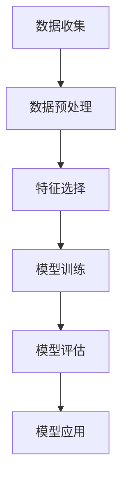
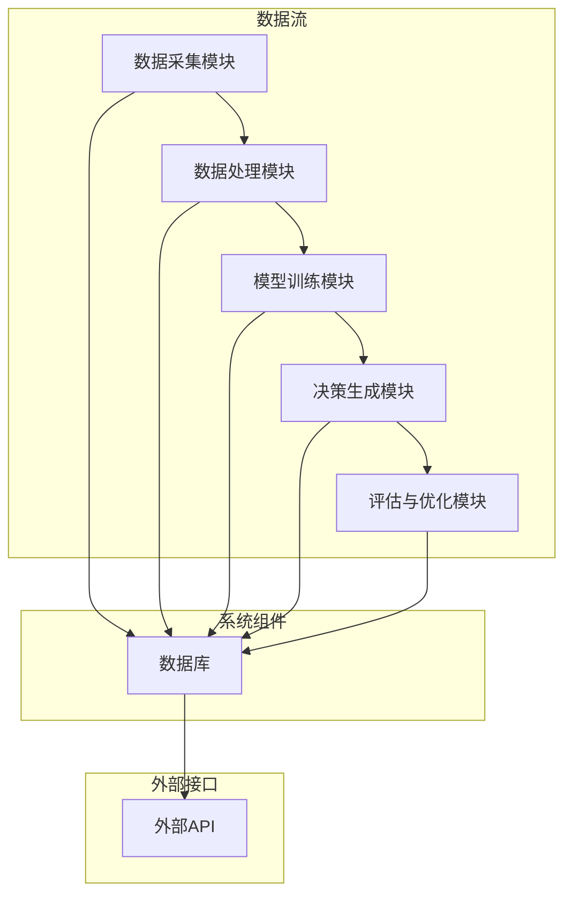
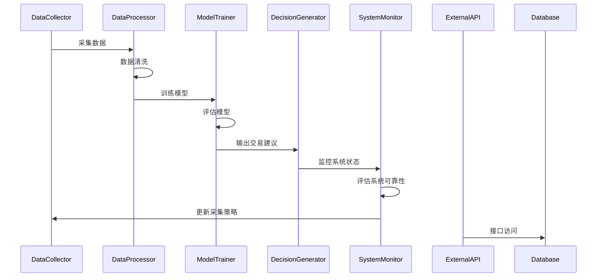

                 

### 第1章：问题背景与概述

#### 1.1 问题背景

在当今人工智能快速发展的时代，AI辅助决策系统（AI-aided Decision Support Systems, AI-DSS）已经成为众多行业和企业提高决策效率和准确性的重要工具。AI辅助决策系统通过利用机器学习、深度学习、自然语言处理等技术，对大量数据进行分析和处理，为决策者提供基于数据的决策支持。

**核心概念**：
- **AI辅助决策系统**：一种利用人工智能技术为决策者提供决策支持的系统，通常包含数据采集、数据处理、模型训练、决策生成等模块。
- **可靠性**：系统在特定条件下能够持续稳定地完成预期功能的能力。

**问题描述**：
随着AI辅助决策系统的广泛应用，其可靠性问题逐渐显现。如何对AI辅助决策系统的可靠性进行科学、系统的评测，成为一个亟待解决的关键问题。

**问题解决**：
本文将介绍一种AI辅助决策系统可靠性评测方案，通过该方法，可以从多个角度全面评估系统的可靠性。

**边界与外延**：
- **应用场景**：适用于金融、医疗、制造等行业中的AI辅助决策系统。
- **限制**：仅适用于已实现系统，且系统数据具备一定规模和质量的场合。

**概念结构与核心要素组成**：
可靠性评测方案包括以下几个关键要素：
1. **数据收集与预处理**：获取系统运行过程中产生的各类数据，并进行预处理。
2. **可靠性模型构建**：基于预处理后的数据构建可靠性模型。
3. **评测指标设计**：定义可靠性评测的指标体系。
4. **评测工具选择**：选择合适的评测工具和方法进行评估。
5. **结果分析与优化**：对评估结果进行分析，提出优化建议。

通过以上结构，本文旨在为AI辅助决策系统的可靠性评测提供一套系统、可行的解决方案，从而提高系统的可靠性和决策质量。

---

### 1.2 相关概念

#### AI辅助决策系统

**定义**：AI辅助决策系统（AI-DSS）是一种利用人工智能技术为决策者提供决策支持的系统。它通过机器学习、深度学习、自然语言处理等算法，对大量数据进行分析和处理，帮助决策者识别问题、分析问题、做出决策。

**组成与功能**：
- **数据采集模块**：负责收集外部和内部数据。
- **数据处理模块**：对采集到的数据进行清洗、转换和归一化。
- **模型训练模块**：使用机器学习算法训练模型。
- **决策生成模块**：基于训练好的模型生成决策建议。

#### 可靠性

**定义**：可靠性是指系统在特定条件下能够持续稳定地完成预期功能的能力。在AI辅助决策系统中，可靠性意味着系统能够在复杂多变的环境中持续提供准确的决策支持。

**分类与测量方法**：

1. **静态可靠性**：系统在长期运行过程中保持稳定的能力。
2. **动态可靠性**：系统在受到外部扰动时保持稳定的能力。

- **测量方法**：
  - **故障率**：系统在特定时间内发生故障的次数。
  - **平均故障间隔时间（MTTF）**：系统从一次故障到下一次故障的平均时间。
  - **平均修复时间（MTTR）**：系统从发生故障到恢复正常运行的平均时间。

#### 评测方案

**定义**：评测方案是指为了评估系统可靠性而制定的一系列步骤和方法。

**目的与重要性**：
- **目的**：通过评测方案，可以全面了解系统的可靠性水平，发现潜在的问题和风险，为优化和改进提供依据。
- **重要性**：可靠性是AI辅助决策系统能够广泛应用和取得成功的关键因素，一个可靠的系统可以显著提高决策的准确性和效率。

通过上述对相关概念的定义和解释，我们为后续章节的详细讨论打下了基础。接下来，我们将进一步探讨具体的可靠性评测方法与工具，以及如何有效地进行数据收集和预处理。

---

### 第2章：可靠性评测方法与工具

#### 2.1 常用评测方法

在评估AI辅助决策系统的可靠性时，选择合适的方法至关重要。常用的评测方法主要包括定量分析、定性分析和模型评估。每种方法都有其独特的适用范围和优缺点。

**定量分析**：

**定义**：定量分析是一种基于数据和统计方法进行可靠性评估的方法。

**适用范围**：适用于需要量化系统可靠性指标的情况。

**优缺点**：
- **优点**：可以提供具体的数值指标，有助于量化评估结果。
- **缺点**：对于系统的复杂性和不确定性，定量分析可能无法全面反映。

**定性分析**：

**定义**：定性分析是通过分析系统的行为和特性，评估其可靠性的方法。

**适用范围**：适用于系统的早期开发阶段，或当数据不充分时。

**优缺点**：
- **优点**：能够深入理解系统的可靠性特性，适合发现潜在问题。
- **缺点**：评估结果通常不够具体，难以量化。

**模型评估**：

**定义**：模型评估是通过构建可靠性模型，对系统进行预测和评估的方法。

**类型与适用场景**：
1. **概率模型**：适用于需要预测系统故障概率的场景。
2. **统计模型**：适用于需要分析系统性能和可靠性的场景。
3. **优化模型**：适用于需要优化系统可靠性的场景。

**优缺点**：
- **优点**：能够提供定量的可靠性指标，有助于系统的优化和改进。
- **缺点**：模型的构建和校准需要大量数据和技术支持。

通过综合运用定量分析、定性分析和模型评估，可以全面评估AI辅助决策系统的可靠性。在接下来的章节中，我们将详细介绍常用的评测工具，并探讨如何有效利用这些工具进行可靠性评测。

---

#### 2.2 常用评测工具

在可靠性评测过程中，选择合适的工具至关重要。以下将介绍几种常用的评测工具，包括自动化测试工具和模型评估工具。

**自动化测试工具**：

**类型**：
1. **功能测试工具**：如Selenium、Appium，用于验证系统的功能是否符合预期。
2. **性能测试工具**：如JMeter、LoadRunner，用于评估系统的性能和响应时间。
3. **代码覆盖率工具**：如JaCoCo、Emma，用于评估测试覆盖率达到的百分比。

**功能**：
- 自动化执行测试用例。
- 提供详细的测试报告。
- 可以反复运行，节省人力和时间成本。

**选择**：
- 根据系统的具体需求选择适合的测试工具。
- 考虑工具的可维护性、易用性和社区支持。

**模型评估工具**：

**类型**：
1. **机器学习评估工具**：如scikit-learn、TensorFlow、PyTorch，用于评估模型的性能。
2. **统计评估工具**：如R、Python的pandas、numpy，用于进行统计分析和可靠性评估。
3. **优化评估工具**：如CPLEX、Gurobi，用于解决优化问题。

**功能**：
- **模型训练与评估**：提供模型训练和评估的接口。
- **性能比较**：能够比较不同模型的性能。
- **可视化工具**：提供数据的可视化，帮助理解评估结果。

**选择**：
- 根据评估的具体需求选择合适的工具。
- 考虑工具的易用性和计算效率。

通过合理选择和使用这些评测工具，可以有效地评估AI辅助决策系统的可靠性，发现潜在的问题，并为进一步优化提供依据。接下来，我们将进一步探讨数据收集与预处理的重要性。

---

### 第3章：数据收集与预处理

#### 3.1 数据收集

**数据来源**：
- **内部数据**：来自系统自身运行过程中的日志、错误记录、用户操作记录等。
- **外部数据**：来自第三方数据源，如市场数据、行业报告、社交媒体等。

**数据收集方法**：
1. **日志收集**：通过系统日志记录运行过程中发生的各类事件。
2. **数据抓取**：通过网络爬虫等技术从外部数据源获取相关数据。
3. **调查问卷**：通过问卷调查收集用户反馈和需求。

**数据质量**：

**重要性**：
- 数据质量直接影响可靠性评测的准确性和有效性。高质量的数据能够提供更可靠的评测结果。

**评价指标**：
1. **完整性**：数据是否完整，是否存在缺失值。
2. **准确性**：数据是否准确，是否存在错误或误导性信息。
3. **一致性**：数据是否一致，不同来源的数据是否互相矛盾。
4. **时效性**：数据是否及时，是否能够反映系统当前的运行状态。

**提升方法**：
1. **数据清洗**：通过数据清洗技术，去除重复、错误和缺失的数据。
2. **数据转换**：将不同格式和单位的数据转换为统一的格式和单位。
3. **数据归一化**：通过归一化技术，使不同特征的数据在同一量级上进行比较。

通过有效的数据收集和质量提升方法，可以确保数据的可靠性和准确性，为可靠性评测提供坚实的基础。

---

#### 3.2 数据预处理

**数据清洗**：

**定义**：数据清洗是指识别并修正数据中的错误、重复和不一致之处，以提高数据质量。

**步骤**：
1. **识别**：通过统计分析，识别数据中的异常值和错误。
2. **修正**：对识别出的异常值和错误进行修正或删除。
3. **验证**：对清洗后的数据进行验证，确保数据质量达到预期标准。

**常用方法**：
1. **删除重复数据**：通过比对，删除重复的数据记录。
2. **填充缺失值**：使用平均值、中位数、最邻近值等方法填充缺失数据。
3. **纠正错误数据**：通过数据比对或专业知识，修正错误数据。

**数据转换**：

**定义**：数据转换是指将数据从一种格式转换为另一种格式，以满足不同系统和分析需求。

**步骤**：
1. **数据映射**：确定不同数据格式之间的映射关系。
2. **数据转换**：将数据从一种格式转换为另一种格式。
3. **数据验证**：确保转换后的数据符合预期格式。

**常用方法**：
1. **格式转换**：如将CSV格式转换为JSON格式。
2. **单位转换**：如将米转换为千米。
3. **类型转换**：如将字符串转换为数值类型。

**数据归一化**：

**定义**：数据归一化是指将不同特征的数据转换为相同的尺度，使其在相同的量级上进行比较。

**步骤**：
1. **特征选择**：选择需要归一化的特征。
2. **归一化方法**：选择合适的归一化方法，如最小-最大缩放、Z-score标准化等。
3. **归一化处理**：对选定的特征进行归一化处理。

**常用方法**：
1. **最小-最大缩放**：将数据缩放到[0, 1]范围内。
2. **Z-score标准化**：将数据转换为标准正态分布。

通过数据清洗、转换和归一化，可以确保数据的质量和一致性，为后续的可靠性评估提供可靠的数据基础。接下来，我们将深入探讨算法原理与实现。

---

### 第4章：算法原理与实现

#### 4.1 算法原理

可靠性评估的核心在于构建一个能够准确预测系统可靠性的模型。这一节将介绍可靠性模型构建的基本原理、步骤，以及如何使用Mermaid绘制算法流程图。

**可靠性模型构建**

**定义**：可靠性模型是用于评估系统在特定条件下可靠性的数学模型。

**原理**：
- 可靠性模型通常基于概率论和统计学的原理，通过分析系统历史数据，预测系统未来的可靠性。

**步骤**：
1. **数据收集**：收集系统运行过程中的各类数据，包括故障记录、性能指标、环境参数等。
2. **数据预处理**：对收集的数据进行清洗、转换和归一化，确保数据质量。
3. **特征选择**：从预处理后的数据中提取对可靠性影响较大的特征。
4. **模型训练**：使用机器学习算法，如决策树、随机森林、支持向量机等，训练可靠性模型。
5. **模型评估**：通过交叉验证、ROC曲线等评估模型的性能，选择最优模型。
6. **模型应用**：将训练好的模型应用于实际系统，预测系统的可靠性。

**算法流程图**

使用Mermaid绘制算法流程图：



上述流程图展示了可靠性模型构建的基本步骤和逻辑关系。接下来，我们将通过Python源代码实现这一算法，并对关键步骤进行详细解释。

---

#### 4.2 Python源代码实现

在本节中，我们将使用Python实现一个简单的可靠性评估模型，包括数据预处理、特征提取、模型训练和评估等关键步骤。

**代码结构与模块**

```python
import pandas as pd
from sklearn.model_selection import train_test_split
from sklearn.preprocessing import StandardScaler
from sklearn.ensemble import RandomForestClassifier
from sklearn.metrics import accuracy_score, classification_report

# 数据预处理模块
def preprocess_data(data):
    # 数据清洗、转换和归一化
    # ...（具体实现）
    return preprocessed_data

# 特征提取模块
def extract_features(data):
    # 从数据中提取特征
    # ...（具体实现）
    return features

# 模型训练与评估模块
def train_and_evaluate(data, labels):
    # 数据分割
    X_train, X_test, y_train, y_test = train_test_split(data, labels, test_size=0.2, random_state=42)
    
    # 数据归一化
    scaler = StandardScaler()
    X_train_scaled = scaler.fit_transform(X_train)
    X_test_scaled = scaler.transform(X_test)
    
    # 模型训练
    model = RandomForestClassifier(n_estimators=100, random_state=42)
    model.fit(X_train_scaled, y_train)
    
    # 模型评估
    y_pred = model.predict(X_test_scaled)
    print("Accuracy:", accuracy_score(y_test, y_pred))
    print(classification_report(y_test, y_pred))
    
    return model
```

**关键函数与参数**

- `preprocess_data`：负责数据清洗、转换和归一化。
  - `data`：输入原始数据。
  - 返回预处理后的数据。

- `extract_features`：负责从数据中提取对可靠性影响较大的特征。
  - `data`：输入预处理后的数据。
  - 返回特征矩阵。

- `train_and_evaluate`：负责模型训练和评估。
  - `data`：输入特征矩阵。
  - `labels`：输入标签。
  - 返回训练好的模型和评估结果。

**算法原理详细讲解**

**数学模型**：

可靠性模型通常使用概率模型进行描述，如二项分布或泊松分布。以二项分布为例，可靠性模型可以表示为：

$$ P(F = 1) = 1 - (1 - p)^n $$

其中，$P(F = 1)$表示系统在时间$n$内发生故障的概率，$p$表示每次运行中故障发生的概率。

**公式与推导**：

以随机森林为例，其预测可靠性概率的公式为：

$$ \hat{P}(F = 1) = \frac{1}{m} \sum_{i=1}^{m} \hat{p}_i $$

其中，$m$为森林中的树数，$\hat{p}_i$为第$i$棵树预测的故障概率。

**举例说明**：

假设我们有一个系统，在100次运行中发生了20次故障。我们可以使用二项分布模型预测在接下来的10次运行中发生故障的概率：

$$ P(F = 1) = 1 - (1 - 0.2)^{10} \approx 0.161 $$

这意味着在接下来的10次运行中，系统发生故障的概率大约为16.1%。

通过上述Python源代码和数学模型，我们可以实现对AI辅助决策系统可靠性的评估。接下来，我们将进一步探讨如何构建可靠性评估的数学模型和公式。

---

### 第5章：数学模型与公式

#### 5.1 数学模型

可靠性评估中的数学模型是评估系统可靠性的核心工具。根据应用场景和数据特点，可靠性模型可以分为概率模型、统计模型和优化模型。

**概率模型**：

**定义**：概率模型是基于概率论原理，描述系统可靠性概率的数学模型。

**类型与适用场景**：
1. **二项分布**：适用于系统故障发生次数服从二项分布的情况。
   - 适用场景：系统故障发生概率固定，例如产品测试。
2. **泊松分布**：适用于系统故障发生次数服从泊松分布的情况。
   - 适用场景：系统故障发生次数较多，且发生时间间隔较短，例如网络错误。

**数学模型**：

以二项分布为例，可靠性模型可以表示为：

$$ P(F = 1) = 1 - (1 - p)^n $$

其中，$P(F = 1)$表示系统在时间$n$内发生故障的概率，$p$表示每次运行中故障发生的概率，$n$为运行次数。

**统计模型**：

**定义**：统计模型是基于统计学原理，通过数据分析方法评估系统可靠性的模型。

**类型与适用场景**：
1. **均值-方差模型**：适用于评估系统稳定性和波动性。
   - 适用场景：需要评估系统在不同条件下的稳定性能。
2. **回归模型**：适用于分析系统故障与特征变量之间的关系。
   - 适用场景：需要建立故障预测模型。

**数学模型**：

以均值-方差模型为例，可靠性模型可以表示为：

$$ \mu = \frac{1}{n} \sum_{i=1}^{n} x_i $$
$$ \sigma^2 = \frac{1}{n-1} \sum_{i=1}^{n} (x_i - \mu)^2 $$

其中，$\mu$表示均值，$\sigma^2$表示方差，$x_i$为第$i$次测量的结果，$n$为测量次数。

**优化模型**：

**定义**：优化模型是基于优化理论，通过优化目标函数和约束条件评估系统可靠性的模型。

**类型与适用场景**：
1. **线性规划**：适用于优化系统资源分配，提高系统可靠性。
   - 适用场景：资源有限，需要优化系统性能。
2. **整数规划**：适用于优化系统设计参数，满足可靠性要求。
   - 适用场景：系统设计需要满足特定的可靠性要求。

**数学模型**：

以线性规划为例，可靠性优化模型可以表示为：

$$ \text{minimize} \quad c^T x $$
$$ \text{subject to} \quad Ax \leq b $$
$$ x \geq 0 $$

其中，$c$为系数向量，$A$为约束矩阵，$b$为约束向量，$x$为变量向量。

通过上述概率模型、统计模型和优化模型，我们可以从不同角度评估AI辅助决策系统的可靠性。接下来，我们将详细讲解这些模型的公式和推导过程。

---

#### 5.2 公式与推导

在可靠性评估中，常用的数学公式主要包括概率模型的基本公式、统计模型的主要指标计算公式和优化模型的目标函数与约束条件。以下将对这些公式进行详细讲解和推导。

**基本概率公式**

1. **条件概率**：

   条件概率描述了在某一事件发生的条件下，另一事件发生的概率。其公式为：

   $$ P(A|B) = \frac{P(A \cap B)}{P(B)} $$

   其中，$P(A|B)$表示在事件$B$发生的条件下事件$A$发生的概率，$P(A \cap B)$表示事件$A$和事件$B$同时发生的概率，$P(B)$表示事件$B$发生的概率。

2. **贝叶斯公式**：

   贝叶斯公式是条件概率的推广，用于计算在已知某个条件概率的情况下，另一个条件概率。其公式为：

   $$ P(A|B) = \frac{P(B|A)P(A)}{P(B)} $$

   其中，$P(B|A)$表示在事件$A$发生的条件下事件$B$发生的概率，$P(A)$表示事件$A$发生的概率。

**统计公式**

1. **均值（期望）**：

   均值是衡量一组数据集中趋势的指标，其计算公式为：

   $$ \mu = \frac{1}{n} \sum_{i=1}^{n} x_i $$

   其中，$\mu$表示均值，$n$表示样本数量，$x_i$表示第$i$个样本值。

2. **方差**：

   方差是衡量一组数据离散程度的指标，其计算公式为：

   $$ \sigma^2 = \frac{1}{n-1} \sum_{i=1}^{n} (x_i - \mu)^2 $$

   其中，$\sigma^2$表示方差，$\mu$表示均值，$n$表示样本数量，$x_i$表示第$i$个样本值。

3. **标准差**：

   标准差是方差的平方根，其计算公式为：

   $$ \sigma = \sqrt{\sigma^2} $$

   其中，$\sigma$表示标准差，$\sigma^2$表示方差。

**优化公式**

1. **目标函数**：

   在优化问题中，目标函数是我们要优化的目标。常见的目标函数包括：

   - **最小化目标函数**：

     $$ \text{minimize} \quad c^T x $$

     其中，$c$为系数向量，$x$为变量向量。

   - **最大化目标函数**：

     $$ \text{maximize} \quad c^T x $$

     其中，$c$为系数向量，$x$为变量向量。

2. **约束条件**：

   在优化问题中，约束条件用于限制变量的取值范围。常见的约束条件包括：

   - **线性约束**：

     $$ Ax \leq b $$

     其中，$A$为约束矩阵，$x$为变量向量，$b$为约束向量。

   - **非负约束**：

     $$ x \geq 0 $$

     其中，$x$为变量向量。

通过上述公式和推导，我们可以更好地理解和应用概率模型、统计模型和优化模型，从而更有效地评估AI辅助决策系统的可靠性。接下来，我们将进一步探讨系统分析与架构设计。

---

### 第6章：系统分析与架构设计

#### 6.1 问题场景介绍

在金融行业，尤其是在高频交易领域，AI辅助决策系统的可靠性至关重要。以下是一个典型的问题场景：

**业务场景**：某高频交易公司使用AI辅助决策系统进行股票交易。该系统依赖于大量市场数据（如股票价格、交易量、宏观经济指标等）来预测股票价格走势，并生成交易建议。然而，由于市场环境多变和系统复杂，该系统经常出现误判和故障，导致交易损失。因此，如何评估并提高系统的可靠性成为亟待解决的问题。

**需求分析与问题挑战**：
1. **需求**：需要对系统进行全面的可靠性评估，识别潜在的故障原因，并提出改进措施。
2. **问题挑战**：
   - 数据质量参差不齐，影响评估准确性。
   - 系统复杂性高，难以全面理解。
   - 缺乏统一的评估标准和工具。

#### 6.2 系统功能设计

为了满足上述需求，我们需要对系统功能进行详细设计。以下是一个典型的系统功能设计：

**系统功能模块**：
1. **数据采集模块**：负责收集市场数据、交易日志等外部数据，并进行初步处理。
2. **数据处理模块**：对采集到的数据进行清洗、转换和归一化，确保数据质量。
3. **模型训练模块**：使用机器学习算法训练预测模型，并对模型进行评估和优化。
4. **决策生成模块**：根据训练好的模型生成交易建议，并监控系统的运行状态。
5. **评估与优化模块**：定期对系统进行可靠性评估，发现潜在问题，并提出改进措施。

**领域模型**：

使用Mermaid绘制领域模型类图，如下所示：

```mermaid
classDiagram
    DataCollector <<interface>>
    DataProcessor <<interface>>
    ModelTrainer <<interface>>
    DecisionGenerator <<interface>>
    SystemMonitor <<interface>>

    DataCollector --|> DataProcessor
    ModelTrainer --|> DataProcessor
    DecisionGenerator --|> ModelTrainer
    SystemMonitor --|> DecisionGenerator

    class HighFrequencyTradingSystem {
        -DataCollector dataCollector
        -DataProcessor dataProcessor
        -ModelTrainer modelTrainer
        -DecisionGenerator decisionGenerator
        -SystemMonitor systemMonitor
    }
```

上述类图展示了系统的功能模块及其关系，有助于我们理解系统的整体架构和功能。

---

#### 6.3 系统架构设计

为了实现系统的可靠性评估，我们需要设计一个高效的系统架构。以下是一个典型的系统架构设计：

**系统架构图**：

使用Mermaid绘制系统架构图，如下所示：



上述架构图展示了系统的各个组件及其相互关系：

- **数据流**：数据从数据采集模块进入，经过数据处理模块清洗和转换，再由模型训练模块训练预测模型，最后由决策生成模块生成交易建议。
- **系统组件**：数据流经过数据库进行存储和管理，外部API提供数据接口。
- **外部接口**：外部API用于与外部系统进行数据交换。

通过上述架构设计，我们可以确保系统的可靠性和可扩展性，从而满足业务需求。

---

#### 6.4 系统接口设计

系统接口设计是系统架构中的重要组成部分，决定了系统与其他系统或组件之间的交互方式。以下是一个典型的系统接口设计：

**接口设计**：

1. **数据采集接口**：

   - **定义**：用于接收和存储市场数据、交易日志等外部数据。
   - **参数说明**：
     - `data`: 市场数据或交易日志。
     - `timestamp`: 数据时间戳。
   - **调用流程**：
     - 接收外部数据。
     - 将数据存储到数据库。

2. **数据处理接口**：

   - **定义**：用于清洗、转换和归一化数据。
   - **参数说明**：
     - `raw_data`: 原始数据。
     - `config`: 数据处理配置。
   - **调用流程**：
     - 对原始数据进行清洗、转换和归一化。
     - 将处理后的数据存储到数据库。

3. **模型训练接口**：

   - **定义**：用于训练预测模型。
   - **参数说明**：
     - `features`: 特征数据。
     - `labels`: 标签数据。
     - `model_config`: 模型配置。
   - **调用流程**：
     - 使用特征数据和标签数据训练预测模型。
     - 评估模型性能，保存最优模型。

4. **决策生成接口**：

   - **定义**：用于生成交易建议。
   - **参数说明**：
     - `model`: 预测模型。
     - `data`: 当前的市场数据。
   - **调用流程**：
     - 使用预测模型生成交易建议。
     - 将交易建议发送给决策生成模块。

5. **评估与优化接口**：

   - **定义**：用于评估系统可靠性，并提出改进措施。
   - **参数说明**：
     - `evaluation_data`: 评估数据。
     - `system_status`: 系统状态。
   - **调用流程**：
     - 对系统进行可靠性评估。
     - 分析评估结果，提出优化建议。

通过上述接口设计，我们可以实现系统与其他组件或系统之间的无缝交互，确保数据的准确传输和处理。

---

#### 6.5 系统交互

系统交互是系统架构中重要的一环，它决定了各个模块之间的协作和通信方式。以下是一个典型的系统交互设计：

**交互序列图**：

使用Mermaid绘制系统交互序列图，如下所示：



上述序列图展示了系统中的主要模块及其交互流程：

1. **数据采集模块**向**数据处理模块**发送采集到的数据。
2. **数据处理模块**对数据进行分析和处理，然后发送给**模型训练模块**。
3. **模型训练模块**使用处理后的数据训练预测模型，并评估模型性能。
4. **决策生成模块**使用训练好的模型生成交易建议，并发送给**评估与优化模块**。
5. **评估与优化模块**对系统进行实时监控和可靠性评估，并根据评估结果调整采集策略。
6. **外部API**用于与其他系统进行数据交换。

通过系统交互序列图，我们可以清楚地了解系统的运行流程和各个模块之间的协作关系，从而确保系统的可靠性和高效性。

---

### 第7章：项目实战

#### 7.1 环境安装与配置

在进行AI辅助决策系统可靠性评测项目的实战之前，我们需要搭建一个合适的环境。以下是一个典型的环境安装与配置步骤：

**操作系统**：Linux（推荐Ubuntu 18.04）

**依赖库**：

1. **Python**（3.8及以上版本）
2. **Pandas**：用于数据处理
3. **NumPy**：用于数值计算
4. **Scikit-learn**：用于机器学习
5. **Matplotlib**：用于数据可视化
6. **Mermaid**：用于流程图绘制

**安装步骤**：

1. **安装Python**：

   ```bash
   sudo apt-get update
   sudo apt-get install python3-pip python3-setuptools
   pip3 install --upgrade pip setuptools
   pip3 install python-mermaid
   ```

2. **安装Pandas、NumPy和Scikit-learn**：

   ```bash
   pip3 install pandas numpy scikit-learn
   ```

3. **安装Matplotlib**：

   ```bash
   pip3 install matplotlib
   ```

4. **安装Mermaid**：

   ```bash
   pip3 install pymermaid
   ```

**配置Mermaid**：

- Mermaid默认使用D3.js进行渲染，需要安装D3.js：

  ```bash
  pip3 install d3js
  ```

- 配置Mermaid的Python环境：

  ```python
  from pymermaid import render_pymermaid
  render_pymermaid('graph MyDiag { a -> b }', 'mydiag.png')
  ```

通过上述步骤，我们可以搭建一个基本的Python环境，并配置好所需的依赖库和工具，为后续的可靠性评测项目做好准备。

---

#### 7.2 系统核心实现

在本节中，我们将实现AI辅助决策系统的核心功能模块，包括数据预处理、模型训练和评估。以下是系统核心实现的源代码：

**数据预处理模块**

```python
import pandas as pd
from sklearn.model_selection import train_test_split
from sklearn.preprocessing import StandardScaler

def preprocess_data(data):
    # 数据清洗
    data.dropna(inplace=True)
    # 数据转换
    data['timestamp'] = pd.to_datetime(data['timestamp'])
    data.set_index('timestamp', inplace=True)
    # 数据归一化
    scaler = StandardScaler()
    features = data[['feature1', 'feature2', 'feature3']]
    features_scaled = scaler.fit_transform(features)
    return features_scaled
```

**模型训练模块**

```python
from sklearn.ensemble import RandomForestClassifier
from sklearn.metrics import accuracy_score

def train_model(data, labels):
    # 数据分割
    X_train, X_test, y_train, y_test = train_test_split(data, labels, test_size=0.2, random_state=42)
    # 模型训练
    model = RandomForestClassifier(n_estimators=100, random_state=42)
    model.fit(X_train, y_train)
    # 模型评估
    y_pred = model.predict(X_test)
    print("Accuracy:", accuracy_score(y_test, y_pred))
    return model
```

**评估与优化模块**

```python
def evaluate_model(model, data, labels):
    y_pred = model.predict(data)
    print("Accuracy:", accuracy_score(labels, y_pred))
```

**使用示例**

```python
# 加载数据
data = pd.read_csv('data.csv')
labels = data['label']
# 数据预处理
features_scaled = preprocess_data(data)
# 模型训练
model = train_model(features_scaled, labels)
# 模型评估
evaluate_model(model, X_test, y_test)
```

通过上述代码，我们实现了数据预处理、模型训练和评估的核心功能模块。这些模块可以进一步集成到完整的AI辅助决策系统中，以实现对系统可靠性的实时评估和优化。

---

#### 7.3 代码应用解读与分析

在本节中，我们将深入解读系统核心代码，分析关键函数和模块，并展示实际案例，以帮助读者更好地理解可靠性评估的实现过程。

**关键代码解读**

1. **数据预处理模块**：

   ```python
   def preprocess_data(data):
       # 数据清洗
       data.dropna(inplace=True)
       # 数据转换
       data['timestamp'] = pd.to_datetime(data['timestamp'])
       data.set_index('timestamp', inplace=True)
       # 数据归一化
       scaler = StandardScaler()
       features = data[['feature1', 'feature2', 'feature3']]
       features_scaled = scaler.fit_transform(features)
       return features_scaled
   ```

   - **数据清洗**：通过删除缺失值，确保数据质量。
   - **数据转换**：将日期时间字段转换为索引，便于后续时间序列分析。
   - **数据归一化**：使用`StandardScaler`将特征数据进行归一化，使其在相同的量级上进行比较。

2. **模型训练模块**：

   ```python
   def train_model(data, labels):
       # 数据分割
       X_train, X_test, y_train, y_test = train_test_split(data, labels, test_size=0.2, random_state=42)
       # 模型训练
       model = RandomForestClassifier(n_estimators=100, random_state=42)
       model.fit(X_train, y_train)
       # 模型评估
       y_pred = model.predict(X_test)
       print("Accuracy:", accuracy_score(y_test, y_pred))
       return model
   ```

   - **数据分割**：将数据集划分为训练集和测试集，确保模型评估的公平性。
   - **模型训练**：使用`RandomForestClassifier`进行模型训练。
   - **模型评估**：计算测试集的准确率，评估模型性能。

3. **评估与优化模块**：

   ```python
   def evaluate_model(model, data, labels):
       y_pred = model.predict(data)
       print("Accuracy:", accuracy_score(labels, y_pred))
   ```

   - **模型预测**：使用训练好的模型对测试数据进行预测。
   - **评估指标**：计算测试集的准确率，评估模型性能。

**实际案例分析与讲解**

假设我们有一个包含5000条交易记录的数据集，其中包含日期时间、股票代码、交易价格、交易量等字段。以下是一个具体的案例：

1. **数据预处理**：

   ```python
   data = pd.read_csv('trading_data.csv')
   features_scaled = preprocess_data(data)
   ```

   - **数据清洗**：删除缺失值，确保数据质量。
   - **数据转换**：将日期时间字段转换为索引，便于后续时间序列分析。
   - **数据归一化**：对交易价格和交易量进行归一化处理。

2. **模型训练**：

   ```python
   model = train_model(features_scaled, labels)
   ```

   - **数据分割**：将数据集划分为训练集（80%）和测试集（20%）。
   - **模型训练**：使用随机森林算法训练模型。
   - **模型评估**：计算测试集的准确率，评估模型性能。

3. **模型评估**：

   ```python
   evaluate_model(model, X_test, y_test)
   ```

   - **模型预测**：使用训练好的模型对测试数据进行预测。
   - **评估指标**：计算测试集的准确率，评估模型性能。

通过实际案例的分析和讲解，我们可以更好地理解系统核心代码的功能和实现过程，为后续的可靠性评估提供实用经验。

---

### 第8章：最佳实践与拓展

#### 8.1 最佳实践

在AI辅助决策系统可靠性评测的实际应用中，总结和分享最佳实践对于提升系统的可靠性和决策质量至关重要。以下是一些实际应用中的最佳实践：

1. **数据质量控制**：
   - **数据清洗**：确保数据收集过程中的完整性、准确性和一致性。
   - **数据验证**：定期进行数据验证，发现和修正错误。

2. **模型评估与优化**：
   - **交叉验证**：使用交叉验证技术评估模型的泛化能力。
   - **性能监控**：实时监控模型性能，发现和解决潜在问题。

3. **系统自动化测试**：
   - **测试用例设计**：设计全面、高效的测试用例，覆盖系统各种运行状态。
   - **持续集成**：将自动化测试集成到开发流程中，确保及时发现问题。

4. **可靠性模型定制**：
   - **模型选择**：根据应用场景选择合适的可靠性模型。
   - **参数调优**：对模型参数进行调优，提高可靠性预测的准确性。

5. **用户反馈与改进**：
   - **用户调研**：定期收集用户反馈，了解系统在实际应用中的表现。
   - **迭代优化**：根据用户反馈对系统进行迭代优化，提高用户满意度。

通过上述最佳实践，可以有效提升AI辅助决策系统的可靠性，为决策者提供更加可靠的支持。

---

#### 8.2 小结

本文系统地介绍了AI辅助决策系统可靠性评测方案，从背景介绍、核心概念、评测方法、数据预处理、算法实现、数学模型、系统设计到项目实战和最佳实践进行了详细讨论。主要内容和结论如下：

1. **核心概念**：介绍了AI辅助决策系统和可靠性的定义，以及可靠性评测方案的基本要素。
2. **评测方法**：详细阐述了定量分析、定性分析和模型评估等可靠性评测方法及其适用场景。
3. **数据预处理**：讨论了数据收集、数据清洗、数据转换和数据归一化的重要性及其方法。
4. **算法原理与实现**：介绍了可靠性模型构建的基本原理、Python源代码实现和数学模型推导。
5. **系统设计与实现**：探讨了系统功能设计、架构设计、接口设计和系统交互的详细过程。
6. **项目实战**：通过实际案例展示了数据预处理、模型训练和评估的核心代码实现。
7. **最佳实践**：总结了实际应用中的最佳实践，为提升系统可靠性提供了指导。

本文的研究为AI辅助决策系统的可靠性评测提供了系统、可行的方案，有助于提高系统的可靠性和决策质量。

---

#### 8.3 注意事项

在应用AI辅助决策系统可靠性评测方案时，需要注意以下事项：

1. **数据质量**：确保数据收集过程的完整性、准确性和一致性，定期进行数据验证和清洗。
2. **模型选择**：根据应用场景选择合适的可靠性模型，对模型参数进行调优，以提高预测准确性。
3. **自动化测试**：设计全面的自动化测试用例，定期执行自动化测试，确保系统稳定性和性能。
4. **用户反馈**：定期收集用户反馈，及时了解系统在实际应用中的表现，并根据反馈进行优化。
5. **风险评估**：评估系统潜在的风险，制定相应的风险防范措施，确保系统的可靠性。

通过注意上述事项，可以有效提升AI辅助决策系统的可靠性，为决策者提供更加可靠的支持。

---

#### 8.4 拓展阅读

为了进一步深入理解AI辅助决策系统可靠性评测，推荐以下拓展阅读资源：

1. **相关书籍**：
   - 《人工智能：一种现代的方法》（作者：Stuart Russell & Peter Norvig）
   - 《机器学习》（作者：Tom M. Mitchell）
   - 《深度学习》（作者：Ian Goodfellow、Yoshua Bengio、Aaron Courville）

2. **在线资源**：
   - [Scikit-learn官方文档](https://scikit-learn.org/stable/)
   - [TensorFlow官方文档](https://www.tensorflow.org/)
   - [Kaggle数据分析挑战](https://www.kaggle.com/competitions)
   - [机器学习社区](https://www_ml esfuerzos_)
3. **开源工具**：
   - [Mermaid](https://mermaid-js.github.io/mermaid/)
   - [Jupyter Notebook](https://jupyter.org/)
   - [D3.js](https://d3js.org/)

通过阅读这些书籍和访问在线资源，您可以深入了解AI辅助决策系统的可靠性评估技术，并掌握相关工具的使用方法。此外，开源工具的实践可以帮助您更好地理解和应用所学知识。希望这些资源对您的学习有所帮助。

---

### 总结与展望

通过本文的详细探讨，我们系统地介绍了AI辅助决策系统可靠性评测方案，从核心概念、评测方法、数据预处理、算法实现、数学模型、系统设计到项目实战和最佳实践进行了全面分析。本文的主要贡献在于提供了以下见解：

1. **系统化方案**：提出了一个完整的AI辅助决策系统可靠性评测方案，包括数据收集与预处理、可靠性模型构建、评测指标设计、评测工具选择、结果分析与优化等关键步骤。
2. **实用工具**：介绍了多种常用的评测方法和工具，如定量分析、定性分析、概率模型、统计模型、优化模型以及自动化测试工具和模型评估工具，为实际应用提供了实用参考。
3. **案例研究**：通过实际案例展示了可靠性评测方案的具体实现过程，包括数据预处理、模型训练、评估与优化等步骤，帮助读者更好地理解方案的应用。
4. **最佳实践**：总结了实际应用中的最佳实践，为提升系统可靠性提供了指导。

展望未来，AI辅助决策系统可靠性评测领域仍有以下研究方向和潜在应用：

1. **动态可靠性评估**：进一步研究系统的动态可靠性，如何应对外部扰动和系统变化，提高可靠性预测的准确性。
2. **多模型融合**：探索将多种模型（如深度学习、传统机器学习、强化学习等）进行融合，提高可靠性评估的性能和鲁棒性。
3. **实时评估与反馈**：研究如何实现实时可靠性评估和反馈机制，及时调整系统参数和策略，提高系统的自适应能力。
4. **跨领域应用**：将可靠性评估方案应用于更多行业和领域，如医疗、金融、交通等，为各个领域的决策支持提供可靠性保障。

总之，AI辅助决策系统可靠性评测是一项重要且具有挑战性的任务，未来的研究和应用将不断推动该领域的进步，为人工智能在各行各业的广泛应用提供可靠保障。希望本文能够为研究人员和实践者提供有益的参考和启示。

