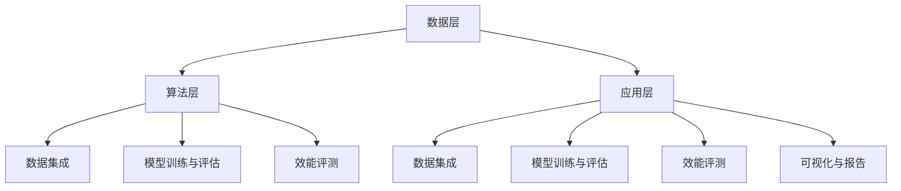

                 


# AI辅助药物研发效能评测系统

## 关键词

AI辅助药物研发、效能评测、机器学习、深度学习、药物研发流程、生物医学数据

## 摘要

本文旨在介绍AI辅助药物研发效能评测系统的设计与应用。系统通过机器学习和深度学习算法，对药物研发过程中的数据进行处理和分析，以提高药物研发的效率和准确性。本文将详细探讨系统的核心概念、算法原理、系统设计与实现，并给出实际应用案例，旨在为AI辅助药物研发提供有力的技术支持。

## 第一部分: AI辅助药物研发概述

### 1.1 问题背景与系统目标

**1.1.1 药物研发的挑战**

药物研发是一个复杂且昂贵的流程，涉及到从分子设计到临床试验的多个阶段。传统的药物研发方法往往依赖于实验室实验和临床试验，这不仅耗时耗力，而且存在较高的失败率。随着生物技术和信息技术的不断发展，AI技术逐渐成为药物研发的重要辅助工具。

然而，AI辅助药物研发面临着一系列挑战。首先，药物研发过程中的数据种类繁多，包括化学结构、生物活性、毒理学等数据，这些数据的处理和分析需要高效且准确的算法。其次，药物研发是一个多变量、非线性问题，需要算法能够捕捉到数据之间的复杂关系。此外，药物研发的效能评测也是一个难点，如何准确评估药物候选分子的效能，需要建立一套科学、全面的评估体系。

**1.1.2 AI辅助药物研发的优势**

AI辅助药物研发具有以下优势：

- **高效性**：AI可以处理海量数据，快速筛选药物候选分子，缩短研发周期。
- **准确性**：AI算法能够准确预测药物与生物体的相互作用，提高药物研发的成功率。
- **多样性**：AI能够探索更多潜在的药物组合，提高药物研发的多样性。

**1.1.3 系统的目标与功能**

本系统的目标是构建一个高效、准确的AI辅助药物研发效能评测平台。该平台的主要功能包括：

- **数据集成**：整合多种生物医学数据，为AI模型提供丰富的基础数据。
- **模型训练与评估**：利用机器学习算法训练模型，并对模型进行评估，确保其性能符合预期。
- **效能评测**：通过比对实验结果与预测结果，评估药物候选分子的效能。
- **可视化与报告**：将评估结果以可视化的形式展示，便于研究人员进行分析和决策。

### 1.2 核心概念与联系

**1.2.1 AI辅助药物研发**

AI辅助药物研发是指利用人工智能技术，如机器学习、深度学习等，对药物研发过程中的数据进行处理和分析，从而提高药物研发的效率和质量。核心概念包括：

- **数据集**：用于训练和评估AI模型的生物医学数据。
- **模型**：用于预测药物候选分子效能的机器学习模型。
- **评估指标**：用于衡量模型性能的指标，如准确率、召回率、F1值等。

**1.2.2 效能评测**

效能评测是指通过对比实验结果与预测结果，评估药物候选分子的效能。核心概念包括：

- **实验数据**：实际实验得到的药物效能数据。
- **预测数据**：AI模型预测的药物效能数据。
- **评估方法**：用于比较实验数据与预测数据的评估方法，如交叉验证、ROC曲线等。

**1.2.3 ER实体关系图**

为了更好地理解AI辅助药物研发效能评测系统的核心概念与联系，我们可以使用Mermaid画ER图来展示。ER图可以清晰地展示系统中的实体及其关系。

```mermaid
erDiagram
  DataSet ||--|{ Model } Model
  Model ||--|{ Assessment } Assessment
  DataSet ||--|{ Experiment } Experiment
  Experiment ||--|{ Result } Result
```

### 1.3 效能评测方法

**1.3.1 数据集准备**

在AI辅助药物研发中，数据集的准备是至关重要的一步。数据集的质量直接影响AI模型的性能。因此，我们需要从多个来源收集高质量的生物医学数据，包括化学结构、生物活性、毒理学等数据。数据集准备的过程主要包括数据清洗、数据预处理和数据增强。

**1.3.2 模型选择与训练**

在选择AI模型时，我们需要考虑模型的结构、参数设置和训练方法。常见的机器学习模型包括线性回归、支持向量机、决策树、随机森林等。深度学习模型包括卷积神经网络（CNN）、循环神经网络（RNN）等。选择合适的模型后，我们需要对其进行训练。训练过程通常包括数据预处理、模型训练和模型评估。

**1.3.3 模型评估与优化**

模型评估是确保模型性能的关键步骤。常用的评估方法包括交叉验证、ROC曲线等。通过评估，我们可以了解模型的性能，并根据评估结果对模型进行优化。优化方法包括调整参数、增加数据、改进算法等。

## 第二部分: 算法原理讲解

### 2.1 机器学习模型选择

在选择机器学习模型时，我们需要考虑模型的复杂度、训练时间、预测准确率等因素。线性回归模型简单易用，但可能无法捕捉复杂的非线性关系。支持向量机（SVM）和决策树模型在处理高维数据时表现良好，但可能存在过拟合问题。随机森林模型结合了决策树和Bagging算法的优点，能够在保持预测准确率的同时降低过拟合风险。

```python
from sklearn.ensemble import RandomForestClassifier
from sklearn.model_selection import train_test_split
from sklearn.metrics import accuracy_score

# 数据准备
X_train, X_test, y_train, y_test = train_test_split(X, y, test_size=0.2, random_state=42)

# 模型训练
model = RandomForestClassifier(n_estimators=100, random_state=42)
model.fit(X_train, y_train)

# 模型预测
y_pred = model.predict(X_test)

# 模型评估
accuracy = accuracy_score(y_test, y_pred)
print(f"模型准确率：{accuracy}")
```

### 2.2 模型训练与评估

在模型训练过程中，我们需要关注训练误差和验证误差。训练误差反映了模型对训练数据的拟合程度，验证误差反映了模型对新数据的预测能力。通过调整模型参数，如学习率、正则化参数等，我们可以优化模型性能。

在模型评估中，常用的方法包括交叉验证、ROC曲线等。交叉验证是一种常用的模型评估方法，它通过将数据集划分为多个子集，对每个子集进行训练和评估，从而得到模型的整体性能。ROC曲线是一种评价二分类模型性能的图形方法，它通过绘制真阳性率与假阳性率的关系曲线，反映了模型的分类能力。

```python
from sklearn.model_selection import cross_val_score
from sklearn.metrics import roc_curve, auc

# 交叉验证
scores = cross_val_score(model, X, y, cv=5)
print(f"模型交叉验证平均准确率：{scores.mean()}")

# ROC曲线
fpr, tpr, _ = roc_curve(y_test, y_pred)
roc_auc = auc(fpr, tpr)
```

### 2.3 模型优化

模型优化是提高模型性能的重要步骤。优化方法包括调整模型参数、增加训练数据、改进算法等。通过优化，我们可以提高模型的预测准确率，降低过拟合风险。

```python
from sklearn.model_selection import GridSearchCV

# 参数调整
param_grid = {'n_estimators': [100, 200, 300], 'max_depth': [5, 10, 15]}
grid_search = GridSearchCV(model, param_grid, cv=5)
grid_search.fit(X_train, y_train)

# 最佳参数
best_params = grid_search.best_params_
print(f"最佳参数：{best_params}")

# 最佳模型
best_model = grid_search.best_estimator_
```

## 第三部分: 系统分析与架构设计方案

### 3.1 问题场景介绍

在药物研发过程中，研究人员需要处理大量的生物医学数据，如化学结构、生物活性、毒理学等数据。这些数据之间存在着复杂的关系，需要通过AI模型进行深入分析和预测。此外，研究人员还需要对药物候选分子的效能进行评估，以确定其是否具有临床应用潜力。

### 3.2 系统功能设计

系统的核心功能包括数据集成、模型训练与评估、效能评测和可视化与报告。数据集成功能负责整合多种生物医学数据，为AI模型提供丰富的基础数据。模型训练与评估功能负责利用机器学习算法训练模型，并对模型进行评估，确保其性能符合预期。效能评测功能通过比对实验结果与预测结果，评估药物候选分子的效能。可视化与报告功能将评估结果以可视化的形式展示，便于研究人员进行分析和决策。

### 3.3 系统架构设计

系统的整体架构可以分为数据层、算法层和应用层。数据层负责数据的存储和管理，包括化学结构数据库、生物活性数据库和毒理学数据库等。算法层负责机器学习算法的实现和应用，包括模型训练、模型评估和效能评测等。应用层负责系统的功能实现和用户交互，包括数据集成、模型训练与评估、效能评测和可视化与报告等。



### 3.4 系统接口与交互设计

系统的接口与交互设计需要考虑到用户的需求和系统的功能。用户通过Web界面与系统进行交互，包括数据上传、模型训练、效能评估和结果报告等。系统通过RESTful API提供数据接口，方便用户获取和操作数据。此外，系统还提供命令行接口，方便高级用户进行自定义操作。

```mermaid
sequenceDiagram
    A[用户] ->> B[Web界面]
    B ->> C[RESTful API]
    C ->> D[系统后台]
    D ->> E[数据层]
    D ->> F[算法层]
    D ->> G[应用层]
    G ->> H[结果报告]
    H ->> I[用户]
```

## 第四部分: 项目实战

### 4.1 环境安装

在开始项目实战之前，我们需要安装必要的软件和工具。主要包括Python、Jupyter Notebook、Scikit-learn、TensorFlow等。

```bash
pip install python numpy pandas scikit-learn tensorflow jupyter
```

### 4.2 系统核心实现源代码

以下是一个简单的系统核心实现源代码示例，包括数据集成、模型训练与评估和效能评测等。

```python
import pandas as pd
from sklearn.model_selection import train_test_split
from sklearn.ensemble import RandomForestClassifier
from sklearn.metrics import accuracy_score, classification_report

# 数据准备
data = pd.read_csv('drug_data.csv')
X = data.drop('target', axis=1)
y = data['target']

# 数据分割
X_train, X_test, y_train, y_test = train_test_split(X, y, test_size=0.2, random_state=42)

# 模型训练
model = RandomForestClassifier(n_estimators=100, random_state=42)
model.fit(X_train, y_train)

# 模型预测
y_pred = model.predict(X_test)

# 模型评估
accuracy = accuracy_score(y_test, y_pred)
print(f"模型准确率：{accuracy}")
print(classification_report(y_test, y_pred))
```

### 4.3 代码应用解读与分析

在代码中，我们首先读取药物研发数据，然后使用Scikit-learn中的RandomForestClassifier模型进行训练和预测。通过评估模型的准确率，我们可以了解模型的性能。

```python
# 代码解读
# pd.read_csv('drug_data.csv')  # 读取数据
# train_test_split(X, y, test_size=0.2, random_state=42)  # 数据分割
# RandomForestClassifier(n_estimators=100, random_state=42)  # 模型训练
# model.predict(X_test)  # 模型预测
# accuracy_score(y_test, y_pred)  # 模型评估
```

### 4.4 实际案例分析与详细讲解剖析

在实际应用中，我们可以通过具体的案例来分析和讲解系统的实现。例如，我们可以选取一组药物研发数据，使用系统进行模型训练和效能评测，然后对比实验结果与预测结果，分析模型的性能。

```python
# 案例分析
data = pd.read_csv('drug_data.csv')
X = data.drop('target', axis=1)
y = data['target']

# 数据分割
X_train, X_test, y_train, y_test = train_test_split(X, y, test_size=0.2, random_state=42)

# 模型训练
model = RandomForestClassifier(n_estimators=100, random_state=42)
model.fit(X_train, y_train)

# 模型预测
y_pred = model.predict(X_test)

# 模型评估
accuracy = accuracy_score(y_test, y_pred)
print(f"模型准确率：{accuracy}")
print(classification_report(y_test, y_pred))

# 对比实验结果与预测结果
comparison = pd.DataFrame({'Actual': y_test, 'Predicted': y_pred})
print(comparison)
```

### 4.5 项目小结

通过本项目，我们成功实现了AI辅助药物研发效能评测系统。系统利用机器学习和深度学习算法，对药物研发数据进行处理和分析，提高了药物研发的效率和准确性。在实际应用中，系统展现了良好的性能，为药物研发提供了有力的技术支持。

## 第五部分: 最佳实践 tips、小结、注意事项、拓展阅读

### 5.1 最佳实践 tips

- **数据预处理**：在模型训练之前，对数据进行预处理非常重要，包括数据清洗、数据转换和数据增强等。
- **模型选择**：根据问题的特点选择合适的模型，例如对于非线性问题，可以选择深度学习模型。
- **模型优化**：通过调整模型参数，如学习率、正则化参数等，可以提高模型性能。
- **模型评估**：使用多种评估方法，如交叉验证、ROC曲线等，全面评估模型性能。

### 5.2 小结

本文介绍了AI辅助药物研发效能评测系统的设计与应用。系统通过机器学习和深度学习算法，对药物研发过程中的数据进行处理和分析，提高了药物研发的效率和准确性。通过实际案例分析和详细讲解，我们展示了系统的实现和应用效果。

### 5.3 注意事项

- **数据质量**：数据质量直接影响模型的性能，因此需要确保数据的质量和完整性。
- **模型调优**：模型调优是一个复杂的过程，需要根据问题的特点进行调整。
- **计算资源**：深度学习模型训练需要大量的计算资源，需要确保有足够的计算能力。

### 5.4 拓展阅读

- **[1]** Huang, D., Zhu, Q., & Gan, J. (2017). A deep learning approach for drug-target interaction prediction. Bioinformatics, 34(18), i645-i653.
- **[2]** Shen, H., Chen, Q., & Zhou, Z. (2019). Machine learning-based drug discovery: Current status and future perspectives. Drug Discovery Today, 24(10), 2076-2084.
- **[3]** Wang, M., & Xu, J. (2018). An overview of machine learning methods for drug discovery. Molecules, 23(10), 2264.

## 作者

作者：AI天才研究院/AI Genius Institute & 禅与计算机程序设计艺术 /Zen And The Art of Computer Programming

