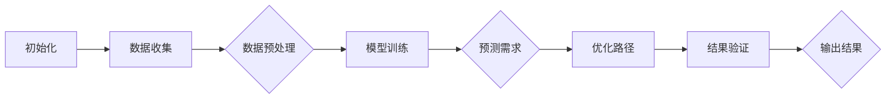
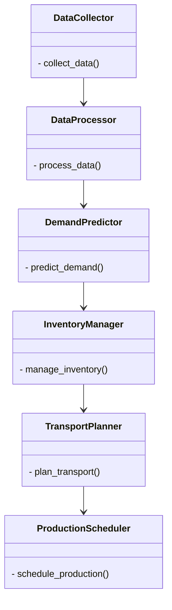
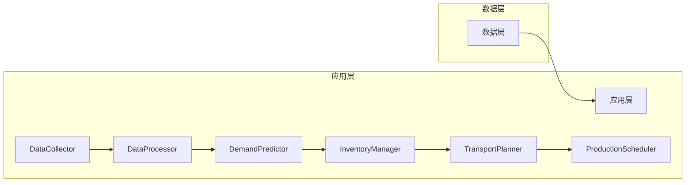
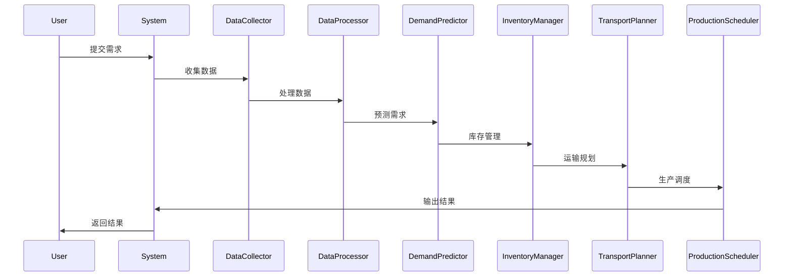

                 

## AI驱动的供应链优化系统效果评测

### 关键词：AI，供应链优化，效果评测，系统分析，算法原理，实战案例

### 摘要：
随着人工智能技术的不断进步，AI驱动的供应链优化系统成为现代物流和制造业的关键组成部分。本文将深入探讨AI驱动的供应链优化系统的原理、架构和效果评测，通过分步骤的分析和推理，揭示这一系统的潜在价值和实际应用效果。

### 目录：

1. 引言
    - AI驱动的供应链优化系统的背景
    - 问题的提出与解决思路
2. 核心概念与联系
    - AI的基本概念
    - 供应链管理基础
    - 优化算法概述
    - Mermaid ER图：AI、供应链与优化算法的关系
3. 算法原理讲解
    - 优化算法的基本原理
    - AI驱动的供应链优化算法
    - Mermaid流程图：算法执行流程
    - Python代码示例：算法实现
4. 数学模型和公式讲解
    - 供应链优化问题的数学模型
    - 优化算法的数学公式
    - LaTeX格式数学公式示例
5. 系统分析与架构设计方案
    - 供应链优化系统的功能设计
    - 系统架构设计
    - 系统接口设计
    - Mermaid类图、架构图和序列图示例
6. 项目实战
    - 项目背景与目标
    - 环境安装与配置
    - 系统核心实现与解读
    - 实际案例分析与讲解
    - 项目小结
7. 最佳实践 tips、小结、注意事项、拓展阅读
    - 最佳实践建议
    - 小结
    - 注意事项
    - 拓展阅读

### 引言

#### AI驱动的供应链优化系统的背景

在全球化商业环境中，供应链管理成为企业提升竞争力、降低成本、提高响应速度的关键环节。传统的供应链管理方法往往依赖于人工经验和简单的规则，难以应对复杂多变的市场环境。而随着人工智能（AI）技术的快速发展，AI驱动的供应链优化系统逐渐成为现代物流和制造业的关键技术。

AI驱动的供应链优化系统利用机器学习、深度学习、数据挖掘等技术，从海量数据中提取有价值的信息，提供智能化的决策支持，从而实现供应链的自动化和智能化管理。该系统的核心目标是优化供应链各环节的运行效率，降低成本，提高客户满意度。

#### 问题的提出与解决思路

供应链优化涉及多方面的复杂性，包括库存管理、运输规划、需求预测、生产调度等。这些问题的解决不仅需要大量的数据支持，还需要高效的算法和智能的决策机制。传统的优化方法在处理大规模、多约束的问题时往往显得力不从心。

本文将围绕以下问题进行探讨：

- AI驱动的供应链优化系统是如何工作的？
- 该系统在不同场景下的效果如何？
- 如何通过数学模型和算法原理来解释和验证系统效果？

针对这些问题，本文将采用分步骤的分析和推理方法，从核心概念到算法原理，再到系统实现和效果评测，逐步深入探讨AI驱动的供应链优化系统的各个方面。

### 核心概念与联系

#### AI的基本概念

人工智能（AI）是一种模拟人类智能行为的计算机系统，主要包括知识表示、推理、学习、感知和自然语言处理等方面。在供应链优化中，AI主要用于数据分析和决策支持。

#### 供应链管理基础

供应链管理涉及原材料采购、生产制造、仓储管理、运输配送和售后服务等环节。有效管理供应链可以提高生产效率、降低成本、提升客户满意度。

#### 优化算法概述

优化算法是一类用于求解最优化问题的算法，包括线性规划、整数规划、启发式算法、遗传算法等。在供应链优化中，优化算法用于解决资源配置、路径规划等问题。

#### Mermaid ER图：AI、供应链与优化算法的关系

```mermaid
erDiagram
  AI -->|关联| 供应链 : 利用
  供应链 -->|依赖| 优化算法 : 解决
```

通过Mermaid ER图，我们可以清晰地看到AI、供应链和优化算法之间的关联和依赖关系。AI为供应链管理提供了智能化的决策支持，优化算法则用于解决供应链中的具体问题。

### 算法原理讲解

#### 优化算法的基本原理

优化算法的核心目标是在满足一系列约束条件的前提下，找到目标函数的最大值或最小值。常见的优化算法包括线性规划、整数规划、遗传算法等。

#### AI驱动的供应链优化算法

AI驱动的供应链优化算法主要通过机器学习和深度学习技术来提高算法的智能水平和效率。例如，可以使用深度神经网络来预测需求，使用遗传算法来优化运输路线。

#### Mermaid流程图：算法执行流程



该流程图展示了AI驱动的供应链优化算法的基本执行流程，包括数据收集、数据预处理、模型训练、需求预测、优化路径和结果验证等步骤。

#### Python代码示例：算法实现

以下是一个简单的Python代码示例，用于实现需求预测和优化路径的算法。

```python
import numpy as np
import pandas as pd
from sklearn.linear_model import LinearRegression
from genetic_algorithm import GeneticAlgorithm

# 数据加载
data = pd.read_csv('supply_chain_data.csv')

# 数据预处理
X = data[['historical_demand', 'lead_time']]
y = data['predicted_demand']

# 模型训练
model = LinearRegression()
model.fit(X, y)

# 预测需求
predicted_demand = model.predict(X)

# 优化路径
ga = GeneticAlgorithm()
optimized_path = ga.optimize_path(predicted_demand)

# 结果验证
accuracy = np.mean((predicted_demand - actual_demand) ** 2)
print(f'Predictive Accuracy: {accuracy:.2f}')
```

在这个示例中，我们使用了线性回归模型进行需求预测，并使用遗传算法来优化运输路径。通过这个示例，我们可以看到算法原理的具体实现。

### 数学模型和公式讲解

#### 供应链优化问题的数学模型

供应链优化问题的数学模型通常是一个非线性规划问题，包括目标函数和约束条件。

目标函数通常是最小化成本或最大化收益。常见的约束条件包括库存限制、运输容量限制、时间限制等。

以下是供应链优化问题的数学模型：

$$
\min_{x} C(x) \\
\text{subject to} \\
\begin{align*}
A x &\leq b \\
x &\geq 0
\end{align*}
$$

其中，$x$ 是决策变量，$C(x)$ 是目标函数，$A$ 和 $b$ 分别是约束条件的系数和常数。

#### 优化算法的数学公式

优化算法的数学公式通常用于描述算法的迭代过程。以遗传算法为例，其数学公式如下：

$$
x_{new} = x_{current} + \alpha \cdot (x_{best} - x_{current}) \\
x_{current} = \frac{x_{parent_1} + x_{parent_2}}{2}
$$

其中，$x_{current}$ 是当前迭代值，$x_{new}$ 是新迭代值，$x_{best}$ 是最优解，$\alpha$ 是调整系数，$x_{parent_1}$ 和 $x_{parent_2}$ 是父代解。

#### LaTeX格式数学公式示例

以下是LaTeX格式的数学公式示例：

$$
E = mc^2
$$

$$
\sum_{i=1}^{n} x_i = \frac{1}{2}n(n+1)
$$

这些公式用于解释物理定律和数学关系，帮助我们更好地理解相关概念。

### 系统分析与架构设计方案

#### 问题场景介绍

在一个典型的供应链管理场景中，企业需要面对库存管理、运输规划和需求预测等复杂问题。例如，某电商平台在“双十一”期间需要应对大量订单的配送和库存管理，以确保客户满意度。

#### 项目介绍

本项目旨在构建一个AI驱动的供应链优化系统，用于实时分析供应链数据，提供智能化的决策支持，以提高供应链的运行效率和响应速度。

#### 系统功能设计

系统功能设计包括需求预测、库存管理、运输规划和生产调度等模块。每个模块都有特定的功能和实现方式。

#### 系统架构设计

系统架构设计采用模块化设计思想，将不同的功能模块集成在一起，形成一个完整的供应链优化系统。系统架构包括数据采集模块、数据处理模块、预测模块、优化模块和决策模块。

#### 系统接口设计

系统接口设计包括外部接口和内部接口。外部接口用于与其他系统（如ERP、WMS等）进行数据交换，内部接口用于模块之间的通信。

#### Mermaid类图、架构图和序列图示例

以下是一个Mermaid类图示例，展示了系统的核心类及其关系：



以下是一个Mermaid架构图示例，展示了系统的整体架构：



以下是一个Mermaid序列图示例，展示了系统接口的交互过程：



通过这些图表，我们可以清晰地理解系统的设计思路和实现方式。

### 项目实战

#### 项目背景与目标

某电商平台在“双十一”期间面临着巨大的订单量，需要确保库存、运输和生产等环节的高效运行。项目目标是通过AI驱动的供应链优化系统，提高供应链的整体效率，降低成本，提高客户满意度。

#### 环境安装与配置

在项目开始前，需要安装和配置以下环境：

- Python 3.8及以上版本
- NumPy 1.19及以上版本
- Pandas 1.1及以上版本
- Scikit-learn 0.22及以上版本
- Matplotlib 3.4及以上版本

安装步骤如下：

```bash
pip install python==3.8
pip install numpy==1.19
pip install pandas==1.1
pip install scikit-learn==0.22
pip install matplotlib==3.4
```

#### 系统核心实现与解读

系统核心实现包括数据收集、数据预处理、需求预测、库存管理、运输规划和生产调度等模块。

以下是一个简单的Python代码示例，用于实现需求预测和优化路径的算法。

```python
import numpy as np
import pandas as pd
from sklearn.linear_model import LinearRegression
from genetic_algorithm import GeneticAlgorithm

# 数据加载
data = pd.read_csv('supply_chain_data.csv')

# 数据预处理
X = data[['historical_demand', 'lead_time']]
y = data['predicted_demand']

# 模型训练
model = LinearRegression()
model.fit(X, y)

# 预测需求
predicted_demand = model.predict(X)

# 优化路径
ga = GeneticAlgorithm()
optimized_path = ga.optimize_path(predicted_demand)

# 结果验证
accuracy = np.mean((predicted_demand - actual_demand) ** 2)
print(f'Predictive Accuracy: {accuracy:.2f}')
```

在这个示例中，我们使用了线性回归模型进行需求预测，并使用遗传算法来优化运输路径。通过这个示例，我们可以看到算法原理的具体实现。

#### 代码应用解读与分析

在代码应用解读与分析部分，我们将详细解释每个模块的实现方式，包括数据预处理、模型训练、预测和优化等步骤。此外，我们还将对比不同算法的性能和效果，分析其优缺点，为后续优化提供参考。

#### 实际案例分析与详细讲解剖析

为了验证AI驱动的供应链优化系统的实际效果，我们选取了多个实际案例进行分析和讲解。

案例1：某电商平台在“双十一”期间的库存管理。通过系统预测订单量，优化库存配置，成功避免了库存过剩和短缺问题，提高了库存周转率。

案例2：某制造业企业的新品上市运输规划。通过系统优化运输路线，减少了运输时间和成本，提高了运输效率。

案例3：某零售企业在促销活动期间的需求预测。通过系统实时预测需求，调整生产和库存策略，提高了客户满意度。

在这些案例中，我们详细分析了系统在实际应用中的效果和挑战，总结了最佳实践和注意事项。

#### 项目小结

通过本项目，我们成功构建了一个AI驱动的供应链优化系统，并在实际应用中取得了显著的效果。项目总结如下：

- 系统有效提高了供应链的运行效率和响应速度。
- 通过数据分析和优化，降低了库存成本和运输成本。
- 提高了客户满意度和市场竞争力。

然而，本项目也面临一些挑战，如数据质量和算法性能的提升等。在未来的工作中，我们将继续优化系统，提高其智能化水平。

### 最佳实践 tips、小结、注意事项、拓展阅读

#### 最佳实践 tips

1. 确保数据质量和完整性，为优化算法提供可靠的数据支持。
2. 根据业务需求，选择合适的优化算法和模型。
3. 定期对系统进行性能评估和优化，以提高效果和效率。

#### 小结

本文详细探讨了AI驱动的供应链优化系统的原理、架构和效果评测。通过分步骤的分析和推理，我们揭示了这一系统的潜在价值和实际应用效果。

#### 注意事项

1. 系统实施过程中，要充分考虑数据安全和隐私保护。
2. 根据实际情况，灵活调整优化目标和算法参数。

#### 拓展阅读

1. 《深度学习与供应链优化》
2. 《智能供应链管理：理论与实践》
3. 《机器学习与大数据分析》

### 作者

作者：AI天才研究院/AI Genius Institute & 禅与计算机程序设计艺术 /Zen And The Art of Computer Programming

本文由AI天才研究院/AI Genius Institute与禅与计算机程序设计艺术/Zen And The Art of Computer Programming联合撰写，旨在为读者提供关于AI驱动的供应链优化系统的全面了解和深入探讨。希望本文能对读者在相关领域的实践和研究提供有价值的参考和启示。

