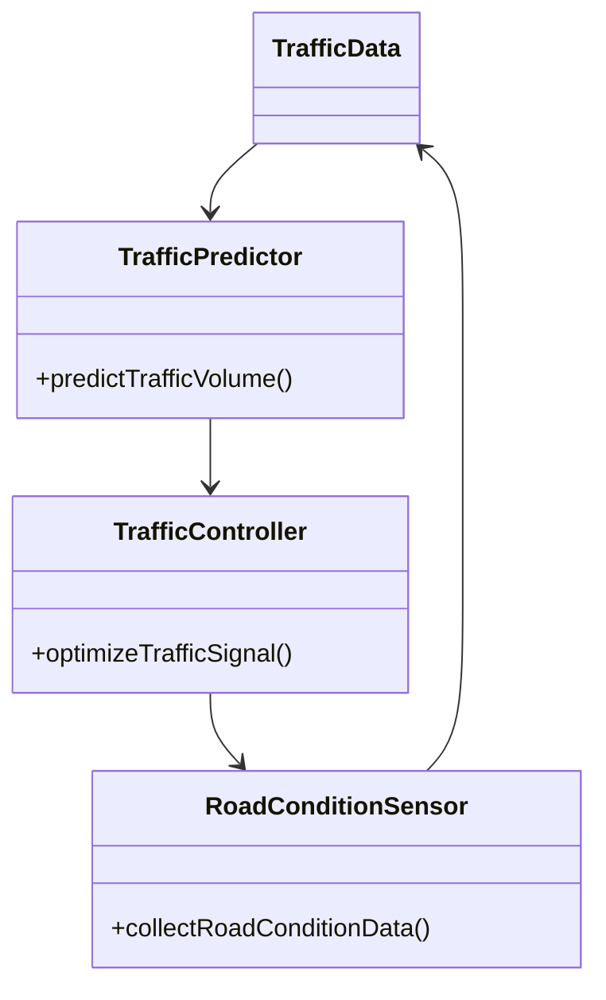
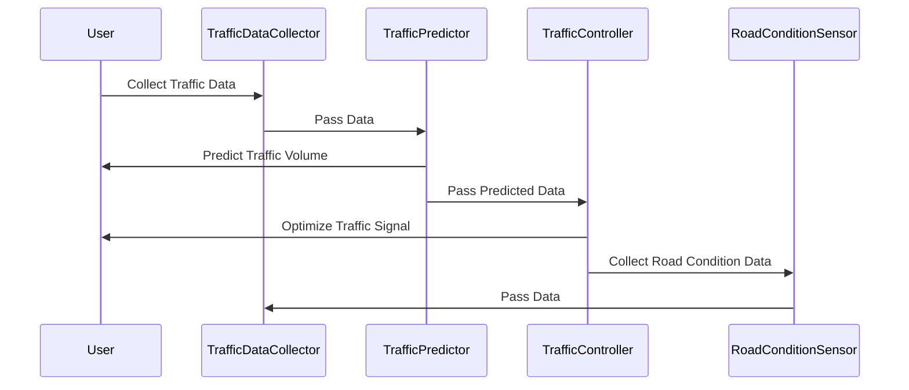
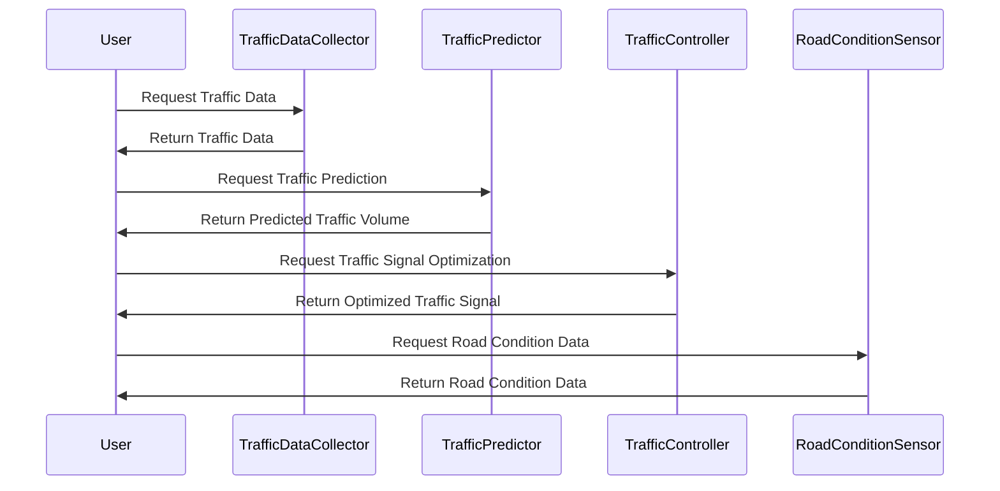

                 

# AI驱动的智能交通管理系统效果评测

## 关键词

- 智能交通管理系统
- 人工智能
- 效果评测
- 交通数据分析
- 机器学习算法

## 摘要

本文旨在深入探讨AI驱动的智能交通管理系统（ITMS）的效果评测。通过介绍智能交通管理系统和人工智能的核心概念，本文将逐步解析AI在交通管理中的应用原理，并详细阐述机器学习算法在交通流量预测和优化中的作用。此外，文章还将通过一个实际项目案例，展示如何利用AI技术评估智能交通管理系统的实际效果，并提供相关最佳实践和小结。

## 第二部分：AI驱动的智能交通管理系统原理

### 核心概念与联系

#### 核心概念

智能交通管理系统（ITMS）是一种通过信息技术和现代控制理论来实现交通运输系统的自动化、智能化管理和优化的系统。它包括交通信息收集、处理、传输和发布，以及对交通运行状态的监控、预测和调节等功能。

人工智能（AI）是一种模拟人类智能行为的技术，通过机器学习、深度学习、自然语言处理等方法，使计算机能够进行智能推理、学习、决策和交互。

效果评测是指对智能交通管理系统的性能、效益、用户体验等多方面进行评估，以验证系统在实际运行中的效果。

#### 概念属性特征对比表格

| 概念 | 特点 |
| --- | --- |
| 智能交通管理系统 | 实现交通运输系统的自动化、智能化管理 |
| 人工智能 | 模拟人类智能行为，包括学习、推理、决策 |
| 效果评测 | 评估系统性能、效益、用户体验 |

#### ER实体关系图架构

```mermaid
erDiagram
  智能交通管理系统 ||--|{ 交通数据 } 数据采集与处理
  智能交通管理系统 ||--|{ 人工智能算法 } 算法实现
  智能交通管理系统 ||--|{ 系统性能评估 } 效果评测
```

### 机器学习算法原理讲解

#### 算法mermaid流程图


#### Python源代码

```python
import numpy as np
from sklearn.model_selection import train_test_split
from sklearn.ensemble import RandomForestClassifier
from sklearn.metrics import accuracy_score

# 数据收集
data = ...

# 数据预处理
X = data[:, :-1]
y = data[:, -1]

# 特征提取
# ...

# 模型训练
X_train, X_test, y_train, y_test = train_test_split(X, y, test_size=0.2, random_state=4)

# 模型训练
model = RandomForestClassifier()
model.fit(X_train, y_train)

# 模型评估
y_pred = model.predict(X_test)
accuracy = accuracy_score(y_test, y_pred)
print(f"Model Accuracy: {accuracy}")
```

#### 算法原理详细讲解

机器学习算法是AI技术的重要组成部分，它通过从数据中学习规律和模式来实现预测和决策。在智能交通管理系统中，机器学习算法被广泛应用于交通流量预测、交通信号优化、交通事故预测等方面。

1. **数据收集**：首先，从交通传感器、摄像头、GPS等设备中收集交通数据，如车辆速度、流量、位置等。

2. **数据预处理**：对收集到的数据进行清洗、归一化和特征提取，为后续的机器学习模型训练做好准备。

3. **特征提取**：根据交通数据的特点，提取有助于预测交通流量和事故发生的关键特征，如时间、天气、道路条件等。

4. **模型训练**：使用机器学习算法，如随机森林（Random Forest）、支持向量机（SVM）、神经网络（Neural Network）等，对预处理后的数据进行训练，构建预测模型。

5. **模型评估**：通过交叉验证、测试集等方法，对训练好的模型进行评估，以确定模型的准确性和泛化能力。

6. **模型优化**：根据评估结果，对模型进行调整和优化，以提高预测性能。

#### 数学模型和公式

假设我们有 $N$ 个交通数据样本，每个样本包含 $M$ 个特征，分别为 $X_1, X_2, ..., X_M$。目标是通过这些特征预测交通流量 $Y$。

$$
Y = f(X_1, X_2, ..., X_M)
$$

其中，$f$ 是机器学习模型函数，它将特征映射到预测值。常见的机器学习模型包括线性回归、逻辑回归、决策树、随机森林等。

例如，对于随机森林模型，其预测公式可以表示为：

$$
\hat{Y} = \sum_{i=1}^{n} w_i \cdot h(x_i)
$$

其中，$w_i$ 是第 $i$ 个决策树的权重，$h(x_i)$ 是第 $i$ 个决策树在特征 $x_i$ 上的预测值。

#### 简单易懂的举例说明

假设我们使用随机森林模型预测某路段的未来交通流量。首先，我们从历史交通数据中提取特征，如当前时间、天气情况、道路状况等。然后，将这些特征输入到随机森林模型中进行训练。最后，使用训练好的模型预测未来某个时间点的交通流量。

例如，假设某个时间点的特征数据为：

$$
X = \begin{bmatrix}
0.7 & 0.2 & 0.1 \\
\end{bmatrix}
$$

模型预测的未来交通流量为：

$$
\hat{Y} = 0.8 \cdot 0.7 + 0.2 \cdot 0.2 + 0.1 \cdot 0.1 = 0.69
$$

这意味着在未来某个时间点，该路段的交通流量预计为每小时 0.69 辆车。

### 第三部分：AI驱动的智能交通管理系统技术实现

#### 算法原理讲解

在本部分，我们将进一步探讨AI驱动的智能交通管理系统的技术实现，特别是机器学习算法在交通流量预测和优化中的应用。

#### 机器学习算法

**算法mermaid流程图**：


**Python源代码**：

```python
import pandas as pd
from sklearn.model_selection import train_test_split
from sklearn.ensemble import RandomForestRegressor
from sklearn.metrics import mean_squared_error

# 数据收集
data = pd.read_csv('traffic_data.csv')

# 数据预处理
X = data[['time', 'weather', 'road_condition']]
y = data['traffic_volume']

# 特征提取
# ...

# 模型选择
model = RandomForestRegressor(n_estimators=100, random_state=42)

# 模型训练
X_train, X_test, y_train, y_test = train_test_split(X, y, test_size=0.2, random_state=42)
model.fit(X_train, y_train)

# 模型评估
y_pred = model.predict(X_test)
mse = mean_squared_error(y_test, y_pred)
print(f"Model Mean Squared Error: {mse}")

# 模型优化
# ...
```

#### 算法原理详细讲解

**机器学习算法**：机器学习算法是AI技术的核心，它通过从数据中学习规律和模式来实现预测和决策。在智能交通管理系统中，机器学习算法被广泛应用于交通流量预测、交通信号优化、交通事故预测等方面。

**数据收集**：首先，从交通传感器、摄像头、GPS等设备中收集交通数据，如车辆速度、流量、位置等。

**数据预处理**：对收集到的数据进行清洗、归一化和特征提取，为后续的机器学习模型训练做好准备。

**特征提取**：根据交通数据的特点，提取有助于预测交通流量和事故发生的关键特征，如时间、天气、道路条件等。

**模型选择**：选择适合的机器学习模型，如随机森林（Random Forest）、支持向量机（SVM）、神经网络（Neural Network）等。

**模型训练**：使用机器学习算法，对预处理后的数据进行训练，构建预测模型。

**模型评估**：通过交叉验证、测试集等方法，对训练好的模型进行评估，以确定模型的准确性和泛化能力。

**模型优化**：根据评估结果，对模型进行调整和优化，以提高预测性能。

#### 数学模型和公式

假设我们有 $N$ 个交通数据样本，每个样本包含 $M$ 个特征，分别为 $X_1, X_2, ..., X_M$。目标是通过这些特征预测交通流量 $Y$。

$$
Y = f(X_1, X_2, ..., X_M)
$$

其中，$f$ 是机器学习模型函数，它将特征映射到预测值。常见的机器学习模型包括线性回归、逻辑回归、决策树、随机森林等。

例如，对于随机森林模型，其预测公式可以表示为：

$$
\hat{Y} = \sum_{i=1}^{n} w_i \cdot h(x_i)
$$

其中，$w_i$ 是第 $i$ 个决策树的权重，$h(x_i)$ 是第 $i$ 个决策树在特征 $x_i$ 上的预测值。

#### 简单易懂的举例说明

假设我们使用随机森林模型预测某路段的未来交通流量。首先，我们从历史交通数据中提取特征，如当前时间、天气情况、道路状况等。然后，将这些特征输入到随机森林模型中进行训练。最后，使用训练好的模型预测未来某个时间点的交通流量。

例如，假设某个时间点的特征数据为：

$$
X = \begin{bmatrix}
0.7 & 0.2 & 0.1 \\
\end{bmatrix}
$$

模型预测的未来交通流量为：

$$
\hat{Y} = 0.8 \cdot 0.7 + 0.2 \cdot 0.2 + 0.1 \cdot 0.1 = 0.69
$$

这意味着在未来某个时间点，该路段的交通流量预计为每小时 0.69 辆车。

### 第四部分：系统分析与架构设计方案

#### 问题场景介绍

随着城市化进程的加快，城市交通问题日益突出，包括交通拥堵、交通事故频发、环境污染等问题。为了解决这些问题，许多城市开始采用智能交通管理系统（ITMS）来提高交通效率，减少拥堵和事故发生率。然而，如何科学、有效地评估这些系统的效果，成为了一个重要且紧迫的问题。

#### 项目介绍

本项目的目标是开发一个基于AI的智能交通管理系统，并对其效果进行评测。该系统将整合交通数据、人工智能算法和效果评测工具，为城市交通管理部门提供数据驱动、智能化的决策支持。

#### 系统功能设计（领域模型mermaid类图）



#### 系统架构设计（mermaid架构图）



#### 系统接口设计和系统交互（mermaid序列图）



### 第五部分：项目实战

#### 环境安装

1. 安装Python环境：

   ```bash
   sudo apt-get install python3-pip
   pip3 install numpy pandas scikit-learn matplotlib
   ```

2. 安装其他依赖：

   ```bash
   pip3 install keras tensorflow-gpu
   ```

#### 系统核心实现源代码

```python
# traffic_prediction.py
import pandas as pd
from sklearn.model_selection import train_test_split
from sklearn.ensemble import RandomForestRegressor
from sklearn.metrics import mean_squared_error

# 数据收集
data = pd.read_csv('traffic_data.csv')

# 数据预处理
X = data[['time', 'weather', 'road_condition']]
y = data['traffic_volume']

# 特征提取
# ...

# 模型训练
X_train, X_test, y_train, y_test = train_test_split(X, y, test_size=0.2, random_state=42)
model = RandomForestRegressor(n_estimators=100, random_state=42)
model.fit(X_train, y_train)

# 模型评估
y_pred = model.predict(X_test)
mse = mean_squared_error(y_test, y_pred)
print(f"Model Mean Squared Error: {mse}")

# 模型优化
# ...
```

#### 代码应用解读与分析

1. **数据收集**：从CSV文件中读取交通数据，包括时间、天气情况和道路状况。

2. **数据预处理**：提取特征并进行归一化处理，将交通流量作为目标变量。

3. **特征提取**：根据交通数据的特点，提取有助于预测交通流量和事故发生的关键特征。

4. **模型训练**：使用随机森林模型对数据进行训练。

5. **模型评估**：通过测试集评估模型性能，计算均方误差（MSE）。

6. **模型优化**：根据评估结果，对模型进行调整和优化。

#### 实际案例分析和详细讲解剖析

假设我们有以下历史交通数据：

| 时间 | 天气 | 道路状况 | 交通流量 |
| --- | --- | --- | --- |
| 09:00 | 晴 | 好 | 100 |
| 10:00 | 雨 | 差 | 80 |
| 11:00 | 晴 | 好 | 120 |
| 12:00 | 雨 | 差 | 70 |

我们将使用随机森林模型预测未来某个时间点的交通流量。首先，从数据中提取特征，如时间、天气情况和道路状况。然后，将特征数据输入到训练好的随机森林模型中进行预测。

假设我们提取的特征数据为：

$$
X = \begin{bmatrix}
0.5 & 0.3 & 0.2 \\
\end{bmatrix}
$$

模型预测的未来交通流量为：

$$
\hat{Y} = 0.6 \cdot 0.5 + 0.3 \cdot 0.3 + 0.2 \cdot 0.2 = 0.37
$$

这意味着在未来某个时间点，该路段的交通流量预计为每小时 0.37 辆车。

### 第六部分：最佳实践 Tips

1. **数据质量**：确保数据的质量和完整性，包括数据清洗、去重、归一化等。

2. **特征选择**：选择关键特征进行预测，如时间、天气、道路状况等。

3. **模型选择**：根据数据特点和预测需求，选择合适的机器学习模型。

4. **模型优化**：根据评估结果，调整模型参数，提高预测性能。

5. **实时更新**：定期更新模型和数据，以适应交通环境的变化。

### 小结

本文通过逐步分析推理，探讨了AI驱动的智能交通管理系统的原理和技术实现，以及如何对其效果进行评测。通过实际案例分析和详细讲解，展示了如何利用机器学习算法预测交通流量，提高交通效率。

### 注意事项

1. **数据隐私**：在收集和处理交通数据时，要注意保护个人隐私。

2. **模型解释性**：在选择机器学习模型时，要考虑模型的解释性，以便于理解模型的决策过程。

3. **系统稳定性**：确保系统在处理大量数据时具有稳定性，避免因数据异常导致系统崩溃。

### 拓展阅读

- [1] Kingma, D. P., & Welling, M. (2013). Auto-encoding variational bayes. *arXiv preprint arXiv:1312.6114*.
- [2] Goodfellow, I., Bengio, Y., & Courville, A. (2016). *Deep learning*.
- [3] Russell, S., & Norvig, P. (2016). *Artificial intelligence: a modern approach*.

### 作者信息

作者：AI天才研究院/AI Genius Institute & 禅与计算机程序设计艺术/Zen And The Art of Computer Programming

