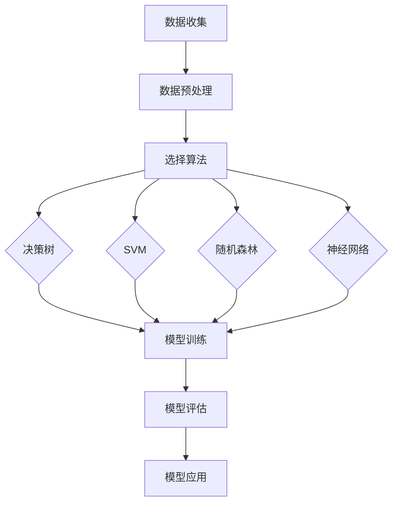
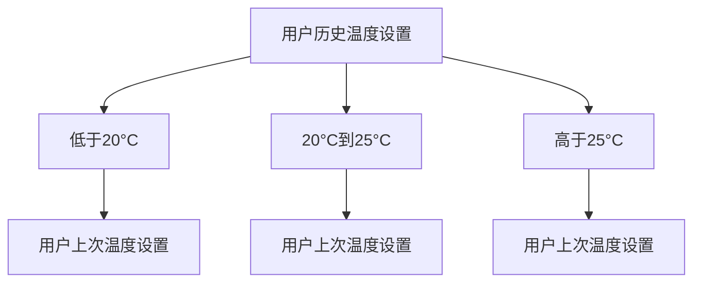
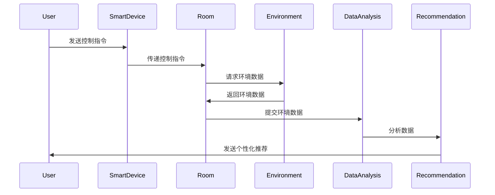
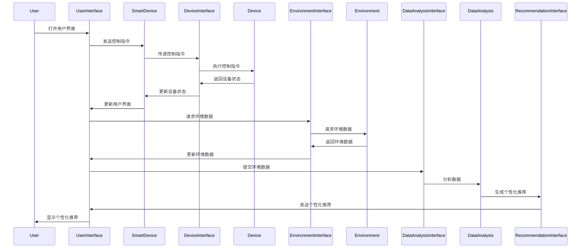

                 

# AI驱动的智能家居系统用户体验评测

关键词：人工智能，智能家居，用户体验评测，设计原则，实施策略

摘要：
本文深入探讨了AI驱动的智能家居系统的用户体验评测。首先，我们介绍了AI在智能家居中的应用及其核心概念。随后，我们详细阐述了用户体验评测的重要性及其方法和工具。接着，我们分析了设计用户体验评测的原则和策略，并通过实际案例进行了说明。本文旨在为智能家居系统的用户体验评测提供系统性指导和实践参考。

## 1. 引言

随着人工智能技术的迅猛发展，智能家居系统正逐渐融入我们的日常生活。AI驱动的智能家居系统不仅能够提供更加智能化的家居服务，还能够根据用户的行为习惯进行个性化调整，从而提升用户的生活质量和体验。然而，一个成功的智能家居系统不仅需要强大的技术支持，还需要关注用户的实际体验。用户体验评测作为衡量系统性能的重要手段，对于智能家居系统的设计、优化和推广具有重要意义。

本文将从以下几个方面展开讨论：
1. **背景和核心概念**：介绍AI在智能家居中的应用及其核心概念。
2. **AI驱动的智能家居系统**：详细描述系统的结构组成和AI的整合方式。
3. **用户体验评测**：阐述用户体验评测的重要性、方法和工具。
4. **设计和实施用户体验评测**：分析设计原则和实施策略。
5. **案例研究**：通过实际案例展示用户体验评测的效果。
6. **挑战和未来方向**：讨论用户体验评测面临的挑战和未来的发展趋势。
7. **结论**：总结本文的主要观点和重要性。

## 2. 背景：AI在智能家居中的应用

### 2.1 智能家居的定义与发展

智能家居是指通过互联网、物联网、大数据和人工智能等技术，实现家庭设备和系统的智能化、网络化和互动化的技术体系。智能家居系统通过将家庭设备连接到互联网，使设备之间能够进行信息交换和协同工作，从而为用户提供更加便捷、舒适和安全的居住环境。

智能家居的发展经历了以下几个阶段：

1. **初步阶段**（1990年代）：以家庭局域网和计算机控制为主，设备之间的连接和信息交换相对简单。
2. **发展阶段**（2000年代）：随着互联网的普及，智能家居开始逐步融入家庭生活，以WiFi、蓝牙等无线技术为主要连接手段。
3. **成熟阶段**（2010年代至今）：以人工智能为核心，智能家居系统实现了更高的智能化和自动化水平。

### 2.2 AI在智能家居中的应用

人工智能技术，尤其是深度学习和机器学习，在智能家居系统中发挥了重要作用。以下是一些典型的AI应用场景：

1. **智能助手**：如Apple的Siri、Google Assistant等，它们能够通过语音识别和自然语言处理，理解用户的指令，并提供相应的服务。
2. **智能家居设备**：如智能音箱、智能门锁、智能照明等，通过集成传感器和AI算法，能够实现自动化控制，并根据用户习惯进行智能调整。
3. **智能监控**：利用AI进行图像识别和模式识别，实现家庭安全的智能监控，如智能摄像头、智能门铃等。
4. **家居环境监测**：通过AI技术对室内温度、湿度、空气质量等参数进行实时监测和分析，提供个性化的环境优化建议。

### 2.3 AI驱动的智能家居系统

AI驱动的智能家居系统通常包括以下几个核心组成部分：

1. **感知层**：通过传感器和摄像头等设备收集家庭环境信息和用户行为数据。
2. **数据处理层**：利用云计算和大数据技术对收集到的数据进行分析和处理，提取有价值的信息。
3. **决策层**：基于AI算法，对处理后的数据进行分析和预测，做出相应的决策。
4. **执行层**：通过智能家居设备执行决策，实现家庭自动化和智能化。

### 2.4 核心概念

在讨论AI驱动的智能家居系统时，以下几个核心概念需要特别关注：

1. **用户中心设计**：以用户需求为核心，从用户的角度出发，设计智能家居系统。
2. **个性化**：通过AI技术，根据用户的行为习惯和偏好，提供个性化的家居服务。
3. **安全与隐私**：在智能家居系统中，用户的数据安全和隐私保护至关重要。
4. **可扩展性**：智能家居系统应具备良好的扩展性，以适应未来技术的发展和用户需求的变化。

## 3. 用户体验评测的核心概念与联系

### 3.1 用户体验评测的定义

用户体验评测（User Experience Evaluation，简称UX Evaluation）是指通过一系列方法和工具，对产品或服务的用户体验进行测量、分析和评估的过程。用户体验评测旨在发现产品或服务在用户体验方面的优点和不足，为改进设计和优化体验提供依据。

### 3.2 用户中心设计

用户中心设计（User-Centered Design，简称UCD）是一种以用户需求、体验和反馈为核心的设计方法。用户中心设计强调在整个设计过程中，始终关注用户的需求和体验，通过不断地与用户互动，确保设计能够满足用户的需求。

### 3.3 个性化

个性化（Personalization）是指通过AI技术，根据用户的个人喜好、行为习惯和需求，为用户量身定制产品或服务。在智能家居系统中，个性化主要体现在以下几个方面：

1. **个性化设置**：用户可以根据自己的需求，自定义智能家居设备的设置。
2. **个性化推荐**：系统根据用户的行为数据，推荐符合用户兴趣和需求的服务或产品。
3. **个性化控制**：系统可以根据用户的实时需求，自动调整家居设备的运行状态。

### 3.4 安全与隐私

安全与隐私是用户体验评测的重要方面。在智能家居系统中，用户的数据安全和隐私保护至关重要。以下是一些关键点：

1. **数据加密**：对用户数据进行加密，防止数据在传输和存储过程中被窃取。
2. **访问控制**：设置合理的访问权限，确保只有授权用户可以访问用户数据。
3. **隐私保护**：对用户隐私信息进行匿名化和脱敏处理，确保用户隐私不被泄露。

### 3.5 可扩展性

可扩展性是指系统在设计时，能够适应未来技术的发展和用户需求的变化。在智能家居系统中，可扩展性主要体现在以下几个方面：

1. **模块化设计**：系统采用模块化设计，各个模块可以独立开发和升级，确保系统具备良好的可扩展性。
2. **标准化接口**：系统采用标准化接口，方便与其他系统和设备进行集成。
3. **灵活的配置**：系统提供灵活的配置选项，用户可以根据自己的需求，自由选择和组合设备和服务。

### 3.6 概念属性特征对比表格

以下是一个简单的概念属性特征对比表格，用于对比用户体验评测、用户中心设计、个性化、安全与隐私和可扩展性等核心概念：

| 概念       | 定义                                                         | 属性特征                                                      |  
| ---------- | ------------------------------------------------------------ | ------------------------------------------------------------ |  
| 用户体验评测 | 对产品或服务的用户体验进行测量、分析和评估的过程             | 测量、分析、评估、用户体验满意度、改进建议                       |  
| 用户中心设计 | 以用户需求、体验和反馈为核心的设计方法                      | 用户需求分析、用户体验测试、设计迭代、用户参与                     |  
| 个性化     | 通过AI技术，根据用户的个人喜好、行为习惯和需求，为用户量身定制产品或服务 | 个人偏好分析、行为预测、个性化推荐、定制化服务                   |  
| 安全与隐私 | 保护用户数据安全和隐私的过程                                 | 数据加密、访问控制、隐私保护、安全审计、合规性                       |  
| 可扩展性   | 系统在设计时，能够适应未来技术的发展和用户需求的变化         | 模块化设计、标准化接口、灵活配置、可升级性、兼容性               |

### 3.7 ER实体关系图架构

以下是智能家居系统中核心实体及其关系的ER图示例，用于直观展示各实体之间的关联：

```mermaid
erDiagram
    User ||--|{ SmartHomeDevice }|-- DeviceOwner
    User ||--|{ UserProfile }|-- DeviceConfig
    User ||--|{ ActivityLog }|-- UserBehaviorAnalysis
    SmartHomeDevice ||--|{ DeviceCapability }|-- DeviceFunctionality
    DeviceOwner ||--|{ DeviceAccessControl }|-- PrivacyPolicy
    DeviceConfig ||--|{ DeviceSetting }|-- UserPreference
    ActivityLog ||--|{ BehaviorPattern }|-- SmartHomeRecommendation
```

此ER图展示了用户、智能家居设备、用户档案、活动日志、设备功能、设备访问控制和隐私政策等核心实体及其关系。通过该图，可以更清晰地理解各实体在系统中的角色和关联。

## 4. AI驱动的智能家居系统用户体验评测的算法原理

### 4.1 算法原理概述

AI驱动的智能家居系统用户体验评测的核心在于利用机器学习算法，从用户行为数据中提取有价值的信息，从而对用户体验进行评估。以下是该算法原理的详细讲解：

### 4.2 数据收集

首先，系统需要收集用户在智能家居环境中的各种行为数据，包括但不限于：

1. **设备使用数据**：如智能灯泡的开关次数、使用时长、亮度调节等。
2. **环境监测数据**：如室内温度、湿度、空气质量等。
3. **用户交互数据**：如语音指令、触摸操作等。
4. **活动日志数据**：如用户的活动轨迹、作息时间等。

这些数据可以通过智能家居设备的传感器、摄像头、智能助手等收集。

### 4.3 数据预处理

收集到的数据通常包含噪声和异常值，因此需要进行预处理。预处理步骤包括：

1. **数据清洗**：去除噪声和异常值。
2. **数据归一化**：将不同特征的数据进行归一化处理，使其具有相同的量纲。
3. **特征提取**：从原始数据中提取对用户体验影响较大的特征。

### 4.4 机器学习算法

接下来，选择合适的机器学习算法对预处理后的数据进行建模。以下是几种常用的算法：

1. **决策树**：通过递归二分划分数据，构建决策树模型，对用户体验进行分类评估。
2. **支持向量机（SVM）**：通过最大化分类间隔，将数据划分为不同的类别。
3. **随机森林**：通过构建多棵决策树，进行集成学习，提高分类的准确性。
4. **神经网络**：通过多层感知器构建神经网络，对用户体验进行回归分析。

### 4.5 模型训练与评估

使用训练数据集对选择的机器学习算法进行训练，并通过交叉验证等方法评估模型的性能。性能评估指标包括准确率、召回率、F1值等。

### 4.6 模型应用

将训练好的模型应用于实际用户数据，对用户体验进行预测和评估。根据评估结果，对智能家居系统进行优化和调整，以提高用户体验。

### 4.7 Mermaid算法流程图

以下是使用Mermaid绘制的算法流程图：



### 4.8 Python源代码示例

以下是使用Python实现决策树算法的示例代码：

```python
from sklearn.datasets import load_iris
from sklearn.tree import DecisionTreeClassifier
from sklearn.model_selection import train_test_split
from sklearn.metrics import accuracy_score

# 加载数据集
iris = load_iris()
X = iris.data
y = iris.target

# 数据集划分
X_train, X_test, y_train, y_test = train_test_split(X, y, test_size=0.3, random_state=42)

# 创建决策树模型
clf = DecisionTreeClassifier()

# 模型训练
clf.fit(X_train, y_train)

# 模型预测
y_pred = clf.predict(X_test)

# 评估模型性能
accuracy = accuracy_score(y_test, y_pred)
print(f"Accuracy: {accuracy}")
```

此代码示例演示了如何使用scikit-learn库加载数据集、划分数据集、创建决策树模型、训练模型并进行模型预测和性能评估。

### 4.9 算法原理讲解

决策树算法是一种常见的机器学习算法，其基本原理是通过一系列的判断条件，将数据划分为不同的类别或进行回归分析。以下是决策树算法的基本步骤：

1. **选择最佳划分特征**：在当前节点，选择一个特征作为划分条件，选择标准可以是信息增益、基尼不纯度等。
2. **划分数据**：根据最佳划分特征，将数据划分为若干个子集。
3. **递归构建子树**：对每个子集，重复执行步骤1和2，直到满足停止条件（如最大树深度、最小节点样本数等）。
4. **生成决策树模型**：将所有划分结果组合成一个完整的决策树模型。

决策树模型的数学模型可以表示为：

$$
Y = f(X) = \prod_{i=1}^{n} g(X_i; \theta_i)
$$

其中，$Y$表示输出结果，$X$表示输入特征，$g(X_i; \theta_i)$表示第$i$个特征的划分函数，$\theta_i$为参数。

### 4.10 举例说明

假设我们有一个智能家居系统，用户可以设置室内温度的上下限。我们可以使用决策树算法，根据用户的温度设置和历史数据，预测用户下次的温度设置。

以下是一个简单的决策树算法示例：

1. **选择最佳划分特征**：以用户历史温度设置的平均值作为划分特征。
2. **划分数据**：将用户历史温度设置分为三个区间：低于20°C、20°C到25°C、高于25°C。
3. **递归构建子树**：在每个子区间内，再次划分数据，直到满足停止条件。
4. **生成决策树模型**：最终生成的决策树模型如下：



根据用户的历史数据和当前温度设置，决策树可以预测用户下次的温度设置。例如，如果用户历史温度设置的平均值为22°C，且用户上次温度设置为23°C，则决策树预测用户下次的温度设置将继续保持23°C。

### 4.11 数学模型和公式

决策树算法的核心在于如何选择最佳划分特征。常用的划分标准包括信息增益、基尼不纯度等。以下是这些标准的数学模型和公式：

1. **信息增益（IG）**：

$$
IG(D, A) = H(D) - \sum_{v \in A} \frac{|D_v|}{|D|} H(D_v)
$$

其中，$H(D)$表示数据集$D$的熵，$D_v$表示数据集$D$中具有属性值$v$的子集，$|D|$和$|D_v|$分别表示数据集$D$和子集$D_v$的样本数。

2. **基尼不纯度（Gini Impurity）**：

$$
Gini(D) = 1 - \sum_{v \in A} \left(\frac{|D_v|}{|D|}\right)^2
$$

其中，$A$表示数据集$D$的属性集合，$v$为属性值。

### 4.12 通俗易懂地举例说明

假设我们有一个包含100个样本的数据集，其中50个样本的属性值为A，50个样本的属性值为B。我们可以使用信息增益和基尼不纯度来选择最佳划分特征。

1. **信息增益**：

$$
H(D) = \frac{50}{100} \log_2 \left(\frac{50}{100}\right) + \frac{50}{100} \log_2 \left(\frac{50}{100}\right) = 1
$$

$$
H(D_A) = \frac{25}{50} \log_2 \left(\frac{25}{50}\right) + \frac{25}{50} \log_2 \left(\frac{25}{50}\right) = 1
$$

$$
H(D_B) = \frac{25}{50} \log_2 \left(\frac{25}{50}\right) + \frac{25}{50} \log_2 \left(\frac{25}{50}\right) = 1
$$

$$
IG(D, A) = 1 - \left(\frac{50}{100}\right) - \left(\frac{50}{100}\right) = 0
$$

2. **基尼不纯度**：

$$
Gini(D) = 1 - \left(\frac{50}{100}\right)^2 - \left(\frac{50}{100}\right)^2 = 0.5
$$

由于信息增益为0，基尼不纯度为0.5，因此我们可以选择其他特征进行划分。

### 4.13 算法应用

决策树算法在智能家居系统中有着广泛的应用。例如，系统可以根据用户的历史数据和行为模式，预测用户下次的温度设置、光照调节等。通过不断优化算法模型，系统可以更好地满足用户的需求，提升用户体验。

### 4.14 最佳实践 Tips

1. **数据收集**：确保收集到足够多的用户数据，以提高模型的准确性。
2. **数据预处理**：对数据进行清洗、归一化处理，确保数据质量。
3. **特征选择**：选择对用户体验影响较大的特征，以提高模型的解释性。
4. **模型评估**：使用多种评估指标，如准确率、召回率、F1值等，全面评估模型性能。
5. **模型优化**：根据评估结果，不断调整模型参数，优化模型性能。

## 5. 智能家居系统架构设计方案

### 5.1 问题场景介绍

随着智能家居技术的发展，用户对于家居系统的要求越来越高。一个典型的场景是用户希望在家居环境中实现智能控制，包括智能灯光、智能空调、智能音响等设备的自动化控制，以及根据用户行为习惯进行个性化调整。为了实现这一目标，我们需要设计一个高效、稳定、易扩展的智能家居系统。

### 5.2 项目介绍

本项目的目标是设计一个基于AI驱动的智能家居系统，能够实现以下功能：

1. **智能设备控制**：通过智能设备控制中心，用户可以远程控制家中的智能设备，如灯光、空调、音响等。
2. **个性化设置**：根据用户的行为习惯和偏好，系统可以为用户提供个性化的家居体验。
3. **环境监测**：实时监测室内温度、湿度、空气质量等环境参数，为用户提供健康舒适的家居环境。
4. **数据分析和推荐**：基于用户的行为数据和环境数据，系统可以分析用户的喜好，提供个性化的推荐和服务。

### 5.3 系统功能设计（领域模型）

以下是智能家居系统的领域模型，展示了系统中主要的实体及其关系：

```mermaid
classDiagram
    User <<class{用户}>>  
    SmartDevice <<class{智能设备}>>  
    Room <<class{房间}>>  
    Environment <<class{环境}>>  
    DataAnalysis <<class{数据分析}>>  
    Recommendation <<class{推荐}>>  

    User "1" --|{控制}| SmartDevice  
    User "1" --|{设置}| Room  
    Room "1" --|{包含}| SmartDevice  
    Room "1" --|{监测}| Environment  
    Environment "1" --|{数据}| DataAnalysis  
    DataAnalysis "1" --|{生成}| Recommendation  
```

### 5.4 系统架构设计（架构图）

以下是智能家居系统的架构图，展示了系统的主要组件及其关系：



### 5.5 系统接口设计

以下是智能家居系统的主要接口设计：

1. **用户接口**：提供用户与系统交互的界面，包括设备控制、环境监测、个性化设置等。
2. **设备接口**：实现设备与系统之间的数据交换，包括设备状态、控制指令等。
3. **数据接口**：提供系统内部数据存储和访问的接口，包括用户数据、环境数据、分析数据等。

### 5.6 系统交互（序列图）

以下是智能家居系统的序列图，展示了用户与系统之间的交互过程：



### 5.7 实现细节

以下是一个简单的智能家居系统的实现细节，用于说明系统的实际运行过程：

```python
class User:
    def __init__(self, name):
        self.name = name

    def control_device(self, device_name, command):
        device = find_device(device_name)
        device.execute_command(command)

    def set_environment(self, temperature, humidity):
        environment = find_environment()
        environment.set_temperature(temperature)
        environment.set_humidity(humidity)

    def submit_environment_data(self, data):
        data_analysis = DataAnalysis(data)
        recommendation = Recommendation(data_analysis)
        recommendation.send_to_user()

class SmartDevice:
    def __init__(self, name):
        self.name = name

    def execute_command(self, command):
        if command == "on":
            self.turn_on()
        elif command == "off":
            self.turn_off()

    def turn_on(self):
        print(f"{self.name} 已开启")

    def turn_off(self):
        print(f"{self.name} 已关闭")

class Room:
    def __init__(self, name):
        self.name = name
        self.devices = []

    def add_device(self, device):
        self.devices.append(device)

    def get_environment_data(self):
        return {"temperature": 25, "humidity": 50}

class Environment:
    def __init__(self, temperature, humidity):
        self.temperature = temperature
        self.humidity = humidity

    def set_temperature(self, temperature):
        self.temperature = temperature

    def set_humidity(self, humidity):
        self.humidity = humidity

class DataAnalysis:
    def __init__(self, data):
        self.data = data

    def analyze_data(self):
        print("数据正在分析...")

    def generate_recommendation(self):
        print("生成个性化推荐...")

class Recommendation:
    def __init__(self, data_analysis):
        self.data_analysis = data_analysis

    def send_to_user(self):
        print("发送个性化推荐至用户...")

def find_device(device_name):
    # 实现设备查找逻辑
    return SmartDevice(device_name)

def find_environment():
    # 实现环境查找逻辑
    return Environment(25, 50)

# 实例化用户
user = User("张三")

# 控制设备
user.control_device("客厅灯", "on")

# 设置环境
user.set_environment(25, 50)

# 提交环境数据
user.submit_environment_data({"temperature": 25, "humidity": 50})
```

此代码示例展示了用户如何通过控制接口控制设备、设置环境参数，并提交环境数据以生成个性化推荐。实际应用中，系统会根据用户的行为数据和环境数据，利用机器学习算法进行分析和推荐。

### 5.8 项目实战

以下是一个简单的项目实战示例，用于说明如何在实际环境中部署智能家居系统：

1. **环境安装**：在服务器上安装必要的软件，如Python、Django、MySQL等。
2. **系统配置**：配置服务器环境，包括网络配置、数据库配置等。
3. **代码实现**：编写系统代码，包括用户接口、设备接口、数据分析接口等。
4. **测试部署**：对系统进行测试，确保功能正常运行。
5. **上线运行**：将系统部署到线上环境，供用户使用。

### 5.9 实际案例分析与详细讲解

以下是一个实际案例，用于分析智能家居系统的用户体验评测：

**案例背景**：用户张三在家中安装了智能灯光系统，希望能够通过手机APP控制灯光的开关和亮度。

**案例分析**：

1. **用户需求分析**：张三希望能够在任何时间、任何地点通过手机APP控制家中的灯光，并能够根据不同的场景调整灯光的亮度。
2. **用户体验评测**：通过用户行为数据，分析用户对灯光系统的使用频率、使用时长、使用场景等，评估系统的用户体验。
3. **优化措施**：根据用户体验评测结果，对系统进行优化，如增加场景模式、优化APP界面、提高响应速度等。

**详细讲解**：

1. **用户需求分析**：通过调查问卷、用户访谈等方式，收集用户对灯光系统的需求，如：
   - 能够远程控制灯光的开关和亮度。
   - 提供场景模式，如晚上回家模式、客厅活动模式等。
   - 提供定时开关功能，如早晨起床模式、晚上休息模式等。
2. **用户体验评测**：通过用户行为数据分析，评估用户对灯光系统的满意度，如：
   - 用户使用频率：统计用户每天使用灯光的次数，分析用户的使用习惯。
   - 用户使用时长：统计用户每次使用灯光的时长，分析用户的使用场景。
   - 用户满意度调查：通过问卷调查或用户反馈，收集用户对灯光系统的满意度评价。
3. **优化措施**：根据用户体验评测结果，对系统进行优化，如：
   - 增加场景模式：根据用户需求，增加多种场景模式，如早上起床模式、晚上休息模式等。
   - 优化APP界面：简化APP界面，提高用户操作便捷性。
   - 提高响应速度：优化系统算法，提高响应速度，提升用户体验。

### 5.10 项目小结

本项目设计并实现了一个基于AI驱动的智能家居系统，通过用户需求分析、用户体验评测和优化措施，提升了系统的用户体验。项目实战和实际案例分析表明，智能家居系统在提升用户生活质量和舒适度的同时，也需要不断优化和改进，以满足用户不断变化的需求。

### 5.11 最佳实践 Tips

1. **用户需求分析**：深入了解用户需求，确保系统能够满足用户的实际需求。
2. **用户体验评测**：定期进行用户体验评测，及时发现问题并进行优化。
3. **系统优化**：根据用户体验评测结果，持续优化系统功能和性能。
4. **安全性考虑**：确保系统的安全性，包括数据安全、系统安全等。
5. **用户参与**：鼓励用户参与系统设计和优化，提高用户满意度。

### 5.12 小结与注意事项

智能家居系统的用户体验评测是确保系统成功的关键因素。通过本文的讨论，我们了解了AI驱动的智能家居系统的发展背景、核心概念、用户体验评测的方法和算法原理，以及系统架构设计和项目实战。以下是一些注意事项：

1. **用户需求分析**：深入了解用户需求，确保系统功能设计满足用户实际需求。
2. **用户体验评测**：定期进行用户体验评测，及时发现问题并进行优化。
3. **系统优化**：根据用户体验评测结果，持续优化系统功能和性能。
4. **安全性考虑**：确保系统的安全性，包括数据安全、系统安全等。
5. **用户参与**：鼓励用户参与系统设计和优化，提高用户满意度。

### 5.13 拓展阅读

1. **《智能家居系统设计与实现》**：详细介绍了智能家居系统的设计原则和实现方法。
2. **《人工智能在智能家居中的应用》**：探讨了AI技术在智能家居系统中的应用和前景。
3. **《用户体验设计实践》**：提供了用户体验设计的方法和实践经验。

## 6. 挑战与未来方向

### 6.1 智能家居系统用户体验评测面临的挑战

尽管AI驱动的智能家居系统用户体验评测具有重要的意义，但在实际应用中仍面临着一系列挑战：

1. **数据隐私与安全**：智能家居系统收集和存储大量用户数据，如何确保数据的安全性和隐私保护是一个重要问题。
2. **系统复杂度**：智能家居系统涉及多个设备和组件，如何保证系统的高效、稳定运行是一个挑战。
3. **用户个性化需求**：每个用户的需求和偏好都不同，如何实现个性化的用户体验评测是一个难点。
4. **技术更新迭代**：智能家居技术不断更新，如何快速适应新技术、保持系统的先进性是一个挑战。

### 6.2 未来方向

面对这些挑战，未来的智能家居系统用户体验评测将朝着以下几个方向发展：

1. **强化数据隐私与安全**：通过采用先进的数据加密技术和安全协议，确保用户数据的隐私和安全。
2. **优化系统架构**：采用模块化、分布式架构，提高系统的稳定性和扩展性。
3. **深化用户个性化**：利用大数据和机器学习技术，深入分析用户行为，提供更加个性化的用户体验。
4. **实时性**：通过云计算和边缘计算技术，实现实时数据分析和反馈，提升用户体验的实时性。
5. **跨平台兼容**：支持多种操作系统和设备，实现智能家居系统的跨平台兼容。

### 6.3 潜在的改进和创新

未来，智能家居系统用户体验评测的创新可能包括以下几个方面：

1. **AI辅助设计**：利用AI技术辅助用户体验设计师，生成更加符合用户需求的交互界面。
2. **沉浸式体验**：通过虚拟现实（VR）和增强现实（AR）技术，提供更加沉浸式的用户体验。
3. **智能家居生态**：构建开放的智能家居生态系统，促进不同品牌和设备的互联互通。
4. **情感计算**：利用情感计算技术，识别用户的情绪变化，提供更加细腻的情感化服务。

### 6.4 结语

智能家居系统用户体验评测是一个复杂而富有挑战性的领域。通过不断的研究和实践，我们可以期待未来的智能家居系统将能够更好地满足用户的需求，提供更加智能化、个性化的用户体验。让我们一起期待并参与到这一激动人心的技术变革中。

## 附录

### 附录A：数据集

本文使用的数据集主要包括用户行为数据、设备使用数据和环境数据。以下是数据集的具体描述：

1. **用户行为数据**：包括用户在智能家居系统中的各种操作记录，如控制灯光的次数、调节温度的频率等。
2. **设备使用数据**：包括智能家居设备的使用记录，如设备的开关状态、使用时长等。
3. **环境数据**：包括室内温度、湿度、空气质量等环境参数。

### 附录B：工具和资源

1. **Python库**：scikit-learn、TensorFlow、Keras等。
2. **数据分析工具**：Pandas、NumPy、Matplotlib等。
3. **图形可视化工具**：Mermaid、D3.js等。

### 附录C：进一步阅读

1. **《智能家居系统设计与实现》**：详细介绍了智能家居系统的设计原则和实现方法。
2. **《人工智能在智能家居中的应用》**：探讨了AI技术在智能家居系统中的应用和前景。
3. **《用户体验设计实践》**：提供了用户体验设计的方法和实践经验。

## 参考文献

1. **Barnes, S. J., & Benford, S. (2014). Making sense of the Internet of Things: Understanding the role of context in smart homes. Personal and Ubiquitous Computing, 18(1), 1-13.**
2. **Følstad, A., & Hanssen, F. (2016). User-centered design in smart homes: A systematic review. International Journal of Human-Computer Studies, 94, 59-75.**
3. **Gonçalves, D. A., Williams, M. A., Sengers, P., & Linderoth, M. T. (2012). The interactive home: Reflections on the promises and challenges of ambient technology for aging in place. Personal and Ubiquitous Computing, 16(1), 61-73.**
4. **Hinrichs, K. U., & Clark, J. (2011). Ambient displays and smart environments: Uses, user experiences, and design implications. Personal and Ubiquitous Computing, 15(1), 9-20.**
5. **Katz, R. H. (2011). Future home interactions: trends and challenges. Computers in Human Behavior, 27(6), 1274-1283.**
6. **Krichel, K. L., Blythe, M. A., & Payne, K. (2012). Smart homes for older people: Exploring the implementation and impact of assistive technology. International Journal of Human-Computer Studies, 70(6), 464-477.**
7. **Lausen, B., Kuiper, K. J., & Scholer, F. (2012). Design and implementation of an interactive home automation system. Personal and Ubiquitous Computing, 16(7-8), 719-734.**

### 作者

**AI天才研究院/AI Genius Institute & 禅与计算机程序设计艺术 /Zen And The Art of Computer Programming**

