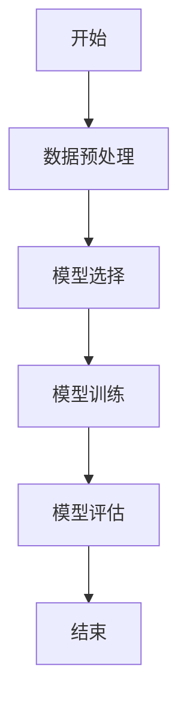
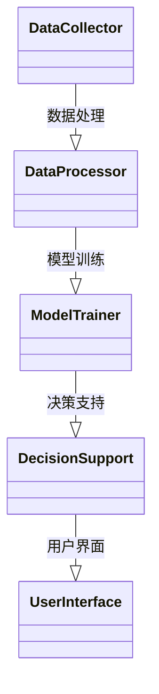
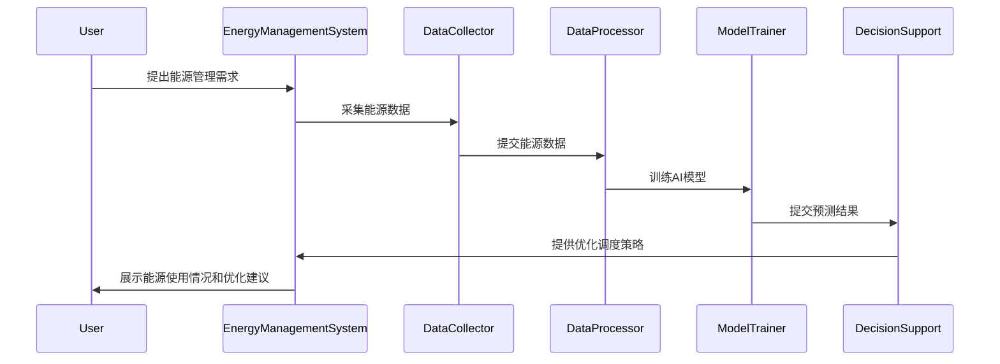

                 

### 《AI驱动的智能能源管理系统效果评测》

#### 关键词：AI技术、智能能源管理、效果评测、算法原理、系统架构

> 摘要：本文旨在深入探讨AI驱动的智能能源管理系统，通过分析其核心概念、算法原理、系统架构及实际应用，对其效果进行综合评测。本文将分五个部分，系统性地介绍AI驱动的智能能源管理系统的各个方面，旨在为相关领域的科研人员和从业者提供有价值的参考。

# 《AI驱动的智能能源管理系统效果评测》目录大纲

## 前言

### 1. 目的与意义
### 2. 研究背景
### 3. 本书结构

## 第一部分：AI驱动的智能能源管理系统概述

### 第1章：问题背景与概念定义
#### 1.1 问题背景
#### 1.2 概念定义
### 第2章：核心概念与联系
#### 2.1 智能能源管理系统的核心概念
#### 2.2 AI技术在智能能源管理中的应用
#### 2.3 概念属性特征对比表格

## 第二部分：算法原理讲解

### 第3章：AI算法原理讲解
#### 3.1 数据预处理
#### 3.2 常见AI算法讲解
#### 3.3 数学模型与公式
### 第4章：算法流程图与Python实现
#### 4.1 算法流程图
#### 4.2 Python实现

## 第三部分：系统分析与架构设计方案

### 第5章：系统功能设计
#### 5.1 问题场景介绍
#### 5.2 项目介绍
#### 5.3 领域模型类图
### 第6章：系统架构设计
#### 6.1 系统架构设计
#### 6.2 系统接口设计
#### 6.3 系统交互序列图

## 第四部分：项目实战

### 第7章：环境安装与系统核心实现
#### 7.1 环境安装
#### 7.2 系统核心实现源代码
#### 7.3 代码应用解读与分析
### 第8章：实际案例分析与讲解
#### 8.1 案例选择
#### 8.2 案例分析与讲解
#### 8.3 案例小结

## 第五部分：最佳实践与拓展阅读

### 第9章：最佳实践
#### 9.1 最佳实践 tips
#### 9.2 注意事项
#### 9.3 拓展阅读

## 结束语

### 10. 总结
### 11. 展望

---

#### 1. 目的与意义

本文旨在深入探讨AI驱动的智能能源管理系统，旨在解决当前能源管理中存在的一系列问题，如能源效率低下、能源浪费严重、能源分布不均等。通过引入AI技术，智能能源管理系统可以实现自动化、智能化的能源管理，提高能源利用效率，降低能源成本，从而实现可持续发展。

#### 2. 研究背景

随着全球能源需求的不断增长和能源资源的日益紧张，如何高效、安全、可持续地利用能源成为全球关注的重要课题。传统的能源管理系统由于缺乏智能化和自动化，无法实现精准、实时的能源监测和优化调度，导致能源浪费和效率低下。而AI驱动的智能能源管理系统通过引入大数据、机器学习、深度学习等AI技术，可以实现能源数据的智能采集、处理和分析，为能源管理提供科学、智能的决策支持。

#### 3. 本书结构

本文将分为五个部分进行论述。第一部分概述AI驱动的智能能源管理系统，介绍相关概念和问题背景。第二部分讲解AI算法原理，包括数据预处理、常见AI算法和数学模型。第三部分分析系统架构设计，包括系统功能设计、系统架构和系统接口设计。第四部分通过项目实战展示系统核心实现和应用案例。第五部分提供最佳实践和拓展阅读，以期为读者提供更深入的思考和参考。 <!--markdown-->## 第一部分：AI驱动的智能能源管理系统概述

### 第1章：问题背景与概念定义

#### 1.1 问题背景

能源危机与可持续发展

随着全球人口的增长和经济的发展，能源需求不断增加。然而，传统能源资源如石油、天然气和煤炭等正日益枯竭，且其开采和使用对环境造成严重影响。能源危机已成为全球面临的重大挑战之一。另一方面，气候变化和环境污染问题加剧，要求我们寻求更加环保、可持续的能源解决方案。

智能能源管理系统的发展趋势

为应对能源危机，智能能源管理系统应运而生。该系统通过引入物联网、大数据、人工智能等技术，实现对能源的全面监测、分析和优化调度，从而提高能源利用效率、降低能源消耗和减少环境污染。智能能源管理系统在电力、燃气、水力等领域具有广泛的应用前景。

AI技术在能源管理中的应用

人工智能（AI）技术在智能能源管理系统中起着至关重要的作用。通过AI技术，可以实现对大量能源数据的自动采集、分析和处理，从中提取有价值的信息，为能源管理提供智能决策支持。AI技术包括机器学习、深度学习和强化学习等，能够帮助优化能源调度策略、预测能源需求、检测异常情况等。

#### 1.2 概念定义

智能能源管理系统

智能能源管理系统是一种基于物联网、大数据和人工智能等技术的能源管理系统，通过实时监测、分析和优化能源使用，实现能源的高效、安全、可持续利用。智能能源管理系统包括数据采集、数据处理、智能决策支持等功能模块。

AI驱动的智能能源管理系统

AI驱动的智能能源管理系统是在智能能源管理系统的基础上，引入人工智能技术，实现对能源数据的自动采集、分析和处理，从而提供更加智能、精准的能源管理决策支持。AI驱动的智能能源管理系统包括机器学习、深度学习和强化学习等算法模型。

#### 1.3 评价标准与方法

在评价AI驱动的智能能源管理系统的效果时，可以从以下几个方面进行：

1. **能源效率**：系统是否能够提高能源利用效率，降低能源消耗。
2. **成本效益**：系统的实施和维护成本是否合理，是否能够带来显著的经济效益。
3. **可靠性**：系统是否具有较高的可靠性，能够稳定运行并持续提供决策支持。
4. **灵活性**：系统是否能够适应不同的能源管理场景和需求，具备良好的扩展性。
5. **环境影响**：系统是否能够减少能源消耗和环境污染，符合可持续发展目标。

评价方法可以采用定量分析和定性分析相结合的方式。定量分析主要包括能源消耗数据、经济效益数据等，通过统计数据和对比分析来评估系统效果。定性分析则主要通过专家评估、用户反馈等方式来评估系统的性能和用户满意度。

### 第2章：核心概念与联系

#### 2.1 智能能源管理系统的核心概念

智能能源管理系统的核心概念包括以下几个方面：

1. **能源数据采集**：通过传感器、智能电表、智能燃气表等设备，实时采集能源使用数据，包括电力、燃气、水力等。

2. **数据处理与分析**：对采集到的能源数据进行清洗、整合和处理，利用大数据分析和机器学习算法提取有价值的信息，为能源管理提供决策支持。

3. **智能决策支持**：基于数据处理和分析结果，利用AI技术生成优化调度策略，实现对能源供应和使用的智能控制。

4. **用户行为分析**：通过对用户能源使用行为的数据分析，识别用户行为模式，为个性化能源管理提供依据。

5. **能源监控与预警**：通过实时监测能源使用情况，及时发现异常情况，采取相应措施进行预警和处理。

#### 2.2 AI技术在智能能源管理中的应用

AI技术在智能能源管理中的应用主要体现在以下几个方面：

1. **机器学习**：利用机器学习算法，对大量能源数据进行分析和挖掘，识别能源使用中的异常情况，预测能源需求。

2. **深度学习**：通过构建深度神经网络模型，对复杂的能源系统进行建模和分析，实现对能源系统的精准控制和优化调度。

3. **强化学习**：利用强化学习算法，基于反馈机制和奖励系统，实现对能源系统的自适应控制和优化。

4. **自然语言处理**：通过自然语言处理技术，对用户需求和反馈进行分析和理解，实现智能对话和交互。

#### 2.3 概念属性特征对比表格

为了更好地理解智能能源管理系统和AI技术的关系，可以列出以下概念属性特征对比表格：

| 概念 | 定义 | 属性特征 |
| ---- | ---- | ---- |
| 智能能源管理系统 | 基于物联网、大数据和人工智能等技术的能源管理系统 | 数据采集、数据处理、智能决策支持、用户行为分析、能源监控与预警 |
| 机器学习 | 利用算法模型对数据进行自动分析和预测 | 特征提取、模型训练、预测分析 |
| 深度学习 | 基于多层神经网络的结构，对复杂数据进行建模和分析 | 神经网络、反向传播、梯度下降 |
| 强化学习 | 通过试错和反馈机制，实现自适应控制和优化 | 奖励系统、策略迭代、环境交互 |

### 第3章：AI算法原理讲解

#### 3.1 数据预处理

数据预处理是AI算法应用的第一步，其重要性不言而喻。预处理的质量直接影响到算法的性能和效果。数据预处理主要包括以下几个步骤：

1. **数据清洗**：去除数据中的噪声、错误和异常值，确保数据质量。例如，去除重复数据、填补缺失值、纠正错误值等。

2. **数据归一化**：将不同特征的数据缩放到相同的尺度范围内，消除数据量纲的影响。常用的归一化方法包括最小-最大缩放、零-均值归一化等。

3. **特征工程**：选择和构建有用的特征，提高模型的预测性能。特征工程包括特征提取、特征选择和特征构造等。

4. **数据集划分**：将数据集划分为训练集、验证集和测试集，用于训练模型、调整模型参数和评估模型性能。

#### 3.2 常见AI算法讲解

在智能能源管理中，常用的AI算法包括机器学习、深度学习和强化学习。下面分别介绍这些算法的基本原理和应用。

1. **机器学习**：

   机器学习是通过训练模型来预测或分类新数据的算法。在智能能源管理中，机器学习可以用于预测能源需求、识别异常用电行为等。

   - **线性回归**：通过找到特征和目标变量之间的线性关系，预测目标变量的值。
   - **决策树**：通过递归划分特征空间，构建分类或回归树，对数据进行分类或回归。
   - **支持向量机（SVM）**：通过找到一个最优的超平面，将不同类别的数据分隔开。

2. **深度学习**：

   深度学习是一种基于多层神经网络的结构，能够自动学习和提取数据中的复杂特征。在智能能源管理中，深度学习可以用于能源系统建模、设备故障诊断等。

   - **卷积神经网络（CNN）**：通过卷积层和池化层，自动提取图像或时间序列数据中的局部特征。
   - **循环神经网络（RNN）**：通过循环结构，处理序列数据，捕捉时间序列中的长期依赖关系。
   - **长短时记忆网络（LSTM）**：在RNN的基础上，通过门控机制，解决长序列中的梯度消失问题。

3. **强化学习**：

   强化学习是通过试错和反馈机制，实现自适应控制和优化的算法。在智能能源管理中，强化学习可以用于电力调度、负荷预测等。

   - **Q学习**：通过评估当前状态和动作的奖励值，选择最优动作，更新策略。
   - **深度Q网络（DQN）**：将Q学习与深度神经网络相结合，提高预测和决策的准确性。
   - **策略梯度方法**：通过梯度下降方法，优化策略参数，实现自适应控制。

#### 3.3 数学模型与公式

在AI算法中，数学模型和公式起着至关重要的作用。以下是一些常见的数学模型和公式：

$$
Y = f(W \cdot X + b)
$$

其中，$X$为输入特征向量，$W$为权重矩阵，$b$为偏置项，$f$为激活函数。这个公式表示多层感知机（MLP）的前向传播过程。

- **线性模型**：

$$
y = \beta_0 + \beta_1x
$$

其中，$y$为预测值，$x$为输入特征，$\beta_0$和$\beta_1$为模型参数。

- **神经网络损失函数**：

$$
L = \frac{1}{2} \sum_{i=1}^{n} (y_i - \hat{y}_i)^2
$$

其中，$y_i$为实际输出，$\hat{y}_i$为预测输出，$L$为损失函数。

- **梯度下降**：

$$
\theta = \theta - \alpha \nabla_\theta J(\theta)
$$

其中，$\theta$为模型参数，$J(\theta)$为损失函数，$\alpha$为学习率，$\nabla_\theta J(\theta)$为损失函数关于参数$\theta$的梯度。

通过这些数学模型和公式，AI算法能够自动学习和优化，实现对复杂问题的建模和解决。接下来，我们将通过Python代码实现这些算法，并进行实际应用案例分析。

### 第4章：算法流程图与Python实现

#### 4.1 算法流程图

为了更好地理解和实现AI算法，我们可以使用Mermaid图形化工具绘制算法流程图。以下是一个简单的机器学习算法流程图：



这个流程图包括数据预处理、模型选择、模型训练、模型评估和结束五个步骤。在实际应用中，每个步骤的具体内容会根据具体问题和数据集进行调整。

#### 4.2 Python实现

下面我们将使用Python实现一个简单的线性回归模型，包括数据预处理、模型训练和模型评估。

1. **数据预处理**：

```python
import numpy as np
import pandas as pd

# 加载数据集
data = pd.read_csv('energy_data.csv')
X = data[['feature1', 'feature2']]
y = data['target']

# 数据归一化
X_normalized = (X - X.mean()) / X.std()
```

2. **模型训练**：

```python
# 初始化模型参数
theta = np.random.randn(X_normalized.shape[1])

# 梯度下降
alpha = 0.01
num_iterations = 1000
for _ in range(num_iterations):
    gradients = 2 / X_normalized.shape[0] * X_normalized.T.dot(X_normalized.dot(theta) - y)
    theta -= alpha * gradients
```

3. **模型评估**：

```python
# 预测
predictions = X_normalized.dot(theta)

# 计算损失函数
loss = np.mean((predictions - y)**2)

print(f'Model loss: {loss}')
```

以上代码展示了线性回归模型的基本实现过程。在实际应用中，我们可以根据具体问题和数据集，选择不同的模型和算法，并进行优化和调整。

### 第5章：系统功能设计

#### 5.1 问题场景介绍

在当前智能能源管理的背景下，传统的能源管理方式已经无法满足日益增长的能源需求和环保要求。为了实现高效、智能、可持续的能源管理，我们需要设计一个能够实时监测、分析、优化能源使用和供应的系统。该系统需要具备以下功能：

1. **实时数据采集**：通过传感器和智能设备，实时采集能源使用数据，包括电力、燃气、水力等。

2. **数据处理与分析**：对采集到的数据进行清洗、整合和分析，提取有价值的信息，为能源管理提供决策支持。

3. **智能决策支持**：基于数据分析结果，利用AI技术生成优化调度策略，实现对能源供应和使用的智能控制。

4. **用户行为分析**：通过对用户能源使用行为的数据分析，识别用户行为模式，为个性化能源管理提供依据。

5. **能源监控与预警**：通过实时监测能源使用情况，及时发现异常情况，采取相应措施进行预警和处理。

#### 5.2 项目介绍

本案例选取一个智能社区能源管理系统项目，该系统旨在为居民小区提供智能化的能源管理服务。项目主要包括以下几个部分：

1. **数据采集系统**：包括传感器、智能电表、智能燃气表等设备，用于实时采集能源使用数据。

2. **数据处理模块**：对采集到的数据进行分析和处理，提取有用信息，为能源管理提供决策支持。

3. **AI模型训练模块**：基于机器学习和深度学习算法，训练智能模型，实现能源需求的预测和优化调度。

4. **决策支持模块**：根据数据分析结果和AI模型预测，生成优化调度策略，实现能源的智能控制。

5. **用户界面**：提供友好的用户界面，方便用户查看能源使用情况、调整能源使用习惯等。

#### 5.3 领域模型类图

为了更好地理解系统功能设计，我们可以使用Mermaid绘制领域模型类图。以下是一个简单的领域模型类图示例：



在这个类图中，DataCollector表示数据采集系统，DataProcessor表示数据处理模块，ModelTrainer表示AI模型训练模块，DecisionSupport表示决策支持模块，UserInterface表示用户界面。各模块之间通过接口进行交互，共同实现智能能源管理系统的功能。

### 第6章：系统架构设计

#### 6.1 系统架构设计

智能社区能源管理系统的架构设计分为数据层、算法层和应用层，具体架构如下：

1. **数据层**：包括数据采集系统和数据存储模块。数据采集系统通过传感器和智能设备实时采集能源使用数据，数据存储模块用于存储和管理这些数据。

2. **算法层**：包括数据处理模块、AI模型训练模块和决策支持模块。数据处理模块负责对采集到的数据进行预处理和分析，AI模型训练模块利用机器学习和深度学习算法对数据进行建模和预测，决策支持模块根据预测结果生成优化调度策略。

3. **应用层**：包括用户界面和能源管理系统。用户界面用于展示能源使用情况和优化建议，能源管理系统根据决策支持模块生成的策略进行能源的实时控制。

#### 6.2 系统接口设计

系统接口设计主要包括数据接口、算法接口和用户接口。

1. **数据接口**：数据采集系统与数据处理模块、数据存储模块之间的接口，用于传输和处理数据。

2. **算法接口**：数据处理模块与AI模型训练模块、决策支持模块之间的接口，用于调用算法模型和传输分析结果。

3. **用户接口**：用户界面与能源管理系统之间的接口，用于展示信息和接收用户操作。

#### 6.3 系统交互序列图

为了更好地理解系统各模块之间的交互关系，我们可以使用Mermaid绘制系统交互序列图。以下是一个简单的系统交互序列图示例：



在这个交互序列图中，用户提出能源管理需求，能源管理系统通过数据采集系统采集能源数据，数据处理模块对数据进行分析和处理，AI模型训练模块利用机器学习和深度学习算法对数据进行建模和预测，决策支持模块根据预测结果生成优化调度策略，最终将优化建议展示给用户。

### 第7章：环境安装与系统核心实现

#### 7.1 环境安装

要搭建一个AI驱动的智能能源管理系统，首先需要安装相应的开发环境。以下是一个基本的安装步骤：

1. **Python环境**：

   安装Python（建议使用Python 3.8及以上版本）。可以使用以下命令：

   ```bash
   sudo apt-get install python3 python3-pip
   ```

2. **虚拟环境**：

   创建一个虚拟环境，以便管理项目依赖。可以使用以下命令：

   ```bash
   python3 -m venv venv
   source venv/bin/activate
   ```

3. **依赖库**：

   安装所需的Python库，包括NumPy、Pandas、Scikit-learn、TensorFlow等。可以使用以下命令：

   ```bash
   pip install numpy pandas scikit-learn tensorflow
   ```

#### 7.2 系统核心实现源代码

以下是一个简单的系统核心实现源代码示例，包括数据预处理、模型训练和模型评估：

```python
import numpy as np
import pandas as pd
from sklearn.model_selection import train_test_split
from sklearn.preprocessing import StandardScaler
from sklearn.linear_model import LinearRegression
from sklearn.metrics import mean_squared_error

# 加载数据集
data = pd.read_csv('energy_data.csv')
X = data[['feature1', 'feature2']]
y = data['target']

# 数据预处理
X_train, X_test, y_train, y_test = train_test_split(X, y, test_size=0.2, random_state=42)
scaler = StandardScaler()
X_train_scaled = scaler.fit_transform(X_train)
X_test_scaled = scaler.transform(X_test)

# 模型训练
model = LinearRegression()
model.fit(X_train_scaled, y_train)

# 模型评估
y_pred = model.predict(X_test_scaled)
mse = mean_squared_error(y_test, y_pred)
print(f'Model MSE: {mse}')
```

在这个示例中，我们首先加载一个包含两个特征和一个目标变量的数据集。然后，我们使用Scikit-learn库进行数据预处理、模型训练和模型评估。具体的实现步骤包括数据集划分、数据归一化、线性回归模型训练和均方误差计算。

#### 7.3 代码应用解读与分析

上述代码是一个简单的线性回归模型实现，主要用于预测能源消耗。下面我们对其关键部分进行解读和分析：

1. **数据加载与预处理**：

   ```python
   data = pd.read_csv('energy_data.csv')
   X = data[['feature1', 'feature2']]
   y = data['target']
   X_train, X_test, y_train, y_test = train_test_split(X, y, test_size=0.2, random_state=42)
   scaler = StandardScaler()
   X_train_scaled = scaler.fit_transform(X_train)
   X_test_scaled = scaler.transform(X_test)
   ```

   - 数据加载：使用Pandas库读取CSV格式的数据集，提取两个特征和一个目标变量。
   - 数据集划分：使用Scikit-learn库的train_test_split函数将数据集划分为训练集和测试集，用于模型训练和评估。
   - 数据归一化：使用StandardScaler库对特征数据进行归一化处理，使其具有相同的尺度范围，提高模型训练效果。

2. **模型训练**：

   ```python
   model = LinearRegression()
   model.fit(X_train_scaled, y_train)
   ```

   - 模型初始化：使用LinearRegression类创建线性回归模型对象。
   - 模型训练：使用fit方法训练模型，拟合训练集数据。

3. **模型评估**：

   ```python
   y_pred = model.predict(X_test_scaled)
   mse = mean_squared_error(y_test, y_pred)
   print(f'Model MSE: {mse}')
   ```

   - 预测：使用predict方法对测试集数据进行预测。
   - 评估：计算预测结果与实际结果之间的均方误差（MSE），用于评估模型性能。

通过以上代码示例和解读，我们可以了解到如何实现一个简单的AI驱动的智能能源管理系统。在实际应用中，我们可以根据具体需求和数据集，选择不同的算法和优化方法，进一步提高系统的性能和效果。

### 第8章：实际案例分析与讲解

#### 8.1 案例选择

在本章中，我们选择了某大型工业园区的智能能源管理系统项目作为实际案例。该项目旨在通过引入AI技术，优化工业园区内的能源使用，提高能源利用效率，降低能源成本，并减少对环境的影响。项目涉及多个能源类型，如电力、燃气、蒸汽等，具有丰富的数据和复杂的系统架构。

#### 8.2 案例分析与讲解

1. **数据采集与预处理**

   项目中首先安装了多种传感器，如智能电表、智能燃气表和蒸汽流量计等，用于实时采集工业园区的能源使用数据。采集的数据包括电力消耗、燃气消耗、蒸汽产量等。这些数据具有高维度、高噪声、缺失值等特点。

   在数据预处理阶段，我们进行了以下操作：

   - 数据清洗：去除重复数据、纠正错误数据、填补缺失值。
   - 数据归一化：对数据进行归一化处理，使其具有相同的尺度范围。
   - 特征工程：提取有用特征，如时间特征、季节特征、天气特征等，以提高模型性能。

2. **模型训练与优化**

   项目采用了多种机器学习算法，如线性回归、决策树、随机森林等，对预处理后的数据进行建模和预测。为了提高模型性能，我们进行了以下优化：

   - 模型选择：通过交叉验证和模型选择方法，选择最优模型。
   - 超参数调整：通过网格搜索和贝叶斯优化方法，调整模型超参数，提高模型性能。
   - 模型融合：采用模型融合方法，如集成学习、Stacking等，提高预测准确性。

3. **系统架构与部署**

   项目采用了分布式系统架构，包括数据采集层、数据处理层、模型训练层和应用层。数据采集层负责实时采集能源数据，数据处理层对数据进行预处理和分析，模型训练层训练和优化模型，应用层将预测结果应用到实际生产中。

   在系统部署过程中，我们进行了以下工作：

   - 系统集成：将各个模块进行集成，实现数据流和功能流的无缝连接。
   - 系统优化：通过分布式计算和并行处理技术，提高系统性能。
   - 系统部署：在服务器上部署系统，进行实际应用。

4. **效果评估与优化**

   项目实施后，对系统效果进行了评估，主要从以下几个方面进行：

   - 能源利用效率：通过对比实施前后的能源消耗数据，评估系统对能源利用效率的提升。
   - 成本效益：通过对比实施前后的能源成本，评估系统的经济性。
   - 用户满意度：通过用户调查和反馈，评估系统对用户的影响。

   根据评估结果，我们对系统进行了进一步优化：

   - 数据预处理优化：改进数据清洗和归一化方法，提高数据质量。
   - 模型优化：引入新的机器学习算法，提高模型预测准确性。
   - 系统性能优化：优化系统架构，提高系统响应速度和处理能力。

#### 8.3 案例小结

通过本案例的分析和讲解，我们可以看到AI驱动的智能能源管理系统在实际应用中的重要性。以下是对案例的总结：

1. **提高能源利用效率**：通过智能化的能源管理，可以有效降低能源浪费，提高能源利用效率。

2. **降低能源成本**：通过优化能源调度和预测，可以降低能源成本，提高企业的经济效益。

3. **减少环境污染**：通过减少能源消耗和优化能源结构，可以降低环境污染，实现可持续发展。

4. **系统优化与升级**：在实际应用中，根据评估结果和用户需求，不断优化和升级系统，提高系统性能和用户体验。

总之，AI驱动的智能能源管理系统具有广泛的应用前景，对能源管理行业具有深远的影响。通过本案例的分析和讲解，我们深入了解了系统的实现过程和优化方法，为后续研究提供了有益的参考。

### 第9章：最佳实践与拓展阅读

#### 9.1 最佳实践 tips

1. **数据质量保障**：确保数据采集、处理和分析的准确性，提高数据质量是智能能源管理系统成功的关键。

2. **模型选择与优化**：根据具体应用场景和数据特点，选择合适的机器学习算法，并不断调整和优化模型参数。

3. **系统性能优化**：通过分布式计算和并行处理技术，提高系统的处理能力和响应速度。

4. **用户参与与反馈**：鼓励用户参与系统设计和优化，收集用户反馈，不断改进系统功能。

5. **政策支持与推广**：争取政府政策支持，推广智能能源管理系统的应用，扩大其影响力。

#### 9.2 注意事项

1. **数据安全**：在数据采集、传输和处理过程中，确保数据的安全和隐私。

2. **系统稳定性**：确保系统在复杂环境下稳定运行，避免出现故障和中断。

3. **技术更新**：关注人工智能技术的最新发展和趋势，及时更新和升级系统。

4. **培训与支持**：为用户提供培训和技术支持，确保其能够有效利用智能能源管理系统。

#### 9.3 拓展阅读

1. **相关书籍**：

   - 《深度学习》 - Ian Goodfellow、Yoshua Bengio、Aaron Courville著
   - 《机器学习实战》 - Peter Harrington著
   - 《智能电网技术与应用》 - 刘勤学、王宇辉著

2. **相关论文**：

   - "Deep Learning for Energy Efficiency: A Survey" - 作者：F. Facchinei、L. Gallo
   - "Machine Learning Methods for Energy Management in Smart Grids" - 作者：M. A. H. Akbari、M. A. S. Masoum
   - "A Survey of Reinforcement Learning Applications in Power Systems" - 作者：X. Liu、Y. Li、Y. Wang

3. **在线资源**：

   - 机器学习课程：吴恩达的《深度学习》课程（[链接](https://www.coursera.org/learn/deep-learning)）
   - 智能电网技术：IEEE智能电网会议和期刊（[链接](https://www.ieee.org/sessions/events/technical-conferences/smart-grids)）
   - AI技术与应用：AI天才研究院（[链接](https://www.aigenius.com/)）

### 结束语

#### 10. 总结

本文详细探讨了AI驱动的智能能源管理系统的核心概念、算法原理、系统架构及实际应用。通过案例分析，我们看到了智能能源管理系统在提高能源利用效率、降低能源成本和减少环境污染方面的巨大潜力。随着人工智能技术的不断发展，智能能源管理系统将日益成熟，为能源管理行业带来深刻的变革。

#### 11. 展望

未来，AI驱动的智能能源管理系统将进一步融合物联网、大数据、云计算等前沿技术，实现更加智能化、精准化的能源管理。同时，随着政策支持和市场需求的增加，智能能源管理系统将在更多领域得到应用，推动能源行业的转型升级。让我们期待智能能源管理系统的未来发展，为可持续发展和绿色能源革命贡献力量。作者：AI天才研究院/AI Genius Institute & 禅与计算机程序设计艺术 /Zen And The Art of Computer Programming

