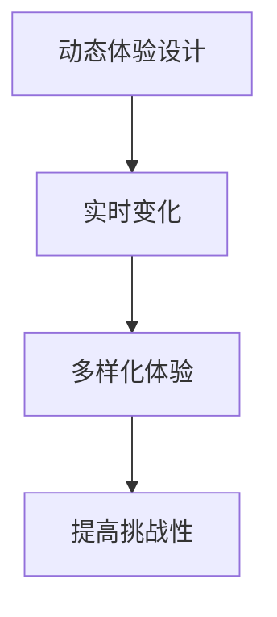
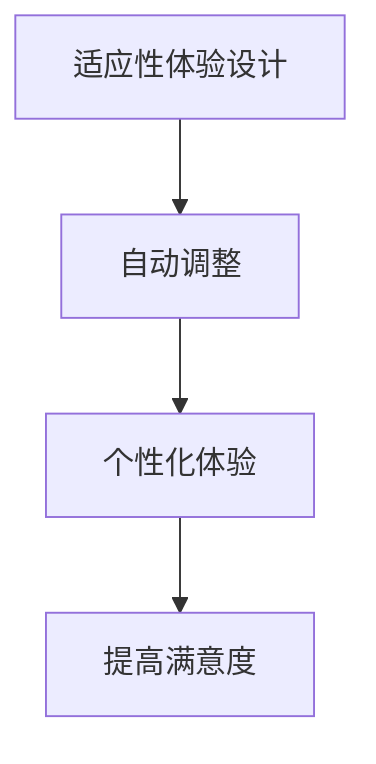
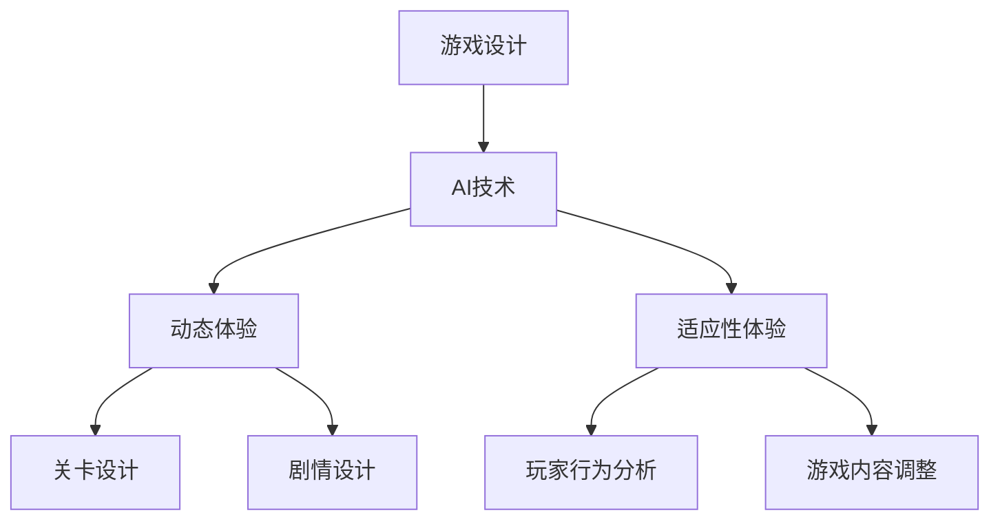
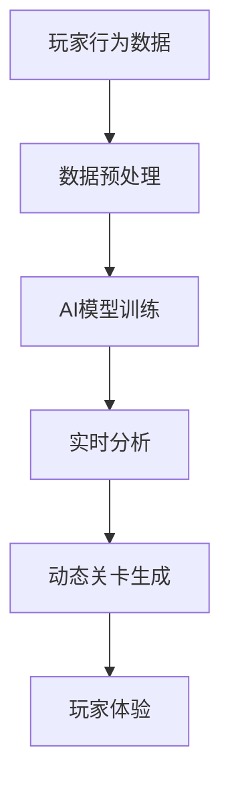
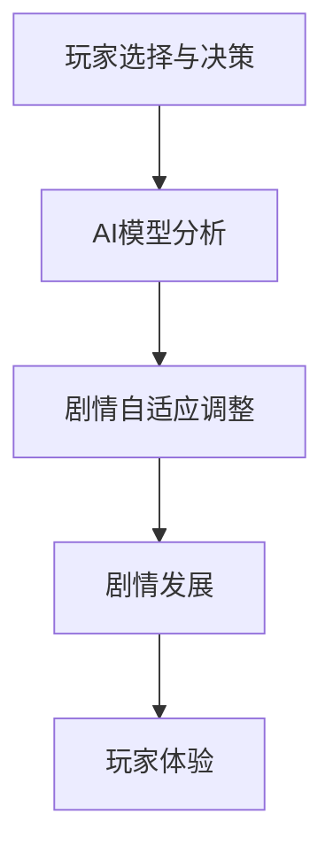
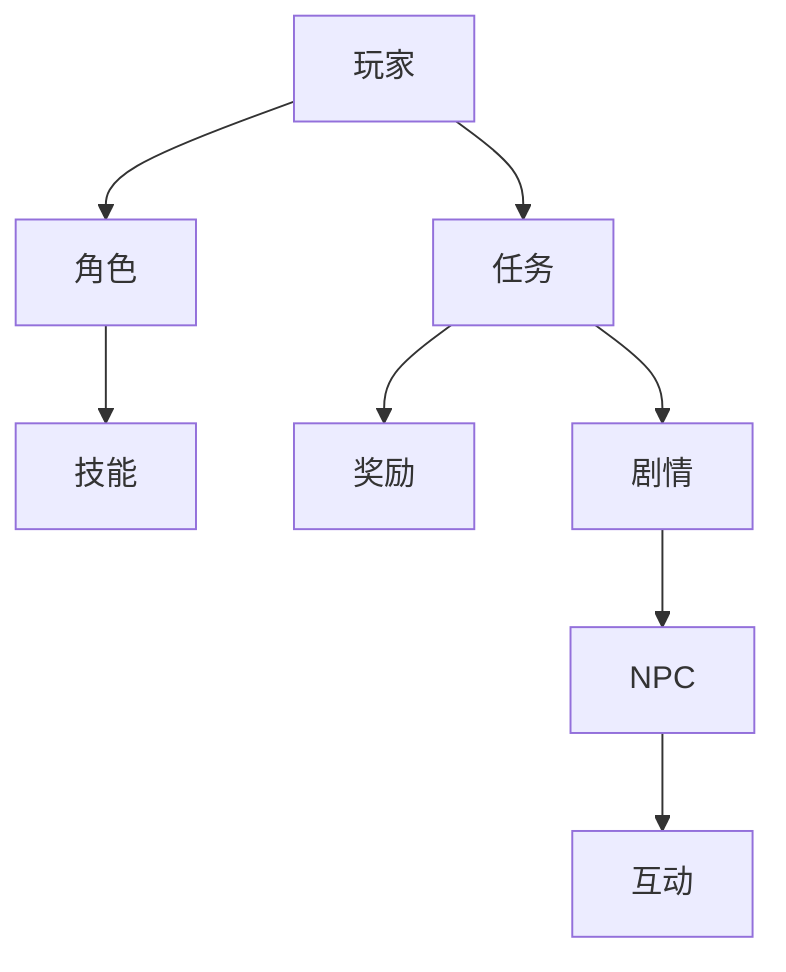
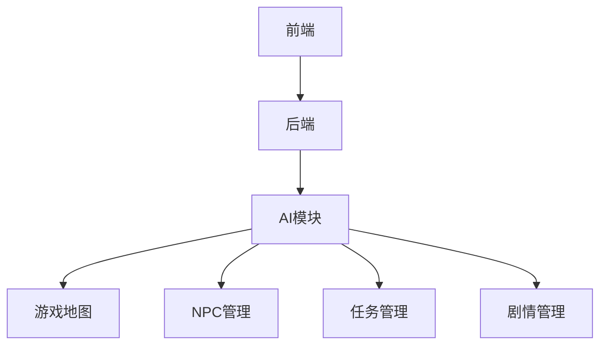
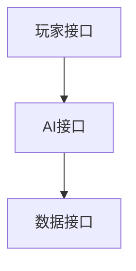

                 


## 1. 引言

### 1.1 游戏设计与AI的关系

#### 1.1.1 AI在游戏设计中的角色

随着科技的迅猛发展，人工智能（AI）已经渗透到我们生活的方方面面，从智能家居到自动驾驶，从语音助手到推荐系统，无不彰显着AI的强大力量。在游戏设计领域，AI同样发挥着至关重要的作用。首先，AI能够模拟复杂的游戏行为，为玩家提供更为真实、多样化的体验。其次，AI可以分析玩家的行为和偏好，进而为玩家提供个性化的游戏内容。此外，AI还在游戏开发过程中，如剧情编写、关卡设计等方面提供了强大的辅助功能。

#### 1.1.2 AI如何增强游戏体验

AI在游戏体验中的增强主要体现在以下几个方面：

1. **个性化推荐**：通过分析玩家的历史行为和偏好，AI能够为玩家推荐最适合他们的游戏内容和玩法。

2. **智能对手**：在多人游戏中，AI能够充当各种难度和风格的对手，提高游戏的挑战性和趣味性。

3. **自适应游戏剧情**：AI可以根据玩家的选择和行为，实时调整游戏剧情，为每个玩家创造独一无二的体验。

4. **动态关卡设计**：AI可以根据玩家的游戏进度和技能水平，动态生成难度适中的关卡，确保游戏的乐趣和挑战性。

### 1.2 动态与适应性体验的重要性

#### 1.2.1 动态体验对游戏设计的意义

动态体验是指在游戏过程中，游戏元素（如关卡、剧情、对手等）能够根据玩家的行为实时发生变化。动态体验的核心在于，它能够提供无限的探索和挑战，让玩家始终感到新鲜和兴奋。例如，一个动态生成的关卡，会根据玩家的游戏进度不断变化，使得每次游戏都有不同的体验。

#### 1.2.2 适应性体验如何提升游戏质量

适应性体验是指游戏能够根据玩家的行为和偏好，自动调整游戏难度和内容，以提供最佳的游戏体验。适应性体验的关键在于，它能够确保每个玩家都能在游戏中找到自己的乐趣，无论是新手还是高手。例如，一个适应性剧情，会根据玩家的选择和决策，实时调整后续剧情的发展方向。

### 1.3 本书的目标与结构

本书旨在探讨AI驱动的游戏设计，如何通过动态和适应性体验，提升游戏的质量和玩家的满意度。我们将从以下几个部分进行详细探讨：

1. **AI驱动的游戏设计基础**：介绍AI在游戏设计中的应用，以及AI的核心概念。

2. **AI驱动的游戏设计核心概念**：探讨AI在游戏设计中的核心作用，以及动态和适应性体验的设计原理。

3. **AI驱动的游戏设计工具与平台**：介绍常见的AI工具和平台，以及如何将它们应用于游戏设计。

4. **AI驱动的游戏设计案例研究**：通过具体的案例，展示AI在游戏设计中的实际应用。

5. **AI驱动的游戏设计数学模型**：介绍用于动态和适应性体验设计的数学模型，并进行分析。

6. **AI驱动的游戏设计项目实战**：通过一个实际项目，展示AI驱动的游戏设计的具体实现。

7. **未来展望与最佳实践**：讨论AI驱动的游戏设计的未来趋势，以及最佳实践。

通过本书的阅读，您将了解到如何运用AI技术，设计出更具动态性和适应性的游戏，为玩家带来全新的游戏体验。

## 2. 游戏设计与AI基础

### 2.1 AI在游戏设计中的应用

#### 2.1.1 模拟复杂行为

在游戏设计中，AI被广泛应用于模拟复杂的行为，例如智能对手的行为、NPC（非玩家角色）的行为等。这些行为可以通过算法来模拟，使得游戏更具挑战性和真实感。例如，在战斗游戏中，AI可以模拟敌人的攻击模式、逃跑策略等，使得每次战斗都充满不确定性。

#### 2.1.2 分析玩家行为

AI还可以分析玩家的行为，从而更好地理解玩家的偏好和需求。通过这种行为分析，游戏设计师可以优化游戏内容，提高玩家的满意度。例如，某些游戏会根据玩家的行为，自动调整游戏难度，使得新手玩家不会感到挫败，而高手玩家也不会感到无聊。

#### 2.1.3 动态内容生成

AI还可以用于动态内容生成，例如动态关卡设计、自适应剧情等。通过AI，游戏可以实时生成新的关卡和剧情，为玩家提供无限的可能性。这种动态内容生成，不仅增加了游戏的趣味性，还提高了玩家的参与度。

### 2.2 AI核心概念简介

#### 2.2.1 机器学习

机器学习是AI的核心技术之一，它使计算机能够从数据中学习，并做出预测或决策。在游戏设计中，机器学习可以用于分析玩家行为，预测玩家偏好，从而优化游戏内容。

#### 2.2.2 深度学习

深度学习是机器学习的一个子领域，它通过多层神经网络来模拟人脑的决策过程。在游戏设计中，深度学习可以用于模拟复杂的行为，如智能对手的行为。

#### 2.2.3 强化学习

强化学习是一种通过奖励机制来训练AI的技术。在游戏设计中，强化学习可以用于训练智能对手，使其行为更加符合玩家的期望。

### 2.3 游戏设计与AI的融合挑战与机遇

#### 2.3.1 挑战

虽然AI在游戏设计中有许多应用，但是也存在一些挑战。首先，AI模型的训练需要大量的数据和计算资源，这在某些情况下可能难以实现。其次，AI的行为可能无法完全预测，可能导致游戏出现不稳定的状况。此外，如何平衡AI的复杂性和游戏的可玩性，也是游戏设计师需要考虑的问题。

#### 2.3.2 机遇

尽管存在挑战，但是AI在游戏设计中也带来了许多机遇。首先，AI可以大大提高游戏设计的效率，使得设计师能够更快地开发出高质量的游戏。其次，AI可以创造全新的游戏体验，满足玩家的多样化需求。此外，随着技术的进步，AI的复杂性和性能也在不断提高，为游戏设计提供了更多的可能性。

### 2.4 小结

在本节中，我们介绍了AI在游戏设计中的应用，以及AI的核心概念。通过这些内容，我们可以看到AI在游戏设计中的巨大潜力。在接下来的章节中，我们将进一步探讨AI驱动的游戏设计的核心概念和实现方法。

---

以上是第一部分和第二部分的初步内容，接下来我们将继续探讨AI驱动的游戏设计的核心概念、工具与平台、案例研究、数学模型以及项目实战等内容。让我们一起深入探索AI在游戏设计中的无限可能。让我们一步一步地思考，从理论到实践，共同揭开AI驱动的游戏设计的神秘面纱。**接下来，我们将深入探讨AI驱动的游戏设计核心概念。**

---

## 3. AI驱动的游戏设计原理

### 3.1 AI在游戏设计中的核心作用

AI在游戏设计中的核心作用主要体现在以下几个方面：

1. **提升游戏的可玩性**：通过AI，游戏可以提供更加智能和多样化的游戏体验，使得游戏更加有趣和挑战性。

2. **增强游戏的真实感**：AI可以模拟现实世界中的复杂行为，使得游戏中的角色和场景更加逼真，提高玩家的沉浸感。

3. **优化游戏平衡性**：AI可以根据玩家的行为和技能水平，自动调整游戏难度，确保每个玩家都能在游戏中找到适合自己的挑战。

4. **提高游戏效率**：AI可以帮助游戏设计师快速生成游戏内容，如关卡、剧情等，提高游戏开发的效率。

### 3.2 动态与适应性体验设计原理

#### 3.2.1 动态体验设计

动态体验设计是指游戏中的各种元素（如关卡、剧情、对手等）能够根据玩家的行为实时发生变化。这种设计原理能够提供无限的可能性，使得每次游戏都有不同的体验。例如，一个动态生成的关卡可以根据玩家的游戏进度和技能水平，不断调整难度，确保游戏的乐趣和挑战性。

**原理图：**



**示例：** 在一个动作游戏中，AI可以根据玩家的技能水平和战斗策略，实时调整敌人的攻击模式和防御策略，使得每次战斗都有不同的体验。

#### 3.2.2 适应性体验设计

适应性体验设计是指游戏能够根据玩家的行为和偏好，自动调整游戏内容，以提供最佳的游戏体验。这种设计原理能够确保每个玩家都能在游戏中找到自己的乐趣。例如，一个适应性剧情可以根据玩家的选择和决策，实时调整后续剧情的发展方向。

**原理图：**



**示例：** 在一个角色扮演游戏中，AI可以根据玩家的战斗风格和故事偏好，自动调整敌人和剧情的发展，使得每个玩家都能体验到独特的游戏故事。

### 3.3 游戏设计与AI融合的ER实体关系图

为了更好地理解游戏设计与AI的融合原理，我们可以使用实体关系图（ER图）来描述它们之间的关系。

**ER图：**



**解释：**

- **A[游戏设计]**：代表整个游戏的设计过程，包括关卡、剧情等。
- **B[AI技术]**：代表人工智能技术，是游戏设计的重要工具。
- **C[动态体验]**：代表动态体验设计原理，包括关卡和剧情的动态调整。
- **D[适应性体验]**：代表适应性体验设计原理，包括根据玩家行为调整游戏内容。
- **E[关卡设计]**：代表游戏中的关卡设计，可以根据玩家行为动态调整。
- **F[剧情设计]**：代表游戏中的剧情设计，可以根据玩家选择动态调整。
- **G[玩家行为分析]**：代表AI对玩家行为的分析，用于适应性体验设计。
- **H[游戏内容调整]**：代表根据玩家行为调整游戏内容，提供最佳体验。

通过ER图，我们可以清晰地看到游戏设计与AI融合的原理和关系，为后续的讨论提供了基础。

### 3.4 小结

在本节中，我们介绍了AI驱动的游戏设计原理，包括AI在游戏设计中的核心作用，以及动态和适应性体验的设计原理。通过这些原理，我们可以看到AI在游戏设计中的巨大潜力。在接下来的章节中，我们将继续探讨AI驱动的游戏设计工具与平台，以及具体的案例研究等内容。让我们一起深入探索AI驱动的游戏设计，创造更加动态和适应性的游戏体验。

---

在下一部分，我们将介绍AI驱动的游戏设计工具与平台，探讨如何选择和应用这些工具，以便更好地实现动态和适应性体验设计。让我们一起继续深入探索AI驱动的游戏设计的世界。**接下来，我们将介绍AI驱动的游戏设计工具与平台。**

---

## 4. AI驱动的游戏设计工具与平台

### 4.1 常见AI工具与平台介绍

在AI驱动的游戏设计中，有许多常见的工具和平台可供选择。以下是一些常用的工具和平台：

#### 4.1.1 TensorFlow

TensorFlow是由Google开发的一款开源机器学习框架，广泛应用于图像识别、自然语言处理和强化学习等领域。在游戏设计中，TensorFlow可以用于训练智能对手、生成动态关卡和剧情等。

#### 4.1.2 PyTorch

PyTorch是由Facebook开发的一款开源深度学习框架，具有直观的API和强大的灵活性。它适用于各种类型的机器学习任务，包括图像识别、语音识别和游戏设计等。

#### 4.1.3 Unity ML-Agents

Unity ML-Agents是一个基于Unity游戏引擎的开源机器学习平台，它允许开发者使用强化学习技术训练智能代理，应用于游戏中的各种任务，如智能对手、NPC行为等。

#### 4.1.4 Unreal Engine

Unreal Engine是由Epic Games开发的一款强大的游戏引擎，广泛应用于大型游戏和电影制作。它提供了丰富的AI工具和API，支持各种AI算法的应用，如动态关卡生成、剧情调整等。

### 4.2 游戏设计与AI工具的结合方式

#### 4.2.1 数据预处理

在游戏设计中，首先需要对游戏数据进行预处理，以便AI算法能够更好地训练。预处理步骤包括数据清洗、数据增强和数据标准化等。

#### 4.2.2 模型训练

接下来，使用选定的AI工具和平台，对预处理后的数据进行模型训练。训练过程中，需要不断调整模型参数，以获得最佳的训练效果。

#### 4.2.3 模型部署

模型训练完成后，需要将其部署到游戏引擎中。部署过程包括将模型代码集成到游戏引擎中，以及调整模型参数，使其适应游戏环境。

#### 4.2.4 实时调整

在游戏运行过程中，AI模型可以根据玩家的行为和游戏状态，实时调整游戏内容和难度，以提供最佳的游戏体验。

### 4.3 平台选择与评估

选择合适的AI工具和平台，对于实现AI驱动的游戏设计至关重要。以下是一些评估平台选择的标准：

#### 4.3.1 算法支持

选择平台时，需要考虑它是否支持所需的AI算法。例如，如果项目需要使用强化学习，则需要选择支持强化学习的平台。

#### 4.3.2 用户体验

平台的易用性也是选择的重要标准。一个良好的用户体验可以减少开发成本，提高开发效率。

#### 4.3.3 社区支持

强大的社区支持可以帮助开发者解决遇到的问题，加快开发进度。因此，选择具有活跃社区的平台也是重要的考虑因素。

#### 4.3.4 开发资源

评估平台时，还需要考虑其提供的开发资源，如文档、教程、示例代码等。这些资源可以帮助开发者更快地上手和实现项目。

### 4.4 小结

在本节中，我们介绍了常见的AI工具和平台，以及它们在游戏设计中的应用方式。通过这些工具和平台，开发者可以轻松实现AI驱动的游戏设计。在下一节中，我们将通过具体的案例研究，展示AI在游戏设计中的实际应用。让我们一起继续探索AI驱动的游戏设计，开启无限的创意空间。

---

在下一部分，我们将通过具体的案例研究，深入探讨AI驱动的游戏设计在实际中的应用。让我们通过实际案例，了解AI如何为游戏带来动态和适应性体验。**接下来，我们将通过具体的案例研究，展示AI在游戏设计中的实际应用。**

---

## 5. AI驱动的游戏设计案例研究

### 5.1 案例一：动态关卡设计

#### 5.1.1 案例背景

某款热门的开放世界游戏，为了提高玩家的游戏体验，决定引入AI驱动的动态关卡设计。该游戏的世界非常庞大，玩家可以在其中自由探索，游戏设计团队希望通过AI技术，为玩家提供更加多样化、挑战性且富有乐趣的关卡。

#### 5.1.2 设计方案

1. **数据收集**：首先，游戏设计团队收集了大量的游戏数据，包括玩家的行为、游戏进度、技能水平等。这些数据将用于训练AI模型。

2. **AI模型训练**：使用TensorFlow和PyTorch等AI工具，设计团队训练了多个AI模型，用于预测玩家在游戏中的行为和偏好。这些模型可以帮助AI动态生成关卡。

3. **动态关卡生成**：在游戏运行过程中，AI模型会实时分析玩家的行为，并根据玩家的游戏进度和技能水平，动态生成关卡。例如，如果玩家正在经历困难，AI会降低关卡难度，提供更多的帮助。

**流程图：**



4. **用户体验反馈**：为了确保动态关卡设计能够满足玩家的需求，设计团队定期收集玩家的反馈，并根据反馈进行调整。

#### 5.1.3 实施与结果

通过AI驱动的动态关卡设计，游戏成功地提高了玩家的游戏体验。玩家在游戏中不再面临一成不变的关卡，每次游戏都有不同的挑战和乐趣。此外，动态关卡设计还提高了游戏的挑战性，使得新手玩家不再感到挫败，而高手玩家也能找到足够的挑战。

### 5.2 案例二：适应性游戏剧情

#### 5.2.1 案例背景

另一款热门的角色扮演游戏，为了提供更加个性化的游戏体验，决定引入AI驱动的适应性游戏剧情。该游戏的故事情节非常丰富，游戏设计团队希望通过AI技术，为每个玩家提供独特的游戏故事。

#### 5.2.2 设计方案

1. **剧情建模**：设计团队使用Unreal Engine，为游戏中的剧情建立了详细的模型。这些模型包括剧情分支、角色关系和剧情发展等。

2. **AI模型训练**：使用Unity ML-Agents，设计团队训练了多个AI模型，用于分析玩家的选择和决策，预测玩家的偏好。

3. **剧情自适应**：在游戏运行过程中，AI模型会实时分析玩家的选择和决策，并根据分析结果，自适应调整剧情的发展方向。例如，如果玩家选择帮助某个角色，AI会为该角色提供更多的发展机会。

**流程图：**



4. **用户体验反馈**：为了确保适应性剧情能够满足玩家的需求，设计团队定期收集玩家的反馈，并根据反馈进行调整。

#### 5.2.3 实施与结果

通过AI驱动的适应性游戏剧情，游戏成功地为每个玩家提供了独特的游戏故事。玩家在游戏中可以感受到自己角色的独特性，增加了游戏的沉浸感。此外，适应性剧情设计还提高了游戏的趣味性和挑战性，使得玩家在游戏中始终保持高度的兴趣。

### 5.3 案例总结

通过这两个案例，我们可以看到AI在游戏设计中的巨大潜力。动态关卡设计和适应性游戏剧情不仅提高了游戏的趣味性和挑战性，还增强了玩家的沉浸感和参与度。这些案例表明，通过合理的AI技术应用，游戏设计师可以创造出更加丰富和多样的游戏体验，满足玩家的多样化需求。

---

在下一部分，我们将探讨AI驱动的游戏设计中的数学模型，并详细介绍如何使用这些模型来创造动态和适应性体验。让我们一起深入理解AI在游戏设计中的数学原理。**接下来，我们将探讨AI驱动的游戏设计中的数学模型。**

---

## 6. AI驱动的游戏设计数学模型

### 6.1 动态体验设计模型

#### 6.1.1 数学模型

动态体验设计模型的核心在于根据玩家的行为和游戏状态，实时调整游戏元素，以提供最佳的游戏体验。一个简单的动态体验设计模型可以表示为：

\[ X(t) = f(X(t-1), U(t)) \]

其中，\( X(t) \)表示游戏状态在时间t的状态，\( U(t) \)表示玩家在时间t的行为，\( f \)是一个函数，用于根据游戏状态和玩家行为调整游戏元素。

#### 6.1.2 模型讲解

1. **游戏状态**：游戏状态包括玩家的技能水平、游戏进度、当前关卡等。这些状态将影响游戏的难度和挑战性。

2. **玩家行为**：玩家行为包括玩家的选择、决策和操作。这些行为将影响游戏的剧情发展和关卡设计。

3. **调整函数**：调整函数\( f \)可以根据游戏状态和玩家行为，动态调整游戏元素。例如，如果玩家在某一关次失败了多次，\( f \)可以降低该关的难度，提供更多的帮助。

#### 6.1.3 举例说明

假设在游戏中的某一关，玩家需要击败一群敌人。根据玩家的技能水平，调整函数可以动态调整敌人的攻击频率和伤害值。如果玩家技能水平较高，敌人攻击频率和伤害值可以设置得较低，以增加挑战性。如果玩家技能水平较低，敌人攻击频率和伤害值可以设置得较高，以提供更多的帮助。

### 6.2 适应性体验设计模型

#### 6.2.1 数学模型

适应性体验设计模型的核心在于根据玩家的行为和偏好，自动调整游戏内容和难度，以提供最佳的游戏体验。一个简单的适应性体验设计模型可以表示为：

\[ X(t) = g(X(t-1), U(t), P(t)) \]

其中，\( X(t) \)表示游戏状态在时间t的状态，\( U(t) \)表示玩家在时间t的行为，\( P(t) \)表示玩家的偏好，\( g \)是一个函数，用于根据游戏状态、玩家行为和玩家偏好调整游戏元素。

#### 6.2.2 模型讲解

1. **游戏状态**：与动态体验设计模型相同，游戏状态包括玩家的技能水平、游戏进度、当前关卡等。

2. **玩家行为**：与动态体验设计模型相同，玩家行为包括玩家的选择、决策和操作。

3. **玩家偏好**：玩家偏好包括玩家对游戏类型、难度、剧情等方面的喜好。这些偏好将影响游戏的难度和内容调整。

4. **调整函数**：调整函数\( g \)可以根据游戏状态、玩家行为和玩家偏好，动态调整游戏元素。例如，如果玩家偏好难度较高的游戏，\( g \)可以增加游戏的难度。

#### 6.2.3 举例说明

假设玩家偏好难度较高的游戏。当玩家在某一关遇到困难时，调整函数\( g \)可以增加该关的难度，例如增加敌人的攻击频率和伤害值，以提高游戏的挑战性。如果玩家在某一关表现良好，调整函数\( g \)可以降低该关的难度，以提供更多的奖励和乐趣。

### 6.3 小结

在本节中，我们介绍了AI驱动的游戏设计中的数学模型，包括动态体验设计模型和适应性体验设计模型。这些模型可以帮助游戏设计师根据玩家的行为和偏好，动态调整游戏元素，提供最佳的游戏体验。通过这些模型，我们可以看到AI技术在游戏设计中的巨大潜力，为游戏带来更多的创新和乐趣。

---

在下一部分，我们将通过一个实际项目，展示如何将AI驱动的游戏设计应用到实践中。让我们通过实际项目，了解AI驱动的游戏设计如何实现和优化。**接下来，我们将通过实际项目，展示AI驱动的游戏设计如何实现和优化。**

---

## 7. AI驱动的游戏设计项目实战

### 7.1 项目介绍

在本节中，我们将介绍一个名为“AI驱动的冒险游戏”的项目。该项目旨在通过AI技术，实现一个具有动态和适应性体验的游戏。玩家将在这个游戏中探索一个神秘的岛屿，与各种NPC互动，完成各种任务，揭开岛屿的秘密。

### 7.2 系统功能设计

在“AI驱动的冒险游戏”中，主要的功能包括：

1. **玩家角色创建**：玩家可以创建自己的角色，包括性别、外貌、职业等。
2. **游戏地图探索**：玩家可以在岛屿上自由探索，发现隐藏的宝藏和秘密。
3. **NPC互动**：玩家可以与各种NPC互动，获取任务信息，解锁新的剧情线。
4. **任务完成**：玩家需要完成各种任务，以提升自己的技能和获得奖励。
5. **动态关卡设计**：游戏中的关卡将根据玩家的行为和技能水平动态调整。
6. **适应性剧情**：游戏剧情将根据玩家的选择和决策自适应调整。

**领域模型类图：**



### 7.3 系统架构设计

“AI驱动的冒险游戏”的系统架构设计如下：

1. **前端**：使用HTML、CSS和JavaScript等技术实现，负责与玩家交互，展示游戏界面。
2. **后端**：使用Spring Boot框架实现，负责处理游戏逻辑和存储数据。
3. **AI模块**：使用TensorFlow和PyTorch等AI工具，实现动态关卡设计和适应性剧情功能。

**系统架构图：**



### 7.4 系统接口设计与交互

在“AI驱动的冒险游戏”中，系统接口设计如下：

1. **玩家接口**：用于玩家角色的创建、游戏地图的探索和任务的完成。
2. **AI接口**：用于动态关卡设计和适应性剧情的实现。
3. **数据接口**：用于存储和管理游戏数据，包括玩家的角色信息、任务进度和剧情状态。

**系统接口图：**



### 7.5 环境安装与核心实现

#### 7.5.1 环境安装

1. **安装Java开发环境**：下载并安装Java Development Kit (JDK)，配置环境变量。
2. **安装Spring Boot**：通过Maven安装Spring Boot依赖，创建Spring Boot项目。
3. **安装TensorFlow和PyTorch**：根据操作系统下载并安装对应的AI工具。

#### 7.5.2 核心实现源代码解读

1. **动态关卡设计**：使用TensorFlow训练一个强化学习模型，根据玩家的行为动态调整关卡难度。
2. **适应性剧情**：使用PyTorch训练一个生成对抗网络（GAN），根据玩家的选择自适应生成剧情。

**代码示例：**

```python
# TensorFlow代码示例
import tensorflow as tf

# 创建强化学习模型
model = tf.keras.Sequential([
    tf.keras.layers.Dense(64, activation='relu', input_shape=[64]),
    tf.keras.layers.Dense(64, activation='relu'),
    tf.keras.layers.Dense(1, activation='sigmoid')
])

# 编译模型
model.compile(optimizer='adam', loss='binary_crossentropy')

# 训练模型
model.fit(x_train, y_train, epochs=10)

# PyTorch代码示例
import torch
import torch.nn as nn
import torch.optim as optim

# 创建生成对抗网络（GAN）
generator = nn.Sequential(
    nn.Linear(100, 128),
    nn.LeakyReLU(0.2),
    nn.Linear(128, 28*28),
    nn.Tanh()
)

discriminator = nn.Sequential(
    nn.Linear(28*28, 128),
    nn.LeakyReLU(0.2),
    nn.Linear(128, 1),
    nn.Sigmoid()
)

# 编译模型
optimizer_g = optim.Adam(generator.parameters(), lr=0.0002)
optimizer_d = optim.Adam(discriminator.parameters(), lr=0.0002)

# 训练模型
for epoch in range(100):
    # 训练生成器
    z = torch.randn(BATCH_SIZE, 100)
    gen_samples = generator(z)
    gen_loss = -torch.mean(discriminator(gen_samples))
    optimizer_g.zero_grad()
    gen_loss.backward()
    optimizer_g.step()

    # 训练判别器
    real_samples = ...
    real_loss = -torch.mean(discriminator(real_samples))
    fake_samples = ...
    fake_loss = -torch.mean(discriminator(fake_samples))
    d_loss = real_loss + fake_loss
    optimizer_d.zero_grad()
    d_loss.backward()
    optimizer_d.step()
```

#### 7.5.3 代码应用解读与分析

1. **TensorFlow代码**：该代码实现了一个简单的强化学习模型，用于动态调整关卡难度。模型通过训练学习玩家的行为，以便在游戏中提供最佳的挑战性。
2. **PyTorch代码**：该代码实现了一个生成对抗网络（GAN），用于生成适应性剧情。GAN通过训练，能够根据玩家的选择生成独特的剧情，提供个性化的游戏体验。

### 7.6 实际案例分析与讲解

1. **动态关卡设计**：在游戏过程中，玩家需要通过一个迷宫，迷宫的难度将根据玩家的行为动态调整。如果玩家在迷宫中花费了较长时间，迷宫的难度将降低，提供更多的帮助。如果玩家迅速通过了迷宫，难度将提高，增加挑战性。
2. **适应性剧情**：在游戏的一个场景中，玩家需要与一个NPC对话，根据玩家的选择，剧情将走向不同的方向。如果玩家选择帮助NPC，剧情将偏向英雄救美的方向。如果玩家选择背叛NPC，剧情将偏向邪恶势力的方向。

### 7.7 项目小结

通过“AI驱动的冒险游戏”项目，我们展示了如何将AI技术应用于游戏设计中，实现动态和适应性体验。项目通过动态关卡设计和适应性剧情，提高了游戏的趣味性和挑战性，为玩家提供了独特的游戏体验。未来，随着AI技术的不断发展，我们将看到更多创新的游戏设计，为玩家带来更加丰富和多样的游戏体验。

---

在最后一部分，我们将探讨AI驱动的游戏设计的未来展望，以及最佳实践。我们将讨论新兴技术的发展趋势、未来挑战与机遇，并总结设计原则与技巧。让我们共同展望AI驱动的游戏设计的未来，并分享最佳实践。**接下来，我们将探讨AI驱动的游戏设计的未来展望，以及最佳实践。**

---

## 8. AI驱动的游戏设计未来展望

### 8.1 新兴技术的发展趋势

随着技术的不断进步，AI驱动的游戏设计也在不断演进。以下是一些新兴技术的发展趋势：

#### 8.1.1 生成对抗网络（GAN）

生成对抗网络（GAN）在游戏设计中的应用越来越广泛。GAN可以生成高质量的游戏场景、角色和剧情，为玩家提供独特的游戏体验。未来，GAN将进一步提升游戏内容生成的质量和效率。

#### 8.1.2 虚拟现实（VR）和增强现实（AR）

虚拟现实（VR）和增强现实（AR）技术的不断发展，将使游戏设计更加沉浸和互动。AI驱动的游戏设计将充分利用这些技术，为玩家提供更加真实的游戏体验。

#### 8.1.3 自然语言处理（NLP）

自然语言处理（NLP）技术的进步，将使游戏中的对话和剧情更加自然和丰富。AI驱动的游戏设计将利用NLP技术，创造更加智能和互动的NPC。

### 8.2 AI驱动的游戏设计的未来挑战与机遇

#### 8.2.1 挑战

1. **计算资源**：AI驱动的游戏设计需要大量的计算资源，这对硬件设施提出了更高的要求。如何优化算法，减少计算资源的需求，是未来需要解决的问题。

2. **数据隐私**：随着AI技术在游戏设计中的应用，玩家数据的收集和处理变得越来越普遍。如何确保玩家数据的安全和隐私，是游戏开发者需要关注的重要问题。

#### 8.2.2 机遇

1. **个性化体验**：AI驱动的游戏设计可以更好地理解玩家的偏好和需求，为每个玩家提供个性化的游戏体验。这将为游戏设计师提供更多的创作空间。

2. **创新性**：AI技术的应用将带来前所未有的创新，为游戏设计带来更多的新思路和可能性。

### 8.3 未来研究方向与建议

为了充分利用AI技术在游戏设计中的应用，以下是一些建议的研究方向：

1. **算法优化**：研究更高效的算法，减少计算资源的需求，提高游戏性能。
2. **数据安全**：开发安全的数据处理技术，确保玩家数据的安全和隐私。
3. **跨领域融合**：将AI技术与其他领域（如心理学、社会学等）结合，创造更加丰富和多样化的游戏体验。
4. **教育应用**：探索AI驱动的游戏设计在教育领域的应用，开发具有教育意义的游戏。

## 9. 最佳实践与总结

### 9.1 设计原则与技巧

1. **需求分析**：在设计游戏时，首先要明确游戏的目标和需求，以便确定AI技术的应用方向。
2. **数据收集**：收集大量的游戏数据，以便AI模型能够更好地训练和优化。
3. **模型选择**：根据游戏需求，选择合适的AI模型，如GAN、NLP等。
4. **用户体验**：在设计过程中，始终关注用户体验，确保AI技术能够提高游戏的趣味性和挑战性。

### 9.2 小结

通过本文的探讨，我们可以看到AI驱动的游戏设计具有巨大的潜力。未来，随着AI技术的不断进步，我们将看到更多创新和丰富的游戏设计。作为游戏设计师，我们需要紧跟技术发展趋势，不断探索和实践，为玩家创造更加精彩的游戏体验。

### 9.3 注意事项

1. **平衡性**：在设计中，要注意平衡AI驱动的游戏内容和玩家的控制，避免游戏变得过于复杂或不稳定。
2. **可持续性**：确保游戏设计的可持续性，避免过度依赖AI技术，导致游戏内容重复或枯竭。
3. **隐私保护**：在收集和处理玩家数据时，要严格遵守隐私保护法规，确保玩家数据的安全和隐私。

### 9.4 拓展阅读

1. **《深度学习：赌博策略与博弈游戏》**：介绍深度学习在博弈游戏中的应用。
2. **《生成对抗网络：理论与应用》**：详细讨论GAN的理论和应用。
3. **《虚拟现实与增强现实设计》**：探讨VR和AR技术在游戏设计中的应用。

---

**作者：AI天才研究院/AI Genius Institute & 禅与计算机程序设计艺术 /Zen And The Art of Computer Programming**

通过本文的深入探讨，我们了解了AI驱动的游戏设计如何通过动态和适应性体验，提升游戏的质量和玩家的满意度。从理论基础到实际应用，我们一步步分析了AI在游戏设计中的核心作用和实现方法。未来的游戏设计将更加依赖于AI技术，为我们带来更加丰富和多样的游戏体验。让我们共同期待，AI驱动的游戏设计将为玩家带来更多惊喜和乐趣。**全文结束。**

