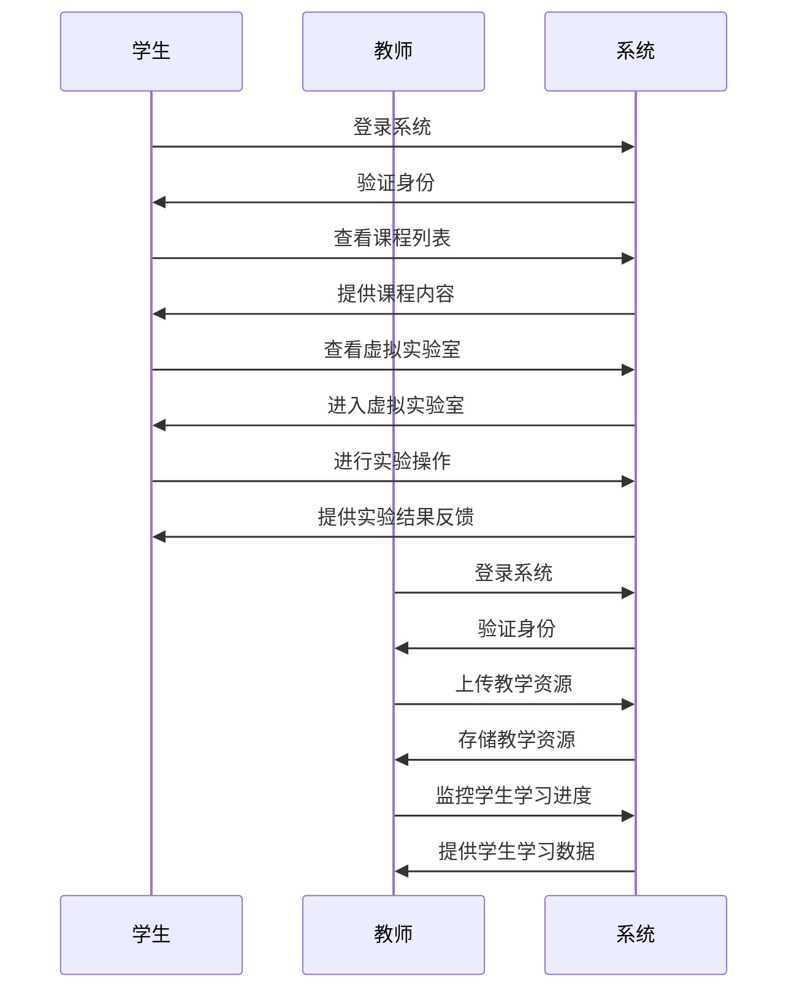
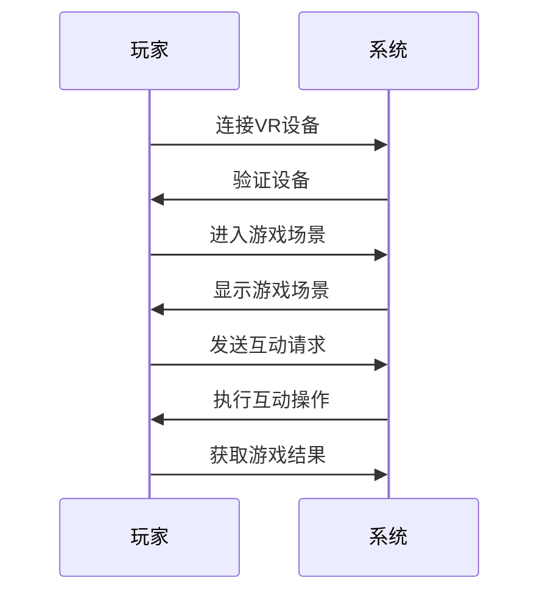
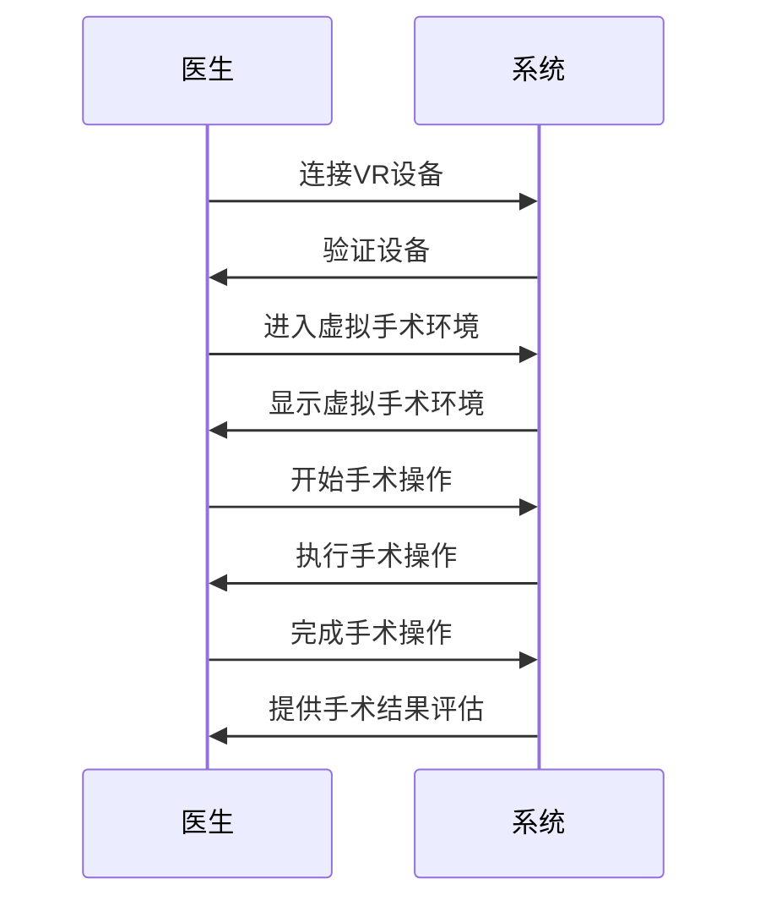

                 

### AR/VR技术：增强LLM应用的交互体验

关键词：增强现实/虚拟现实，语言模型，交互体验，技术融合，应用创新

摘要：本文旨在探讨AR/VR技术在增强大型语言模型（LLM）应用交互体验方面的潜力。首先，我们将对AR/VR技术进行概述，介绍其基础知识、发展历史和应用领域。接着，我们将深入分析AR/VR技术的核心技术，包括显示技术、空间定位与追踪、输入交互技术和声音处理技术。随后，我们将重点关注AR/VR技术在教育、娱乐、医疗和工业设计等领域的应用，并探讨其前沿研究与趋势。本文的核心部分将讨论AR/VR技术与LLM的融合，解释LLM增强AR/VR交互体验的原理，并通过案例分析展示其实际应用效果。最后，我们将总结AR/VR技术的发展趋势，展望LLM与AR/VR融合的未来前景。

### 第一部分: AR/VR技术概述

#### 第1章: AR/VR技术的基础知识

##### 1.1.1 什么是AR/VR技术

增强现实（Augmented Reality，AR）和虚拟现实（Virtual Reality，VR）是两种通过计算机技术和传感器设备创造出的沉浸式体验技术。AR技术将虚拟信息叠加到现实世界中，而VR技术则创造出一个完全虚拟的环境。

**AR技术：** AR技术通过摄像头或传感器捕捉现实世界的图像，并在这些图像上叠加虚拟信息，从而增强用户的感知。典型的AR应用包括移动设备上的游戏、导航、教育和购物等。

**VR技术：** VR技术通过头戴显示器（HMD）或其他设备，将用户完全沉浸在一个模拟的虚拟环境中。用户可以通过头部动作和手部动作与虚拟环境互动，从而获得完全的沉浸体验。VR常用于游戏、模拟训练、虚拟旅游和医疗等领域。

##### 1.1.2 AR/VR技术的发展历史

**AR技术的发展历史：**
- 1968年，美国科学家 Ivan Sutherland 提出了“虚拟现实”的概念。
- 1990年，日本索尼公司推出了世界上第一款商用AR设备——VR Glasses。
- 2010年代，随着移动设备的普及和计算机图形技术的进步，AR技术得到了广泛的应用。

**VR技术的发展历史：**
- 1960年代，虚拟现实的概念开始萌芽。
- 1980年代，VR技术的初步原型被开发出来，包括头戴显示器和跟踪系统。
- 2000年代，VR技术逐渐应用于游戏、娱乐和医疗领域。
- 2010年代，随着硬件和软件技术的进步，VR设备如Oculus Rift、HTC Vive和PlayStation VR等开始商业化。

##### 1.1.3 AR/VR技术的核心概念

**核心概念：**
- **显示技术：** 包括头戴显示器（HMD）、投影屏幕和透明显示器等。
- **空间定位与追踪：** 利用传感器和算法实时跟踪用户的位置和动作，确保虚拟信息与现实世界的一致性。
- **输入交互技术：** 包括手柄、手势识别、眼动跟踪和语音控制等，用户可以通过这些方式与虚拟环境互动。
- **声音处理技术：** 包括3D音效和空间音频，增强用户的沉浸感。

### 第二部分: AR/VR技术的应用领域

#### 第2章: AR/VR技术的应用领域

##### 2.1.1 教育与培训

AR/VR技术在教育领域的应用包括教学内容可视化、虚拟实验室和远程教学等。

**教学内容可视化：** 通过AR技术，教师可以将抽象的概念和知识点以三维模型的形式展示给学生，提高学生的理解能力和记忆力。

**虚拟实验室：** VR技术可以创建模拟的实验室环境，让学生在虚拟空间中进行实验操作，从而提高实践能力和安全意识。

**远程教学：** 教师可以通过VR设备进行远程授课，与学生进行实时互动，提高教学效果。

##### 2.1.2 娱乐与游戏

AR/VR技术在娱乐与游戏领域的应用包括沉浸式游戏、VR主题公园和虚拟现实直播等。

**沉浸式游戏：** 通过VR技术，玩家可以进入一个完全虚拟的游戏世界，获得更加真实的游戏体验。

**VR主题公园：** VR主题公园通过虚拟现实技术，创造出一个虚拟的娱乐场景，为游客提供沉浸式的娱乐体验。

**虚拟现实直播：** 通过AR技术，将虚拟信息叠加到现实场景中，为观众提供更加丰富的直播内容。

##### 2.1.3 医疗与康复

AR/VR技术在医疗与康复领域的应用包括虚拟手术、康复训练和虚拟医疗咨询等。

**虚拟手术：** 通过VR技术，医生可以在虚拟环境中进行手术模拟，提高手术技能和安全性。

**康复训练：** 通过AR/VR技术，患者可以在虚拟环境中进行康复训练，提高治疗效果和患者满意度。

**虚拟医疗咨询：** 通过AR/VR技术，医生可以远程为患者提供医疗咨询和服务，提高医疗服务的可及性和效率。

##### 2.1.4 工业设计与制造

AR/VR技术在工业设计与制造领域的应用包括虚拟设计、生产流程优化和产品质量检测等。

**虚拟设计：** 通过VR技术，设计师可以在虚拟环境中进行产品设计和评估，提高设计效率和准确性。

**生产流程优化：** 通过AR/VR技术，企业可以模拟生产过程，优化生产流程，提高生产效率。

**产品质量检测：** 通过AR/VR技术，企业可以在虚拟环境中进行产品质量检测，提高产品质量和降低成本。

### 第三部分: AR/VR技术的核心技术

#### 第3章: AR/VR技术的核心技术

##### 3.1.1 显示技术

显示技术是AR/VR技术的核心组成部分，它决定了用户的沉浸体验。常见的显示技术包括头戴显示器（HMD）、投影屏幕和透明显示器等。

**头戴显示器（HMD）：** HMD是最常用的显示技术之一，它通过头戴设备将虚拟图像直接显示在用户眼前，提供高质量的视觉效果。常见的HMD设备包括Oculus Rift、HTC Vive和PlayStation VR等。

**投影屏幕：** 投影屏幕将虚拟图像投射到屏幕上，用户可以通过屏幕观察虚拟内容。这种技术通常用于大型VR体验，如VR主题公园和虚拟现实展示。

**透明显示器：** 透明显示器允许用户同时观察虚拟图像和现实世界。这种技术适用于需要与现实环境互动的AR应用。

##### 3.1.2 空间定位与追踪

空间定位与追踪技术确保虚拟信息与现实世界的实时同步，提供真实的沉浸体验。主要技术包括传感器、摄像头和跟踪算法等。

**传感器：** 传感器用于检测用户的位置和动作，常见的传感器包括加速度计、陀螺仪和磁力计等。

**摄像头：** 摄像头用于捕捉现实世界的图像，并与虚拟信息进行叠加。摄像头可以实时更新场景，确保虚拟信息与现实环境的准确对应。

**跟踪算法：** 跟踪算法通过处理传感器数据和摄像头图像，实时计算用户的位置和动作，确保虚拟信息的准确追踪。

##### 3.1.3 输入交互技术

输入交互技术是用户与虚拟环境之间的桥梁，它决定了用户的交互体验。常见的输入交互技术包括手柄、手势识别、眼动跟踪和语音控制等。

**手柄：** 手柄是最常用的输入设备之一，它允许用户通过按钮和摇杆与虚拟环境进行交互。

**手势识别：** 手势识别技术通过摄像头和传感器捕捉用户的手势，将手势转换为虚拟操作。

**眼动跟踪：** 眼动跟踪技术通过摄像头捕捉用户的眼动，实现精确的交互和导航。

**语音控制：** 语音控制技术通过语音识别和语音合成，实现用户与虚拟环境的自然交互。

##### 3.1.4 声音处理技术

声音处理技术是AR/VR技术的重要组成部分，它通过3D音效和空间音频增强用户的沉浸体验。主要技术包括音效引擎、空间音频处理和声音渲染等。

**音效引擎：** 音效引擎用于创建和播放3D音效，实现声音的实时渲染。

**空间音频处理：** 空间音频处理技术通过处理声音信号，模拟真实环境中的声音效果。

**声音渲染：** 声音渲染技术将处理后的声音信号发送到用户的耳朵，实现沉浸式声音体验。

### 第四部分: AR/VR技术在特定领域的应用

#### 第4章: AR/VR技术在教育领域的应用

##### 4.1.1 教学内容的可视化

通过AR技术，教师可以将抽象的概念和知识点以三维模型的形式展示给学生，提高学生的理解能力和记忆力。例如，在生物学教学中，教师可以使用AR技术展示细胞结构的动态变化，使学生更直观地理解生物学概念。

**应用实例：** 使用AR技术开发的《细胞探秘》应用，允许学生通过移动设备查看细胞结构的动态变化，提高学习效果。

##### 4.1.2 虚拟实验室

VR技术可以创建模拟的实验室环境，让学生在虚拟空间中进行实验操作，从而提高实践能力和安全意识。例如，在化学实验中，学生可以在虚拟实验室中进行危险的实验操作，而无需担心安全风险。

**应用实例：** 使用VR技术开发的《化学实验室》应用，允许学生在虚拟环境中进行实验，提高实践能力和实验技能。

##### 4.1.3 远程教学

教师可以通过VR设备进行远程授课，与学生进行实时互动，提高教学质量。例如，在在线教育平台上，教师可以使用VR技术为学生提供沉浸式教学体验，增强学习效果。

**应用实例：** 使用VR技术开发的《虚拟课堂》应用，允许教师通过VR设备为学生提供远程授课，提高教学互动和效果。

#### 第5章: AR/VR技术在娱乐与游戏领域的应用

##### 5.1.1 游戏的沉浸体验

通过VR技术，玩家可以进入一个完全虚拟的游戏世界，获得更加真实的游戏体验。例如，在《堡垒之夜》等游戏中，玩家可以通过VR设备获得360度的视觉体验，增强游戏的沉浸感。

**应用实例：** 《堡垒之夜》等VR游戏，通过VR技术为玩家提供沉浸式的游戏体验。

##### 5.1.2 VR主题公园

VR主题公园通过虚拟现实技术，创造出一个虚拟的娱乐场景，为游客提供沉浸式的娱乐体验。例如，游客可以在虚拟主题公园中体验过山车、跳楼机和虚拟现实电影等。

**应用实例：** 位于美国的“瑟芬瑟尔VR主题公园”，通过VR技术为游客提供沉浸式的娱乐体验。

##### 5.1.3 虚拟现实直播

通过AR技术，将虚拟信息叠加到现实场景中，为观众提供更加丰富的直播内容。例如，在体育比赛中，AR技术可以实时显示球员数据、比赛分析和广告信息等。

**应用实例：** NBA等体育赛事通过AR技术进行虚拟现实直播，为观众提供实时数据分析和沉浸式观看体验。

#### 第6章: AR/VR技术在医疗与康复领域的应用

##### 6.1.1 虚拟手术

通过VR技术，医生可以在虚拟环境中进行手术模拟，提高手术技能和安全性。例如，在心脏手术中，医生可以在虚拟环境中练习操作，减少实际手术中的风险。

**应用实例：** 使用VR技术开发的《虚拟手术训练》应用，允许医生在虚拟环境中进行手术模拟，提高手术技能和安全性。

##### 6.1.2 康复训练

通过AR/VR技术，患者可以在虚拟环境中进行康复训练，提高治疗效果和患者满意度。例如，在物理治疗中，患者可以在虚拟环境中进行康复训练，增强治疗效果。

**应用实例：** 使用AR/VR技术开发的《康复训练》应用，允许患者在家中通过虚拟环境进行康复训练，提高治疗效果。

##### 6.1.3 虚拟医疗咨询

通过AR/VR技术，医生可以远程为患者提供医疗咨询和服务，提高医疗服务的可及性和效率。例如，在远程诊断中，医生可以通过VR设备与患者进行实时视频通话，提供专业的医疗建议。

**应用实例：** 使用AR/VR技术开发的《远程医疗咨询》应用，允许医生通过VR设备为患者提供远程医疗咨询，提高医疗服务质量和可及性。

#### 第7章: AR/VR技术在工业设计与制造领域的应用

##### 7.1.1 虚拟设计

通过VR技术，设计师可以在虚拟环境中进行产品设计和评估，提高设计效率和准确性。例如，在汽车设计过程中，设计师可以在虚拟环境中进行车身造型和内部布局的模拟。

**应用实例：** 使用VR技术开发的《虚拟设计工作室》应用，允许设计师在虚拟环境中进行产品设计和评估，提高设计效率和准确性。

##### 7.1.2 生产流程优化

通过AR/VR技术，企业可以模拟生产过程，优化生产流程，提高生产效率。例如，在制造业中，企业可以使用VR技术模拟生产过程，优化生产线的布局和流程。

**应用实例：** 使用AR/VR技术开发的《生产流程优化》应用，允许企业通过虚拟模拟优化生产流程，提高生产效率。

##### 7.1.3 产品质量检测

通过AR/VR技术，企业可以在虚拟环境中进行产品质量检测，提高产品质量和降低成本。例如，在航空航天制造业中，企业可以使用VR技术检测产品的结构和性能。

**应用实例：** 使用AR/VR技术开发的《产品质量检测》应用，允许企业通过虚拟环境进行产品质量检测，提高产品质量和降低成本。

### 第五部分: AR/VR技术的前沿研究与趋势

#### 第8章: AR/VR技术的前沿研究与趋势

##### 8.1.1 新型显示技术

新型显示技术是AR/VR技术发展的重要方向，它包括高分辨率显示器、透明显示器和折叠式显示器等。

**高分辨率显示器：** 高分辨率显示器可以提供更清晰、更细腻的视觉体验，提高用户的沉浸感。

**透明显示器：** 透明显示器允许用户同时观察虚拟图像和现实世界，适用于需要与现实环境互动的AR应用。

**折叠式显示器：** 折叠式显示器可以提供更大的屏幕尺寸，同时便于携带，适用于移动设备和可穿戴设备。

##### 8.1.2 脑机接口技术

脑机接口（Brain-Computer Interface，BCI）技术通过直接连接人脑和计算机，实现思维控制虚拟环境。脑机接口技术的发展有望为AR/VR技术提供更加自然和直观的交互方式。

**脑电信号采集与处理：** 通过脑电信号采集设备，实时捕捉大脑信号，并通过信号处理算法进行分析。

**思维控制虚拟环境：** 通过分析脑电信号，实现思维控制虚拟环境中的动作和行为，提高交互体验。

##### 8.1.3 跨界融合与创新应用

AR/VR技术与其他领域的融合，如人工智能、大数据和物联网等，将创造新的应用场景和商业模式。

**人工智能：** AI技术可以用于AR/VR应用中的图像识别、自然语言处理和智能交互等，提高应用效果和用户体验。

**大数据：** 大数据技术可以用于AR/VR应用中的用户行为分析、数据挖掘和个性化推荐等，提供更加精准和个性化的服务。

**物联网：** 物联网技术可以与AR/VR技术结合，实现设备间的互联互通，创造新的应用场景和商业模式。

### 第六部分: AR/VR技术在LLM增强交互体验中的应用

#### 第9章: AR/VR技术在LLM增强交互体验中的应用

##### 9.1.1 LLM与AR/VR的融合

LLM（大型语言模型）与AR/VR技术的融合，可以为用户提供更加丰富和个性化的交互体验。LLM可以通过自然语言处理技术，理解用户的意图和需求，为AR/VR应用提供智能交互和个性化推荐。

**自然语言处理：** LLM可以对用户的语音、文本和手势进行自然语言处理，理解用户的意图和需求。

**智能交互：** 通过LLM，AR/VR应用可以实现智能问答、语音控制和情感识别等功能，提高交互体验。

**个性化推荐：** LLM可以分析用户的历史行为和偏好，为AR/VR应用提供个性化推荐，提高用户满意度和参与度。

##### 9.1.2 LLM在AR/VR中的应用场景

LLM在AR/VR技术中具有广泛的应用场景，包括教育、娱乐、医疗和工业设计等领域。

**教育领域：** LLM可以为学生提供智能问答和个性化辅导，提高学习效果。

**娱乐领域：** LLM可以为用户提供智能对话和情感交互，创造更加丰富的娱乐体验。

**医疗领域：** LLM可以为医生提供智能诊断和治疗方案推荐，提高医疗质量和效率。

**工业设计领域：** LLM可以为设计师提供智能建议和创意支持，提高设计效率和准确性。

##### 9.1.3 LLM增强AR/VR交互体验的原理

LLM增强AR/VR交互体验的原理主要包括以下几个方面：

**语义理解：** LLM通过对用户的语言和行为进行语义理解，准确捕捉用户的意图和需求。

**情感识别：** LLM可以通过分析用户的语音、文本和表情等，识别用户的心理状态和情感，为交互提供情感支持。

**智能推荐：** LLM可以根据用户的历史行为和偏好，为用户提供个性化推荐，提高用户体验和满意度。

**自然交互：** LLM可以通过自然语言处理技术，实现与用户的智能对话和语音控制，提供更加自然和直观的交互体验。

### 第七部分: AR/VR技术的发展趋势

#### 第10章: AR/VR技术的发展趋势

##### 10.1.1 产业发展趋势

随着技术的不断进步和应用的广泛普及，AR/VR技术在全球范围内取得了显著的产业发展趋势。根据市场研究机构的预测，未来几年AR/VR市场的规模将继续扩大，预计到2025年将达到数百亿美元。

**技术进步：** 显示技术、空间定位与追踪技术、输入交互技术和声音处理技术的不断进步，将提高AR/VR技术的性能和用户体验。

**应用创新：** AR/VR技术在教育、医疗、娱乐、工业设计等领域的创新应用，将推动产业的发展。

**市场潜力：** 随着全球数字经济的快速发展，AR/VR技术将在各个行业得到广泛应用，市场潜力巨大。

##### 10.1.2 技术创新趋势

AR/VR技术的创新趋势主要体现在以下几个方面：

**新型显示技术：** 高分辨率显示器、透明显示器和折叠式显示器的研发，将为AR/VR技术提供更高的显示质量和更好的用户体验。

**脑机接口技术：** 脑机接口技术的发展，将为AR/VR技术提供更加自然和直观的交互方式。

**人工智能与大数据：** 人工智能和大数据技术的融合，将为AR/VR应用提供智能交互、个性化推荐和数据分析等新功能。

**物联网：** 物联网技术的融合，将实现AR/VR技术与各类设备的互联互通，创造新的应用场景和商业模式。

##### 10.1.3 社会应用趋势

AR/VR技术在各行各业的应用趋势如下：

**教育领域：** AR/VR技术将改变传统的教学模式，提供更加生动、直观和个性化的学习体验。

**医疗领域：** AR/VR技术将提高医疗诊断和治疗的准确性和效率，推动医疗技术的发展。

**娱乐领域：** AR/VR技术将创造新的娱乐方式，为用户提供更加沉浸和互动的娱乐体验。

**工业设计领域：** AR/VR技术将提高产品设计和制造过程的效率，推动工业设计的发展。

**军事领域：** AR/VR技术将用于军事训练和模拟，提高士兵的战斗技能和作战能力。

### 案例分析

#### 案例一：某教育科技公司利用AR/VR技术开展在线教育

**项目介绍：** 某教育科技公司利用AR/VR技术，开发了一系列在线教育产品，旨在为学生提供沉浸式学习体验。

**系统功能设计：**
1. **教学内容可视化：** 通过AR技术，将抽象的教学内容转化为三维模型，增强学生的理解和记忆。
2. **虚拟实验室：** 利用VR技术，模拟真实的实验环境，让学生在虚拟空间中进行实验操作，提高实践能力。
3. **远程教学：** 教师通过VR设备进行远程授课，与学生进行实时互动，提高教学质量。

**系统架构设计：**
- **前端：** 利用Unity引擎开发AR/VR应用，实现教学内容可视化、虚拟实验室和远程教学等功能。
- **后端：** 使用云计算平台进行数据处理和存储，支持大规模在线教育需求。

**系统接口设计：**
- **用户接口：** 通过Web和移动应用，提供AR/VR教学内容和交互功能。
- **教学接口：** 教师可以通过后台管理系统，上传教学资源和监控学生学习进度。

**系统交互序列图：**

#### 案例二：某游戏公司开发基于VR的沉浸式游戏

**项目介绍：** 某游戏公司开发了一款基于VR的沉浸式游戏，旨在为玩家提供全新的游戏体验。

**系统功能设计：**
1. **游戏场景构建：** 利用VR技术，创建高度真实的游戏场景，提高玩家的沉浸感。
2. **互动机制设计：** 设计多种互动机制，如手柄控制、手势识别和语音控制等，增强游戏的互动性。
3. **游戏内容更新：** 定期更新游戏内容，提供新的游戏玩法和挑战，保持玩家的兴趣和参与度。

**系统架构设计：**
- **前端：** 利用Unity引擎开发VR游戏，实现游戏场景构建和互动机制设计。
- **后端：** 使用云服务器进行游戏数据和用户数据的存储和管理，支持大规模在线游戏需求。

**系统接口设计：**
- **用户接口：** 通过VR设备提供游戏场景和互动功能。
- **游戏服务器接口：** 负责游戏数据传输和用户认证等。

**系统交互序列图：**

#### 案例三：某医疗机构应用AR/VR技术进行虚拟手术演练

**项目介绍：** 某医疗机构利用AR/VR技术，为医生提供虚拟手术演练平台，提高手术技能和安全性。

**系统功能设计：**
1. **虚拟手术环境构建：** 利用VR技术，创建高度真实的虚拟手术环境，包括手术室设备、手术器械和患者模型等。
2. **手术操作模拟：** 通过VR手柄和手势识别技术，模拟医生在虚拟手术环境中的操作，提高手术技能和熟练度。
3. **手术结果评估：** 通过虚拟手术平台的实时反馈功能，评估医生的手术操作和手术效果。

**系统架构设计：**
- **前端：** 利用Unity引擎开发VR手术演练平台，实现虚拟手术环境构建和手术操作模拟。
- **后端：** 使用云计算平台进行数据处理和存储，支持多用户并发演练需求。

**系统接口设计：**
- **用户接口：** 通过VR设备提供虚拟手术环境和手术操作模拟。
- **手术数据接口：** 负责手术数据和医生操作数据的收集和存储。

**系统交互序列图：**

### 总结与展望

#### 第12章: 总结与展望

##### 12.1.1 本书总结

本文详细介绍了AR/VR技术的概述、应用领域、核心技术以及其在教育与培训、娱乐与游戏、医疗与康复、工业设计与制造等领域的实际应用。同时，探讨了AR/VR技术与LLM的融合及其在增强交互体验方面的应用，分析了AR/VR技术的发展趋势和未来前景。

##### 12.1.2 AR/VR技术的发展展望

随着技术的不断进步和应用的广泛普及，AR/VR技术将在未来得到更广泛的应用。新型显示技术、脑机接口技术、人工智能与大数据融合等将推动AR/VR技术的发展。在教育、医疗、娱乐和工业设计等领域，AR/VR技术将带来更加丰富和个性化的体验，改变传统教学模式，提高医疗诊断和治疗效果，创造新的娱乐方式和生产模式。

##### 12.1.3 LLM与AR/VR融合的未来前景

LLM与AR/VR技术的融合将为用户提供更加智能和个性化的交互体验。在未来的AR/VR应用中，LLM将扮演重要角色，通过自然语言处理、情感识别和智能推荐等技术，提高用户的满意度和参与度。在教育、医疗、娱乐和工业设计等领域，LLM与AR/VR技术的融合将带来革命性的变革，推动整个行业的发展。

### 作者信息

作者：AI天才研究院/AI Genius Institute & 禅与计算机程序设计艺术 /Zen And The Art of Computer Programming

