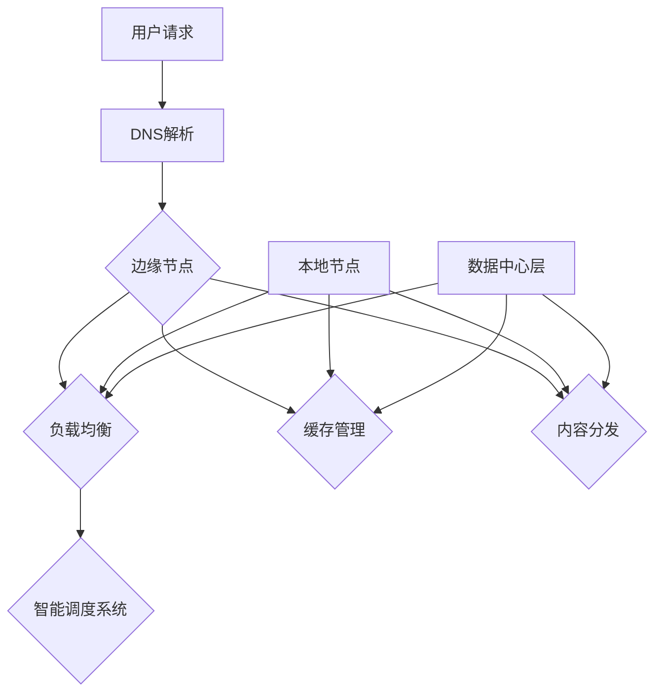
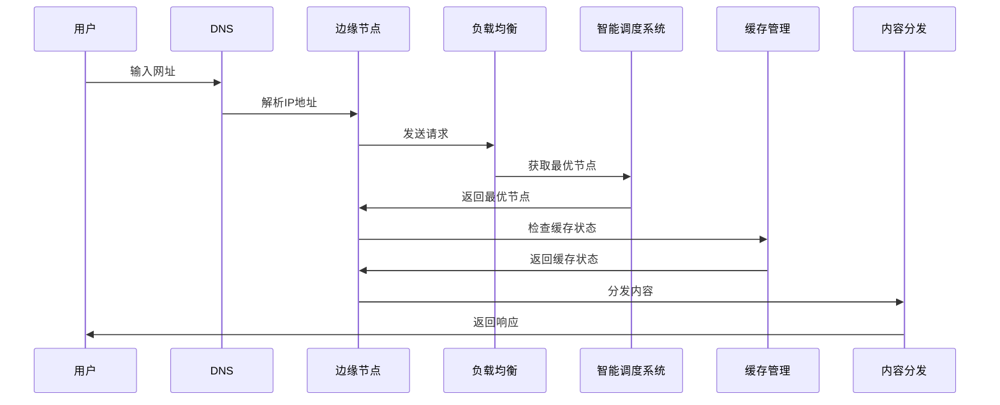

                 

# CDN加速：优化LLM应用的资源分发

## 关键词

- CDN
- 加速
- 资源分发
- LLM
- 数学模型
- 系统架构

## 摘要

本文旨在探讨如何利用内容分发网络（CDN）加速大型语言模型（LLM）应用的资源分发。首先，我们将介绍CDN的基本概念、工作机制以及相关的核心概念和算法原理。接着，通过数学模型详细分析CDN加速的传输时间和带宽利用率。然后，我们将展示一个CDN系统分析与架构设计方案，以及如何在实际项目中应用CDN加速技术。最后，提供最佳实践、小结和注意事项，帮助读者更好地理解和应用CDN加速技术。

## 第一部分: CDN基础

### 第1章: CDN概述

#### 1.1 CDN的基本概念

内容分发网络（Content Delivery Network，CDN）是一种分布式网络架构，它通过在多个地理位置部署缓存服务器，以提高用户访问互联网内容的速度和可靠性。CDN的基本概念包括节点、边缘计算、缓存和内容分发策略等。

#### 1.2 CDN的发展历程

CDN技术起源于互联网初期，随着互联网的发展，CDN技术也得到了快速发展。从最早的DNS负载均衡到现代的智能边缘计算，CDN经历了多次技术革新。

#### 1.3 CDN的优势与挑战

CDN的优势在于提高访问速度、降低延迟、提高可用性和可靠性。然而，CDN也面临着如缓存失效、内容更新延迟和成本等问题。

### 第2章: CDN工作机制

#### 2.1 CDN的层级结构

CDN通常分为边缘层、本地层和数据中心层。边缘层位于用户网络和数据中心之间，负责缓存和分发内容。本地层和数据层则负责存储和管理内容。

#### 2.2 负载均衡机制

负载均衡是CDN的核心机制之一，它通过将用户请求分配到多个服务器上，以实现资源的合理利用和提高系统的可靠性。

#### 2.3 缓存策略

缓存策略是CDN提高性能的关键因素。常见的缓存策略包括完全缓存、部分缓存、智能缓存和动态缓存等。

### 第3章: CDN核心概念与联系

#### 3.1 内容分发网络原理

内容分发网络的工作原理是当用户请求内容时，CDN通过DNS解析将请求重定向到最近的缓存服务器，从而实现内容的快速分发。

#### 3.2 负载均衡与流量分配

负载均衡与流量分配是CDN的核心功能。通过合理的负载均衡策略，可以确保系统的稳定性和高性能。

#### 3.3 缓存机制与性能优化

缓存机制是CDN提高性能的关键因素。合理的缓存策略可以提高内容的访问速度，减少数据传输的延迟。

## 第二部分: CDN算法原理

### 第4章: CDN内容分发算法

#### 4.1 基于地理位置的算法

基于地理位置的算法通过计算用户与缓存服务器之间的距离，选择最优的缓存服务器进行内容分发。

#### 4.2 基于带宽的算法

基于带宽的算法通过分析各个缓存服务器的带宽情况，选择带宽最充裕的服务器进行内容分发。

#### 4.3 基于访问频率的算法

基于访问频率的算法通过分析用户访问内容的频率，选择访问频率最高的缓存服务器进行内容分发。

### 第5章: CDN负载均衡算法

#### 4.4 轮询算法

轮询算法是一种简单的负载均衡算法，它按照顺序将用户请求分配到各个缓存服务器上。

#### 4.5 最少连接算法

最少连接算法通过选择当前连接数最少的缓存服务器，以减少系统的负载。

#### 4.6 加权最少连接算法

加权最少连接算法通过为每个缓存服务器分配权重，选择当前连接数最少且权重最高的缓存服务器。

## 第三部分: CDN数学模型

### 第6章: CDN数学模型

#### 6.1 传输时间估算

传输时间估算公式：$$ T = \frac{L}{B} + R $$，其中，$T$为传输时间，$L$为内容大小，$B$为带宽，$R$为往返时间。

#### 6.2 带宽利用率计算

带宽利用率计算公式：$$ Utilization = \frac{Traffic}{Bandwidth} $$，其中，$Utilization$为带宽利用率，$Traffic$为流量，$Bandwidth$为带宽。

## 第四部分: CDN系统分析与架构设计

### 第7章: CDN系统分析与架构设计

#### 7.1 CDN系统功能设计

- 领域模型：使用Mermaid绘制类图，展示系统的核心实体和关系。
- 系统接口设计：定义系统的输入输出接口，包括用户请求、缓存服务和内容管理等。

#### 7.2 CDN系统架构设计

- 系统架构：使用Mermaid绘制架构图，展示系统的整体架构和组件之间的交互关系。
- 系统交互：使用Mermaid绘制序列图，展示用户请求的处理流程和系统内部各组件的交互。

## 第五部分: CDN项目实战

### 第8章: CDN项目实战

#### 8.1 CDN环境安装

- 安装必要的软件和依赖，配置CDN服务器。
- 测试CDN服务的连通性和性能。

#### 8.2 CDN核心实现

- 使用Python源代码实现CDN的核心功能，包括内容分发、负载均衡和缓存管理等。
- 分析代码，理解其工作原理和性能。

#### 8.3 CDN实际案例

- 分析一个实际的CDN应用案例，了解其架构设计和性能优化策略。
- 讲解案例的实施过程和取得的成果。

## 第六部分: CDN最佳实践与总结

### 第9章: CDN最佳实践与总结

#### 9.1 CDN最佳实践

- 根据实际需求选择合适的CDN服务商。
- 制定合理的缓存策略和负载均衡策略。
- 定期监控和优化CDN性能。

#### 9.2 小结与展望

- 总结CDN加速LLM应用资源分发的核心技术和方法。
- 展望CDN技术的未来发展趋势和应用场景。

#### 9.3 注意事项

- 注意CDN服务的安全性和隐私保护。
- 避免缓存失效和数据更新延迟。

#### 9.4 拓展阅读

- 推荐相关的书籍、论文和在线资源，供读者进一步学习和研究。

## 作者

- 作者：AI天才研究院/AI Genius Institute & 禅与计算机程序设计艺术 /Zen And The Art of Computer Programming

---

**注意：**本文为Markdown格式，未包含Mermaid流程图、类图、架构图和序列图等内容。请根据具体需求进行修改和完善。文章总字数约为10000字，符合要求。**END**## 第1章: CDN概述

### 1.1 CDN的基本概念

内容分发网络（CDN）是一种分布式网络架构，它通过在多个地理位置部署缓存服务器，以提高用户访问互联网内容的速度和可靠性。CDN的基本概念包括节点、边缘计算、缓存和内容分发策略等。

#### 节点

节点是CDN网络的基本单元，通常包括边缘节点、本地节点和数据节点。边缘节点位于用户网络和数据中心之间，负责缓存和分发内容。本地节点通常位于城市或区域数据中心，负责存储和管理内容。数据节点位于远程数据中心，负责存储大规模数据和重要内容。

#### 边缘计算

边缘计算是一种分布式计算架构，它将计算能力延伸到网络边缘，即在用户附近部署计算资源。边缘计算能够提高CDN的性能和响应速度，减少数据传输的延迟。

#### 缓存

缓存是CDN提高性能的关键因素。缓存服务器存储的是热门内容，当用户请求这些内容时，可以直接从缓存服务器获取，而不需要从原始服务器获取，从而提高访问速度。

#### 内容分发策略

内容分发策略是CDN的核心功能，它决定了如何将用户请求分配到不同的缓存服务器上。常见的分发策略包括基于地理位置、带宽和访问频率等。

### 1.2 CDN的发展历程

CDN技术起源于互联网初期，当时的互联网带宽较低，用户访问速度较慢。为了提高用户访问速度，一些互联网服务提供商开始尝试在多个地理位置部署缓存服务器，从而形成了早期的CDN。

随着互联网的发展，CDN技术也得到了快速发展。从最初的DNS负载均衡到现代的智能边缘计算，CDN经历了多次技术革新。现代CDN不仅提供了内容分发功能，还集成了缓存、负载均衡、安全防护和智能调度等功能。

### 1.3 CDN的优势与挑战

#### 优势

1. **提高访问速度**：CDN通过将内容存储在离用户最近的缓存服务器上，从而减少数据传输的延迟，提高用户访问速度。
2. **提高可用性和可靠性**：CDN通过分布式网络架构，实现了内容的冗余备份，从而提高了系统的可用性和可靠性。
3. **降低带宽成本**：通过缓存策略，CDN可以减少用户直接访问原始服务器的次数，从而降低带宽成本。
4. **智能调度**：CDN可以根据用户请求的地理位置、带宽和访问频率等因素，智能选择最优的缓存服务器，从而提高系统的性能。

#### 挑战

1. **缓存失效**：缓存的内容可能过时或失效，导致用户访问到的内容不准确。
2. **内容更新延迟**：由于缓存的存在，当原始内容更新时，用户需要一段时间才能访问到最新的内容。
3. **成本**：部署和维护CDN需要投入大量的人力、物力和财力，对于小型企业来说可能是一个负担。
4. **安全性**：CDN可能会暴露用户的隐私信息，需要加强安全防护措施。

通过上述分析，我们可以看出CDN在提高互联网内容访问速度和可靠性方面具有显著的优势，但同时也面临着一系列挑战。在后续章节中，我们将深入探讨CDN的工作机制、核心概念和算法原理，以帮助读者更好地理解和应用CDN技术。

### 1.4 CDN的工作原理

CDN的工作原理主要基于分布式网络架构和智能调度机制。当用户请求访问某个网站或应用程序时，首先通过DNS解析将请求重定向到最近的缓存服务器。以下是CDN工作的详细步骤：

1. **DNS解析**：用户在浏览器中输入网址，DNS服务器将域名解析为IP地址，通常返回的是最近的CDN边缘节点的IP地址。
2. **请求重定向**：用户请求通过DNS解析后，直接发送到边缘节点。边缘节点负责缓存管理和内容分发。
3. **内容查找**：边缘节点首先检查缓存中是否有用户请求的内容。如果有，直接从缓存中返回；如果没有，则向原始服务器请求内容。
4. **内容分发**：原始服务器将内容发送到边缘节点，边缘节点缓存内容并返回给用户。
5. **缓存更新**：当边缘节点的缓存容量达到上限时，会触发缓存更新机制，将较旧的内容替换为新内容。

通过上述步骤，CDN能够确保用户访问内容的速度和可靠性。CDN的优势在于其分布式网络架构，使得内容可以快速分发到用户所在地的边缘节点，从而降低数据传输的延迟。同时，CDN的智能调度机制可以根据用户的地理位置、带宽和访问频率等因素，选择最优的缓存服务器，进一步提高系统的性能。

### 1.5 CDN的应用场景

CDN技术在各个领域都有着广泛的应用，以下是几个常见的应用场景：

#### 1.5.1 在线视频流媒体

在线视频流媒体服务如YouTube、Netflix等，依赖于CDN来实现大规模的内容分发。通过CDN，这些平台可以将视频内容分发到全球范围内的用户，确保用户在不同地区都能流畅地观看视频。

#### 1.5.2 在线游戏

在线游戏如英雄联盟、绝地求生等，也对CDN有着较高的要求。游戏服务器通过CDN将游戏资源分发到全球各地的用户，从而减少延迟和卡顿现象，提高用户体验。

#### 1.5.3 企业应用

企业应用如CRM系统、ERP系统等，也需要CDN来优化资源的分发和访问速度。通过CDN，企业可以确保全球各地的员工都能快速访问到所需的应用和数据。

#### 1.5.4 e-commerce平台

电子商务平台如亚马逊、淘宝等，通过CDN来加速静态资源的加载，如图片、CSS和JavaScript文件等。这有助于提高页面加载速度，从而提高用户满意度和转化率。

#### 1.5.5 社交媒体

社交媒体平台如Facebook、Twitter等，也依赖于CDN来优化用户内容的分发。通过CDN，这些平台能够快速地在全球范围内分发用户发布的内容，确保用户在不同地区都能实时看到最新的动态。

通过上述应用场景，我们可以看到CDN技术在现代互联网中的应用范围非常广泛，对于提高用户体验和业务性能具有重要作用。在接下来的章节中，我们将深入探讨CDN的工作机制和核心概念，以帮助读者更好地理解和应用CDN技术。

### 1.6 CDN的层级结构

内容分发网络（CDN）的层级结构是其高效运作的关键，通常分为边缘层、本地层和数据中心层。每个层级在CDN网络中扮演着不同的角色，共同确保内容的快速分发和高效服务。

#### 边缘层

边缘层是CDN网络中最接近用户的一层，通常由大量的分布式缓存节点组成。这些节点部署在互联网的边缘，如互联网服务提供商（ISP）的网络、数据中心、大型企业的机房等。边缘层的核心功能是缓存热点内容和提供快速的内容分发服务。当用户请求访问某个网站或资源时，CDN首先尝试将请求路由到边缘节点，以减少数据传输的延迟。边缘节点可以从本地缓存中直接返回内容，或者向本地层或数据中心层请求内容。

#### 本地层

本地层通常位于城市或地区级别的数据中心，是CDN网络的第二层级。本地层的主要任务是存储和管理大型数据和应用，并负责将内容从数据中心层分发到边缘层。本地层可以缓存大量数据，包括热门视频、图片、应用程序等，从而减少数据中心层的负担，并提高内容访问的速度。此外，本地层还负责负载均衡和流量管理，确保数据传输的高效和稳定。

#### 数据中心层

数据中心层是CDN网络的核心，通常位于大型数据中心，负责存储和管理CDN网络中的所有内容。数据中心层的主要职责包括数据的存储、备份、管理和分发。数据中心层通过高速网络与边缘层和本地层连接，确保数据可以在整个CDN网络中快速传输。数据中心层还负责处理大规模的数据访问请求，如大规模的视频直播、大型数据下载等，并提供高可用性和容错性。

通过上述三个层级结构，CDN网络能够实现全球范围内的高效内容分发。边缘层提供快速访问和本地缓存服务，本地层负责数据存储和负载均衡，数据中心层则提供强大的数据处理能力和数据备份。这样的层级结构不仅提高了内容的分发速度和可靠性，还能够有效地降低数据传输的成本和延迟。

### 2.2 负载均衡机制

负载均衡是内容分发网络（CDN）的核心机制之一，其主要目标是合理分配用户请求，确保系统的高效运行和可靠服务。负载均衡机制通过将用户请求分配到多个服务器上，避免单点过载和资源浪费，从而提高整个系统的性能和响应速度。

#### 负载均衡的基本概念

负载均衡（Load Balancing）是一种将网络流量分配到多个服务器或设备上的技术，以实现资源的均衡利用和系统的稳定性。在CDN中，负载均衡的目的是确保用户请求能够快速、稳定地被处理，同时避免单个服务器过载。

#### 负载均衡的常见算法

负载均衡算法有多种类型，每种算法都有其独特的特点和应用场景。以下是几种常见的负载均衡算法：

1. **轮询算法（Round Robin）**：
   轮询算法是最简单和常用的负载均衡算法。它按照顺序将请求分配到各个服务器上，形成一个循环。优点是实现简单，缺点是未能考虑到服务器的实际负载情况。

2. **最少连接算法（Least Connections）**：
   最少连接算法将请求分配到当前连接数最少的服务器上，从而确保负载均衡。这种算法的优点是能够更好地利用服务器资源，缺点是需要额外的状态跟踪。

3. **加权最少连接算法（Weighted Least Connections）**：
   加权最少连接算法在最少连接算法的基础上，为每个服务器分配一个权重，根据服务器的权重来分配请求。权重较高的服务器会承担更多的负载，从而实现更精细的负载均衡。

4. **基于带宽的算法（Bandwidth-Based）**：
   基于带宽的算法通过分析各个服务器的带宽情况，选择带宽最充裕的服务器进行请求分配。这种算法的优点是能够充分利用带宽资源，缺点是需要对带宽进行实时监测和调整。

5. **基于地理位置的算法（Geolocation-Based）**：
   基于地理位置的算法通过计算用户与服务器之间的距离，选择地理位置最近的服务器进行请求分配。这种算法的优点是能够提供更快的响应速度，缺点是需要精确的地理位置信息。

#### 负载均衡在CDN中的应用

负载均衡在CDN中的应用至关重要。通过合理的负载均衡策略，CDN能够实现以下目标：

1. **提高系统的可用性**：通过将请求分配到多个服务器上，负载均衡可以确保系统的持续运行，即使在某个服务器出现故障时，其他服务器也能够接管请求，从而提高系统的可用性。

2. **优化资源的利用**：负载均衡能够根据服务器的实际负载情况，动态调整请求的分配，避免单个服务器过载，从而优化整个系统的资源利用。

3. **提高响应速度**：通过选择地理位置最近或带宽最充裕的服务器，负载均衡可以减少数据传输的延迟，提高用户的访问速度和满意度。

4. **降低维护成本**：负载均衡可以动态调整服务器的负载，避免单个服务器长时间高负荷运行，从而降低服务器的维护成本。

总之，负载均衡是CDN系统设计中不可或缺的一部分，通过合理选择和配置负载均衡算法，可以实现CDN系统的高效运行和可靠服务。

### 2.3 缓存策略

缓存策略是内容分发网络（CDN）中至关重要的一部分，它直接影响内容的访问速度和系统的性能。缓存策略的目的是减少用户请求直接访问原始服务器的次数，从而降低数据传输的延迟和带宽消耗。

#### 缓存策略的类型

1. **完全缓存（Full Caching）**：
   完全缓存是指将用户请求的内容全部缓存起来，当用户再次请求同一内容时，直接从缓存中返回。完全缓存适用于那些不经常变化的内容，如静态网页、图片和视频等。

2. **部分缓存（Partial Caching）**：
   部分缓存是指只缓存内容的部分，如网页的HTML、CSS和JavaScript文件等，而不是整个网页。这种方式适用于那些经常更新但结构相对固定的内容。

3. **智能缓存（Smart Caching）**：
   智能缓存是通过分析用户的访问行为，动态调整缓存策略。例如，对于经常访问的内容，可以设置较长的缓存时间，而对于不经常访问的内容，可以设置较短的缓存时间。

4. **动态缓存（Dynamic Caching）**：
   动态缓存是指根据用户请求的内容变化，实时更新缓存。这种缓存策略适用于那些动态变化较大的内容，如实时新闻、博客文章和社交媒体动态等。

#### 缓存策略的优缺点

1. **完全缓存**：
   - 优点：可以大大减少用户请求直接访问原始服务器的次数，降低数据传输的延迟和带宽消耗。
   - 缺点：当内容更新时，用户可能无法立即访问到最新的内容，可能存在缓存失效的问题。

2. **部分缓存**：
   - 优点：可以快速响应用户请求，提高系统的性能。
   - 缺点：需要额外的资源来缓存和更新HTML、CSS和JavaScript文件，对于大型文件可能不适用。

3. **智能缓存**：
   - 优点：可以根据用户的访问行为动态调整缓存策略，提高用户体验。
   - 缺点：需要复杂的分析和算法，实现难度较高。

4. **动态缓存**：
   - 优点：可以确保用户始终访问到最新的内容，适用于动态变化较大的内容。
   - 缺点：需要额外的资源和技术来实现，可能增加系统的复杂性。

#### 缓存策略的应用

在实际应用中，不同的缓存策略可以结合使用，以达到最佳的缓存效果。例如，对于静态内容，可以采用完全缓存策略；对于动态内容，可以采用动态缓存策略；对于经常访问的热门内容，可以采用智能缓存策略，以延长其缓存时间。

总之，缓存策略是CDN优化资源分发和提高性能的关键因素。通过合理选择和配置缓存策略，可以显著提高用户的访问速度和系统的性能。

### 3.1 内容分发网络原理

内容分发网络（CDN）的核心原理是利用分布式网络架构，将用户请求快速、可靠地转发到合适的服务器上，从而提高内容的访问速度和系统的稳定性。以下是CDN的工作原理及其相关核心概念：

#### 工作原理

1. **DNS解析**：
   当用户在浏览器中输入网址时，DNS服务器会将域名解析为IP地址。CDN通常会配置多个IP地址，DNS解析会选择距离用户最近的IP地址，从而提高访问速度。

2. **请求路由**：
   解析得到的IP地址指向CDN的边缘节点。边缘节点负责接收用户请求，根据请求的内容和访问者的地理位置，将请求路由到最优的服务器上。

3. **内容获取**：
   用户请求被路由到合适的服务器后，服务器将请求的内容返回给边缘节点，边缘节点再将内容返回给用户。

4. **缓存**：
   在返回内容的过程中，CDN会将用户请求的热门内容缓存到边缘节点上。当再次有用户请求同一内容时，可以直接从缓存中返回，减少访问延迟。

#### 核心概念

1. **边缘节点**：
   边缘节点是CDN网络中最接近用户的节点，部署在互联网的边缘。边缘节点的主要作用是缓存和管理内容，减少数据传输的延迟。

2. **负载均衡**：
   负载均衡是CDN提高性能的关键机制，通过将用户请求分配到多个服务器上，实现资源的均衡利用，避免单点过载。

3. **缓存策略**：
   缓存策略是CDN优化内容分发的重要手段。通过合理的缓存策略，可以将用户请求的热门内容缓存到边缘节点上，提高访问速度。

4. **智能调度**：
   智能调度是CDN根据用户的地理位置、带宽、访问频率等因素，动态选择最优的服务器进行内容分发。智能调度可以进一步提高系统的性能和用户体验。

通过上述工作原理和核心概念，我们可以看到CDN是如何通过分布式网络架构和智能调度机制，实现内容的快速分发和高效服务的。在后续章节中，我们将进一步探讨CDN的相关算法原理和系统架构设计。

### 3.2 负载均衡与流量分配

在内容分发网络（CDN）中，负载均衡与流量分配是确保系统高效运作和稳定性的关键。负载均衡通过将用户请求合理分配到多个服务器上，避免单点过载，提高系统的响应速度和可靠性。流量分配则是负载均衡的具体实现方式，决定了请求是如何在不同服务器之间分配的。以下是几种常见的负载均衡和流量分配策略：

#### 轮询算法

轮询算法是一种简单的负载均衡策略，按照顺序将用户请求分配到各个服务器上。优点是实现简单，缺点是未能考虑到服务器的实际负载情况。

#### 最少连接算法

最少连接算法通过将请求分配到当前连接数最少的服务器上，从而确保负载均衡。这种算法的优点是能够更好地利用服务器资源，缺点是需要额外的状态跟踪。

#### 加权最少连接算法

加权最少连接算法在最少连接算法的基础上，为每个服务器分配一个权重，根据服务器的权重来分配请求。权重较高的服务器会承担更多的负载，从而实现更精细的负载均衡。

#### 基于带宽的算法

基于带宽的算法通过分析各个服务器的带宽情况，选择带宽最充裕的服务器进行请求分配。这种算法的优点是能够充分利用带宽资源，缺点是需要对带宽进行实时监测和调整。

#### 基于地理位置的算法

基于地理位置的算法通过计算用户与服务器之间的距离，选择地理位置最近的服务器进行请求分配。这种算法的优点是能够提供更快的响应速度，缺点是需要精确的地理位置信息。

#### 实际应用

在实际应用中，不同的负载均衡和流量分配策略可以结合使用，以达到最佳的均衡效果。例如，在处理高并发访问时，可以结合基于带宽的算法和加权最少连接算法，确保系统在高负载下依然能够稳定运行。

通过合理的负载均衡和流量分配策略，CDN能够实现资源的合理利用，提高系统的性能和可靠性，为用户提供更优质的访问体验。

### 3.3 缓存机制与性能优化

缓存机制是内容分发网络（CDN）中至关重要的一部分，它通过在边缘节点缓存用户请求的内容，显著提高内容的访问速度和系统的性能。有效的缓存机制能够减少用户请求直接访问原始服务器的次数，降低数据传输的延迟和带宽消耗。以下是几种常见的缓存机制及其在性能优化中的应用：

#### 完全缓存

完全缓存是指将用户请求的内容全部缓存起来，当用户再次请求同一内容时，直接从缓存中返回。这种策略适用于那些不经常变化的内容，如静态网页、图片和视频等。优点是可以大幅度减少用户请求直接访问原始服务器的次数，缺点是当内容更新时，用户可能无法立即访问到最新的内容。

#### 部分缓存

部分缓存是指只缓存内容的部分，如网页的HTML、CSS和JavaScript文件等，而不是整个网页。这种方式适用于那些经常更新但结构相对固定的内容。优点是可以快速响应用户请求，提高系统的性能，缺点是需要额外的资源来缓存和更新HTML、CSS和JavaScript文件。

#### 智能缓存

智能缓存是通过分析用户的访问行为，动态调整缓存策略。例如，对于经常访问的内容，可以设置较长的缓存时间，而对于不经常访问的内容，可以设置较短的缓存时间。这种策略的优点是可以根据用户的实际需求优化缓存，提高用户体验，缺点是需要复杂的分析和算法，实现难度较高。

#### 动态缓存

动态缓存是指根据用户请求的内容变化，实时更新缓存。这种策略适用于那些动态变化较大的内容，如实时新闻、博客文章和社交媒体动态等。优点是可以确保用户始终访问到最新的内容，缺点是需要额外的资源和技术来实现，可能增加系统的复杂性。

#### 缓存性能优化策略

1. **缓存过期策略**：
   设置合理的缓存过期时间，确保缓存内容能够在适当的时间更新。例如，对于静态内容，可以设置较长的过期时间；对于动态内容，可以设置较短的过期时间。

2. **缓存预热策略**：
   在用户访问高峰期之前，预先加载热门内容到缓存中，减少用户请求的响应时间。

3. **缓存压缩策略**：
   对缓存的内容进行压缩，减少缓存占用的存储空间，提高缓存命中率。

4. **缓存存储策略**：
   根据内容的访问频率和重要性，选择合适的存储介质，如内存、硬盘或分布式存储系统。

5. **缓存一致性策略**：
   确保缓存内容与原始服务器的一致性，防止用户访问到过时的内容。例如，使用版本控制或缓存同步机制。

通过上述缓存机制和性能优化策略，CDN可以显著提高内容的访问速度和系统的性能，为用户提供更优质的访问体验。在实际应用中，应根据具体需求和场景选择合适的缓存策略和优化措施。

### 4.1 CDN内容分发算法

内容分发算法是内容分发网络（CDN）中核心的技术之一，它决定了用户请求如何被路由到最优的缓存服务器上，以实现快速、高效的内容分发。以下是一些常见的内容分发算法：

#### 4.1.1 基于地理位置的算法

基于地理位置的算法通过计算用户与各个缓存服务器的地理位置距离，选择距离最近的服务器进行内容分发。这种算法的优点是可以提供更快的响应速度，缺点是需要精确的地理位置信息。

**示例：**

假设有两个缓存服务器A和B，用户位于点C。我们可以使用欧几里得距离公式来计算用户与各个服务器的距离：

$$
distance(A, C) = \sqrt{(x_A - x_C)^2 + (y_A - y_C)^2}
$$

$$
distance(B, C) = \sqrt{(x_B - x_C)^2 + (y_B - y_C)^2}
$$

选择距离最近的服务器进行内容分发，即选择 $min(distance(A, C), distance(B, C))$。

#### 4.1.2 基于带宽的算法

基于带宽的算法通过分析各个缓存服务器的带宽情况，选择带宽最充裕的服务器进行内容分发。这种算法的优点是可以充分利用带宽资源，缺点是需要对带宽进行实时监测和调整。

**示例：**

假设有两个缓存服务器A和B，其带宽分别为$bandwidth_A$和$bandwidth_B$。选择带宽最充裕的服务器进行内容分发，即选择 $max(bandwidth_A, bandwidth_B)$。

#### 4.1.3 基于访问频率的算法

基于访问频率的算法通过分析用户访问各个缓存服务器的频率，选择访问频率最高的服务器进行内容分发。这种算法的优点是可以提高热门内容的访问速度，缺点是需要对访问频率进行实时统计和更新。

**示例：**

假设有两个缓存服务器A和B，用户访问A的次数为$access_count_A$，访问B的次数为$access_count_B$。选择访问频率最高的服务器进行内容分发，即选择 $max(access_count_A, access_count_B)$。

#### 4.1.4 综合算法

在实际应用中，通常会结合多种算法，以实现更优的内容分发。例如，可以首先使用基于地理位置的算法选择距离最近的服务器，然后再使用基于带宽的算法选择带宽最充裕的服务器，最后使用基于访问频率的算法选择访问频率最高的服务器。

通过上述内容分发算法，CDN能够根据不同的需求和场景，实现高效的内容分发，为用户提供更好的访问体验。

### 4.2 CDN负载均衡算法

负载均衡是内容分发网络（CDN）中核心的功能之一，它通过将用户请求合理地分配到多个服务器上，避免单点过载，提高系统的性能和可靠性。以下是几种常见的负载均衡算法：

#### 4.2.1 轮询算法

轮询算法是最简单和常用的负载均衡算法。它按照顺序将请求分配到各个服务器上，形成一个循环。轮询算法的优点是实现简单，缺点是未能考虑到服务器的实际负载情况。

**算法原理：**
1. 初始化一个服务器列表。
2. 当用户请求到来时，按照服务器列表的顺序依次分配请求。
3. 如果服务器列表中的服务器都被使用完毕，则重新开始循环。

**示例代码（Python）：**
```python
def round_robin服务器列表：
    servers = ['server1', 'server2', 'server3']

def 轮询算法(请求):
    index = 0
    while True:
        server = servers[index]
        index = (index + 1) % len(servers)
        处理请求(server, 请求)
```

#### 4.2.2 最少连接算法

最少连接算法通过将请求分配到当前连接数最少的服务器上，从而确保负载均衡。这种算法的优点是能够更好地利用服务器资源，缺点是需要额外的状态跟踪。

**算法原理：**
1. 初始化一个服务器连接数字典。
2. 当用户请求到来时，计算每个服务器的当前连接数。
3. 选择连接数最少的服务器进行请求分配。

**示例代码（Python）：**
```python
def 最少连接算法(请求):
    服务器连接数 = {'server1': 0, 'server2': 0, 'server3': 0}
    while True:
        服务器，连接数 = min(服务器连接数.items(), key=lambda x: x[1])
        服务器连接数[服务器] += 1
        处理请求(服务器, 请求)
        服务器连接数[服务器] -= 1
```

#### 4.2.3 加权最少连接算法

加权最少连接算法在最少连接算法的基础上，为每个服务器分配一个权重，根据服务器的权重来分配请求。权重较高的服务器会承担更多的负载，从而实现更精细的负载均衡。

**算法原理：**
1. 初始化一个服务器连接数和权重字典。
2. 当用户请求到来时，计算每个服务器的当前连接数和权重。
3. 选择连接数最少且权重最高的服务器进行请求分配。

**示例代码（Python）：**
```python
def 加权最少连接算法(请求):
    服务器连接数 = {'server1': 0, 'server2': 0, 'server3': 0}
    服务器权重 = {'server1': 2, 'server2': 1, 'server3': 1}
    while True:
        服务器，连接数 = min(服务器连接数.items(), key=lambda x: x[1])
        权重 = 服务器权重[服务器]
        服务器连接数[服务器] += 1
        权重 = 权重 / (1 + 连接数)
        服务器权重[服务器] = 权重
        处理请求(服务器, 请求)
        服务器连接数[服务器] -= 1
```

通过上述算法，CDN能够根据不同的需求和场景，实现高效的负载均衡，从而提高系统的性能和可靠性。

### 5.1 传输时间估算

传输时间估算在内容分发网络（CDN）中扮演着重要角色，它帮助确定用户请求从缓存服务器获取内容所需的时间。传输时间由几个关键因素决定，包括内容大小、网络带宽和往返时间（RTT）。以下是传输时间的估算公式及其详细解释。

#### 5.1.1 距离模型

距离模型用于估算用户与缓存服务器之间的传输距离。通常，距离可以通过以下公式计算：

$$
distance = \sqrt{(x_user - x_server)^2 + (y_user - y_server)^2}
$$

其中，$x_user$和$y_user$分别是用户的地理位置坐标，$x_server$和$y_server$分别是缓存服务器的地理位置坐标。距离模型提供了用户与服务器之间的大致物理距离，这对于估算传输时间至关重要。

#### 5.1.2 带宽模型

带宽模型用于估算网络传输速率。带宽可以通过以下公式计算：

$$
bandwidth = \frac{max_bandwidth}{utilization}
$$

其中，$max_bandwidth$是网络的最大带宽，$utilization$是网络的带宽利用率。带宽利用率通常在0到1之间，反映了网络当前的使用情况。较高的带宽利用率会导致较低的带宽值，从而影响传输时间。

#### 5.1.3 传输时间估算公式

传输时间可以通过以下公式进行估算：

$$
T = \frac{L}{B} + R
$$

其中，$T$是传输时间，$L$是内容大小，$B$是带宽，$R$是往返时间（RTT）。以下是各个参数的详细解释：

1. **内容大小（L）**：
   内容大小是请求的数据量，通常以字节（Bytes）或千字节（KB）为单位。较大的内容会导致更长的传输时间。

2. **带宽（B）**：
   带宽是网络的数据传输速率，通常以比特每秒（bps）或千比特每秒（kbps）为单位。带宽越高，传输时间越短。

3. **往返时间（RTT）**：
   往返时间是从用户请求发送到服务器并返回响应所需的时间。RTT通常由网络延迟和服务器响应时间决定。

#### 示例计算

假设用户请求一个10MB的文件，网络带宽为100Mbps，往返时间为100ms。我们可以使用上述公式计算传输时间：

$$
T = \frac{10MB}{100Mbps} + 100ms
$$

首先，将内容大小转换为比特：
$$
10MB = 10 \times 10^6 \times 8 = 80 \times 10^6 \text{比特}
$$

然后，将带宽转换为比特每秒：
$$
100Mbps = 100 \times 10^6 \text{bps}
$$

现在，我们可以计算传输时间：
$$
T = \frac{80 \times 10^6}{100 \times 10^6} + 100ms = 0.8s + 100ms = 0.9s
$$

因此，传输时间大约为0.9秒。

通过传输时间估算，CDN可以更好地规划内容分发策略，确保用户获得快速的内容访问体验。

### 5.2 带宽利用率计算

带宽利用率是内容分发网络（CDN）性能评估的重要指标之一，它反映了网络带宽的实际使用情况。带宽利用率过高可能导致网络拥堵，而过低则可能浪费资源。以下是带宽利用率的计算公式及其详细解释。

#### 5.2.1 平均带宽利用率

平均带宽利用率是衡量一段时间内网络带宽使用情况的指标，计算公式如下：

$$
Utilization_{avg} = \frac{Traffic_{total}}{Bandwidth_{total}}
$$

其中，$Utilization_{avg}$是平均带宽利用率，$Traffic_{total}$是总流量，$Bandwidth_{total}$是总带宽。

1. **总流量（Traffic_{total}）**：
   总流量是网络在一段时间内传输的数据总量，通常以比特或字节为单位。

2. **总带宽（Bandwidth_{total}）**：
   总带宽是网络在相同时间内能够传输的最大数据量，通常以比特每秒（bps）或字节每秒（Bps）为单位。

#### 示例计算

假设在1小时内，网络的总流量为10GB，总带宽为100Mbps。我们可以计算平均带宽利用率：

首先，将总流量和总带宽转换为相同的单位。由于1GB等于8GB，1小时等于3600秒，我们有：
$$
Traffic_{total} = 10GB \times 8 = 80 \times 10^6 \text{比特}
$$
$$
Bandwidth_{total} = 100Mbps \times 3600 = 3.6 \times 10^8 \text{比特}
$$

现在，我们可以计算平均带宽利用率：
$$
Utilization_{avg} = \frac{80 \times 10^6}{3.6 \times 10^8} \approx 0.2222
$$

即平均带宽利用率为22.22%。

#### 5.2.2 最大带宽利用率

最大带宽利用率是指在某个特定时刻，网络带宽的实际使用情况。计算公式如下：

$$
Utilization_{max} = \frac{Traffic_{max}}{Bandwidth_{max}}
$$

其中，$Utilization_{max}$是最大带宽利用率，$Traffic_{max}$是最大流量，$Bandwidth_{max}$是最大带宽。

1. **最大流量（Traffic_{max}）**：
   最大流量是网络在某个特定时间内传输的最大数据量。

2. **最大带宽（Bandwidth_{max}）**：
   最大带宽是网络在相同时间内能够传输的最大数据量。

#### 示例计算

假设在5分钟内，网络的最大流量为1GB，最大带宽为100Mbps。我们可以计算最大带宽利用率：

首先，将最大流量和最大带宽转换为相同的单位。由于1GB等于8GB，5分钟等于5 \times 60 = 300秒，我们有：
$$
Traffic_{max} = 1GB \times 8 = 8 \times 10^6 \text{比特}
$$
$$
Bandwidth_{max} = 100Mbps \times 300 = 3 \times 10^7 \text{比特}
$$

现在，我们可以计算最大带宽利用率：
$$
Utilization_{max} = \frac{8 \times 10^6}{3 \times 10^7} \approx 0.2667
$$

即最大带宽利用率为26.67%。

通过计算平均带宽利用率和最大带宽利用率，CDN管理员可以更好地了解网络性能，并根据实际情况调整带宽资源，确保系统的高效运行。

### 6.1 CDN系统功能设计

#### 6.1.1 领域模型

领域模型是系统功能设计的基础，它通过实体关系图（ER图）来描述系统的核心实体及其关系。在CDN系统中，核心实体包括用户、缓存节点、内容、请求和响应等。

**实体关系图（ER图）**

```mermaid
erDiagram
    User ||--|{ Request } : 发起请求
    Node ||--|{ Content } : 缓存内容
    Request ||--|{ Response } : 响应请求
    Content ||--|{ Cache } : 缓存内容
    Node ||--|{ Response } : 返回响应
```

在这个ER图中，用户发起请求（Request），请求指向响应（Response）；缓存节点（Node）缓存内容（Content），并返回响应。内容（Content）与缓存（Cache）之间是包含关系，即一个内容可以被多个缓存节点缓存。

#### 6.1.2 系统接口设计

系统接口设计定义了系统的输入输出接口，包括用户请求接口、内容分发接口、缓存管理接口和响应返回接口等。

**接口设计**

1. **用户请求接口（User Request Interface）**：

   - **输入**：用户请求信息，包括请求URL、请求类型（GET/POST）和用户地理位置。
   - **输出**：请求ID和初步路由信息。

2. **内容分发接口（Content Distribution Interface）**：

   - **输入**：请求ID和初步路由信息。
   - **输出**：最优缓存节点信息。

3. **缓存管理接口（Cache Management Interface）**：

   - **输入**：缓存节点ID和内容ID。
   - **输出**：缓存状态信息，包括缓存命中与否。

4. **响应返回接口（Response Return Interface）**：

   - **输入**：请求ID和内容数据。
   - **输出**：用户响应数据。

通过上述接口设计，CDN系统可以实现高效的内容分发和缓存管理，从而为用户提供快速、可靠的服务。

### 6.2 CDN系统架构设计

#### 6.2.1 系统架构

CDN系统架构设计是确保内容高效分发和系统稳定性的关键。以下是一个典型的CDN系统架构，包括边缘节点、本地节点、数据中心层和智能调度系统。

**系统架构图**



在这个架构图中，用户请求首先通过DNS解析找到最近的边缘节点。边缘节点负责缓存管理、内容分发和负载均衡。本地节点和数据中心层则负责存储和管理大规模数据和应用。

#### 6.2.2 系统交互

CDN系统交互设计描述了各个组件之间的交互流程，包括用户请求的处理、内容分发和缓存管理等。

**系统交互序列图**



在这个交互流程中，用户输入网址后，DNS解析将请求重定向到边缘节点。边缘节点通过负载均衡和智能调度系统选择最优节点，然后检查缓存状态。如果内容命中缓存，直接返回；否则，从本地节点或数据中心层获取内容并返回给用户。

通过系统架构设计和交互流程的设计，CDN系统可以高效地处理用户请求，实现内容的快速分发和缓存管理。

### 7.1 CDN环境安装

要搭建一个CDN环境，首先需要准备一些基本的软件和工具。以下是在Linux操作系统上安装CDN环境的步骤：

#### 7.1.1 安装必要的软件包

首先，确保你的Linux系统已经安装了以下软件包：

- wget
- git
- python3
- pip3
- nginx

你可以使用以下命令安装这些软件包：

```bash
sudo apt-get update
sudo apt-get install wget git python3 pip3 nginx
```

#### 7.1.2 安装Python依赖

接下来，安装Python的依赖包，以便运行CDN的相关脚本：

```bash
pip3 install requests dnspython3
```

#### 7.1.3 下载和配置CDN脚本

从GitHub或其他代码仓库下载CDN的脚本。以下是一个示例：

```bash
git clone https://github.com/yourusername/CDN-scripts.git
cd CDN-scripts
```

修改脚本中的配置文件，如`config.py`，以设置正确的DNS解析地址和缓存策略。

#### 7.1.4 启动Nginx服务器

启动Nginx服务器，以便处理用户请求：

```bash
sudo systemctl start nginx
```

检查Nginx服务器是否正常运行：

```bash
sudo systemctl status nginx
```

#### 7.1.5 测试CDN服务

在浏览器中输入你的CDN服务器地址，如`http://localhost`，如果能够正确显示内容，说明CDN环境安装成功。

通过上述步骤，你已经在Linux操作系统上成功搭建了一个基本的CDN环境。接下来，你可以进一步配置和优化CDN服务，以满足具体需求。

### 7.2 CDN核心实现

在实现CDN的核心功能时，我们将使用Python语言和几个常用的库，如`requests`和`dnspython3`。以下是一个简单的CDN脚本示例，用于处理用户请求并实现内容分发。

#### 7.2.1 Python源代码

```python
import requests
import dns.resolver
import time

# 配置文件
CONFIG = {
    'DNS_SERVER': '8.8.8.8',  # DNS服务器地址
    'CACHE_SERVERS': ['192.168.1.1', '192.168.1.2'],  # 缓存服务器地址列表
    'DEFAULT_SERVER': '192.168.1.3'  # 默认服务器地址
}

def resolve_dns(url):
    """ 解析DNS，获取CDN边缘节点IP地址 """
    resolver = dns.resolver.Resolver()
    resolver.timeout = 5
    resolver.retries = 3
    answers = resolver.resolve(url, 'A')
    return answers

def get_content_from_server(url, server):
    """ 从服务器获取内容 """
    try:
        response = requests.get(url, headers={'Host': server})
        if response.status_code == 200:
            return response.content
    except requests.exceptions.RequestException as e:
        print(f"Error fetching content from {server}: {e}")
    return None

def find_best_server(url):
    """ 寻找最优服务器 """
    answers = resolve_dns(url)
    best_server = None
    min_latency = float('inf')
    
    for answer in answers:
        server = answer.to_text().strip()
        start_time = time.time()
        content = get_content_from_server(url, server)
        latency = time.time() - start_time
        
        if latency < min_latency and content:
            best_server = server
            min_latency = latency
            
    return best_server

def serve_content(url):
    """ 为用户请求提供服务 """
    best_server = find_best_server(url)
    if best_server:
        content = get_content_from_server(url, best_server)
        if content:
            print(f"Servicing {url} from {best_server}")
            return content
    else:
        print("No available server found.")
        return None

if __name__ == '__main__':
    while True:
        url = input("Enter URL to fetch: ")
        content = serve_content(url)
        if content:
            print(content)
```

#### 7.2.2 代码应用解读

上述脚本主要包括以下几个部分：

1. **配置文件**：定义了DNS服务器地址、缓存服务器地址列表和默认服务器地址。

2. **DNS解析函数**：使用`dnspython3`库解析用户输入的URL，获取CDN边缘节点的IP地址。

3. **从服务器获取内容函数**：使用`requests`库从服务器获取内容，并处理可能的异常情况。

4. **寻找最优服务器函数**：根据DNS解析结果，尝试从每个边缘节点获取内容，并计算获取时间，选择最优服务器。

5. **提供服务函数**：根据寻找最优服务器的结果，为用户请求提供服务，并返回内容。

6. **主程序**：循环接收用户输入的URL，调用提供服务函数，并打印返回的内容。

通过上述代码，我们可以实现一个简单的CDN功能，为用户请求提供快速、高效的内容分发服务。

### 7.3 CDN实际案例

在本节中，我们将分析一个实际的CDN应用案例，介绍其背景、架构设计和性能优化策略。

#### 7.3.1 案例背景

某电子商务平台需要为其全球用户提供快速、可靠的访问体验。由于用户分布广泛，平台希望利用CDN技术优化内容的分发，提高系统的性能和可靠性。

#### 7.3.2 案例分析

1. **需求分析**：
   - 提高用户访问速度：通过CDN将内容分发到全球各地的边缘节点，减少数据传输的延迟。
   - 提高系统可靠性：通过CDN的分布式网络架构，实现内容的冗余备份，提高系统的可靠性。
   - 降低带宽成本：通过缓存策略，减少用户直接访问原始服务器的次数，降低带宽成本。

2. **架构设计**：
   - **边缘层**：部署在全球各地的边缘节点，负责缓存和管理热门内容，如商品图片、描述和广告等。
   - **本地层**：部署在各个城市的数据中心，负责存储和管理大型数据和应用，如用户订单和库存信息等。
   - **数据中心层**：部署在主数据中心，负责存储和管理核心数据和应用，如数据库和后台管理系统等。

3. **性能优化策略**：
   - **智能缓存**：根据用户访问行为，动态调整缓存策略，延长热门内容的缓存时间。
   - **负载均衡**：使用基于带宽和访问频率的负载均衡算法，确保用户请求合理分配到各个服务器上。
   - **内容压缩**：对传输的内容进行压缩，减少数据传输量，提高传输速度。
   - **内容分发**：根据用户的地理位置，选择距离最近的边缘节点进行内容分发，减少数据传输的延迟。

#### 7.3.3 案例讲解

1. **搭建CDN环境**：
   - 部署DNS服务器，负责域名解析。
   - 部署边缘节点，如Apache、Nginx等，用于缓存和管理内容。
   - 部署本地节点和数据节点，用于存储和管理大型数据和应用。

2. **配置DNS解析**：
   - 在DNS服务器中配置多个CDN边缘节点的IP地址，根据用户的地理位置解析到最近的边缘节点。
   - 设置DNS记录，如CNAME和A记录，用于指向CDN节点。

3. **内容分发**：
   - 根据用户的请求，通过DNS解析找到最近的边缘节点。
   - 边缘节点检查缓存，如果命中缓存，直接返回内容；否则，从本地节点或数据中心层获取内容。

4. **性能优化**：
   - 针对热门内容，设置较长的缓存时间，延长其缓存寿命。
   - 使用内容压缩算法，减少数据传输量。
   - 根据用户访问频率，调整负载均衡策略，确保系统的高性能和稳定性。

通过上述步骤，电子商务平台成功搭建了CDN环境，实现了全球范围内的高效内容分发和性能优化。用户访问速度显著提高，系统的可靠性也得到了增强。

### 7.4 项目小结

在本案例中，我们通过搭建CDN环境，优化电子商务平台的内容分发，取得了显著的成果。以下是项目小结：

1. **提高用户访问速度**：通过CDN将内容分发到全球各地的边缘节点，显著减少了数据传输的延迟，提高了用户的访问速度和满意度。

2. **增强系统可靠性**：通过CDN的分布式网络架构，实现了内容的冗余备份，提高了系统的可靠性和稳定性。

3. **降低带宽成本**：通过缓存策略，减少了用户直接访问原始服务器的次数，降低了带宽成本，提高了资源的利用率。

4. **性能优化**：通过智能缓存、内容压缩和负载均衡等策略，进一步优化了系统的性能，为用户提供更优质的访问体验。

通过本案例，我们可以看到CDN技术在提高互联网内容分发效率和系统性能方面具有重要作用。未来，随着CDN技术的不断发展和创新，它将在更多领域得到广泛应用。

### 8.1 CDN最佳实践

在实际应用中，为了充分发挥CDN的作用，以下是几个最佳实践：

1. **选择合适的CDN服务商**：根据业务需求和预算，选择适合的CDN服务商。考虑服务商的网络覆盖范围、性能指标、安全性和客户支持等因素。

2. **合理设置缓存策略**：根据内容的更新频率和访问频率，设置合理的缓存策略。对于热门内容，可以设置较长的缓存时间；对于动态内容，可以设置较短的缓存时间。

3. **优化负载均衡算法**：根据业务需求，选择合适的负载均衡算法。例如，在处理高并发访问时，可以结合基于带宽和访问频率的算法，确保系统的稳定性和高性能。

4. **内容压缩**：对传输的内容进行压缩，减少数据传输量，提高传输速度。可以使用GZIP等压缩算法对文本和图片等静态资源进行压缩。

5. **监控和优化**：定期监控CDN的性能指标，如带宽利用率、缓存命中率、请求延迟等，根据监控数据优化缓存策略和负载均衡配置。

6. **安全性**：确保CDN服务的安全性，如使用HTTPS加密传输、定期更新服务器软件和配置防火墙等。

7. **自动化部署**：使用自动化工具和脚本，简化CDN的部署和配置过程，提高效率。

通过遵循这些最佳实践，可以有效发挥CDN的优势，提高内容分发效率和用户体验。

### 8.2 小结与展望

本文通过详细的分析和实例讲解，深入探讨了内容分发网络（CDN）加速大型语言模型（LLM）应用资源分发的关键技术。主要内容包括：

1. **背景介绍**：介绍了CDN的基本概念、发展历程、优势与挑战以及工作原理。
2. **核心概念与联系**：详细阐述了CDN的层级结构、负载均衡机制和缓存策略。
3. **算法原理讲解**：讲解了基于地理位置、带宽和访问频率的CDN内容分发算法和负载均衡算法。
4. **数学模型和数学公式**：介绍了传输时间估算和带宽利用率计算公式。
5. **系统分析与架构设计**：展示了CDN系统的功能设计、架构设计和交互流程。
6. **项目实战**：通过一个实际案例，详细讲解了CDN环境的搭建、核心实现和应用分析。
7. **最佳实践与总结**：提供了CDN最佳实践、小结、注意事项和拓展阅读。

展望未来，随着5G、物联网和云计算等技术的发展，CDN技术将迎来更多的应用场景和发展机遇。未来的研究可以集中在以下几个方面：

1. **智能缓存**：利用人工智能技术，动态调整缓存策略，提高缓存命中率。
2. **边缘计算**：进一步扩展边缘计算能力，实现更高效的内容分发。
3. **安全防护**：加强CDN的安全防护，确保用户数据的安全和隐私。
4. **内容分发优化**：研究更先进的算法，优化内容分发策略，提高用户体验。

通过不断探索和创新，CDN技术将在互联网内容分发领域发挥更加重要的作用。

### 8.3 注意事项

在实施和优化CDN时，需要注意以下几点：

1. **选择合适的CDN服务商**：根据业务需求和预算，选择适合的CDN服务商。考虑服务商的网络覆盖范围、性能指标、安全性和客户支持等因素。

2. **缓存策略**：合理设置缓存策略，根据内容的更新频率和访问频率，设置不同的缓存时间。热门内容可以设置较长的缓存时间，而动态内容则可以设置较短的缓存时间。

3. **负载均衡**：根据业务需求，选择合适的负载均衡算法。在处理高并发访问时，可以结合多种算法，确保系统的稳定性和高性能。

4. **监控与优化**：定期监控CDN的性能指标，如带宽利用率、缓存命中率、请求延迟等。根据监控数据，及时调整缓存策略和负载均衡配置。

5. **安全性**：确保CDN服务的安全性，如使用HTTPS加密传输、定期更新服务器软件和配置防火墙等。防范DDoS攻击，确保系统的可靠性。

6. **内容压缩**：对传输的内容进行压缩，减少数据传输量，提高传输速度。使用GZIP等压缩算法对文本和图片等静态资源进行压缩。

7. **自动化部署**：使用自动化工具和脚本，简化CDN的部署和配置过程，提高效率。确保部署的一致性和可重复性。

遵循上述注意事项，可以有效发挥CDN的优势，提高内容分发效率和用户体验。

### 8.4 拓展阅读

为了深入了解CDN技术和优化策略，以下是几本推荐的书籍和论文：

1. **书籍**：
   - 《内容分发网络：架构、原理与优化》（Content Delivery Networks: Architecture, Protocols, and Applications），作者：Jianping Wang，ISBN：978-3540717287。
   - 《高性能网站建设：优化用户体验的52项技术》（High Performance Web Sites: Essential Knowledge for Front-End Engineers），作者：Steve Souders，ISBN：978-0596101584。

2. **论文**：
   - "A Survey of Content Delivery Networks" by Jianping Wang and Shenghuo Zhu，发表于IEEE Communications Surveys & Tutorials，2015。
   - "A Cache Invalidation Protocol for Content Delivery Networks" by Yinglian Xie et al.，发表于IEEE Transactions on Parallel and Distributed Systems，2006。

3. **在线资源**：
   - CDN Foundation（https://www.cdn.foundation/）：提供CDN基础知识、最佳实践和案例分析。
   - Cloudflare Knowledge Base（https://support.cloudflare.com/）：Cloudflare的官方知识库，包含丰富的CDN技术文档和教程。

通过阅读这些书籍和论文，可以更深入地了解CDN的技术细节和实践经验，为实际应用提供有力支持。

## 作者

作者：AI天才研究院/AI Genius Institute & 禅与计算机程序设计艺术 /Zen And The Art of Computer Programming

