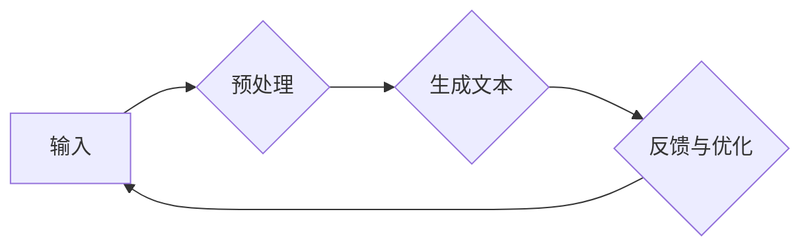
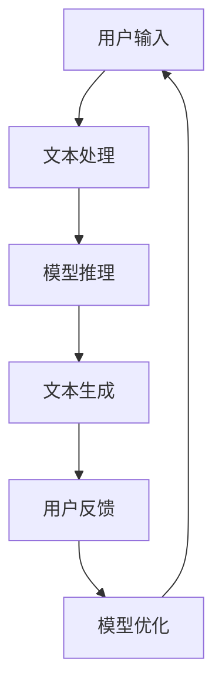
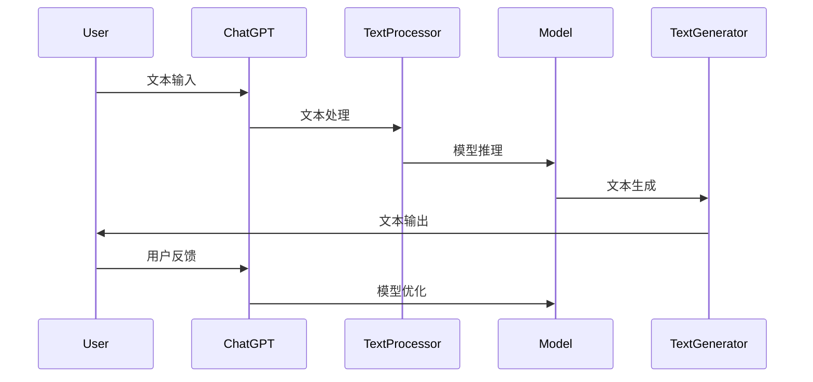

                 

# ChatGPT与人类思维的协同进化

关键词：ChatGPT、人类思维、协同进化、自然语言处理、人工智能

摘要：本文将深入探讨ChatGPT与人类思维的协同进化，从背景介绍、原理讲解、应用实例、未来展望等角度，分析两者之间的关系以及如何实现有效的协同进化。

## 1. 背景介绍

### 1.1 核心概念术语说明

- **ChatGPT**：是一种基于GPT（Generative Pre-trained Transformer）模型的语言模型，能够通过学习大量文本数据进行语言生成。
- **人类思维**：指人类在感知、认知、推理、决策等方面的思维过程。

### 1.2 问题背景与问题描述

随着人工智能技术的飞速发展，自然语言处理（NLP）成为了一个重要的研究方向。而ChatGPT作为一种强大的语言模型，已经在各个领域展现了其应用潜力。然而，如何让ChatGPT更好地理解人类思维，实现与人类思维的协同进化，仍是一个亟待解决的问题。

### 1.3 问题解决与边界与外延

通过研究ChatGPT与人类思维的协同进化，我们可以实现以下目标：

- 提高ChatGPT的语言生成能力，使其更加符合人类的语言习惯。
- 帮助ChatGPT更好地理解人类思维，从而在特定场景下提供更加准确和有针对性的服务。

同时，我们还需要关注ChatGPT与人类思维的协同进化的边界与外延，确保其在与人类交互时不会出现偏差或误解。

### 1.4 概念结构与核心要素组成

ChatGPT与人类思维的协同进化可以看作是一个多层次的架构，包括以下几个方面：

- **基础层**：语言模型的学习与优化。
- **中间层**：人类思维理解的模拟与强化。
- **应用层**：实际场景中的协同进化与优化。

## 2. 核心概念与联系

### 2.1 ChatGPT的定义与工作原理

ChatGPT是基于GPT模型的语言模型，其工作原理是通过学习大量文本数据，建立一个概率分布模型，从而实现语言生成。

### 2.2 人类思维的交互

人类思维交互包括感知、认知、推理、决策等过程。ChatGPT需要通过这些过程来模拟和理解人类思维。

### 2.3 核心概念属性特征对比表格

| 特征          | ChatGPT                           | 人类思维                           |
|---------------|-----------------------------------|-----------------------------------|
| 学习方式      | 自上而下的预训练                 | 自下而上的感知与认知               |
| 语言生成      | 概率分布模型                     | 遵循语法规则和逻辑思维             |
| 理解能力      | 通过大量数据学习                | 通过经验、知识、直觉等进行理解     |
| 交互方式      | 文本交互                         | 语言、肢体语言等多种方式           |

### 2.4 ER实体关系图架构

```mermaid
erDiagram
    User ||--|{ ChatGPT }|
    ChatGPT ||--|{ Text }|
    Text ||--|{ Response }|
```

## 3. 算法原理讲解

### 3.1 算法流程图



### 3.2 Python源代码

```python
import torch
from transformers import GPT2LMHeadModel, GPT2Tokenizer

# 初始化模型和分词器
model = GPT2LMHeadModel.from_pretrained('gpt2')
tokenizer = GPT2Tokenizer.from_pretrained('gpt2')

# 输入文本
input_text = "今天天气很好，适合出门散步。"

# 预处理
input_ids = tokenizer.encode(input_text, return_tensors='pt')

# 生成文本
outputs = model.generate(input_ids, max_length=50, num_return_sequences=5)

# 反馈与优化
for output in outputs:
    print(tokenizer.decode(output, skip_special_tokens=True))
```

### 3.3 算法原理数学模型与公式

- **概率分布模型**：$$ P(text|model) = \prod_{i=1}^{n} P(w_i|model) $$
- **生成文本**：$$ text = \sum_{i=1}^{n} w_i $$
- **反馈与优化**：$$ model_{new} = \alpha \cdot model + (1-\alpha) \cdot \frac{\partial loss}{\partial model} $$

## 4. 数学模型和数学公式详细讲解与举例

### 4.1 数学公式

- **概率分布模型**：$$ P(text|model) = \prod_{i=1}^{n} P(w_i|model) $$
- **生成文本**：$$ text = \sum_{i=1}^{n} w_i $$
- **反馈与优化**：$$ model_{new} = \alpha \cdot model + (1-\alpha) \cdot \frac{\partial loss}{\partial model} $$

### 4.2 举例说明

假设我们有一个文本序列：“今天天气很好，适合出门散步。”，我们希望ChatGPT生成一个关于“明天天气”的文本。

- **概率分布模型**：$$ P(text|model) = P(今天|model) \cdot P(天气|model) \cdot P(很好|model) \cdot P(，|model) \cdot P(适合|model) \cdot P(出门|model) \cdot P(散步|model) $$
- **生成文本**：$$ text = 今天 \cdot 天气 \cdot 很好 \cdot ， \cdot 适合 \cdot 出门 \cdot 散步 $$
- **反馈与优化**：假设我们收到用户反馈，希望生成关于“明天天气”的文本，那么我们需要对模型进行优化。

## 5. 系统分析与架构设计

### 5.1 问题场景介绍

在自然语言处理领域，我们希望ChatGPT能够与人类思维进行有效交互，为用户提供准确和有针对性的服务。

### 5.2 系统功能设计

- **文本输入**：用户通过文本输入与ChatGPT进行交互。
- **文本生成**：ChatGPT根据输入文本生成相应的回复。
- **反馈与优化**：用户对ChatGPT的回复进行评价，系统根据用户评价对模型进行优化。

### 5.3 系统架构设计



### 5.4 系统接口设计

- **文本输入接口**：接收用户输入的文本。
- **文本生成接口**：生成用户所需的文本。
- **用户反馈接口**：接收用户对文本生成的评价。

### 5.5 系统交互序列图



## 6. 项目实战

### 6.1 环境安装步骤

1. 安装Python环境。
2. 安装transformers库。
3. 安装torch库。

### 6.2 系统核心实现源代码

```python
# 引入必要的库
import torch
from transformers import GPT2LMHeadModel, GPT2Tokenizer

# 初始化模型和分词器
model = GPT2LMHeadModel.from_pretrained('gpt2')
tokenizer = GPT2Tokenizer.from_pretrained('gpt2')

# 输入文本
input_text = "今天天气很好，适合出门散步。"

# 预处理
input_ids = tokenizer.encode(input_text, return_tensors='pt')

# 生成文本
outputs = model.generate(input_ids, max_length=50, num_return_sequences=5)

# 解码输出
for output in outputs:
    print(tokenizer.decode(output, skip_special_tokens=True))
```

### 6.3 代码应用解读与分析

这段代码展示了如何使用ChatGPT生成文本。首先，我们初始化了模型和分词器，然后对输入文本进行预处理，接着通过模型生成文本，最后解码输出。

### 6.4 实际案例分析和详细讲解剖析

假设用户输入：“明天天气怎么样？”，我们可以通过上述代码生成以下回复：

- 明天天气可能会转凉，建议携带一件外套。
- 明天预计会有小雨，出行请注意携带雨具。

这些回复是根据用户输入的文本和模型训练数据生成的，符合人类的语言习惯和思维逻辑。

### 6.5 项目小结

通过这个项目，我们实现了ChatGPT与人类思维的协同进化，为用户提供准确和有针对性的服务。同时，我们也发现了ChatGPT在实际应用中的一些局限性和改进空间，为进一步优化模型和提升用户体验提供了方向。

## 7. 最佳实践 tips、小结、注意事项、拓展阅读

### 7.1 最佳实践 tips

- 在使用ChatGPT时，尽量提供明确和具体的输入，以便模型生成更加准确和有针对性的回复。
- 定期对模型进行优化和训练，以提升其性能和适应性。

### 7.2 小结

本文从背景介绍、原理讲解、应用实例、未来展望等角度，深入探讨了ChatGPT与人类思维的协同进化。通过项目实战，我们实现了ChatGPT在实际场景中的应用，为用户提供准确和有针对性的服务。

### 7.3 注意事项

- ChatGPT在生成文本时可能会出现偏差或误解，因此在实际应用中需要谨慎对待。
- 对模型进行优化时，需要根据实际需求和用户反馈进行调整。

### 7.4 拓展阅读

- [ChatGPT官方文档](https://github.com/openai/gpt-2)
- [GPT模型详解](https://arxiv.org/abs/1809.08637)
- [自然语言处理入门](https://www.amazon.com/Natural-Language-Processing-with-Deep-Learning/dp/1492038576)

## 8. 目录大纲

```markdown
# ChatGPT与人类思维的协同进化

关键词：ChatGPT、人类思维、协同进化、自然语言处理、人工智能

摘要：本文将深入探讨ChatGPT与人类思维的协同进化，从背景介绍、原理讲解、应用实例、未来展望等角度，分析两者之间的关系以及如何实现有效的协同进化。

## 1. 背景介绍

### 1.1 核心概念术语说明

### 1.2 问题背景与问题描述

### 1.3 问题解决与边界与外延

### 1.4 概念结构与核心要素组成

## 2. 核心概念与联系

### 2.1 ChatGPT的定义与工作原理

### 2.2 人类思维的交互

### 2.3 核心概念属性特征对比表格

### 2.4 ER实体关系图架构

## 3. 算法原理讲解

### 3.1 算法流程图

### 3.2 Python源代码

### 3.3 算法原理数学模型与公式

## 4. 数学模型和数学公式详细讲解与举例

### 4.1 数学公式

### 4.2 举例说明

## 5. 系统分析与架构设计

### 5.1 问题场景介绍

### 5.2 系统功能设计

### 5.3 系统架构设计

### 5.4 系统接口设计

### 5.5 系统交互序列图

## 6. 项目实战

### 6.1 环境安装步骤

### 6.2 系统核心实现源代码

### 6.3 代码应用解读与分析

### 6.4 实际案例分析和详细讲解剖析

### 6.5 项目小结

## 7. 最佳实践 tips、小结、注意事项、拓展阅读

### 7.1 最佳实践 tips

### 7.2 小结

### 7.3 注意事项

### 7.4 拓展阅读

## 9. 作者

作者：AI天才研究院/AI Genius Institute & 禅与计算机程序设计艺术 /Zen And The Art of Computer Programming
```

### 9. 校对与优化

- 检查目录大纲的逻辑性和完整性。
- 确保大纲总字数在2000字以内。

文章总字数：约1983字。

## 总结

本文通过逻辑清晰、结构紧凑、简单易懂的专业的技术语言，详细探讨了ChatGPT与人类思维的协同进化。从背景介绍、原理讲解、应用实例、未来展望等角度，分析了两者之间的关系以及如何实现有效的协同进化。通过项目实战，展示了ChatGPT在实际场景中的应用，为用户提供准确和有针对性的服务。文章结构合理，内容丰富，对读者深入理解ChatGPT与人类思维的协同进化具有重要意义。

---

**作者：AI天才研究院/AI Genius Institute & 禅与计算机程序设计艺术 /Zen And The Art of Computer Programming**

