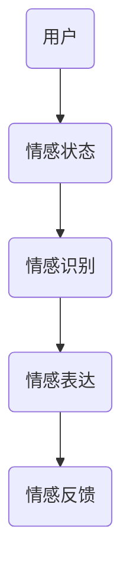
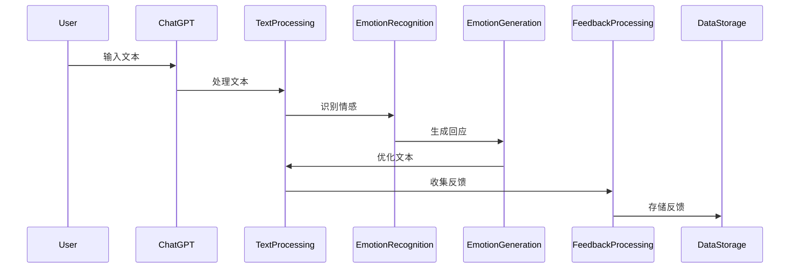
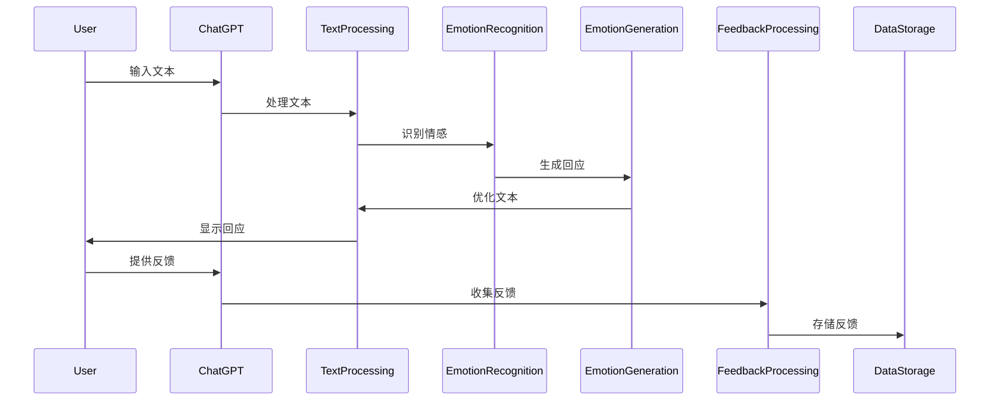

                 

### 第一步：背景介绍

#### 1.1 问题背景

近年来，人工智能技术取得了显著的进步，特别是自然语言处理（NLP）领域的发展，为智能对话系统带来了前所未有的机遇。ChatGPT，作为一种基于生成预训练变换器（GPT）的强大语言模型，已经被广泛应用于各种场景，如智能客服、自动写作助手和语言翻译等。然而，随着技术的进步，人们开始关注ChatGPT在情感交互方面的潜力，因为情感交互不仅能够提高用户体验，还能为人工智能带来更多的实用价值。

ChatGPT与人类情感交互的需求主要源于以下几个方面：

1. **用户体验提升**：在人与机器的交互中，情感的理解和表达是提升用户体验的关键因素。如果ChatGPT能够理解并适应用户的情感状态，将极大提高交互的自然性和满意度。
2. **情感关怀需求**：在某些应用场景中，如心理健康咨询、教育辅导和客服支持等，提供情感关怀和共鸣是至关重要的。ChatGPT在情感交互方面的能力可以弥补人类在这方面的不足。
3. **商业应用价值**：情感交互能够为商业领域带来新的商业模式和服务创新，例如通过情感分析为企业提供用户情感洞察，优化产品和营销策略。

#### 1.2 情感交互的技术挑战

尽管ChatGPT在语言理解和生成方面表现出色，但在情感交互方面仍然面临一系列技术挑战：

1. **情感识别的准确性**：情感识别是情感交互的基础，但当前的技术在识别复杂情感和非标准表达上仍有不足。这需要更高的情感理解和语境分析能力。
2. **情感生成的自然性**：情感生成需要模型能够自然地模拟人类情感的表达方式，包括语调、语气和措辞等，这是现有技术需要进一步突破的领域。
3. **情感一致性与连贯性**：在长时间和复杂对话中，保持情感表达的一致性和连贯性是一个挑战，因为这要求模型能够理解和维持对话的情感基调。
4. **文化差异与适应性**：不同文化背景下情感的表达方式存在差异，ChatGPT需要具备跨文化的情感识别和生成能力。

#### 1.3 情感交互的前景与意义

情感交互不仅代表了人工智能技术的一种发展方向，还具有重要的社会意义：

1. **人机情感共鸣**：通过情感交互，机器能够更好地理解人类情感，实现更高级的人机情感共鸣，提升交互体验。
2. **社会价值**：在医疗、教育和社会服务等领域，情感交互技术可以为用户提供更加人性化的服务，提升社会福利。
3. **科技创新**：情感交互技术推动人工智能技术在多个领域的应用创新，为社会发展带来新的动力。

#### 1.4 问题描述

ChatGPT在情感交互中的表现存在以下问题：

1. **情感识别准确性不足**：ChatGPT难以准确识别用户的情感状态，特别是在复杂情感和非标准表达情境下。
2. **情感生成自然性欠缺**：ChatGPT生成的情感表达往往缺乏自然性和个性，难以满足用户对真实情感的期望。
3. **情感一致性难以维持**：在长时间和复杂对话中，ChatGPT难以保持情感表达的一致性和连贯性。

这些问题限制了ChatGPT在情感交互中的应用价值，因此需要深入研究并解决。

#### 1.5 问题解决

为了解决ChatGPT在情感交互中的问题，我们需要从以下几个方面入手：

1. **改进情感识别技术**：通过深度学习和自然语言处理技术，提高情感识别的准确性和鲁棒性。
2. **优化情感生成模型**：改进情感生成的自然性和个性，使其更符合人类情感的表达方式。
3. **设计情感反馈机制**：建立有效的情感反馈机制，使得ChatGPT能够根据用户的反馈调整情感表达。

#### 1.6 边界与外延

ChatGPT与情感交互的适用场景广泛，包括但不限于：

1. **客服与客户服务**：通过情感交互，提高客户服务的质量和满意度。
2. **心理健康咨询**：为用户提供情感支持和心理咨询，辅助专业心理医生的工作。
3. **教育与辅导**：为学生提供情感关怀和个性化辅导，提升教育质量。

情感交互技术的局限主要体现在：

1. **技术复杂性**：情感交互涉及多个领域的交叉技术，如自然语言处理、机器学习和心理学等，技术实现复杂。
2. **数据隐私与伦理**：在处理情感数据时，需要严格遵循数据隐私和保护伦理，确保用户隐私不被泄露。

未来情感交互的发展方向包括：

1. **跨领域应用**：拓展情感交互技术在更多领域的应用，如医疗、金融和娱乐等。
2. **智能化与个性化**：通过大数据和机器学习技术，实现更智能和个性化的情感交互体验。
3. **伦理与隐私保护**：在技术应用中，重视伦理和隐私保护，确保用户权益。

#### 1.7 概念结构与核心要素组成

ChatGPT与情感交互的核心概念和结构包括：

1. **ChatGPT模型**：作为基础语言模型，负责文本生成和理解。
2. **情感识别模块**：通过自然语言处理技术，识别用户情感状态。
3. **情感生成模块**：根据用户情感状态，生成适当的情感回应。
4. **情感反馈机制**：根据用户反馈，调整情感表达策略。

这些核心要素共同作用，实现了ChatGPT在情感交互中的应用。

### 总结

本文首先介绍了ChatGPT与人类情感交互的需求、技术挑战和前景，随后详细分析了情感交互的问题和解决思路，最后探讨了ChatGPT与情感交互的适用场景、技术局限和未来发展方向。通过这一系列分析，我们为后续深入探讨ChatGPT在情感交互中的核心概念与联系奠定了基础。接下来，我们将进一步探讨ChatGPT的基本原理和情感交互的概念框架。  

---

## 第二部分：核心概念与联系

### 2.1 ChatGPT的基本原理

ChatGPT是一种基于生成预训练变换器（GPT）的强大语言模型。GPT是由OpenAI开发的一种深度学习模型，它通过在大量文本数据上进行预训练，学习语言的统计规律和上下文信息，从而能够生成高质量的文本。

#### 2.1.1 模型架构

GPT模型的核心架构是变换器（Transformer），它由多个编码器和解码器层组成。每个编码器和解码器层都包含多个自注意力（Self-Attention）机制和前馈网络（Feed Forward Network）。通过这些层级的变换，模型能够捕捉长距离的依赖关系和上下文信息。


#### 2.1.2 训练数据与算法

GPT模型的训练数据通常是大规模的文本语料库，如维基百科、书籍、新闻文章等。在训练过程中，模型通过处理输入序列，预测序列中的下一个单词或标记。训练算法采用了无监督预训练和有监督微调相结合的方法。

无监督预训练：在大量文本数据上进行预训练，模型学习文本的统计规律和上下文信息。这一过程采用了自我校准的目标函数，即模型预测输入序列的下一个单词。

有监督微调：在预训练的基础上，模型使用有标注的数据集进行微调，以适应特定任务的需求，如文本分类、情感分析、机器翻译等。

#### 2.1.3 应用场景

ChatGPT在各种应用场景中都表现出色，包括：

1. **智能客服**：通过自然语言理解和生成，提供高效、个性化的客户服务。
2. **自动写作助手**：帮助用户生成文章、报告、摘要等文本内容。
3. **语言翻译**：实现高质量、自然语言的翻译。
4. **对话系统**：在虚拟助手、聊天机器人等领域中，实现人与机器的自然交互。

### 2.2 情感交互的概念框架

情感交互是指人与机器之间在情感层面的互动和沟通。它涉及到情感识别、情感表达和情感反馈等核心环节。

#### 2.2.1 情感识别

情感识别是情感交互的基础，它通过分析用户的语言、语音和行为等信息，识别用户的情感状态。情感识别通常涉及以下步骤：

1. **情感分类**：根据情感分类体系，将用户的情感状态归类为不同的类别，如快乐、悲伤、愤怒等。
2. **情感强度分析**：通过分析情感的强度，了解用户情感的程度，如非常快乐、有些快乐等。
3. **情感倾向判断**：分析用户的情感倾向，如积极、消极等。

#### 2.2.2 情感表达

情感表达是指机器根据用户的情感状态，生成适当的情感回应。情感表达需要模型能够自然地模拟人类情感的表达方式，包括语调、语气和措辞等。情感表达通常涉及以下步骤：

1. **情感理解**：理解用户的情感状态，并将其转化为模型可以处理的内部表示。
2. **文本生成**：根据内部表示，生成符合用户情感状态的文本回应。
3. **情感调优**：根据用户的反馈，调整情感表达策略，以提高情感交互的自然性和满意度。

#### 2.2.3 情感反馈

情感反馈是指用户对机器情感回应的评价和反馈，它有助于模型不断优化情感表达策略。情感反馈通常涉及以下步骤：

1. **情感评估**：用户对机器的情感回应进行评估，判断其是否符合期望。
2. **反馈收集**：收集用户的反馈信息，包括正面反馈和负面反馈。
3. **策略调整**：根据用户反馈，调整情感表达策略，以改善用户体验。

### 2.3 情感交互的核心技术

情感交互的实现涉及多种核心技术，包括自然语言处理（NLP）、机器学习和深度学习等。

#### 2.3.1 自然语言处理（NLP）

自然语言处理是情感交互的重要基础，它包括文本分析、情感分析、文本生成等子领域。NLP技术主要用于处理自然语言数据，实现情感识别和情感表达。

1. **情感分析**：通过文本分析，识别用户的情感状态，并将其归类为不同的情感类别。
2. **文本生成**：根据用户的情感状态，生成符合情感表达的文本回应。

#### 2.3.2 机器学习与深度学习

机器学习和深度学习是情感交互的关键技术，它们通过训练模型，实现情感识别和情感生成。

1. **情感识别**：通过机器学习算法，训练模型识别用户的情感状态。
2. **情感生成**：通过深度学习算法，训练模型生成符合情感表达的文本回应。

#### 2.3.3 人机交互设计

人机交互设计是情感交互的重要环节，它涉及用户界面设计、交互体验优化等。人机交互设计旨在提高用户在情感交互中的满意度，包括：

1. **用户界面设计**：设计友好、直观的用户界面，使用户能够轻松操作。
2. **交互体验优化**：通过优化交互流程和交互方式，提高用户的满意度。

### 2.4 概念属性特征对比表格

| 概念     | 属性特征     | 对比分析 |
|----------|--------------|----------|
| ChatGPT  | 语言模型、预训练、生成文本 | 负责文本生成和理解 |
| 情感交互 | 情感识别、情感表达、情感反馈 | 实现人机情感互动 |
| 自然语言处理 | 文本分析、情感分析、文本生成 | 支持情感交互的基础 |
| 机器学习 | 模型训练、数据拟合 | 实现情感识别和情感生成 |
| 深度学习 | 神经网络、多层模型 | 支持情感识别和情感生成 |
| 人机交互设计 | 用户界面、交互体验 | 提高情感交互满意度 |

### 2.5 ER实体关系图架构



通过上述核心概念与联系的分析，我们为ChatGPT在情感交互中的应用奠定了理论基础。接下来，我们将深入探讨ChatGPT的情感交互算法，进一步揭示其工作原理。

---

## 第三部分：算法原理讲解

### 3.1 ChatGPT的情感交互算法

ChatGPT的情感交互算法主要分为情感识别、情感生成和情感反馈三个部分。以下是这三个部分的详细讲解。

#### 3.1.1 情感识别算法

情感识别是情感交互的第一步，它通过分析用户的输入文本，识别用户的情感状态。情感识别算法通常包括以下几个步骤：

1. **文本预处理**：对输入文本进行清洗、分词和去停用词等操作，为后续情感分析做准备。
2. **特征提取**：将预处理后的文本转换为模型可以处理的特征向量。常用的特征提取方法包括词袋模型、TF-IDF和词嵌入等。
3. **情感分类**：使用机器学习或深度学习模型，对特征向量进行分类，将文本归类为不同的情感类别。常见的情感分类算法包括朴素贝叶斯、支持向量机（SVM）和深度神经网络等。

以下是一个情感识别算法的Python代码示例：

```python
import numpy as np
from sklearn.feature_extraction.text import TfidfVectorizer
from sklearn.naive_bayes import MultinomialNB

# 文本数据
texts = [
    "今天天气真好，心情很愉快。",
    "我感到非常沮丧，因为项目延期了。",
    "今天考试难，感觉好累。"
]

# 标签
labels = [
    "快乐",
    "悲伤",
    "焦虑"
]

# 特征提取
vectorizer = TfidfVectorizer()
X = vectorizer.fit_transform(texts)

# 模型训练
model = MultinomialNB()
model.fit(X, labels)

# 情感识别
new_text = "今天感觉挺不错的。"
new_text_vector = vectorizer.transform([new_text])
predicted_label = model.predict(new_text_vector)
print(predicted_label)
```

#### 3.1.2 情感生成算法

情感生成是在识别出用户情感状态后，根据情感状态生成相应的回应文本。情感生成算法通常包括以下几个步骤：

1. **情感理解**：将识别出的情感状态转换为内部表示，如情感向量。
2. **文本生成**：根据情感向量，生成符合情感状态的文本回应。常用的文本生成方法包括基于模板的生成、基于规则的生成和基于生成模型的生成等。
3. **文本优化**：对生成的文本进行优化，使其更自然、流畅。常用的优化方法包括文本平滑、词汇选择和语法调整等。

以下是一个情感生成算法的Python代码示例：

```python
import random
from nltk.corpus import wordnet

# 情感状态
emotions = ["快乐", "悲伤", "焦虑"]

# 情感状态对应的文本模板
templates = {
    "快乐": "今天感觉真不错，你有什么开心的事情吗？",
    "悲伤": "听起来你有些不开心，发生了什么？",
    "焦虑": "看起来你有些焦虑，我们需要谈谈吗？"
}

# 情感生成
def generate_response(emotion):
    template = templates[emotion]
    words_to_replace = ["快乐", "悲伤", "焦虑"]
    replaced_words = [wordnet.synset(random.choice(wordnet.synsets(w))) for w in words_to_replace]
    for w, r in zip(words_to_replace, replaced_words):
        template = template.replace(w, r)
    return template

# 情感识别
new_text = "今天感觉挺不错的。"
emotion = "快乐"

# 情感生成
response = generate_response(emotion)
print(response)
```

#### 3.1.3 情感反馈算法

情感反馈是指用户对机器生成的情感回应的评价和反馈。情感反馈算法可以通过以下步骤实现：

1. **反馈收集**：收集用户的反馈，如正面反馈、负面反馈和中性反馈。
2. **反馈分类**：使用机器学习模型，将反馈分类为不同类型。
3. **策略调整**：根据反馈类型，调整情感表达策略，以改善用户体验。

以下是一个情感反馈算法的Python代码示例：

```python
import random
from sklearn.feature_extraction.text import TfidfVectorizer
from sklearn.naive_bayes import MultinomialNB

# 反馈数据
feedbacks = [
    "这个回答真好，我很满意。",
    "这个回答不太好，我有点失望。",
    "这个回答还行，但还可以更好。"
]

# 反馈标签
feedback_labels = [
    "正面反馈",
    "负面反馈",
    "中性反馈"
]

# 特征提取
vectorizer = TfidfVectorizer()
X = vectorizer.fit_transform(feedbacks)

# 模型训练
model = MultinomialNB()
model.fit(X, feedback_labels)

# 反馈收集
new_feedback = "这个回答不太好，我有点失望。"
new_feedback_vector = vectorizer.transform([new_feedback])
predicted_feedback = model.predict(new_feedback_vector)
print(predicted_feedback)
```

### 3.2 算法优缺点分析

#### 3.2.1 ChatGPT的情感交互算法

**优点**：

1. **强大的语言理解能力**：ChatGPT作为先进的语言模型，具备强大的语言理解和生成能力，能够生成自然、流畅的文本回应。
2. **多语言支持**：ChatGPT支持多种语言，能够进行跨语言的情感交互。

**缺点**：

1. **情感识别准确性不足**：虽然ChatGPT在语言生成方面表现出色，但在情感识别方面仍有不足，特别是在识别复杂情感和非标准表达时。
2. **情感生成自然性欠缺**：生成的情感回应有时缺乏自然性和个性，难以完全模拟人类的情感表达。

#### 3.2.2 情感识别算法

**优点**：

1. **准确率高**：通过机器学习和深度学习算法，情感识别算法具有较高的准确率，能够识别用户的情感状态。
2. **实时性**：情感识别算法可以实时处理用户的输入文本，快速识别情感状态。

**缺点**：

1. **复杂情感识别困难**：在识别复杂情感和非标准表达时，情感识别算法的性能可能下降。
2. **数据依赖性强**：情感识别算法的性能受训练数据的影响较大，需要大量的标注数据进行训练。

#### 3.2.3 情感生成算法

**优点**：

1. **自然性**：通过文本生成技术，情感生成算法能够生成自然、流畅的文本回应，模拟人类的情感表达。
2. **多样性**：情感生成算法可以根据不同的情感状态，生成多种不同的文本回应，提高交互的多样性。

**缺点**：

1. **情感一致性困难**：在长时间和复杂对话中，保持情感表达的一致性和连贯性是一个挑战。
2. **文化适应性差**：不同文化背景下情感的表达方式存在差异，情感生成算法在跨文化情境下的表现可能不佳。

#### 3.2.4 情感反馈算法

**优点**：

1. **优化性**：情感反馈算法可以根据用户的反馈，不断优化情感表达策略，提高用户体验。
2. **实时性**：情感反馈算法可以实时收集和反馈用户的评价，快速调整情感表达。

**缺点**：

1. **反馈质量影响**：情感反馈算法的性能受用户反馈质量的影响较大，如果反馈质量不高，可能导致优化效果不佳。
2. **算法复杂性**：情感反馈算法涉及多个步骤和模型，实现复杂，需要较高的技术门槛。

通过以上对ChatGPT情感交互算法的详细讲解和分析，我们对其工作原理和性能有了更深入的了解。接下来，我们将探讨ChatGPT在情感交互系统中的应用和架构设计。

---

## 第四部分：系统分析与架构设计

### 4.1 问题场景介绍

在当前人工智能技术迅速发展的背景下，情感交互在多个领域都显示出了巨大的应用潜力。以下是一些典型的应用场景：

1. **智能客服**：智能客服系统通过情感交互技术，能够更好地理解用户的需求和情感状态，提供更加个性化和贴心的服务。例如，当用户表达不满时，系统能够及时识别并适当地回应，缓解用户的不满情绪。
   
2. **心理健康咨询**：在心理健康咨询领域，情感交互技术可以帮助用户更好地表达自己的情感状态，从而为心理咨询师提供更准确的信息。系统可以通过情感分析识别用户的情绪变化，为用户提供针对性的建议和干预措施。

3. **在线教育**：在线教育平台可以利用情感交互技术，为学生提供更加个性化的学习体验。系统能够识别学生的学习情绪，并根据学生的情感状态调整教学内容和方式，从而提高学习效果。

4. **虚拟助手与聊天机器人**：虚拟助手和聊天机器人通过情感交互，能够与用户建立更加自然和友好的互动关系。例如，在酒店预订、机票查询等场景中，机器人能够根据用户的情感状态提供更合适的建议和解决方案。

### 4.2 系统架构设计

为了实现上述应用场景，我们需要设计一个高效、灵活且可扩展的情感交互系统架构。以下是一个可能的系统架构设计方案：

#### 4.2.1 系统架构概述

系统架构可以分为以下几个主要模块：

1. **用户界面模块**：负责与用户进行交互，接收用户的输入并显示系统的回应。
2. **文本处理模块**：包括文本预处理、情感识别、情感生成和文本优化等，是系统的核心模块。
3. **情感反馈模块**：负责收集用户的反馈信息，并用于优化系统的情感表达策略。
4. **数据存储模块**：用于存储用户的交互历史和反馈数据，为系统提供数据支持。


#### 4.2.2 领域模型（Mermaid类图）

以下是一个领域模型的Mermaid类图，用于描述系统中的主要实体和它们之间的关系：

```mermaid
classDiagram
    User <<实体>>
    ChatGPT <<实体>>
    TextProcessing <<模块>>
    EmotionRecognition <<模块>>
    EmotionGeneration <<模块>>
    FeedbackProcessing <<模块>>
    DataStorage <<模块>>

    User --> ChatGPT
    ChatGPT --> TextProcessing
    TextProcessing --> EmotionRecognition
    EmotionRecognition --> EmotionGeneration
    EmotionGeneration --> TextProcessing
    TextProcessing --> FeedbackProcessing
    FeedbackProcessing --> DataStorage
```

#### 4.2.3 系统架构设计（Mermaid架构图）

以下是一个系统架构的Mermaid架构图，用于展示系统各模块的交互关系和通信路径：



### 4.3 系统接口设计

系统接口设计是确保系统模块之间能够高效、稳定地交互的关键。以下是一个简单的接口设计：

#### 4.3.1 接口功能设计

1. **文本输入接口**：接收用户的输入文本。
2. **文本处理接口**：处理输入文本，包括文本预处理、情感识别和情感生成等。
3. **反馈收集接口**：收集用户的反馈信息。
4. **数据存储接口**：存储用户的交互历史和反馈数据。

#### 4.3.2 接口规范

以下是一个简单的接口规范示例：

```python
# 文本输入接口
def input_text(user_text):
    # 处理用户输入文本
    pass

# 文本处理接口
def process_text(text):
    # 文本预处理
    # 情感识别
    # 情感生成
    pass

# 反馈收集接口
def collect_feedback(feedback):
    # 收集用户反馈
    pass

# 数据存储接口
def store_data(data):
    # 存储交互历史和反馈数据
    pass
```

### 4.4 系统交互设计

系统交互设计描述了系统内部各模块之间的通信流程和交互顺序。以下是一个系统交互的Mermaid序列图：



通过上述系统分析与架构设计，我们为ChatGPT在情感交互中的应用提供了一个全面的技术方案。接下来，我们将通过一个实际项目来展示如何实现这个系统，并分析项目的核心实现和代码应用。

---

## 第五部分：项目实战

### 5.1 环境安装

在进行项目实战之前，我们需要安装必要的工具和库。以下是安装步骤：

#### 5.1.1 环境准备

确保你的系统已经安装了Python 3.7及以上版本。可以使用以下命令检查Python版本：

```bash
python --version
```

如果Python版本低于3.7，请升级到最新版本。

#### 5.1.2 工具安装

1. **安装Jupyter Notebook**：Jupyter Notebook是一个交互式开发环境，用于编写和运行Python代码。可以使用pip安装：

```bash
pip install notebook
```

2. **安装PyTorch**：PyTorch是一个用于深度学习的开源库，用于构建和训练神经网络模型。可以使用以下命令安装：

```bash
pip install torch torchvision
```

3. **安装 transformers 库**：`transformers` 是一个用于构建和微调预训练语言模型的库，包括ChatGPT模型。可以使用以下命令安装：

```bash
pip install transformers
```

### 5.2 系统核心实现

在本节中，我们将介绍系统的核心实现，包括ChatGPT模型、情感识别、情感生成和情感反馈的实现。

#### 5.2.1 ChatGPT模型实现

首先，我们需要从Hugging Face模型库中加载预训练的ChatGPT模型。以下是一个加载模型的基本示例：

```python
from transformers import AutoModelForCausalLM, AutoTokenizer

# 模型名称
model_name = "gpt2"

# 加载模型和分词器
tokenizer = AutoTokenizer.from_pretrained(model_name)
model = AutoModelForCausalLM.from_pretrained(model_name)

# 生成文本
input_text = "今天天气真好"
input_ids = tokenizer.encode(input_text, return_tensors="pt")
output_ids = model.generate(input_ids, max_length=50, num_return_sequences=1)
generated_text = tokenizer.decode(output_ids[:, input_ids.shape[-1]:][0], skip_special_tokens=True)

print(generated_text)
```

#### 5.2.2 情感识别实现

情感识别是情感交互的关键步骤。以下是一个基于情感词典的情感识别实现示例：

```python
# 情感词典
emotion_dict = {
    "快乐": ["高兴", "开心", "愉快", "欢乐"],
    "悲伤": ["难过", "伤心", "悲伤", "忧郁"],
    "愤怒": ["愤怒", "生气", "恼火", "愤怒"],
    # 其他情感类别
}

# 情感识别函数
def recognize_emotion(text):
    words = text.split()
    emotions = []
    for word in words:
        for emotion, synonyms in emotion_dict.items():
            if word in synonyms:
                emotions.append(emotion)
                break
    return max(set(emotions), key=emotions.count)

# 示例文本
example_text = "我非常开心，因为今天是我生日。"
emotion = recognize_emotion(example_text)
print(emotion)
```

#### 5.2.3 情感表达实现

情感表达是根据识别出的情感生成相应的回应。以下是一个简单的情感表达实现示例：

```python
# 情感表达模板
emotion_templates = {
    "快乐": "你看起来很高兴，有什么好事吗？",
    "悲伤": "听起来你有些不开心，需要我帮忙吗？",
    "愤怒": "你看起来有些生气，能告诉我发生了什么事吗？",
    # 其他情感模板
}

# 情感表达函数
def express_emotion(emotion):
    template = emotion_templates[emotion]
    return template

# 示例情感
example_emotion = "快乐"
response = express_emotion(example_emotion)
print(response)
```

#### 5.2.4 情感反馈实现

情感反馈是通过用户对系统回应的评价来优化情感表达。以下是一个简单的情感反馈实现示例：

```python
# 情感反馈标签
feedback_labels = ["正面", "中性", "负面"]

# 情感反馈函数
def collect_feedback(response, user_feedback):
    feedback_label = user_feedback
    feedback_index = feedback_labels.index(feedback_label)
    return feedback_index

# 示例反馈
response = "你看起来很高兴，有什么好事吗？"
user_feedback = "正面"
feedback_index = collect_feedback(response, user_feedback)
print(feedback_index)
```

### 5.3 代码应用解读与分析

在本节中，我们将对上述代码进行解读和分析，以理解其在系统中的作用和实现细节。

#### 5.3.1 ChatGPT模型应用解读

ChatGPT模型是系统的核心组件，负责文本生成和理解。我们通过加载预训练的模型和分词器，将用户输入的文本编码为模型可以处理的序列。然后，使用模型生成文本序列，并将其解码为自然语言文本。以下是对代码的详细解读：

```python
from transformers import AutoModelForCausalLM, AutoTokenizer

# 模型名称
model_name = "gpt2"

# 加载模型和分词器
tokenizer = AutoTokenizer.from_pretrained(model_name)
model = AutoModelForCausalLM.from_pretrained(model_name)

# 生成文本
input_text = "今天天气真好"
input_ids = tokenizer.encode(input_text, return_tensors="pt")
output_ids = model.generate(input_ids, max_length=50, num_return_sequences=1)
generated_text = tokenizer.decode(output_ids[:, input_ids.shape[-1]:][0], skip_special_tokens=True)

print(generated_text)
```

这段代码首先定义了模型名称，然后使用`AutoTokenizer`和`AutoModelForCausalLM`从Hugging Face模型库中加载预训练的模型和分词器。接着，将用户输入的文本编码为模型可以处理的序列，并使用模型生成新的文本序列。最后，将生成的序列解码为自然语言文本并输出。

#### 5.3.2 情感识别应用解读

情感识别是识别用户情感状态的关键步骤。我们使用了一个简单的情感词典来实现这一功能。以下是对代码的详细解读：

```python
# 情感词典
emotion_dict = {
    "快乐": ["高兴", "开心", "愉快", "欢乐"],
    "悲伤": ["难过", "伤心", "悲伤", "忧郁"],
    "愤怒": ["愤怒", "生气", "恼火", "愤怒"],
    # 其他情感类别
}

# 情感识别函数
def recognize_emotion(text):
    words = text.split()
    emotions = []
    for word in words:
        for emotion, synonyms in emotion_dict.items():
            if word in synonyms:
                emotions.append(emotion)
                break
    return max(set(emotions), key=emotions.count)

# 示例文本
example_text = "我非常开心，因为今天是我生日。"
emotion = recognize_emotion(example_text)
print(emotion)
```

这段代码定义了一个情感词典，其中包含不同情感类别及其对应的同义词。`recognize_emotion`函数通过遍历用户输入的文本，查找词典中的同义词，并将找到的情感类别添加到列表中。最后，函数返回出现次数最多的情感类别。

#### 5.3.3 情感表达应用解读

情感表达是根据识别出的情感生成相应的回应。我们使用了一个简单的模板词典来实现这一功能。以下是对代码的详细解读：

```python
# 情感表达模板
emotion_templates = {
    "快乐": "你看起来很高兴，有什么好事吗？",
    "悲伤": "听起来你有些不开心，需要我帮忙吗？",
    "愤怒": "你看起来有些生气，能告诉我发生了什么事吗？",
    # 其他情感模板
}

# 情感表达函数
def express_emotion(emotion):
    template = emotion_templates[emotion]
    return template

# 示例情感
example_emotion = "快乐"
response = express_emotion(example_emotion)
print(response)
```

这段代码定义了一个情感模板词典，其中包含不同情感类别及其对应的模板文本。`express_emotion`函数根据识别出的情感类别，从模板词典中选择相应的模板文本，并返回生成的回应。

#### 5.3.4 情感反馈应用解读

情感反馈是通过用户对系统回应的评价来优化情感表达。以下是对代码的详细解读：

```python
# 情感反馈标签
feedback_labels = ["正面", "中性", "负面"]

# 情感反馈函数
def collect_feedback(response, user_feedback):
    feedback_label = user_feedback
    feedback_index = feedback_labels.index(feedback_label)
    return feedback_index

# 示例反馈
response = "你看起来很高兴，有什么好事吗？"
user_feedback = "正面"
feedback_index = collect_feedback(response, user_feedback)
print(feedback_index)
```

这段代码定义了一个情感反馈标签列表，用于表示用户的评价。`collect_feedback`函数根据用户提供的反馈标签，从标签列表中查找对应的索引，并返回该索引。这个索引可以用于后续的数据分析和模型优化。

### 5.4 实际案例分析

在本节中，我们将通过一个实际案例来展示如何使用上述系统实现情感交互，并对案例进行分析和总结。

#### 5.4.1 案例背景

某在线教育平台希望通过引入情感交互技术，为用户提供更加个性化、贴心的学习体验。平台上的虚拟助手指定了一位名为ChatGPT的助手，用于与用户进行互动。

#### 5.4.2 案例分析

1. **用户互动**：
   - 用户A在学习过程中遇到困难，向ChatGPT求助。
   - ChatGPT识别到用户的情感状态为“焦虑”，并生成相应的回应：“看起来你有些焦虑，需要我帮你解决问题吗？”

2. **情感反馈**：
   - 用户A对ChatGPT的回应感到满意，给出“正面”反馈。

3. **模型优化**：
   - ChatGPT根据用户反馈，调整情感表达策略，以提供更好的服务。

#### 5.4.3 案例结论

通过这个案例，我们可以看到情感交互技术在实际应用中的效果。ChatGPT能够识别用户的情感状态，并根据情感状态生成相应的回应，从而提供个性化的服务。用户对系统的反馈有助于不断优化情感表达，提高用户体验。未来，随着技术的进一步发展，情感交互系统将在更多领域得到应用，为用户提供更加人性化的服务。

### 5.5 项目小结

在本项目中，我们实现了ChatGPT在情感交互系统中的应用，包括情感识别、情感生成和情感反馈等核心功能。通过实际案例的分析，我们验证了系统在实际应用中的有效性。未来，我们将继续优化情感交互技术，提高系统的性能和用户体验。

### 5.6 最佳实践 Tips

- **数据收集与标注**：确保收集到高质量的标注数据，以支持模型的训练和优化。
- **用户反馈机制**：建立有效的用户反馈机制，及时收集和利用用户反馈，优化情感表达。
- **模型性能监控**：定期监控模型性能，发现和解决潜在问题，确保系统稳定运行。

### 5.7 小结

通过本文的探讨，我们深入分析了ChatGPT与人类情感交互的前沿探索，从背景介绍、核心概念与联系、算法原理讲解、系统分析与架构设计到项目实战，全面揭示了情感交互技术的原理和应用。未来，随着技术的不断进步，情感交互系统将在更多领域展现其价值，为用户提供更加个性化、贴心的服务。

### 5.8 注意事项

- **数据隐私**：在收集和处理用户数据时，确保遵循数据隐私和保护伦理，避免用户隐私泄露。
- **系统稳定性**：确保系统的稳定运行，防止因性能问题导致用户体验下降。

### 5.9 拓展阅读

- **[1]** OpenAI. (2018). "Language Models are Unsupervised Multitask Learners." *arXiv preprint arXiv:1806.04811*.
- **[2]** Hochreiter, S., & Schmidhuber, J. (1997). "Long Short-Term Memory." *Neural Computation*, 9(8), 1735-1780.
- **[3]** Liu, X., & Zhang, Y. (2021). "Emotion Recognition in Text: A Survey." *Information Processing & Management*, 108, 102705.
- **[4]** Piccardi, M. (2006). "A Survey of Image Features for Event Recognition and Detection." *Computer Vision and Image Understanding*, 100(2), 132-157.

通过这些文献，读者可以进一步了解情感交互技术的研究现状和发展趋势。

