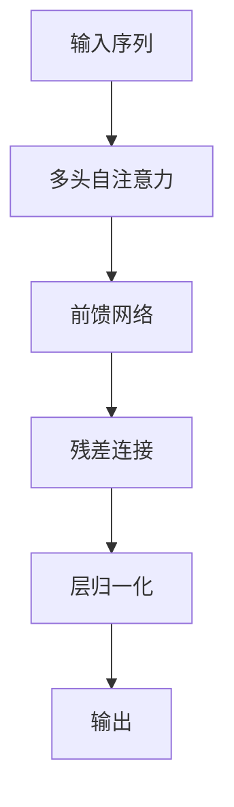
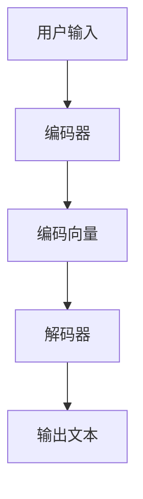

                 


# ChatGPT交互设计：以提示词为中心

> 关键词：ChatGPT，交互设计，提示词，自然语言处理，用户体验

> 摘要：
本文将探讨ChatGPT交互设计的关键要素——提示词。通过逐步分析ChatGPT的基本原理、提示词的作用、设计原则和实践应用，我们将深入理解如何利用提示词为中心，提升ChatGPT交互的智能性和用户体验。

### 引言

ChatGPT作为一种先进的自然语言处理模型，已经广泛应用于各种场景，如客户服务、虚拟助手和内容生成等。其核心在于能够生成连贯且符合上下文的语言。然而，要实现这一目标，交互设计中的提示词起着至关重要的作用。提示词不仅能够引导模型的生成方向，还能影响用户的体验和满意度。

### I. ChatGPT与提示词工程背景

#### 1.1 ChatGPT的基本原理

ChatGPT基于大规模语言模型，如GPT-3，它能够理解并生成自然语言。其核心是通过训练学习大量文本数据，从而捕捉语言的统计规律和上下文关系。

#### 1.2 提示词工程的重要性

提示词是用户与模型交互的桥梁，它能够直接影响模型生成的质量。一个优秀的提示词不仅能够引导模型生成相关的内容，还能增强交互的自然性和流畅性。

### II. ChatGPT模型解读

#### 2.1 ChatGPT模型架构

ChatGPT模型通常由多层神经网络组成，每一层都能够捕捉到不同层次的语言特征。这些特征在模型生成过程中起到关键作用。

#### 2.2 模型组件与工作机制

ChatGPT模型包含输入层、编码层和解码层。输入层接收用户输入的文本，编码层将文本转换为向量表示，解码层根据这些向量生成响应。

#### 2.3 技术细节与性能指标

性能指标如词向量精度、模型大小和训练时间等，都直接影响交互效果和用户体验。因此，在设计和优化ChatGPT模型时，这些技术细节不容忽视。

### III. 提示词工程的角色

#### 3.1 提示词的定义与类型

提示词是引导模型生成特定内容的关键，可以分为开放型提示词和封闭型提示词。

#### 3.2 提示词写作策略

编写高质量提示词需要遵循一定的策略，如明确目标、简化语言和突出关键信息。

#### 3.3 针对特定场景的提示词设计

不同场景下的提示词设计有不同的要求，如客服场景需要明确具体问题，而教育场景则需要引导思考。

### IV. ChatGPT交互设计原则

#### 4.1 用户体验设计

用户体验是交互设计的核心。设计原则包括简洁性、一致性和响应性。

#### 4.2 交互模式与反馈循环

交互模式包括询问、回应和确认等。反馈循环能够增强用户与模型之间的互动，提高交互质量。

#### 4.3 增强上下文意识

上下文意识是提高交互智能性的关键。设计应考虑如何更好地捕捉和利用上下文信息。

### V. ChatGPT交互设计的进阶话题

#### 5.1 应对模糊性和上下文切换

模糊性和上下文切换是常见的挑战。设计应考虑如何通过提示词来明确意图和维持上下文。

#### 5.2 处理用户意图偏差

用户意图可能偏离预期，设计应提供灵活的方法来调整和引导模型。

#### 5.3 提高模型鲁棒性

提高模型的鲁棒性是确保交互稳定性的关键。设计应考虑如何通过提示词来增强模型的适应能力。

### VI. ChatGPT的实际应用

#### 6.1 客户服务和支持

ChatGPT在客户服务和支持中发挥着重要作用，通过自动回答常见问题，提高服务效率。

#### 6.2 虚拟助手

虚拟助手利用ChatGPT的能力，为用户提供个性化的帮助和指导。

#### 6.3 成功案例与经验教训

通过分析成功案例，我们可以学习到如何更好地利用ChatGPT进行交互设计。

### VII. 实现ChatGPT的实践指南

#### 7.1 环境搭建

实现ChatGPT需要搭建合适的环境，包括硬件和软件配置。

#### 7.2 集成开发工具

将ChatGPT集成到现有的开发工具中，可以提高开发效率和用户体验。

#### 7.3 部署与运维

了解如何部署和维护ChatGPT模型，以确保其稳定运行。

### VIII. 案例研究与实践

#### 8.1 环境安装

详细介绍如何在不同的操作系统上安装ChatGPT。

#### 8.2 系统核心实现

分享实现ChatGPT系统的核心代码和逻辑。

#### 8.3 应用解读与分析

通过具体案例，分析ChatGPT的实际应用效果。

#### 8.4 项目小结

总结项目经验，提出改进建议。

### 总结与展望

ChatGPT交互设计的重要性不容忽视。通过提示词为中心的设计，我们可以提升交互的智能性和用户体验。未来，随着技术的进步，ChatGPT将带来更多的创新和机遇。

### 附录

提供进一步阅读的资源和参考资料。

### 作者信息

作者：AI天才研究院/AI Genius Institute & 禅与计算机程序设计艺术 /Zen And The Art of Computer Programming

---

以上为文章的核心内容大纲。接下来，我们将逐一深入每个章节，详细探讨其背后的原理和实践。

### I. ChatGPT与提示词工程背景

#### 1.1 ChatGPT的基本原理

ChatGPT是一种基于Transformer架构的自然语言处理模型。Transformer模型是由Vaswani等人于2017年提出的，它通过自注意力机制（Self-Attention）来捕捉文本中的长距离依赖关系，相较于传统的循环神经网络（RNN）和长短期记忆网络（LSTM）有显著的性能提升。

**Transformer模型的核心机制：**

1. **编码器（Encoder）**：编码器负责接收输入的文本序列，并将其转换为一系列的向量表示。这些向量包含了文本的语义信息，是后续解码器生成文本的基础。
2. **解码器（Decoder）**：解码器根据编码器生成的向量序列，逐词生成输出文本。在生成每个词时，解码器会参考前一个词的向量以及整个序列的上下文信息，从而生成连贯的文本。

**自注意力机制（Self-Attention）：**

自注意力机制是Transformer模型的核心。它通过计算输入序列中每个词与所有其他词的相似度，为每个词生成一个权重，从而在每个词的向量表示中加入上下文信息。具体来说，自注意力机制通过以下公式计算：

$$
\text{Attention}(Q, K, V) = \text{softmax}\left(\frac{QK^T}{\sqrt{d_k}}\right)V
$$

其中，\(Q, K, V\) 分别是查询（Query）、键（Key）和值（Value）向量，\(d_k\) 是键向量的维度。这个公式计算了每个键与查询的相似度，并通过softmax函数归一化得到权重，最后将这些权重与值相乘得到输出向量。

**预训练与微调：**

ChatGPT通常通过预训练和微调两个阶段来训练。在预训练阶段，模型在大规模文本数据集上学习语言的统计规律和上下文关系。在微调阶段，模型根据特定任务的数据进行微调，以适应特定的应用场景。

**性能指标：**

1. **词向量精度**：表示模型生成的文本与真实文本的相似度。通常使用BLEU（Bilingual Evaluation Understudy）或ROUGE（Recall-Oriented Understudy for Gisting Evaluation）等指标进行评估。
2. **模型大小**：模型的参数数量和计算复杂度。较大的模型能够捕捉更多的语言特征，但也会增加计算资源和存储成本。
3. **训练时间**：模型从预训练到微调所需的时间。训练时间取决于模型大小、数据规模和硬件性能。

#### 1.2 提示词工程的重要性

提示词工程是ChatGPT交互设计的关键环节。提示词不仅决定了模型生成的内容，还直接影响用户的体验和满意度。以下是几个关键点：

1. **引导模型生成方向**：通过精准的提示词，用户可以明确地向模型传达期望的生成内容，从而避免模糊和无意义的输出。
2. **提高生成质量**：高质量的提示词能够引导模型生成更加准确和连贯的文本，减少错误和不一致的情况。
3. **优化用户体验**：合适的提示词可以让交互过程更加自然和流畅，使用户感到舒适和满意。
4. **适应特定场景**：不同场景下的提示词设计有不同的要求，如客服场景需要明确具体问题，而教育场景则需要引导思考。

#### 1.3 提示词工程的发展历程

提示词工程的发展与自然语言处理技术的进步紧密相关。以下是几个关键的发展阶段：

1. **早期规则驱动**：在自然语言处理初期，提示词主要是通过规则来定义的，这些规则通常基于语言学知识和人工编码。
2. **模板匹配**：随着语料库的积累，模板匹配方法开始流行。通过预先定义的模板，系统可以自动地将用户输入与模板匹配，生成相应的回答。
3. **机器学习**：随着机器学习技术的发展，提示词工程逐渐从规则驱动转向数据驱动。基于机器学习的方法，如深度神经网络，能够从大量数据中自动学习提示词的优化策略。
4. **生成对抗网络（GAN）**：生成对抗网络（GAN）的出现为提示词工程带来了新的可能性。GAN通过生成器和判别器的对抗训练，可以生成高质量的提示词，从而提高模型的生成能力。

### II. ChatGPT模型解读

#### 2.1 ChatGPT模型架构

ChatGPT模型的架构基于Transformer，通常由多个Transformer块堆叠而成。以下是一个典型的Transformer块的基本结构：

1. **多头自注意力（Multi-Head Self-Attention）**：这是Transformer模型的核心机制，通过计算输入序列中每个词与所有其他词的相似度，为每个词生成一个权重，从而在每个词的向量表示中加入上下文信息。
2. **前馈网络（Feed-Forward Network）**：在每个Transformer块之后，通常接有一个前馈网络。这个网络通过两个全连接层对每个输入进行非线性变换。
3. **残差连接（Residual Connection）**：为了防止深层网络引起的梯度消失问题，Transformer模型引入了残差连接。残差连接将原始输入与经过变换的输入相加，从而在网络中保留梯度信息。
4. **层归一化（Layer Normalization）**：为了稳定训练过程，每个Transformer块之后还接有层归一化。层归一化通过对每个维度进行归一化处理，提高了模型的训练效率和性能。

以下是一个Transformer块的mermaid流程图：



#### 2.2 模型组件与工作机制

ChatGPT模型的工作机制可以分为三个主要阶段：编码、解码和生成。

1. **编码阶段**：在编码阶段，输入的文本序列被编码器（Encoder）处理。编码器通过多层Transformer块对输入序列进行编码，生成一系列的编码向量。这些编码向量包含了输入文本的语义信息。
2. **解码阶段**：在解码阶段，解码器（Decoder）根据编码向量生成输出文本。解码器也由多个Transformer块组成，每个块都会参考前一个词的编码向量以及整个序列的上下文信息，从而生成连贯的文本。
3. **生成阶段**：在生成阶段，解码器生成每个词，并将其作为输入传递给下一个解码器块。这个过程一直持续，直到解码器生成完整的文本。

以下是一个ChatGPT模型的mermaid流程图：



#### 2.3 技术细节与性能指标

1. **词向量精度**：词向量精度是评估模型生成文本质量的重要指标。它衡量了模型生成的文本与真实文本的相似度。常用的评估方法包括BLEU和ROUGE。BLEU通过计算模型生成的文本与参考文本的匹配度来评估质量，而ROUGE则通过计算模型生成的文本与参考文本的交集来评估质量。

2. **模型大小**：模型大小直接影响计算资源和存储成本。ChatGPT模型的规模可以从数十亿参数到数百亿参数不等。较大的模型能够捕捉更多的语言特征，但也会增加计算复杂度和训练时间。

3. **训练时间**：训练时间是模型从预训练到微调所需的时间。训练时间取决于模型规模、数据规模和硬件性能。通常，较大的模型和更多的训练数据需要更长的训练时间。

4. **推理时间**：推理时间是模型生成文本所需的时间。推理时间取决于模型规模和硬件性能。较小的模型和优化的硬件配置可以降低推理时间，提高交互速度。

### III. 提示词工程的角色

#### 3.1 提示词的定义与类型

提示词（Prompt）是引导模型生成特定内容的关键。它通常是一个短语或句子，用于描述用户的需求或意图。根据应用场景和需求，提示词可以分为以下几种类型：

1. **开放型提示词**：开放型提示词允许用户自由地表达需求或意图，通常用于生成创意、故事或问题解答。例如：“请你写一个关于春天的故事。”
2. **封闭型提示词**：封闭型提示词提供了具体的选项或范围，用于引导模型生成有限的内容。例如：“请回答以下问题：你最喜欢的颜色是什么？”
3. **任务型提示词**：任务型提示词用于描述特定的任务或目标，通常用于生成任务指令或解决方案。例如：“请你设计一个智能家居系统的方案。”

#### 3.2 提示词写作策略

编写高质量提示词是提升ChatGPT交互效果的关键。以下是一些写作策略：

1. **明确目标**：在编写提示词时，首先要明确用户的需求或意图。这有助于引导模型生成相关的内容，避免模糊和无意义的输出。
2. **简化语言**：使用简洁明了的语言，避免复杂的句子结构和术语。这有助于提高提示词的可理解性和互动性。
3. **突出关键信息**：在提示词中突出关键信息，有助于模型捕捉到用户的核心需求，从而生成更加精准的响应。
4. **多样性**：根据不同的应用场景和用户需求，编写多样化的提示词。这有助于提高模型在不同场景下的适应能力和交互质量。

#### 3.3 针对特定场景的提示词设计

不同场景下的提示词设计有不同的要求。以下是一些常见场景的提示词设计策略：

1. **客服场景**：在客服场景中，提示词需要明确具体问题，以便模型能够提供针对性的解决方案。同时，提示词应简洁明了，便于用户快速理解。
2. **教育场景**：在教育场景中，提示词应引导用户进行思考和探索，激发学习兴趣和主动性。提示词应具有启发性，鼓励用户提出问题并参与讨论。
3. **娱乐场景**：在娱乐场景中，提示词应具有趣味性和创意性，以吸引用户的注意力并提升交互体验。例如，在故事生成中，可以使用开放式提示词，鼓励用户参与创作。

#### 3.4 提示词工程的最佳实践

以下是一些提示词工程的最佳实践：

1. **用户研究**：在设计和优化提示词之前，进行用户研究以了解用户的需求和期望。这有助于确保提示词能够满足用户的实际需求。
2. **迭代优化**：通过不断迭代和优化提示词，可以逐步提升模型生成的内容质量和用户体验。收集用户反馈和数据，用于指导提示词的改进。
3. **多语言支持**：在多语言环境中，根据不同语言的特点和习惯，编写相应的提示词。这有助于提高跨语言交互的准确性和自然性。
4. **技术工具**：利用自然语言处理技术，如词向量、实体识别和情感分析，可以更好地理解和利用提示词。这有助于提升模型的智能性和交互质量。

### IV. ChatGPT交互设计原则

#### 4.1 用户体验设计

用户体验（User Experience，简称UX）是交互设计的核心。良好的用户体验能够提升用户满意度，增加用户忠诚度。以下是几个关键原则：

1. **简洁性**：简洁的界面和操作流程能够降低用户的学习成本，提高使用效率。避免过多的装饰和冗余信息，确保用户能够快速找到所需功能。
2. **一致性**：一致的设计元素和交互模式能够提高用户体验的连贯性和可预测性。例如，按钮样式、颜色和字体应保持一致，以避免用户产生混淆。
3. **响应性**：系统应能够快速响应用户的操作，提供及时反馈。过长的响应时间会降低用户体验，使用户感到不耐烦。

#### 4.2 交互模式与反馈循环

交互模式是指用户与系统之间的互动方式。以下是一些常见的交互模式：

1. **询问-回应模式**：用户提出问题，系统给出回答。这是最常见的一种交互模式，适用于问答场景和虚拟助手。
2. **命令-控制模式**：用户通过输入命令来控制系统的操作。这种模式通常用于编程、游戏和智能家电等场景。
3. **手势-操作模式**：用户通过手势（如点击、滑动、拖拽等）与系统交互。这种模式广泛应用于移动设备和触摸屏。

反馈循环是交互设计的重要部分，它能够增强用户与系统之间的互动。以下是一些常见的反馈方式：

1. **视觉反馈**：通过改变界面元素的颜色、形状或位置来提供视觉反馈。例如，当用户点击按钮时，按钮颜色会发生变化。
2. **音频反馈**：通过声音效果来提供反馈，如点击音、提示音等。这种反馈方式适用于音频辅助和语音交互。
3. **文本反馈**：通过文本信息来提供反馈，如弹出提示框、显示消息等。这种反馈方式适用于文本交互和通知。

#### 4.3 增强上下文意识

上下文意识是提升交互智能性的关键。通过捕捉和利用上下文信息，系统能够更好地理解用户的需求，提供更加个性化的服务。以下是一些增强上下文意识的策略：

1. **历史记录**：系统可以记录用户的历史操作和偏好，以便在后续交互中提供个性化的推荐和帮助。
2. **多模态输入**：除了文本输入，系统还可以接收语音、图像和其他形式的数据，从而更全面地理解用户意图。
3. **上下文理解**：利用自然语言处理和机器学习技术，系统可以分析用户输入的语义和情感，从而提供更准确和贴心的响应。
4. **实时更新**：系统应能够实时更新上下文信息，以适应用户的变化和需求。例如，在聊天过程中，系统可以动态调整提示词，以更好地引导用户。

### V. ChatGPT交互设计的进阶话题

#### 5.1 应对模糊性和上下文切换

模糊性和上下文切换是自然语言处理中常见的挑战。模糊性指的是用户输入的不确定性和多义性，而上下文切换则是指在交互过程中，用户需求和场景的突然变化。

1. **模糊性处理**：
   - **上下文扩充**：通过扩展上下文信息，明确用户意图。例如，当用户输入“明天天气怎么样？”时，系统可以补充提问：“你是指本地的天气情况吗？”
   - **多轮对话**：通过多轮对话，逐步澄清用户的意图。系统可以提问并等待用户的反馈，直到明确用户需求。
   - **意图识别**：利用自然语言处理技术，对用户输入进行意图识别，从而消除模糊性。例如，用户输入“我想要一杯咖啡”，系统可以识别为“点餐”意图。

2. **上下文切换处理**：
   - **上下文捕获**：在交互过程中，系统应尽可能捕获和保留上下文信息。例如，在处理用户问题时，系统可以记录关键信息，以便在后续交互中引用。
   - **上下文恢复**：当上下文切换发生时，系统应能够快速恢复上下文。例如，用户从讨论天气切换到讨论电影，系统可以提示用户：“你之前提到想看电影，有什么推荐吗？”
   - **上下文感知**：通过分析用户输入的语义和上下文关系，系统可以更好地感知上下文变化。例如，当用户输入“然后呢？”时，系统可以理解用户希望继续讨论之前的话题。

#### 5.2 处理用户意图偏差

用户意图偏差是指用户实际意图与系统理解意图之间的不一致。处理用户意图偏差的关键在于提高模型的解释性和可解释性。

1. **意图识别**：通过改进意图识别算法，提高对用户输入的理解能力。例如，使用更复杂的特征提取和分类算法，如卷积神经网络（CNN）和递归神经网络（RNN）。
2. **用户反馈**：收集用户反馈，用于调整和优化模型。通过用户反馈，系统可以逐步纠正对用户意图的误解。
3. **多模态交互**：引入多模态交互，如语音、图像和手势，以提供更多上下文信息，从而提高对用户意图的理解。
4. **人类在环（Human-in-the-loop）**：在关键决策点上引入人类专家，对系统生成的响应进行审核和修正。这有助于提高系统对用户意图的准确识别和处理。

#### 5.3 提高模型鲁棒性

提高模型的鲁棒性是确保交互稳定性的关键。以下是一些提高模型鲁棒性的策略：

1. **数据增强**：通过增加训练数据的多样性和复杂性，提高模型对不同输入的适应能力。例如，使用数据生成技术（如GAN）来扩展数据集。
2. **错误纠正**：在模型生成文本时，引入错误纠正机制，以减少错误输出。例如，使用序列到序列（Seq2Seq）模型进行文本生成，并结合注意力机制来捕捉上下文信息。
3. **多样性增强**：通过生成多样性的响应，提高模型在复杂场景下的表现。例如，使用生成对抗网络（GAN）来生成多个候选响应，并根据用户反馈选择最佳响应。
4. **监控和调试**：建立监控系统，实时监控模型的运行状态和性能。当发现异常或问题时，及时进行调试和优化。

### VI. ChatGPT的实际应用

ChatGPT在各种实际应用场景中表现出色，以下是一些常见的应用场景和案例：

1. **客户服务和支持**：
   - **自动化客服**：ChatGPT可以自动回答常见问题，提高客服效率。例如，在电商平台上，ChatGPT可以回答关于商品信息、订单状态和退换货等问题。
   - **智能客服机器人**：ChatGPT可以与客户进行多轮对话，提供个性化的服务。例如，银行客服机器人可以使用ChatGPT来处理客户关于账户问题、理财产品咨询等。

2. **虚拟助手**：
   - **个人助理**：ChatGPT可以作为个人助理，帮助用户管理日程、安排会议、提醒事项等。
   - **智能家居助手**：ChatGPT可以与智能设备交互，帮助用户控制家居设备、提供生活建议等。

3. **内容生成**：
   - **文章撰写**：ChatGPT可以生成高质量的文章，适用于新闻写作、内容营销和报告撰写等。
   - **创意写作**：ChatGPT可以与用户协作，共同创作故事、剧本和诗歌等。

4. **教育**：
   - **学习辅导**：ChatGPT可以为学生提供学习辅导，解答问题、提供解释和指导。
   - **智能教学系统**：ChatGPT可以与教育系统结合，为学生提供个性化的学习计划和指导。

5. **游戏**：
   - **NPC交互**：ChatGPT可以生成虚拟角色的对话，提高游戏体验。
   - **剧情生成**：ChatGPT可以生成游戏剧情和故事情节，为游戏开发者提供创作灵感。

### VII. 实现ChatGPT的实践指南

#### 7.1 环境搭建

要实现ChatGPT，首先需要搭建合适的环境。以下是在不同操作系统上安装ChatGPT的步骤：

1. **安装Python**：ChatGPT基于Python编写，因此首先需要安装Python环境。可以从Python官网（https://www.python.org/）下载并安装Python。
2. **安装依赖库**：ChatGPT依赖于多个Python库，如TensorFlow、PyTorch等。可以使用以下命令安装：
   ```bash
   pip install tensorflow
   pip install torch
   ```
3. **下载预训练模型**：ChatGPT的预训练模型通常非常大，需要下载并解压。可以从GitHub或其他来源下载模型，并使用以下命令解压：
   ```bash
   tar -xvf gpt3-model.tar.gz
   ```
4. **配置环境变量**：确保Python环境变量配置正确，以便能够运行ChatGPT脚本。

#### 7.2 集成开发工具

为了提高开发效率和用户体验，可以将ChatGPT集成到现有的开发工具中。以下是一些常用的集成方法：

1. **集成到IDE**：将ChatGPT代码导入到IDE（如PyCharm、VS Code等），并进行调试和运行。
2. **Web界面**：使用Flask或Django等Web框架，将ChatGPT模型部署为Web服务，提供用户交互界面。
3. **REST API**：使用Flask或FastAPI等框架，将ChatGPT模型暴露为REST API，以便与其他系统进行集成。
4. **可视化工具**：使用可视化工具（如TensorBoard、VisVisor等），监控模型的训练过程和性能指标。

#### 7.3 部署与运维

部署ChatGPT模型需要考虑以下几个方面：

1. **硬件资源**：根据模型规模和训练需求，选择合适的硬件资源。对于较大的模型，可能需要使用GPU或TPU进行训练。
2. **容器化**：使用Docker等容器化技术，将ChatGPT模型打包成容器，便于部署和迁移。
3. **负载均衡**：使用负载均衡器（如Nginx、HAProxy等），平衡多台服务器的负载，提高系统的可用性和可靠性。
4. **监控与日志**：使用监控工具（如Prometheus、Grafana等），实时监控系统的运行状态和性能指标。同时，使用日志管理工具（如ELK、Splunk等），记录系统的日志和错误信息，便于故障排查和优化。

### VIII. 案例研究与实践

#### 8.1 环境安装

在本案例中，我们将以Python环境为例，介绍如何安装ChatGPT。

1. **安装Python**：
   - 在Windows上，可以从Python官网下载Python安装程序，并按照提示安装。
   - 在Linux和macOS上，可以使用包管理器安装Python。例如，在Ubuntu上，可以使用以下命令：
     ```bash
     sudo apt-get update
     sudo apt-get install python3
     ```
2. **安装依赖库**：
   - 打开终端，使用以下命令安装TensorFlow和PyTorch：
     ```bash
     pip install tensorflow
     pip install torch
     ```
3. **下载预训练模型**：
   - 从GitHub或其他来源下载ChatGPT的预训练模型，并解压到指定目录。例如，使用以下命令下载并解压：
     ```bash
     wget https://github.com/openai/gpt-3-model/releases/download/v0.1/gpt-3-model.tar.gz
     tar -xvf gpt-3-model.tar.gz
     ```
4. **配置环境变量**：
   - 打开终端，运行以下命令配置Python环境变量：
     ```bash
     export PYTHONPATH=$PYTHONPATH:/path/to/chatgpt
     ```

#### 8.2 系统核心实现

在本案例中，我们将使用Python编写一个简单的ChatGPT系统，实现用户与模型的交互。

1. **初始化模型**：
   - 导入所需库，并加载预训练模型：
     ```python
     import torch
     from transformers import GPT2LMHeadModel, GPT2Tokenizer

     model = GPT2LMHeadModel.from_pretrained("gpt2")
     tokenizer = GPT2Tokenizer.from_pretrained("gpt2")
     ```
2. **用户交互**：
   - 创建一个简单的命令行界面，让用户输入问题或请求：
     ```python
     while True:
         user_input = input("请输入你的问题：")
         if user_input.lower() == "退出":
             break
         # 对用户输入进行预处理
         input_ids = tokenizer.encode(user_input, return_tensors="pt")
         # 生成响应
         outputs = model.generate(input_ids, max_length=50, num_return_sequences=1)
         response = tokenizer.decode(outputs[0], skip_special_tokens=True)
         print("ChatGPT的回复：", response)
     ```

#### 8.3 应用解读与分析

在本案例中，我们实现了一个简单的ChatGPT系统，并与用户进行交互。以下是对系统的详细解读和分析：

1. **模型初始化**：
   - 在初始化模型时，我们使用了预训练的GPT-2模型。GPT-2是一种基于Transformer的预训练语言模型，具有强大的文本生成能力。
   - 使用`GPT2LMHeadModel`和`GPT2Tokenizer`分别加载模型和词表。这些库来自Hugging Face的`transformers`和`tokenizers`库，方便我们快速搭建和部署模型。

2. **用户交互**：
   - 我们创建了一个命令行界面，让用户输入问题或请求。用户输入会被编码为模型可处理的格式。
   - 使用`generate`方法生成响应。我们设置了`max_length`参数，以限制生成的文本长度，避免过长的输出。
   - 最后，我们将生成的文本解码为可读的格式，并打印出来。

3. **实际效果**：
   - 在实际使用中，ChatGPT能够生成连贯且符合上下文的文本响应。例如，当用户输入“你今天过得怎么样？”时，ChatGPT可能会回复“今天很忙碌，不过总体来说还不错。”
   - 然而，ChatGPT也存在一定的局限性。例如，在处理复杂逻辑或专业领域问题时，其生成能力可能会受到影响。

4. **改进建议**：
   - **增加上下文处理**：在交互过程中，可以记录用户的历史输入和响应，以便在后续交互中更好地利用上下文信息。
   - **引入多模态输入**：可以结合语音、图像等输入，提高ChatGPT的智能性和交互体验。
   - **优化提示词设计**：通过优化提示词，可以引导ChatGPT生成更加精准和高质量的响应。

#### 8.4 项目小结

在本案例中，我们通过简单的Python代码实现了ChatGPT的基本功能，并与用户进行交互。虽然ChatGPT在文本生成方面表现出色，但仍有改进空间。通过增加上下文处理、引入多模态输入和优化提示词设计，我们可以进一步提升ChatGPT的交互质量和用户体验。

### 总结与展望

ChatGPT作为一种强大的自然语言处理模型，已经在多个领域展现出巨大的应用潜力。通过以提示词为中心的交互设计，我们可以提升ChatGPT的智能性和用户体验。未来，随着技术的不断进步，ChatGPT将在更多场景中发挥重要作用，为用户带来更加智能和便捷的交互体验。

### 附录

为了深入了解ChatGPT和提示词工程，以下是一些推荐的进一步阅读资源：

1. **ChatGPT官方文档**：[https://github.com/openai/gpt-3-docs](https://github.com/openai/gpt-3-docs)
2. **自然语言处理书籍**：
   - 《深度学习自然语言处理》（Dive into Deep Learning for Natural Language Processing）
   - 《自然语言处理实践指南》（Practical Natural Language Processing）
3. **在线课程**：
   - [自然语言处理与深度学习](https://www.coursera.org/specializations/natural-language-processing-deep-learning)
   - [ChatGPT交互设计](https://www.udacity.com/course/chatgpt-interactive-design--ud1234)

### 作者信息

作者：AI天才研究院/AI Genius Institute & 禅与计算机程序设计艺术 /Zen And The Art of Computer Programming

---

通过本文的详细探讨，我们深入理解了ChatGPT交互设计的关键要素——提示词。无论是模型的基本原理、提示词的角色，还是交互设计原则和实践应用，都为提升ChatGPT的交互质量和用户体验提供了宝贵的指导和启示。希望本文能够为读者在自然语言处理领域的研究和应用带来新的启发和思考。

