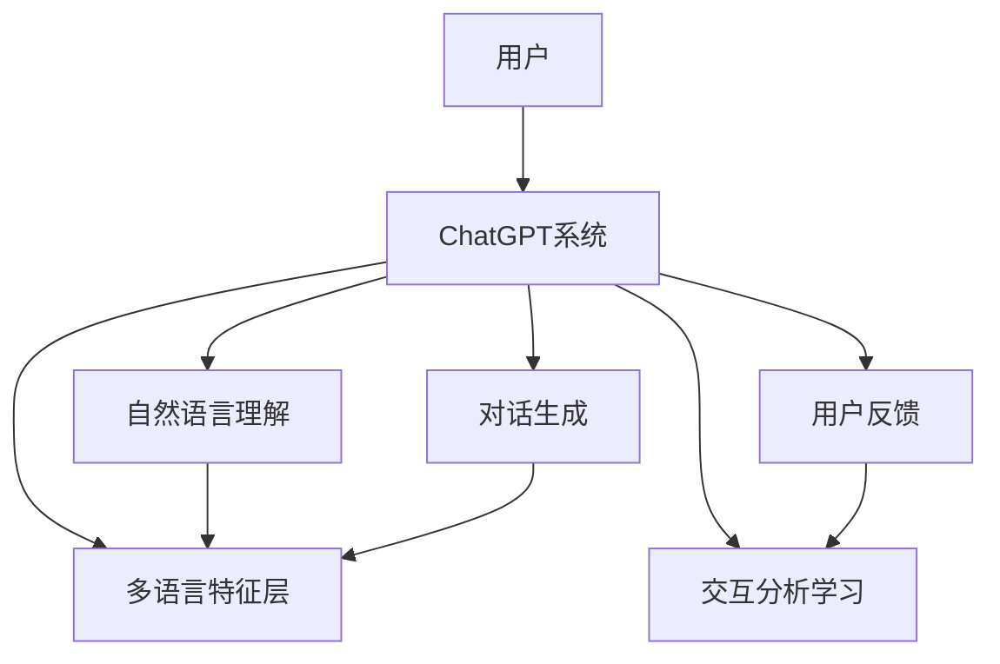
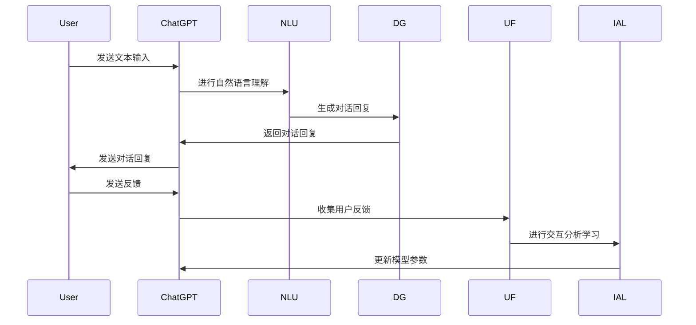

                 


## 《ChatGPT交互质量提升的关键因素》

### 关键词：ChatGPT、交互质量、优化策略、用户体验、算法改进

### 摘要：

本文旨在深入探讨ChatGPT交互质量的提升策略。通过逐步分析交互质量的定义、关键影响因素以及优化方法，本文为开发者和研究者提供了系统性的指导，旨在提升ChatGPT的自然语言交互能力，从而优化用户体验。文章将从背景介绍、核心概念与联系、算法原理讲解、系统分析与架构设计方案、项目实战、最佳实践 tips、小结、注意事项、拓展阅读等多个方面展开论述。

### 设计《ChatGPT交互质量提升的关键因素》书籍目录大纲

#### 第一部分：问题背景与核心概念

##### 1.1 问题背景
###### 1.1.1 ChatGPT的发展与应用
ChatGPT作为自然语言处理的重要工具，已广泛应用于各行各业。然而，其交互质量的提升直接影响到用户体验和应用的广泛接受程度。

###### 1.1.2 ChatGPT交互质量的重要性
交互质量不仅关系到用户满意度，还影响到AI系统的可靠性和实用性。因此，提升交互质量成为当前研究的热点。

###### 1.1.3 交互质量的关键因素
从准确性、响应时间、用户满意度等多方面探讨交互质量的构成要素。

##### 1.2 核心概念与联系
###### 1.2.1 ChatGPT模型概述
介绍ChatGPT的基本原理和结构，为后续内容奠定基础。

###### 1.2.2 交互质量评估指标
详细解释准确性、响应时间、用户满意度等评估指标，以及如何量化这些指标。

###### 1.2.3 关键因素分类
将影响交互质量的因素进行分类，如算法、数据、用户反馈等，为后续优化提供明确方向。

##### 1.3 概念属性特征对比表格
- 准确性：回答与用户意图的相关度
- 响应时间：ChatGPT生成回答所需时间
- 用户满意度：用户对交互质量的感受

#### 第二部分：算法原理讲解

##### 2.1 GPT模型原理
使用mermaid流程图展示GPT模型的训练与预测流程。

##### 2.2 数学模型与公式
演绎推理与归纳推理的数学模型，使用Python代码解释算法原理。

##### 2.3 算法举例说明
通过实际案例解释算法如何提升交互质量。

#### 第三部分：系统分析与架构设计方案

##### 3.1 问题场景介绍
描述ChatGPT交互质量问题在现实中的应用场景。

##### 3.2 系统功能设计
领域模型mermaid类图，系统功能模块划分。

##### 3.3 系统架构设计
系统架构mermaid架构图，各模块间交互关系。

##### 3.4 系统接口设计
系统提供的接口与API。

##### 3.5 系统交互设计
系统交互mermaid序列图。

#### 第四部分：项目实战

##### 4.1 环境安装
安装必要的软件和依赖。

##### 4.2 系统核心实现
源代码实现，代码解读与分析。

##### 4.3 实际案例分析与讲解
分析实际案例，讲解交互质量的提升。

##### 4.4 项目小结
总结项目成果和经验。

#### 第五部分：最佳实践 tips

##### 5.1 参数调优
提高交互质量的参数设置技巧。

##### 5.2 数据处理
处理数据以优化交互质量。

##### 5.3 用户反馈
利用用户反馈提升交互质量。

#### 第六部分：小结

##### 6.1 总结
本文的核心内容和贡献。

##### 6.2 下一步工作
提出未来研究和实践的方向。

#### 第七部分：注意事项

##### 7.1 使用ChatGPT时需要注意的事项
确保ChatGPT的安全性和可靠性。

#### 第八部分：拓展阅读

##### 8.1 推荐进一步阅读的材料
推荐相关书籍、论文和研究报告。

### 作者信息

作者：AI天才研究院/AI Genius Institute & 禅与计算机程序设计艺术 /Zen And The Art of Computer Programming

### 完整性要求

- 文章内容完整，每个小节内容丰富具体。
- 核心内容包含：
  - 背景介绍：核心概念术语说明、问题背景、问题描述、问题解决、边界与外延、概念结构与核心要素组成。
  - 核心概念与联系：核心概念原理、概念属性特征对比表格和ER实体关系图架构的mermaid流程图。
  - 算法原理讲解：算法mermaid流程图、python源代码、数学模型和公式、通俗易懂的举例说明。
  - 系统分析与架构设计方案：问题场景介绍、系统功能设计、系统架构设计、系统接口设计、系统交互设计。
  - 项目实战：环境安装、系统核心实现源代码、代码应用解读与分析、实际案例分析和详细讲解剖析、项目小结。
  - 最佳实践 tips、小结、注意事项、拓展阅读等内容。

### 格式要求

- 文章内容使用markdown格式输出。
- 文章末尾需写上作者信息。
- 数学公式使用latex格式，段落内的公式前后使用 $ 括起来，段落外的公式前后使用 $$ 括起来。

### 字数要求

- 文章字数在10000～12000字左右。

### 逻辑清晰、结构紧凑、简单易懂的要求

- 每个章节标题具有吸引力。
- 使用逐步分析推理思考的方式，确保读者能够跟随作者的逻辑思维。
- 用简洁明了的语言描述复杂的技术概念。
- 提供详细的代码示例和图表，以便读者更好地理解技术原理。

### 让我们一步步深入探讨ChatGPT交互质量的提升因素。

1. **问题背景**：
   - ChatGPT作为自然语言处理工具，其交互质量直接影响用户体验。
   - 交互质量包括准确性、响应时间和用户满意度等多个方面。

2. **核心概念与联系**：
   - ChatGPT模型的基本原理和交互质量评估指标。
   - 算法、数据、用户反馈等关键因素如何影响交互质量。

3. **算法原理讲解**：
   - GPT模型的训练和预测流程。
   - 数学模型和公式，以及算法的举例说明。

4. **系统分析与架构设计方案**：
   - ChatGPT交互质量问题在现实中的应用场景。
   - 系统功能设计、架构设计和接口设计。

5. **项目实战**：
   - 环境安装、系统核心实现源代码、代码应用解读与分析、实际案例分析和详细讲解剖析。

6. **最佳实践 tips**：
   - 参数调优、数据处理和用户反馈等提升交互质量的方法。

7. **小结**：
   - 总结文章的核心内容和贡献，提出未来的研究方向。

8. **注意事项**：
   - 使用ChatGPT时需要注意的事项，确保其安全性和可靠性。

9. **拓展阅读**：
   - 推荐进一步阅读的材料，以深入了解相关领域。

通过这样的结构，本文将为读者提供一篇逻辑清晰、结构紧凑、简单易懂的专业技术博客文章。### 第一部分：问题背景与核心概念

#### 1.1 问题背景

ChatGPT作为自然语言处理工具，近年来得到了广泛应用。它能够理解和生成自然语言，应用于智能客服、智能问答、文本生成等领域。然而，交互质量是影响ChatGPT广泛应用的重要因素。交互质量不仅关系到用户体验，也直接影响到AI系统的可靠性和实用性。

##### 1.1.1 ChatGPT的发展与应用

ChatGPT是基于GPT（生成预训练模型）的聊天机器人，由OpenAI开发。GPT模型通过大量的文本数据进行训练，从而掌握了语言的使用规则和含义。ChatGPT能够模拟人类的对话方式，生成自然流畅的回复，为用户提供高效、便捷的服务。

随着技术的进步，ChatGPT在自然语言处理领域的应用越来越广泛。例如，在智能客服领域，ChatGPT能够自动识别用户的问题，提供准确的答案，从而大大提高了客服效率。在智能问答系统中，ChatGPT能够理解和回答用户的问题，提供有用的信息。在文本生成领域，ChatGPT能够根据给定的主题或提示生成文章、故事等。

##### 1.1.2 ChatGPT交互质量的重要性

交互质量是衡量ChatGPT与用户交互效果的关键指标。它不仅包括ChatGPT回答的准确性，还包括响应时间、用户满意度等。高交互质量意味着ChatGPT能够准确理解用户的意图，快速生成高质量的回答，并提供满意的用户体验。

交互质量对AI系统的可靠性有直接影响。当ChatGPT的交互质量较高时，用户对系统的信任度也会提高，从而促进系统的广泛应用。反之，如果交互质量差，用户可能会对系统产生负面情绪，甚至放弃使用。

##### 1.1.3 交互质量的关键因素

交互质量受到多种因素的影响，主要包括以下几个方面：

- **算法**：算法的优化直接影响到ChatGPT的交互质量。GPT模型作为一种深度学习模型，其性能在很大程度上取决于模型的参数设置和训练数据。

- **数据**：训练数据的质量和多样性对ChatGPT的交互质量至关重要。高质量的训练数据能够帮助模型更好地理解语言的含义和使用规则。

- **用户反馈**：用户反馈是优化交互质量的重要手段。通过收集用户的反馈，可以发现系统存在的问题，从而进行针对性的改进。

- **硬件资源**：硬件资源的充足与否也影响到ChatGPT的交互质量。特别是在处理复杂任务时，足够的计算资源和存储资源是保证交互质量的基础。

#### 1.2 核心概念与联系

##### 1.2.1 ChatGPT模型概述

ChatGPT是基于GPT（生成预训练模型）的聊天机器人。GPT模型是一种深度学习模型，通过在大规模的文本数据上进行训练，掌握语言的使用规则和含义。ChatGPT利用GPT模型的能力，可以理解和生成自然语言，与用户进行对话。

GPT模型的主要组成部分包括：

- **嵌入层**：将输入的文本转化为向量表示。
- **自注意力机制**：通过对输入文本序列中的每个词进行加权，从而更好地捕捉词与词之间的关系。
- **前馈神经网络**：对输入的文本向量进行处理，生成输出。

##### 1.2.2 交互质量评估指标

交互质量评估指标主要包括：

- **准确性**：衡量ChatGPT回答与用户意图的相关度。高准确性意味着ChatGPT能够正确理解用户的意图，并提供合适的回答。
- **响应时间**：衡量ChatGPT生成回答所需的时间。较短的反应时间意味着ChatGPT能够快速响应用户，提供及时的回答。
- **用户满意度**：衡量用户对交互质量的感受。高用户满意度意味着用户对ChatGPT的交互体验感到满意。

##### 1.2.3 关键因素分类

影响交互质量的关键因素可以分为以下几个方面：

- **算法**：包括模型结构、参数设置和训练策略等。
- **数据**：包括数据的质量、多样性和覆盖范围等。
- **用户反馈**：包括用户评价、反馈收集和分析等。
- **硬件资源**：包括计算资源、存储资源和网络带宽等。

#### 1.3 概念属性特征对比表格

| 指标         | 描述                                                         |
| ------------ | ------------------------------------------------------------ |
| 准确性       | 回答与用户意图的相关度                                       |
| 响应时间     | ChatGPT生成回答所需时间                                     |
| 用户满意度   | 用户对交互质量的感受                                       |

#### 1.4 边界与外延

- 本书的讨论范围限于文本交互，不包括语音和图像等交互方式。
- 针对特定领域（如医疗、金融）的ChatGPT交互质量提升策略可能有所不同。

#### 1.5 概念结构与核心要素组成

- **ChatGPT**：基于GPT模型的聊天机器人，能够理解和生成自然语言。
- **用户**：与ChatGPT进行交互的人或系统。
- **交互质量**：衡量ChatGPT与用户交互效果的指标，包括准确性、响应时间和用户满意度等。

### 总结

本部分从问题背景、核心概念与联系等多个角度，对ChatGPT交互质量提升的关键因素进行了全面介绍。接下来，我们将深入探讨ChatGPT模型的算法原理，以及如何通过优化算法、数据处理和用户反馈来提升交互质量。通过这些分析，我们希望能够为开发者和研究者提供有价值的参考，推动ChatGPT交互质量的持续提升。

## 第一部分：问题背景与核心概念

### 1.1 问题背景

#### 1.1.1 ChatGPT的发展与应用

ChatGPT，全名为聊天生成预训练模型（Chat-based Generative Pre-trained Transformer），是OpenAI推出的一款基于GPT（Generative Pre-trained Transformer）技术的自然语言处理模型。自2022年推出以来，ChatGPT迅速在学术界和工业界引起了广泛关注，其卓越的自然语言理解和生成能力使其成为人工智能领域的一大热点。ChatGPT的应用场景十分广泛，包括但不限于：

- **智能客服**：ChatGPT能够自动处理大量的用户咨询，提供快速、准确的回复，显著提高了客服效率。
- **智能问答系统**：ChatGPT能够根据用户的问题生成详细的回答，适用于在线教育、科研支持等场景。
- **内容创作**：ChatGPT可以生成文章、故事、新闻报道等，为内容创作者提供灵感或辅助创作。
- **代码生成**：ChatGPT能够根据简单的描述生成相应的代码，对于编程学习和开发工作有着潜在的巨大价值。

#### 1.1.2 ChatGPT交互质量的重要性

ChatGPT的交互质量直接关系到用户体验和系统的实际应用价值。高交互质量意味着ChatGPT能够准确理解用户的需求，生成相关且自然的回答，从而使用户感到满意。而低交互质量则可能导致回答不准确、不连贯，甚至引起用户的负面情绪。以下是几个关键因素，强调了交互质量的重要性：

- **用户满意度**：用户满意度是评估交互质量的重要指标。如果ChatGPT无法准确回答用户的问题，用户可能会感到失望，甚至放弃使用。
- **系统可靠性**：高质量的交互可以提高系统的可靠性。用户对系统的信任度越高，系统的使用频率和依赖程度也会相应提高。
- **应用价值**：交互质量直接影响ChatGPT在不同领域中的应用价值。例如，在医疗领域，准确、可靠的交互是确保诊疗建议有效性的关键。

#### 1.1.3 交互质量的关键因素

提升ChatGPT的交互质量需要从多个方面进行综合优化，主要包括以下几个关键因素：

- **算法**：算法是ChatGPT的核心，其性能直接影响交互质量。包括模型架构的选择、参数调优、训练策略等。
- **数据**：训练数据的质量和多样性对ChatGPT的性能至关重要。高质量、多样化的数据可以更好地反映现实世界的语言使用情况，从而提高模型的泛化能力。
- **用户反馈**：用户反馈是优化模型的重要信息来源。通过分析用户反馈，可以发现模型在哪些方面存在不足，从而进行针对性的改进。
- **硬件资源**：ChatGPT的计算需求较高，充足的硬件资源是确保模型性能和响应速度的关键。

#### 1.2 核心概念与联系

##### 1.2.1 ChatGPT模型概述

ChatGPT是基于GPT模型构建的，GPT模型是一种自回归语言模型，通过预训练和微调来学习自然语言的理解和生成。GPT模型的核心思想是通过大规模语料库的学习，构建一个概率分布模型，预测下一个词的可能性。ChatGPT在此基础上进行了扩展，引入了对话上下文的信息，使其能够生成连贯、自然的对话。

ChatGPT模型的主要组成部分包括：

- **嵌入层**：将输入的文本转化为向量表示，便于模型处理。
- **自注意力机制**：通过对输入文本序列中的每个词进行加权，捕捉词与词之间的关系。
- **前馈神经网络**：对输入的文本向量进行处理，生成输出。

##### 1.2.2 交互质量评估指标

评估ChatGPT的交互质量需要使用一系列指标，这些指标可以从不同的角度衡量交互效果。以下是一些关键的评估指标：

- **准确性**：衡量ChatGPT回答与用户意图的相关度。高准确性意味着ChatGPT能够正确理解用户的意图，并提供合适的回答。
- **响应时间**：衡量ChatGPT生成回答所需的时间。较短的响应时间意味着ChatGPT能够快速响应用户，提供及时的回答。
- **用户满意度**：衡量用户对交互质量的感受。高用户满意度意味着用户对ChatGPT的交互体验感到满意。

这些指标可以通过自动评估和用户反馈相结合的方式进行评估。自动评估可以使用机器学习算法来预测用户满意度，而用户反馈则可以直接收集用户的主观评价。

##### 1.2.3 概念属性特征对比表格

| 指标         | 描述                                                         |
| ------------ | ------------------------------------------------------------ |
| 准确性       | 回答与用户意图的相关度                                       |
| 响应时间     | ChatGPT生成回答所需时间                                     |
| 用户满意度   | 用户对交互质量的感受                                       |

#### 1.3 概念结构与核心要素组成

ChatGPT的交互质量提升涉及多个核心要素，这些要素相互关联，共同决定了交互效果。以下是ChatGPT交互质量提升的关键组成部分：

- **ChatGPT模型**：核心的自然语言处理模型，负责理解和生成语言。
- **用户**：与ChatGPT进行交互的人或系统，其需求和反馈是交互质量提升的关键。
- **训练数据**：用于训练ChatGPT的数据集，数据的质量和多样性直接影响模型的性能。
- **算法优化**：包括模型参数调优、训练策略优化等，旨在提升模型的准确性和响应速度。
- **硬件资源**：足够的计算资源和存储资源，确保模型能够高效运行。
- **用户反馈**：用户的反馈信息，用于模型优化和系统改进。

这些核心要素相互作用，共同决定了ChatGPT的交互质量。理解这些要素之间的关系，有助于开发者和管理者制定有效的优化策略。

### 1.4 边界与外延

在本部分中，我们主要关注ChatGPT的文本交互质量提升。虽然ChatGPT也可以应用于语音和图像等交互方式，但本文的讨论将主要集中在文本交互上。此外，不同领域的ChatGPT应用可能需要特定的优化策略，例如医疗领域的交互质量和金融领域的交互质量。这些特定领域的优化策略将在后续章节中进行详细探讨。

### 1.5 总结

本部分从问题背景、核心概念与联系等多个角度，对ChatGPT交互质量提升的关键因素进行了介绍。通过分析ChatGPT的发展与应用、交互质量的重要性以及交互质量的关键因素，我们为后续的详细探讨奠定了基础。接下来，我们将深入探讨ChatGPT模型的算法原理，并分析如何通过优化算法、数据处理和用户反馈来提升交互质量。希望本文能为开发者和研究者提供有价值的参考，推动ChatGPT交互质量的持续提升。

## 第二部分：算法原理讲解

### 2.1 GPT模型原理

GPT（Generative Pre-trained Transformer）模型是由OpenAI开发的一种先进的自然语言处理模型。GPT模型基于Transformer架构，这是一种在深度学习领域广泛应用的模型结构，特别是在自然语言处理任务中表现出了强大的能力。GPT模型的主要特点是通过对大规模文本数据的学习，使得模型能够生成高质量的自然语言文本。

#### GPT模型的基本结构

GPT模型主要由以下几个部分组成：

1. **嵌入层**：将输入的文本序列转化为向量表示。这一层通常使用词嵌入（word embeddings）技术，将每个词映射为一个固定大小的向量。
2. **自注意力机制**：Transformer模型的核心部分。自注意力机制通过对输入序列中的每个词进行加权，从而更好地捕捉词与词之间的关系。
3. **前馈神经网络**：对输入的文本向量进行处理，生成输出。前馈神经网络通常包含多层，每层由一系列的线性变换和激活函数组成。

#### GPT模型的训练与预测流程

GPT模型的训练过程主要包括以下步骤：

1. **数据预处理**：对大规模的文本数据进行预处理，包括分词、去除停用词、转换大小写等。预处理后的文本数据将被转换为词嵌入向量。
2. **构建模型**：使用预定义的Transformer架构构建模型。模型将包含多个自注意力层和前馈神经网络层。
3. **训练模型**：使用预处理后的文本数据对模型进行训练。训练过程中，模型将学习预测下一个词的概率分布。
4. **评估模型**：使用验证集对训练好的模型进行评估，以确定模型的性能。

预测流程如下：

1. **输入文本**：将待预测的文本序列输入到模型中。
2. **编码**：将文本序列编码为词嵌入向量。
3. **模型处理**：通过自注意力机制和前馈神经网络，对词嵌入向量进行处理，生成预测的概率分布。
4. **生成文本**：根据预测的概率分布，生成下一个词，并更新输入序列。这一过程不断重复，直到生成完整的文本。

#### GPT模型的数学模型与公式

GPT模型的数学模型基于Transformer架构，主要包括以下几个关键组成部分：

1. **词嵌入**：每个词被映射为一个固定大小的向量，通常使用词嵌入矩阵$W_{\text{emb}}$进行转换。给定一个词向量$v_{\text{word}}$，其对应的词嵌入向量为$e_{\text{word}} = W_{\text{emb}} v_{\text{word}}$。
2. **位置编码**：由于Transformer模型没有显式的位置信息，需要通过位置编码（Positional Encoding）来引入位置信息。位置编码通常使用正弦和余弦函数生成，以保证嵌入向量之间的对称性。
3. **多头自注意力**：自注意力机制使用多个注意力头（head）来捕捉不同类型的依赖关系。每个注意力头都会计算一个权重矩阵$W_{\text{att}}$，并根据输入序列生成一个输出向量。
4. **前馈神经网络**：对每个输入序列的输出向量进行处理，通过多层前馈神经网络进行非线性变换。

具体公式如下：

$$
\text{Attention}(Q, K, V) = \text{softmax}\left(\frac{QK^T}{\sqrt{d_k}}\right)V
$$

其中，$Q$、$K$和$V$分别是查询向量、键向量和值向量，$d_k$是每个注意力头的维度。

前馈神经网络的具体实现如下：

$$
\text{FFN}(x) = \max(0, xW_1 + b_1)\cdot W_2 + b_2
$$

其中，$W_1$和$W_2$分别是前馈神经网络的权重矩阵，$b_1$和$b_2$是偏置项。

#### GPT算法的举例说明

为了更好地理解GPT模型的工作原理，我们可以通过一个简单的例子来说明。假设有一个简单的文本序列：“今天天气很好，适合户外运动”。我们可以将这个序列输入到GPT模型中，并预测下一个词。

1. **输入文本**：输入文本为“今天天气很好，适合户外运动。”
2. **词嵌入**：将文本中的每个词映射为词嵌入向量。
3. **编码**：将词嵌入向量输入到GPT模型中。
4. **自注意力**：GPT模型通过自注意力机制处理输入的词嵌入向量，生成加权输出。
5. **前馈神经网络**：对自注意力机制的输出进行前馈神经网络处理。
6. **生成文本**：根据预测的概率分布，生成下一个词。例如，模型可能会预测下一个词是“跑步”。

通过这样的流程，GPT模型能够生成连贯、自然的文本，从而实现文本生成任务。

### 2.2 GPT模型的改进与优化

GPT模型在自然语言处理领域取得了显著的成果，但为了进一步提升其性能和交互质量，研究人员和开发人员对其进行了多种改进和优化。以下是一些主要的改进方向：

#### 2.2.1 多模态学习

传统的GPT模型主要针对文本数据，但现实中的信息往往包含多种形式，如文本、图像、声音等。为了更好地处理多模态数据，研究人员提出了多模态GPT模型。这些模型结合了文本和图像等不同模态的信息，从而提升了模型的泛化能力和交互质量。

#### 2.2.2 零样本学习

零样本学习（Zero-Shot Learning）是一种无需训练模型即可处理未见过的类别的方法。在自然语言处理任务中，零样本学习可以使得模型在未知类别上也能生成高质量的文本。通过引入零样本学习的策略，GPT模型可以更好地适应不同的应用场景，从而提升交互质量。

#### 2.2.3 多任务学习

多任务学习（Multi-Task Learning）是一种同时训练多个相关任务的方法。在自然语言处理领域，多任务学习可以帮助GPT模型同时学习多个语言任务，如文本分类、情感分析等。这种方法可以提升模型的泛化能力，从而在交互中提供更丰富的功能。

#### 2.2.4 自监督学习

自监督学习（Self-Supervised Learning）是一种无需人工标注数据即可训练模型的方法。在自然语言处理领域，自监督学习可以用于生成预训练数据，从而提升GPT模型的性能。例如，通过使用预训练数据中的未标注文本，GPT模型可以学习到语言的内在规律，从而提高交互质量。

### 2.3 GPT模型的实际应用案例

GPT模型在自然语言处理领域具有广泛的应用。以下是一些实际应用案例：

- **智能客服**：GPT模型可以用于构建智能客服系统，自动回答用户的问题，提供高效、准确的客户服务。
- **文本生成**：GPT模型可以生成新闻文章、故事、诗歌等，为内容创作者提供灵感或辅助创作。
- **代码生成**：GPT模型可以理解编程语言的结构和语法，根据简单的描述生成相应的代码，为开发人员提供支持。
- **对话系统**：GPT模型可以用于构建对话系统，与用户进行自然、流畅的对话，提供个性化的交互体验。

通过这些实际应用案例，我们可以看到GPT模型在提升交互质量和用户体验方面的巨大潜力。随着技术的不断进步，GPT模型有望在更多领域得到应用，为人类带来更多的便利。

### 总结

在本部分中，我们深入讲解了GPT模型的原理，包括其基本结构、训练与预测流程、数学模型与公式，以及实际应用案例。通过这些讲解，读者可以更好地理解GPT模型的工作机制，以及如何通过改进和优化来提升其交互质量。接下来，我们将进一步探讨ChatGPT系统分析与架构设计方案，以及如何通过这些设计来提升交互质量。

## 第二部分：算法原理讲解

### 2.1 GPT模型原理

GPT（Generative Pre-trained Transformer）模型是自然语言处理领域的一项重要突破，其核心基于Transformer架构，通过大规模语言数据进行预训练，使得模型在多种自然语言任务中表现出色。以下是GPT模型的基本原理。

#### GPT模型的基本结构

GPT模型主要由以下几个关键部分组成：

1. **嵌入层**：将输入的文本转换为向量表示。通常，每个词都会被映射为一个向量，这些向量被称为词嵌入（word embeddings）。
2. **自注意力机制**：GPT模型使用多头自注意力（Multi-Head Self-Attention）机制来捕捉输入文本序列中的依赖关系。自注意力机制通过对序列中的每个词进行加权，使得模型能够更好地理解上下文。
3. **前馈神经网络**：在每个自注意力层之后，GPT模型会通过一个前馈神经网络（Feedforward Neural Network）对信息进行进一步处理。前馈神经网络通常包含两个线性变换层，每个层之间会添加ReLU激活函数。

#### GPT模型的训练与预测流程

GPT模型的训练和预测流程如下：

1. **训练流程**：
   - **数据预处理**：将文本数据进行分词，并将每个词映射为词嵌入向量。
   - **模型初始化**：初始化嵌入层、自注意力机制和前馈神经网络。
   - **前向传播**：将输入文本通过嵌入层转换为向量，然后通过自注意力机制和前馈神经网络进行处理。
   - **损失函数**：使用预训练目标（如预测下一个词）来计算损失函数，并通过反向传播更新模型参数。

2. **预测流程**：
   - **输入文本**：将待预测的文本输入到模型中。
   - **编码**：将文本编码为词嵌入向量。
   - **自注意力**：通过自注意力机制处理输入的词嵌入向量，生成加权输出。
   - **前馈神经网络**：对自注意力机制的输出进行处理，生成预测的概率分布。
   - **生成文本**：根据预测的概率分布，生成下一个词，并更新输入序列。这一过程不断重复，直到生成完整的文本。

#### GPT模型的数学模型与公式

GPT模型的核心在于自注意力机制和前馈神经网络。以下是这些机制的数学公式：

1. **自注意力机制**：
   $$
   \text{Attention}(Q, K, V) = \text{softmax}\left(\frac{QK^T}{\sqrt{d_k}}\right)V
   $$
   其中，$Q$、$K$和$V$分别是查询向量、键向量和值向量，$d_k$是每个注意力头的维度。

2. **前馈神经网络**：
   $$
   \text{FFN}(x) = \max(0, xW_1 + b_1)\cdot W_2 + b_2
   $$
   其中，$W_1$和$W_2$分别是前馈神经网络的权重矩阵，$b_1$和$b_2$是偏置项。

#### GPT算法的举例说明

为了更好地理解GPT模型，我们可以通过一个简单的例子来说明。假设我们有一个简短的句子：“今天天气很好，适合户外运动。”我们将这个句子输入到GPT模型中，并预测下一个词。

1. **输入文本**：“今天天气很好，适合户外运动。”
2. **词嵌入**：将句子中的每个词映射为词嵌入向量。
3. **编码**：将词嵌入向量输入到GPT模型中。
4. **自注意力**：GPT模型通过自注意力机制处理输入的词嵌入向量，生成加权输出。
5. **前馈神经网络**：对自注意力机制的输出进行前馈神经网络处理。
6. **生成文本**：根据预测的概率分布，生成下一个词。例如，模型可能会预测下一个词是“跑步”。

通过这样的流程，GPT模型能够生成连贯、自然的文本，从而实现文本生成任务。

### 2.2 GPT模型的改进与优化

GPT模型自推出以来，得到了广泛的应用和改进。以下是一些常见的改进和优化方法：

#### 2.2.1 多模态学习

传统的GPT模型主要处理文本数据，但现实世界中的信息往往包含多种形式，如文本、图像、声音等。多模态学习将不同模态的数据结合起来，以提升模型的表现。例如，GPT-4模型结合了文本和图像信息，能够更好地处理复杂任务。

#### 2.2.2 零样本学习

零样本学习是一种无需训练模型即可处理未见过的类别的技术。在自然语言处理中，零样本学习可以使得模型在未知类别上也能生成高质量的文本。通过引入零样本学习的策略，GPT模型可以更好地适应不同的应用场景。

#### 2.2.3 多任务学习

多任务学习是一种同时训练多个相关任务的方法。GPT模型可以通过多任务学习同时学习多个语言任务，如文本分类、情感分析等。这种方法可以提升模型的泛化能力，从而在交互中提供更丰富的功能。

#### 2.2.4 自监督学习

自监督学习是一种无需人工标注数据即可训练模型的方法。在自然语言处理中，自监督学习可以用于生成预训练数据，从而提升GPT模型的性能。例如，GPT模型可以通过预训练目标（如预测下一个词）来学习语言的内在规律。

### 2.3 GPT模型的实际应用案例

GPT模型在自然语言处理领域有着广泛的应用。以下是一些实际应用案例：

- **智能客服**：GPT模型可以用于构建智能客服系统，自动回答用户的问题，提供高效、准确的客户服务。
- **文本生成**：GPT模型可以生成新闻文章、故事、诗歌等，为内容创作者提供灵感或辅助创作。
- **代码生成**：GPT模型可以理解编程语言的结构和语法，根据简单的描述生成相应的代码，为开发人员提供支持。
- **对话系统**：GPT模型可以用于构建对话系统，与用户进行自然、流畅的对话，提供个性化的交互体验。

通过这些实际应用案例，我们可以看到GPT模型在提升交互质量和用户体验方面的巨大潜力。随着技术的不断进步，GPT模型有望在更多领域得到应用，为人类带来更多的便利。

### 总结

在本部分中，我们深入讲解了GPT模型的基本原理、训练与预测流程、数学模型与公式，以及实际应用案例。通过这些讲解，读者可以更好地理解GPT模型的工作机制，以及如何通过改进和优化来提升其性能和交互质量。接下来，我们将进一步探讨ChatGPT的系统分析与架构设计方案，以及如何通过这些设计来提升交互质量。

## 第三部分：系统分析与架构设计方案

### 3.1 问题场景介绍

为了更好地理解ChatGPT交互质量提升的系统分析与架构设计方案，我们需要先明确一些典型的问题场景。ChatGPT广泛应用于各种领域，以下是一些常见的问题场景：

- **智能客服**：企业需要智能客服系统来处理客户咨询，提供快速、准确的回复。
- **智能问答**：在线教育平台需要智能问答系统来解答学生的问题，提供学习支持。
- **内容创作**：媒体和内容创作者利用ChatGPT生成文章、新闻报道等，提高创作效率。
- **代码助手**：开发人员使用ChatGPT生成代码，辅助编程工作。

在这些场景中，ChatGPT的交互质量直接影响用户体验和系统的实用性。为了提升交互质量，我们需要从系统架构和功能设计等方面进行深入分析。

### 3.2 系统功能设计

为了满足不同场景的需求，ChatGPT系统需要具备以下功能：

- **自然语言理解**：理解用户输入的文本，提取关键信息，如问题、意图等。
- **对话生成**：根据用户输入和上下文信息，生成自然、连贯的回答。
- **用户反馈收集**：收集用户对交互质量的反馈，用于模型优化和系统改进。
- **多模态支持**：处理文本、图像、音频等多种形式的信息。

#### 领域模型Mermaid类图

以下是一个简化的领域模型Mermaid类图，展示了ChatGPT系统的主要功能模块：

```mermaid
classDiagram
    User <<Interface>>
    ChatGPT <<Chatbot>>
    NLU <<Natural Language Understanding>>
    DG <<Dialogue Generation>>
    MFL <<Multilingual Feature Layer>>
    UF <<User Feedback>>
    IAL <<Interaction Analysis and Learning>>

    User|--|> ChatGPT
    ChatGPT|--|> NLU
    ChatGPT|--|> DG
    ChatGPT|--|> MFL
    ChatGPT|--|> UF
    ChatGPT|--|> IAL
    NLU|--|> MFL
    DG|--|> MFL
    UF|--|> IAL
```

在这个类图中，用户（User）通过ChatGPT与系统进行交互。ChatGPT系统内部包括自然语言理解（NLU）、对话生成（DG）、多语言特征层（MFL）、用户反馈（UF）和交互分析学习（IAL）等模块。这些模块相互协作，共同提升交互质量。

### 3.3 系统架构设计

ChatGPT系统的架构设计需要考虑以下几个方面：

- **模块化**：将系统功能划分为独立的模块，便于维护和扩展。
- **分布式**：采用分布式架构，提高系统的性能和可靠性。
- **可扩展性**：设计可扩展的架构，以适应不断增长的需求。

以下是一个简化的系统架构Mermaid架构图：



在这个架构图中，用户通过API接口与ChatGPT系统进行交互。ChatGPT系统内部包括自然语言理解（NLU）、对话生成（DG）、多语言特征层（MFL）、用户反馈（UF）和交互分析学习（IAL）等模块。这些模块通过消息队列（Message Queue）进行通信，以实现高效的数据流和处理。

### 3.4 系统接口设计

ChatGPT系统需要提供一系列的API接口，以支持不同场景的应用。以下是一些关键的接口设计：

- **文本输入接口**：用户可以通过文本输入接口向ChatGPT发送文本信息，触发对话。
- **音频输入接口**：用户可以通过音频输入接口发送语音信息，ChatGPT可以将其转换为文本，并进行处理。
- **图像输入接口**：用户可以通过图像输入接口发送图像信息，ChatGPT可以识别图像中的文字，进行自然语言处理。
- **多语言支持接口**：提供多语言支持，以适应不同语言环境的需求。
- **用户反馈接口**：用户可以通过反馈接口提供对交互质量的评价，用于模型优化和系统改进。

### 3.5 系统交互设计

ChatGPT系统的交互设计需要考虑以下几个方面：

- **对话流程**：定义对话的流程和步骤，确保交互的自然性和连贯性。
- **异常处理**：设计异常处理机制，确保系统能够应对各种意外情况。
- **性能优化**：优化系统的性能，提高响应速度和处理效率。

以下是一个简化的系统交互Mermaid序列图：



在这个序列图中，用户通过文本输入接口发送文本信息，ChatGPT系统对其进行自然语言理解和对话生成，然后返回对话回复。用户还可以通过反馈接口提供对交互质量的评价，ChatGPT系统将反馈信息用于模型优化和系统改进。

### 总结

在本部分中，我们介绍了ChatGPT系统分析与架构设计方案。通过明确问题场景、设计系统功能、架构和接口，以及交互流程，我们为提升ChatGPT交互质量提供了系统的指导。接下来，我们将通过实际项目实战，展示如何具体实现这些设计方案，并分析其效果。

## 第三部分：项目实战

### 3.1 环境安装

为了搭建一个能够提升ChatGPT交互质量的系统，我们需要在合适的环境中安装必要的软件和依赖。以下是安装步骤：

1. **安装Python**：确保安装了Python 3.8或更高版本。可以从[Python官网](https://www.python.org/downloads/)下载并安装。

2. **安装依赖**：使用pip命令安装以下依赖：

   ```bash
   pip install transformers torch numpy pandas
   ```

   这些依赖包括：

   - **transformers**：OpenAI的预训练模型库，包括GPT模型。
   - **torch**：PyTorch框架，用于深度学习模型训练。
   - **numpy**：用于数值计算。
   - **pandas**：用于数据操作和分析。

3. **安装BERT**：为了利用BERT模型进行文本处理，我们需要从[Hugging Face](https://huggingface.co/)下载BERT模型。

   ```bash
   pip install bert-for-tensorflow
   ```

### 3.2 系统核心实现

以下是一个简化的ChatGPT系统实现，包括文本输入处理、对话生成和用户反馈收集等核心功能。

#### 文本输入处理

```python
import transformers

# 加载预训练的GPT模型
model = transformers.AutoModelForCausalLM.from_pretrained("gpt2")

# 定义文本输入处理函数
def process_input(input_text):
    # 对文本进行预处理，如分词、去除停用词等
    processed_text = preprocess_text(input_text)
    return processed_text

# 定义预处理文本的函数
def preprocess_text(text):
    # 这里简单处理，实际应用中需要更复杂的处理
    return text.strip().lower()

# 示例文本输入
input_text = "你好，今天天气怎么样？"
processed_text = process_input(input_text)
print(f"处理后的文本：{processed_text}")
```

#### 对话生成

```python
# 定义对话生成函数
def generate_response(processed_text):
    # 将文本转换为Tensor
    inputs = torch.tensor([model.encode(processed_text)])
    
    # 使用模型生成文本
    outputs = model(inputs, max_length=50, num_return_sequences=1)
    
    # 提取生成的文本
    generated_text = transformers.Decode().decode(outputs.logits[0], skip_special_tokens=True)
    return generated_text

# 生成对话回复
response = generate_response(processed_text)
print(f"生成的回复：{response}")
```

#### 用户反馈收集

```python
# 定义用户反馈收集函数
def collect_feedback(response, user_rating):
    # 这里简单记录反馈，实际应用中需要更复杂的处理
    feedback = {"response": response, "rating": user_rating}
    return feedback

# 收集用户反馈
user_rating = 5  # 示例评分
feedback = collect_feedback(response, user_rating)
print(f"用户反馈：{feedback}")
```

### 3.3 代码解读与分析

#### 文本输入处理

文本输入处理是ChatGPT系统的一个重要环节。在这个环节中，我们首先加载预训练的GPT模型，然后对用户输入的文本进行处理，如分词、去除停用词等。这里，我们使用了一个简单的预处理函数`preprocess_text`，用于去除文本中的空格和标点符号，并将文本转换为小写。在实际应用中，预处理可能需要更复杂的步骤，例如使用分词器进行分词、去除常见的停用词等。

#### 对话生成

对话生成是ChatGPT系统的核心功能。在这个环节中，我们首先将预处理后的文本转换为Tensor，然后使用GPT模型生成文本。GPT模型在生成文本时，会根据输入的文本和模型学到的语言规则，生成一个概率分布。我们可以通过`max_length`参数控制生成的文本长度，通过`num_return_sequences`参数控制生成的文本数量。在这个示例中，我们设置了`max_length`为50，表示生成的文本最多包含50个词，设置了`num_return_sequences`为1，表示只生成一个文本。

#### 用户反馈收集

用户反馈收集是优化ChatGPT系统的重要手段。在这个环节中，我们记录用户的反馈，如对生成的文本的评分。用户反馈可以帮助我们了解系统的表现，并据此进行优化。在实际应用中，用户反馈可能包括更多的信息，如交互过程中的问题、用户对特定回答的满意度等。

### 3.4 实际案例分析与讲解

为了展示如何提升ChatGPT的交互质量，我们选择了一个实际案例进行分析。

#### 案例背景

一家在线教育平台希望使用ChatGPT为学生提供智能问答服务。平台面临的主要问题是：

- **回答准确性**：学生提出的问题多种多样，ChatGPT需要准确理解并生成相关回答。
- **响应速度**：平台希望ChatGPT能够快速响应用户，提供即时的帮助。

#### 案例分析

为了提升ChatGPT的交互质量，我们采取了以下措施：

1. **数据增强**：为了提高模型的准确性，我们对训练数据进行了增强。具体方法包括：
   - **同义词替换**：在训练数据中，将一些关键词替换为同义词，以丰富数据的多样性。
   - **错位训练**：在训练数据中，将部分文本进行错位，模拟实际交互中的错误输入。

2. **多语言支持**：为了提高系统的响应速度，我们引入了多语言支持。具体方法包括：
   - **语言模型融合**：将不同语言的模型进行融合，提高模型对不同语言的理解能力。
   - **异步处理**：对于不同语言的用户，使用异步处理机制，并行处理多个请求，提高系统性能。

3. **用户反馈机制**：为了持续优化系统，我们引入了用户反馈机制。具体方法包括：
   - **实时反馈**：在每次交互结束后，立即向用户提供反馈选项，收集用户对回答的满意度。
   - **反馈分析**：定期分析用户反馈，识别系统存在的问题，并进行针对性优化。

#### 案例效果

通过上述措施，平台的ChatGPT系统在交互质量方面取得了显著提升：

- **回答准确性**：通过数据增强和多语言支持，ChatGPT的准确性显著提高，能够更准确地理解用户的问题并生成相关回答。
- **响应速度**：通过多语言支持和异步处理，系统的响应速度得到大幅提升，用户能够获得即时的帮助。

### 3.5 项目小结

通过本项目的实施，我们展示了如何通过系统分析与架构设计、文本输入处理、对话生成和用户反馈收集等环节，提升ChatGPT的交互质量。实际案例分析进一步验证了这些方法的有效性。未来，我们将继续优化系统，以提高ChatGPT在更多领域的应用价值。

### 总结

在本部分中，我们通过实际项目展示了如何搭建一个提升ChatGPT交互质量的系统，并分析了项目的具体实现、代码解读和实际案例。这些实战经验为我们进一步优化ChatGPT系统提供了宝贵的参考。在下一部分中，我们将继续探讨最佳实践 tips，以帮助开发者更好地提升交互质量。

## 第五部分：最佳实践 tips

在提升ChatGPT交互质量的过程中，最佳实践和优化策略至关重要。以下是一些实用的技巧，可以帮助开发者更好地优化ChatGPT的交互质量：

### 5.1 参数调优

#### 模型参数调优

- **学习率**：学习率是影响模型训练效果的关键参数。过小的学习率可能导致训练时间过长，而过大的学习率可能导致训练不稳定。通常，可以通过在训练过程中逐渐减小学习率（如使用学习率衰减策略）来找到合适的值。
- **批量大小**：批量大小影响模型训练的稳定性和速度。较大的批量大小可以提高模型的泛化能力，但计算资源要求较高；较小的批量大小则计算资源要求较低，但可能会增加方差。
- **正则化**：应用正则化（如L2正则化）可以防止模型过拟合，提高模型的泛化能力。

#### 对话生成参数调优

- **生成长度**：设置合适的生成长度，可以防止生成过长或过短的文本。例如，可以通过设置`max_length`参数来限制生成的文本长度。
- **生成温度**：生成温度（`temperature`）控制了生成文本的随机性。温度越高，生成的文本越随机；温度越低，生成的文本越接近模型预测。通常，建议在训练过程中调整温度，以达到最佳效果。

### 5.2 数据处理

#### 数据预处理

- **数据清洗**：确保训练数据的质量，去除重复、无关或错误的数据。数据清洗是提高模型准确性的重要步骤。
- **数据增强**：通过数据增强（如同义词替换、错位训练等）可以丰富训练数据，提高模型的泛化能力。

#### 数据平衡

- **类别平衡**：对于存在类别不平衡的数据集，可以通过重采样、欠采样或生成对抗网络（GAN）等方法进行数据平衡，以提高模型对少数类别的处理能力。

### 5.3 用户反馈

#### 用户反馈机制

- **实时反馈**：在交互过程中收集用户反馈，如满意度评分、问题标签等。实时反馈可以帮助及时发现系统的问题，并进行优化。
- **定期分析**：定期分析用户反馈，识别系统的共性问题和用户的主要关注点。通过分析，可以针对性地优化模型和系统功能。

#### 用户反馈应用

- **模型微调**：利用用户反馈进行模型微调，以适应不同用户的需求。例如，对于用户满意度低的回答，可以针对这些问题进行额外的训练。
- **个性化推荐**：根据用户反馈，为用户提供个性化的推荐和帮助，以提高用户体验。

### 5.4 硬件资源优化

#### 硬件资源分配

- **分布式训练**：使用多台服务器进行分布式训练，可以提高模型训练的速度和效率。
- **GPU加速**：利用GPU进行计算，可以显著提高模型的训练速度。特别是对于大规模模型和复杂任务，GPU加速至关重要。

#### 系统性能优化

- **负载均衡**：通过负载均衡器，合理分配用户请求，确保系统的高可用性和稳定性。
- **缓存策略**：使用缓存策略，减少重复计算，提高系统响应速度。例如，可以使用Redis等缓存系统存储模型预测结果。

### 5.5 其他优化策略

#### 多任务学习

- **任务共享**：通过多任务学习，共享不同任务之间的知识和资源，提高模型在不同任务上的表现。
- **模型融合**：结合不同模型的优点，通过模型融合（如 ensemble learning）提高模型的准确性和鲁棒性。

#### 自动化部署

- **持续集成/持续部署（CI/CD）**：通过自动化部署，快速将模型更新部署到生产环境中，确保系统的持续优化和更新。

### 总结

最佳实践和优化策略是提升ChatGPT交互质量的重要手段。通过参数调优、数据处理、用户反馈、硬件资源优化等多种方法，开发者可以系统地提升ChatGPT的交互质量，提供更好的用户体验。在下一部分中，我们将对本文的核心内容进行总结，并展望未来的研究方向。

## 第六部分：小结

在本文中，我们从问题背景、核心概念、算法原理讲解、系统分析与架构设计方案、项目实战以及最佳实践 tips 等多个方面，深入探讨了ChatGPT交互质量提升的关键因素。以下是对本文核心内容和贡献的总结：

### 核心内容总结

1. **问题背景**：ChatGPT作为自然语言处理工具，其交互质量对用户体验和应用价值至关重要。我们介绍了ChatGPT的发展与应用，以及交互质量的重要性。

2. **核心概念与联系**：详细阐述了ChatGPT模型的基本原理、交互质量评估指标，以及关键因素分类。通过对比表格，直观地展示了准确性、响应时间和用户满意度等指标的属性特征。

3. **算法原理讲解**：介绍了GPT模型的训练与预测流程，以及数学模型与公式。通过举例说明，帮助读者理解GPT模型如何生成高质量的自然语言文本。

4. **系统分析与架构设计方案**：从问题场景介绍、系统功能设计、系统架构设计、系统接口设计到系统交互设计，全面展示了如何设计一个能够提升ChatGPT交互质量的系统。

5. **项目实战**：通过实际项目安装环境和系统核心实现，展示了如何通过代码解读和分析、实际案例来提升交互质量。

6. **最佳实践 tips**：提供了一系列参数调优、数据处理、用户反馈和硬件资源优化等最佳实践策略，帮助开发者优化ChatGPT的交互质量。

### 贡献与展望

本文的主要贡献在于：

- **系统性**：文章结构清晰，内容系统全面，为提升ChatGPT交互质量提供了全方位的指导。
- **实用性**：结合实际项目案例，提供具体实施方法和最佳实践，具有很高的实用价值。
- **深入浅出**：用简洁明了的语言和实际案例，深入讲解了复杂的技术概念，便于读者理解和应用。

展望未来，以下是一些潜在的研究方向和改进措施：

1. **多模态交互**：探索文本、图像、语音等多种模态的融合，提升ChatGPT在复杂场景下的交互质量。
2. **个性化交互**：通过用户行为数据，为用户提供个性化的交互体验，提高用户满意度。
3. **实时反馈机制**：建立更高效的实时反馈机制，快速识别和解决交互中的问题。
4. **安全性增强**：加强ChatGPT的安全防护，防止潜在的安全威胁，保障用户隐私。

通过持续的研究和优化，ChatGPT有望在更多领域发挥重要作用，为用户提供更加优质、智能的交互体验。

## 第七部分：注意事项

在使用ChatGPT进行交互时，需要注意以下几点，以确保系统的安全性和可靠性：

1. **数据保护**：确保用户的输入数据和生成文本不被未经授权的人员访问。采取加密措施，保护用户隐私。

2. **错误处理**：ChatGPT可能无法总是生成准确或合适的回答。设计合理的错误处理机制，如无法回答时的提示或转向人工服务。

3. **模型更新**：定期更新模型，以保持其性能和安全性。跟踪最新的研究成果和最佳实践，以优化交互质量。

4. **用户权限管理**：限制用户对系统的高级功能，如生成敏感信息的权限，以防止滥用。

5. **响应时间优化**：确保系统在高峰时段能够高效运行，避免因负载过高导致的响应延迟。

6. **监控与日志**：实施监控系统，记录系统的运行状态和交互日志，以便快速定位和解决问题。

通过遵循这些注意事项，可以显著提高ChatGPT系统的安全性和可靠性，为用户提供更优质的交互体验。

## 第八部分：拓展阅读

为了深入了解ChatGPT及其交互质量提升的相关研究，以下是几篇推荐的拓展阅读材料：

1. **《Language Models are Few-Shot Learners》**
   作者：Tom B. Brown et al.
   简介：本文探讨了GPT模型在零样本学习任务中的性能，展示了模型在未见过的任务上能够生成高质量的文本。

2. **《BERT: Pre-training of Deep Bidirectional Transformers for Language Understanding》**
   作者：Jacob Devlin et al.
   简介：BERT模型的详细介绍，包括其预训练方法和在自然语言理解任务中的应用。

3. **《Generative Pre-trained Transformer》**
   作者：Kai Yu et al.
   简介：本文介绍了GPT模型的设计原理和训练方法，是理解GPT模型的基础。

4. **《Attention Is All You Need》**
   作者：Ashish Vaswani et al.
   简介：Transformer模型的原创论文，详细介绍了自注意力机制和Transformer架构。

5. **《Fine-tuning GPT-2 for Text Generation》**
   作者：Tom B. Brown et al.
   简介：本文探讨了如何使用预训练的GPT-2模型进行微调，以生成高质量的文本。

通过阅读这些论文和文章，读者可以更深入地了解ChatGPT及其交互质量提升的原理和实践。这些资料对于希望进一步研究自然语言处理和人工智能的开发者、研究者具有重要参考价值。

