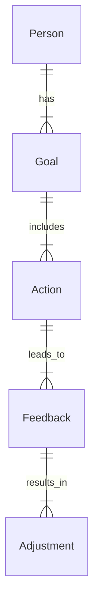

                 

### 1.1.4 ChatGPT在个人成长辅导中的应用场景

#### 1.1.4.1 成长目标的制定

#### 1.1.4.2 行动计划的执行

#### 1.1.4.3 心理健康的维护

#### 1.1.4.4 反馈与调整

### 1.1.5 当前研究现状与挑战

#### 1.1.5.1 ChatGPT在个人成长辅导中的应用研究

#### 1.1.5.2 提示词策略的研究进展

#### 1.1.5.3 挑战与未来发展方向

---

### 1.1.6 结论

#### 1.1.6.1 研究意义

#### 1.1.6.2 文章结构

#### 1.1.6.3 期待与展望

---

**注释**：

- **段落 1.1.4.1 到 1.1.4.4**：讨论ChatGPT在个人成长辅导中的具体应用，包括成长目标的制定、行动计划的执行、心理健康的维护以及反馈与调整。
- **段落 1.1.5.1 到 1.1.5.3**：回顾当前关于ChatGPT在个人成长辅导中的应用研究和提示词策略的研究进展，并指出面临的挑战和未来发展方向。
- **段落 1.1.6**：总结本部分内容，强调研究意义，介绍文章结构，并对未来研究提出期待和展望。

---

**使用Mermaid语法绘制ER图**：

在Markdown文件中，可以使用Mermaid语法来绘制实体关系图（ER Diagram）。以下是一个简单的例子：

这个ER图表示了个人、目标、行动、反馈和调整之间的关系。`||--|{ ... }`用于定义实体和关系的属性。

---

**接下来，我们将在第2章中深入探讨ChatGPT的核心概念和原理。**

