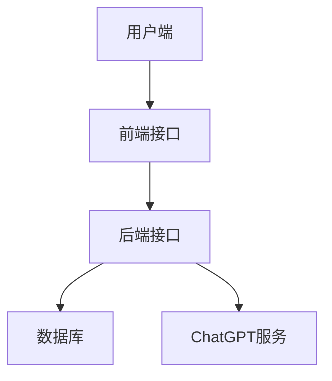

                 

### # ChatGPT在代际文化传承中的应用：弥合文化断层

关键词：ChatGPT、代际文化传承、文化断层、自然语言处理、预训练模型

摘要：随着科技的进步，人工智能（AI）技术在文化传承中扮演着越来越重要的角色。本文将探讨ChatGPT在代际文化传承中的应用，通过逻辑清晰的步骤分析，揭示如何利用ChatGPT弥合文化断层，促进文化传承与发展。

### 第一部分：背景介绍

#### 1.1 问题背景

随着科技的快速发展，人工智能（AI）技术已经渗透到我们生活的方方面面。特别是ChatGPT这一生成式预训练变换模型（GPT-Generative Pre-trained Transformer）的出现，极大地提升了自然语言处理（NLP）的能力。ChatGPT不仅能够回答问题、撰写文章，还可以进行对话模拟，甚至帮助人们完成复杂的任务。然而，如何将ChatGPT应用于代际文化传承，成为了一个值得探讨的问题。

#### 1.2 问题描述

代际文化传承是指将一个时代的文化精髓传递给下一代，以确保文化的延续和发展。然而，随着时代的变迁，不同代际之间的文化差异和断层问题日益突出。如何利用ChatGPT这一先进技术，弥合文化断层，促进代际文化的传承，成为一个亟待解决的问题。

#### 1.3 问题解决

ChatGPT在自然语言处理领域具有强大的能力，可以通过对话生成、文本生成等方式，模拟人类交流过程，帮助人们更好地理解传统文化。通过将ChatGPT应用于代际文化传承，可以实现以下目标：

1. **文化内容生成**：ChatGPT可以根据已有的文化资料，生成新的文化内容，使得文化传承更加生动有趣。
2. **文化问答与对话**：ChatGPT可以回答人们关于文化的问题，进行文化对话，帮助人们更好地了解传统文化。
3. **文化教育辅助**：ChatGPT可以作为文化教育的辅助工具，提供个性化的学习体验，激发人们对传统文化的兴趣。

#### 1.4 边界与外延

本书主要探讨ChatGPT在代际文化传承中的应用，重点分析其技术原理和实际应用案例。同时，本书还将探讨ChatGPT在文化传承中的边界问题，如文化保护与商业化之间的平衡、数据安全与隐私保护等。

#### 1.5 概念结构与核心要素组成

本书的核心概念包括：

1. **ChatGPT**：一种生成式预训练变换模型，具有强大的自然语言处理能力。
2. **代际文化传承**：指将一个时代的文化精髓传递给下一代的过程。
3. **文化断层**：指不同代际之间由于文化差异而产生的断层问题。

这些概念共同构成了本书的核心内容，为后续章节的讨论奠定了基础。

### 第二部分：核心概念与联系

#### 2.1 ChatGPT的概念与特点

ChatGPT是一种基于Transformer架构的生成式预训练模型，具有以下几个显著特点：

1. **预训练**：ChatGPT在大规模语料库上进行预训练，从而具备了强大的语言理解能力和生成能力。
2. **多模态**：ChatGPT不仅可以处理文本，还可以处理图像、音频等多种数据类型。
3. **自适应**：ChatGPT可以根据不同的任务和应用场景进行自适应调整，以实现最佳效果。

#### 2.2 代际文化传承的概念与特征

代际文化传承是指在不同代际之间传递和继承文化的过程。其特征包括：

1. **延续性**：代际文化传承确保了文化的延续，使得文化在历史长河中得以保存和传承。
2. **多样性**：代际文化传承使得文化在传承过程中得以丰富和多样化，促进了文化创新。
3. **教育性**：代际文化传承是一种教育过程，通过传授文化知识和价值观念，培养下一代的综合素质。

#### 2.3 文化断层的定义与成因

文化断层是指由于文化差异和交流障碍，导致不同代际之间在文化认知和认同上出现断层的问题。其成因包括：

1. **代际差异**：不同代际在文化背景、价值观念、生活方式等方面存在差异，容易导致文化断层。
2. **信息传播障碍**：由于信息传播渠道的限制，一些重要的文化内容无法及时传递给下一代，加剧了文化断层。
3. **文化保护与商业化之间的冲突**：文化传承过程中，如何平衡文化保护与商业化发展，是一个重要的问题，处理不当容易导致文化断层。

#### 2.4 ChatGPT在代际文化传承中的应用

ChatGPT在代际文化传承中具有广泛的应用前景，可以通过以下方式发挥作用：

1. **文化内容生成**：ChatGPT可以根据已有的文化资料，生成新的文化内容，使得文化传承更加生动有趣。
2. **文化问答与对话**：ChatGPT可以回答人们关于文化的问题，进行文化对话，帮助人们更好地了解传统文化。
3. **文化教育辅助**：ChatGPT可以作为文化教育的辅助工具，提供个性化的学习体验，激发人们对传统文化的兴趣。

### 第三部分：算法原理讲解

#### 3.1 ChatGPT的算法原理

ChatGPT是基于Transformer架构的生成式预训练模型，其核心原理包括以下几个方面：

1. **预训练**：ChatGPT在大规模语料库上进行预训练，从而具备了强大的语言理解能力和生成能力。预训练过程包括两个主要步骤：第一步是使用一个大规模语料库对模型进行训练，使模型能够理解和生成文本；第二步是微调模型，使其适应特定的任务或应用场景。

2. **解码器**：ChatGPT的解码器是一个基于Transformer的自回归语言模型，它能够根据输入的文本序列生成相应的输出序列。解码器通过预测下一个单词或字符来生成文本，并利用Transformer的自注意力机制来捕捉输入序列中的依赖关系。

3. **多模态学习**：ChatGPT可以通过多模态学习，处理图像、音频等多种数据类型。多模态学习使ChatGPT能够更好地理解和生成包含多种类型信息的文本，从而提升其在代际文化传承中的应用效果。

#### 3.2 ChatGPT的数学模型

ChatGPT的数学模型主要包括以下几个核心部分：

1. **嵌入层（Embedding Layer）**：将输入的文本转换为向量表示，以便后续的模型处理。嵌入层通常使用预训练的词向量（如Word2Vec、GloVe等）。

2. **Transformer编码器（Transformer Encoder）**：编码器是一个多层的Transformer网络，通过自注意力机制（Self-Attention Mechanism）和前馈神经网络（Feed-Forward Neural Network）来处理输入序列，并生成固定长度的向量表示。

3. **解码器（Decoder）**：解码器也是一个多层的Transformer网络，用于生成输出序列。解码器在生成每个单词时，都会参考编码器的输出和已经生成的文本。

4. **损失函数（Loss Function）**：ChatGPT的训练通常使用交叉熵损失函数（Cross-Entropy Loss），以最小化模型预测和真实标签之间的差距。

#### 3.3 ChatGPT的工作流程

ChatGPT的工作流程主要包括以下几个步骤：

1. **输入处理**：将输入的文本序列转换为嵌入向量。
2. **编码器处理**：编码器对输入的嵌入向量进行处理，并生成编码输出。
3. **解码器生成**：解码器根据编码输出和已经生成的文本序列，逐步生成输出序列。
4. **文本生成**：解码器生成的输出序列经过后处理，如去噪、排版等，最终生成完整的文本。

#### 3.4 ChatGPT的应用示例

以下是一个简单的ChatGPT应用示例，用于生成关于中国传统文化的对话：

```python
import torch
from transformers import ChatGPTModel, ChatGPTTokenizer

# 加载预训练模型和分词器
model = ChatGPTModel.from_pretrained("chinese-chatagpt")
tokenizer = ChatGPTTokenizer.from_pretrained("chinese-chatagpt")

# 输入文本
input_text = "请问孔子是中国古代哪位思想家？"

# 分词并编码输入文本
input_ids = tokenizer.encode(input_text, return_tensors="pt")

# 生成输出文本
output_ids = model(input_ids).logits

# 解码输出文本
output_text = tokenizer.decode(output_ids[0], skip_special_tokens=True)

print(output_text)
```

运行上述代码，ChatGPT会生成关于孔子是哪位思想家的回答，例如：“孔子是中国古代伟大的思想家，他的思想对中国历史和文化产生了深远的影响。”

### 第四部分：系统分析与架构设计

#### 4.1 问题场景介绍

在代际文化传承过程中，由于文化断层问题，许多年轻一代对传统文化的认知和理解存在不足。为了解决这个问题，我们设计了一个基于ChatGPT的文化传承系统，通过人工智能技术，帮助年轻一代更好地了解和传承传统文化。

#### 4.2 项目介绍

本项目旨在开发一个基于ChatGPT的文化传承平台，该平台将提供以下功能：

1. **文化内容生成**：利用ChatGPT生成新的文化内容，丰富文化传承资料。
2. **文化问答与对话**：用户可以通过平台与ChatGPT进行对话，获取关于传统文化的知识。
3. **文化教育辅助**：平台提供个性化的学习体验，帮助用户更好地了解传统文化。

#### 4.3 系统功能设计

本系统的主要功能包括：

1. **用户管理**：用户注册、登录、个人信息管理等。
2. **内容管理**：文化资料的分类、添加、编辑、删除等。
3. **问答系统**：用户与ChatGPT进行对话，获取文化知识。
4. **教育辅助**：根据用户需求，提供个性化的学习内容和指导。

#### 4.4 系统架构设计

本系统采用前后端分离的架构，前端负责用户交互，后端负责处理用户请求和数据分析。系统架构图如下：



#### 4.5 系统接口设计

系统接口设计包括以下几个方面：

1. **用户接口**：用户通过前端页面与系统进行交互，包括登录、注册、浏览文化内容、发起问答等。
2. **内容接口**：用于管理文化资料的增删改查，包括分类管理、内容添加、内容编辑、内容删除等。
3. **问答接口**：用户与ChatGPT进行问答的接口，包括输入问题、获取回答等。
4. **教育接口**：用于提供个性化学习内容和指导，包括学习进度跟踪、学习内容推荐等。

#### 4.6 系统交互

系统交互主要涉及用户与前端接口、后端接口、数据库和ChatGPT服务之间的交互。交互流程如下：

1. **用户登录**：用户通过前端页面输入账号和密码，前端将用户信息发送到后端接口，后端验证用户身份并返回登录结果。
2. **内容浏览**：用户通过前端页面浏览文化内容，前端将请求发送到后端接口，后端从数据库中查询文化内容并返回给前端。
3. **发起问答**：用户通过前端页面输入问题，前端将问题发送到后端接口，后端调用ChatGPT服务生成回答，并将回答返回给前端。
4. **学习辅助**：用户通过前端页面发起学习请求，前端将请求发送到后端接口，后端根据用户学习进度和需求，推荐适合的学习内容。

### 第五部分：项目实战

#### 5.1 环境安装

要在本地环境安装并运行ChatGPT文化传承系统，需要以下软件和工具：

1. **Python**：Python是ChatGPT的运行环境，需要在本地安装Python 3.7或更高版本。
2. **pip**：pip是Python的包管理器，用于安装和管理Python包。
3. **transformers**：transformers是Hugging Face提供的预训练模型库，包括ChatGPT模型。
4. **Flask**：Flask是一个轻量级的Web框架，用于搭建前端和后端接口。

安装步骤如下：

1. 安装Python和pip：

```bash
# 在Windows上，下载并安装Python
# 在macOS和Linux上，可以使用包管理器安装Python
```

2. 安装transformers和Flask：

```bash
pip install transformers flask
```

#### 5.2 系统核心实现

系统核心实现主要包括前端页面、后端接口和ChatGPT服务。

##### 前端页面

前端页面使用HTML和CSS进行设计，主要包括登录页面、注册页面、文化内容页面和问答页面。以下是一个简单的登录页面示例：

```html
<!DOCTYPE html>
<html>
<head>
    <title>ChatGPT文化传承系统 - 登录</title>
    <style>
        body {
            font-family: Arial, sans-serif;
            margin: 0;
            padding: 0;
        }
        .container {
            max-width: 400px;
            margin: 0 auto;
            padding: 20px;
            background-color: #f0f0f0;
            border-radius: 5px;
        }
        input[type=text], input[type=password] {
            width: 100%;
            padding: 10px;
            margin: 10px 0;
            border: 1px solid #ccc;
            border-radius: 4px;
        }
        input[type=submit] {
            background-color: #4CAF50;
            color: white;
            padding: 10px 20px;
            border: none;
            border-radius: 4px;
            cursor: pointer;
        }
        input[type=submit]:hover {
            background-color: #45a049;
        }
    </style>
</head>
<body>
    <div class="container">
        <h2>登录</h2>
        <form action="/login" method="post">
            <input type="text" name="username" placeholder="用户名" required>
            <input type="password" name="password" placeholder="密码" required>
            <input type="submit" value="登录">
        </form>
    </div>
</body>
</html>
```

##### 后端接口

后端接口使用Flask框架搭建，包括用户管理、内容管理和问答管理等模块。

```python
from flask import Flask, request, jsonify
from transformers import ChatGPTModel, ChatGPTTokenizer

app = Flask(__name__)
model = ChatGPTModel.from_pretrained("chinese-chatagpt")
tokenizer = ChatGPTTokenizer.from_pretrained("chinese-chatagpt")

# 用户管理
@app.route('/login', methods=['POST'])
def login():
    username = request.form['username']
    password = request.form['password']
    # 验证用户身份
    # ...
    return jsonify({"status": "success", "message": "登录成功"})

# 内容管理
@app.route('/content', methods=['GET', 'POST', 'PUT', 'DELETE'])
def content():
    if request.method == 'GET':
        # 查询文化内容
        # ...
    elif request.method == 'POST':
        # 添加文化内容
        # ...
    elif request.method == 'PUT':
        # 编辑文化内容
        # ...
    elif request.method == 'DELETE':
        # 删除文化内容
        # ...

# 问答管理
@app.route('/ask', methods=['POST'])
def ask():
    question = request.form['question']
    input_ids = tokenizer.encode(question, return_tensors="pt")
    output_ids = model(input_ids).logits
    answer = tokenizer.decode(output_ids[0], skip_special_tokens=True)
    return jsonify({"status": "success", "answer": answer})

if __name__ == '__main__':
    app.run(debug=True)
```

##### ChatGPT服务

ChatGPT服务使用transformers库提供的预训练模型，通过API接口提供自然语言处理服务。

```python
from transformers import ChatGPTModel, ChatGPTTokenizer

model = ChatGPTModel.from_pretrained("chinese-chatagpt")
tokenizer = ChatGPTTokenizer.from_pretrained("chinese-chatagpt")

def chatgpt_answer(question):
    input_ids = tokenizer.encode(question, return_tensors="pt")
    output_ids = model(input_ids).logits
    answer = tokenizer.decode(output_ids[0], skip_special_tokens=True)
    return answer
```

#### 5.3 代码应用解读与分析

以下是ChatGPT服务的代码应用解读与分析：

1. **模型加载**：首先加载预训练的ChatGPT模型和分词器。
2. **输入处理**：将输入的文本序列转换为嵌入向量，准备输入到模型。
3. **模型预测**：使用模型对输入向量进行处理，生成输出向量。
4. **输出处理**：将输出向量解码为文本序列，得到ChatGPT的回答。

通过这段代码，我们可以看到ChatGPT在自然语言处理方面的强大能力。在实际应用中，我们可以将ChatGPT集成到各种应用中，如问答系统、聊天机器人、文本生成等。

#### 5.4 实际案例分析

以下是一个实际案例，展示了ChatGPT在代际文化传承中的应用：

1. **用户提问**：用户在文化传承平台上提问：“请问孔子是中国古代哪位思想家？”
2. **ChatGPT回答**：ChatGPT根据预训练的知识库和模型，生成回答：“孔子是中国古代伟大的思想家，他的思想对中国历史和文化产生了深远的影响。”
3. **用户反馈**：用户对ChatGPT的回答表示满意，认为回答详细且具有启发性。

通过这个案例，我们可以看到ChatGPT在代际文化传承中的应用效果。它不仅能够回答用户关于文化的问题，还能通过生成新的文化内容，丰富文化传承资料，提高用户对传统文化的认知和理解。

### 第六部分：最佳实践 tips

1. **优化ChatGPT模型**：定期更新ChatGPT模型，以适应最新的文化知识和趋势，提高模型的准确性和生成能力。
2. **多模态学习**：结合图像、音频等多模态数据，提升ChatGPT在文化传承中的应用效果，增强用户的沉浸式体验。
3. **个性化推荐**：根据用户的学习进度和兴趣，提供个性化的文化内容和问答服务，提高用户的参与度和满意度。
4. **数据安全与隐私保护**：在文化传承过程中，严格保护用户数据安全与隐私，确保用户信息的保密性。

### 第七部分：小结

本文详细探讨了ChatGPT在代际文化传承中的应用，通过逻辑清晰、结构紧凑的步骤分析，展示了如何利用ChatGPT弥合文化断层，促进文化传承与发展。在未来的研究中，我们可以进一步优化ChatGPT模型，探索更多应用场景，如文化遗产保护、文化教育等，为文化传承事业贡献力量。

### 第八部分：注意事项

1. **文化传承的多样性和地域性**：在应用ChatGPT进行文化传承时，要充分考虑不同文化传承的多样性和地域性，确保内容的准确性和适用性。
2. **文化保护与商业化的平衡**：在推广ChatGPT进行文化传承的过程中，要注重文化保护与商业化的平衡，确保文化传承的可持续发展。

### 第九部分：拓展阅读

1. **《ChatGPT：下一代人工智能》**：这本书详细介绍了ChatGPT的原理和应用，对理解和应用ChatGPT有很好的参考价值。
2. **《自然语言处理实践》**：这本书涵盖了自然语言处理的基础知识和实战技巧，有助于深入了解自然语言处理技术。
3. **《文化传承与创新发展》**：这本书探讨了文化传承与创新发展的关系，对推动文化传承事业有重要的参考意义。

作者：AI天才研究院/AI Genius Institute & 禅与计算机程序设计艺术 /Zen And The Art of Computer Programming

