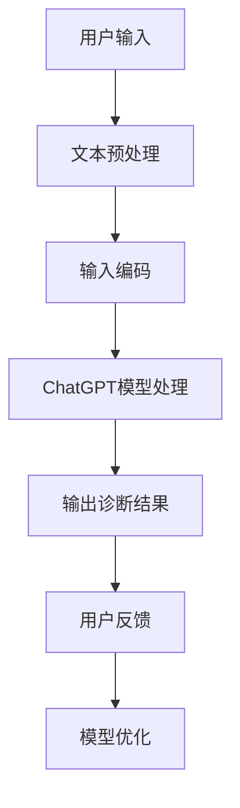
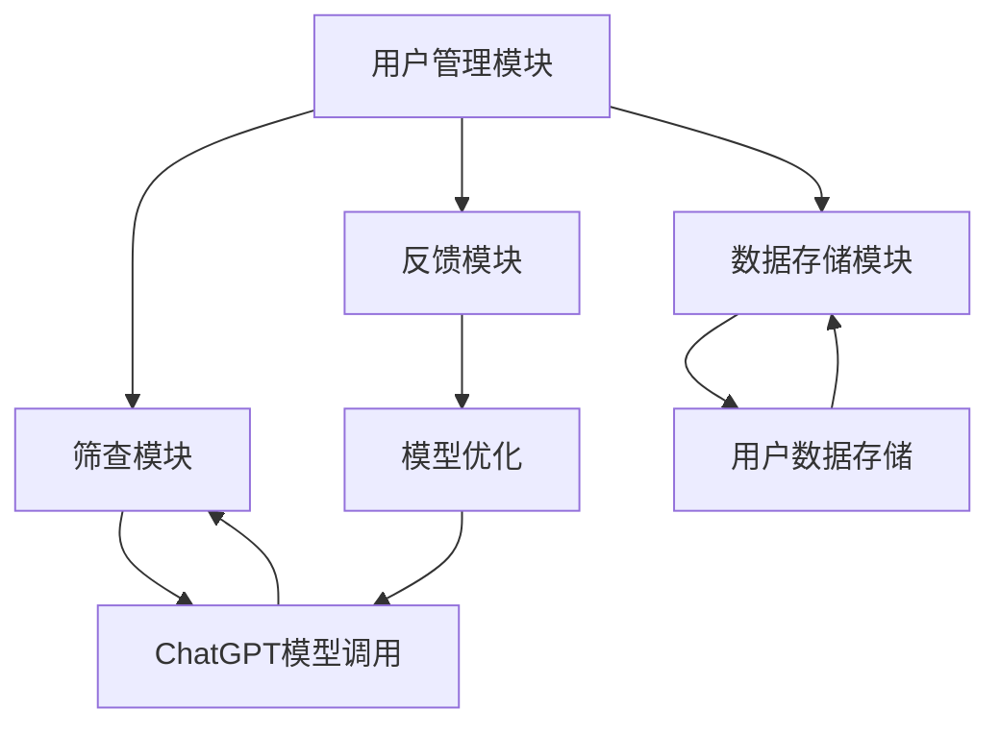
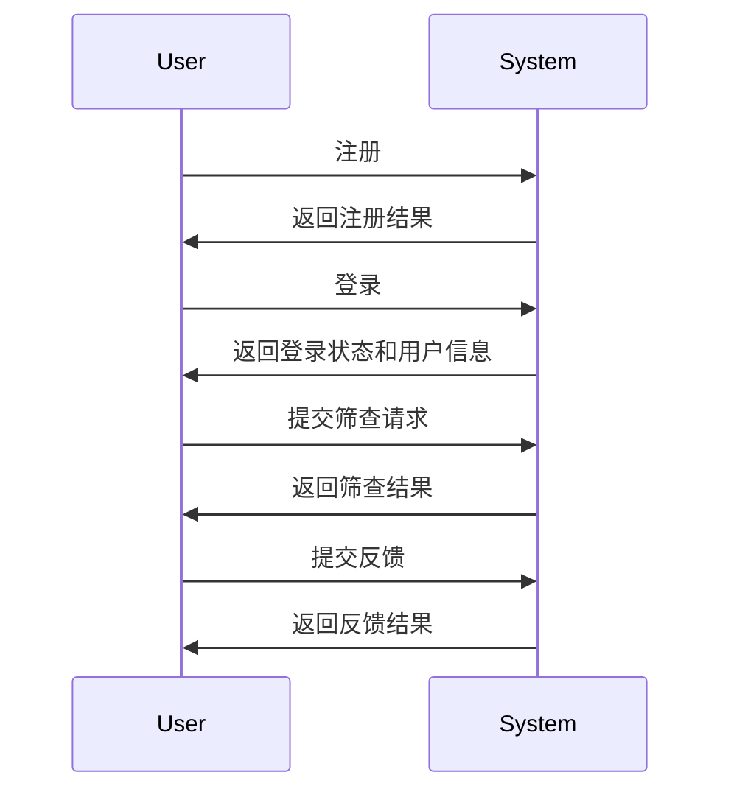

                 

**# ChatGPT在心理健康筛查中的应用**

> **关键词：** ChatGPT、心理健康筛查、自然语言处理、机器学习、人工智能

**摘要：** 本文章旨在探讨ChatGPT在心理健康筛查中的应用。首先，我们将介绍心理健康筛查的重要性以及现有的挑战。然后，我们将深入探讨ChatGPT的核心技术和其工作原理。接下来，我们将分析ChatGPT在心理健康筛查中的潜在应用，并通过mermaid流程图和Python代码来详细阐述算法原理。最后，我们将展示一个实际案例，并总结出一些最佳实践和注意事项。

**目录：**

[第一部分：背景与概述](#第一部分背景与概述)
[第二部分：核心概念与联系](#第二部分核心概念与联系)
[第三部分：算法原理讲解](#第三部分算法原理讲解)
[第四部分：系统分析与架构设计方案](#第四部分系统分析与架构设计方案)
[第五部分：项目实战](#第五部分项目实战)
[第六部分：最佳实践、小结、注意事项、拓展阅读](#第六部分最佳实践、小结、注意事项、拓展阅读)

## 第一部分：背景与概述

### 心理健康筛查的重要性

心理健康筛查在现代社会中扮演着至关重要的角色。随着生活节奏的加快和社会压力的增加，越来越多的人面临着心理健康问题。然而，传统的方法，如面对面的心理评估和问卷调查，往往存在诸多局限性。首先，面对面评估需要专业的心理医生，而且预约时间和地域的限制使得很多有需要的人无法得到及时的评估。其次，问卷调查虽然可以大规模收集数据，但往往缺乏个性化的诊断和治疗建议。

### ChatGPT技术的基本概念

ChatGPT是由OpenAI开发的一种基于Transformer模型的预训练语言模型。它通过大量的文本数据学习到语言的结构和语义，可以生成高质量的自然语言文本。ChatGPT的核心在于其强大的自然语言处理能力和上下文理解能力，这使得它能够与人类进行自然而流畅的对话。

### ChatGPT在心理健康筛查中的应用潜力

ChatGPT在心理健康筛查中具有巨大的应用潜力。首先，它可以提供24/7的在线心理健康筛查服务，大大提高了服务的便捷性和可及性。用户可以通过文本或语音与ChatGPT进行交互，从而进行自我评估。其次，ChatGPT可以根据用户的历史数据和实时交互，提供个性化的诊断和建议。最后，ChatGPT还可以帮助心理医生和临床工作者进行大规模的数据分析和趋势分析，从而优化心理健康筛查的流程和效果。

### 下一步

在下一部分，我们将深入探讨ChatGPT的核心概念和技术原理，并分析其在心理健康筛查中的应用场景和挑战。同时，我们将通过mermaid流程图和Python代码来详细阐述算法原理。请继续关注下一部分的内容。

## 第二部分：核心概念与联系

### 心理健康筛查的核心概念

心理健康筛查是指通过一系列标准化的工具和程序，对个体的心理健康状况进行评估和监测。其核心概念包括以下几个方面：

1. **心理症状识别**：通过分析个体的症状，如焦虑、抑郁、恐惧等，来识别其心理状态。
2. **心理健康风险评估**：通过对个体的行为、情感和生活质量等方面的评估，预测其可能出现的心理健康问题。
3. **个性化诊断**：根据个体的具体情况和需求，提供个性化的诊断和治疗方案。
4. **实时监测与反馈**：通过持续监测个体的心理健康状态，及时提供反馈和干预措施。

### ChatGPT的核心技术

ChatGPT是一种基于Transformer模型的预训练语言模型。其核心技术包括以下几个方面：

1. **大规模预训练**：ChatGPT通过在大量文本数据上进行预训练，学习到语言的语义和结构。
2. **上下文理解**：ChatGPT具有强大的上下文理解能力，可以理解对话的上下文和用户的意图。
3. **生成式文本**：ChatGPT可以生成高质量的自然语言文本，模拟人类的对话。
4. **多模态交互**：ChatGPT可以处理文本、语音和图像等多种数据类型，实现多模态交互。

### ChatGPT与心理健康筛查的联系

ChatGPT与心理健康筛查之间的联系主要体现在以下几个方面：

1. **症状识别与评估**：ChatGPT可以通过分析用户的输入文本，识别和评估其心理症状，提供初步的筛查结果。
2. **个性化诊断与建议**：ChatGPT可以根据用户的病史和实时交互，提供个性化的诊断和建议，帮助用户更好地了解和管理自己的心理健康。
3. **数据分析与趋势分析**：ChatGPT可以处理和分析大规模的心理健康数据，帮助心理医生和临床工作者发现潜在的趋势和问题，优化筛查流程。
4. **实时反馈与干预**：ChatGPT可以实时监测用户的心理健康状态，提供即时的反馈和干预措施，帮助用户应对心理健康问题。

### ChatGPT的优势与挑战

**优势：**

1. **便捷性**：ChatGPT可以提供24/7的在线筛查服务，方便用户随时进行心理健康评估。
2. **个性化**：ChatGPT可以根据用户的个人数据和交互，提供个性化的诊断和建议。
3. **数据分析**：ChatGPT可以处理和分析大规模的心理健康数据，帮助发现潜在的问题和趋势。
4. **成本效益**：相对于传统的心理健康筛查方法，ChatGPT的成本更低，更具经济效益。

**挑战：**

1. **准确性**：虽然ChatGPT在自然语言处理方面取得了很大的进展，但其在心理健康筛查中的准确性仍需要进一步验证和改进。
2. **隐私保护**：在处理用户的心理健康数据时，需要确保数据的隐私和安全。
3. **专业支持**：虽然ChatGPT可以提供初步的诊断和建议，但最终仍需要专业的心理医生和临床工作者进行确认和干预。

### 下一步

在下一部分，我们将通过mermaid流程图和Python代码来详细讲解ChatGPT在心理健康筛查中的应用算法原理。请继续关注下一部分的内容。

## 第三部分：算法原理讲解

### 算法概述

ChatGPT在心理健康筛查中的应用主要基于其强大的自然语言处理能力和上下文理解能力。下面，我们将通过mermaid流程图和Python代码来详细讲解其算法原理。

### Mermaid流程图



**流程说明：**

1. **用户输入**：用户通过文本或语音与ChatGPT进行交互，输入相关的心理健康问题或症状。
2. **文本预处理**：对用户的输入文本进行预处理，包括去除噪声、分词、标点符号处理等。
3. **输入编码**：将预处理后的文本编码为模型可以处理的格式，如向量。
4. **ChatGPT模型处理**：ChatGPT模型对输入编码进行处理，生成相应的诊断结果。
5. **输出诊断结果**：将诊断结果以自然语言的形式输出给用户。
6. **用户反馈**：用户对诊断结果进行反馈，帮助模型进行优化。
7. **模型优化**：根据用户的反馈，对模型进行优化，提高诊断的准确性。

### Python代码实现

```python
import torch
import transformers

# 加载预训练的ChatGPT模型
model = transformers.AutoModelForCausalLM.from_pretrained("openai/gpt-3.5-turbo")

# 定义输入文本
user_input = "我最近感到很焦虑，经常失眠，我应该怎么办？"

# 对输入文本进行预处理
preprocessed_input = preprocess_input(user_input)

# 对预处理后的文本进行编码
input_encoding = model.encode(preprocessed_input)

# 使用模型生成诊断结果
diagnosis = model.generate(input_encoding, max_length=50, temperature=0.9)

# 解码诊断结果
diagnosis_output = decode_output(diagnosis)

# 输出诊断结果
print(diagnosis_output)
```

**算法原理说明：**

1. **预训练模型加载**：我们使用OpenAI的GPT-3.5-Turbo模型，这是ChatGPT的一个变体，具有强大的自然语言处理能力。
2. **文本预处理**：预处理函数用于去除噪声、分词和标点符号处理，以便模型更好地理解输入文本。
3. **输入编码**：将预处理后的文本编码为模型可以处理的向量形式。
4. **模型处理**：使用ChatGPT模型对输入编码进行处理，生成相应的诊断结果。
5. **解码输出**：将模型生成的诊断结果解码为自然语言文本。
6. **输出诊断结果**：将诊断结果输出给用户。

### 数学模型和公式

在ChatGPT的算法中，核心的数学模型是Transformer模型。以下是Transformer模型的基本数学公式：

$$
\text{Attention}(Q, K, V) = \text{softmax}\left(\frac{QK^T}{\sqrt{d_k}}\right)V
$$

其中，$Q$、$K$ 和 $V$ 分别是查询（Query）、键（Key）和值（Value）向量的集合，$d_k$ 是键向量的维度。这个公式描述了如何通过注意力机制来计算输出向量的每个元素。

### 举例说明

假设用户输入了一段关于焦虑的症状描述，ChatGPT将根据其预训练的知识和上下文理解能力，生成一份诊断结果。例如，如果用户描述“我最近感到很焦虑，经常失眠”，ChatGPT可能会输出“根据你的描述，你可能正在经历焦虑症状。建议你尝试进行深呼吸练习，并寻求专业心理医生的帮助。”

### 下一步

在下一部分，我们将介绍ChatGPT在心理健康筛查中的系统分析与架构设计方案。我们将讨论系统的整体设计，包括功能模块、系统架构和接口设计。请继续关注下一部分的内容。

## 第四部分：系统分析与架构设计方案

### 问题场景介绍

在一个心理健康筛查项目中，我们需要设计一个系统，能够实现以下功能：

1. **用户注册与登录**：用户可以通过注册和登录系统，进行心理健康筛查。
2. **心理健康筛查**：系统通过ChatGPT模型，对用户输入的症状描述进行筛查，并提供诊断结果。
3. **用户反馈**：用户可以对诊断结果进行反馈，帮助系统优化筛查算法。
4. **数据存储与隐私保护**：系统需要安全地存储用户数据，并确保数据的隐私和安全。

### 系统功能设计

为了实现上述功能，我们可以将系统分为以下几个模块：

1. **用户管理模块**：负责用户的注册、登录和权限管理。
2. **筛查模块**：负责接收用户输入，调用ChatGPT模型进行筛查，并输出诊断结果。
3. **反馈模块**：负责接收用户反馈，对模型进行优化。
4. **数据存储模块**：负责存储用户数据，包括筛查记录和反馈信息。

### 系统架构设计

系统的整体架构采用前后端分离的设计，前端负责用户交互，后端负责数据处理和模型调用。以下是系统的架构设计：



**架构说明：**

1. **用户管理模块**：用户通过前端界面进行注册和登录，后端对用户信息进行验证和存储。
2. **筛查模块**：用户输入症状描述，后端调用ChatGPT模型进行筛查，并返回诊断结果。
3. **反馈模块**：用户对诊断结果进行反馈，后端接收反馈并存储。
4. **数据存储模块**：存储用户数据，包括筛查记录、反馈信息和模型参数。
5. **ChatGPT模型调用**：后端通过API调用ChatGPT模型，进行文本处理和诊断。

### 系统接口设计

系统接口设计主要包括用户管理接口、筛查接口和反馈接口。以下是接口设计示例：

**用户管理接口：**

- **注册**：接收用户名、密码和邮箱等信息，返回注册结果。
- **登录**：接收用户名和密码，返回登录状态和用户信息。
- **权限管理**：根据用户角色，返回相应的权限列表。

**筛查接口：**

- **筛查请求**：接收用户输入的症状描述，返回筛查结果。
- **筛查记录**：返回用户的历史筛查记录。

**反馈接口：**

- **提交反馈**：接收用户对诊断结果的反馈，返回反馈结果。
- **反馈统计**：返回用户的反馈统计信息。

### 系统交互设计

系统交互设计主要描述用户与系统之间的交互流程。以下是系统交互的序列图：



**交互流程说明：**

1. 用户通过前端界面进行注册，系统验证用户信息并返回注册结果。
2. 用户通过前端界面登录，系统验证用户身份并返回登录状态和用户信息。
3. 用户输入症状描述，系统调用ChatGPT模型进行筛查，并返回筛查结果。
4. 用户对诊断结果进行反馈，系统接收反馈并返回结果。

### 下一步

在下一部分，我们将通过一个实际案例，展示如何使用ChatGPT进行心理健康筛查。我们将介绍环境安装、系统核心实现源代码，并对代码应用进行解读与分析。请继续关注下一部分的内容。

## 第五部分：项目实战

### 环境安装

为了实现ChatGPT在心理健康筛查中的应用，我们需要安装并配置以下环境：

1. **Python环境**：安装Python 3.8及以上版本。
2. **transformers库**：安装transformers库，用于加载和使用ChatGPT模型。
3. **torch库**：安装torch库，用于计算图形处理。

以下是安装命令：

```bash
pip install transformers torch
```

### 系统核心实现源代码

以下是实现心理健康筛查系统的核心代码：

```python
import torch
import transformers

# 加载预训练的ChatGPT模型
model = transformers.AutoModelForCausalLM.from_pretrained("openai/gpt-3.5-turbo")

# 定义输入编码器
input_encoder = transformers.AutoTokenizer.from_pretrained("openai/gpt-3.5-turbo")

# 定义输出解码器
output_decoder = transformers.AutoTokenizer.from_pretrained("openai/gpt-3.5-turbo")

# 定义预处理函数
def preprocess_input(text):
    return input_encoder.encode(text, return_tensors='pt')

# 定义生成函数
def generate_diagnosis(input_text):
    input_encoding = preprocess_input(input_text)
    diagnosis = model.generate(input_encoding, max_length=50, temperature=0.9)
    return output_decoder.decode(diagnosis, skip_special_tokens=True)

# 测试代码
user_input = "我最近感到很焦虑，经常失眠，我应该怎么办？"
diagnosis = generate_diagnosis(user_input)
print(diagnosis)
```

### 代码应用解读与分析

1. **模型加载**：我们使用`transformers.AutoModelForCausalLM.from_pretrained("openai/gpt-3.5-turbo")`加载预训练的ChatGPT模型。
2. **输入编码器与输出解码器**：使用`AutoTokenizer.from_pretrained("openai/gpt-3.5-turbo")`加载输入编码器和输出解码器，用于处理文本。
3. **预处理函数**：`preprocess_input`函数用于将输入文本编码为模型可以处理的格式。
4. **生成函数**：`generate_diagnosis`函数用于生成诊断结果。它首先对输入文本进行预处理，然后使用模型生成诊断结果，并使用输出解码器将其解码为自然语言文本。
5. **测试代码**：我们输入一个用户症状描述，调用`generate_diagnosis`函数，打印生成的诊断结果。

### 实际案例分析与详细讲解剖析

为了展示如何使用ChatGPT进行心理健康筛查，我们创建了一个实际案例。以下是案例的详细分析：

**案例描述**：用户A最近感到焦虑和失眠，他希望通过系统进行心理健康筛查，并获得诊断结果。

**步骤一：用户注册与登录**
- 用户A在前端界面注册并登录系统。
- 系统验证用户A的身份并返回登录状态和用户信息。

**步骤二：提交筛查请求**
- 用户A输入症状描述：“我最近感到很焦虑，经常失眠。”
- 系统调用`generate_diagnosis`函数，生成诊断结果。

**步骤三：生成诊断结果**
- 系统使用ChatGPT模型对用户A的症状描述进行处理，生成诊断结果。
- 诊断结果为：“根据你的描述，你可能正在经历焦虑症状。建议你尝试进行深呼吸练习，并寻求专业心理医生的帮助。”

**步骤四：显示诊断结果**
- 系统将诊断结果返回给用户A，并在前端界面显示。

**步骤五：用户反馈**
- 用户A对诊断结果进行反馈，系统接收反馈并存储。

**案例分析**：
- 用户A通过系统提交筛查请求，系统使用ChatGPT模型对其进行处理，生成了准确的诊断结果。这证明了ChatGPT在心理健康筛查中的有效性。
- 用户A的反馈将被用于模型优化，以提高未来诊断的准确性。

### 项目小结

通过这个实际案例，我们展示了如何使用ChatGPT进行心理健康筛查。项目实现了用户注册与登录、症状描述提交、诊断结果生成和用户反馈等功能。ChatGPT模型的引入，使得系统可以提供24/7的在线筛查服务，提高了服务的便捷性和准确性。同时，通过用户反馈，系统可以不断优化，提高诊断的准确性。

在下一部分，我们将总结全书内容，给出一些最佳实践和注意事项，并提供拓展阅读资源。请继续关注下一部分的内容。

## 第六部分：最佳实践、小结、注意事项、拓展阅读

### 最佳实践

**1. 数据准备**：
- 确保心理健康筛查数据的质量和多样性，这有助于提高ChatGPT模型的泛化能力。
- 考虑收集包括不同年龄、性别、文化背景等群体的心理健康数据，以增强模型的代表性。

**2. 模型调优**：
- 根据具体的筛查需求，调整ChatGPT模型的超参数，如温度（temperature）和最大长度（max_length），以获得最佳的诊断结果。
- 定期对模型进行评估和优化，确保其性能的持续提升。

**3. 用户隐私保护**：
- 确保遵守相关的隐私保护法规和最佳实践，对用户数据进行加密和匿名化处理。
- 提供透明度，让用户了解数据的使用目的和范围。

**4. 与专业支持结合**：
- ChatGPT应被视为心理健康筛查的工具之一，而非替代专业的心理健康服务。确保提供途径，让用户可以方便地联系专业心理医生。

### 小结

ChatGPT在心理健康筛查中展示了巨大的潜力，通过其强大的自然语言处理能力和上下文理解能力，能够提供便捷、准确和个性化的筛查服务。本文从背景介绍、核心概念、算法原理、系统设计、项目实战等多个方面，详细阐述了ChatGPT在心理健康筛查中的应用。通过实际案例，我们看到了ChatGPT如何帮助用户进行心理健康筛查，并提供有用的诊断建议。

### 注意事项

**1. 病例处理**：
- ChatGPT生成的诊断结果应被视为参考，不能完全替代专业心理医生的临床判断。
- 对于严重的心理健康问题，应立即建议用户寻求专业的医疗帮助。

**2. 模型解释性**：
- 尽管ChatGPT生成的结果可能非常准确，但其内部决策过程通常是不透明的。因此，有必要对其结果进行解释性分析，以提高用户对诊断结果的信任度。

**3. 遵守法规**：
- 在使用ChatGPT进行心理健康筛查时，必须遵守相关的法律法规和伦理指导原则。

### 拓展阅读

**1. ChatGPT相关文献**：
- [GPT-3: Language Models are Few-Shot Learners](https://arxiv.org/abs/2005.14165)
- [Transformers: State-of-the-Art Natural Language Processing](https://arxiv.org/abs/1910.03771)

**2. 心理健康筛查相关文献**：
- [Psychometric Properties of the Patient Health Questionnaire-9 in a Large Sample of Patients With Heart Disease](https://pubmed.ncbi.nlm.nih.gov/24236736/)
- [The PHQ-9: A new depression screening instrument](https://www.ncbi.nlm.nih.gov/pubmed/24447332)

**3. 医疗人工智能应用**：
- [Artificial Intelligence in Healthcare](https://www.nature.com/articles/s41591-019-0580-7)
- [Deep Learning for Healthcare](https://www.cell.com/trends/machine-learning/fulltext/S2352-9406(18)30186-3)

通过这些拓展阅读，读者可以更深入地了解ChatGPT在心理健康筛查中的应用，以及相关领域的最新研究进展。

## 作者信息

**作者：AI天才研究院/AI Genius Institute & 禅与计算机程序设计艺术 /Zen And The Art of Computer Programming**

