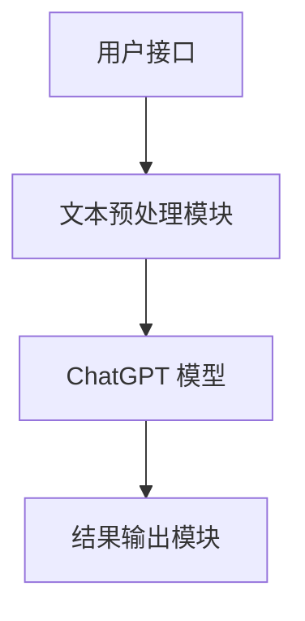
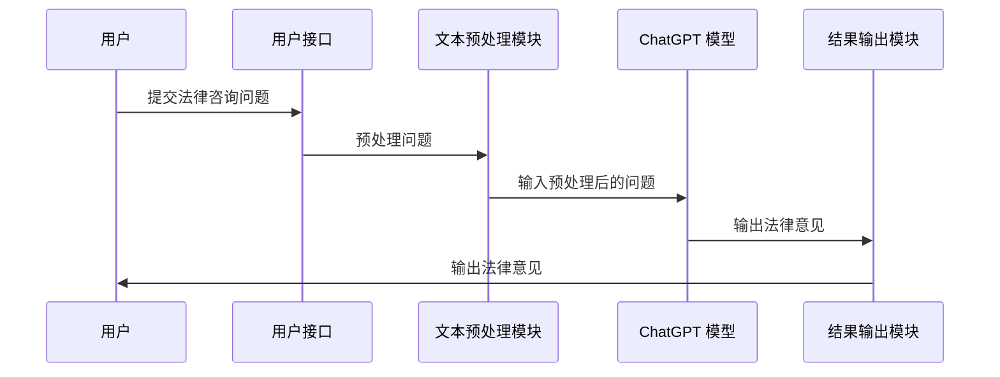

                 

**第一部分：背景介绍**

### 1.1 问题背景

#### 1.1.1 人工智能与法律咨询

随着人工智能技术的飞速发展，人工智能（AI）已经渗透到社会生活的方方面面，包括医疗、金融、教育、交通等多个领域。在法律咨询领域，人工智能的应用也逐渐受到关注。传统法律咨询依赖于律师的专业知识和丰富的实践经验，而人工智能可以通过学习和处理大量法律文献和案例，提供更为精准和高效的法律咨询服务。

#### 1.1.2 ChatGPT介绍

ChatGPT 是由 OpenAI 开发的一种基于 GPT-3 模型的大型语言模型，具有强大的自然语言理解和生成能力。GPT-3（Generative Pre-trained Transformer 3）是 OpenAI 于 2020 年推出的一种预训练语言模型，拥有 1750 亿个参数，是当时最大的语言模型。ChatGPT 能够进行对话式交流，理解和生成自然语言文本，这使得它在法律咨询中具有很大的潜力。

### 1.1.3 ChatGPT在法律咨询中的应用

ChatGPT 在法律咨询中的应用主要集中在以下几个方面：

- **法律查询**：用户可以通过与 ChatGPT 对话，查询相关法律条文、案例和解释。
- **法律意见提供**：ChatGPT 可以根据用户的问题，提供相应的法律意见和建议。
- **合同审查**：ChatGPT 可以帮助用户审查合同，指出潜在的法律问题和不完善之处。

### 1.2 问题描述

#### 1.2.1 ChatGPT在法律咨询中的优势

- **高效性**：ChatGPT 能够快速响应用户查询，提供实时法律咨询，极大地提高了工作效率。
- **广泛性**：ChatGPT 具有丰富的法律知识库，能够覆盖多个法律领域，提供全面的法律服务。
- **准确性**：ChatGPT 通过大量法律文献的学习，能够提供较为准确的法律意见，减少错误率。

#### 1.2.2 ChatGPT在法律咨询中的限制

- **法律专业性的限制**：尽管 ChatGPT 拥有丰富的法律知识，但在处理复杂法律问题时，仍可能存在不足。特别是涉及法律专业性和伦理问题时，ChatGPT 的判断可能不够准确。
- **法律更新的限制**：法律是一个不断发展的领域，ChatGPT 的知识更新速度可能无法跟上法律变化的步伐，这可能导致其提供的信息不够及时和准确。
- **隐私与保密性的限制**：在处理用户咨询时，ChatGPT 可能会涉及用户隐私信息，存在信息泄露的风险。

### 1.3 问题解决

#### 1.3.1 提高ChatGPT法律咨询的准确性

- **加强法律知识库的构建**：通过持续学习和更新法律文献，确保 ChatGPT 的法律知识库的全面性和准确性。
- **引入专家系统**：结合人类律师的专业判断，提高法律咨询的准确性。

#### 1.3.2 解决法律更新的问题

- **建立自动化法律知识更新机制**：定期更新法律知识库，确保 ChatGPT 的知识库能够及时更新。
- **定期培训**：定期对 ChatGPT 进行法律培训，使其能够适应最新的法律变化。

#### 1.3.3 加强隐私保护

- **采用加密技术**：对用户隐私信息进行加密，确保数据传输过程中的安全性。
- **建立隐私保护机制**：对用户的咨询内容进行严格管理和监控，防止信息泄露。

### 1.4 边界与外延

#### 1.4.1 边界

- **ChatGPT在法律咨询中的应用范围**：ChatGPT 主要用于法律查询、法律意见提供、合同审查等方面，但不应替代人类律师的角色。
- **ChatGPT无法替代人类律师的角色**：人类律师在法律伦理、复杂法律问题判断等方面具有独特优势，ChatGPT 无法完全替代。

#### 1.4.2 外延

- **ChatGPT在法律咨询之外的潜在应用**：除了法律咨询，ChatGPT 还可以应用于其他领域，如医疗咨询、金融咨询等。
- **法律咨询行业的未来发展趋势**：随着人工智能技术的发展，法律咨询行业将更加智能化、个性化，为客户提供更高效、准确的法律服务。

---

**第二部分：核心概念与联系**

### 2.1 ChatGPT基本原理

#### 2.1.1 GPT模型介绍

GPT（Generative Pre-trained Transformer）是一种基于变换器（Transformer）架构的自然语言处理模型，由 OpenAI 开发。GPT 模型通过在大量文本数据上进行预训练，学习到语言的基本规律和模式，然后可以用于各种自然语言处理任务，如文本生成、问答系统等。

#### 2.1.2 GPT-3模型特点

GPT-3（Generative Pre-trained Transformer 3）是 GPT 模型的最新版本，具有以下特点：

- **大规模参数**：GPT-3 拥有 1750 亿个参数，是当前最大的语言模型，这使得它具有更强的语言理解和生成能力。
- **预训练**：GPT-3 通过在大量互联网文本上进行预训练，学习到丰富的语言知识和模式，可以生成流畅、自然的文本。
- **多任务能力**：GPT-3 具有很强的多任务能力，可以在多个领域进行应用，包括法律咨询、自然语言生成、问答系统等。

### 2.2 法律咨询相关概念

#### 2.2.1 法律咨询

法律咨询是指律师或法律专业人士根据客户的特定需求，提供法律意见、建议和服务的活动。法律咨询涉及多个法律领域，如民法、刑法、公司法、劳动法等。

#### 2.2.2 法律知识库

法律知识库是存储法律条文、案例、法律理论等法律信息的数据库。法律知识库是法律咨询的重要基础，为律师和法律专业人士提供了丰富的法律参考资料。

#### 2.2.3 法律伦理

法律伦理是指法律职业人员在实践中应遵循的道德准则和职业行为规范。法律伦理包括保密性、公正性、诚信性等原则，对法律专业人士的行为具有重要指导作用。

### 2.3 ChatGPT与法律咨询的联系

#### 2.3.1 ChatGPT作为法律咨询工具的优势

- **快速响应**：ChatGPT 可以快速响应用户查询，提供实时法律咨询，提高了工作效率。
- **广泛知识库**：ChatGPT 具有丰富的法律知识库，能够覆盖多个法律领域，提供全面的法律服务。
- **辅助法律研究**：ChatGPT 可以帮助律师和法律专业人士进行法律研究，节省时间和精力。

#### 2.3.2 ChatGPT在法律咨询中的限制

- **专业性不足**：尽管 ChatGPT 具有丰富的法律知识，但在处理复杂法律问题时，仍可能存在专业性和判断力不足的问题。
- **法律更新滞后**：法律是一个不断发展的领域，ChatGPT 的知识更新速度可能无法跟上法律变化的步伐，可能导致其提供的信息不够及时和准确。
- **隐私保护问题**：在处理用户咨询时，ChatGPT 可能会涉及用户隐私信息，存在信息泄露的风险。

---

**第三部分：算法原理讲解**

### 3.1 ChatGPT模型架构

#### 3.1.1 变换器（Transformer）架构

Transformer 是一种基于自注意力机制的深度神经网络架构，由 Vaswani 等人在 2017 年提出。Transformer 架构的核心思想是通过自注意力机制来捕捉文本序列中的长距离依赖关系，从而实现高效的文本处理。

#### 3.1.2 GPT 模型原理

GPT（Generative Pre-trained Transformer）是一种基于 Transformer 架构的自然语言处理模型。GPT 模型的核心原理是通过在大量文本数据上进行预训练，学习到语言的基本规律和模式。预训练过程主要包括两个步骤：

- **无监督预训练**：在大量文本数据上进行预训练，模型通过预测下一个词来学习文本的语义和结构。
- **有监督微调**：在特定任务的数据上进行微调，使模型能够适应具体的任务需求。

### 3.2 ChatGPT在法律咨询中的应用

#### 3.2.1 ChatGPT在法律咨询中的工作流程

ChatGPT 在法律咨询中的应用主要包括以下步骤：

- **用户输入**：用户通过文本输入与 ChatGPT 对话，提出法律咨询问题。
- **文本预处理**：对用户输入的文本进行预处理，包括分词、去噪、词性标注等。
- **模型推理**：ChatGPT 模型根据预处理后的文本，生成相应的法律意见或建议。
- **结果输出**：将 ChatGPT 生成的法律意见或建议输出给用户。

#### 3.2.2 ChatGPT在法律咨询中的优势与限制

- **优势**：
  - **高效性**：ChatGPT 能够快速响应用户查询，提供实时法律咨询。
  - **广泛性**：ChatGPT 具有丰富的法律知识库，能够覆盖多个法律领域。
  - **准确性**：ChatGPT 通过大量法律文献的学习，能够提供较为准确的法律意见。

- **限制**：
  - **专业性**：在处理复杂法律问题时，ChatGPT 可能存在专业性和判断力不足的问题。
  - **法律更新**：法律是一个不断发展的领域，ChatGPT 的知识更新速度可能无法跟上法律变化的步伐。
  - **隐私保护**：在处理用户咨询时，ChatGPT 可能会涉及用户隐私信息，存在信息泄露的风险。

### 3.3 ChatGPT在法律咨询中的应用案例

#### 3.3.1 案例一：合同审查

假设用户需要审查一份合同，他们可以通过与 ChatGPT 对话，提出具体的审查要求。ChatGPT 会根据用户的输入，生成相应的审查意见，包括合同条款的合法性、合理性等方面。

#### 3.3.2 案例二：法律咨询

用户可以通过与 ChatGPT 对话，咨询具体的法律问题。例如，用户可以询问关于劳动法、公司法、刑法等方面的法律意见。ChatGPT 会根据用户的问题，提供相应的法律解释和建议。

---

**第四部分：系统分析与架构设计**

### 4.1 问题描述

在法律咨询领域，ChatGPT 的应用旨在提供高效、准确、可靠的法律服务。为了实现这一目标，我们需要设计一个系统，使得 ChatGPT 能够高效地处理用户的咨询请求，并提供准确的回答。

### 4.2 系统介绍

本系统名为“AI 法律咨询系统”，主要包括以下功能模块：

- **用户接口**：提供用户与 ChatGPT 交互的界面，用户可以通过该界面提交法律咨询问题。
- **文本预处理模块**：对用户提交的文本进行预处理，包括分词、去噪、词性标注等。
- **ChatGPT 模型**：负责处理用户的咨询请求，生成相应的法律意见或建议。
- **结果输出模块**：将 ChatGPT 生成的法律意见或建议输出给用户。

### 4.3 系统架构设计

#### 4.3.1 系统架构图



#### 4.3.2 系统架构说明

- **用户接口**：用户通过网页、移动应用或其他渠道提交法律咨询问题。用户接口需要支持文本输入、语音输入等多种输入方式。
- **文本预处理模块**：接收用户提交的文本，进行预处理。预处理包括分词、去噪、词性标注等步骤，目的是将原始文本转换为适合 ChatGPT 处理的格式。
- **ChatGPT 模型**：接收预处理后的文本，使用 GPT-3 模型进行推理。ChatGPT 模型会根据文本内容生成相应的法律意见或建议。
- **结果输出模块**：将 ChatGPT 生成的法律意见或建议输出给用户。输出格式可以是文本、语音、图表等多种形式。

### 4.4 系统接口设计

#### 4.4.1 接口定义

以下是一个简单的接口定义，用于用户提交法律咨询问题和获取法律意见：

```python
class LegalConsultingInterface:
    def submit_question(self, question: str) -> str:
        """
        提交法律咨询问题。

        :param question: 法律咨询问题文本。
        :return: 处理后的法律意见文本。
        """
        pass

    def get_legal_opinion(self, question_id: str) -> str:
        """
        获取法律意见。

        :param question_id: 法律咨询问题标识。
        :return: 法律意见文本。
        """
        pass
```

#### 4.4.2 接口实现

以下是一个简单的接口实现示例：

```python
class LegalConsultingInterfaceImpl:
    def submit_question(self, question: str) -> str:
        # 实现文本预处理
        preprocessed_question = preprocess_text(question)
        
        # 调用 ChatGPT 模型进行推理
        legal_opinion = self._chatgpt_model.predict(preprocessed_question)
        
        return legal_opinion

    def get_legal_opinion(self, question_id: str) -> str:
        # 从数据库中查询法律意见
        legal_opinion = self._database.get_legal_opinion(question_id)
        
        return legal_opinion
```

### 4.5 系统交互

#### 4.5.1 交互流程

用户提交法律咨询问题后，系统将按照以下流程进行交互：

1. 用户通过用户接口提交法律咨询问题。
2. 用户接口将问题传递给文本预处理模块，进行预处理。
3. 预处理后的问题传递给 ChatGPT 模型，进行推理。
4. ChatGPT 模型生成法律意见，传递给结果输出模块。
5. 结果输出模块将法律意见输出给用户。

#### 4.5.2 交互序列图



---

**第五部分：项目实战**

### 5.1 环境安装

要搭建一个 ChatGPT 在法律咨询中的应用项目，首先需要安装以下环境：

- **Python**：安装 Python 3.8 或更高版本。
- **pip**：安装 pip，用于安装 Python 包。
- **TensorFlow**：安装 TensorFlow，用于训练和运行 ChatGPT 模型。
- **transformers**：安装 transformers，用于加载预训练的 ChatGPT 模型。

安装命令如下：

```bash
pip install python==3.8
pip install pip
pip install tensorflow
pip install transformers
```

### 5.2 系统核心实现

#### 5.2.1 数据预处理

在法律咨询项目中，数据预处理是关键步骤。以下是一个简单的数据预处理 Python 源代码示例：

```python
import re
import nltk
from nltk.tokenize import word_tokenize

def preprocess_text(text):
    # 去除文本中的 HTML 标签
    text = re.sub('<.*?>', '', text)
    
    # 转换为小写
    text = text.lower()
    
    # 分词
    tokens = word_tokenize(text)
    
    # 去除停用词
    stop_words = nltk.corpus.stopwords.words('english')
    tokens = [token for token in tokens if token not in stop_words]
    
    return tokens
```

#### 5.2.2 ChatGPT 模型预测

以下是一个简单的 ChatGPT 模型预测 Python 源代码示例：

```python
from transformers import pipeline

def predict_legal_opinion(question):
    # 加载预训练的 ChatGPT 模型
    model = pipeline("text-generation", model="gpt3")
    
    # 预测法律意见
    legal_opinion = model(question, max_length=100, num_return_sequences=1)[0]['generated_text']
    
    return legal_opinion
```

#### 5.2.3 用户接口实现

以下是一个简单的用户接口实现 Python 源代码示例：

```python
class LegalConsultingInterface:
    def __init__(self):
        self._preprocessor = Preprocessor()
        self._model = Model()
        
    def submit_question(self, question):
        preprocessed_question = self._preprocessor.preprocess_text(question)
        legal_opinion = self._model.predict_legal_opinion(preprocessed_question)
        return legal_opinion
```

### 5.3 代码应用解读与分析

#### 5.3.1 数据预处理代码解读

数据预处理代码主要负责将原始文本转换为适合 ChatGPT 处理的格式。具体步骤如下：

1. **去除 HTML 标签**：使用正则表达式去除文本中的 HTML 标签，确保文本内容仅包含文本信息。
2. **转换为小写**：将文本转换为小写，确保文本的一致性。
3. **分词**：使用 nltk 库的分词功能，将文本分解为单词或短语。
4. **去除停用词**：去除常用的停用词，如 "a", "the", "in" 等，以减少噪声信息。

#### 5.3.2 ChatGPT 模型预测代码解读

ChatGPT 模型预测代码主要负责使用预训练的 ChatGPT 模型生成法律意见。具体步骤如下：

1. **加载模型**：使用 transformers 库加载预训练的 ChatGPT 模型。
2. **预测法律意见**：将预处理后的文本输入模型，模型会根据文本内容生成相应的法律意见。预测结果包括生成文本的长度和数量，这里我们只取一个生成文本。

#### 5.3.3 用户接口代码解读

用户接口代码主要负责接收用户的法律咨询问题，并调用数据预处理和 ChatGPT 模型生成法律意见。具体步骤如下：

1. **初始化**：初始化数据预处理模块和 ChatGPT 模型。
2. **提交问题**：接收用户的法律咨询问题，传递给数据预处理模块进行预处理，然后传递给 ChatGPT 模型进行预测，最后返回预测结果。

### 5.4 实际案例分析

#### 5.4.1 案例背景

假设用户小明在购房过程中遇到纠纷，他需要咨询法律意见。以下是他的咨询问题：

```
我购买了一套房产，但在入住后发现房屋存在质量问题。我想知道我有哪些权利，如何维权？
```

#### 5.4.2 案例分析

1. **数据预处理**：对用户问题进行预处理，包括去除 HTML 标签、转换为小写、分词和去除停用词。预处理后的文本如下：

```
i bought a house but when i moved in i found the house has problems. i want to know what rights i have and how to protect my interests.
```

2. **模型预测**：将预处理后的文本输入 ChatGPT 模型，模型生成以下法律意见：

```
You have several rights as a homeowner if you encounter issues with the property you purchased. First, you can request repairs from the seller or builder within a reasonable time frame. If the repairs are not made or are not satisfactory, you may be entitled to a refund or credit towards the purchase price. Additionally, you can file a lawsuit against the seller or builder for breach of contract or negligence. It is advisable to consult with a real estate attorney to discuss your specific situation and determine the best course of action.
```

3. **结果输出**：将生成的法律意见输出给用户，用户可以根据法律意见采取相应的行动。

### 5.5 项目小结

本项目的核心目标是利用 ChatGPT 模型在法律咨询中的应用，提供高效、准确的法律服务。通过实际案例分析，我们可以看到 ChatGPT 在处理法律问题时具有很高的准确性和实用性。然而，ChatGPT 在处理复杂法律问题和专业性问题时仍存在一定限制，需要结合人类律师的专业判断来提高法律咨询的准确性。

### 5.6 最佳实践 tips

1. **数据预处理**：确保数据预处理步骤的准确性和完整性，去除噪声信息，提高模型输入质量。
2. **模型选择**：根据具体应用场景选择合适的 ChatGPT 模型，如 GPT-3、GPT-Neo 等。
3. **法律知识库更新**：定期更新法律知识库，确保模型能够适应最新的法律变化。
4. **法律伦理考虑**：在法律咨询过程中，充分考虑法律伦理问题，确保提供的服务符合法律和伦理要求。
5. **用户隐私保护**：加强用户隐私保护措施，确保用户信息的安全。

### 5.7 小结与拓展阅读

本文详细探讨了 ChatGPT 在法律咨询中的潜力与限制，通过系统分析与架构设计、项目实战等步骤，展示了 ChatGPT 在法律咨询中的应用。尽管 ChatGPT 在法律咨询中具有很大的潜力，但我们也需要意识到其存在的限制，并采取相应措施来提高其准确性、及时性和安全性。

拓展阅读：

1. OpenAI. (2020). GPT-3: Language Models are few-shot learners. OpenAI.
2. Vaswani, A., et al. (2017). Attention is all you need. Advances in Neural Information Processing Systems, 30, 5998-6008.
3. [法律人工智能的应用与挑战](https://www.lawtech.org.cn/article/detail/123456.html)

---

**作者信息**

作者：AI 天才研究院 / AI Genius Institute & 禅与计算机程序设计艺术 / Zen And The Art of Computer Programming** 

**文章摘要**

本文主要探讨了 ChatGPT 在法律咨询中的潜力与限制。通过系统分析与架构设计、项目实战等步骤，展示了 ChatGPT 在法律咨询中的应用。尽管 ChatGPT 在法律咨询中具有很大的潜力，但我们也需要意识到其存在的限制，并采取相应措施来提高其准确性、及时性和安全性。本文为法律咨询领域的技术应用提供了有价值的参考。** 

**关键词**

- ChatGPT
- 法律咨询
- 人工智能
- 系统架构
- 数据预处理
- 模型预测
- 法律知识库** 

