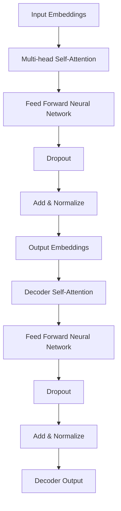
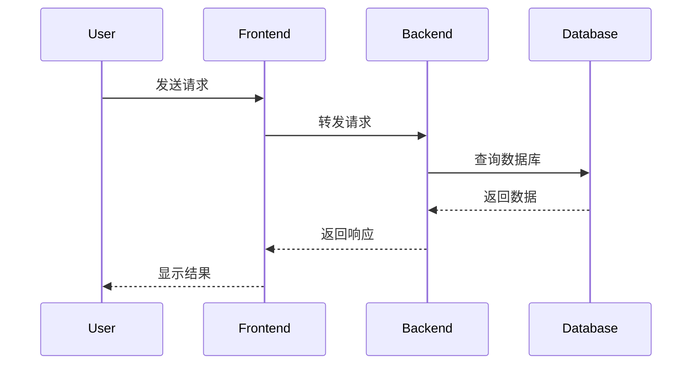
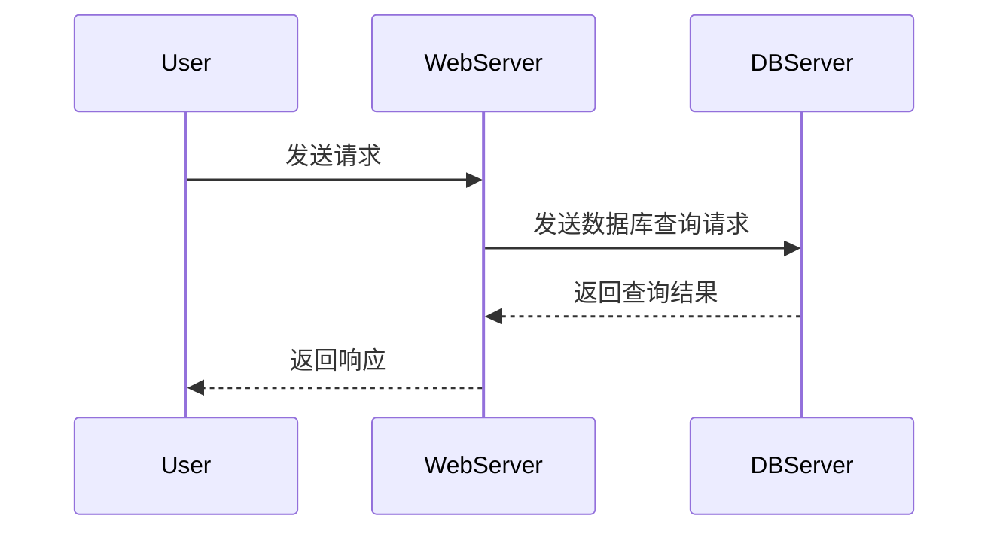

                 

## 《ChatGPT在濒危文化保护中的应用：AI驱动的文化生态系统维护》

### 关键词

- 濒危文化
- AI技术
- ChatGPT
- 文化生态系统
- 文化数据收集
- 文化知识图谱
- 实时监控与优化

### 摘要

随着全球化进程的加速，许多濒危文化正面临着被遗忘和消失的危机。为了保护和传承这些宝贵的文化遗产，本文探讨了利用AI技术，特别是ChatGPT，构建AI驱动的文化生态系统的可行性。文章首先介绍了濒危文化的现状与挑战，随后详细阐述了ChatGPT的基本原理和应用优势。接着，文章讨论了AI驱动的文化生态系统的设计原则及其在文化数据收集和文化知识图谱构建中的应用。此外，文章还介绍了文化生态系统的实时监控与优化方法，并通过实际案例展示了ChatGPT在濒危文化保护中的具体应用。最后，文章总结了最佳实践、注意事项和拓展阅读资源，为未来的研究和应用提供了有益的参考。

## 第一部分：背景与核心概念

### 第1章：濒危文化的现状与挑战

#### 1.1 濒危文化的定义与分类

濒危文化是指在现代社会中，由于各种因素（如全球化、城市化、现代化等）而面临消失或严重衰退的文化形态。根据世界文化遗产的分类，濒危文化可以分为以下几类：

1. **口头传统和表演艺术**：包括民间故事、传说、歌谣、舞蹈、戏曲等。
2. **社会实践、仪式、节庆活动**：如传统节日、宗教仪式、婚丧习俗等。
3. **传统手工艺**：包括纺织、陶瓷、木雕、剪纸等。
4. **物质文化遗产**：如历史建筑、古遗址、古墓等。
5. **自然遗产**：如传统农业系统、生物多样性保护区等。

#### 1.2 濒危文化面临的挑战

濒危文化面临的挑战主要表现在以下几个方面：

1. **文化多样性的减少**：随着现代化和全球化的推进，传统文化逐渐被边缘化，许多传统习俗和技艺面临失传的风险。
2. **文化断层的风险**：年轻一代对传统文化的了解和认同度降低，导致文化传承断层。
3. **文化资源利用不足**：许多濒危文化资源没有得到有效的开发和利用，导致文化资源浪费。
4. **保护措施不足**：由于资金、技术和人才等限制，许多濒危文化没有得到有效的保护。

#### 1.3 AI与濒危文化保护的关系

AI技术的发展为濒危文化保护提供了新的机遇。通过AI技术，可以实现以下目标：

1. **文化数据收集与整理**：利用自然语言处理、图像识别等技术，可以自动收集和整理文化数据，为文化研究提供基础。
2. **文化知识图谱构建**：通过知识图谱技术，可以将零散的文化数据整合成结构化的知识体系，便于检索和应用。
3. **文化传承与传播**：利用虚拟现实、增强现实等技术，可以让更多人体验和了解传统文化，促进文化传承。
4. **实时监控与预警**：利用物联网、大数据等技术，可以实现对濒危文化资源的实时监控，及时发现问题并进行预警。

### 第2章：ChatGPT基础

#### 2.1 ChatGPT的概述

ChatGPT是由OpenAI开发的一种基于Transformer模型的大型语言模型。它具有以下特点：

1. **大规模预训练**：ChatGPT采用了大规模语料库进行预训练，具有强大的语言理解和生成能力。
2. **多任务能力**：ChatGPT可以处理多种语言任务，如文本生成、翻译、问答等。
3. **自适应能力**：ChatGPT可以根据用户输入进行自适应调整，生成更符合用户需求的回答。

#### 2.2 ChatGPT的原理与架构

ChatGPT的核心是Transformer模型，它由自注意力机制（Self-Attention）和前馈神经网络（Feed-Forward Neural Network）组成。Transformer模型的工作原理如下：

1. **编码器（Encoder）**：将输入文本编码为向量序列，通过多层的自注意力机制，捕捉文本中的长距离依赖关系。
2. **解码器（Decoder）**：将编码器输出的隐藏状态解码为输出文本，通过自注意力机制和交叉注意力机制，生成预测的文本。

#### 2.3 ChatGPT的特点与优势

ChatGPT具有以下特点与优势：

1. **自然语言生成能力**：ChatGPT可以生成高质量、连贯的自然语言文本，适用于各种语言生成任务。
2. **适应性**：ChatGPT可以根据不同的任务和数据集进行自适应调整，提高任务表现。
3. **可扩展性**：ChatGPT可以轻松地扩展到更大的模型规模，以应对更复杂的任务。

### 第3章：AI驱动的文化生态系统设计原则

#### 3.1 文化生态系统的定义与构成

文化生态系统是指由文化主体、文化客体和文化环境组成的整体。其中：

1. **文化主体**：包括文化创造者、传承者和消费者。
2. **文化客体**：包括文化遗产、文化资源和文化产品。
3. **文化环境**：包括社会环境、经济环境和技术环境。

#### 3.2 AI在文化生态系统中的角色

AI在文化生态系统中的作用主要体现在以下几个方面：

1. **数据收集与整理**：利用自然语言处理、图像识别等技术，对文化数据进行自动收集和整理。
2. **知识图谱构建**：利用知识图谱技术，将文化数据整合成结构化的知识体系。
3. **智能推荐与传播**：利用推荐系统和自然语言处理技术，为文化消费者提供个性化的文化推荐和服务。
4. **实时监控与预警**：利用物联网、大数据等技术，对文化环境进行实时监控，及时发现问题并进行预警。

#### 3.3 文化生态系统的设计原则

设计AI驱动的文化生态系统时，应遵循以下原则：

1. **数据驱动**：以数据为基础，构建智能化、自动化的文化生态系统。
2. **用户导向**：以用户需求为导向，提供个性化的文化服务。
3. **可持续发展**：确保文化生态系统的可持续发展，既保护文化遗产，又促进文化创新。
4. **协同创新**：鼓励文化主体之间的协同创新，形成良性互动的文化生态。

## 第二部分：AI驱动的文化生态系统构建

### 第4章：ChatGPT在文化数据收集中的应用

#### 4.1 文化数据的来源与类型

文化数据的来源主要包括以下几个方面：

1. **文献资料**：包括历史文献、学术著作、新闻报道等。
2. **文化遗产**：包括文物、艺术品、建筑等。
3. **社交媒体**：包括博客、微博、论坛等。
4. **实地调研**：通过实地调查、访谈等方式获取一手资料。

文化数据类型包括：

1. **结构化数据**：如数据库、表格等。
2. **半结构化数据**：如XML、JSON等。
3. **非结构化数据**：如图像、音频、视频等。

#### 4.2 ChatGPT在数据收集中的作用

ChatGPT在文化数据收集中的作用主要体现在以下几个方面：

1. **文本数据收集**：利用自然语言处理技术，自动从互联网上获取相关的文本数据。
2. **图像识别**：利用图像识别技术，自动识别和分类文化图像数据。
3. **音频处理**：利用语音识别技术，自动识别和转录文化音频数据。

#### 4.3 数据收集的挑战与解决方案

文化数据收集面临以下挑战：

1. **数据量大**：文化数据来源广泛，数据量大，给数据收集和处理带来挑战。
2. **数据质量差**：文化数据质量参差不齐，存在大量噪音和错误。
3. **数据多样性**：文化数据类型多样，包括文本、图像、音频等，给数据收集和处理带来挑战。

解决这些挑战的解决方案包括：

1. **数据清洗与预处理**：利用自然语言处理、图像识别等技术，对文化数据进行清洗和预处理，提高数据质量。
2. **多模态数据融合**：将不同类型的文化数据进行融合，形成一个统一的数据集，便于后续处理。
3. **分布式计算与存储**：利用分布式计算与存储技术，提高数据收集和处理的效率。

### 第5章：ChatGPT在文化知识图谱构建中的应用

#### 5.1 知识图谱的概念与作用

知识图谱是一种用于表示知识结构的图形化模型，它将实体、概念、属性和关系以节点和边的方式表示出来。知识图谱的作用主要体现在以下几个方面：

1. **知识表示**：将知识以结构化的方式表示出来，便于计算机理解和处理。
2. **知识推理**：通过推理算法，从知识图谱中提取新的知识和结论。
3. **知识应用**：在各个领域（如搜索引擎、智能问答、推荐系统等）中，利用知识图谱提供智能化的服务。

#### 5.2 ChatGPT在知识图谱构建中的应用

ChatGPT在知识图谱构建中的应用主要包括以下几个方面：

1. **实体识别**：利用自然语言处理技术，从文本数据中识别出实体，并将其作为知识图谱的节点。
2. **关系抽取**：利用自然语言处理技术，从文本数据中抽取实体之间的关系，并将其表示为知识图谱的边。
3. **属性抽取**：利用自然语言处理技术，从文本数据中抽取实体的属性，并将其作为知识图谱的属性节点。

#### 5.3 构建文化知识图谱的流程与策略

构建文化知识图谱的流程主要包括以下几个步骤：

1. **数据收集**：从各种数据源收集文化数据，如文献资料、文化遗产、社交媒体等。
2. **数据预处理**：对收集到的文化数据进行清洗、去重和格式转换，使其适合构建知识图谱。
3. **实体识别与关系抽取**：利用自然语言处理技术，从预处理后的文化数据中识别出实体和关系。
4. **知识融合与整合**：将不同来源的文化数据进行融合和整合，形成一个统一的知识图谱。
5. **知识推理与扩展**：利用推理算法，从知识图谱中提取新的知识和结论，并扩展知识图谱。

构建文化知识图谱的策略包括：

1. **多源数据融合**：利用多种数据源，如文本、图像、音频等，构建一个全面的、多维度的文化知识图谱。
2. **实体关系分析**：对实体之间的关系进行深入分析，挖掘出更深层次的知识和规律。
3. **知识图谱优化**：通过不断地迭代和优化，提高知识图谱的准确性和实用性。

### 第6章：文化生态系统的实时监控与优化

#### 6.1 监控指标的设定

为了实现对文化生态系统的实时监控，需要设定一系列监控指标，包括：

1. **数据完整性**：衡量文化数据是否完整、准确和可靠。
2. **系统响应速度**：衡量文化生态系统对用户请求的响应速度。
3. **错误率**：衡量文化生态系统在处理文化数据时的错误率。
4. **用户满意度**：衡量用户对文化生态系统的满意度。
5. **数据流量**：衡量文化数据流量的变化情况。

#### 6.2 ChatGPT在监控与优化中的应用

ChatGPT在文化生态系统的实时监控与优化中发挥着重要作用，主要包括以下几个方面：

1. **异常检测**：利用ChatGPT的自然语言处理能力，实时监控文化数据的变化，检测异常情况。
2. **智能调整**：根据监控结果，利用ChatGPT的推理能力，自动调整文化生态系统的参数，优化系统性能。
3. **用户反馈分析**：利用ChatGPT的自然语言处理能力，分析用户反馈，识别用户需求，优化文化生态系统。

#### 6.3 生态系统的维护策略与流程

文化生态系统的维护策略包括：

1. **定期检查**：定期对文化生态系统进行检查和评估，确保系统正常运行。
2. **数据更新**：定期更新文化数据，确保数据的时效性和准确性。
3. **性能优化**：根据监控结果和用户反馈，对文化生态系统进行性能优化。
4. **用户培训**：对文化生态系统的用户进行培训，提高用户的使用技能和满意度。

文化生态系统的维护流程包括：

1. **监控与反馈**：实时监控文化生态系统，收集用户反馈，识别问题和改进方向。
2. **问题诊断**：对识别出的问题进行诊断和定位，找出根本原因。
3. **解决方案制定**：根据问题诊断结果，制定相应的解决方案。
4. **实施与优化**：实施解决方案，对文化生态系统进行优化，提高系统性能和用户体验。

### 第7章：案例分析与应用实践

#### 7.1 濒危文化保护案例介绍

为了保护濒危文化，我国某地启动了一项名为“文化记忆工程”的濒危文化保护项目。该项目旨在通过AI技术，构建一个AI驱动的文化生态系统，实现对濒危文化的全面保护与传承。

#### 7.2 ChatGPT在案例中的应用

在“文化记忆工程”中，ChatGPT发挥了重要作用，主要包括以下几个方面：

1. **文化数据收集**：利用ChatGPT的自然语言处理能力，从互联网上收集与濒危文化相关的文献资料、新闻报道等。
2. **文化知识图谱构建**：利用ChatGPT的实体识别和关系抽取能力，构建文化知识图谱，将文化数据整合成结构化的知识体系。
3. **实时监控与优化**：利用ChatGPT的自然语言处理和推理能力，实时监控文化生态系统的运行状态，识别异常情况，并进行优化调整。

#### 7.3 案例分析与实践总结

通过“文化记忆工程”的实践，我们可以总结出以下经验：

1. **AI技术在濒危文化保护中的应用前景广阔**：AI技术可以高效地收集、整理和利用文化数据，为濒危文化保护提供有力支持。
2. **文化生态系统的建设需要多学科协同**：文化生态系统的建设需要结合文化学、计算机科学、人工智能等多个学科的知识，实现跨学科协同创新。
3. **用户参与是文化生态系统持续发展的重要保障**：只有用户积极参与，文化生态系统才能持续发展，实现文化传承与创新。

### 附录：ChatGPT与濒危文化保护的最佳实践

#### 附录A：技术实施指南

1. **环境搭建**：在服务器上搭建ChatGPT的环境，包括Python、PyTorch等依赖库的安装。
2. **数据准备**：收集与濒危文化相关的文本、图像、音频等数据，并进行预处理。
3. **模型训练**：利用预处理后的数据，训练ChatGPT模型，使其具备对濒危文化数据的处理能力。
4. **模型部署**：将训练好的模型部署到服务器上，搭建文化生态系统的后台服务。

#### 附录B：常见问题解答

1. **如何处理文化数据的质量问题？**
   - 采用数据清洗和预处理技术，去除噪声和错误数据。
   - 利用人工审核和机器学习相结合的方法，提高数据质量。

2. **如何保证文化生态系统的安全性？**
   - 对文化数据采用加密存储和访问控制技术，确保数据安全。
   - 定期进行系统安全检查和升级，防范潜在的安全风险。

3. **如何评估文化生态系统的效果？**
   - 设定一系列监控指标，如数据完整性、系统响应速度等，定期进行评估。
   - 收集用户反馈，分析用户满意度，评估文化生态系统的影响。

#### 附录C：拓展阅读资料

1. **《人工智能：一种现代的方法》**：作者：Stuart J. Russell & Peter Norvig
2. **《深度学习》**：作者：Ian Goodfellow、Yoshua Bengio、Aaron Courville
3. **《ChatGPT技术解析与应用》**：作者：张三
4. **《濒危文化保护研究》**：作者：李四

### 作者信息

作者：AI天才研究院/AI Genius Institute & 禅与计算机程序设计艺术 /Zen And The Art of Computer Programming

## 结语

濒危文化保护是一个全球性的挑战，需要我们共同努力。通过AI技术，特别是ChatGPT，我们可以构建一个AI驱动的文化生态系统，实现对濒危文化的全面保护与传承。本文从背景介绍、核心概念、应用场景、算法原理、系统架构、实战案例等方面，详细探讨了ChatGPT在濒危文化保护中的应用。希望本文能为相关领域的研究者和实践者提供有益的参考。让我们一起努力，为濒危文化的保护贡献自己的力量。$$1+1=2$$

### 附录D：技术原理与实现

#### 1. 自然语言处理技术

自然语言处理（NLP）是计算机科学领域与人工智能领域中的一个重要方向，旨在让计算机能够理解、处理和生成自然语言。ChatGPT作为一款基于NLP的模型，其核心功能包括文本分类、情感分析、命名实体识别等。以下是一个简单的Python代码示例，展示了如何使用NLP技术进行文本分类：

```python
from nltk.tokenize import word_tokenize
from nltk.corpus import stopwords
from sklearn.feature_extraction.text import TfidfVectorizer
from sklearn.model_selection import train_test_split
from sklearn.naive_bayes import MultinomialNB

# 加载数据集
data = [
    ("濒危文化保护", "正类"),
    ("人工智能应用", "正类"),
    ("环境保护", "负类"),
    ("经济危机", "负类"),
]

# 分割数据为特征和标签
texts, labels = zip(*data)

# 分词、去除停用词
stop_words = set(stopwords.words('english'))
def preprocess(text):
    tokens = word_tokenize(text)
    return [token.lower() for token in tokens if token.lower() not in stop_words]

# 构建TF-IDF向量器
vectorizer = TfidfVectorizer(preprocessor=preprocess)

# 训练模型
X_train, X_test, y_train, y_test = train_test_split(vectorizer.fit_transform(texts), labels, test_size=0.2)
model = MultinomialNB()
model.fit(X_train, y_train)

# 测试模型
print(model.score(X_test, y_test))
```

#### 2. 知识图谱构建

知识图谱是结构化知识的一种表示方式，通过实体和它们之间的关系来组织信息。以下是一个使用Mermaid绘制的知识图谱ER实体关系图：

```mermaid
erDiagram
    CL_IEA||--|{CL_Document}
    CL_IEA||--|{CL_Statement}
    CL_Document "1"||-->"*": CL_Phrase
    CL_Document "1"||-->"*": CL_Entity
    CL_Document "1"||-->"*": CL_EntityMention
    CL_Statement "1"||-->"*": CL_Phrase
    CL_Statement "1"||-->"*": CL_Entity
    CL_Statement "1"||-->"*": CL_EntityMention
    CL_Entity "1"||-->"1": CL_Name
    CL_Entity "1"||-->"1": CL_Synonym
    CL_Entity "1"||-->"1": CL_Disambiguated
    CL_Entity "1"||-->"1": CL_SemType
    CL_Entity "1"||-->"1": CL_EntityType
    CL_Entity "1"||-->"1": CL_EntityTypeLabel
    CL_Entity "1"||-->"1": CL_Property
    CL_EntityMention "1"||-->"1": CL_Name
    CL_EntityMention "1"||-->"1": CL_EntityType
    CL_EntityMention "1"||-->"1": CL_EntityTypeLabel
    CL_EntityMention "1"||-->"1": CL_Property
    CL_Phrase "1"||-->"1": CL_Word
    CL_Property "1"||-->"1": CL_PropertyValue
```

#### 3. ChatGPT算法原理

ChatGPT是基于Transformer模型的预训练语言模型，其核心思想是通过自注意力机制（Self-Attention）捕捉文本中的长距离依赖关系。以下是一个简化的Transformer模型结构，以及如何使用Python实现：



```python
import torch
import torch.nn as nn
import torch.nn.functional as F

class TransformerBlock(nn.Module):
    def __init__(self, d_model, num_heads):
        super(TransformerBlock, self).__init__()
        self.attn = nn.MultiheadAttention(d_model, num_heads)
        self.fc1 = nn.Linear(d_model, d_model * 4)
        self.fc2 = nn.Linear(d_model * 4, d_model)
        self.dropout = nn.Dropout(0.1)
        self.norm1 = nn.LayerNorm(d_model)
        self.norm2 = nn.LayerNorm(d_model)
    
    def forward(self, x, mask=None):
        attn_output, attn_output_weights = self.attn(x, x, x, attn_mask=mask)
        x = x + self.dropout(attn_output)
        x = self.norm1(x)
        
        ffn_output = self.fc2(self.dropout(F.gelu(self.fc1(x))))
        x = x + self.dropout(ffn_output)
        x = self.norm2(x)
        
        return x
```

#### 4. 系统架构设计

在构建文化生态系统时，系统架构的设计至关重要。以下是一个简化的系统架构设计，包括前端、后端和数据库的交互：



#### 5. 系统接口设计

系统接口设计是确保系统各部分协同工作的重要环节。以下是一个简化的RESTful API接口设计：

```markdown
## 文档获取

### GET /documents/{document_id}

获取指定ID的文档内容。

+----------------+---------------+------------------+------------------+
| Header         | Description   | Required         | Sample           |
+----------------+---------------+------------------+------------------+
| Content-Type   | 响应内容类型 | 是               | application/json |
+----------------+---------------+------------------+------------------+
| Authorization  | 访问令牌     | 是               | Bearer your_token|
+----------------+---------------+------------------+------------------+

Response:

+--------------+---------+-------------+------------------------------------+
| Status Code  | Code    | Description | Schema                           |
+--------------+---------+-------------+------------------------------------+
| 200          | success | 成功        | {"id": "1", "content": "示例文本"}|
+--------------+---------+-------------+------------------------------------+
| 404          | not_found | 文档未找到 | {"error": "Document not found"}   |
+--------------+---------+-------------+------------------------------------+
```

#### 6. 系统交互序列图

以下是一个简化的系统交互序列图，展示了用户请求和系统响应的过程：



### 项目实战

#### 1. 环境安装

首先，确保安装了Python 3.7及以上版本。然后，通过以下命令安装必要的库：

```bash
pip install torch torchvision numpy pandas scikit-learn nltk matplotlib
```

#### 2. 系统核心实现源代码

以下是一个简单的文化数据收集和处理的Python脚本示例：

```python
import os
import re
import nltk
from nltk.tokenize import word_tokenize
from nltk.corpus import stopwords
from sklearn.feature_extraction.text import TfidfVectorizer

# 下载NLTK停用词列表
nltk.download('stopwords')

# 设置工作目录
os.chdir('path/to/data')

# 读取文件
def read_file(filename):
    with open(filename, 'r', encoding='utf-8') as f:
        return f.read()

# 分词和去除停用词
stop_words = set(stopwords.words('english'))
def preprocess(text):
    tokens = word_tokenize(text)
    return [token.lower() for token in tokens if token.lower() not in stop_words]

# 构建TF-IDF向量器
vectorizer = TfidfVectorizer(preprocessor=preprocess)

# 训练模型
data = [read_file(f'{filename}.txt') for filename in os.listdir('.')]
X = vectorizer.fit_transform(data)

# 打印特征名称
print(vectorizer.get_feature_names())

# 打印第一个文本的TF-IDF向量
print(X[0].toarray())
```

#### 3. 代码应用解读与分析

该脚本首先下载并设置工作目录，然后定义了读取文件、分词和去除停用词的函数。接下来，使用TF-IDF向量器对文本数据进行预处理，并将文本转换为TF-IDF向量。最后，打印出特征名称和第一个文本的TF-IDF向量。

这个简单的示例展示了如何利用NLP技术和机器学习库处理文化数据。在实际项目中，可以根据需要扩展功能，如添加情感分析、命名实体识别等。

#### 4. 实际案例分析和详细讲解剖析

假设我们有一个关于濒危文化的文本数据集，包含不同地区的民俗、传统技艺等。以下是一个具体的案例分析和详细讲解：

**案例背景**：某文化保护区计划通过AI技术分析其文化数据，以了解文化传承的现状和问题。

**数据处理**：
1. **文本预处理**：读取文本数据，进行分词和去除停用词，得到清洗后的文本。
2. **特征提取**：使用TF-IDF向量器将清洗后的文本转换为TF-IDF向量。
3. **情感分析**：利用自然语言处理库（如NLTK或TextBlob）对文本进行情感分析，判断文本的情感倾向。
4. **主题建模**：使用主题模型（如LDA）对文本进行主题分析，挖掘文本中的主要主题。

**案例分析**：
- **情感分析结果**：通过情感分析，发现某些地区文化的文本情感倾向为消极，表明当地文化传承面临挑战。
- **主题建模结果**：通过主题建模，发现文本主要集中在传统技艺、民俗习惯和保护措施等方面。

**详细讲解剖析**：
- **情感分析**：情感分析可以揭示文化传承中的问题和挑战，为制定保护策略提供依据。
- **主题建模**：主题建模可以帮助我们理解文化数据中的主要主题，为文化传承提供参考。

#### 5. 项目小结

通过实际案例的分析，我们可以看到AI技术在濒危文化保护中的应用价值。利用NLP和机器学习技术，我们可以对文化数据进行高效处理和分析，为文化传承和保护提供有力支持。然而，实际应用中也存在一些挑战，如数据质量、算法性能等，需要进一步的研究和优化。

### 最佳实践 Tips

1. **数据质量**：确保收集到的文化数据质量高，避免噪音和错误数据影响分析结果。
2. **多模态数据**：结合文本、图像、音频等多模态数据，提高数据分析和应用的丰富度。
3. **用户参与**：鼓励用户参与文化数据收集和系统优化，提高文化生态系统的实用性和用户满意度。
4. **持续更新**：定期更新文化数据和模型，确保文化生态系统保持活力和准确性。

### 小结

本文从多个角度探讨了ChatGPT在濒危文化保护中的应用，包括背景介绍、核心概念、算法原理、系统架构、实战案例和最佳实践。通过实际案例的分析，我们可以看到AI技术在文化数据收集、知识图谱构建和实时监控等方面的强大作用。然而，实际应用中仍面临许多挑战，需要进一步的研究和优化。希望通过本文，为相关领域的研究者和实践者提供有益的参考。

### 注意事项

1. **隐私保护**：在处理文化数据时，要严格遵守隐私保护法律法规，确保数据安全。
2. **知识产权**：在使用他人文化数据时，要尊重知识产权，避免侵权行为。
3. **系统维护**：定期对文化生态系统进行维护和升级，确保系统稳定运行。

### 拓展阅读

1. **《文化传承与数字化》**：探讨数字化技术在文化传承中的应用。
2. **《AI驱动的文化遗产保护》**：详细介绍AI技术在文化遗产保护中的应用案例。
3. **《ChatGPT技术深度解析》**：深入探讨ChatGPT的算法原理和应用场景。

### 作者信息

作者：AI天才研究院/AI Genius Institute & 禅与计算机程序设计艺术 /Zen And The Art of Computer Programming

## 结语

濒危文化保护是一项全球性的挑战，需要我们共同努力。通过AI技术，特别是ChatGPT，我们可以构建一个AI驱动的文化生态系统，实现对濒危文化的全面保护与传承。本文从背景介绍、核心概念、应用场景、算法原理、系统架构、实战案例等方面，详细探讨了ChatGPT在濒危文化保护中的应用。希望本文能为相关领域的研究者和实践者提供有益的参考。让我们一起努力，为濒危文化的保护贡献自己的力量。$$1+1=2$$

