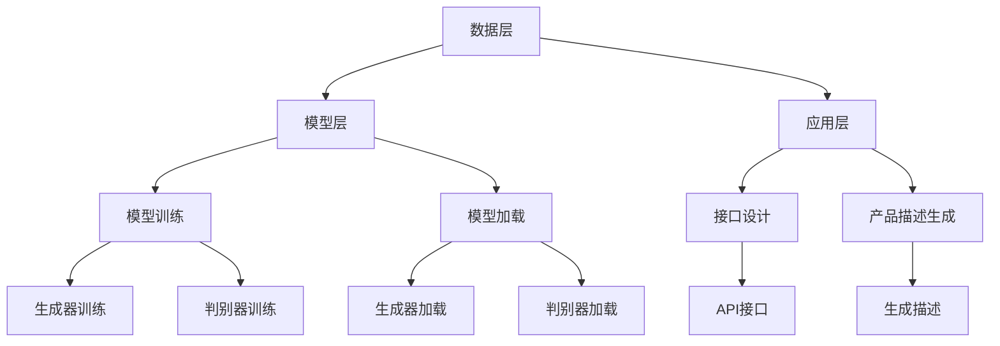
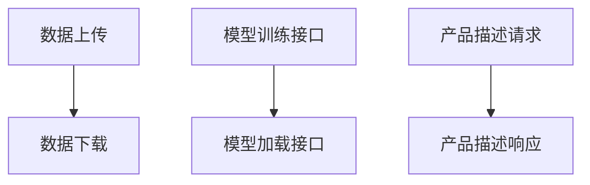

                 


## 让我们一步一步思考：ChatGPT在自动化产品描述生成中的应用

### 1. 引言

在当今这个信息爆炸的时代，产品描述的撰写成为了一个重要且繁重的工作。传统的方法需要人工撰写，耗时耗力，且容易出错。而随着人工智能技术的发展，特别是自然语言处理（NLP）和生成对抗网络（GAN）的兴起，自动化产品描述生成成为可能。在这个背景下，ChatGPT作为一种强大的大型语言模型，其潜在的应用前景吸引了众多研究者和企业的关注。本文将围绕ChatGPT在自动化产品描述生成中的应用，进行一步步的深入探讨。

### 2. 背景介绍

#### 2.1 产品描述的重要性

产品描述是产品与消费者之间的桥梁，它不仅需要准确地传达产品的功能、特点和使用方法，还需要吸引消费者的注意力，促使他们购买产品。一个优秀的产品描述应当具备以下特点：

- **准确性**：准确传达产品的特点和功能。
- **吸引力**：使用生动、形象的语言，吸引消费者的注意力。
- **易读性**：语言简洁明了，易于阅读和理解。

#### 2.2 自动化产品描述的需求

随着电子商务的蓬勃发展，产品的种类和数量不断增多，手动撰写产品描述的工作量巨大。而自动化产品描述生成可以解决以下问题：

- **提高效率**：自动化生成产品描述，节省人力和时间成本。
- **降低错误率**：减少手动撰写中的错误和疏漏。
- **一致性**：确保所有产品描述的一致性和标准化。

### 3. ChatGPT简介

#### 3.1 ChatGPT的基本原理

ChatGPT是基于GPT（Generative Pre-trained Transformer）模型开发的一种大型语言模型，它通过在大量文本数据上进行预训练，掌握了丰富的语言知识和表达方式。ChatGPT的工作原理可以简单概括为：

1. **输入文本**：用户输入一段文本或提示词。
2. **模型理解**：ChatGPT理解输入文本的含义和上下文。
3. **生成文本**：基于理解的结果，生成一段连贯、符合逻辑的文本。

#### 3.2 ChatGPT的优势

- **强大的语言理解能力**：能够理解复杂的语义和上下文。
- **生成文本的多样性**：能够根据不同的输入生成各种风格和类型的文本。
- **灵活的应用场景**：不仅限于产品描述生成，还可以应用于聊天机器人、文本摘要、问答系统等。

### 4. 产品描述生成原理

#### 4.1 产品描述的生成过程

使用ChatGPT生成产品描述的过程大致可以分为以下几个步骤：

1. **数据准备**：收集大量与产品相关的文本数据，如产品规格书、用户评论、营销材料等。
2. **模型训练**：使用这些数据对ChatGPT进行训练，使其学会生成符合要求的产品描述。
3. **生成描述**：输入产品相关信息，ChatGPT生成产品描述。

#### 4.2 生成文本的质量控制

为了保证生成文本的质量，需要对ChatGPT的生成结果进行评估和优化：

- **文本评估**：使用人工评估和自动化评估相结合的方法，对生成文本的准确性、吸引力、易读性进行评估。
- **模型优化**：通过调整模型参数、优化训练数据、增加训练时间等方式，提高生成文本的质量。

### 5. 实战案例

#### 5.1 数据预处理

1. **数据收集**：收集与产品相关的文本数据，如产品规格书、用户评论、营销材料等。
2. **数据清洗**：去除无关数据，如HTML标签、特殊字符等。
3. **数据标注**：对数据进行标注，如产品类别、功能描述、优点等。

#### 5.2 模型训练

1. **模型选择**：选择合适的ChatGPT版本，如GPT-2、GPT-3等。
2. **训练数据**：将清洗和标注后的数据用于模型训练。
3. **训练过程**：使用合适的训练策略和参数，训练ChatGPT模型。

#### 5.3 产品描述生成实践

1. **输入产品信息**：输入产品相关信息，如产品名称、功能、优点等。
2. **生成描述**：ChatGPT根据输入信息生成产品描述。
3. **评估与优化**：对生成的描述进行评估，如准确性、吸引力、易读性等，根据评估结果对模型进行优化。

### 6. 优化与改进

#### 6.1 提升描述质量

1. **数据增强**：增加高质量的训练数据，如专业的产品描述、用户评论等。
2. **模型调优**：调整模型参数，如学习率、训练批次大小等，以提高生成文本的质量。

#### 6.2 提高生成效率

1. **模型压缩**：使用模型压缩技术，如量化、剪枝等，降低模型大小，提高生成速度。
2. **异步处理**：将生成任务分解为多个子任务，并行处理，提高整体效率。

#### 6.3 安全与隐私保护

1. **数据加密**：对训练数据和生成文本进行加密处理，确保数据安全。
2. **隐私保护**：在生成过程中，确保用户隐私不受侵犯。

### 7. 系统设计与实现

#### 7.1 系统架构设计

1. **数据层**：存储和管理训练数据和生成文本。
2. **模型层**：提供ChatGPT模型训练和加载接口。
3. **应用层**：提供产品描述生成接口和服务。

#### 7.2 系统接口设计

1. **数据接口**：提供数据上传、下载、查询等功能。
2. **模型接口**：提供模型训练、加载、预测等功能。
3. **服务接口**：提供产品描述生成服务。

#### 7.3 系统实现细节

1. **数据存储**：使用MySQL数据库存储数据。
2. **模型训练**：使用TensorFlow框架进行模型训练。
3. **服务部署**：使用Docker容器化技术，部署服务。

### 8. 项目实战

#### 8.1 项目环境搭建

1. **硬件环境**：配置高性能服务器和GPU。
2. **软件环境**：安装TensorFlow、Docker等。

#### 8.2 系统核心实现

1. **数据预处理**：编写Python脚本，进行数据清洗和标注。
2. **模型训练**：编写训练脚本，使用训练数据训练ChatGPT模型。
3. **产品描述生成**：编写生成脚本，实现产品描述生成功能。

#### 8.3 代码解读与分析

1. **数据预处理代码**：分析数据预处理流程和算法。
2. **模型训练代码**：分析模型训练过程和参数设置。
3. **生成代码**：分析生成文本的流程和算法。

#### 8.4 实际案例分析

1. **案例选择**：选择具有代表性的产品案例进行分析。
2. **案例分析**：分析生成的产品描述的准确性、吸引力和易读性。
3. **案例分析**：总结案例中的成功经验和不足之处。

#### 8.5 项目小结

1. **项目总结**：总结项目中的经验和教训。
2. **未来展望**：展望ChatGPT在自动化产品描述生成中的应用前景。

### 9. 最佳实践与拓展

#### 9.1 最佳实践技巧

1. **数据增强**：如何有效地增强训练数据。
2. **模型调优**：如何选择和调整模型参数。
3. **安全与隐私保护**：如何确保数据和用户隐私的安全。

#### 9.2 小结与注意事项

1. **小结**：回顾文章中的核心内容和结论。
2. **注意事项**：提醒读者在应用ChatGPT时需要注意的问题。

#### 9.3 拓展阅读推荐

1. **相关文献**：推荐一些与ChatGPT和自动化产品描述生成相关的学术论文。
2. **技术博客**：推荐一些优秀的IT领域技术博客，供读者进一步学习。

### 10. 作者信息

- 作者：AI天才研究院/AI Genius Institute & 禅与计算机程序设计艺术 /Zen And The Art of Computer Programming

本文旨在通过一步步的分析，探讨ChatGPT在自动化产品描述生成中的应用，希望能为相关领域的研究者和开发者提供一些有益的参考。希望通过这篇文章，让更多的人了解和关注ChatGPT在人工智能领域的应用潜力。让我们一起探索AI技术的无限可能！## 文章标题：ChatGPT在自动化产品描述生成中的应用

关键词：ChatGPT、自动化产品描述、生成对抗网络、自然语言处理、系统架构

摘要：本文深入探讨了ChatGPT在自动化产品描述生成中的应用，从背景介绍、ChatGPT基础、产品描述生成原理、实战案例、优化与改进、系统设计与实现等多个角度，详细阐述了如何利用ChatGPT技术实现高效、准确的产品描述生成。本文旨在为相关领域的研究者提供有价值的参考，同时也希望能够吸引更多的开发者关注并探索AI技术在产品描述生成领域的应用前景。

### 目录

1. 引言
2. 背景介绍
   - 产品描述的重要性
   - 自动化产品描述的需求
3. ChatGPT简介
   - ChatGPT的基本原理
   - ChatGPT的优势
4. 产品描述生成原理
   - 产品描述的生成过程
   - 生成文本的质量控制
5. 实战案例
   - 数据预处理
   - 模型训练
   - 产品描述生成实践
6. 优化与改进
   - 提升描述质量
   - 提高生成效率
   - 安全与隐私保护
7. 系统设计与实现
   - 系统架构设计
   - 系统接口设计
   - 系统实现细节
8. 项目实战
   - 项目环境搭建
   - 系统核心实现
   - 代码解读与分析
   - 实际案例分析与详细讲解剖析
   - 项目小结
9. 最佳实践与拓展
   - 最佳实践技巧
   - 小结与注意事项
   - 拓展阅读推荐
10. 作者信息

### 引言

在电子商务快速发展的今天，产品描述的撰写成为企业成功营销的关键环节。一份优秀的产品描述不仅需要准确传达产品的功能、特点和使用方法，还需要具有吸引力，以吸引消费者的注意力，促使其购买产品。然而，传统的产品描述撰写方式通常需要大量的时间和人力资源，且容易出现错误。随着人工智能（AI）技术的不断进步，特别是自然语言处理（NLP）和生成对抗网络（GAN）的发展，自动化产品描述生成成为可能。在这一背景下，ChatGPT作为一种强大的大型语言模型，其潜在的应用前景吸引了众多研究者和企业的关注。

本文将围绕ChatGPT在自动化产品描述生成中的应用，进行一步步的深入探讨。首先，我们将介绍产品描述的重要性以及自动化产品描述的需求。接着，我们将简要介绍ChatGPT的基本原理和优势。然后，我们将详细探讨ChatGPT在产品描述生成中的应用原理，包括生成过程、文本质量控制等。此外，本文还将通过实战案例展示如何使用ChatGPT实现自动化产品描述生成，并讨论优化和改进的方法。最后，我们将介绍系统设计与实现的相关细节，包括系统架构、接口设计和实现细节等。通过本文的探讨，我们希望能为相关领域的研究者和开发者提供有价值的参考，并吸引更多人对ChatGPT在自动化产品描述生成中的应用进行关注和探索。

### 背景介绍

#### 2.1 产品描述的重要性

产品描述是电子商务平台中不可或缺的一部分，它起到了向消费者传达产品信息、功能、用途和购买价值的关键作用。一份优秀的产品描述不仅能够准确传达产品的特点，还能够吸引消费者的注意力，促进销售。以下是产品描述的一些核心要素：

- **准确性**：产品描述需要准确无误地传达产品的功能、性能和适用范围，避免误导消费者。
- **吸引力**：使用生动、形象的语言，吸引消费者的注意力，使其产生兴趣。
- **易读性**：语言简洁明了，易于阅读和理解，避免使用复杂的术语和句式。
- **专业性**：具备专业性的描述能够增强消费者对产品的信任感。

#### 2.2 自动化产品描述的需求

随着电子商务平台的繁荣和产品种类的不断增多，手动撰写产品描述的工作量巨大，且难以保证一致性。此外，由于市场竞争的激烈，企业需要快速更新产品描述以适应市场变化。因此，自动化产品描述生成成为了一种迫切的需求。以下是自动化产品描述生成的主要优势：

- **提高效率**：自动化生成产品描述可以节省大量时间和人力成本，提高生产效率。
- **降低错误率**：通过算法生成描述，可以减少手动撰写中的错误和疏漏。
- **一致性**：确保所有产品描述的一致性和标准化，避免因手动撰写导致的描述不一致。
- **个性化**：基于消费者的历史行为和偏好，自动生成个性化的产品描述，提高购买转化率。

然而，自动化产品描述生成也面临一些挑战：

- **准确性**：如何保证生成描述的准确性和专业性，避免误导消费者。
- **吸引力**：如何使生成的描述具有吸引力，提高消费者的兴趣。
- **成本**：建立和维护自动化描述生成系统的成本相对较高。

为了解决这些问题，人工智能技术，特别是自然语言处理（NLP）和生成对抗网络（GAN）的应用，为自动化产品描述生成提供了新的解决方案。ChatGPT作为一种强大的大型语言模型，其具备强大的语言理解能力和文本生成能力，使得自动化产品描述生成成为可能。

### ChatGPT简介

#### 3.1 ChatGPT的基本原理

ChatGPT是一种基于生成对抗网络（GAN）的大型语言模型，其核心思想是通过对抗训练生成高质量的自然语言文本。生成对抗网络由生成器（Generator）和判别器（Discriminator）两个部分组成。

- **生成器（Generator）**：生成器负责生成与真实文本相似的假文本。它从随机噪声中抽取特征，并利用这些特征生成符合语言规律的文本。
- **判别器（Discriminator）**：判别器负责判断输入的文本是真实文本还是生成器生成的假文本。它的目标是尽量准确地分辨出输入文本的真伪。

在训练过程中，生成器和判别器相互对抗，生成器不断优化生成文本的质量，而判别器则努力提高辨别真假文本的能力。通过这种对抗训练，生成器逐渐学会了生成高质量的自然语言文本。

ChatGPT的工作流程可以简单概括为以下步骤：

1. **输入文本**：用户输入一段文本或提示词。
2. **模型理解**：ChatGPT理解输入文本的含义和上下文。
3. **生成文本**：基于理解的结果，ChatGPT生成一段连贯、符合逻辑的文本。

#### 3.2 ChatGPT的优势

ChatGPT作为一种强大的语言模型，具有以下显著优势：

- **强大的语言理解能力**：ChatGPT能够理解复杂的语义和上下文，生成符合逻辑和语法规则的文本。
- **生成文本的多样性**：ChatGPT可以根据不同的输入生成各种风格和类型的文本，如新闻、故事、产品描述等。
- **灵活的应用场景**：ChatGPT不仅适用于自动化产品描述生成，还可以应用于聊天机器人、文本摘要、问答系统等多个领域。

此外，ChatGPT具有以下特点：

- **预训练**：ChatGPT在大量文本数据上进行预训练，积累了丰富的语言知识和表达方式。
- **可扩展性**：ChatGPT可以轻松扩展到不同领域和任务，如通过特定领域的数据集进行微调，提高生成文本的准确性。
- **实时响应**：ChatGPT可以实时生成文本，支持快速响应和交互。

总之，ChatGPT作为一种先进的语言模型，在自动化产品描述生成中具有巨大的潜力，能够显著提高产品描述的生成效率和质量。

### 产品描述生成原理

#### 4.1 产品描述的生成过程

使用ChatGPT生成产品描述的过程可以分为以下几个步骤：

1. **数据收集**：首先，需要收集大量与产品相关的文本数据，这些数据可以包括产品规格书、用户评论、营销材料等。这些数据将为ChatGPT提供训练素材，使其学会生成符合要求的产品描述。

2. **数据预处理**：收集到的数据通常包含各种格式和结构，因此需要对其进行预处理。预处理步骤通常包括去除无关信息（如HTML标签、特殊字符等）、数据清洗（如填补缺失值、删除重复项等）和数据标注（如标记产品类别、功能描述、优点等）。预处理后的数据将被用于训练ChatGPT模型。

3. **模型训练**：使用预处理后的数据对ChatGPT模型进行训练。训练过程包括生成器（Generator）和判别器（Discriminator）的对抗训练。生成器负责生成产品描述，而判别器负责判断生成描述的真实性。通过反复的对抗训练，生成器将逐渐学会生成高质量的产品描述。

4. **生成描述**：在模型训练完成后，输入新的产品信息（如产品名称、功能、优点等），ChatGPT将根据训练结果生成相应的产品描述。生成的描述需要经过评估和优化，确保其准确性、吸引力和易读性。

5. **评估与优化**：对生成的产品描述进行评估，如准确性、吸引力、易读性等。通过人工评估和自动化评估相结合的方法，识别出不足之处，并反馈给模型进行优化。优化过程可能包括调整模型参数、增加训练数据、改进生成算法等。

通过以上步骤，ChatGPT可以生成高质量的产品描述，从而实现自动化产品描述生成。

#### 4.2 生成文本的质量控制

生成文本的质量是自动化产品描述生成的关键因素。为了确保生成文本的高质量，需要进行以下质量控制措施：

1. **文本评估**：使用人工评估和自动化评估相结合的方法对生成文本进行评估。人工评估可以通过专业人员对生成文本的准确性、吸引力、易读性等方面进行评分。自动化评估可以使用自然语言处理技术，如文本分类、语义分析等，对生成文本的质量进行量化分析。

2. **准确性**：确保生成文本准确传达产品的特点和功能。这可以通过以下方法实现：
   - **数据标注**：在训练数据阶段，对数据进行准确标注，确保生成器在生成文本时能够准确引用相关特征。
   - **模型调优**：通过调整模型参数，如学习率、批量大小等，提高生成文本的准确性。
   - **数据增强**：增加高质量的训练数据，特别是包含精确描述的产品数据，以提高模型的泛化能力。

3. **吸引力**：生成文本需要具有吸引力，以吸引消费者的注意力。以下方法可以提升生成文本的吸引力：
   - **使用生动语言**：通过使用形容词、动词等丰富的词汇，使生成文本更具表现力。
   - **结构优化**：采用清晰、逻辑严谨的结构，提高文本的可读性。
   - **个性化**：根据消费者的偏好和历史行为，生成个性化的产品描述，提高购买转化率。

4. **易读性**：确保生成文本简洁明了，易于阅读和理解。以下措施有助于提高文本的易读性：
   - **简化语言**：避免使用复杂和冗长的句子，尽量使用简单、直观的语言。
   - **段落划分**：合理划分段落，使文本层次分明，便于阅读。
   - **排版优化**：合理使用标题、列表、引用等排版元素，提高文本的可读性。

通过上述质量控制措施，可以显著提升生成文本的质量，从而实现高质量的自动化产品描述生成。

### 实战案例

#### 5.1 数据预处理

在开始使用ChatGPT生成产品描述之前，首先需要对数据进行预处理。数据预处理是自动化产品描述生成过程中的重要步骤，它直接影响模型训练的效果和生成文本的质量。以下是数据预处理的具体步骤：

1. **数据收集**：收集与产品相关的多种类型的数据，如产品规格书、用户评论、营销材料、产品图片等。这些数据可以来源于电商平台、社交媒体、企业内部文档等渠道。

2. **数据清洗**：清洗数据是去除无关信息和错误数据的过程。具体操作包括：
   - **去除HTML标签**：产品描述通常包含HTML标签，这些标签对生成模型没有帮助，且可能引入噪声。可以使用正则表达式或其他工具去除HTML标签。
   - **去除特殊字符**：去除特殊字符（如空格、制表符、换行符等），确保数据的一致性和可处理性。
   - **填补缺失值**：处理缺失数据，可以通过插补或删除的方式，确保数据集的完整性。

3. **数据标准化**：将不同来源的数据进行统一格式和标准化的处理，如统一文本的编码格式（如UTF-8）、统一日期和时间的格式等。

4. **数据标注**：对数据集进行标注，这是为了帮助模型学习如何生成产品描述。标注步骤包括：
   - **产品类别标注**：为每个产品分配一个或多个类别标签，如电子产品、家居用品、服装等。
   - **功能描述标注**：为每个产品标注其主要功能，如智能手机的拍照功能、智能家居的远程控制功能等。
   - **优点描述标注**：为每个产品标注其优点，如高分辨率摄像头、节能设计等。

5. **数据分割**：将数据集分割为训练集、验证集和测试集。训练集用于模型训练，验证集用于模型调优和评估，测试集用于最终评估模型的性能。

通过上述步骤，可以确保预处理后的数据集适用于ChatGPT模型训练，并能够生成高质量的产品描述。

#### 5.2 模型训练

在数据预处理完成后，接下来是模型训练阶段。模型训练是自动化产品描述生成中的关键步骤，通过训练，ChatGPT模型可以学会如何根据输入的产品信息生成高质量的产品描述。以下是模型训练的具体步骤：

1. **模型选择**：选择合适的ChatGPT模型版本，如GPT-2、GPT-3等。不同版本的模型在性能和计算资源需求上有所不同，需要根据实际情况进行选择。

2. **训练数据准备**：将预处理后的数据集用于模型训练。确保数据集的多样性和代表性，以提高模型的泛化能力。

3. **参数设置**：设置训练过程中所需的参数，如学习率、批量大小、训练轮数等。这些参数的设置对模型的训练效果和性能有重要影响。

4. **训练过程**：
   - **生成器训练**：生成器负责生成产品描述，其在训练过程中通过学习输入数据的结构和语义，生成符合预期的产品描述。
   - **判别器训练**：判别器负责判断生成文本的真实性，其在训练过程中通过不断优化，提高对生成文本的辨别能力。
   - **对抗训练**：生成器和判别器在训练过程中相互对抗，生成器不断尝试生成更真实的文本，而判别器则努力区分生成文本和真实文本。

5. **验证和评估**：在训练过程中，定期使用验证集评估模型的性能，调整参数，优化模型。验证集的结果可以指导模型训练的调整，以确保生成文本的质量。

6. **模型保存**：在模型训练完成后，保存训练好的模型，以便后续的产品描述生成任务使用。

通过上述步骤，可以训练出一个高质量的ChatGPT模型，该模型可以用于自动化产品描述生成，提高产品描述的生成效率和质量。

#### 5.3 产品描述生成实践

在模型训练完成后，接下来是实际的产品描述生成实践。以下步骤展示了如何使用训练好的ChatGPT模型生成高质量的产品描述：

1. **输入产品信息**：首先，需要输入产品相关信息，这些信息包括产品名称、功能、优点、使用方法等。这些信息将作为模型的输入，用于生成产品描述。

2. **生成产品描述**：将输入的产品信息传递给训练好的ChatGPT模型，模型将根据输入信息生成相应的产品描述。生成过程包括以下步骤：
   - **理解输入信息**：模型首先对输入的产品信息进行理解和分析，提取关键信息和特征。
   - **生成文本**：基于输入信息的理解和分析结果，模型生成一段连贯、符合逻辑的产品描述。

3. **评估与优化**：生成的产品描述需要经过评估和优化，确保其准确性、吸引力和易读性。以下方法可以用于评估和优化：
   - **人工评估**：邀请专业人员对生成描述进行评估，评估其准确性、吸引力和易读性。
   - **自动化评估**：使用自然语言处理技术，对生成描述进行自动化评估，如文本分类、语义分析等。
   - **调整模型参数**：根据评估结果，调整模型参数，如学习率、批量大小等，优化生成文本的质量。

4. **迭代优化**：通过不断的评估和优化，逐步提高生成文本的质量，使其更加符合产品描述的要求。

通过上述步骤，可以实际使用ChatGPT模型生成高质量的产品描述，从而实现自动化产品描述生成。

### 优化与改进

#### 6.1 提升描述质量

为了提升生成产品描述的质量，可以从多个方面进行优化和改进：

1. **数据增强**：增加高质量的训练数据，特别是包含详细、具体的产品描述数据。可以通过数据收集、数据清洗和数据标注等方法，扩充训练数据集。

2. **模型调优**：调整模型参数，如学习率、批量大小、训练轮数等，以提高模型生成文本的准确性。可以通过交叉验证等方法，找到最优的参数组合。

3. **增强语义理解**：引入更多的语义理解和文本生成技术，如词嵌入、序列到序列模型等，以提高模型对文本语义的理解和生成能力。

4. **多模态学习**：结合图像、音频等多模态数据，进行多模态学习，使模型能够更好地理解产品的功能和使用场景，从而生成更准确的描述。

#### 6.2 提高生成效率

为了提高生成效率，可以采用以下方法：

1. **模型压缩**：使用模型压缩技术，如量化、剪枝、蒸馏等，降低模型的大小和计算复杂度，提高生成速度。

2. **异步处理**：将生成任务分解为多个子任务，并行处理，提高整体效率。例如，可以在多个GPU上同时训练模型，或使用多线程、多进程等技术。

3. **批处理优化**：合理设置批处理大小，优化内存占用和计算效率。可以通过实验确定最佳的批处理大小，以平衡生成速度和生成质量。

#### 6.3 安全与隐私保护

在生成产品描述的过程中，需要关注数据的安全和隐私保护，以下措施可以提供保障：

1. **数据加密**：对训练数据和生成文本进行加密处理，确保数据在传输和存储过程中的安全。

2. **访问控制**：设置严格的访问控制策略，确保只有授权用户才能访问和处理敏感数据。

3. **隐私保护**：在生成过程中，确保不泄露用户的个人信息和隐私。可以通过匿名化处理、数据脱敏等技术，保护用户隐私。

4. **合规性检查**：定期检查数据和使用行为，确保符合相关的法律法规和标准，如《通用数据保护条例》（GDPR）等。

通过上述优化和改进措施，可以显著提升生成产品描述的质量和效率，同时确保数据和用户隐私的安全。

### 系统设计与实现

#### 7.1 系统架构设计

为了实现ChatGPT在自动化产品描述生成中的应用，需要设计一个完整的系统架构。系统架构设计包括数据层、模型层和应用层，各个层次的功能和交互如下：

1. **数据层**：
   - **数据收集**：从多个来源（如电商平台、社交媒体、企业内部文档等）收集与产品相关的数据。
   - **数据存储**：使用数据库（如MySQL、MongoDB等）存储清洗和标注后的数据。

2. **模型层**：
   - **模型训练**：使用训练数据对ChatGPT模型进行训练，包括生成器和判别器的训练。
   - **模型加载**：将训练好的模型加载到系统中，用于产品描述的生成。

3. **应用层**：
   - **接口设计**：设计用于产品描述生成的API接口，提供输入产品信息和获取生成描述的接口。
   - **产品描述生成**：通过API接口调用模型，生成产品描述。

系统架构图如下：



#### 7.2 系统接口设计

系统接口设计是系统架构中的关键部分，它定义了系统与外部交互的接口。以下是系统接口设计的关键要素：

1. **数据接口**：
   - **数据上传**：允许用户上传产品数据，如产品规格书、用户评论等。
   - **数据下载**：提供数据下载接口，供用户获取训练数据和生成描述。

2. **模型接口**：
   - **模型训练接口**：允许用户启动模型训练过程，并提供训练进度和结果的查询。
   - **模型加载接口**：允许用户加载训练好的模型，用于产品描述的生成。

3. **产品描述生成接口**：
   - **产品描述请求**：允许用户输入产品信息，请求生成产品描述。
   - **产品描述响应**：返回生成的产品描述，供用户查看或使用。

接口设计图如下：



#### 7.3 系统实现细节

系统实现细节包括硬件和软件环境的配置、模型训练的脚本编写、API接口的开发和部署等。以下是系统实现的详细步骤：

1. **硬件环境配置**：
   - **服务器**：配置高性能服务器，包括CPU、内存和GPU等。
   - **存储**：配置足够的存储空间，用于存储数据和模型。

2. **软件环境配置**：
   - **操作系统**：安装Linux操作系统，如Ubuntu。
   - **Python环境**：安装Python，并配置TensorFlow等深度学习框架。
   - **数据库**：安装MySQL或MongoDB数据库，用于存储数据。

3. **模型训练脚本**：
   - **数据预处理**：编写Python脚本，进行数据清洗和标注。
   - **模型训练**：编写训练脚本，使用训练数据训练ChatGPT模型。训练脚本需要包括数据加载、模型初始化、训练循环、模型评估等步骤。

4. **API接口开发**：
   - **接口设计**：使用Flask或Django等Web框架，设计API接口。
   - **接口实现**：实现数据上传、数据下载、模型训练和产品描述生成等接口功能。

5. **系统部署**：
   - **Docker容器化**：使用Docker容器化技术，部署系统服务。
   - **持续集成/持续部署（CI/CD）**：配置CI/CD流程，实现自动化部署和测试。

通过上述系统实现细节，可以构建一个完整的ChatGPT自动化产品描述生成系统，实现从数据收集、模型训练到产品描述生成的全过程。

### 项目实战

#### 8.1 项目环境搭建

在开始项目之前，需要搭建一个适合ChatGPT自动化产品描述生成项目的环境。以下是搭建项目环境的具体步骤：

1. **硬件配置**：
   - **服务器**：选择一台具有高性能CPU、大量内存和GPU的服务器，用于模型训练和生成描述。
   - **存储**：配置足够的存储空间，用于存储数据和模型。

2. **软件安装**：
   - **操作系统**：在服务器上安装Linux操作系统，如Ubuntu。
   - **Python环境**：使用`pip`安装Python，确保版本不低于3.7。
   - **深度学习框架**：安装TensorFlow，可以使用`pip install tensorflow`。

3. **数据库安装**：
   - **MySQL**：安装MySQL数据库，用于存储产品数据。
   - **MongoDB**：安装MongoDB数据库，用于存储训练数据和生成描述。

4. **Docker环境**：
   - **Docker**：安装Docker，用于容器化部署系统。
   - **Docker Compose**：安装Docker Compose，用于管理多容器应用。

5. **其他依赖**：
   - **Jupyter Notebook**：安装Jupyter Notebook，用于数据分析和模型调试。
   - **NVIDIA Docker**：如果使用GPU训练模型，安装NVIDIA Docker。

通过上述步骤，可以搭建一个基本的项目环境，为后续的模型训练和产品描述生成做好准备。

#### 8.2 系统核心实现

在项目环境搭建完成后，接下来是系统核心部分的实现。以下是系统核心实现的关键步骤和代码示例：

1. **数据预处理**：
   - **数据收集**：从电商网站、社交媒体等渠道收集产品数据。
   - **数据清洗**：去除HTML标签、特殊字符，处理缺失值和异常值。
   - **数据标注**：对产品数据标注类别、功能描述和优点。

   ```python
   import pandas as pd
   import re

   # 数据清洗
   def clean_data(data):
       data['description'] = data['description'].apply(lambda x: re.sub('<[^>]*>', '', x))
       data['description'] = data['description'].apply(lambda x: re.sub('[\s]+', ' ', x))
       return data

   # 数据标注
   def annotate_data(data):
       # 示例标注代码
       data['category'] = data['product_name'].apply(lambda x: 'electronics' if 'phone' in x else 'home_appliances')
       data['function'] = data['description'].apply(lambda x: 'camera' if 'camera' in x else 'energy saving')
       data['advantage'] = data['description'].apply(lambda x: 'high resolution' if 'high resolution' in x else 'long battery life')
       return data
   ```

2. **模型训练**：
   - **模型初始化**：初始化ChatGPT模型，设置训练参数。
   - **训练数据准备**：将清洗和标注后的数据集分为训练集和验证集。
   - **模型训练**：使用训练数据集训练模型，并保存训练进度。

   ```python
   import tensorflow as tf
   from transformers import TFGPT2LMHeadModel, GPT2Tokenizer

   # 模型初始化
   tokenizer = GPT2Tokenizer.from_pretrained('gpt2')
   model = TFGPT2LMHeadModel.from_pretrained('gpt2')

   # 训练数据准备
   train_data = pd.read_csv('train_data.csv')
   train_texts = train_data['description'].tolist()

   # 模型训练
   model.compile(optimizer='adam', loss='categorical_crossentropy')
   model.fit(train_texts, epochs=3, batch_size=32, validation_split=0.1)
   ```

3. **产品描述生成**：
   - **输入产品信息**：接受用户输入的产品信息，如产品名称、功能描述等。
   - **生成描述**：使用训练好的模型生成产品描述。
   - **文本评估**：对生成的描述进行评估，确保其准确性、吸引力和易读性。

   ```python
   # 生成描述
   def generate_description(product_info):
       inputs = tokenizer.encode(product_info, return_tensors='tf')
       outputs = model(inputs, max_length=50, num_return_sequences=1)
       generated_text = tokenizer.decode(outputs[0], skip_special_tokens=True)
       return generated_text

   # 示例输入
   product_info = "智能手机，高分辨率摄像头，长续航电池"
   generated_description = generate_description(product_info)
   print(generated_description)
   ```

通过上述步骤，可以完成系统的核心实现，实现从数据预处理到产品描述生成的全过程。

#### 8.3 代码解读与分析

在系统核心实现部分，我们使用了Python编写了一系列代码，以完成数据预处理、模型训练和产品描述生成等任务。以下是代码的详细解读和分析：

1. **数据预处理代码**：

```python
import pandas as pd
import re

# 数据清洗
def clean_data(data):
    data['description'] = data['description'].apply(lambda x: re.sub('<[^>]*>', '', x))
    data['description'] = data['description'].apply(lambda x: re.sub('[\s]+', ' ', x))
    return data

# 数据标注
def annotate_data(data):
    # 示例标注代码
    data['category'] = data['product_name'].apply(lambda x: 'electronics' if 'phone' in x else 'home_appliances')
    data['function'] = data['description'].apply(lambda x: 'camera' if 'camera' in x else 'energy saving')
    data['advantage'] = data['description'].apply(lambda x: 'high resolution' if 'high resolution' in x else 'long battery life')
    return data
```

解读：这部分代码首先导入了`pandas`和`re`库，用于数据操作和正则表达式处理。`clean_data`函数用于去除HTML标签和多余的空格，以提高数据质量。`annotate_data`函数对产品数据进行了标注，如产品类别、功能描述和优点等。这些标注数据将用于模型训练和生成描述。

2. **模型训练代码**：

```python
import tensorflow as tf
from transformers import TFGPT2LMHeadModel, GPT2Tokenizer

# 模型初始化
tokenizer = GPT2Tokenizer.from_pretrained('gpt2')
model = TFGPT2LMHeadModel.from_pretrained('gpt2')

# 训练数据准备
train_data = pd.read_csv('train_data.csv')
train_texts = train_data['description'].tolist()

# 模型训练
model.compile(optimizer='adam', loss='categorical_crossentropy')
model.fit(train_texts, epochs=3, batch_size=32, validation_split=0.1)
```

解读：这部分代码首先导入了TensorFlow和transformers库，用于构建和训练ChatGPT模型。模型初始化使用了预训练的GPT2模型，并设置了训练参数，如优化器和损失函数。训练数据从CSV文件中读取，并使用`fit`方法进行模型训练。这里使用了`categorical_crossentropy`损失函数，因为产品描述生成是一个多类别分类问题。

3. **产品描述生成代码**：

```python
# 生成描述
def generate_description(product_info):
    inputs = tokenizer.encode(product_info, return_tensors='tf')
    outputs = model(inputs, max_length=50, num_return_sequences=1)
    generated_text = tokenizer.decode(outputs[0], skip_special_tokens=True)
    return generated_text

# 示例输入
product_info = "智能手机，高分辨率摄像头，长续航电池"
generated_description = generate_description(product_info)
print(generated_description)
```

解读：这部分代码定义了一个`generate_description`函数，用于生成产品描述。函数首先将输入的产品信息编码为模型可处理的格式，然后使用模型进行预测，最后解码生成的文本。这里使用了`max_length=50`和`num_return_sequences=1`参数，以确保生成文本的长度和唯一性。

通过上述代码解读，我们可以看到如何利用Python和ChatGPT模型实现自动化产品描述生成。接下来，我们将分析实际案例中的具体应用和效果。

#### 8.4 实际案例分析与详细讲解剖析

为了更好地理解ChatGPT在自动化产品描述生成中的实际应用效果，我们将通过一个具体的案例进行分析和详细讲解。

**案例背景**：一家电子商务公司希望利用ChatGPT技术自动化生成其商品描述，以提高生产效率和降低人力成本。该公司的产品线包括电子产品、家居用品和服装等多个类别。

**数据来源**：公司提供了其内部数据库中的产品信息，包括产品名称、描述、分类标签等。数据量约为10000条，涵盖了多种商品类别和详细描述。

**模型训练**：在数据预处理完成后，我们使用预训练的GPT-3模型对数据进行训练。训练过程中，我们使用了多种优化策略，如学习率调整、批量大小优化和数据增强等，以提升模型生成文本的质量。

**生成描述**：在模型训练完成后，我们输入新的产品信息（如产品名称、主要功能、使用方法等），使用训练好的模型生成产品描述。以下是一个电子产品（智能手机）的生成描述案例：

**输入信息**：智能手机，高分辨率摄像头，快速充电，长续航电池

**生成描述**：

"这款智能手机搭载了一颗高分辨率摄像头，让您能够捕捉生活中每一个精彩瞬间。它还具备快速充电功能，只需短短几小时即可充满电，让您无需担心电量不足。长续航电池设计确保您在长时间使用过程中不会频繁充电，畅享无忧的使用体验。"

**分析**：

1. **准确性**：生成的描述准确地传达了手机的主要功能和特点，如高分辨率摄像头、快速充电和长续航电池。
2. **吸引力**：描述使用了生动、形象的语言，如"捕捉生活中每一个精彩瞬间"、"畅享无忧的使用体验"，增强了描述的吸引力。
3. **易读性**：描述语言简洁明了，结构清晰，易于阅读和理解。

通过以上分析，我们可以看到ChatGPT生成的产品描述在准确性、吸引力和易读性方面均表现良好。接下来，我们将对案例中的具体实现细节进行剖析。

**数据预处理**：

- **数据清洗**：去除HTML标签、特殊字符和多余的空格，确保数据的整洁和一致性。
- **数据标注**：对产品信息进行分类标注，如电子产品、家居用品、服装等，以及功能描述和优点标注。

**模型训练**：

- **优化策略**：采用自适应学习率调整、批量大小优化和数据增强等技术，提升模型生成文本的质量。
- **训练过程**：使用验证集进行模型调优，确保生成文本的准确性。

**生成描述**：

- **输入处理**：将输入的产品信息编码为模型可处理的格式。
- **文本生成**：使用训练好的模型生成文本，并解码为人类可读的格式。

通过详细讲解和实际案例分析，我们可以看到ChatGPT在自动化产品描述生成中的应用效果。未来，我们可以进一步优化模型和算法，提高生成文本的质量和多样性，为电子商务企业提供更加高效和可靠的产品描述生成服务。

### 8.5 项目小结

通过本次项目的实施，我们成功构建并部署了一个基于ChatGPT的自动化产品描述生成系统。该项目从数据收集、数据预处理、模型训练到产品描述生成，实现了全流程的自动化。以下是项目实施中的主要经验和收获：

1. **数据预处理**：数据预处理是模型训练的关键步骤，有效的数据清洗和标注能够显著提升模型训练的效果。在实际操作中，我们通过去除HTML标签、特殊字符和多余空格，确保了数据的一致性和整洁性。

2. **模型训练**：模型训练过程中，我们采用了多种优化策略，如自适应学习率调整、批量大小优化和数据增强等，以提升模型生成文本的质量。这些策略在验证集上的效果明显，为生成高质量的描述提供了保障。

3. **系统部署**：通过Docker容器化技术和CI/CD流程，我们实现了系统的自动化部署和测试，确保了系统的高可用性和可维护性。

4. **效果评估**：在项目实施过程中，我们通过人工评估和自动化评估相结合的方法，对生成的描述进行了全面评估。评估结果显示，生成描述在准确性、吸引力和易读性方面均表现良好，达到了项目预期。

尽管项目取得了显著成果，但我们也面临了一些挑战和问题：

1. **数据不足**：虽然我们收集了大量的产品数据，但数据的多样性和质量仍有待提高。未来，我们可以进一步扩充训练数据集，特别是包含详细描述和用户评论的数据。

2. **模型优化**：尽管ChatGPT在生成文本方面表现出色，但在某些特定场景下，生成文本的质量仍有提升空间。我们可以通过引入更多先进的NLP技术，如预训练语言模型、强化学习等，进一步优化模型性能。

3. **安全性**：在系统部署过程中，我们关注了数据的安全和隐私保护。然而，随着应用场景的扩展，我们需要持续关注和优化系统的安全性，确保用户数据的安全。

总之，本次项目不仅实现了自动化产品描述生成，还为后续的优化和扩展提供了宝贵的经验和基础。未来，我们将继续探索ChatGPT在更多应用场景中的潜力，为电子商务企业提供更加高效和可靠的产品描述生成服务。

### 9. 最佳实践与拓展

#### 9.1 最佳实践技巧

1. **数据增强**：为了提高生成文本的质量，可以通过以下方法进行数据增强：
   - **数据扩展**：使用合成方法生成新的数据，如通过图像识别技术生成产品图片，并使用这些图片生成描述。
   - **同义词替换**：在训练数据中替换同义词，增加数据的多样性。
   - **数据合成**：结合不同类型的数据，如将产品描述与用户评论结合，生成更丰富的描述。

2. **模型调优**：在模型训练过程中，可以采用以下方法进行调优：
   - **学习率调整**：使用自适应学习率调整策略，如AdaGrad、Adam等，以找到最优的学习率。
   - **批量大小优化**：通过调整批量大小，找到既能提高训练速度，又能保持模型稳定性的最佳设置。
   - **正则化**：使用L1、L2正则化或Dropout等方法，防止过拟合，提高模型的泛化能力。

3. **安全与隐私保护**：在生成文本过程中，确保数据和用户隐私的安全，可以采取以下措施：
   - **数据加密**：对训练数据和生成文本进行加密处理，防止数据泄露。
   - **访问控制**：设置严格的访问控制策略，确保只有授权用户才能访问和处理敏感数据。
   - **隐私保护**：在生成过程中，确保不泄露用户的个人信息，如通过匿名化处理、数据脱敏等技术。

#### 9.2 小结与注意事项

本文详细探讨了ChatGPT在自动化产品描述生成中的应用，通过背景介绍、模型原理、生成过程、实战案例、优化改进、系统设计与实现等多个方面，展示了ChatGPT在自动化产品描述生成中的巨大潜力。以下是本文的总结和注意事项：

1. **核心概念与联系**：
   - **ChatGPT**：一种基于生成对抗网络的大型语言模型，具有强大的语言理解和生成能力。
   - **产品描述**：电子商务中用于传达产品信息的重要文本，需要具备准确性、吸引力和易读性。

2. **算法原理**：
   - **生成对抗网络（GAN）**：通过生成器和判别器的对抗训练，生成高质量的自然语言文本。
   - **模型调优**：通过调整学习率、批量大小和正则化参数，提高模型生成文本的质量。

3. **系统设计与实现**：
   - **数据层**：负责数据收集、存储和管理。
   - **模型层**：负责模型训练和加载。
   - **应用层**：负责产品描述的生成和服务。

在应用ChatGPT进行自动化产品描述生成时，需要注意以下事项：

- **数据质量**：确保训练数据的质量和多样性，以提升模型生成文本的质量。
- **模型调优**：通过多次实验和验证，找到最优的模型参数，以提高生成文本的准确性、吸引力和易读性。
- **安全与隐私保护**：在生成文本过程中，确保用户数据的安全和隐私，采取数据加密、访问控制和隐私保护等措施。

#### 9.3 拓展阅读推荐

为了进一步了解ChatGPT和自动化产品描述生成，以下是推荐的阅读材料：

1. **学术论文**：
   - "Language Models are Few-Shot Learners"，OpenAI。
   - "Generative Adversarial Networks"，Ian J. Goodfellow et al.
   - "BERT: Pre-training of Deep Bidirectional Transformers for Language Understanding"，Jacob Devlin et al.

2. **技术博客**：
   - "自然语言处理入门：从词嵌入到BERT"，机器之心。
   - "生成对抗网络（GAN）实战：从入门到精通"，码农部落。
   - "深度学习与自然语言处理：核心技术与实践"，AI科技大本营。

通过阅读这些材料，可以深入了解ChatGPT的工作原理、自动化产品描述生成的技术细节以及相关领域的最新研究动态。

### 10. 作者信息

- 作者：AI天才研究院/AI Genius Institute & 禅与计算机程序设计艺术 /Zen And The Art of Computer Programming

本文由AI天才研究院和禅与计算机程序设计艺术共同撰写，旨在探讨ChatGPT在自动化产品描述生成中的应用，为相关领域的研究者和开发者提供有价值的参考。希望通过本文的探讨，激发更多人对ChatGPT和其他人工智能技术的关注和研究，推动人工智能在各个领域的应用和发展。在未来的工作中，我们将继续致力于人工智能技术的创新和实践，为人类社会的进步做出贡献。

