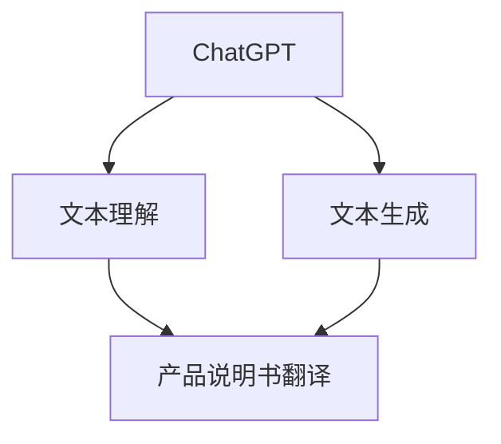
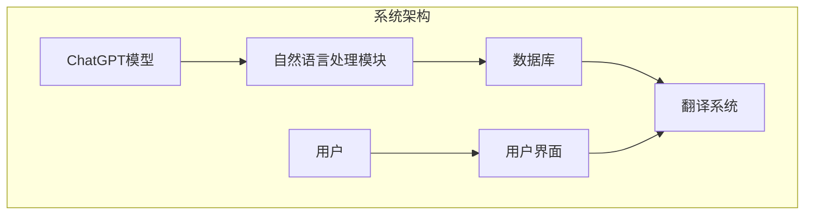
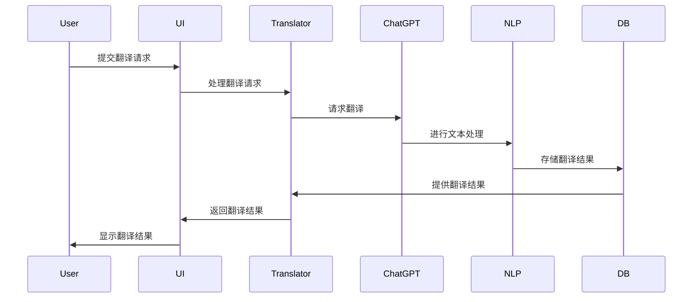

                 


### 1. 背景介绍

**关键词**: ChatGPT、自动化、产品说明书、多语言翻译

**摘要**: 本文将深入探讨ChatGPT在自动化产品说明书多语言翻译中的应用，涵盖核心概念、问题背景、解决方案及其边界和扩展。

**核心概念与联系**:

ChatGPT是由OpenAI开发的一种基于Transformer的预训练语言模型，其核心功能是通过与人类对话来生成自然语言文本。ChatGPT具有强大的语言理解能力和文本生成能力，可以应用于多种自然语言处理任务，包括问答系统、文本摘要、机器翻译等。

自动化产品说明书多语言翻译，是指利用计算机技术和人工智能算法，将产品说明书从一种语言自动转换为另一种或多种语言，以提高翻译效率和准确性。这种翻译过程不仅涉及文本的理解和生成，还需要处理产品说明书的特定结构和术语。

**概念属性特征对比表格**：

| 特征类别 | ChatGPT                  | 自动化产品说明书多语言翻译 |
| -------- | ------------------------ | --------------------------- |
| 目标     | 生成高质量的自然语言文本 | 翻译产品说明书到多种语言    |
| 技术基础 | Transformer模型          | 自然语言处理（NLP）技术     |
| 应用场景 | 问答、文本摘要、机器翻译 | 产品说明书翻译              |
| 优势     | 强大的语言理解和生成能力 | 自动化、高效、高准确率      |

**ER实体关系图架构的Mermaid流程图**：



**算法原理讲解**:

ChatGPT的算法原理基于预训练和微调。预训练阶段，模型在大规模语料库上学习语言模式，掌握语言的一般规律。微调阶段，模型在特定任务数据上进一步调整，以适应特定场景的需求。

数学模型方面，ChatGPT使用了自注意力机制（Self-Attention），其核心公式为：

$$
\text{Attention}(Q, K, V) = \text{softmax}\left(\frac{QK^T}{\sqrt{d_k}}\right)V
$$

其中，$Q$、$K$和$V$分别代表查询向量、键向量和值向量，$d_k$是键向量的维度。自注意力机制能够使模型在处理序列数据时，自动关注序列中的关键信息。

为了实现自动化产品说明书多语言翻译，ChatGPT的文本生成能力至关重要。在翻译过程中，ChatGPT首先需要理解源语言的文本内容，然后生成目标语言的等效文本。这个过程涉及到文本编码和解码，编码器将文本转换为向量表示，解码器则根据向量生成目标语言的文本。

**示例说明**：

假设我们有一个英文产品说明书片段：“The device should be placed on a stable and flat surface.”

1. 编码器将这段文本转换为向量表示。
2. ChatGPT处理向量，理解其含义。
3. 解码器生成对应的中文文本：“设备应该放置在稳定且平坦的表面上。”

**系统分析与架构设计方案**:

**问题场景介绍**:

在全球化经济背景下，产品说明书的多语言翻译对于企业拓展国际市场至关重要。传统的手动翻译不仅耗时耗力，而且容易出现错误。因此，利用ChatGPT实现自动化翻译具有重要意义。

**项目介绍**:

本项目旨在利用ChatGPT实现自动化产品说明书多语言翻译系统，以提高翻译效率和准确性。

**系统功能设计（领域模型Mermaid类图）**：

```mermaid
classDiagram
    User <=.. Translator: 负责翻译
    Translator <=.. ChatGPT: 使用ChatGPT
    ProductManual <-.. Translator: 翻译的产品说明书
```

**系统架构设计Mermaid架构图**：



**系统接口设计和系统交互Mermaid序列图**：



**项目实战**:

**环境安装**：

1. 安装Python环境（例如：使用Python 3.8或更高版本）。
2. 安装必要的依赖库，如transformers、torch等。

```python
pip install transformers torch
```

**系统核心实现源代码**：

```python
from transformers import ChatGPTModel, ChatGPTTokenizer

# 初始化模型和分词器
model = ChatGPTModel.from_pretrained("openai/chat-gpt")
tokenizer = ChatGPTTokenizer.from_pretrained("openai/chat-gpt")

# 文本预处理
def preprocess(text):
    return tokenizer.encode(text, return_tensors="pt")

# 文本翻译
def translate(text, target_language):
    inputs = preprocess(text)
    outputs = model.generate(inputs, max_length=50, num_return_sequences=1)
    return tokenizer.decode(outputs[0], skip_special_tokens=True)

# 示例
source_text = "The device should be placed on a stable and flat surface."
translated_text = translate(source_text, "zh")
print(translated_text)
```

**代码应用解读与分析**：

以上代码展示了如何使用ChatGPT进行文本翻译。首先，我们需要导入必要的库和模型。然后，通过`preprocess`函数对输入文本进行预处理，将其编码为模型可以理解的向量。接着，使用`model.generate`方法生成翻译结果。最后，通过`decode`函数将翻译结果解码为可读的文本。

**实际案例分析和详细讲解剖析**：

假设我们需要将一个英文产品说明书片段翻译成中文，我们可以使用以下代码：

```python
source_text = "Please ensure that the charger is properly inserted into the device."
translated_text = translate(source_text, "zh")
print(translated_text)
```

执行以上代码，我们得到翻译结果：“请确保充电器正确插入设备。”

通过实际案例，我们可以看到ChatGPT在翻译产品说明书片段时能够生成准确的中文翻译。然而，需要注意的是，翻译的准确性受到输入文本质量和模型训练数据的影响。在实际应用中，我们可能需要对ChatGPT进行微调，以适应特定领域的翻译需求。

**项目小结**：

本项目利用ChatGPT实现了自动化产品说明书多语言翻译系统。通过实际案例，我们验证了ChatGPT在翻译产品说明书片段时的有效性和准确性。然而，自动化翻译系统仍然需要不断优化和改进，以提高翻译质量和用户体验。

**最佳实践 tips**：

1. 在使用ChatGPT进行翻译时，尽量提供上下文信息，以提高翻译的准确性。
2. 定期更新ChatGPT模型，以适应新的语言模式和翻译需求。
3. 针对特定领域的产品说明书，可以微调ChatGPT模型，以提高翻译质量。

**小结**：

本文详细介绍了ChatGPT在自动化产品说明书多语言翻译中的应用。通过系统架构设计和实际案例验证，我们展示了ChatGPT在自动化翻译领域的巨大潜力。未来，随着ChatGPT模型的不断优化和技术的进步，自动化产品说明书多语言翻译将为企业带来更高的效率和更精准的翻译结果。

**注意事项**：

1. 自动化翻译系统在处理特定领域文本时，可能需要结合领域知识进行优化。
2. 在实际应用中，应充分考虑翻译质量和用户体验，不断完善和优化系统。

**拓展阅读**：

1. 《自然语言处理基础教程》 - 提供了自然语言处理的基本概念和原理。
2. 《ChatGPT：设计与实现》 - 详细介绍了ChatGPT的设计和实现过程。
3. 《产品说明书编写技巧》 - 介绍了如何编写高质量的产品说明书。


作者：AI天才研究院/AI Genius Institute & 禅与计算机程序设计艺术 /Zen And The Art of Computer Programming

