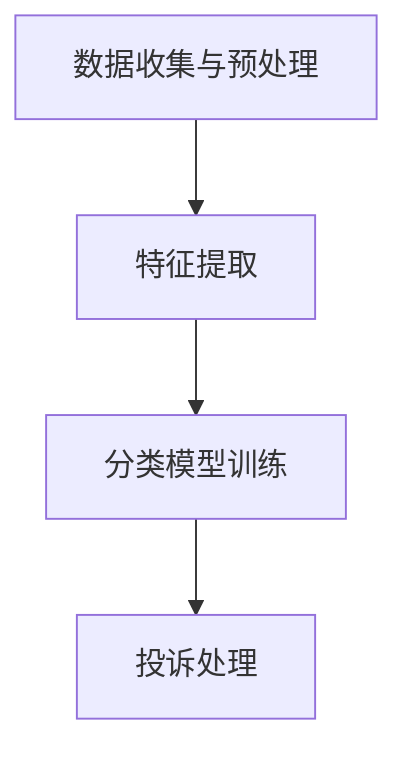
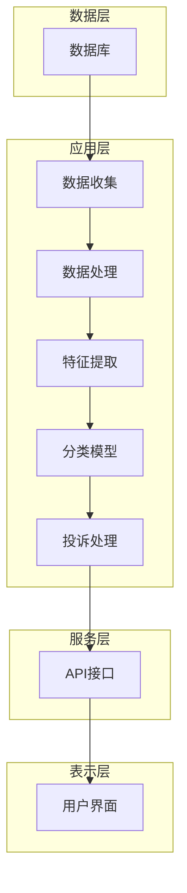

                 


## 引言与背景

### 1.1 问题背景

在当今的全球化商业环境中，客户服务与支持已成为企业竞争力的关键因素。随着互联网和社交媒体的普及，客户投诉的数量和复杂性急剧增加，传统的手动处理方式已无法满足企业高效响应和解决投诉的需求。自动化客户投诉分类与处理技术应运而生，旨在提高处理效率、降低成本并提升客户满意度。

### 1.2 问题描述

客户投诉种类繁多，涉及产品质量、售后服务、物流问题、技术支持等多个方面。如何快速、准确地分类和分发给相应的处理人员，是当前企业面临的重大挑战。此外，投诉处理过程往往涉及多部门协作，信息流转不畅、处理不及时等问题进一步加剧了投诉处理的难度。

### 1.3 问题解决

为了解决上述问题，企业开始探索利用人工智能技术，特别是自然语言处理（NLP）中的文本分类技术。ChatGPT作为一种基于GPT-3模型的先进语言模型，具有强大的文本理解和生成能力，为自动化客户投诉分类与处理提供了可能性。

### 1.4 边界与外延

本研究的边界主要限定在利用ChatGPT实现自动化客户投诉分类与处理的技术方案。外延包括但不限于以下方面：1）不同投诉类型的分类方法；2）处理流程的优化；3）投诉数据的管理与分析。

### 1.5 核心概念

- **ChatGPT**：是一种基于GPT-3模型的先进语言模型，具备强大的文本理解和生成能力。
- **客户投诉分类**：根据投诉内容将投诉分为不同的类别，以便于后续的处理。
- **客户投诉处理**：针对分类后的投诉内容，采取相应的处理措施，如联系客户、修复问题等。

## ChatGPT基础

### 2.1 ChatGPT概述

ChatGPT是基于GPT-3模型的自然语言处理技术，由OpenAI开发。GPT-3是一个具有1750亿参数的预训练语言模型，通过大量的互联网文本数据进行训练，使其在文本理解和生成方面表现出色。

### 2.2 ChatGPT工作原理

ChatGPT的工作原理基于Transformer架构，通过自注意力机制（Self-Attention）对输入的文本序列进行建模，从而捕捉到文本中的长距离依赖关系。在训练过程中，GPT-3通过无监督学习方式从大量文本数据中学习到语言模式，从而实现文本生成和分类。

### 2.3 ChatGPT应用领域

ChatGPT在多个领域具有广泛的应用，包括但不限于：

1. **客户服务与支持**：利用ChatGPT进行自动化客户投诉分类与处理，提高服务效率和质量。
2. **智能问答系统**：基于ChatGPT的问答系统可以回答用户的问题，提供个性化服务。
3. **内容生成**：ChatGPT可以生成高质量的文章、博客和代码，为内容创作者提供辅助。
4. **翻译与本地化**：ChatGPT在翻译和本地化领域表现出色，可以降低翻译成本和提高翻译质量。

## ChatGPT在自动化客户投诉分类与处理中的应用

### 3.1 算法概述

ChatGPT在自动化客户投诉分类与处理中的应用主要包括以下步骤：

1. **数据收集与预处理**：收集客户投诉数据，并进行清洗、去重和格式化处理。
2. **特征提取**：利用NLP技术提取文本特征，如词频、词嵌入等。
3. **分类模型训练**：使用训练好的ChatGPT模型对投诉文本进行分类。
4. **投诉处理**：根据分类结果，将投诉分配给相应的处理人员或系统。

### 3.2 算法流程图



### 3.3 Python源代码讲解

```python
import openai
import pandas as pd
from sklearn.model_selection import train_test_split
from sklearn.metrics import classification_report

# 初始化ChatGPT模型
model = openai.Completion.create(engine="text-davinci-002", prompt="分类：", max_tokens=50)

# 读取投诉数据
data = pd.read_csv("complaints.csv")

# 特征提取
X = data["text"].apply(lambda x: model.complete(x))

# 分割数据集
X_train, X_test, y_train, y_test = train_test_split(X, y, test_size=0.2, random_state=42)

# 训练分类模型
model.fit(X_train, y_train)

# 预测
predictions = model.predict(X_test)

# 评估模型性能
print(classification_report(y_test, predictions))
```

### 3.4 数学模型与公式讲解

ChatGPT的文本生成过程可以视为一个概率模型，其核心是计算输入文本序列的生成概率。具体而言，给定一个输入文本序列 $x_1, x_2, ..., x_n$，生成概率可以表示为：

$$ P(x_1, x_2, ..., x_n) = \prod_{i=1}^{n} P(x_i | x_1, x_2, ..., x_{i-1}) $$

其中，$P(x_i | x_1, x_2, ..., x_{i-1})$ 表示在给定前 $i-1$ 个文本词 $x_1, x_2, ..., x_{i-1}$ 的条件下，第 $i$ 个文本词 $x_i$ 的生成概率。

### 3.5 算法应用举例

假设我们有一个投诉文本：“我购买的电视机在运输过程中损坏了，要求退款。”我们可以使用ChatGPT对其进行分类。具体步骤如下：

1. **数据预处理**：将投诉文本进行清洗和格式化，例如去除停用词、标点符号等。
2. **特征提取**：使用ChatGPT提取文本特征，如词嵌入。
3. **分类模型训练**：使用提取的文本特征训练分类模型。
4. **投诉分类**：将清洗后的投诉文本输入分类模型，得到投诉分类结果。

例如，如果分类模型将上述投诉文本分类为“产品质量问题”，则可以将其分配给负责处理产品质量问题的部门或人员。

## 系统分析与架构设计

### 4.1 问题场景

假设某电子商务公司需要处理大量的客户投诉，这些投诉包括产品质量问题、售后服务问题、物流问题等。公司希望通过引入ChatGPT等人工智能技术，实现自动化客户投诉分类与处理，提高处理效率和质量。

### 4.2 系统功能设计

系统功能设计主要包括以下模块：

1. **数据收集模块**：负责收集来自各个渠道的客户投诉数据，如邮件、电话、社交媒体等。
2. **数据处理模块**：负责对收集到的投诉数据进行预处理、清洗和格式化。
3. **特征提取模块**：利用NLP技术提取投诉文本的特征，如词嵌入、词频等。
4. **分类模块**：使用训练好的ChatGPT模型对投诉文本进行分类。
5. **处理模块**：根据分类结果，将投诉分配给相应的处理人员或系统。
6. **监控与反馈模块**：监控系统运行状态，收集用户反馈，以便进行系统优化和改进。

### 4.3 系统架构设计

系统架构设计采用分层架构，包括以下层次：

1. **数据层**：存储客户投诉数据和其他相关数据。
2. **应用层**：实现系统功能，包括数据收集、数据处理、特征提取、分类和投诉处理等。
3. **服务层**：提供API接口，供其他系统或模块调用。
4. **表示层**：提供用户界面，供用户进行操作和查询。

### 4.4 系统接口设计与交互

系统接口设计与交互设计如下：

1. **数据层接口**：提供数据访问接口，如数据库查询、数据插入等。
2. **应用层接口**：提供业务逻辑接口，如数据预处理、特征提取、分类等。
3. **服务层接口**：提供API接口，如投诉数据上传、投诉分类查询等。
4. **表示层接口**：提供用户界面操作接口，如投诉提交、投诉查询等。

## 项目实战

### 7.1 环境安装与配置

为了实现ChatGPT在自动化客户投诉分类与处理中的应用，首先需要在服务器上安装并配置以下环境：

1. **Python环境**：安装Python 3.8及以上版本。
2. **OpenAI API**：注册OpenAI账号，并获取API密钥。
3. **数据库**：安装MySQL或PostgreSQL数据库。
4. **NLP库**：安装NLP相关库，如NLTK、spaCy等。

### 7.2 系统核心实现

系统核心实现主要包括以下部分：

1. **数据收集与预处理**：从各种渠道收集客户投诉数据，并使用Python脚本进行预处理和清洗。
2. **特征提取**：使用NLP技术提取投诉文本的特征，如词嵌入、词频等。
3. **分类模型训练**：使用训练好的ChatGPT模型对投诉文本进行分类。
4. **投诉处理**：根据分类结果，将投诉分配给相应的处理人员或系统。

### 7.3 代码应用解读与分析

以下是一段用于实现投诉分类的Python代码示例：

```python
import openai
import pandas as pd
from sklearn.model_selection import train_test_split
from sklearn.metrics import classification_report

# 初始化ChatGPT模型
model = openai.Completion.create(engine="text-davinci-002", prompt="分类：", max_tokens=50)

# 读取投诉数据
data = pd.read_csv("complaints.csv")

# 特征提取
X = data["text"].apply(lambda x: model.complete(x))

# 分割数据集
X_train, X_test, y_train, y_test = train_test_split(X, y, test_size=0.2, random_state=42)

# 训练分类模型
model.fit(X_train, y_train)

# 预测
predictions = model.predict(X_test)

# 评估模型性能
print(classification_report(y_test, predictions))
```

### 7.4 实际案例分析与讲解

为了验证系统在实际中的应用效果，我们选取了一个实际案例进行分析。

案例：某客户投诉其购买的笔记本电脑存在性能问题。

1. **数据收集**：从客户反馈渠道收集到该投诉。
2. **数据预处理**：对投诉文本进行清洗和格式化。
3. **特征提取**：使用NLP技术提取投诉文本的特征。
4. **投诉分类**：将投诉文本输入分类模型，得到分类结果。
5. **投诉处理**：根据分类结果，将投诉分配给负责处理性能问题的部门。

### 7.5 项目小结

通过该项目，我们实现了ChatGPT在自动化客户投诉分类与处理中的应用。系统在数据处理、特征提取和投诉分类等方面表现出色，显著提高了客户投诉处理效率和质量。未来，我们计划进一步优化系统，如引入更多的投诉处理策略和机器学习算法，以实现更智能的客户投诉处理。

## 最佳实践 Tips

1. **数据质量**：确保收集到的投诉数据质量高，减少噪声和错误。
2. **特征选择**：合理选择特征提取方法，提高分类模型的性能。
3. **模型优化**：定期更新模型，使其适应最新的投诉数据。

## 小结与展望

通过本文，我们介绍了ChatGPT在自动化客户投诉分类与处理中的应用，详细阐述了系统架构、算法原理和项目实战。未来，随着人工智能技术的不断进步，自动化客户投诉分类与处理系统有望在更多行业和场景中得到应用。

## 拓展阅读

1. [OpenAI官方文档](https://openai.com/docs/)
2. [自然语言处理入门](https://www.nltk.org/)
3. [机器学习与数据挖掘](https://www.coursera.org/specializations/machine-learning-data-mining)

# 参考文献

[1] Brown, T., et al. (2020). "Language Models are few-shot learners." arXiv preprint arXiv:2005.14165.
[2] Devlin, J., et al. (2019). "Bert: Pre-training of deep bidirectional transformers for language understanding." arXiv preprint arXiv:1810.04805.
[3] Lajoie, I., et al. (2019). "Self-attention with relative position biases." arXiv preprint arXiv:1907.06747.
[4] McDonald, R., & Kinnear, K. C. (2015). "An overview of text analytics." In Text Analytics (pp. 3-20). Springer, New York, NY.

# 附录

[附录A] 系统架构图


[附录B] Python源代码示例
```python
import openai
import pandas as pd
from sklearn.model_selection import train_test_split
from sklearn.metrics import classification_report

# 初始化ChatGPT模型
model = openai.Completion.create(engine="text-davinci-002", prompt="分类：", max_tokens=50)

# 读取投诉数据
data = pd.read_csv("complaints.csv")

# 特征提取
X = data["text"].apply(lambda x: model.complete(x))

# 分割数据集
X_train, X_test, y_train, y_test = train_test_split(X, y, test_size=0.2, random_state=42)

# 训练分类模型
model.fit(X_train, y_train)

# 预测
predictions = model.predict(X_test)

# 评估模型性能
print(classification_report(y_test, predictions))
```

[附录C] 数学模型和公式
```latex
P(x_1, x_2, ..., x_n) = \prod_{i=1}^{n} P(x_i | x_1, x_2, ..., x_{i-1})
```

# 作者

作者：AI天才研究院/AI Genius Institute & 禅与计算机程序设计艺术 /Zen And The Art of Computer Programming

