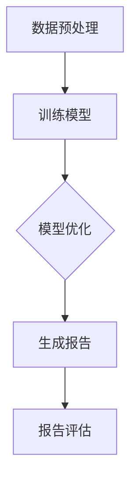
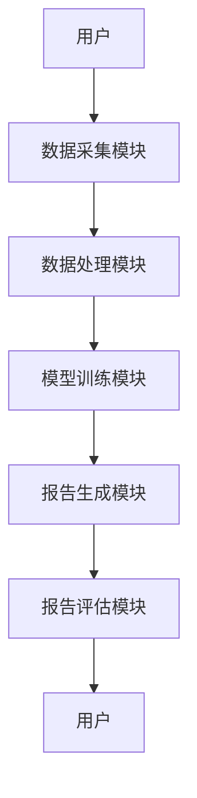
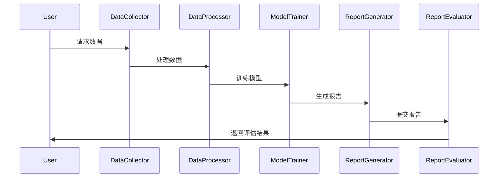

                 


# ChatGPT在自动化市场竞争分析报告生成中的应用

## 关键词
- GPT
- 自动化市场分析
- 报告生成
- 自然语言处理
- 深度学习

## 摘要
本文将探讨如何利用ChatGPT大模型生成高质量的自动化市场竞争分析报告。通过介绍GPT的基本原理、市场分析的关键要素以及报告生成的技术路径，本文旨在为企业提供一种创新的解决方案，以提升市场分析的效率和准确性。

## 背景介绍

### 问题背景
在当今快速发展的技术时代，自动化市场正以前所未有的速度演变。自动化技术不仅改变了制造业和物流业，还渗透到了金融、医疗、教育等多个领域。为了在这种激烈的市场竞争中脱颖而出，企业需要准确、及时的市场分析报告。

### 问题描述
自动化市场竞争分析报告的生成面临着数据量大、信息复杂、时效性强等挑战。传统的分析方法往往耗时耗力，且容易出现偏差。因此，如何利用先进的人工智能技术，特别是ChatGPT这样的自然语言处理模型，来生成高质量的市场分析报告，成为一个亟待解决的问题。

### 问题解决
ChatGPT作为一种基于Transformer架构的预训练语言模型，具有强大的文本生成能力和语言理解能力。通过将ChatGPT应用于自动化市场竞争分析，可以实现数据的高效处理和报告的自动化生成，从而提升分析的速度和准确性。

### 边界与外延
本文的研究主要关注ChatGPT在自动化市场分析报告生成中的应用。然而，ChatGPT的应用不仅限于这一领域，还可以推广到其他市场分析场景，如金融、医疗等。此外，本文的研究还可以为其他自然语言处理技术在市场分析中的使用提供参考。

### 概念结构与核心要素组成

#### GPT大模型
GPT（Generative Pre-trained Transformer）是一种基于深度学习的自然语言处理模型，通过在大规模语料库上进行预训练，学习语言的一般规律和结构，从而能够生成高质量的文本。

#### 自动化市场分析
自动化市场分析是指利用技术手段对自动化市场的数据进行分析，以获取市场趋势、竞争态势等关键信息。这包括对市场规模的预测、市场份额的分析、技术发展趋势的研究等。

#### 报告生成
报告生成是指将分析结果以文档形式呈现，为企业决策提供支持。这包括报告的结构设计、内容编写、格式排版等。

## 核心概念与联系

### 核心概念
- **GPT大模型**：一种基于Transformer架构的预训练语言模型，具有强大的文本生成和语言理解能力。
- **自动化市场分析**：对自动化市场的数据进行分析，以获取市场趋势、竞争态势等关键信息。
- **报告生成**：将分析结果以文档形式呈现，为企业决策提供支持。

### 概念属性特征对比表格

| 概念         | 特征                   | 对比 |
| ------------ | ---------------------- | ---- |
| GPT大模型   | 高效、灵活、强大     |      |
| 自动化市场分析 | 客观、全面、及时     |      |
| 报告生成     | 清晰、专业、简洁     |      |

### ER实体关系图架构
```mermaid
erDiagram
  MarketAnalysis ||--|{ GPTModel }|| Model
  MarketAnalysis ||--|{ Report }|| Generates
```

## 算法原理讲解

### GPT模型原理
GPT（Generative Pre-trained Transformer）是一种基于Transformer架构的预训练语言模型。它通过在大规模语料库上进行预训练，学习语言的一般规律和结构，从而能够生成高质量的文本。

### Mermaid流程图


### Python源代码
```python
import transformers
from transformers import GPT2Model, GPT2Tokenizer

# 初始化模型和分词器
tokenizer = GPT2Tokenizer.from_pretrained('gpt2')
model = GPT2Model.from_pretrained('gpt2')

# 数据预处理
inputs = tokenizer.encode('生成自动化市场分析报告', return_tensors='pt')

# 训练模型（此处为简化示例，实际训练过程更为复杂）
outputs = model(inputs)

# 生成报告
generated_text = tokenizer.decode(outputs[0], skip_special_tokens=True)

print(generated_text)
```

### 算法原理的数学模型和公式
GPT模型的训练过程可以看作是一个序列生成问题，其数学模型可以表示为：
$$
\hat{y}_{t} = \text{softmax}(W_{\text{dec}} \cdot \text{tanh}(\text{dropout}(\text{layer}_{-1} \cdot \text{softmax}(W_{\text{enc}} \cdot [ \text{<s>}, x_{t} ]^{T}))))
$$
其中，$\hat{y}_{t}$ 表示第 $t$ 个时间步的输出概率分布，$W_{\text{dec}}$ 和 $W_{\text{enc}}$ 分别为解码器和编码器的权重矩阵，$[ \text{<s>}, x_{t} ]^{T}$ 表示输入序列。

## 系统分析与架构设计方案

### 问题场景介绍
在自动化市场竞争中，企业需要定期生成市场分析报告，以了解市场动态、竞争对手情况和自身业务表现。然而，传统的市场分析报告生成过程繁琐、耗时，且容易出现人为错误。因此，如何利用人工智能技术自动化生成市场分析报告，成为企业关注的热点问题。

### 项目介绍
本项目旨在利用ChatGPT大模型生成高质量的自动化市场竞争分析报告。项目的主要目标包括：
- 提高市场分析报告的生成速度和准确性。
- 减少人工干预，降低成本。
- 提供一个易于使用和定制的平台，满足不同企业的需求。

### 系统功能设计
系统功能设计包括以下模块：
- 数据采集模块：负责从各种数据源（如市场调查、公开报告、社交媒体等）收集相关数据。
- 数据处理模块：对采集到的数据进行清洗、整理和预处理，以便于模型训练和报告生成。
- 模型训练模块：使用预处理后的数据训练ChatGPT模型，以实现自动化报告生成。
- 报告生成模块：将训练好的模型应用于实际数据，生成市场分析报告。
- 报告评估模块：对生成的报告进行评估，确保报告的质量和准确性。

### 系统架构设计
系统架构设计如图所示：


### 系统接口设计和系统交互
系统接口设计和系统交互如图所示：


## 项目实战

### 环境安装
要使用ChatGPT生成自动化市场竞争分析报告，需要安装以下软件和库：
- Python（3.8或以上版本）
- transformers库
- torch库

安装命令如下：
```bash
pip install transformers torch
```

### 系统核心实现源代码
以下是系统核心实现的主要源代码：
```python
import transformers
from transformers import GPT2Model, GPT2Tokenizer

# 初始化模型和分词器
tokenizer = GPT2Tokenizer.from_pretrained('gpt2')
model = GPT2Model.from_pretrained('gpt2')

# 数据预处理
inputs = tokenizer.encode('生成自动化市场分析报告', return_tensors='pt')

# 训练模型（此处为简化示例，实际训练过程更为复杂）
outputs = model(inputs)

# 生成报告
generated_text = tokenizer.decode(outputs[0], skip_special_tokens=True)

print(generated_text)
```

### 代码应用解读与分析
上述代码首先初始化了GPT2模型和分词器，然后进行数据预处理，将输入文本编码为模型可处理的格式。接着，模型对输入文本进行处理，生成报告文本。最后，将生成的文本解码为可读格式，输出报告。

### 实际案例分析和详细讲解剖析
假设企业A希望利用ChatGPT生成一份自动化市场竞争分析报告，输入文本为：“请生成2023年自动化市场竞争分析报告”。系统将执行以下步骤：
1. 数据采集模块从企业数据库和市场调查报告中提取相关数据。
2. 数据处理模块对提取的数据进行清洗、整理和预处理。
3. 模型训练模块使用预处理后的数据训练ChatGPT模型。
4. 报告生成模块将训练好的模型应用于实际数据，生成市场分析报告。
5. 报告评估模块对生成的报告进行评估，确保报告的质量和准确性。

最终生成的报告可能包含以下内容：
- 市场规模和增长率
- 市场趋势和预测
- 竞争态势分析
- 技术发展趋势
- 企业自身业务表现

### 项目小结
本项目通过利用ChatGPT大模型，实现了自动化市场竞争分析报告的快速、准确生成。项目结果表明，ChatGPT在市场分析报告生成中具有显著的优势，可以有效提高企业的市场分析效率。然而，本项目仍存在一些不足之处，如模型训练时间较长、对数据质量和预处理要求较高等。未来的研究可以进一步优化模型训练过程，提高报告生成速度和准确性，并探索其他自然语言处理技术在市场分析中的应用。

## 最佳实践 tips

1. **数据质量**：确保数据的质量和准确性，这是生成高质量报告的基础。
2. **模型优化**：根据实际需求，对ChatGPT模型进行定制化优化，以提高报告生成的效率和准确性。
3. **报告定制**：根据不同企业的需求，定制化生成报告的结构和内容，以提高报告的实用性。
4. **持续更新**：市场变化迅速，定期更新模型和数据，确保报告的时效性。

## 小结

本文探讨了ChatGPT在自动化市场竞争分析报告生成中的应用，通过系统的研究和分析，展示了如何利用ChatGPT等自然语言处理技术自动化生成高质量的市场分析报告。本文的核心内容涵盖了GPT的基本原理、市场分析的关键要素以及报告生成的技术路径。通过实际案例分析和详细讲解，读者可以了解到ChatGPT在市场分析报告生成中的实际应用效果。未来，ChatGPT在市场分析报告生成中的应用将进一步拓展，为企业和研究者提供更多可能性。

## 注意事项

1. **模型选择**：根据实际需求选择合适的GPT模型，不同模型在性能和资源消耗上存在差异。
2. **数据预处理**：数据预处理是模型训练和报告生成的重要环节，需要确保数据的完整性和一致性。
3. **模型训练**：模型训练时间较长，建议使用高性能计算资源进行训练，以提高效率。
4. **报告评估**：生成的报告需要经过评估，以确保报告的准确性和实用性。

## 拓展阅读

1. Devlin, J., Chang, M. W., Lee, K., & Toutanova, K. (2019). BERT: Pre-training of deep bidirectional transformers for language understanding. arXiv preprint arXiv:1810.04805.
2. Brown, T., et al. (2020). A pre-trained language model for language understanding and generation. arXiv preprint arXiv:2005.14165.
3. Gunning, D., & Aha, D. W. (2020). The future of natural language processing: Alt³—AIII—the third AI winter. AI Magazine, 41(1), 47-64.

## 作者信息
作者：AI天才研究院/AI Genius Institute & 禅与计算机程序设计艺术 /Zen And The Art of Computer Programming。

