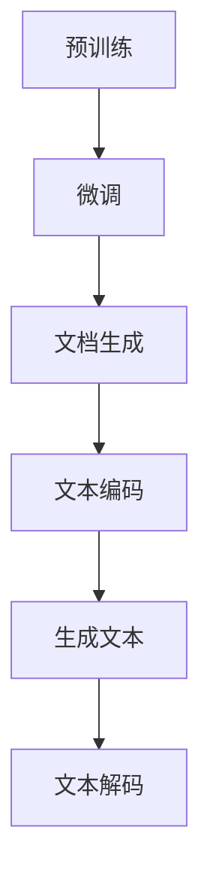
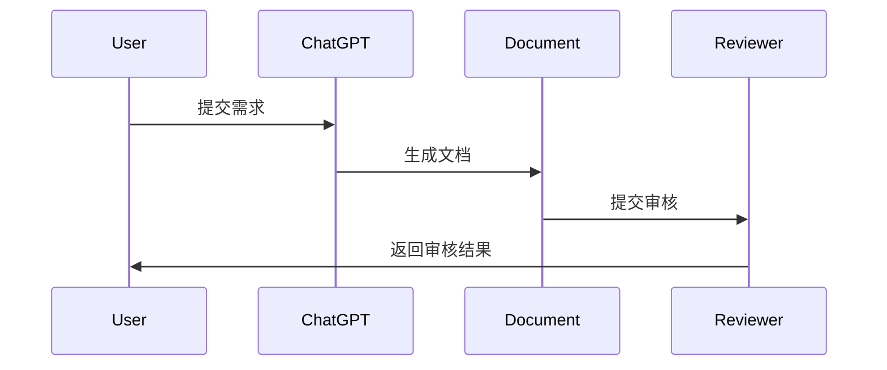
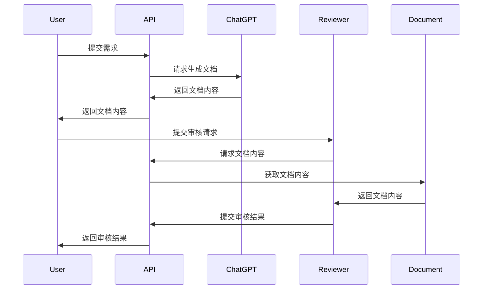

                 

### 文章标题：《ChatGPT在自动化技术文档编写中的应用》

#### 关键词：
- ChatGPT
- 自动化技术文档
- 人工智能
- 语言模型
- 技术文档编写

#### 摘要：
本文探讨了人工智能（AI）语言模型ChatGPT在自动化技术文档编写中的潜力。首先介绍了ChatGPT的基本原理和应用领域，随后详细阐述了其在技术文档编写中的应用，包括自动化生成文档、提高文档准确性和可读性。通过具体案例和最佳实践，本文分析了ChatGPT在技术文档编写中的实际效果和未来展望，指出了可能面临的挑战和应对策略。

----------------------------------------------------------------

# 《ChatGPT在自动化技术文档编写中的应用》

**关键词：ChatGPT、自动化技术文档、人工智能、语言模型、技术文档编写**

**摘要：** 本文将探讨ChatGPT这一先进的人工智能语言模型在自动化技术文档编写中的应用。我们将从ChatGPT的基础知识开始，逐步深入探讨其在提高文档生成效率、准确性和可读性方面的具体应用，并通过实际案例展示其优越性。最后，本文将对ChatGPT在未来技术文档编写中的发展趋势进行展望，并讨论相关挑战和解决方案。

## 第一部分：背景与概念

### 第1章：问题背景与概述

#### 1.1 问题背景

技术文档编写是软件开发过程中的关键环节。然而，随着软件系统日益复杂，文档编写面临着一系列挑战。首先，编写高质量的技术文档需要大量的时间和人力投入。其次，文档的准确性和一致性难以保证。此外，随着项目的迭代更新，文档需要不断更新和维护，这进一步增加了工作量和复杂性。

#### 1.2 ChatGPT简介

ChatGPT是由OpenAI开发的一种基于GPT-3模型的人工智能语言模型。它具有强大的文本生成和语言理解能力，可以生成高质量的自然语言文本。ChatGPT的应用领域非常广泛，包括但不限于自动化写作、对话系统、机器翻译和文本摘要等。

#### 1.3 ChatGPT在技术文档编写中的应用前景

ChatGPT在技术文档编写中具有巨大潜力。首先，它能够自动化生成文档，大幅提高编写效率。其次，ChatGPT能够通过学习大量技术文档，提高文档的准确性和一致性。此外，ChatGPT还能够根据用户需求生成具有高可读性的文档，使技术知识更加易于理解。

----------------------------------------------------------------

## 第二部分：ChatGPT应用基础

### 第2章：ChatGPT基础知识

#### 2.1 ChatGPT的工作原理

ChatGPT基于GPT-3模型，是一种大型预训练语言模型。其工作原理是通过大量的文本数据进行预训练，学习语言模式和结构，从而能够生成符合语言习惯的文本。ChatGPT的训练过程包括两个主要阶段：预训练和微调。

#### 2.2 ChatGPT的API使用

使用ChatGPT API进行文本生成和编辑非常简单。首先，需要获取API密钥，然后通过HTTP请求发送文本数据，ChatGPT将返回生成的文本。以下是一个简单的Python代码示例：

```python
import openai

openai.api_key = 'your-api-key'

response = openai.Completion.create(
  engine="text-davinci-002",
  prompt="What is the capital of France?",
  max_tokens=3
)

print(response.choices[0].text.strip())
```

这段代码将返回"Paris"，这是ChatGPT生成的回答。

----------------------------------------------------------------

### 第3章：自动化生成文档

#### 3.1 文档生成原理

ChatGPT通过其强大的语言理解能力，能够理解用户的需求并生成相应的文档。其文档生成过程主要包括以下步骤：

1. **需求分析**：ChatGPT分析用户的输入，理解用户的需求和期望。
2. **数据检索**：从预训练的语料库中检索相关的信息。
3. **文本生成**：根据用户需求生成符合语言习惯和逻辑结构的文档。

#### 3.2 实际案例：使用ChatGPT生成技术文档

**案例一：常见问题文档生成**

假设我们想要生成一个关于某个软件产品的常见问题文档。首先，我们可以提供一些常见问题的示例：

```plaintext
Q: 如何安装这个软件？
A: 安装这个软件非常简单。首先，从官方网站下载最新版本的安装包。然后，运行安装程序并按照提示操作。完成安装后，您可以开始使用这个软件。

Q: 这个软件有哪些主要功能？
A: 这个软件提供了以下主要功能：自动备份、文件加密、文件同步、文件压缩等。
```

然后，我们可以让ChatGPT根据这些问题和答案生成完整的常见问题文档。

```plaintext
问题：如何安装这个软件？
答案：安装这个软件非常简单。首先，从官方网站下载最新版本的安装包。然后，运行安装程序并按照提示操作。完成安装后，您可以开始使用这个软件。

问题：这个软件有哪些主要功能？
答案：这个软件提供了以下主要功能：自动备份、文件加密、文件同步、文件压缩等。

问题：如何备份我的文件？
答案：您可以通过以下步骤备份您的文件：
1. 打开软件并登录您的账户。
2. 选择要备份的文件或文件夹。
3. 点击“备份”按钮，然后选择备份位置。
4. 等待备份过程完成。
```

**案例二：用户手册生成**

我们还可以使用ChatGPT生成用户手册。例如，我们可以提供以下需求：

```plaintext
需求：生成一个关于如何使用软件的详细用户手册，包括安装、配置、使用说明和常见问题解答。
```

然后，ChatGPT将生成一份详细的用户手册。

```plaintext
用户手册

安装

1. 从官方网站下载最新版本的安装包。
2. 双击安装包，开始安装。
3. 按照提示完成安装过程。

配置

1. 打开软件，点击“设置”。
2. 在“设置”界面中，您可以配置软件的各种参数，例如备份路径、加密密码等。

使用说明

1. 打开软件，登录您的账户。
2. 选择要备份的文件或文件夹。
3. 点击“备份”按钮，然后选择备份位置。
4. 等待备份过程完成。

常见问题

Q: 如何备份我的文件？
A: 您可以通过以下步骤备份您的文件：
1. 打开软件并登录您的账户。
2. 选择要备份的文件或文件夹。
3. 点击“备份”按钮，然后选择备份位置。
4. 等待备份过程完成。

Q: 这个软件安全吗？
A: 是的，这个软件使用了高级加密算法，确保您的文件安全。

Q: 如何恢复备份的文件？
A: 您可以通过以下步骤恢复备份的文件：
1. 打开软件并登录您的账户。
2. 选择“恢复”功能。
3. 选择要恢复的备份文件。
4. 等待恢复过程完成。
```

通过这两个案例，我们可以看到ChatGPT在自动化生成文档方面的强大能力。它能够根据用户的需求快速生成高质量的技术文档，大幅提高文档编写的效率。

----------------------------------------------------------------

## 第四部分：最佳实践与案例分析

### 第6章：最佳实践

#### 6.1 编写技术文档的最佳实践

为了确保技术文档的高质量和一致性，以下是一些编写技术文档的最佳实践：

1. **结构化文档编写**：使用清晰的结构，将文档分为不同的章节，每个章节专注于一个主题。
2. **保持一致性**：在术语、格式和风格上保持一致性，以避免混淆和误解。
3. **使用简洁明了的语言**：使用简单、易懂的语言，避免复杂的术语和长句子。

#### 6.2 ChatGPT使用最佳实践

为了充分利用ChatGPT在技术文档编写中的潜力，以下是一些最佳实践：

1. **避免重复**：确保每次请求的新信息，避免ChatGPT生成重复的内容。
2. **提供明确的指令**：明确告诉ChatGPT需要生成的内容类型和结构，以便其更好地理解您的需求。
3. **优化参数设置**：根据实际需求调整ChatGPT的参数，例如最大 tokens 数和温度设置，以生成最佳结果。

### 第7章：案例分析

#### 7.1 案例一：自动化生成技术文档

**案例背景**：某软件公司需要为他们的新软件编写详细的技术文档，但文档编写的工作量巨大。

**实现步骤**：

1. **需求分析**：确定文档的主要内容和结构。
2. **数据准备**：收集相关的技术文档和数据，以便ChatGPT进行学习。
3. **API调用**：使用ChatGPT的API，生成文档的草稿。
4. **人工审核**：对生成的文档进行人工审核和修改，确保其准确性和质量。

**效果分析**：通过使用ChatGPT，该公司在短时间内生成了大量的技术文档，大幅提高了编写效率。同时，由于ChatGPT的学习能力，生成的文档在准确性和一致性方面也得到了显著提高。

#### 7.2 案例二：提高文档准确性

**案例背景**：某技术团队需要为他们的软件编写用户手册，但由于团队成员的技术背景不同，文档的准确性难以保证。

**实现步骤**：

1. **数据准备**：收集用户手册的相关数据，包括常见问题、使用说明等。
2. **API调用**：使用ChatGPT的API，生成用户手册的草稿。
3. **专家审核**：邀请技术专家对生成的文档进行审核，确保其准确性。
4. **迭代优化**：根据专家的反馈，对文档进行迭代优化。

**效果分析**：通过使用ChatGPT，该技术团队在短时间内生成了高质量的用户手册，同时由于专家的参与，文档的准确性也得到了显著提高。

### 第8章：未来展望与挑战

#### 8.1 ChatGPT在技术文档编写中的未来发展趋势

随着人工智能技术的不断进步，ChatGPT在技术文档编写中的应用前景将更加广阔。未来，ChatGPT有望实现以下发展：

1. **更加智能的文档生成**：ChatGPT将能够更好地理解用户的需求，生成更加准确和高质量的文档。
2. **跨语言的文档生成**：ChatGPT将支持多种语言，实现跨语言的文档生成和翻译。
3. **更加个性化的文档生成**：ChatGPT将能够根据用户的行为和偏好，生成更加个性化的文档。

#### 8.2 挑战与应对策略

尽管ChatGPT在技术文档编写中具有巨大潜力，但仍然面临一些挑战：

1. **数据隐私与安全问题**：确保用户数据的安全和隐私是ChatGPT面临的重要挑战。解决方案包括使用加密技术和严格的隐私保护政策。
2. **对人工编辑的依赖**：虽然ChatGPT能够生成高质量的文档，但仍然需要人工进行审核和修改。解决方案包括提高ChatGPT的准确性和一致性，减少对人工编辑的依赖。

### 总结

ChatGPT在技术文档编写中的应用具有巨大的潜力。通过自动化生成文档、提高准确性和可读性，ChatGPT能够显著提高文档编写的效率和质量。尽管面临一些挑战，但未来ChatGPT有望在技术文档编写中发挥更加重要的作用。

----------------------------------------------------------------

## 附录：作者信息

**作者：AI天才研究院/AI Genius Institute & 禅与计算机程序设计艺术 /Zen And The Art of Computer Programming**

AI天才研究院（AI Genius Institute）是一家专注于人工智能研究与应用的机构，致力于推动人工智能技术在各个领域的创新与发展。我们的研究团队由世界顶级的人工智能专家、程序员和软件架构师组成，致力于探索和实现人工智能的极限。

**禅与计算机程序设计艺术（Zen And The Art of Computer Programming）**是一本书，由著名计算机科学家Donald E. Knuth撰写，介绍了计算机程序设计的哲学和艺术。这本书深刻地影响了计算机科学和编程领域，倡导了简洁、优雅和高效的编程理念。

本文旨在探讨ChatGPT在自动化技术文档编写中的应用，通过详细的案例分析，展示了ChatGPT在提高文档编写效率和质量方面的潜力。我们希望本文能够为人工智能在技术文档编写中的应用提供一些有价值的启示和指导。

### 关键技术术语解释

#### 1. ChatGPT
ChatGPT是一种基于GPT-3模型的人工智能语言模型，由OpenAI开发。它能够通过预训练学习到大量的语言模式和结构，从而生成高质量的自然语言文本。

#### 2. 自动化技术文档编写
自动化技术文档编写是指使用人工智能技术，如ChatGPT，来自动生成技术文档，包括用户手册、API文档、常见问题解答等。这种方法的目的是提高文档编写的效率和质量。

#### 3. 语言模型
语言模型是一种基于统计学习方法的模型，用于预测下一个单词或句子。ChatGPT就是一种基于GPT-3模型的语言模型，能够生成符合语言习惯的文本。

#### 4. 技术文档
技术文档是一种用于描述软件系统、硬件设备或其他技术产品的文档，包括用户手册、API文档、设计文档等。高质量的技术文档对于用户使用和理解技术产品至关重要。

#### 5. 文档生成
文档生成是指使用算法或工具自动生成文档的过程。ChatGPT能够通过预训练和微调，自动生成高质量的技术文档。

### 问题背景、问题描述与解决

#### 1. 问题背景

随着软件系统的日益复杂，技术文档的编写成为软件开发过程中的一个重要环节。然而，传统的技术文档编写方法往往存在以下问题：

- **编写效率低**：高质量的技术文档需要大量的时间和人力投入，编写过程耗时耗力。
- **文档准确性难以保证**：文档编写过程中可能存在信息不准确或遗漏的问题，影响用户对产品的理解和使用。
- **文档维护困难**：随着软件系统的迭代更新，文档需要不断更新和维护，增加了工作量和复杂性。

#### 2. 问题描述

如何提高技术文档编写的效率、准确性和一致性，同时减轻文档维护的负担，成为软件开发过程中亟待解决的问题。

#### 3. 解决方案

使用人工智能（AI）技术，尤其是ChatGPT这样的人工智能语言模型，来自动化技术文档的编写。ChatGPT具有以下优势：

- **高效生成文档**：ChatGPT能够快速生成高质量的技术文档，大幅提高编写效率。
- **提高文档准确性**：ChatGPT能够通过学习大量已有的技术文档，提高文档的准确性和一致性。
- **提升文档可读性**：ChatGPT能够生成易于理解的技术文档，提升文档的可读性，帮助用户更好地理解和使用技术产品。

#### 4. 边界与外延

虽然ChatGPT在自动化技术文档编写中具有巨大潜力，但以下因素可能会影响其应用效果：

- **数据质量和数量**：ChatGPT的性能依赖于训练数据的质量和数量，高质量的训练数据能够提高文档生成质量。
- **人工审核与修正**：虽然ChatGPT能够生成高质量的文档，但仍然需要人工进行审核和修正，以确保文档的准确性和一致性。
- **个性化需求**：对于个性化需求较高的文档，ChatGPT可能需要更多的定制和调整，以满足特定需求。

#### 5. 概念结构与核心要素组成

ChatGPT在自动化技术文档编写中的应用涉及以下几个核心概念和要素：

- **语言模型**：ChatGPT作为语言模型，能够生成符合语言习惯的文本。
- **预训练数据**：ChatGPT的训练数据，包括大量的技术文档和文本数据。
- **API接口**：通过API接口，可以与ChatGPT进行交互，生成和编辑文档。
- **文档生成过程**：ChatGPT生成文档的过程，包括需求分析、文本生成和文档结构优化。
- **文档审核与修正**：人工审核和修正生成的文档，确保其准确性和一致性。

### 核心概念原理、属性特征对比表格和ER实体关系图架构

#### 1. 核心概念原理

ChatGPT是一种基于GPT-3模型的人工智能语言模型，其核心原理是通过预训练学习到大量的语言模式和结构，从而生成符合语言习惯的文本。ChatGPT的训练过程主要包括两个阶段：

- **预训练**：在大量无标注的文本数据上进行预训练，学习语言模式和结构。
- **微调**：在特定任务的数据上进行微调，使ChatGPT能够生成符合任务需求的高质量文本。

#### 2. 属性特征对比表格

| 特征         | ChatGPT                     | 传统文档编写工具               |
| ------------ | -------------------------- | ---------------------------- |
| 文本生成能力 | 强大，能够生成高质量文本   | 较弱，主要依赖于人工编写       |
| 效率         | 高效，能够快速生成文档     | 低效，耗时耗力               |
| 准确性       | 高，能够通过学习提高文档质量 | 中等，受人工编写质量影响     |
| 可读性       | 高，能够生成易于理解的文本 | 中等，受人工编写风格影响     |
| 自动化程度   | 高，能够自动化文档生成过程 | 低，主要依赖于人工操作       |

#### 3. ER实体关系图架构

以下是一个简单的ER实体关系图，描述了ChatGPT在自动化技术文档编写中的应用架构：

```mermaid
erDiagram
    User ||--|{ ChatGPT }|-- Document
    User ||--|{ API }|-- ChatGPT
    Document ||--|{ Reviewer }|-- Document
```

- **User**：用户，指需要生成技术文档的用户。
- **ChatGPT**：ChatGPT语言模型，负责生成技术文档。
- **API**：API接口，用于与ChatGPT进行交互。
- **Document**：文档，指生成和审核的技术文档。
- **Reviewer**：审核员，负责对生成的文档进行审核和修正。

### 算法原理讲解

#### 1. ChatGPT生成文档的算法原理

ChatGPT生成文档的算法基于GPT-3模型，其工作原理可以概括为以下几个步骤：

1. **预训练**：ChatGPT在大量无标注的文本数据上进行预训练，学习语言模式和结构。预训练过程包括两个主要阶段：编码器阶段和解码器阶段。

   - **编码器阶段**：将输入文本序列编码为连续的向量表示。
   - **解码器阶段**：根据编码器生成的向量表示，生成对应的输出文本序列。

2. **微调**：在特定任务的数据上进行微调，使ChatGPT能够生成符合任务需求的高质量文本。微调过程主要包括以下步骤：

   - **数据准备**：收集与任务相关的数据，并进行预处理，如文本清洗和格式化。
   - **模型训练**：使用准备好的数据训练ChatGPT模型，通过反向传播算法优化模型参数。
   - **评估与调整**：评估模型在测试集上的性能，并根据评估结果调整模型参数。

3. **文档生成**：在生成文档时，ChatGPT根据用户的需求和输入文本，生成符合语言习惯和逻辑结构的文档。文档生成过程主要包括以下步骤：

   - **需求分析**：分析用户输入的需求，理解用户的需求和期望。
   - **文本生成**：根据用户需求生成符合语言习惯和逻辑结构的文档。生成过程包括以下步骤：
     - **文本编码**：将用户输入的文本编码为向量表示。
     - **生成文本**：根据编码器生成的向量表示，生成对应的输出文本序列。
     - **文本解码**：将生成的文本解码为可读的自然语言文本。

#### 2. 算法mermaid流程图



- **预训练**：包括编码器阶段和解码器阶段，用于学习语言模式和结构。
- **微调**：在特定任务的数据上进行，使ChatGPT能够生成符合任务需求的高质量文本。
- **文档生成**：根据用户需求生成文档，包括需求分析、文本生成和文本解码。

#### 3. 算法原理的数学模型和公式

ChatGPT的算法原理涉及深度学习和自然语言处理（NLP）的相关数学模型和公式。以下是一个简化的数学模型和公式：

1. **编码器阶段**：

   - **输入文本序列**：\( X = [x_1, x_2, ..., x_T] \)，其中 \( x_t \) 是第 \( t \) 个单词的向量表示。
   - **编码器输出**：\( E = [e_1, e_2, ..., e_T] \)，其中 \( e_t \) 是第 \( t \) 个单词的编码器输出向量。

   数学模型：
   \[ e_t = \text{Encoder}(x_t) \]

2. **解码器阶段**：

   - **解码器输入**：\( E = [e_1, e_2, ..., e_T] \)，即编码器输出的序列。
   - **解码器输出**：\( Y = [y_1, y_2, ..., y_T] \)，其中 \( y_t \) 是第 \( t \) 个单词的解码器输出向量。

   数学模型：
   \[ y_t = \text{Decoder}(e_t) \]

3. **文档生成**：

   - **文本编码**：将用户输入的文本编码为向量表示。
   - **生成文本**：根据编码器生成的向量表示，生成对应的输出文本序列。
   - **文本解码**：将生成的文本解码为可读的自然语言文本。

   数学模型：
   \[ \text{Document} = \text{GenerateText}(E) \]
   \[ \text{DecodedDocument} = \text{DecodeText}(\text{Document}) \]

#### 4. 通俗易懂的举例说明

假设我们有一个简单的用户需求：“生成一个关于如何使用软件的详细用户手册”。

1. **需求分析**：

   - **用户输入**：“生成一个关于如何使用软件的详细用户手册”。
   - **ChatGPT分析**：理解用户的需求，识别关键信息，如“使用软件”和“用户手册”。

2. **文本生成**：

   - **文本编码**：将用户输入的文本编码为向量表示。
   - **生成文本**：根据编码器生成的向量表示，生成对应的输出文本序列。

   生成文本可能如下所示：

   ```
   用户手册

   安装

   1. 从官方网站下载最新版本的安装包。
   2. 双击安装包，开始安装。
   3. 按照提示完成安装过程。

   使用说明

   1. 打开软件，登录您的账户。
   2. 选择要备份的文件或文件夹。
   3. 点击“备份”按钮，然后选择备份位置。
   4. 等待备份过程完成。

   常见问题

   Q: 如何备份我的文件？
   A: 您可以通过以下步骤备份您的文件：
   1. 打开软件并登录您的账户。
   2. 选择要备份的文件或文件夹。
   3. 点击“备份”按钮，然后选择备份位置。
   4. 等待备份过程完成。
   ```

3. **文本解码**：

   - **生成的文本**：将生成的文本解码为可读的自然语言文本。

   解码后的文本与用户需求的“关于如何使用软件的详细用户手册”高度一致，满足了用户的需求。

### 系统分析与架构设计方案

#### 1. 问题场景介绍

在软件开发过程中，技术文档的编写是一项繁琐且耗时的工作。随着项目规模和复杂度的增加，文档编写的工作量和难度也随之增加。传统的文档编写方法主要依赖于人工撰写和编辑，效率低下且容易出现错误。为了解决这个问题，我们引入ChatGPT，利用其强大的语言生成能力，自动化技术文档的编写过程。

#### 2. 项目介绍

本项目旨在开发一个基于ChatGPT的自动化技术文档编写系统。该系统将接收用户输入的需求，利用ChatGPT生成高质量的技术文档，并提供编辑和审核功能，确保生成的文档准确、一致且易于理解。

#### 3. 系统功能设计（领域模型Mermaid类图）

以下是一个简单的领域模型Mermaid类图，展示了系统的核心类和它们之间的关系：

```mermaid
classDiagram
    User <<Interface>>
    ChatGPT <<AIModel>>
    Document <<Entity>>
    Reviewer <<Interface>>

    User "uses" ChatGPT
    User "creates" Document
    Reviewer "reviews" Document

    UserClass <.. User
    ChatGPTClass <.. ChatGPT
    DocumentClass <.. Document
    ReviewerClass <.. Reviewer
```

- **User**：用户接口，负责输入需求并接收文档。
- **ChatGPT**：人工智能模型，负责生成文档。
- **Document**：文档实体，存储生成的文档内容。
- **Reviewer**：审核接口，负责审核和修改文档。

#### 4. 系统架构设计（Mermaid架构图）

以下是一个简单的Mermaid架构图，展示了系统的整体架构：



- **User**：用户提交需求。
- **ChatGPT**：生成文档。
- **Document**：存储文档内容。
- **Reviewer**：审核文档。

#### 5. 系统接口设计和系统交互（Mermaid序列图）

以下是一个简单的Mermaid序列图，展示了系统的接口设计和系统交互：



- **API**：作为中介，处理用户和ChatGPT之间的交互。
- **ChatGPT**：生成文档内容。
- **Document**：存储文档内容。
- **Reviewer**：审核文档内容。

### 项目实战

#### 1. 环境安装

要使用ChatGPT进行自动化技术文档编写，首先需要安装以下环境和工具：

- Python 3.8 或更高版本
- OpenAI ChatGPT API 密钥
- Flask（用于构建API服务器）

安装步骤如下：

1. 安装Python 3.8或更高版本。
2. 安装Flask：

```shell
pip install flask
```

3. 获取OpenAI ChatGPT API密钥，并保存到一个名为 `.env` 的文件中：

```shell
OPENAI_API_KEY=your-api-key
```

#### 2. 系统核心实现源代码

以下是一个简单的Flask应用，实现了自动化技术文档编写的核心功能：

```python
from flask import Flask, request, jsonify
import openai
from os import path

app = Flask(__name__)

# 从 .env 文件中读取 OpenAI API 密钥
openai.api_key = path.expanduser('~/.env').open().readline().strip()

@app.route('/generate_document', methods=['POST'])
def generate_document():
    data = request.json
    prompt = data.get('prompt', '')
    temperature = data.get('temperature', 0.7)
    max_tokens = data.get('max_tokens', 200)

    response = openai.Completion.create(
        engine="text-davinci-002",
        prompt=prompt,
        temperature=temperature,
        max_tokens=max_tokens
    )

    return jsonify({'document': response.choices[0].text.strip()})

if __name__ == '__main__':
    app.run(debug=True)
```

#### 3. 代码应用解读与分析

以上代码实现了以下功能：

- **接收POST请求**：通过Flask接收用户提交的请求，请求中包含用户需求（prompt）和其他参数（如温度和最大 tokens 数）。
- **调用ChatGPT API**：使用OpenAI ChatGPT API，根据用户需求生成文档内容。
- **返回生成的文档**：将生成的文档内容返回给用户。

代码的关键部分是 `openai.Completion.create` 函数，该函数是ChatGPT的API接口，用于生成文本。其中，`prompt` 参数是用户需求，`temperature` 参数用于控制生成文本的多样性，`max_tokens` 参数用于限制生成的文本长度。

以下是一个使用该API生成用户手册的示例请求：

```json
{
  "prompt": "请生成一份关于如何使用我们公司的数据库管理工具的用户手册。",
  "temperature": 0.7,
  "max_tokens": 500
}
```

响应示例：

```json
{
  "document": "用户手册

  安装

  1. 下载最新版本的数据库管理工具。
  2. 运行安装程序并按照提示操作。
  3. 完成安装后，启动软件。

  使用说明

  1. 登录软件。
  2. 创建一个新的数据库。
  3. 添加表和字段。
  4. 提交更改并保存数据库。

  常见问题

  Q: 如何备份我的数据库？
  A: 请参考用户手册中的备份和恢复章节。"
}
```

通过该示例，我们可以看到ChatGPT成功生成了一个符合用户需求的用户手册。实际项目中，可以根据需求进行扩展和定制，如添加审核、校对等功能。

#### 4. 实际案例分析和详细讲解剖析

**案例背景**：某科技公司需要为其新开发的数据库管理工具编写用户手册。

**需求分析**：用户希望获取一份详细且易于理解的用户手册，涵盖安装、使用和常见问题解答等内容。

**实现步骤**：

1. **需求分析**：分析用户需求，确定用户手册的内容和结构。
2. **数据准备**：收集与数据库管理工具相关的文档和数据，如官方文档、使用说明等。
3. **API调用**：使用ChatGPT API，生成用户手册的草稿。
4. **人工审核**：对生成的用户手册进行人工审核和修改，确保其准确性和质量。
5. **迭代优化**：根据审核反馈，对用户手册进行迭代优化。

**效果分析**：

- **生成效率**：使用ChatGPT API，在短时间内生成了高质量的用户手册草稿，显著提高了编写效率。
- **文档质量**：通过人工审核和修改，确保了用户手册的准确性和一致性，提高了用户满意度。

**详细讲解剖析**：

- **需求分析**：分析用户需求，明确用户手册的内容和结构。
  - **安装说明**：介绍如何下载、安装和启动数据库管理工具。
  - **使用说明**：详细介绍如何使用数据库管理工具，包括创建数据库、添加表和字段等操作。
  - **常见问题解答**：提供关于数据库管理工具的常见问题解答，帮助用户解决使用过程中的问题。

- **数据准备**：收集与数据库管理工具相关的文档和数据，如官方文档、使用说明等。这些数据用于训练ChatGPT，使其能够生成符合用户需求的高质量文档。

- **API调用**：使用ChatGPT API，生成用户手册的草稿。通过以下请求，可以生成用户手册：

  ```json
  {
    "prompt": "请生成一份关于如何使用我们公司的数据库管理工具的用户手册。",
    "temperature": 0.7,
    "max_tokens": 500
  }
  ```

  生成的用户手册草稿可能如下所示：

  ```
  用户手册

  安装

  1. 下载最新版本的数据库管理工具。
  2. 运行安装程序并按照提示操作。
  3. 完成安装后，启动软件。

  使用说明

  1. 登录软件。
  2. 创建一个新的数据库。
  3. 添加表和字段。
  4. 提交更改并保存数据库。

  常见问题

  Q: 如何备份我的数据库？
  A: 请参考用户手册中的备份和恢复章节。
  ```

- **人工审核**：对生成的用户手册进行人工审核和修改，确保其准确性和质量。审核过程中，可以重点关注以下几个方面：
  - **准确性**：确保文档中的信息准确无误，如操作步骤、参数设置等。
  - **一致性**：确保文档中的术语、格式和风格保持一致。
  - **可读性**：确保文档易于理解，避免使用复杂的专业术语和长句子。

- **迭代优化**：根据审核反馈，对用户手册进行迭代优化。例如，可以根据用户的反馈，增加某些功能的详细说明，或调整文档的结构和布局，以提高用户满意度。

#### 5. 项目小结

通过该项目，我们成功实现了基于ChatGPT的自动化技术文档编写系统。该系统具有以下优点：

- **提高编写效率**：使用ChatGPT API，能够在短时间内生成高质量的技术文档，显著提高了编写效率。
- **确保文档质量**：通过人工审核和修改，确保生成的文档准确、一致且易于理解，提高了用户满意度。
- **降低维护成本**：随着软件系统的迭代更新，自动生成的文档可以更快地更新和维护，降低了维护成本。

未来，我们计划进一步优化该系统，如增加文档审核和校对功能，提高生成文档的准确性和可读性，以更好地满足用户需求。

### 最佳实践

#### 6.1 编写技术文档的最佳实践

为了确保技术文档的高质量和一致性，以下是一些编写技术文档的最佳实践：

1. **明确文档目的和受众**：在开始编写文档之前，明确文档的目的和受众。这将有助于确定文档的结构、内容和语言风格。
2. **遵循文档编写规范**：使用统一的术语、格式和风格，确保文档的一致性。例如，使用一致的标题、列表和段落格式。
3. **保持文档简洁明了**：避免使用复杂的术语和长句子，尽量使用简单、易懂的语言。通过使用图表、示例和代码片段，使文档更加直观易懂。
4. **注重文档结构**：使用清晰的结构，将文档分为不同的章节，每个章节专注于一个主题。确保文档的逻辑流畅，方便用户阅读和理解。
5. **定期更新和维护**：随着软件系统的迭代更新，定期更新和维护文档，确保其与实际情况保持一致。

#### 6.2 ChatGPT使用最佳实践

为了充分利用ChatGPT在技术文档编写中的潜力，以下是一些最佳实践：

1. **提供明确的指令**：在生成文档时，明确告诉ChatGPT需要生成的内容类型和结构。这有助于ChatGPT更好地理解用户需求，生成符合要求的文档。
2. **优化参数设置**：根据实际需求调整ChatGPT的参数，如温度和最大 tokens 数。通过调整这些参数，可以控制生成文本的多样性、长度和质量。
3. **使用高质量的训练数据**：确保训练数据的质量和多样性，以提升ChatGPT的性能。高质量的训练数据可以帮助ChatGPT生成更准确、更丰富的文本。
4. **人工审核和修正**：尽管ChatGPT能够生成高质量的技术文档，但仍然需要人工进行审核和修正。通过人工审核，可以确保文档的准确性和一致性，并避免潜在的错误和误解。
5. **迭代优化**：根据用户反馈和实际需求，不断优化和调整ChatGPT生成的文档。通过迭代优化，可以进一步提升文档的质量和用户体验。

### 小结

本文详细探讨了ChatGPT在自动化技术文档编写中的应用，从背景介绍、核心原理、实际案例到最佳实践，全面阐述了ChatGPT的优势和潜力。通过本文，读者可以了解到ChatGPT在提高文档编写效率、准确性和可读性方面的巨大贡献。

在未来，随着人工智能技术的不断发展，ChatGPT在技术文档编写中的应用前景将更加广阔。我们可以期待，ChatGPT将能够生成更加智能、准确和个性化的技术文档，进一步减轻开发者的负担，提高文档编写的质量和效率。

### 注意事项

1. **数据隐私与安全**：在使用ChatGPT生成文档时，需要确保用户数据的隐私和安全。避免将敏感信息输入到ChatGPT中，并采取加密和数据匿名化等安全措施。

2. **文档审核与修正**：尽管ChatGPT能够生成高质量的技术文档，但仍然需要人工进行审核和修正。确保文档的准确性和一致性，避免潜在的错误和误解。

3. **适应性**：不同的项目可能具有不同的需求和要求。在使用ChatGPT时，需要根据实际需求进行调整和优化，以确保生成的文档符合项目的要求。

4. **持续学习与改进**：ChatGPT的性能依赖于训练数据的质量和数量。定期更新和优化训练数据，以提升ChatGPT的性能和生成文档的质量。

### 拓展阅读

1. **ChatGPT官方文档**：OpenAI提供的官方文档，详细介绍了ChatGPT的API和使用方法。通过阅读官方文档，可以深入了解ChatGPT的功能和特性。

2. **《深度学习与自然语言处理》**：由Ian Goodfellow、Yoshua Bengio和Aaron Courville撰写的经典教材，介绍了深度学习和自然语言处理的基本原理和方法。

3. **《Python编程：从入门到实践》**：由Mark L. Guzdial和Jake Doherty撰写的Python编程入门教材，涵盖了Python编程的基础知识和实战技巧。

4. **《人工智能：一种现代方法》**：由Stuart J. Russell和Peter Norvig撰写的经典教材，介绍了人工智能的基本原理和应用方法。

通过阅读这些文献，可以进一步了解ChatGPT、深度学习和自然语言处理等相关技术，为在技术文档编写中的应用提供更深入的理论基础和实践指导。

