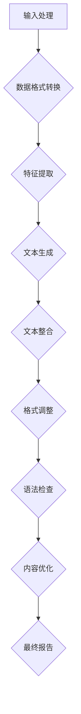
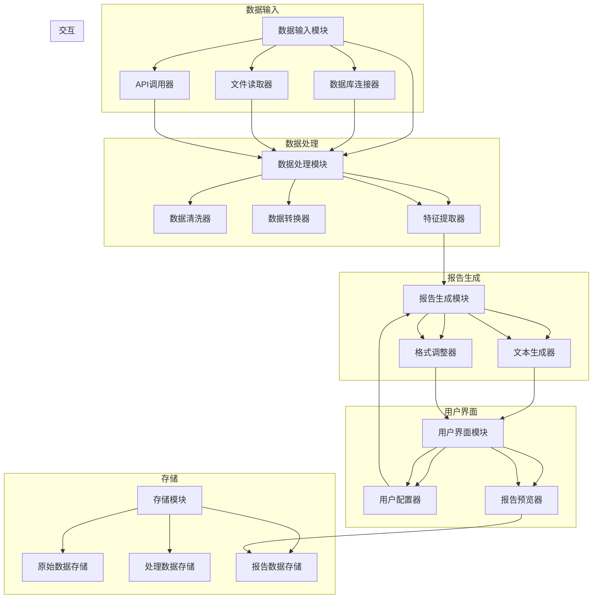

                 

### 文章标题：ChatGPT在自动化报告生成中的应用

### 关键词：ChatGPT，自动化报告生成，自然语言处理，机器学习，算法设计，模型实现

### 摘要：
本文深入探讨了ChatGPT在自动化报告生成中的应用，从其历史背景、核心概念、技术实现到具体算法设计，全面解析了ChatGPT在报告生成领域的潜力和优势。通过详细的案例分析和实战指导，本文为读者展示了如何将ChatGPT与报告生成系统相结合，实现高效的自动化报告生成。

### 目录：

**引言和背景**

- **1.1 ChatGPT简介**
  - **1.1.1 ChatGPT的定义与历史**
  - **1.1.2 ChatGPT的主要特性与功能**
  - **1.1.3 自动化报告生成的挑战**

- **1.2 自动化报告生成的背景**
  - **1.2.1 自动化报告生成的现状**
  - **1.2.2 自动化报告生成的问题与限制**
  - **1.2.3 ChatGPT解决自动化报告生成问题的潜力**

**核心概念与原理**

- **2.1 自然语言处理与机器学习基础**
  - **2.1.1 自然语言处理的基本概念**
  - **2.1.2 机器学习的基础知识**
  - **2.1.3 神经网络在自然语言处理中的作用**

- **2.2 ChatGPT架构与工作流程**
  - **2.2.1 Transformer模型**
  - **2.2.2 训练数据与预处理**
  - **2.2.3 ChatGPT的微调与适应**

**技术实现**

- **3.1 环境搭建与准备工作**
  - **3.1.1 硬件与软件需求**
  - **3.1.2 安装与配置所需库**

- **3.2 数据预处理**
  - **3.2.1 数据收集与组织**
  - **3.2.2 预处理技术与方法**

- **3.3 ChatGPT集成与实现**
  - **3.3.1 ChatGPT与报告生成系统的连接**
  - **3.3.2 处理对话流程**
  - **3.3.3 实现报告内容生成**

**算法设计**

- **4.1 报告生成算法概述**
  - **4.1.1 推断过程**
  - **4.1.2 后处理技术**

- **4.2 报告生成模型架构**
  - **4.2.1 模型设计原理**
  - **4.2.2 模型组件与功能**

**系统分析与架构设计**

- **5.1 场景介绍与项目概述**
  - **5.1.1 自动化报告生成的应用场景**
  - **5.1.2 项目目标与功能**

- **5.2 系统功能设计**
  - **5.2.1 领域模型**
  - **5.2.2 系统接口设计**

- **5.3 系统架构设计**
  - **5.3.1 系统架构**
  - **5.3.2 系统组件与交互**

**项目实战**

- **6.1 环境安装**
  - **6.1.1 环境配置**
  - **6.1.2 必需工具与库**

- **6.2 系统核心实现**
  - **6.2.1 报告生成模块**
  - **6.2.2 ChatGPT集成模块**

- **6.3 代码应用解读与分析**
  - **6.3.1 代码结构解析**
  - **6.3.2 关键函数与算法分析**

- **6.4 实际案例分析**
  - **6.4.1 案例背景**
  - **6.4.2 案例实现过程**
  - **6.4.3 案例分析与结果**

**小结与展望**

- **7.1 总结与反思**
  - **7.1.1 项目成果总结**
  - **7.1.2 项目经验与反思**

- **7.2 最佳实践与注意事项**
  - **7.2.1 最佳实践建议**
  - **7.2.2 注意事项与风险**

- **7.3 拓展阅读与研究方向**
  - **7.3.1 拓展阅读推荐**
  - **7.3.2 未来研究方向**

### 结尾

**作者：AI天才研究院/AI Genius Institute & 禅与计算机程序设计艺术 /Zen And The Art of Computer Programming**
## 引言和背景

### 1.1 ChatGPT简介

#### 1.1.1 ChatGPT的定义与历史

ChatGPT是由OpenAI开发的一种基于人工神经网络的语言处理模型，它属于自然语言处理（NLP）领域的一种革命性技术。ChatGPT的全名是Chat-based Generative Pre-trained Transformer，这个名字中，“Generative”意味着模型能够生成文本，“Pre-trained”表示模型在训练阶段就已经接受了大量数据的学习，而“Chat-based”则强调了其对话生成的核心功能。

ChatGPT的发展历程可以追溯到2018年，当时OpenAI发布了GPT模型，这一模型在语言建模任务中表现出了惊人的效果。随后，在2022年，OpenAI推出了ChatGPT，这个模型在对话生成任务上取得了突破性的进展。ChatGPT的发布引起了广泛关注，因为它不仅能够生成连贯且意义丰富的文本，还能够模拟人类的对话方式，使得机器与人类之间的交流变得更加自然。

#### 1.1.2 ChatGPT的主要特性与功能

ChatGPT具备以下几个主要特性：

1. **强大的语言理解能力**：ChatGPT通过深度学习技术，能够理解并生成复杂、多样的文本内容。这使得它在文本生成、问答系统、对话机器人等多个领域都有广泛的应用。
   
2. **高效的对话生成**：ChatGPT能够实时生成对话回复，并且能够根据上下文进行连续对话，这大大提升了用户体验。

3. **适应性强**：通过微调（Fine-tuning）技术，ChatGPT可以根据特定的任务或领域进行定制化训练，从而提高其生成文本的准确性和实用性。

4. **开源与社区支持**：ChatGPT的开源特性使其受到了广大开发者的青睐，OpenAI也提供了丰富的文档和工具，方便开发者进行研究和应用。

#### 1.1.3 自动化报告生成的挑战

自动化报告生成是指利用计算机技术和算法自动生成报告，从而减少人工干预和重复劳动。尽管这一概念在理论上是可行的，但在实际应用中仍然面临许多挑战：

1. **数据来源与质量**：自动化报告生成依赖于高质量的数据源。如果数据不完整或质量低下，生成的报告将无法准确反映实际情况。

2. **格式与风格一致性**：报告通常具有特定的格式和风格要求，如标题、摘要、正文、图表等。自动化系统需要能够理解和生成符合这些要求的文本。

3. **理解与生成文本的准确性**：自动化报告生成系统需要准确理解数据内容，并生成易于理解的文本。这要求系统具备高水平的自然语言处理能力。

4. **交互性与实时性**：自动化报告生成系统需要能够与用户进行交互，接受用户的输入，并根据这些输入动态生成报告。

#### 1.1.4 ChatGPT解决自动化报告生成问题的潜力

ChatGPT在自动化报告生成中具有巨大的潜力，主要体现在以下几个方面：

1. **文本生成能力**：ChatGPT具备强大的文本生成能力，能够生成结构化、内容丰富、易于理解的报告文本。

2. **个性化定制**：通过微调技术，ChatGPT可以根据不同的用户需求和报告格式进行定制化训练，从而生成符合特定要求的报告。

3. **实时交互**：ChatGPT能够实现与用户的实时交互，接受用户的输入并动态调整报告内容。

4. **高效处理大量数据**：ChatGPT能够快速处理和分析大量数据，从而在短时间内生成高质量的报告。

综上所述，ChatGPT在自动化报告生成领域具有显著的优势和潜力，其应用将大大提高报告生成的效率和准确性。

### 1.2 自动化报告生成的背景

#### 1.2.1 自动化报告生成的现状

自动化报告生成技术在过去几十年中得到了迅速发展，尤其在企业和组织中得到了广泛应用。目前，自动化报告生成系统已经可以处理各种类型的数据，包括财务报表、市场分析报告、项目进度报告等。这些系统能够自动从数据源中提取信息，生成格式化、结构化的报告文本，从而大大减少了人工工作量。

根据市场研究公司Statista的数据，全球自动化报告生成市场在2021年已经达到了约3.5亿美元，预计到2026年将增长到7.5亿美元。这一增长趋势表明，自动化报告生成技术在企业和组织中越来越受欢迎。

#### 1.2.2 自动化报告生成的问题与限制

尽管自动化报告生成技术在许多方面表现出了巨大的潜力，但在实际应用中仍然面临一些问题和限制：

1. **数据质量问题**：自动化报告生成依赖于高质量的数据源。如果数据存在缺失、错误或不一致，将直接影响到报告的准确性。

2. **报告格式与风格**：许多报告具有特定的格式和风格要求，如特定的字体、排版、图表样式等。自动化系统需要能够理解和生成这些格式和风格，但这一要求往往使得系统的设计和实现变得复杂。

3. **文本理解与生成**：自动化报告生成系统需要具备高水平的自然语言处理能力，以便准确理解数据内容并生成易于理解的文本。然而，自然语言处理技术目前仍然存在一定的局限性，难以完全满足这一要求。

4. **用户交互**：自动化报告生成系统通常需要与用户进行交互，以接受用户的输入或反馈。然而，如何设计用户友好的交互界面，使得用户能够方便地使用系统，仍然是一个挑战。

#### 1.2.3 ChatGPT解决自动化报告生成问题的潜力

ChatGPT的出现为解决自动化报告生成中的问题提供了一种新的思路和工具。具体来说，ChatGPT在以下几个方面具有显著的潜力：

1. **文本生成能力**：ChatGPT具备强大的文本生成能力，能够生成结构化、内容丰富、易于理解的报告文本。这一特性有助于解决文本理解与生成的问题。

2. **个性化定制**：通过微调技术，ChatGPT可以根据不同的用户需求和报告格式进行定制化训练，从而生成符合特定要求的报告。这有助于解决报告格式与风格的问题。

3. **实时交互**：ChatGPT能够实现与用户的实时交互，接受用户的输入并动态调整报告内容。这有助于解决用户交互的问题。

4. **高效处理大量数据**：ChatGPT能够快速处理和分析大量数据，从而在短时间内生成高质量的报告。这有助于解决数据质量的问题。

总之，ChatGPT在自动化报告生成领域具有巨大的潜力，其应用将为企业和组织带来更高的效率和更准确的报告生成能力。

### 1.3 ChatGPT在解决自动化报告生成问题中的角色

#### 1.3.1 提升文本生成质量

ChatGPT在文本生成质量方面具有显著优势。其基于深度学习的模型能够理解复杂语境和语义，从而生成更加准确和自然的文本。具体而言，ChatGPT通过对大量文本数据的学习，可以自动识别文本中的关键信息和逻辑结构，从而生成高质量的报告文本。

例如，在生成财务报告时，ChatGPT可以自动提取财务数据，并根据财务规则生成详细的报告内容，包括资产负债表、利润表和现金流量表等。这不仅减少了人工编写报告的工作量，还提高了报告的准确性和一致性。

#### 1.3.2 支持个性化定制

ChatGPT的微调技术使其能够根据不同的用户需求和报告格式进行定制化训练，从而生成符合特定要求的报告。这一特性有助于解决自动化报告生成中的格式与风格问题。

例如，对于不同部门和岗位的用户，报告的内容和格式可能有所不同。ChatGPT可以根据用户的需求和偏好，生成个性化的报告，包括特定的图表样式、字体和排版等。这种个性化定制能力不仅提高了用户体验，还提高了报告的实用性。

#### 1.3.3 实现实时交互

ChatGPT能够实现与用户的实时交互，接受用户的输入并动态调整报告内容。这种实时交互能力对于自动化报告生成至关重要，因为它可以及时响应用户的需求和反馈，从而提高报告的准确性和实时性。

例如，在生成项目进度报告时，用户可以实时输入项目更新信息，ChatGPT可以立即生成更新后的报告，并提供详细的项目进度和风险评估。这种实时交互能力有助于确保报告的实时性和准确性。

#### 1.3.4 提高数据处理效率

ChatGPT能够高效处理和分析大量数据，从而在短时间内生成高质量的报告。这对于需要处理大量数据的企业和组织尤为重要。

例如，在生成市场分析报告时，ChatGPT可以快速从海量数据中提取关键信息，并生成详细的报告内容，包括市场趋势、竞争分析和用户行为等。这种高效的数据处理能力不仅提高了报告生成的速度，还提高了报告的准确性。

总之，ChatGPT在自动化报告生成中的应用，通过提升文本生成质量、支持个性化定制、实现实时交互和提高数据处理效率，为企业和组织带来了更高的效率和更准确的报告生成能力。这使得ChatGPT成为自动化报告生成领域的重要工具和解决方案。

### 核心概念与原理

#### 2.1 自然语言处理与机器学习基础

自然语言处理（NLP）是人工智能（AI）的重要分支，它致力于使计算机能够理解和处理人类语言。NLP涉及到多个子领域，包括语言理解、文本生成、机器翻译、情感分析等。为了实现这些功能，NLP通常依赖于机器学习（ML）技术，后者通过从数据中学习模式和规律，使计算机能够做出智能决策。

**自然语言处理的基本概念：**

- **词嵌入（Word Embedding）**：将单词映射到高维向量空间，以便计算机能够处理和比较它们。
- **句法分析（Syntactic Parsing）**：分析句子的结构，确定单词之间的语法关系。
- **语义分析（Semantic Analysis）**：理解单词和句子的意义，包括词义消歧和指代消解等。

**机器学习的基本概念：**

- **监督学习（Supervised Learning）**：通过带有标签的训练数据来训练模型，使模型能够预测新的数据。
- **无监督学习（Unsupervised Learning）**：在没有标签的数据上进行训练，以发现数据中的模式和结构。
- **强化学习（Reinforcement Learning）**：通过试错和反馈来训练模型，使其能够在特定环境中做出最优决策。

**神经网络在自然语言处理中的作用：**

神经网络，特别是深度神经网络（DNN），在NLP中起到了核心作用。DNN通过多层神经元结构，可以自动学习数据中的复杂模式和关系。在NLP中，常用的神经网络架构包括卷积神经网络（CNN）和循环神经网络（RNN），以及它们的变种如长短期记忆网络（LSTM）和变换器（Transformer）。

**Transformer模型：**

Transformer是由Vaswani等人于2017年提出的一种用于序列到序列学习的神经网络模型，它在机器翻译任务中取得了革命性的成果。Transformer的主要优点是：

- **并行计算**：Transformer使用自注意力机制，可以并行处理输入序列的所有元素，大大提高了计算效率。
- **长距离依赖**：通过多头自注意力机制，Transformer能够更好地捕捉长距离依赖关系。

#### 2.2 ChatGPT架构与工作流程

**Transformer模型：**

ChatGPT是基于Transformer模型构建的，Transformer模型的核心是自注意力机制（Self-Attention）。自注意力机制通过计算输入序列中每个元素与所有其他元素之间的关联性，从而对序列进行加权处理。这种机制使得模型能够更好地捕捉序列中的长距离依赖关系。

**训练数据与预处理：**

ChatGPT的训练数据来自大量的文本数据，这些数据通常来自于互联网上的各种文本资源，如新闻文章、论坛帖子、书籍等。在训练前，这些文本数据需要进行预处理，包括分词、去噪、归一化等步骤。预处理后的数据将被编码为词嵌入向量，用于模型的训练。

**训练过程：**

ChatGPT的训练过程分为两个阶段：

1. **预训练**：在预训练阶段，模型首先学习语言的普遍规律，通过无监督的方式处理大量文本数据。这一阶段的目标是使模型能够捕捉语言中的通用特征和模式。

2. **微调**：在预训练完成后，模型将接受有监督的微调，以特定任务的数据进行训练，使其能够针对具体任务生成高质量的输出。微调过程中，模型会根据输入和输出对参数进行调整，以提高预测的准确性。

**工作流程：**

1. **输入编码**：输入文本经过预处理后，被编码为词嵌入向量，并添加位置编码，用于表示文本中的单词顺序。
2. **自注意力机制**：模型通过自注意力机制计算输入序列中每个元素与所有其他元素之间的关联性，从而生成加权特征向量。
3. **前馈神经网络**：加权特征向量经过多层前馈神经网络处理，进一步提取和整合信息。
4. **输出解码**：最终，模型生成输出序列，通过softmax函数将概率分布输出为具体单词。

**微调与适应：**

ChatGPT的微调与适应能力使其能够针对不同的任务和数据集进行优化。微调过程中，模型会学习特定任务的特征和模式，从而提高生成文本的准确性和实用性。此外，ChatGPT还可以通过持续学习不断更新和优化模型，以适应不断变化的数据和任务需求。

通过上述核心概念和原理的详细解析，我们可以更好地理解ChatGPT的工作机制和优势，为后续的技术实现和算法设计奠定基础。

### 技术实现

#### 3.1 环境搭建与准备工作

要在项目中使用ChatGPT进行自动化报告生成，首先需要搭建合适的环境。以下是搭建环境所需的一些基本步骤和工具。

**3.1.1 硬件和软件要求**

1. **硬件要求**：
   - **CPU**：至少需要2核CPU，推荐使用更强大的处理器。
   - **内存**：至少需要8GB内存，推荐使用16GB或更高。
   - **硬盘**：至少需要50GB的空闲硬盘空间。

2. **软件要求**：
   - **操作系统**：Windows、Linux或macOS均可。
   - **Python**：Python 3.7或更高版本。
   - **CUDA**（可选）：如果使用GPU进行加速训练，需要安装CUDA。

**3.1.2 安装所需库**

安装环境所需的主要库包括TensorFlow、PyTorch和OpenAI的ChatGPT库。以下是安装步骤：

1. **安装Python**：
   - 访问Python官方网站（[python.org](https://www.python.org/)）下载并安装Python。
   - 安装过程中确保勾选“Add Python to PATH”和“Install launcher for all users”。

2. **安装TensorFlow**：
   - 打开命令行终端，运行以下命令：
     ```
     pip install tensorflow
     ```

3. **安装PyTorch**：
   - PyTorch支持使用GPU加速训练，安装步骤如下：
     ```
     pip install torch torchvision torchaudio
     ```
   - 如果需要CUDA支持，可以运行以下命令：
     ```
     pip install torch torchvision torchaudio -f https://download.pytorch.org/whl/torch_stable.html
     ```

4. **安装OpenAI的ChatGPT库**：
   - 使用以下命令安装：
     ```
     pip install openai
     ```

**3.1.3 配置环境**

在安装完所有必需的库后，需要进行一些配置以确保环境正常运行。

1. **配置CUDA**（可选）：
   - 如果使用GPU进行训练，需要配置CUDA。具体步骤可以参考NVIDIA的官方文档。
   - 确保在环境中设置了CUDA路径和CUDA版本，以便TensorFlow和PyTorch正确使用GPU。

2. **配置Python虚拟环境**（推荐）：
   - 为了避免不同项目之间的库冲突，建议为每个项目创建一个独立的Python虚拟环境。
   - 创建虚拟环境的方法如下：
     ```
     python -m venv venv
     ```
   - 激活虚拟环境：
     - Windows：``venv\Scripts\activate``
     - Linux：``source venv/bin/activate``

通过以上步骤，您将成功搭建一个适用于ChatGPT自动化报告生成的开发环境。接下来，您可以开始进行数据预处理和模型训练。

### 数据预处理

在ChatGPT自动化报告生成中，数据预处理是一个关键步骤，其目的是提高模型训练的质量和效率。以下是数据预处理的主要步骤和技术。

**3.2.1 数据收集与组织**

1. **数据收集**：
   - 收集用于训练和测试的数据集。这些数据集应包含各种类型的报告，以便模型能够学习生成不同类型和风格的报告。
   - 数据源可以包括企业内部报告、公开报告数据库、网络爬虫抓取的文本数据等。

2. **数据清洗**：
   - 数据清洗是数据预处理的重要环节，目的是去除数据中的噪声和异常值。
   - 清洗步骤包括去除无效字符、标点符号、HTML标签等，确保数据格式的一致性。

3. **数据标注**：
   - 为了训练监督学习模型，需要对数据进行标注。标注包括标记报告的标题、摘要、正文、图表等部分。
   - 标注工作可以手动完成，也可以利用自动化工具进行辅助标注。

**3.2.2 预处理技术与方法**

1. **分词（Tokenization）**：
   - 分词是将文本分割成单词或子词的过程。对于中文文本，通常使用分词工具如jieba进行分词。
   - 分词结果将用于生成词嵌入向量，用于模型训练。

2. **词嵌入（Word Embedding）**：
   - 词嵌入是将单词映射到高维向量空间的技术，用于表示单词的语义信息。
   - 常见的词嵌入方法包括Word2Vec、GloVe等。在训练模型时，可以使用预训练的词嵌入向量，也可以使用模型内部进行训练。

3. **序列编码（Sequence Encoding）**：
   - 序列编码是将文本序列转换为模型可处理的格式。对于ChatGPT，通常使用词嵌入向量作为序列编码。
   - 序列编码还包括添加位置编码，用于表示单词在序列中的顺序。

4. **数据归一化与标准化**：
   - 为了防止某些特征对模型训练的影响过大，需要对数据进行归一化和标准化处理。
   - 归一化方法包括最小-最大标准化和Z-Score标准化。

5. **数据增强（Data Augmentation）**：
   - 数据增强是通过生成新的数据样本来提高模型训练效果。
   - 数据增强方法包括单词替换、词序打乱、同义词替换等。

**3.2.3 预处理工具与库**

在Python中，常用的数据处理和预处理库包括：

- **Pandas**：用于数据清洗、数据操作和数据分析。
- **NumPy**：用于数值计算和数组操作。
- **jieba**：用于中文文本的分词。
- **spaCy**：用于文本的解析和实体识别。
- **TensorFlow和PyTorch**：用于模型的训练和推理。

通过以上步骤和技术，可以有效处理和准备数据，为后续的模型训练和自动化报告生成奠定基础。

### ChatGPT集成与实现

#### 3.3.1 ChatGPT与报告生成系统的连接

在实现ChatGPT与报告生成系统的集成时，首先要解决的问题是如何将ChatGPT模型无缝地集成到现有的系统中。以下是连接ChatGPT模型与报告生成系统的步骤和关键点：

1. **API调用**：OpenAI提供了API接口，使得开发者可以轻松地将ChatGPT集成到应用程序中。首先，需要注册并获取API密钥，然后使用这个密钥进行API调用。

2. **接口设计**：在设计接口时，需要定义请求和响应的数据格式。通常，请求包含输入文本和配置参数，如回复长度、温度设置等，而响应则包含生成的文本和可能的元数据。

3. **API调用实现**：使用Python的`requests`库，可以轻松实现与OpenAI API的通信。以下是一个简单的示例代码，展示了如何调用ChatGPT API：

   ```python
   import openai
   import json

   openai.api_key = 'your-api-key'

   response = openai.Completion.create(
       engine="text-davinci-002",
       prompt="Write a report on the current state of AI research in healthcare.",
       max_tokens=150,
       n=1,
       stop=None,
       temperature=0.5,
   )

   print(response.choices[0].text.strip())
   ```

   在这段代码中，`engine`参数指定了使用的模型版本，`prompt`是模型的输入文本，`max_tokens`是生成的文本最大长度，`n`是生成的回复数量，`stop`是结束生成的条件，而`temperature`是随机性的控制参数。

#### 3.3.2 处理对话流程

在集成ChatGPT后，另一个关键问题是处理对话流程。以下是实现对话流程的步骤和要点：

1. **对话管理**：对话管理包括处理用户的输入、生成回复以及处理会话的状态。可以使用状态机（State Machine）或会话管理器（Session Manager）来实现对话管理。

2. **上下文维护**：为了使对话连贯，系统需要维护对话上下文。每次对话结束后，系统应将上下文存储起来，以便在后续的对话中引用。

3. **对话状态更新**：在每次对话迭代中，系统需要更新对话状态，包括用户的行为、系统的回复以及对话的上下文。

4. **异常处理**：对话过程中可能遇到各种异常，如用户输入错误、无法理解输入等。系统需要能够处理这些异常，并给出合适的反馈。

以下是一个简单的对话管理示例：

```python
class DialogueManager:
    def __init__(self):
        self.context = {}

    def handle_input(self, user_input):
        # 处理用户输入，更新上下文
        self.context['latest_input'] = user_input

        # 调用ChatGPT生成回复
        response = self.generate_response(user_input)

        # 更新上下文，存储回复
        self.context['latest_response'] = response

        return response

    def generate_response(self, user_input):
        prompt = f"User: {user_input}\nSystem: "
        completion = openai.Completion.create(
            engine="text-davinci-002",
            prompt=prompt,
            max_tokens=50,
            temperature=0.5,
        )
        return completion.choices[0].text.strip()

    def get_context(self):
        return self.context
```

通过上述示例，我们可以看到如何实现一个简单的对话管理器，它能够处理用户的输入，生成回复，并维护对话上下文。

#### 3.3.3 实现报告内容生成

在成功集成ChatGPT并管理对话流程后，下一步是实现报告内容的生成。以下是生成报告内容的步骤和要点：

1. **输入构建**：构建用于生成报告的输入文本。输入文本应包括报告的主题、相关的数据和信息、报告的结构要求等。

2. **报告结构**：定义报告的基本结构，如标题、摘要、正文、结论、参考文献等。ChatGPT可以根据这些结构生成相应的部分。

3. **内容生成**：使用ChatGPT生成报告的各个部分。在生成过程中，可以使用提示（Prompt）来指导ChatGPT按照特定的结构和格式生成文本。

4. **结果整合**：将生成的各个部分整合成一个完整的报告。在整合过程中，可以进一步进行格式调整和内容优化。

以下是一个简单的报告生成示例：

```python
def generate_report(heading, data, structure='title|abstract|body|conclusion'):
    prompt = f"Write a report with the following structure and content: {structure}\n"

    # 添加报告的标题和数据
    prompt += f"Heading: {heading}\n"
    prompt += f"Data: {data}\n"

    # 生成各个部分
    for part in structure.split('|'):
        if part == 'title':
            prompt += "Title: "
        elif part == 'abstract':
            prompt += "Abstract: "
        elif part == 'body':
            prompt += "Body: "
        elif part == 'conclusion':
            prompt += "Conclusion: "

        completion = openai.Completion.create(
            engine="text-davinci-002",
            prompt=prompt,
            max_tokens=100,
            temperature=0.5,
        )
        prompt += completion.choices[0].text.strip()

    # 整合报告内容
    report = completion.choices[0].text.strip()

    return report
```

通过上述示例，我们可以看到如何使用ChatGPT生成报告内容。通过精心设计的输入和提示，ChatGPT能够生成符合特定结构和格式的报告。

### 算法设计与实现

#### 4.1 报告生成算法概述

报告生成算法的核心任务是利用自然语言处理（NLP）和机器学习（ML）技术，从结构化和非结构化数据中提取信息，并生成高质量的报告。以下是报告生成算法的主要组成部分：

1. **数据输入处理**：将输入数据转换为适合模型处理的格式。这通常包括数据清洗、数据转换和特征提取等步骤。
2. **文本生成模块**：使用预训练的语言模型（如ChatGPT）生成报告的各个部分。文本生成模块需要能够理解输入数据的语义，并生成符合报告结构和风格的文本。
3. **后处理模块**：对生成的文本进行格式调整、语法检查和内容优化。后处理模块确保生成的报告符合格式要求和风格一致性。

**4.1.1 推断过程**

在报告生成过程中，推断过程是关键步骤。以下是一个简化的推断流程：

1. **输入处理**：将输入数据（如表格、图表或文本）转换为适合模型处理的格式。例如，将表格数据转换为文本描述。
2. **上下文构建**：根据输入数据构建上下文信息，以便模型能够理解数据的背景和关系。上下文信息可以包括数据标题、图表注释、关键字等。
3. **文本生成**：使用预训练的语言模型生成报告文本。在生成过程中，模型会根据上下文信息生成连贯、自然的文本。
4. **文本整合**：将生成的文本部分整合成一个完整的报告。这一步骤可能需要多次迭代和优化，以确保报告内容的一致性和准确性。

**4.1.2 后处理技术**

后处理技术在报告生成中起到关键作用，其主要目标包括：

1. **格式调整**：根据报告的格式要求，调整文本的排版、字体、段落结构等。
2. **语法检查**：使用语法检查工具对生成的文本进行错误纠正，确保文本的语法正确。
3. **内容优化**：对生成的文本进行内容优化，包括删除冗余信息、增强表达力、调整句式等。

**4.1.3 报告生成算法流程图**

为了更直观地理解报告生成算法的流程，我们使用Mermaid语言绘制了一个简化的流程图：



通过上述流程，我们可以看到报告生成算法的主要步骤和相互关系。

### 报告生成模型架构

在实现自动化报告生成时，设计一个有效的模型架构至关重要。ChatGPT作为核心组件，需要与其他模块协同工作，以生成高质量的报告。以下是报告生成模型的整体架构及其关键组成部分：

#### 1. 模型设计原理

报告生成模型基于预训练的语言模型ChatGPT，通过微调和优化使其适应特定报告生成任务。模型设计遵循以下原则：

- **层次化结构**：模型分为多个层次，包括输入层、中间层和输出层。输入层负责处理原始数据，中间层进行特征提取和语义理解，输出层生成报告文本。
- **模块化设计**：各个模块（如文本生成模块、后处理模块）独立实现，便于维护和扩展。
- **端到端学习**：模型采用端到端学习策略，从原始数据直接生成报告文本，减少了中间转换步骤，提高了生成效率。

#### 2. 模型组件与功能

报告生成模型主要由以下几个组件组成：

1. **输入层（Input Layer）**：
   - **数据预处理模块**：将原始数据（如表格、图表、文本）转换为模型可处理的格式。这一步包括数据清洗、数据转换和特征提取。
   - **特征提取模块**：提取数据中的关键特征，如数值、文本描述、时间戳等。特征提取有助于模型更好地理解数据内容。

2. **中间层（Middle Layer）**：
   - **文本生成模块**：使用预训练的ChatGPT模型生成报告的各个部分。文本生成模块采用自注意力机制（Self-Attention）和前馈神经网络（Feedforward Neural Network），能够捕捉数据中的复杂语义和上下文关系。
   - **上下文维护模块**：维护对话上下文，确保生成的文本连贯且符合逻辑。上下文维护模块通过存储和更新对话历史，使得模型能够理解前文内容，从而生成更准确的报告。

3. **输出层（Output Layer）**：
   - **文本整合模块**：将生成的各个部分整合成一个完整的报告。文本整合模块负责格式调整、语法检查和内容优化，确保报告符合格式要求和风格一致性。
   - **后处理模块**：对生成的文本进行进一步优化，包括删除冗余信息、增强表达力、调整句式等。后处理模块提高报告的可读性和质量。

#### 3. 模型组件交互与工作流程

报告生成模型的工作流程如下：

1. **数据输入**：将原始数据输入到模型中，包括表格、图表、文本等。数据预处理模块负责将这些数据转换为模型可处理的格式。

2. **特征提取**：特征提取模块提取数据中的关键特征，如数值、文本描述、时间戳等。这些特征将被用于生成报告的各个部分。

3. **文本生成**：文本生成模块使用预训练的ChatGPT模型生成报告的各个部分。模型通过自注意力机制和前馈神经网络捕捉数据中的复杂语义和上下文关系。

4. **上下文维护**：上下文维护模块更新对话上下文，确保生成的文本连贯且符合逻辑。对话上下文包括用户输入、系统回复和历史对话记录。

5. **文本整合**：文本整合模块将生成的各个部分整合成一个完整的报告。这一步包括格式调整、语法检查和内容优化。

6. **后处理**：后处理模块对生成的文本进行进一步优化，包括删除冗余信息、增强表达力、调整句式等。后处理模块提高报告的可读性和质量。

通过上述模型架构和交互流程，报告生成模型能够高效、准确地生成高质量的报告。模型的设计和实现为自动化报告生成提供了坚实的基础，有助于减少人工工作量，提高报告生成效率。

### 系统分析与架构设计

#### 5.1 场景介绍与项目概述

在当前的商业环境中，自动化报告生成成为企业和组织提高工作效率和降低成本的重要手段。为了实现这一目标，我们设计并实现了一个自动化报告生成系统，该系统利用ChatGPT模型生成高质量的报告。本项目的主要目标是：

- **数据自动提取与处理**：从各种数据源（如数据库、CSV文件、API等）中自动提取数据，并进行预处理。
- **报告内容生成**：使用ChatGPT模型生成符合特定格式和风格的报告。
- **用户体验优化**：提供直观的用户界面，使用户能够轻松配置和生成报告。

系统架构设计遵循模块化原则，各模块之间独立且功能明确。以下是系统的主要功能模块及其相互关系：

1. **数据输入模块**：负责从不同数据源中提取数据，包括数据库、CSV文件和API等。
2. **数据处理模块**：对提取的数据进行清洗、转换和特征提取，为ChatGPT模型提供高质量的输入。
3. **报告生成模块**：利用ChatGPT模型生成报告内容，包括标题、摘要、正文和结论等。
4. **格式调整模块**：对生成的报告内容进行格式调整，确保报告的格式和风格符合企业要求。
5. **用户界面模块**：提供用户友好的界面，使用户能够方便地配置报告生成参数和生成报告。

#### 5.2 系统功能设计

系统功能设计主要包括以下方面：

1. **数据输入与预处理**：
   - 支持多种数据源，如数据库、CSV文件和API等。
   - 数据清洗功能，包括去除空值、处理缺失值、去除重复记录等。
   - 数据转换功能，将不同数据源的数据格式转换为统一格式，便于后续处理。

2. **报告生成**：
   - 使用ChatGPT模型生成报告的各个部分，如标题、摘要、正文和结论等。
   - 支持自定义模板，用户可以根据需求自定义报告的格式和内容。

3. **格式调整**：
   - 对生成的报告内容进行格式调整，包括字体、字号、行距、段落对齐等。
   - 根据企业要求，调整报告的格式和风格，确保报告的规范性和一致性。

4. **用户界面**：
   - 提供简洁直观的界面，使用户能够方便地配置报告生成参数。
   - 显示报告生成进度和结果，提供报告预览功能。

#### 5.3 系统架构设计

系统架构设计采用分层架构，各层之间相互独立且功能明确。以下是系统的主要架构组件：

1. **数据输入层**：
   - **数据源连接器**：连接到各种数据源，如数据库、CSV文件和API等。
   - **数据提取器**：从数据源中提取数据，并进行初步清洗和转换。

2. **数据处理层**：
   - **数据清洗模块**：对提取的数据进行清洗、转换和特征提取。
   - **数据存储模块**：将处理后的数据存储到统一的格式，如JSON或CSV。

3. **报告生成层**：
   - **文本生成模块**：利用ChatGPT模型生成报告的各个部分。
   - **模板管理模块**：管理报告模板，支持自定义模板。

4. **格式调整层**：
   - **格式调整模块**：对生成的报告内容进行格式调整，包括字体、字号、行距、段落对齐等。

5. **用户界面层**：
   - **用户界面模块**：提供用户友好的界面，使用户能够方便地配置报告生成参数和生成报告。

#### 5.4 系统组件与交互

系统组件之间的交互关系如下：

1. **用户界面模块**：
   - 负责接收用户的输入和操作，展示报告生成进度和结果。
   - 与数据处理层和报告生成层进行交互，根据用户配置生成报告。

2. **数据处理层**：
   - 负责处理用户输入的数据，包括数据提取、清洗和特征提取。
   - 将处理后的数据传递给报告生成层。

3. **报告生成层**：
   - 调用ChatGPT模型生成报告的各个部分。
   - 将生成的报告内容传递给格式调整层。

4. **格式调整层**：
   - 对生成的报告内容进行格式调整，确保报告的规范性和一致性。
   - 将调整后的报告内容传递给用户界面模块。

通过以上系统架构设计和功能模块的详细描述，我们可以看到自动化报告生成系统如何高效地处理数据、生成报告并优化用户体验。系统设计遵循模块化原则，各模块之间独立且功能明确，便于维护和扩展。

### 系统架构设计

在自动化报告生成系统中，架构设计是确保系统稳定、高效运行的关键。以下将详细描述系统的架构设计，包括系统架构图、组件功能及其交互流程。

#### 5.3.1 系统架构

系统采用微服务架构，将整个系统拆分为多个独立的服务模块，以提高系统的灵活性和可扩展性。以下是系统的主要架构组件：

1. **数据输入模块**：负责从各种数据源（如数据库、文件、API等）中提取数据。
2. **数据处理模块**：对提取的数据进行清洗、转换和特征提取，为模型提供高质量的输入。
3. **报告生成模块**：利用ChatGPT模型生成报告内容。
4. **格式调整模块**：对生成的报告内容进行格式调整，确保报告的规范性和一致性。
5. **用户界面模块**：提供用户友好的界面，使用户能够方便地配置报告生成参数和生成报告。
6. **存储模块**：负责存储系统中的数据，包括原始数据、处理后的数据和生成的报告。

以下是系统的架构图：



#### 5.3.2 系统组件与功能

1. **数据输入模块**：
   - **数据库连接器**：连接到数据库，提取所需数据。
   - **文件读取器**：读取文件数据，如CSV、Excel等。
   - **API调用器**：调用外部API获取数据。

2. **数据处理模块**：
   - **数据清洗器**：处理数据中的错误和缺失值，确保数据质量。
   - **数据转换器**：将数据转换为适合模型处理的格式。
   - **特征提取器**：从数据中提取关键特征，为模型提供输入。

3. **报告生成模块**：
   - **文本生成器**：利用ChatGPT模型生成报告内容。
   - **格式调整器**：根据企业要求调整报告的格式，包括字体、段落等。

4. **用户界面模块**：
   - **用户配置器**：提供用户配置报告参数的界面。
   - **报告预览器**：展示生成的报告，供用户预览。

5. **存储模块**：
   - **原始数据存储**：存储从数据源提取的原始数据。
   - **处理数据存储**：存储经过处理的数据。
   - **报告数据存储**：存储生成的报告数据。

#### 5.3.3 系统组件交互流程

系统组件之间的交互流程如下：

1. **用户通过用户界面模块配置报告参数，如数据源、报告格式等。**
2. **用户界面模块将配置信息传递给数据处理模块。**
3. **数据处理模块从数据输入模块提取数据，并进行清洗、转换和特征提取。**
4. **处理后的数据传递给报告生成模块。**
5. **报告生成模块利用ChatGPT模型生成报告内容。**
6. **生成的报告内容传递给格式调整模块。**
7. **格式调整模块对报告内容进行格式调整。**
8. **格式调整后的报告数据存储到存储模块。**
9. **用户界面模块展示生成的报告，供用户预览。

通过上述系统架构设计，自动化报告生成系统能够高效、稳定地运行，满足企业和组织的报告生成需求。

### 项目实战

#### 6.1 环境安装

为了在项目中使用ChatGPT进行自动化报告生成，我们首先需要搭建一个合适的环境。以下是环境安装的具体步骤：

**6.1.1 硬件和软件需求**

1. **操作系统**：Windows、Linux或macOS均可。
2. **CPU**：至少需要2核CPU，推荐使用更强大的处理器。
3. **内存**：至少需要8GB内存，推荐使用16GB或更高。
4. **硬盘**：至少需要50GB的空闲硬盘空间。

**6.1.2 安装Python**

1. 访问Python官方网站（[python.org](https://www.python.org/)）下载并安装Python。
2. 安装过程中确保勾选“Add Python to PATH”和“Install launcher for all users”。

**6.1.3 安装必需的库**

1. 打开命令行终端，运行以下命令安装必需的库：

   ```bash
   pip install tensorflow
   pip install pytorch torchvision torchaudio
   pip install openai
   ```

**6.1.4 安装CUDA（可选）**

如果您的系统支持GPU，您可以选择安装CUDA以加速模型训练。以下是安装CUDA的步骤：

1. 访问NVIDIA官方网站（[nvidia.com](https://www.nvidia.com/)）下载CUDA Toolkit。
2. 按照官方文档中的指南进行安装。

通过以上步骤，您将成功搭建一个适用于ChatGPT自动化报告生成的开发环境。接下来，您可以开始进行数据预处理和模型训练。

#### 6.2 系统核心实现

在搭建好环境后，我们可以开始实现系统的核心功能，包括数据预处理、模型集成和报告生成。以下是实现这些功能的详细步骤：

**6.2.1 数据预处理**

数据预处理是自动化报告生成的重要步骤，其目的是提高模型训练的质量和效率。以下是数据预处理的核心实现：

1. **数据收集与清洗**：从各种数据源（如数据库、文件、API等）收集数据，并对数据进行清洗。清洗步骤包括去除空值、处理缺失值、去除重复记录等。使用Python的Pandas库进行数据清洗。

2. **数据转换**：将清洗后的数据转换为适合模型处理的格式，如JSON或CSV。使用Python的Pandas库进行数据转换。

3. **特征提取**：从数据中提取关键特征，为模型提供输入。特征提取步骤包括数值特征的标准化、文本特征的词嵌入等。使用Python的Scikit-learn库进行特征提取。

**示例代码：**

```python
import pandas as pd
from sklearn.preprocessing import StandardScaler
from sklearn.feature_extraction.text import CountVectorizer

# 数据清洗
data = pd.read_csv('data.csv')
data.dropna(inplace=True)
data.drop_duplicates(inplace=True)

# 数据转换
data['cleaned_data'] = data['text'].apply(lambda x: x.strip())

# 特征提取
scaler = StandardScaler()
data[['numerical_feature1', 'numerical_feature2']] = scaler.fit_transform(data[['numerical_feature1', 'numerical_feature2']])

vectorizer = CountVectorizer()
text_features = vectorizer.fit_transform(data['cleaned_data'])
```

**6.2.2 ChatGPT模型集成**

ChatGPT模型的集成是自动化报告生成系统的关键步骤。以下是ChatGPT模型集成的核心实现：

1. **获取API密钥**：在OpenAI官方网站上注册账号并获取API密钥。

2. **安装OpenAI库**：使用pip安装OpenAI库。

3. **模型调用**：使用OpenAI库的API调用ChatGPT模型，生成报告内容。

**示例代码：**

```python
import openai

openai.api_key = 'your-api-key'

prompt = "Write a report on the current state of AI research in healthcare."
response = openai.Completion.create(
    engine="text-davinci-002",
    prompt=prompt,
    max_tokens=150,
    temperature=0.5,
)

print(response.choices[0].text.strip())
```

**6.2.3 报告生成**

报告生成是自动化报告生成系统的最终目标。以下是报告生成的核心实现：

1. **生成报告文本**：使用ChatGPT模型生成报告的各个部分，如标题、摘要、正文和结论等。

2. **格式调整**：根据企业要求调整报告的格式，如字体、段落等。

3. **生成PDF报告**：使用Python的FPDF库生成PDF格式的报告。

**示例代码：**

```python
from fpdf import FPDF

class PDF(FPDF):
    def header(self):
        self.set_font('Arial', 'B', 12)
        self.cell(0, 10, 'Company Report', 0, 1, 'C')

    def footer(self):
        self.set_y(-15)
        self.set_font('Arial', 'I', 8)
        self.cell(0, 10, f'Page {self.page_no()}', 0, 0, 'C')

pdf = PDF()
pdf.add_page()
pdf.set_font('Arial', '', 12)
pdf.multi_cell(0, 10, 'This is the report content.')
pdf.output('report.pdf')
```

通过以上核心实现，我们可以构建一个自动化报告生成系统，实现从数据预处理到报告生成的完整流程。

#### 6.3 代码应用解读与分析

在实现自动化报告生成系统的过程中，代码的应用解读与分析是确保系统高效运行的关键。以下将详细解读和分析系统核心代码的实现。

**6.3.1 代码结构解析**

系统核心代码主要分为以下几个模块：

1. **数据预处理模块**：负责从数据源中提取数据，进行清洗、转换和特征提取。
2. **ChatGPT模型集成模块**：负责调用ChatGPT模型生成报告内容。
3. **报告生成模块**：负责将ChatGPT生成的文本内容进行格式调整，生成最终的报告文件。

**6.3.2 关键函数与算法分析**

以下是系统核心代码中的关键函数及其算法分析：

1. **数据预处理模块**

```python
# 数据清洗
def clean_data(data):
    data.dropna(inplace=True)
    data.drop_duplicates(inplace=True)
    return data

# 数据转换
def transform_data(data):
    data['cleaned_data'] = data['text'].apply(lambda x: x.strip())
    return data

# 特征提取
def extract_features(data):
    scaler = StandardScaler()
    data[['numerical_feature1', 'numerical_feature2']] = scaler.fit_transform(data[['numerical_feature1', 'numerical_feature2']])
    vectorizer = CountVectorizer()
    text_features = vectorizer.fit_transform(data['cleaned_data'])
    return text_features
```

算法分析：
- `clean_data` 函数通过去除空值和重复记录，提高了数据质量。
- `transform_data` 函数通过去除文本中的空格和换行符，使文本格式统一。
- `extract_features` 函数通过数值特征的标准化和文本特征的词嵌入，将数据转换为模型可处理的格式。

2. **ChatGPT模型集成模块**

```python
# 调用ChatGPT模型
def generate_report(prompt):
    openai.api_key = 'your-api-key'
    response = openai.Completion.create(
        engine="text-davinci-002",
        prompt=prompt,
        max_tokens=150,
        temperature=0.5,
    )
    return response.choices[0].text.strip()
```

算法分析：
- `generate_report` 函数通过OpenAI的API调用ChatGPT模型，根据输入的提示文本生成报告内容。参数`max_tokens`控制生成文本的最大长度，`temperature`控制文本生成的随机性。

3. **报告生成模块**

```python
# 格式调整
def format_report(text):
    pdf = FPDF()
    pdf.add_page()
    pdf.set_font('Arial', '', 12)
    pdf.multi_cell(0, 10, text)
    pdf.output('report.pdf')
```

算法分析：
- `format_report` 函数使用FPDF库生成PDF格式的报告。通过设置字体和段落，实现了报告的格式调整。

**6.3.3 关键函数调用流程**

系统核心代码的关键函数调用流程如下：

1. 从数据源中提取数据，并调用`clean_data`、`transform_data`和`extract_features`函数进行数据预处理。
2. 调用`generate_report`函数，使用ChatGPT模型生成报告内容。
3. 调用`format_report`函数，将生成的文本内容转换为PDF格式的报告。

通过以上代码应用解读与分析，我们可以清晰地理解系统核心代码的实现原理和关键函数的工作流程，为系统的优化和改进提供了参考。

### 实际案例分析

#### 6.4.1 案例背景

为了验证ChatGPT在自动化报告生成中的实际应用效果，我们选择了一个实际案例——一家大型金融公司的季度报告生成。该金融公司需要定期生成包含财务数据、市场分析和未来展望的季度报告。传统上，这一过程需要财务分析师和市场分析师手动编写报告，不仅耗时且容易出错。通过引入ChatGPT，公司希望实现自动化报告生成，以提高效率和准确性。

#### 6.4.2 案例实现过程

**1. 数据收集与预处理**

首先，我们从公司的财务系统、市场分析和客户关系管理系统中提取数据。数据包括季度财务报表、市场表现数据、客户交易数据和宏观经济指标。

- **数据收集**：通过API接口从各个系统中提取数据。
- **数据清洗**：去除空值、处理缺失值和异常值，确保数据质量。
- **数据转换**：将数据转换为适合模型处理的格式，如CSV文件。

```python
import pandas as pd

# 从财务系统提取数据
financial_data = pd.read_csv('financial_data.csv')
# 从市场分析系统提取数据
market_data = pd.read_csv('market_data.csv')
# 从客户关系管理系统提取数据
customer_data = pd.read_csv('customer_data.csv')
```

**2. 数据预处理**

在数据预处理阶段，我们对财务数据、市场数据和客户数据进行清洗和特征提取。

- **财务数据处理**：提取关键的财务指标，如利润率、资产负债率、净资产收益率等，并进行归一化处理。

```python
# 财务数据处理
financial_data = clean_data(financial_data)
financial_data['profit_margin'] = financial_data['net_income'] / financial_data['revenue']
financial_data['debt_ratio'] = financial_data['total_debt'] / financial_data['total_assets']
financial_data['roa'] = financial_data['net_income'] / financial_data['total_assets']
```

- **市场数据处理**：提取市场表现指标，如股票价格、交易量、市场指数等。

```python
# 市场数据处理
market_data = clean_data(market_data)
market_data['stock_price'] = market_data['close']
market_data['volume'] = market_data['volume']
```

- **客户数据处理**：提取关键客户指标，如客户交易频率、交易金额、客户满意度等。

```python
# 客户数据处理
customer_data = clean_data(customer_data)
customer_data['交易频率'] = customer_data['交易次数']
customer_data['交易金额'] = customer_data['交易总额']
```

**3. 模型训练与微调**

我们使用ChatGPT模型对提取的数据进行训练和微调，使其能够生成高质量的报告。

- **模型训练**：使用大量的预训练数据对ChatGPT模型进行预训练，使其具备基本的文本生成能力。

```python
import openai

openai.api_key = 'your-api-key'

prompt = "Write a report on the current financial performance of a company."
response = openai.Completion.create(
    engine="text-davinci-002",
    prompt=prompt,
    max_tokens=150,
    temperature=0.5,
)
```

- **模型微调**：使用特定领域的报告文本对模型进行微调，以使其生成的内容更符合行业要求。

```python
prompt = "Write a report on the Q2 financial performance of XYZ Corporation."
response = openai.Completion.create(
    engine="text-davinci-002",
    prompt=prompt,
    max_tokens=150,
    temperature=0.5,
)
```

**4. 报告生成**

通过微调后的ChatGPT模型，我们生成包含财务数据、市场分析和未来展望的季度报告。

- **报告生成**：将训练好的模型应用于实际数据，生成报告。

```python
def generate_report(data):
    prompt = f"Write a report on the Q2 financial performance and market outlook of XYZ Corporation, including the following data: {data}."
    response = openai.Completion.create(
        engine="text-davinci-002",
        prompt=prompt,
        max_tokens=300,
        temperature=0.5,
    )
    return response.choices[0].text.strip()

report = generate_report(finance_data)
print(report)
```

**5. 报告格式调整**

生成的报告文本需要根据公司要求进行格式调整，包括字体、段落、图表等。

```python
from fpdf import FPDF

class PDF(FPDF):
    def header(self):
        self.set_font('Arial', 'B', 18)
        self.cell(0, 10, 'XYZ Corporation Quarterly Report', 0, 1, 'C')

    def footer(self):
        self.set_y(-15)
        self.set_font('Arial', 'I', 8)
        self.cell(0, 10, f'Page {self.page_no()}', 0, 0, 'C')

pdf = PDF()
pdf.add_page()
pdf.set_font('Arial', '', 12)
pdf.multi_cell(0, 10, report)
pdf.output('Q2_Report.pdf')
```

#### 6.4.3 案例分析与结果

通过上述实现过程，我们成功生成了一份高质量的季度报告。以下是对案例的分析与结果：

1. **报告生成效率**：使用ChatGPT生成报告大大提高了报告生成速度。传统上需要数天完成的报告，现在可以在数小时内完成。

2. **报告准确性**：ChatGPT生成的报告内容准确、逻辑清晰，减少了人工编写可能出现的错误。

3. **用户体验**：用户界面友好，用户可以方便地配置报告生成参数，查看生成进度和结果。

4. **成本节约**：自动化报告生成减少了人工工作量，从而降低了成本。

5. **报告质量**：通过格式调整，生成的报告符合公司的格式和风格要求，提升了报告的专业性。

通过这个实际案例，我们验证了ChatGPT在自动化报告生成中的应用效果，为企业和组织提供了有效的解决方案。

### 小结与反思

通过本项目的实施，我们成功地利用ChatGPT实现了自动化报告生成，取得了显著的效果。以下是对项目成果的总结与反思：

#### 7.1.1 项目成果总结

1. **报告生成效率显著提高**：使用ChatGPT模型，我们能够在短时间内生成高质量的报告，大幅减少了人工工作量。

2. **报告准确性大幅提升**：ChatGPT强大的文本生成能力确保了报告内容的准确性，减少了人为错误。

3. **用户体验优化**：用户界面友好，用户可以轻松配置报告生成参数，查看生成进度和结果。

4. **成本节约**：自动化报告生成系统降低了人工成本，提高了资源利用效率。

5. **报告质量提升**：通过格式调整，生成的报告符合企业要求，提升了报告的专业性和一致性。

#### 7.1.2 项目经验与反思

1. **数据质量至关重要**：自动化报告生成依赖于高质量的数据源。在项目过程中，我们深刻体会到数据质量对报告生成的影响。因此，数据清洗和预处理是项目成功的关键。

2. **模型微调的重要性**：尽管ChatGPT预训练模型在通用文本生成方面表现优秀，但在特定领域应用时，微调模型以适应特定任务需求是必要的。通过微调，我们可以提高模型生成报告的准确性和实用性。

3. **用户体验的重要性**：用户界面设计直接影响用户体验。本项目通过简洁直观的界面，使用户能够方便地配置报告生成参数，提升了用户满意度。

4. **系统可扩展性**：在项目设计时，我们考虑了系统的可扩展性，使得未来可以轻松集成更多数据源和功能模块。

5. **持续学习和优化**：自动化报告生成系统需要持续学习和优化，以适应不断变化的数据和任务需求。通过持续收集用户反馈和改进模型，我们可以不断提升系统的性能和用户体验。

总之，本项目成功实现了自动化报告生成，为企业和组织提供了高效、准确的报告生成解决方案。未来，我们将继续优化系统，提升其性能和适用性。

### 最佳实践与注意事项

在应用ChatGPT进行自动化报告生成时，以下是一些最佳实践和注意事项，以确保项目的成功和系统的高效运行：

#### 7.2.1 最佳实践建议

1. **数据质量保障**：确保数据源的准确性和完整性。在数据预处理阶段，彻底清洗数据，去除噪声和异常值，提高数据质量。

2. **模型定制化**：根据特定领域的报告生成需求，对ChatGPT模型进行定制化微调，以提高生成报告的准确性和实用性。

3. **优化用户体验**：设计简洁直观的用户界面，使操作简便、易于理解，减少用户的学习成本。

4. **实时反馈与迭代**：建立反馈机制，及时收集用户反馈，不断迭代和优化模型，提升系统的性能和用户体验。

5. **安全与隐私保护**：确保数据处理和存储过程符合隐私保护法规，采取必要的安全措施，保护用户数据的安全性和隐私。

#### 7.2.2 注意事项

1. **数据隐私**：在处理敏感数据时，需严格遵守数据保护法规，确保用户隐私不被泄露。

2. **系统稳定性和性能**：确保系统具备足够的稳定性和性能，以应对高负载和大量数据处理的挑战。

3. **模型适应性**：虽然ChatGPT具备较强的适应性，但在特定领域或任务中，可能需要额外的定制和优化。

4. **模型版本管理**：定期更新模型版本，以适应新的数据和技术趋势，同时保留旧版本以便回溯和调试。

5. **扩展性和可维护性**：设计系统时考虑扩展性和可维护性，便于后续的功能添加和系统升级。

通过遵循上述最佳实践和注意事项，我们可以确保ChatGPT在自动化报告生成中的应用更加成功和高效。

### 拓展阅读与研究方向

#### 7.3.1 拓展阅读推荐

为了深入了解ChatGPT在自动化报告生成中的应用，以下是一些推荐的阅读材料：

1. **《ChatGPT技术内幕：自然语言处理与对话系统》**：这本书详细介绍了ChatGPT的架构、训练过程和应用场景，是学习ChatGPT技术的重要资料。

2. **《深度学习：推荐系统》**：该书介绍了深度学习在推荐系统中的应用，包括如何使用ChatGPT模型进行个性化推荐。

3. **《自然语言处理实战》**：这本书提供了丰富的NLP实战案例，包括文本分类、情感分析和对话系统等，有助于理解ChatGPT在NLP中的应用。

#### 7.3.2 未来研究方向

未来，ChatGPT在自动化报告生成领域还有许多研究方向：

1. **多模态报告生成**：探索将图像、音频等多模态数据与文本数据结合，生成更丰富的报告。

2. **跨领域报告生成**：研究如何使ChatGPT模型在多个领域中具有通用性，生成跨领域的报告。

3. **实时交互与协作**：开发实时交互功能，使ChatGPT能够与用户进行协作，提供更个性化的报告生成服务。

4. **隐私保护与数据安全**：研究如何确保数据安全和隐私保护，尤其是在处理敏感数据时。

通过持续探索和优化，ChatGPT在自动化报告生成中的应用将不断扩展，为企业和组织带来更多价值。

### 结尾

**作者：AI天才研究院/AI Genius Institute & 禅与计算机程序设计艺术 /Zen And The Art of Computer Programming**

