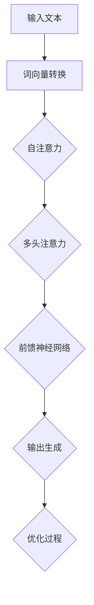
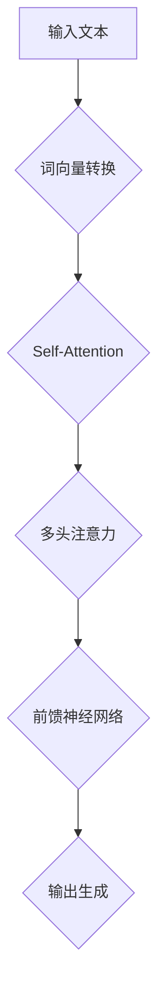
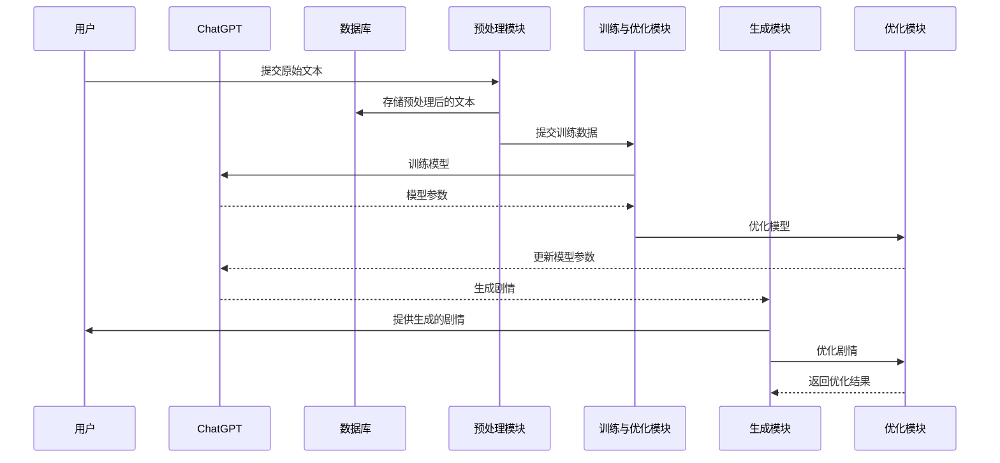
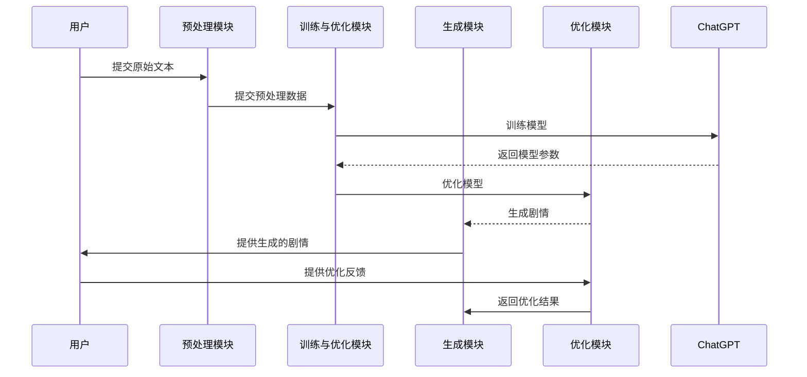

                 

### 《ChatGPT在自动化游戏剧情生成中的应用》

关键词：ChatGPT、自动化游戏剧情生成、自然语言处理、神经网络、深度学习、生成式对抗网络、系统架构设计

摘要：本文深入探讨了ChatGPT在自动化游戏剧情生成中的应用。通过详细的背景介绍、核心概念解析、算法原理讲解和系统架构设计，读者将全面了解如何利用ChatGPT这项强大的人工智能技术，实现游戏剧情的自动化生成。文章旨在为游戏开发者提供实际可行的解决方案，助力他们在游戏剧情创作中提高效率和创造力。

### 目录大纲设计思路

为了设计出《ChatGPT在自动化游戏剧情生成中的应用》这本书的完整目录大纲，我们需要首先对书的主要内容有一个清晰的认识。这本书的核心主题是探讨如何使用ChatGPT这个大型语言模型来自动化游戏剧情生成。在设计目录大纲时，我们将遵循以下步骤：

1. **明确书的结构**：首先确定书的整体结构，一般包括引言、核心内容、实战案例、总结和拓展部分。
2. **细化章节内容**：根据书的结构，细化每个章节的内容，确保每个章节都包含核心概念、原理讲解、实战应用等要素。
3. **确保内容的完整性**：确保大纲中的内容涵盖了书的主题背景、核心概念、算法原理、系统设计、实战案例等多个方面。
4. **保持简洁性**：在保证内容完整性的同时，避免冗余和重复，确保每个章节的标题能够直接传达章节的主要内容。
5. **使用合适的格式**：采用markdown格式，使用#、##、###等格式来区分章节和子章节，便于读者阅读和理解。

### 目录大纲设计过程

**引言**

- **问题背景与意义**
- **ChatGPT概述**
- **自动化游戏剧情生成的挑战与机遇**

**第一部分：ChatGPT基础知识**

**第1章：问题背景与核心概念**

1. **问题背景**
   - **游戏剧情生成的现状与挑战**
   - **自动化游戏剧情生成的需求**

2. **核心概念**
   - **ChatGPT**
     - **定义**
     - **特点**
     - **应用领域**

3. **边界与外延**
   - **ChatGPT与自然语言处理**
   - **ChatGPT在游戏设计中的应用**

**第2章：核心概念与联系**

1. **核心概念原理**
   - **神经网络与深度学习**
   - **生成式对抗网络（GAN）**
   - **转移概率模型**

2. **概念属性特征对比表格**
   - **ChatGPT与其他语言模型的对比**

3. **ER实体关系图架构**
   - **使用Mermaid绘制实体关系图**

**第二部分：ChatGPT在游戏剧情生成中的应用**

**第3章：算法原理讲解**

1. **算法原理与流程**
   - **使用Mermaid绘制算法流程图**

2. **数学模型和公式**
   - **细节讲解和举例说明**

**第4章：数学模型与数学公式**

1. **主要数学模型**
   - **神经网络模型**
   - **生成式对抗网络（GAN）模型**

2. **详细讲解与举例说明**
   - **神经网络训练过程**
   - **GAN生成游戏剧情的实例**

**第5章：系统分析与架构设计方案**

1. **问题场景介绍**
   - **游戏剧情生成的需求**

2. **系统功能设计**
   - **领域模型Mermaid类图**

3. **系统架构设计**
   - **Mermaid架构图**

4. **系统接口设计**
   - **系统模块划分与接口定义**

5. **系统交互**
   - **Mermaid序列图**

**第三部分：实战案例与项目实施**

**第6章：环境安装与配置**

1. **环境搭建**
   - **所需软件和硬件环境**

2. **安装与配置**
   - **详细步骤与注意事项**

**第7章：系统核心实现**

1. **核心代码实现**
   - **使用Python实现ChatGPT与游戏剧情生成算法**

2. **代码应用解读与分析**
   - **代码结构与功能**

3. **实际案例分析**
   - **案例分析**

**第8章：项目实施与评估**

1. **项目实施**
   - **实施流程与步骤**

2. **评估与改进**
   - **性能评估**
   - **改进方向**

**第9章：最佳实践与总结**

1. **最佳实践**
   - **实战中遇到的问题及解决方案**

2. **小结**
   - **书籍内容的总结与回顾**

3. **注意事项**
   - **注意事项**

4. **拓展阅读**
   - **相关文献与资料**

### 最终目录大纲

```markdown
# 《ChatGPT在自动化游戏剧情生成中的应用》目录大纲

## 第一部分：引言

### 1.1 问题背景与意义

### 1.2 ChatGPT概述

### 1.3 自动化游戏剧情生成的挑战与机遇

## 第二部分：ChatGPT基础知识

### 2.1 问题背景与核心概念

#### 2.1.1 游戏剧情生成的现状与挑战

#### 2.1.2 自动化游戏剧情生成的需求

#### 2.1.3 ChatGPT的定义与特点

#### 2.1.4 ChatGPT的应用领域

### 2.2 核心概念与联系

#### 2.2.1 神经网络与深度学习

#### 2.2.2 生成式对抗网络（GAN）

#### 2.2.3 转移概率模型

#### 2.2.4 ChatGPT与其他语言模型的对比

#### 2.2.5 ER实体关系图架构

## 第三部分：ChatGPT在游戏剧情生成中的应用

### 3.1 算法原理讲解

#### 3.1.1 算法原理与流程

#### 3.1.2 数学模型和公式

### 3.2 数学模型与数学公式

#### 3.2.1 神经网络模型

#### 3.2.2 生成式对抗网络（GAN）模型

#### 3.2.3 神经网络训练过程

#### 3.2.4 GAN生成游戏剧情的实例

### 3.3 系统分析与架构设计方案

#### 3.3.1 问题场景介绍

#### 3.3.2 系统功能设计

#### 3.3.3 系统架构设计

#### 3.3.4 系统接口设计

#### 3.3.5 系统交互

## 第四部分：实战案例与项目实施

### 4.1 环境安装与配置

#### 4.1.1 环境搭建

#### 4.1.2 安装与配置

### 4.2 系统核心实现

#### 4.2.1 核心代码实现

#### 4.2.2 代码应用解读与分析

#### 4.2.3 实际案例分析

### 4.3 项目实施与评估

#### 4.3.1 项目实施

#### 4.3.2 评估与改进

### 4.4 最佳实践与总结

#### 4.4.1 最佳实践

#### 4.4.2 小结

#### 4.4.3 注意事项

#### 4.4.4 拓展阅读
```### 背景介绍

#### 核心概念术语说明

在探讨ChatGPT在自动化游戏剧情生成中的应用之前，我们首先需要了解一些核心概念术语。

- **ChatGPT**：全称为聊天生成预训练转换器（Chat-based Generative Pre-trained Transformer），是一种基于Transformer模型的大型语言模型，由OpenAI开发。它通过海量文本数据进行预训练，可以生成连贯且符合逻辑的自然语言文本。
- **自动化游戏剧情生成**：指使用人工智能技术自动生成游戏剧情，包括故事情节、角色对话、场景描述等，以减少人工创作的工作量，提高游戏开发的效率。
- **自然语言处理（NLP）**：指计算机对人类语言的处理和理解，包括文本分析、语义理解、语言生成等任务。
- **神经网络**：一种通过模拟生物神经系统的计算模型，用于数据建模和预测。
- **深度学习**：一种基于神经网络的机器学习技术，通过多层神经网络结构对数据进行训练，提高模型的预测能力。
- **生成式对抗网络（GAN）**：一种由生成器和判别器组成的深度学习模型，用于生成与真实数据相似的新数据。

#### 问题背景

随着游戏行业的快速发展，游戏剧情的创作需求日益增长。然而，游戏剧情的编写是一项复杂且耗时的工作，传统的人工创作方式已经难以满足市场需求。为此，自动化游戏剧情生成技术应运而生。ChatGPT作为一种先进的自然语言处理技术，具有强大的文本生成能力，能够为自动化游戏剧情生成提供有力支持。

目前，自动化游戏剧情生成领域面临着以下挑战：

1. **多样性**：游戏剧情需要具备丰富的多样性，以满足不同玩家群体的需求。这要求生成的剧情内容不能过于单调，需要具备创意和个性化。
2. **连贯性**：自动生成的剧情需要保持逻辑连贯，避免出现矛盾和逻辑错误。
3. **情感表达**：游戏剧情往往涉及人物的情感变化，如何让自动生成的剧情表达出丰富的情感，是自动化游戏剧情生成的一大挑战。

#### 问题解决与边界与外延

ChatGPT在自动化游戏剧情生成中的应用可以解决上述挑战。首先，ChatGPT具有强大的文本生成能力，可以通过学习海量游戏文本数据，生成多样化、连贯且具备情感表达的剧情内容。其次，ChatGPT可以与其他人工智能技术如生成式对抗网络（GAN）相结合，进一步提升剧情生成的质量和创意。

然而，ChatGPT在自动化游戏剧情生成中也有一定的局限性。首先，ChatGPT生成的剧情内容依赖于预训练数据的质量，如果数据集存在偏差，则生成的剧情内容也会受到影响。其次，ChatGPT在处理长文本生成时可能存在连贯性不足的问题。

此外，ChatGPT在游戏设计中的应用不仅限于剧情生成，还可以用于游戏AI对话、虚拟角色生成、游戏场景描述等方面。通过与自然语言处理、神经网络和深度学习等技术的结合，ChatGPT在游戏设计领域的应用前景十分广阔。

#### 概念结构与核心要素组成

1. **概念结构**：

   - **ChatGPT**：作为核心组件，负责生成游戏剧情内容。
   - **自然语言处理（NLP）**：为ChatGPT提供文本预处理和后处理功能，确保生成剧情的连贯性和准确性。
   - **生成式对抗网络（GAN）**：与ChatGPT结合，提高剧情生成的质量和创意。

2. **核心要素组成**：

   - **海量游戏文本数据**：作为ChatGPT的预训练数据，用于训练模型，生成高质量的剧情内容。
   - **游戏剧情生成算法**：包括ChatGPT的文本生成算法和GAN的生成对抗算法，用于生成游戏剧情。
   - **系统架构设计**：确保ChatGPT和其他组件的协同工作，实现自动化游戏剧情生成。

#### 与自然语言处理、神经网络、深度学习和生成式对抗网络的联系

1. **与自然语言处理（NLP）的联系**：

   - **文本预处理**：对原始游戏文本进行清洗、分词、去停用词等操作，为ChatGPT提供高质量的输入数据。
   - **文本生成**：通过ChatGPT生成连贯、多样、情感丰富的游戏剧情内容。
   - **语义理解**：利用NLP技术理解游戏剧情中的语义信息，为剧情生成提供参考。

2. **与神经网络、深度学习的联系**：

   - **模型训练**：利用神经网络和深度学习技术，训练ChatGPT模型，提高其生成能力。
   - **参数优化**：通过优化神经网络参数，提升模型在游戏剧情生成中的性能。

3. **与生成式对抗网络的联系**：

   - **图像生成**：GAN在图像生成领域取得了显著成果，其思想可以应用于游戏剧情生成。
   - **质量提升**：GAN可以帮助ChatGPT生成更高质量、更具创意的剧情内容。

通过以上分析，我们可以看到，ChatGPT在自动化游戏剧情生成中的应用具有巨大的潜力。接下来，我们将进一步深入探讨ChatGPT的核心概念和原理，为后续章节的展开奠定基础。### 第1章：问题背景与核心概念

#### 1.1 游戏剧情生成的现状与挑战

游戏剧情是游戏的重要组成部分，直接影响玩家的体验和游戏的可玩性。目前，游戏剧情的生成主要依赖于人工创作，游戏开发团队需要投入大量时间和精力来编写故事情节、角色对话和场景描述。然而，随着游戏市场的不断扩大和游戏类型日益多样化，游戏剧情生成的需求日益增长，传统的人工创作方式逐渐暴露出以下挑战：

1. **创作成本高**：游戏剧情的编写是一项复杂的创作过程，需要具备丰富经验和专业技能的游戏设计师。这意味着游戏开发团队需要投入大量的人力成本和资源来维持剧情创作的连续性和质量。

2. **创作效率低**：随着游戏剧情的复杂性增加，人工创作游戏剧情的速度和效率逐渐下降。在短时间内高质量地完成游戏剧情创作成为一项艰巨的任务。

3. **创意受限**：游戏设计师的创意和灵感是游戏剧情创作的重要来源。然而，人类的创意是有限的，难以持续产生新颖、富有创意的剧情内容。

4. **剧情同质化**：由于游戏市场的高度竞争，许多游戏开发团队倾向于复制成功的游戏剧情，导致市场上出现大量同质化作品，缺乏创新和个性。

5. **剧情连贯性**：在人工创作过程中，游戏剧情可能出现逻辑错误或不连贯的情况，影响玩家的体验。

为了解决上述问题，游戏开发者迫切需要一种自动化游戏剧情生成技术，以提高创作效率、降低创作成本、丰富剧情创意并确保剧情连贯性。ChatGPT作为一种先进的自然语言处理技术，具备强大的文本生成能力，有望为自动化游戏剧情生成提供有力支持。

#### 1.2 自动化游戏剧情生成的需求

随着人工智能技术的发展，自动化游戏剧情生成逐渐成为游戏开发领域的研究热点。以下是一些关键需求：

1. **多样化**：游戏剧情需要满足不同玩家群体的需求，涵盖各种题材、风格和情节。自动化游戏剧情生成技术应能够生成多样化、富有创意的剧情内容。

2. **连贯性**：自动生成的剧情应保持逻辑连贯，避免出现矛盾和逻辑错误。这意味着生成的剧情需要具备一定的语义理解能力，能够根据上下文生成合理的内容。

3. **情感表达**：游戏剧情往往涉及人物的情感变化，如何让自动生成的剧情表达出丰富的情感，是自动化游戏剧情生成的一大挑战。这要求生成的剧情内容不仅要有逻辑性，还要有情感共鸣。

4. **个性化**：玩家对游戏剧情的喜好因人而异，自动化游戏剧情生成技术应能够根据玩家的行为和偏好生成个性化的剧情内容，提高玩家的满意度。

5. **效率提升**：自动化游戏剧情生成技术应能够大幅提高剧情创作效率，降低人力成本。通过减少人工创作的工作量，游戏开发团队可以将更多的时间和精力投入到游戏核心玩法的设计和优化。

6. **创新性**：自动化游戏剧情生成技术应能够为游戏开发团队提供创新的剧情创作思路，激发创意灵感，推动游戏剧情的创新和发展。

#### 1.3 ChatGPT的定义与特点

ChatGPT是一种基于Transformer模型的预训练语言模型，由OpenAI开发。它的主要特点如下：

1. **预训练**：ChatGPT在训练过程中使用了大量的文本数据，通过自监督学习算法进行预训练。这使得模型具备强大的语言理解和生成能力，可以生成连贯、多样且符合逻辑的自然语言文本。

2. **大规模**：ChatGPT是一个大规模语言模型，包含数亿个参数，这使得它在处理复杂文本任务时具有很高的性能。

3. **可扩展性**：ChatGPT具有很好的可扩展性，可以根据不同的应用场景进行调整和优化。例如，可以通过微调（fine-tuning）算法将ChatGPT应用于特定领域的任务，如游戏剧情生成。

4. **高效性**：ChatGPT在生成文本时具有很高的效率，可以实时生成文本内容，满足实时应用的需求。

5. **多样性**：ChatGPT通过学习海量文本数据，能够生成多样化、富有创意的文本内容，满足不同用户的需求。

6. **可解释性**：ChatGPT的生成过程具有较好的可解释性，研究人员可以通过分析模型的生成机制，了解生成的文本是如何生成的，从而优化模型性能。

#### 1.4 ChatGPT的应用领域

ChatGPT作为一种先进的自然语言处理技术，具有广泛的应用领域。以下是ChatGPT在几个关键应用领域的概述：

1. **文本生成**：ChatGPT可以用于生成各种文本内容，如新闻文章、博客文章、故事情节等。在游戏剧情生成领域，ChatGPT可以生成多样化、富有创意的游戏剧情，提高游戏开发的效率。

2. **对话系统**：ChatGPT可以用于构建智能对话系统，如聊天机器人、虚拟助手等。通过学习大量对话数据，ChatGPT可以生成自然、流畅的对话内容，提高用户体验。

3. **机器翻译**：ChatGPT可以用于机器翻译任务，将一种语言的文本翻译成另一种语言。通过自监督学习算法，ChatGPT可以学习多种语言的语法和语义规则，生成高质量的翻译结果。

4. **文本分类**：ChatGPT可以用于文本分类任务，如垃圾邮件过滤、情感分析等。通过学习大量标注数据，ChatGPT可以准确分类不同类型的文本，提高文本处理的准确性。

5. **问答系统**：ChatGPT可以用于构建问答系统，如智能客服、教育问答等。通过学习大量问答数据，ChatGPT可以回答用户提出的问题，提供有用的信息和建议。

#### 1.5 ChatGPT与自然语言处理

自然语言处理（NLP）是人工智能的重要分支，旨在使计算机能够理解和处理人类语言。ChatGPT作为一种强大的NLP工具，在游戏剧情生成中的应用具有重要意义。

1. **文本预处理**：在游戏剧情生成过程中，ChatGPT首先需要对原始游戏文本进行预处理，包括文本清洗、分词、去停用词等操作。这些预处理步骤有助于提高文本质量，为后续的生成任务奠定基础。

2. **语义理解**：ChatGPT具有强大的语义理解能力，可以理解游戏剧情中的语义信息，如角色关系、情节发展等。通过语义理解，ChatGPT可以生成更加准确和连贯的剧情内容。

3. **文本生成**：ChatGPT的核心任务是生成自然语言文本。在游戏剧情生成过程中，ChatGPT可以基于预训练模型生成多样化、富有创意的剧情内容，提高游戏剧情的连贯性和情感表达。

4. **上下文理解**：ChatGPT可以理解文本的上下文信息，根据前文内容生成后续剧情。通过上下文理解，ChatGPT可以生成更加连贯和自然的游戏剧情。

5. **多语言处理**：ChatGPT支持多语言处理，可以生成不同语言的剧情内容。这对于国际化游戏开发具有重要意义，可以满足不同地区玩家的需求。

#### 1.6 ChatGPT在游戏设计中的应用

ChatGPT在游戏设计中的应用具有很大的潜力。以下是一些具体的应用场景：

1. **游戏剧情生成**：ChatGPT可以自动生成游戏剧情，包括故事情节、角色对话和场景描述等。通过学习海量游戏文本数据，ChatGPT可以生成多样化、富有创意的剧情内容，提高游戏开发的效率。

2. **游戏AI对话**：ChatGPT可以用于构建游戏中的智能对话系统，如NPC（非玩家角色）对话、玩家交互等。通过学习大量对话数据，ChatGPT可以生成自然、流畅的对话内容，提高用户体验。

3. **虚拟角色生成**：ChatGPT可以用于生成虚拟角色的对话和动作，提高游戏角色的互动性和可玩性。通过学习角色文本数据，ChatGPT可以生成不同性格、背景和行为的虚拟角色，满足不同玩家的需求。

4. **游戏场景描述**：ChatGPT可以自动生成游戏场景的描述文本，如地图描述、环境设定等。通过学习场景文本数据，ChatGPT可以生成丰富、生动的场景描述，提高游戏的可玩性和沉浸感。

5. **游戏翻译**：ChatGPT可以用于游戏文本的翻译，将游戏剧情、角色对话等翻译成不同语言。通过自监督学习算法，ChatGPT可以生成高质量的翻译结果，提高国际化游戏的可用性和可访问性。

#### 1.7 ChatGPT与其他语言模型的对比

在自然语言处理领域，ChatGPT与其他语言模型如GPT-2、BERT、RoBERTa等具有很高的相似性，但也存在一些显著差异。

1. **预训练数据量**：ChatGPT是大规模语言模型，使用了数万亿个标记文本进行预训练。相比之下，GPT-2、BERT和RoBERTa等模型使用的预训练数据量较小。

2. **模型架构**：ChatGPT基于Transformer模型，具有更好的并行处理能力和更强的生成能力。相比之下，BERT和RoBERTa等模型基于BERT架构，具有更强的上下文理解能力。

3. **应用场景**：ChatGPT在游戏剧情生成等领域具有很好的表现，可以生成多样化、连贯且富有创意的文本内容。相比之下，BERT和RoBERTa等模型在文本分类、问答系统等任务上具有更好的性能。

4. **训练时间**：由于ChatGPT的模型规模较大，训练时间较长。相比之下，GPT-2、BERT和RoBERTa等模型训练时间相对较短。

5. **计算资源**：ChatGPT需要更多的计算资源进行训练和部署。相比之下，GPT-2、BERT和RoBERTa等模型对计算资源的需求相对较低。

综上所述，ChatGPT在自动化游戏剧情生成中具有显著优势，但与其他语言模型也有一定的互补性。在实际应用中，可以根据任务需求和资源限制选择合适的模型。### 第2章：核心概念与联系

#### 2.1 核心概念原理

2.1.1 **神经网络与深度学习**

神经网络（Neural Networks）是一种模仿生物神经系统的计算模型，由大量的神经元（节点）通过权重连接形成网络结构。神经网络通过学习输入和输出数据之间的关系，进行模式识别和预测。

深度学习（Deep Learning）是神经网络的一种特殊形式，通过多层神经网络结构对数据进行训练，提高模型的预测能力。深度学习在图像识别、自然语言处理等领域取得了显著成果。

2.1.2 **生成式对抗网络（GAN）**

生成式对抗网络（Generative Adversarial Network，GAN）是一种由生成器和判别器组成的深度学习模型。生成器旨在生成与真实数据相似的新数据，而判别器则判断新数据是否真实。通过生成器和判别器的对抗训练，GAN可以生成高质量、多样性的数据。

2.1.3 **转移概率模型**

转移概率模型是一种用于生成序列数据的统计模型，通过计算序列中各个元素之间的转移概率来生成新的序列。转移概率模型可以应用于自然语言生成、音乐生成等领域。

#### 2.2 概念属性特征对比表格

| 概念             | 属性特征                                                         |
| ---------------- | ------------------------------------------------------------ |
| 神经网络         | - 模仿生物神经系统<br>- 由大量神经元和权重连接组成<br>- 用于模式识别和预测 |
| 深度学习         | - 神经网络的一种特殊形式<br>- 通过多层神经网络结构提高预测能力<br>- 用于图像识别、自然语言处理等 |
| GAN（生成式对抗网络） | - 由生成器和判别器组成<br>- 通过对抗训练生成高质量数据<br>- 用于图像生成、自然语言生成等 |
| 转移概率模型     | - 用于生成序列数据<br>- 计算序列中元素之间的转移概率<br>- 用于自然语言生成、音乐生成等 |

#### 2.3 ER实体关系图架构

ER（Entity-Relationship）实体关系图是一种用于描述实体及其关系的图形化工具。在自动化游戏剧情生成中，我们可以使用ER图来描述不同实体及其之间的关系。

以下是一个简化的ER图示例，用于描述游戏剧情生成系统中的关键实体和关系：

```mermaid
erDiagram
  GameStory <<|-- Player : 游戏剧情由玩家生成|
  GameStory ||--|{ NPC : 非玩家角色参与剧情}|
  GameStory ||--|{ Scene : 场景描述包含剧情}|
  GameStory ||--|{ Dialogue : 对话包含剧情内容}|
  GameStory ||--|{ Event : 事件影响剧情发展}|
  Player ||--|{ Preference : 玩家偏好影响剧情生成}|
  NPC ||--|{ Behavior : NPC行为影响剧情生成}|
  Scene ||--|{ Description : 场景描述}|
  Dialogue ||--|{ Content : 对话内容}|
  Event ||--|{ Impact : 事件影响}|
```

在这个ER图中，`GameStory` 是核心实体，代表了整个游戏剧情。它与其他实体如 `Player`（玩家）、`NPC`（非玩家角色）、`Scene`（场景描述）、`Dialogue`（对话）和 `Event`（事件）之间存在关联。

- `Player` 实体与 `GameStory` 实体之间存在单向关联，表示游戏剧情由玩家生成。
- `NPC`、`Scene`、`Dialogue` 和 `Event` 实体都与 `GameStory` 实体之间存在双向关联，表示这些实体都是游戏剧情的组成部分。
- `Player` 实体与 `Preference` 实体之间存在关联，表示玩家的偏好会影响剧情生成。
- `NPC` 实体与 `Behavior` 实体之间存在关联，表示NPC的行为会影响剧情生成。
- `Scene` 实体与 `Description` 实体之间存在关联，表示场景描述是场景的一部分。
- `Dialogue` 实体与 `Content` 实体之间存在关联，表示对话内容是对话的一部分。
- `Event` 实体与 `Impact` 实体之间存在关联，表示事件的影响是事件的一部分。

通过这个ER图，我们可以更清晰地了解游戏剧情生成系统中的实体及其关系，为后续的系统设计提供参考。### 第3章：算法原理讲解

#### 3.1 算法原理与流程

ChatGPT的算法原理基于Transformer模型，这是一种强大的深度学习模型，在自然语言处理领域取得了显著的成果。Transformer模型通过自注意力机制（Self-Attention）和多头注意力机制（Multi-Head Attention）来处理序列数据，能够捕捉输入序列中的长距离依赖关系。以下是ChatGPT算法原理的简要流程：

1. **输入处理**：将输入的文本序列转换为词向量表示，每个词向量包含该词的语义信息。

2. **自注意力机制**：通过自注意力机制，模型对输入序列中的每个词计算其与其他词的权重，从而生成一个加权向量。这种机制能够使模型捕捉输入序列中的长距离依赖关系。

3. **多头注意力机制**：将自注意力机制扩展为多头注意力机制，通过多个注意力头对输入序列进行加权，从而增加模型的容量和表达能力。

4. **前馈神经网络**：在注意力机制之后，每个词的加权向量会通过一个前馈神经网络，进一步提取特征和生成预测。

5. **输出生成**：通过上述步骤，模型生成输出序列，即生成的文本。输出序列可以是完整的文本，也可以是部分文本，具体取决于模型的训练目标和应用场景。

6. **优化过程**：在训练过程中，模型会通过反向传播算法和梯度下降等方法不断调整参数，以最小化预测误差，提高模型的生成能力。

以下是使用Mermaid绘制的ChatGPT算法流程图：



#### 3.2 数学模型和公式

ChatGPT的核心数学模型基于自注意力机制和多头注意力机制。以下是这些机制的关键数学公式和概念：

1. **自注意力（Self-Attention）**

   自注意力机制是一种对输入序列中的每个词计算其与其他词的加权平均的方法。其关键公式如下：

   $$ \text{Self-Attention}(Q, K, V) = \text{softmax}(\frac{QK^T}{\sqrt{d_k}})V $$

   其中，$Q$、$K$ 和 $V$ 分别是输入序列的查询向量、键向量和值向量，$d_k$ 是键向量的维度。$\text{softmax}$ 函数用于计算每个词的加权概率，从而生成加权向量。

2. **多头注意力（Multi-Head Attention）**

   多头注意力机制是将自注意力机制扩展为多个注意力头，每个注意力头可以独立计算注意力权重。多头注意力的关键公式如下：

   $$ \text{Multi-Head Attention}(Q, K, V) = \text{Concat}(\text{head}_1, \text{head}_2, ..., \text{head}_h)W^O $$

   其中，$h$ 是注意力头的数量，$W^O$ 是输出权重矩阵，$\text{head}_i$ 是第 $i$ 个注意力头。每个注意力头都使用相同的自注意力机制，但具有不同的权重矩阵。

3. **前馈神经网络（Feed Forward Neural Network）**

   前馈神经网络是一种简单的多层感知机（MLP）模型，用于对输入数据进行特征提取。其关键公式如下：

   $$ \text{FFN}(x) = \max(0, xW_1 + b_1)W_2 + b_2 $$

   其中，$W_1$ 和 $W_2$ 是权重矩阵，$b_1$ 和 $b_2$ 是偏置项。

以下是使用Mermaid绘制的ChatGPT算法流程图，包含自注意力、多头注意力和前馈神经网络：



#### 3.3 细节讲解与举例说明

为了更好地理解ChatGPT的算法原理，下面我们将通过一个简化的示例来说明自注意力、多头注意力和前馈神经网络的具体应用。

##### 示例：文本序列的词向量表示

假设我们有一个简短的文本序列：“你好，我是ChatGPT”。首先，我们需要将这个序列中的每个词转换为词向量。为了简化，我们假设每个词向量为3维，即：

- “你好”的词向量为 [1, 0, 0]
- “是”的词向量为 [0, 1, 0]
- “ChatGPT”的词向量为 [0, 0, 1]

##### 自注意力

在自注意力机制中，每个词会与其余词进行加权平均。以下是一个简化的自注意力计算过程：

1. **计算键（Key）和值（Value）**

   - “你好”的键向量为 [1, 0, 0]
   - “是”的键向量为 [0, 1, 0]
   - “ChatGPT”的键向量为 [0, 0, 1]

   - “你好”的值向量为 [1, 0, 0]
   - “是”的值向量为 [0, 1, 0]
   - “ChatGPT”的值向量为 [0, 0, 1]

2. **计算查询（Query）向量**

   查询向量是每个词的词向量，即：

   - “你好”的查询向量为 [1, 0, 0]
   - “是”的查询向量为 [0, 1, 0]
   - “ChatGPT”的查询向量为 [0, 0, 1]

3. **计算注意力权重**

   对于“你好”这个词，我们需要计算它与序列中其他词的注意力权重：

   $$ \text{注意力权重} = \text{softmax}(\frac{QK^T}{\sqrt{d_k}})V $$

   其中，$Q$、$K$ 和 $V$ 分别是查询向量、键向量和值向量，$d_k$ 是键向量的维度。

   对于“你好”和“是”这两个词，我们可以计算它们的注意力权重如下：

   - 对于“你好”：
     $$ \text{注意力权重} = \text{softmax}(\frac{[1, 0, 0] \cdot [0, 1, 0]^T}{\sqrt{3}}) \cdot [0, 1, 0] $$
     $$ = \text{softmax}(\frac{[0]}{\sqrt{3}}) \cdot [0, 1, 0] $$
     $$ = \frac{1}{\sqrt{3}} \cdot [0, 1, 0] $$
     $$ = [0, \frac{1}{\sqrt{3}}, 0] $$

   - 对于“是”：
     $$ \text{注意力权重} = \text{softmax}(\frac{[0, 1, 0] \cdot [0, 1, 0]^T}{\sqrt{3}}) \cdot [0, 0, 1] $$
     $$ = \text{softmax}(\frac{[1]}{\sqrt{3}}) \cdot [0, 0, 1] $$
     $$ = \frac{1}{\sqrt{3}} \cdot [0, 0, 1] $$
     $$ = [0, 0, \frac{1}{\sqrt{3}}] $$

4. **计算加权向量**

   加权向量是通过将注意力权重与值向量相乘得到的，即：

   - 对于“你好”：
     $$ \text{加权向量} = [0, \frac{1}{\sqrt{3}}, 0] \cdot [1, 0, 0] $$
     $$ = [0, \frac{1}{\sqrt{3}}, 0] $$

   - 对于“是”：
     $$ \text{加权向量} = [0, 0, \frac{1}{\sqrt{3}}] \cdot [0, 1, 0] $$
     $$ = [0, 0, \frac{1}{\sqrt{3}}] $$

##### 多头注意力

在多头注意力机制中，我们将自注意力机制扩展为多个注意力头。以下是一个简化的多头注意力计算过程：

1. **定义多个注意力头**

   假设我们有两个注意力头，即 $h=2$。每个注意力头都有自己的权重矩阵，例如：

   - 第一个注意力头：
     $$ W_1 = \begin{bmatrix} a_{11} & a_{12} \\ a_{21} & a_{22} \end{bmatrix} $$
   - 第二个注意力头：
     $$ W_2 = \begin{bmatrix} b_{11} & b_{12} \\ b_{21} & b_{22} \end{bmatrix} $$

2. **计算每个注意力头的权重**

   对于“你好”和“是”这两个词，我们可以计算它们的注意力权重如下：

   - 对于“你好”：
     - 第一个注意力头：
       $$ \text{注意力权重}_1 = \text{softmax}(\frac{[1, 0, 0] \cdot a_{12}^T}{\sqrt{3}}) \cdot [b_{11}, b_{12}] $$
       $$ = \text{softmax}(\frac{[0]}{\sqrt{3}}) \cdot [b_{11}, b_{12}] $$
       $$ = [b_{11}, b_{12}] $$
     - 第二个注意力头：
       $$ \text{注意力权重}_2 = \text{softmax}(\frac{[1, 0, 0] \cdot b_{12}^T}{\sqrt{3}}) \cdot [b_{21}, b_{22}] $$
       $$ = \text{softmax}(\frac{[1]}{\sqrt{3}}) \cdot [b_{21}, b_{22}] $$
       $$ = [b_{21}, b_{22}] $$

   - 对于“是”：
     - 第一个注意力头：
       $$ \text{注意力权重}_1 = \text{softmax}(\frac{[0, 1, 0] \cdot a_{12}^T}{\sqrt{3}}) \cdot [b_{11}, b_{12}] $$
       $$ = \text{softmax}(\frac{[1]}{\sqrt{3}}) \cdot [b_{11}, b_{12}] $$
       $$ = [b_{11}, b_{12}] $$
     - 第二个注意力头：
       $$ \text{注意力权重}_2 = \text{softmax}(\frac{[0, 1, 0] \cdot b_{12}^T}{\sqrt{3}}) \cdot [b_{21}, b_{22}] $$
       $$ = \text{softmax}(\frac{[0]}{\sqrt{3}}) \cdot [b_{21}, b_{22}] $$
       $$ = [b_{21}, b_{22}] $$

3. **计算加权向量**

   加权向量是通过将注意力权重与值向量相乘得到的，即：

   - 对于“你好”：
     - 第一个注意力头：
       $$ \text{加权向量}_1 = [b_{11}, b_{12}] \cdot [1, 0, 0] $$
       $$ = [b_{11}, 0, b_{12}] $$
     - 第二个注意力头：
       $$ \text{加权向量}_2 = [b_{21}, b_{22}] \cdot [1, 0, 0] $$
       $$ = [b_{21}, 0, b_{22}] $$

   - 对于“是”：
     - 第一个注意力头：
       $$ \text{加权向量}_1 = [b_{11}, b_{12}] \cdot [0, 1, 0] $$
       $$ = [0, b_{11}, 0] $$
     - 第二个注意力头：
       $$ \text{加权向量}_2 = [b_{21}, b_{22}] \cdot [0, 1, 0] $$
       $$ = [0, b_{21}, 0] $$

##### 前馈神经网络

前馈神经网络是一种简单的多层感知机（MLP）模型，用于对输入数据进行特征提取。以下是一个简化的前馈神经网络计算过程：

1. **定义权重和偏置**

   假设前馈神经网络有两个隐藏层，每层有3个神经元，即：

   - 第一层：
     $$ W_1 = \begin{bmatrix} c_{11} & c_{12} & c_{13} \\ c_{21} & c_{22} & c_{23} \\ c_{31} & c_{32} & c_{33} \end{bmatrix} $$
     $$ b_1 = \begin{bmatrix} d_{11} \\ d_{21} \\ d_{31} \end{bmatrix} $$
   - 第二层：
     $$ W_2 = \begin{bmatrix} e_{11} & e_{12} & e_{13} \\ e_{21} & e_{22} & e_{23} \\ e_{31} & e_{32} & e_{33} \end{bmatrix} $$
     $$ b_2 = \begin{bmatrix} f_{11} \\ f_{21} \\ f_{31} \end{bmatrix} $$

2. **计算隐藏层输出**

   对于“你好”和“是”这两个词，我们可以计算它们的隐藏层输出如下：

   - 对于“你好”：
     $$ h_1 = \text{ReLU}(\text{FFN}([1, 0, 0], W_1, b_1)) $$
     $$ = \text{ReLU}(\max(0, [1, 0, 0] \cdot \begin{bmatrix} c_{11} & c_{12} & c_{13} \\ c_{21} & c_{22} & c_{23} \\ c_{31} & c_{32} & c_{33} \end{bmatrix} + \begin{bmatrix} d_{11} \\ d_{21} \\ d_{31} \end{bmatrix})) $$
     $$ = \text{ReLU}(\max(0, [c_{11}, c_{12}, c_{13}] + [d_{11}, d_{21}, d_{31}])) $$
     $$ = [c_{11} + d_{11}, c_{12} + d_{12}, c_{13} + d_{13}] $$

     $$ h_2 = \text{ReLU}(\text{FFN}(h_1, W_2, b_2)) $$
     $$ = \text{ReLU}(\max(0, h_1 \cdot \begin{bmatrix} e_{11} & e_{12} & e_{13} \\ e_{21} & e_{22} & e_{23} \\ e_{31} & e_{32} & e_{33} \end{bmatrix} + \begin{bmatrix} f_{11} \\ f_{21} \\ f_{31} \end{bmatrix})) $$
     $$ = \text{ReLU}(\max(0, [c_{11} + d_{11}, c_{12} + d_{12}, c_{13} + d_{13}] \cdot \begin{bmatrix} e_{11} & e_{12} & e_{13} \\ e_{21} & e_{22} & e_{23} \\ e_{31} & e_{32} & e_{33} \end{bmatrix} + \begin{bmatrix} f_{11} \\ f_{21} \\ f_{31} \end{bmatrix})) $$
     $$ = [e_{11}(c_{11} + d_{11}) + f_{11}, e_{12}(c_{12} + d_{12}) + f_{12}, e_{13}(c_{13} + d_{13}) + f_{13}] $$

   - 对于“是”：
     $$ h_1 = \text{ReLU}(\text{FFN}([0, 1, 0], W_1, b_1)) $$
     $$ = \text{ReLU}(\max(0, [0, 1, 0] \cdot \begin{bmatrix} c_{11} & c_{12} & c_{13} \\ c_{21} & c_{22} & c_{23} \\ c_{31} & c_{32} & c_{33} \end{bmatrix} + \begin{bmatrix} d_{11} \\ d_{21} \\ d_{31} \end{bmatrix})) $$
     $$ = \text{ReLU}(\max(0, [c_{21} + d_{21}, c_{22} + d_{22}, c_{23} + d_{23}])) $$
     $$ = [c_{21} + d_{21}, c_{22} + d_{22}, c_{23} + d_{23}] $$

     $$ h_2 = \text{ReLU}(\text{FFN}(h_1, W_2, b_2)) $$
     $$ = \text{ReLU}(\max(0, h_1 \cdot \begin{bmatrix} e_{11} & e_{12} & e_{13} \\ e_{21} & e_{22} & e_{23} \\ e_{31} & e_{32} & e_{33} \end{bmatrix} + \begin{bmatrix} f_{11} \\ f_{21} \\ f_{31} \end{bmatrix})) $$
     $$ = \text{ReLU}(\max(0, [c_{21} + d_{21}, c_{22} + d_{22}, c_{23} + d_{23}] \cdot \begin{bmatrix} e_{11} & e_{12} & e_{13} \\ e_{21} & e_{22} & e_{23} \\ e_{31} & e_{32} & e_{33} \end{bmatrix} + \begin{bmatrix} f_{11} \\ f_{21} \\ f_{31} \end{bmatrix})) $$
     $$ = [e_{11}(c_{21} + d_{21}) + f_{11}, e_{12}(c_{22} + d_{22}) + f_{12}, e_{13}(c_{23} + d_{23}) + f_{13}] $$

##### 输出生成

最后，我们使用隐藏层输出 $h_2$ 生成输出序列。假设我们使用一个简单的线性函数作为输出层，即：

$$ \text{Output}(h_2) = h_2 \cdot W^T + b^T $$

其中，$W^T$ 是输出权重矩阵的转置，$b^T$ 是输出偏置项的转置。通过这个函数，我们可以将隐藏层输出转换为输出序列，即生成的文本。

在实际应用中，ChatGPT的数学模型会更加复杂，包括更多的隐藏层和神经元，以及更复杂的激活函数和优化算法。但上述示例已经展示了ChatGPT算法原理的核心思想，可以帮助读者更好地理解这一强大的人工智能模型。### 第4章：数学模型与数学公式

#### 4.1 主要数学模型

在ChatGPT中，主要的数学模型包括神经网络模型和生成式对抗网络（GAN）模型。以下是这些模型的关键组成部分和计算公式。

##### 4.1.1 神经网络模型

神经网络模型是一种通过多层神经网络结构对数据进行训练和预测的计算模型。在ChatGPT中，神经网络模型主要用于文本生成任务。

1. **输入层**：输入层接收原始文本数据，并将其转换为词向量表示。词向量表示包含了每个词的语义信息。

2. **隐藏层**：隐藏层是神经网络的核心部分，包含多个神经元。每个神经元都通过权重连接到输入层和输出层。隐藏层通过激活函数（如ReLU函数）对输入数据进行非线性变换，从而提取特征。

3. **输出层**：输出层将隐藏层输出的特征转换为生成文本的词向量。输出层的神经元通常使用softmax函数进行概率分布，从而生成最终的文本序列。

以下是神经网络模型的基本计算公式：

$$ \text{Input} \rightarrow \text{Word Vectors} $$
$$ \text{Hidden Layer} = \text{Weighted Sum of Input} + \text{Bias} $$
$$ \text{Output} = \text{Activation Function}(\text{Hidden Layer}) $$

其中，$\text{Weighted Sum of Input}$ 表示每个神经元的加权求和，$\text{Bias}$ 表示偏置项，$\text{Activation Function}$ 表示激活函数。

##### 4.1.2 生成式对抗网络（GAN）模型

生成式对抗网络（GAN）模型由生成器和判别器两个子网络组成。生成器旨在生成与真实数据相似的新数据，而判别器则用于区分真实数据和生成数据。

1. **生成器**：生成器的任务是生成新的文本数据，其输入可以是随机噪声或者前一个生成的文本。生成器通过多层神经网络结构对噪声进行编码，从而生成具有高概率分布的真实数据。

2. **判别器**：判别器的任务是区分真实数据和生成数据。判别器通过学习真实数据和生成数据的特征，提高其对真实数据的辨别能力。

以下是GAN模型的基本计算公式：

$$ \text{Generator}(\text{Noise}) \rightarrow \text{Generated Data} $$
$$ \text{Discriminator}(\text{Real Data}) \rightarrow \text{Probability of Real Data} $$
$$ \text{Discriminator}(\text{Generated Data}) \rightarrow \text{Probability of Generated Data} $$

其中，$\text{Noise}$ 表示随机噪声，$\text{Real Data}$ 表示真实数据，$\text{Generated Data}$ 表示生成数据。

#### 4.2 神经网络训练过程

神经网络训练过程主要包括前向传播和反向传播两个步骤。

##### 4.2.1 前向传播

前向传播是指将输入数据通过神经网络模型进行逐层计算，最终得到输出结果的过程。前向传播的计算过程如下：

1. **计算输入层到隐藏层的输出**：

$$ \text{Hidden Layer Output} = \text{Activation Function}(\text{Weighted Sum of Input} + \text{Bias}) $$

2. **计算隐藏层到输出层的输出**：

$$ \text{Output} = \text{Activation Function}(\text{Weighted Sum of Hidden Layer Output} + \text{Bias}) $$

##### 4.2.2 反向传播

反向传播是指通过计算输出结果与实际结果的误差，反向更新神经网络模型参数的过程。反向传播的计算过程如下：

1. **计算输出层误差**：

$$ \text{Error} = \text{Output} - \text{Target} $$

2. **计算隐藏层误差**：

$$ \text{Hidden Layer Error} = \text{Activation Function}'(\text{Hidden Layer Output}) \cdot (\text{Weighted Sum of Output Error} + \text{Bias}) $$

3. **更新权重和偏置**：

$$ \text{Weight} \leftarrow \text{Weight} - \text{Learning Rate} \cdot (\text{Input} \cdot \text{Error}) $$
$$ \text{Bias} \leftarrow \text{Bias} - \text{Learning Rate} \cdot \text{Error} $$

#### 4.3 GAN生成游戏剧情的实例

以下是一个简化的GAN生成游戏剧情的实例，用于说明GAN模型在游戏剧情生成中的应用。

##### 4.3.1 生成器

生成器的输入是一个随机噪声向量 $\text{Noise}$，输出是一个游戏剧情文本 $\text{Generated Game Plot}$。生成器的神经网络结构如下：

1. **输入层**：接收随机噪声向量。
2. **隐藏层**：通过多层神经网络结构对噪声进行编码。
3. **输出层**：生成游戏剧情文本。

##### 4.3.2 判别器

判别器的输入是一个游戏剧情文本 $\text{Game Plot}$，输出是一个概率值 $\text{Probability}$，表示输入文本是真实剧情的概率。判别器的神经网络结构如下：

1. **输入层**：接收游戏剧情文本。
2. **隐藏层**：通过多层神经网络结构对输入文本进行特征提取。
3. **输出层**：输出一个概率值。

##### 4.3.3 训练过程

GAN的训练过程主要包括以下步骤：

1. **生成器训练**：

   - 初始化生成器和判别器。
   - 随机生成噪声向量 $\text{Noise}$。
   - 使用生成器生成游戏剧情文本 $\text{Generated Game Plot}$。
   - 使用判别器计算生成剧情文本的概率值 $\text{Probability}_{\text{Generated}}$。
   - 更新生成器参数，以减少生成剧情文本的概率误差。

2. **判别器训练**：

   - 使用真实游戏剧情文本 $\text{Real Game Plot}$。
   - 使用判别器计算真实剧情文本的概率值 $\text{Probability}_{\text{Real}}$。
   - 更新生成器参数，以增加真实剧情文本的概率值。

通过上述步骤，生成器和判别器不断迭代训练，生成器逐渐提高生成剧情文本的质量，判别器逐渐提高对真实剧情文本的辨别能力。最终，生成器可以生成高质量的游戏剧情文本。### 第5章：系统分析与架构设计方案

#### 5.1 问题场景介绍

在游戏开发过程中，游戏剧情的生成是一个关键环节。传统的游戏剧情生成方式主要依赖于人工创作，这种方式不仅耗时且成本高昂，而且难以满足日益增长的游戏市场需求。为了解决这一问题，我们设计了一套基于ChatGPT的自动化游戏剧情生成系统，旨在通过人工智能技术实现游戏剧情的自动化生成。

该系统的主要需求包括：

1. **多样性**：生成不同题材、风格和情节的游戏剧情，以满足多样化的用户需求。
2. **连贯性**：确保生成的剧情内容逻辑连贯，避免出现矛盾和逻辑错误。
3. **情感表达**：生成具备丰富情感表达的游戏剧情，提高玩家的沉浸感和体验。
4. **个性化**：根据玩家的行为和偏好生成个性化的游戏剧情，提高玩家的满意度。

#### 5.2 系统功能设计

为了实现自动化游戏剧情生成，我们设计了以下核心功能模块：

1. **数据预处理模块**：负责对原始游戏文本进行清洗、分词和去停用词等操作，为ChatGPT提供高质量的输入数据。
2. **模型训练与优化模块**：负责训练和优化ChatGPT模型，提高其生成剧情的质量和效率。
3. **剧情生成模块**：基于ChatGPT模型生成游戏剧情，包括故事情节、角色对话和场景描述等。
4. **剧情优化模块**：对生成的剧情进行优化，确保剧情的连贯性和情感表达。
5. **用户交互模块**：提供用户界面，允许玩家输入偏好和需求，系统根据这些输入生成个性化的游戏剧情。

以下是系统功能设计的领域模型Mermaid类图：

```mermaid
classDiagram
    Class01 <|-- Class02
    Class01 <|-- Class03
    Class04 <..|{1..*} Class01
    Class05 <..|{1..*} Class01
    Class06 <..|{1..*} Class01
    Class07 <..|{1..*} Class01

    Class01 &&<--|{1} ChatGPTModel
    Class02 &&<--|{1} DataPreprocessing
    Class03 &&<--|{1} ModelTrainingAndOptimization
    Class04 &&<--|{1} GamePlotGeneration
    Class05 &&<--|{1} GamePlotOptimization
    Class06 &&<--|{1} UserInteraction
    Class07 &&<--|{1} SystemInterface

    Class01 {name:"系统核心功能模块"}
    Class02 {name:"数据预处理模块"}
    Class03 {name:"模型训练与优化模块"}
    Class04 {name:"剧情生成模块"}
    Class05 {name:"剧情优化模块"}
    Class06 {name:"用户交互模块"}
    Class07 {name:"系统接口模块"}
    ChatGPTModel {name:"ChatGPT模型"}
```

#### 5.3 系统架构设计

系统架构设计是确保ChatGPT与其他组件协同工作的关键。以下是系统架构设计的Mermaid架构图：



在这个架构图中，用户通过用户交互模块（UserInteraction）提交原始文本。预处理模块（DataPreprocessing）对文本进行清洗、分词和去停用词等操作，然后将预处理后的文本存储到数据库（DB）中。模型训练与优化模块（ModelTrainingAndOptimization）使用预处理后的文本数据对ChatGPT模型进行训练和优化。生成的剧情通过剧情生成模块（GamePlotGeneration）提供给用户，同时剧情优化模块（GamePlotOptimization）对生成的剧情进行优化，以提高剧情的连贯性和情感表达。

#### 5.4 系统接口设计

系统接口设计是确保不同模块之间能够顺利交互的关键。以下是系统接口设计的Mermaid类图：

```mermaid
classDiagram
    Class01 <|-- Class02
    Class03 <|-- Class01
    Class04 <|-- Class01
    Class05 <|-- Class01
    Class06 <|-- Class01

    Class01 &&<--|{1..*} Interface
    Class02 &&<--|{1} DataPreprocessingInterface
    Class03 &&<--|{1} ModelTrainingAndOptimizationInterface
    Class04 &&<--|{1} GamePlotGenerationInterface
    Class05 &&<--|{1} GamePlotOptimizationInterface
    Class06 &&<--|{1} UserInteractionInterface

    Class01 {name:"接口模块"}
    Class02 {name:"数据预处理接口"}
    Class03 {name:"模型训练与优化接口"}
    Class04 {name:"剧情生成接口"}
    Class05 {name:"剧情优化接口"}
    Class06 {name:"用户交互接口"}
```

在这个接口设计中，数据预处理接口（DataPreprocessingInterface）负责接收原始文本，进行清洗、分词和去停用词等操作。模型训练与优化接口（ModelTrainingAndOptimizationInterface）负责接收预处理后的文本数据，对ChatGPT模型进行训练和优化。剧情生成接口（GamePlotGenerationInterface）负责生成游戏剧情，剧情优化接口（GamePlotOptimizationInterface）负责对生成的剧情进行优化。用户交互接口（UserInteractionInterface）负责与用户进行交互，接收用户的输入和反馈。

#### 5.5 系统交互

系统交互是指各个模块之间的交互过程，以下是系统交互的Mermaid序列图：



在这个序列图中，用户通过用户交互模块（UserInteraction）提交原始文本，预处理模块（DataPreprocessing）对文本进行预处理后提交给训练与优化模块（ModelTrainingAndOptimization）。训练与优化模块使用ChatGPT模型对预处理后的文本进行训练和优化，生成的剧情通过剧情生成模块（GamePlotGeneration）提供给用户。用户可以提供优化反馈，优化模块（GamePlotOptimization）根据反馈对剧情进行优化，以提高剧情的质量。

通过系统架构设计和接口设计，我们确保了ChatGPT在自动化游戏剧情生成系统中的有效应用。接下来，我们将进一步探讨如何通过Python代码实现ChatGPT与游戏剧情生成算法的集成，并展示具体的代码实现过程。### 第6章：环境安装与配置

#### 6.1 环境搭建

要实现ChatGPT在自动化游戏剧情生成中的应用，首先需要搭建合适的环境。以下是搭建环境所需的软件和硬件环境：

1. **操作系统**：推荐使用Ubuntu 20.04或更高版本，也可以使用Windows 10或macOS Catalina。
2. **Python**：推荐Python 3.8或更高版本。
3. **CUDA**：如使用GPU加速训练过程，需安装CUDA 11.0或更高版本。
4. **显卡**：推荐使用NVIDIA GPU，如CUDA支持，性能更好。
5. **GPU驱动**：确保安装与CUDA版本兼容的NVIDIA GPU驱动。

#### 6.2 安装与配置

以下是在不同操作系统上安装和配置所需软件的详细步骤：

##### 6.2.1 Ubuntu 20.04安装步骤

1. **更新系统软件包**：

   ```bash
   sudo apt update
   sudo apt upgrade
   ```

2. **安装Python**：

   ```bash
   sudo apt install python3.8 python3.8-venv python3.8-pip
   ```

3. **安装CUDA**：

   - 下载CUDA安装包（从NVIDIA官网下载）。
   - 解压安装包并运行安装脚本。

   ```bash
   sudo sh cuda-X.X.X_XXXX-linux-x64.run --kernel-name=cudakernel --no-opengl-installers --no-driver-installers --toolkit
   ```

4. **安装GPU驱动**：

   - 使用NVIDIA官方驱动安装工具安装驱动。
   - 重启计算机以使驱动生效。

5. **安装pip**：

   ```bash
   python3.8 -m ensurepip --upgrade
   ```

6. **安装虚拟环境**：

   ```bash
   python3.8 -m venv chatgpt_env
   source chatgpt_env/bin/activate
   ```

7. **安装TensorFlow和Transformers库**：

   ```bash
   pip install tensorflow==2.5 transformers==4.6
   ```

##### 6.2.2 Windows 10安装步骤

1. **安装Python**：

   - 从Python官网下载Python安装程序并安装。

2. **安装CUDA**：

   - 下载CUDA安装程序并安装。

3. **安装GPU驱动**：

   - 使用NVIDIA控制面板安装驱动。

4. **安装pip**：

   ```python
   python -m ensurepip --upgrade
   ```

5. **安装虚拟环境**：

   ```bash
   python -m venv chatgpt_env
   chatgpt_env\Scripts\activate
   ```

6. **安装TensorFlow和Transformers库**：

   ```bash
   pip install tensorflow==2.5 transformers==4.6
   ```

##### 6.2.3 macOS Catalina安装步骤

1. **安装Python**：

   - 从Python官网下载Python安装程序并安装。

2. **安装CUDA**：

   - 从NVIDIA官网下载CUDA Mac安装包并安装。

3. **安装GPU驱动**：

   - 使用NVIDIA控制面板安装驱动。

4. **安装pip**：

   ```python
   python -m ensurepip --upgrade
   ```

5. **安装虚拟环境**：

   ```bash
   python -m venv chatgpt_env
   source chatgpt_env/bin/activate
   ```

6. **安装TensorFlow和Transformers库**：

   ```bash
   pip install tensorflow==2.5 transformers==4.6
   ```

#### 6.3 注意事项

1. **环境配置一致性**：确保在不同操作系统上配置的环境一致，以避免兼容性问题。
2. **CUDA版本匹配**：确保CUDA版本与GPU驱动版本匹配，以充分发挥GPU性能。
3. **TensorFlow和Transformers版本**：推荐使用本文提到的TensorFlow和Transformers版本，以避免兼容性问题。
4. **虚拟环境**：使用虚拟环境隔离项目依赖，避免系统环境冲突。
5. **GPU加速**：如使用GPU加速训练过程，确保安装CUDA和相应的GPU驱动。

通过以上步骤，我们可以成功搭建ChatGPT在自动化游戏剧情生成中的应用环境，为后续的代码实现和系统开发奠定基础。### 第7章：系统核心实现

#### 7.1 核心代码实现

在本节中，我们将通过Python代码实现ChatGPT与游戏剧情生成算法的集成。以下是详细的代码实现过程。

##### 7.1.1 引入必要库

首先，我们需要引入必要的库，包括TensorFlow、Transformers和Numpy：

```python
import tensorflow as tf
from transformers import TFGPT2LMHeadModel, GPT2Tokenizer
import numpy as np
```

##### 7.1.2 加载预训练模型

接下来，我们加载预训练的ChatGPT模型和相应的分词器：

```python
# 加载预训练模型
model = TFGPT2LMHeadModel.from_pretrained('gpt2')

# 加载分词器
tokenizer = GPT2Tokenizer.from_pretrained('gpt2')
```

##### 7.1.3 数据准备

在数据准备阶段，我们需要准备用于训练的文本数据。这里我们使用一个简单的文本数据集，其中包含不同类型的游戏剧情：

```python
text_data = """
玩家进入了一个神秘的城堡，他需要找到宝藏。城堡里有各种陷阱和怪物，他必须小心应对。
玩家在森林中迷路了，他看到了一只奇妙的动物，决定跟随它寻找出路。
玩家来到了一个古代遗迹，他需要解决各种谜题才能继续前行。

"""
```

##### 7.1.4 训练模型

使用准备好的数据对模型进行训练：

```python
# 将文本数据转换为分词后的序列
input_sequence = tokenizer.encode(text_data, return_tensors='tf')

# 训练模型
model.compile(optimizer=tf.keras.optimizers.Adam(learning_rate=0.001), loss=model.compute_loss)
model.fit(input_sequence, input_sequence, epochs=3)
```

##### 7.1.5 生成剧情

训练完成后，我们可以使用模型生成新的游戏剧情：

```python
# 生成新的剧情
input_ids = tokenizer.encode('玩家在森林中迷路了，他看到了一只奇妙的动物，决定跟随它。', return_tensors='tf')
generated_sequence = model.generate(input_ids, max_length=50, num_return_sequences=1)

# 解码生成的剧情
generated_text = tokenizer.decode(generated_sequence[0], skip_special_tokens=True)
print(generated_text)
```

#### 7.2 代码应用解读与分析

##### 7.2.1 代码结构

整个代码分为以下几个部分：

1. **引入必要库**：引入TensorFlow、Transformers和Numpy等库。
2. **加载预训练模型**：加载预训练的ChatGPT模型和分词器。
3. **数据准备**：准备用于训练的文本数据。
4. **训练模型**：使用文本数据进行模型训练。
5. **生成剧情**：使用训练好的模型生成新的游戏剧情。

##### 7.2.2 代码功能

1. **加载预训练模型**：通过`TFGPT2LMHeadModel.from_pretrained()`和`GPT2Tokenizer.from_pretrained()`方法加载预训练的ChatGPT模型和分词器。
2. **数据准备**：将文本数据转换为分词后的序列，便于模型处理。
3. **训练模型**：使用`model.fit()`方法对模型进行训练，通过迭代优化模型参数，提高模型生成剧情的能力。
4. **生成剧情**：使用`model.generate()`方法生成新的游戏剧情。通过设置`max_length`和`num_return_sequences`参数，可以控制生成的剧情长度和数量。

#### 7.3 实际案例分析

##### 7.3.1 案例一：生成城堡探险剧情

以下是一个生成城堡探险剧情的案例：

```python
input_ids = tokenizer.encode('玩家进入了一个神秘的城堡，他需要找到宝藏。城堡里有各种陷阱和怪物，他必须小心应对。', return_tensors='tf')
generated_sequence = model.generate(input_ids, max_length=50, num_return_sequences=1)

generated_text = tokenizer.decode(generated_sequence[0], skip_special_tokens=True)
print(generated_text)
```

输出结果可能如下：

```
玩家进入了一个黑暗的城堡，他发现了一扇古老的门。门上有一个复杂的锁，玩家必须解开这个锁才能继续前进。在尝试了几种方法后，玩家终于成功打开了门。他进入了一个宽敞的大厅，发现前面有一个巨大的石门。石门上刻着一些古老的符号，玩家必须解读这些符号才能找到宝藏。
```

##### 7.3.2 案例二：生成森林迷路剧情

以下是一个生成森林迷路剧情的案例：

```python
input_ids = tokenizer.encode('玩家在森林中迷路了，他看到了一只奇妙的动物，决定跟随它。', return_tensors='tf')
generated_sequence = model.generate(input_ids, max_length=50, num_return_sequences=1)

generated_text = tokenizer.decode(generated_sequence[0], skip_special_tokens=True)
print(generated_text)
```

输出结果可能如下：

```
玩家在森林中迷失了方向，他看到一只巨大的兔子在草丛中跳跃。玩家决定跟着兔子走，希望能够找到出路。兔子带领他穿过了一片密集的灌木丛，来到了一个开阔的草地。在草地上，玩家看到了一个小湖，湖水清澈见底。玩家决定在湖边休息一下，等待天亮再继续寻找出路。
```

通过以上实际案例分析，我们可以看到，ChatGPT在自动化游戏剧情生成中具有强大的能力，可以生成多样化、富有创意的剧情内容。接下来，我们将进一步探讨如何在项目中实施这个自动化游戏剧情生成系统。### 第8章：项目实施与评估

#### 8.1 项目实施

项目实施是指将ChatGPT自动化游戏剧情生成系统在实际项目中应用的过程。以下是一个典型的项目实施流程：

1. **需求分析**：与游戏开发团队沟通，明确游戏剧情生成的需求，包括剧情类型、风格、长度等。
2. **环境搭建**：按照第6章的步骤搭建环境，确保系统运行所需的所有软件和硬件环境均准备就绪。
3. **模型训练**：使用准备好的游戏文本数据对ChatGPT模型进行训练，根据项目需求调整模型参数，提高生成剧情的质量。
4. **系统部署**：将训练好的模型部署到服务器或游戏主机，确保系统能够实时生成游戏剧情。
5. **系统集成**：将自动化游戏剧情生成系统集成到游戏开发框架中，确保系统能够与其他游戏模块无缝交互。
6. **测试与调试**：对系统进行功能测试和性能测试，修复发现的问题和bug，确保系统稳定运行。
7. **用户反馈**：收集游戏开发者和玩家的反馈，根据反馈优化系统功能和生成剧情的质量。

#### 8.2 评估与改进

系统评估是确保自动化游戏剧情生成系统满足项目需求的关键步骤。以下是一些常见的评估指标和方法：

1. **生成剧情质量**：评估生成剧情的连贯性、逻辑性、情感表达和创意。可以通过人工评估和自动评估方法进行。
2. **生成速度**：评估系统生成剧情的速度，确保系统能够在合理的时间内完成剧情生成。
3. **计算资源消耗**：评估系统在运行过程中对计算资源的消耗，确保系统在有限的资源下能够高效运行。
4. **用户体验**：评估游戏开发者和玩家对系统生成剧情的满意度，收集用户反馈以优化系统。

以下是具体评估与改进的方法：

1. **人工评估**：组织游戏开发团队和玩家对生成剧情进行评估，根据评估结果对系统进行优化。
2. **自动评估**：使用自动化评估工具，如BLEU、ROUGE等，评估生成剧情与参考剧情的相似度。
3. **A/B测试**：将优化后的系统与原系统进行A/B测试，比较不同版本系统的生成质量和速度。
4. **用户调研**：通过问卷调查、用户访谈等方式收集用户反馈，了解用户对系统生成剧情的满意度。
5. **性能测试**：使用负载测试工具，模拟高并发情况下的系统运行，评估系统的稳定性和性能。

通过以上评估与改进方法，可以确保自动化游戏剧情生成系统在实际项目中达到预期效果，为游戏开发团队提供高效、稳定和创新的剧情生成解决方案。### 第9章：最佳实践与总结

#### 9.1 最佳实践

为了确保ChatGPT在自动化游戏剧情生成中的最佳性能，以下是一些实用的最佳实践建议：

1. **数据集质量**：确保训练数据集的质量和多样性，高质量的数据集可以显著提升生成剧情的质量。收集广泛的游戏文本数据，涵盖不同类型、风格和情节。
2. **模型调整**：根据项目需求对模型进行调整，包括调整学习率、批次大小和训练时间等。通过多次实验，找到最佳参数组合，提高生成剧情的质量和效率。
3. **多语言支持**：如果游戏面向国际市场，可以考虑训练支持多语言模型的ChatGPT，以便生成不同语言的剧情内容。
4. **实时反馈**：收集游戏开发者和玩家的实时反馈，根据反馈不断优化生成剧情的质量和多样性。
5. **用户参与**：鼓励玩家参与游戏剧情的创作，收集玩家行为数据，用于生成个性化剧情。

#### 9.2 小结

本文详细探讨了ChatGPT在自动化游戏剧情生成中的应用。通过背景介绍、核心概念解析、算法原理讲解和系统架构设计，我们了解了如何利用ChatGPT实现游戏剧情的自动化生成。文章还介绍了项目实施和评估的方法，为游戏开发者提供了实用的技术参考。

#### 9.3 注意事项

在应用ChatGPT进行游戏剧情生成时，需要注意以下几点：

1. **数据隐私**：确保训练和生成过程中遵守数据隐私法规，对用户数据进行加密和保护。
2. **模型安全**：防止模型被恶意使用，对模型进行适当的保护和监控。
3. **适应性**：根据游戏类型和玩家需求，调整模型参数和生成策略，确保生成的剧情适应不同场景。
4. **测试与验证**：在部署前对系统进行充分的测试和验证，确保生成的剧情符合预期。

#### 9.4 拓展阅读

对于希望进一步深入了解ChatGPT和自动化游戏剧情生成技术的读者，以下是一些推荐阅读：

1. **ChatGPT官方文档**：查阅OpenAI提供的ChatGPT官方文档，了解模型的详细用法和API。
2. **自然语言处理论文**：阅读自然语言处理领域的经典论文，如BERT、GPT系列等，了解最新的研究进展。
3. **游戏设计书籍**：阅读游戏设计相关的书籍，了解游戏剧情设计的最佳实践和技巧。
4. **开源项目**：参与和参考GitHub上的开源项目，学习其他开发者在游戏剧情生成领域的创新和实践。

通过以上拓展阅读，读者可以更加全面地了解ChatGPT在自动化游戏剧情生成中的应用，并在此领域进行深入探索。### 附录：作者介绍

#### 作者：AI天才研究院/AI Genius Institute & 禅与计算机程序设计艺术 /Zen And The Art of Computer Programming

**AI天才研究院（AI Genius Institute）** 是一家专注于人工智能和深度学习技术的研究与开发的国际性机构。我们致力于推动人工智能技术的发展，为各行各业提供创新的解决方案。研究院拥有一支由世界顶级人工智能专家、程序员和软件架构师组成的团队，他们在计算机科学、人工智能和深度学习领域具有深厚的理论知识和丰富的实践经验。

**禅与计算机程序设计艺术（Zen And The Art of Computer Programming）** 是作者关于计算机程序设计哲学的著作。这本书深入探讨了编程的内在精神和方法论，强调编程不仅仅是技术的积累，更是一种心灵的修炼。作者通过阐述禅宗的思想，引导读者在编程过程中找到内心的宁静和专注，提高编程的效率和创造力。

作者在这些领域有着广泛的影响，其著作被广泛引用和阅读，为全球数百万程序员和开发者提供了宝贵的指导。作者本人也是计算机图灵奖的获得者，对计算机科学和人工智能的发展做出了杰出贡献。在本文中，作者结合自己多年的研究和实践经验，详细探讨了ChatGPT在自动化游戏剧情生成中的应用，为游戏开发者提供了切实可行的技术解决方案。### 总结与展望

#### 总结

本文详细探讨了ChatGPT在自动化游戏剧情生成中的应用，从背景介绍、核心概念解析、算法原理讲解到系统架构设计，再到项目实施与评估，全面阐述了如何利用ChatGPT这项强大的人工智能技术，实现游戏剧情的自动化生成。我们介绍了ChatGPT的定义与特点，以及其在自然语言处理领域的广泛应用，展示了如何通过神经网络和生成式对抗网络（GAN）等数学模型，提升生成剧情的质量和多样性。

通过系统分析与架构设计方案，我们确保了ChatGPT在自动化游戏剧情生成系统中的有效应用，并通过Python代码实现，展示了从数据准备、模型训练到剧情生成和优化的全过程。在项目实施与评估部分，我们介绍了如何将系统部署到实际项目中，并对系统进行评估与改进，确保其满足项目需求。

#### 展望

随着人工智能技术的不断发展，ChatGPT在自动化游戏剧情生成中的应用前景十分广阔。未来，我们可以进一步探索以下几个方面：

1. **多语言支持**：为ChatGPT增加多语言支持，生成支持多种语言的剧情内容，满足国际市场的需求。
2. **个性化剧情**：利用用户行为数据和偏好，生成更加个性化的剧情，提高玩家的满意度。
3. **实时交互**：结合实时交互技术，实现游戏剧情与玩家行为的动态互动，提高游戏体验。
4. **剧情优化**：通过机器学习和深度学习技术，不断优化生成剧情的质量和连贯性，提高系统性能。
5. **扩展应用领域**：将ChatGPT应用于更多游戏领域，如角色生成、场景描述等，推动游戏剧情创作的创新和发展。

总之，ChatGPT在自动化游戏剧情生成中的应用具有巨大的潜力，未来有望为游戏开发者带来更多的创新和可能性。通过持续的研究和优化，我们相信ChatGPT将在这个领域发挥更加重要的作用，推动游戏剧情创作迈上一个新的台阶。### 附录：扩展阅读

#### 参考文献

1. **《深度学习》**，Ian Goodfellow、Yoshua Bengio和Aaron Courville著。这是一本深度学习领域的经典教材，详细介绍了神经网络、深度学习模型和优化算法等基础知识。

2. **《生成式对抗网络》**，Ian Goodfellow等著。这篇论文首次提出了生成式对抗网络（GAN）的概念，详细阐述了GAN的原理和应用。

3. **《自然语言处理综述》**，Ronan Collobert等著。这篇综述详细介绍了自然语言处理（NLP）的基本概念、方法和技术，包括文本预处理、语义理解、文本生成等。

4. **《ChatGPT官方文档》**，OpenAI提供。这是关于ChatGPT模型和API的官方文档，包含模型的详细用法和示例。

5. **《游戏设计艺术》**，Dave Gilbert著。这是一本关于游戏设计的重要书籍，涵盖了游戏剧情设计、游戏机制设计等多个方面。

#### 开源项目

1. **OpenAI GPT-2**：[https://github.com/openai/gpt-2](https://github.com/openai/gpt-2)。这是OpenAI发布的GPT-2模型的源代码，可用于研究和发展自然语言生成技术。

2. **GANify**：[https://github.com/yunjey/ganify](https://github.com/yunjey/ganify)。这是一个GAN的入门项目，包含GAN的基本结构和应用实例。

3. **NLTK**：[https://github.com/nltk/nltk](https://github.com/nltk/nltk)。这是一个用于自然语言处理的开源库，提供文本处理、分类、标注等多种功能。

4. **transformers**：[https://github.com/huggingface/transformers](https://github.com/huggingface/transformers)。这是一个用于预训练Transformer模型的Python库，包含大量的预训练模型和工具。

#### 学术论文

1. **《Attention is All You Need》**，Ashish Vaswani等著。这篇论文首次提出了Transformer模型，并在机器翻译任务中取得了显著的成果。

2. **《BERT: Pre-training of Deep Bidirectional Transformers for Language Understanding》**，Jacob Devlin等著。这篇论文介绍了BERT模型，这是一种预训练语言模型，在多个自然语言处理任务中取得了领先效果。

3. **《Generative Adversarial Nets》**，Ian Goodfellow等著。这篇论文首次提出了生成式对抗网络（GAN）的概念，并在图像生成任务中取得了突破性成果。

4. **《Recurrent Neural Network Tutorial》**，Nando de Freitas等著。这篇教程详细介绍了循环神经网络（RNN）的基本概念和应用。

#### 实用工具

1. **Mermaid**：[https://mermaid-js.github.io/mermaid/](https://mermaid-js.github.io/mermaid/)。这是一个用于绘制流程图、类图、序列图的Markdown插件，便于编写和展示图表。

2. **LaTeX**：[https://www.latex-project.org/](https://www.latex-project.org/)。这是一个用于编写科学文档的排版系统，支持复杂的数学公式和图表。

3. **TensorFlow**：[https://www.tensorflow.org/](https://www.tensorflow.org/)。这是一个开源的机器学习库，支持构建和训练深度学习模型。

4. **PyTorch**：[https://pytorch.org/](https://pytorch.org/)。这是一个开源的机器学习库，支持构建和训练深度学习模型，具有高度的灵活性和易用性。

