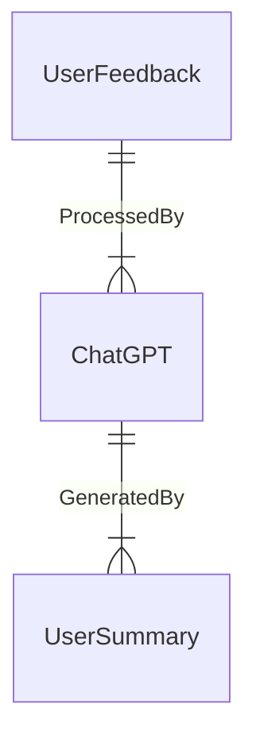

                 

### 文章标题

# ChatGPT在自动化用户反馈总结中的角色

### 关键词

- ChatGPT
- 自动化用户反馈总结
- 自然语言处理
- 预训练语言模型
- 应用案例

### 摘要

本文旨在探讨ChatGPT在自动化用户反馈总结中的角色，分析其在实际应用中的优势和挑战。首先，我们将介绍ChatGPT的基本原理和架构，然后详细分析其在用户反馈总结中的应用场景和优势。接着，通过具体案例展示ChatGPT在自动化用户反馈总结中的实际应用，探讨其面临的挑战和解决方案。最后，总结ChatGPT在自动化用户反馈总结中的最佳实践经验，为相关领域的研究和开发提供参考。

## 背景介绍

### 问题背景

随着人工智能技术的快速发展，自然语言处理（NLP）领域取得了显著的突破。其中，ChatGPT作为一种先进的语言模型，在自动化用户反馈总结方面展现出巨大的潜力。ChatGPT能够通过学习和理解用户对话内容，自动生成准确的反馈和总结，极大地提高了用户反馈处理的效率和准确性。

### 问题描述

本书旨在探讨ChatGPT在自动化用户反馈总结中的角色，分析其在实际应用中的优势和挑战。具体问题包括：ChatGPT如何理解和处理用户反馈？其在自动化用户反馈总结中具有哪些优势？在实际应用中，ChatGPT会遇到哪些挑战？

### 问题解决

本书将从以下几个方面展开讨论：
1. **ChatGPT概述**：介绍ChatGPT的基本原理、架构和关键技术。
2. **自动化用户反馈总结**：分析ChatGPT在用户反馈总结中的应用场景和优势。
3. **应用案例**：通过具体案例展示ChatGPT在自动化用户反馈总结中的实际应用。
4. **挑战与解决方案**：探讨ChatGPT在自动化用户反馈总结中面临的挑战及解决方法。
5. **最佳实践**：总结ChatGPT在自动化用户反馈总结中的最佳实践经验。

### 边界与外延

本书将主要关注ChatGPT在自动化用户反馈总结中的应用，但同时也会探讨其在其他领域的潜在应用。此外，书中还会涉及一些相关技术，如自然语言处理、机器学习和数据分析等。

### 概念结构与核心要素组成

1. **ChatGPT**：一种基于深度学习的语言模型，具有强大的理解和生成能力。
2. **用户反馈总结**：指对用户反馈进行自动化处理，生成简洁、准确的总结。
3. **应用场景**：指ChatGPT在自动化用户反馈总结中的具体应用环境。
4. **优势**：指ChatGPT在自动化用户反馈总结中相对于传统方法的优越性。
5. **挑战**：指ChatGPT在自动化用户反馈总结中面临的技术和实际应用挑战。

## 核心概念与联系

### ChatGPT的核心概念

ChatGPT是一种基于GPT（Generative Pre-trained Transformer）的预训练语言模型。GPT模型通过在大量文本数据上进行预训练，学会了理解并生成自然语言。ChatGPT在此基础上，进一步扩展了模型的能力，使其能够进行实时对话，并生成针对用户问题的回答。

#### 用户反馈总结的概念

用户反馈总结是指通过对用户提供的反馈信息进行自动化处理，提取关键信息并生成简洁、准确的总结。这一过程通常包括数据预处理、文本分析、信息提取和生成总结等步骤。

#### ChatGPT与用户反馈总结的联系

ChatGPT在用户反馈总结中的应用主要体现在以下几个方面：
1. **数据预处理**：ChatGPT可以自动对用户反馈进行分词、去噪等预处理操作，提高后续分析的质量。
2. **文本分析**：ChatGPT可以识别用户反馈中的情感、意图等关键信息，为生成总结提供基础。
3. **信息提取**：ChatGPT可以根据用户反馈内容提取出关键信息，形成摘要。
4. **生成总结**：ChatGPT可以利用预训练的语言生成能力，自动生成简洁、准确的反馈总结。

### 概念属性特征对比表格

| 概念        | 属性特征                           | 对比结果                                                         |
| ----------- | ---------------------------------- | ------------------------------------------------------------ |
| ChatGPT     | 基于GPT的预训练语言模型           | 具有强大的理解和生成能力，能够处理多种自然语言任务               |
| 用户反馈总结 | 自动化处理用户反馈，生成总结       | 提高反馈处理效率，降低人力成本，生成简洁、准确的总结           |
| 应用场景    | 自动化用户反馈总结的场景           | 广泛应用于客服、市场调研、用户反馈处理等领域                   |
| 优势        | 相对于传统方法，具有更高的效率和准确性 | ChatGPT能够快速、准确地处理大量用户反馈，减少人力成本           |
| 挑战        | 技术和实际应用挑战                 | 包括处理复杂对话

### ER实体关系图架构

下面是ChatGPT和用户反馈总结的ER实体关系图：

## ChatGPT概述

### ChatGPT的基本原理

ChatGPT是基于GPT（Generative Pre-trained Transformer）的预训练语言模型。GPT模型由OpenAI提出，采用了一种名为Transformer的深度学习模型架构，通过在大量文本数据上进行预训练，使模型具备了理解并生成自然语言的能力。ChatGPT在GPT的基础上，进一步扩展了模型的能力，使其能够进行实时对话，并生成针对用户问题的回答。

### ChatGPT的架构

ChatGPT的架构主要包括以下几个部分：

1. **输入层**：接收用户输入的文本，如问题或反馈。
2. **编码器**：对输入文本进行编码，将文本转换为模型可以处理的序列数据。
3. **解码器**：根据编码器的输出，生成回复文本。
4. **预训练**：通过在大量文本数据上进行预训练，使模型具备语言理解和生成能力。
5. **微调**：根据特定任务进行微调，以提高模型在特定领域的表现。

### ChatGPT的关键技术

1. **Transformer模型**：Transformer模型是一种基于自注意力机制的深度学习模型，具有并行计算和长距离依赖捕捉能力，是GPT模型的核心。
2. **预训练和微调**：通过预训练使模型具备通用的语言理解能力，通过微调使模型适应特定任务。
3. **生成式模型**：ChatGPT采用生成式模型，可以根据输入文本生成对应的回复文本。

### ChatGPT的应用场景

ChatGPT在自动化用户反馈总结中的应用非常广泛，主要包括以下场景：

1. **客服系统**：利用ChatGPT自动化处理用户咨询，快速生成准确的回复。
2. **市场调研**：自动提取用户反馈中的关键信息，生成调研报告。
3. **用户反馈分析**：对大量用户反馈进行自动化处理，提取共性问题和改进建议。
4. **内容生成**：自动生成文章、报告、邮件等文本内容。

## 自动化用户反馈总结

### 应用场景

ChatGPT在自动化用户反馈总结中的应用场景非常广泛，以下是一些典型的应用场景：

1. **客服系统**：客服系统通常会接收大量的用户反馈，通过ChatGPT可以快速处理这些反馈，生成相应的回复，提高客服效率。
2. **市场调研**：企业在进行市场调研时，会收集大量用户反馈，ChatGPT可以对这些反馈进行自动化处理，生成调研报告。
3. **用户反馈分析**：针对大量用户反馈，ChatGPT可以自动提取关键信息，分析用户需求和市场趋势。
4. **内容生成**：ChatGPT可以自动生成文章、报告、邮件等文本内容，提高内容生产效率。

### 优势

ChatGPT在自动化用户反馈总结中具有以下优势：

1. **高效处理**：ChatGPT可以快速处理大量用户反馈，生成准确的回复和总结，大大提高工作效率。
2. **准确性**：ChatGPT通过对大量文本数据进行预训练，具备较高的语言理解能力，可以准确提取用户反馈中的关键信息。
3. **个性化回复**：ChatGPT可以根据不同的用户反馈生成个性化的回复，提高用户满意度。
4. **降低成本**：通过自动化处理用户反馈，可以降低人力成本，提高运营效率。

### 挑战

尽管ChatGPT在自动化用户反馈总结中具有诸多优势，但在实际应用中也面临一些挑战：

1. **复杂对话处理**：有些用户反馈可能包含复杂的对话内容，ChatGPT需要能够理解并处理这些对话。
2. **情感分析**：用户反馈中可能包含情感信息，ChatGPT需要能够准确分析用户的情感，并生成相应的回复。
3. **隐私保护**：用户反馈中可能包含敏感信息，如何保护用户隐私是一个重要挑战。
4. **语言理解能力**：虽然ChatGPT具备较强的语言理解能力，但在某些特定领域或情境下，其表现可能不尽如人意。

### 解决方案

针对上述挑战，可以采取以下解决方案：

1. **优化模型**：通过不断优化ChatGPT模型，提高其在复杂对话和情感分析方面的能力。
2. **多模态融合**：将文本、语音、图像等多种数据源进行融合，提高ChatGPT的理解能力。
3. **隐私保护技术**：采用数据加密、匿名化等技术，保护用户隐私。
4. **领域适应性**：通过在特定领域进行微调，提高ChatGPT在该领域的表现。

## 应用案例

### 案例一：客服系统

某大型电商平台利用ChatGPT构建了一套自动化客服系统。通过ChatGPT，系统可以快速处理用户咨询，生成个性化的回复。以下是一个具体案例：

- **用户反馈**：用户A在电商平台购买了一款商品，收到后对商品的质量表示不满，希望退货。
- **ChatGPT处理**：ChatGPT根据用户反馈，快速生成以下回复：“非常抱歉听到您对商品的不满，我们理解您的感受。为了保障您的权益，我们可以为您办理退货。请提供您的订单号，我们将尽快为您处理。”
- **用户反馈总结**：该案例中，ChatGPT成功处理了用户A的反馈，并生成了简洁、准确的反馈总结。

### 案例二：市场调研

某知名品牌利用ChatGPT进行市场调研，收集了大量用户反馈。以下是一个具体案例：

- **用户反馈**：用户B在购买该品牌的一款产品后，给出了以下反馈：“这款产品的设计很漂亮，但使用过程中发现有些功能不够人性化。”
- **ChatGPT处理**：ChatGPT根据用户反馈，生成以下调研报告摘要：“用户对产品的设计满意度较高，但功能人性化方面存在一定问题。建议对功能进行优化，以提高用户体验。”
- **用户反馈总结**：ChatGPT成功提取了用户B的关键信息，并生成了简洁、准确的反馈总结。

## 挑战与解决方案

### 复杂对话处理

**挑战**：一些用户反馈可能包含复杂的对话内容，如引用、回复、反驳等。这要求ChatGPT具备较强的理解和生成能力，以处理这些复杂对话。

**解决方案**：
1. **增强对话理解能力**：通过优化模型，提高ChatGPT对复杂对话的理解能力。
2. **多模态融合**：将文本、语音、图像等多种数据源进行融合，提高ChatGPT的整体理解能力。
3. **上下文信息**：充分利用上下文信息，使ChatGPT能够更好地理解对话内容。

### 情感分析

**挑战**：用户反馈中可能包含情感信息，如愤怒、高兴、失望等。准确分析用户的情感对于生成合适的回复至关重要。

**解决方案**：
1. **情感分析模型**：引入情感分析模型，对用户反馈中的情感进行分类和识别。
2. **情感生成**：根据用户反馈中的情感信息，生成相应的情感回复。
3. **用户反馈分类**：将用户反馈根据情感分类，为后续处理提供依据。

### 隐私保护

**挑战**：用户反馈中可能包含敏感信息，如个人隐私、商业机密等。如何保护用户隐私是自动化用户反馈总结中的一个重要挑战。

**解决方案**：
1. **数据加密**：对用户反馈数据进行加密，确保数据在传输和存储过程中的安全性。
2. **匿名化**：对用户反馈进行匿名化处理，消除敏感信息。
3. **隐私保护协议**：制定隐私保护协议，确保用户隐私得到充分保护。

### 语言理解能力

**挑战**：在某些特定领域或情境下，ChatGPT的语言理解能力可能不足，导致生成的回复不准确。

**解决方案**：
1. **领域适应性**：通过在特定领域进行微调，提高ChatGPT在该领域的表现。
2. **多语言支持**：扩展ChatGPT的语言支持，使其能够处理多种语言的用户反馈。
3. **用户反馈标注**：通过用户反馈标注，不断优化ChatGPT的语言理解能力。

## 最佳实践

### 数据准备

1. **数据收集**：收集大量的用户反馈数据，包括文本、语音、图像等多种形式。
2. **数据清洗**：对收集到的用户反馈进行清洗，去除无效信息，提高数据质量。
3. **数据标注**：对用户反馈进行标注，包括情感分类、关键词提取等，为后续模型训练提供基础。

### 模型训练

1. **模型选择**：选择合适的预训练模型，如GPT、BERT等，进行模型训练。
2. **数据预处理**：对用户反馈进行预处理，包括分词、去噪等，提高模型训练效果。
3. **多轮训练**：通过多轮训练，逐步优化模型，提高其在用户反馈总结中的表现。

### 模型部署

1. **部署环境**：搭建适合模型部署的环境，包括计算资源、网络环境等。
2. **接口设计**：设计合适的API接口，方便其他系统调用模型。
3. **性能监控**：实时监控模型性能，确保其稳定运行。

### 持续优化

1. **用户反馈**：收集用户对模型的表现反馈，不断优化模型。
2. **数据更新**：定期更新用户反馈数据，保持模型的新鲜度。
3. **模型迭代**：根据实际应用需求，不断迭代模型，提高其在用户反馈总结中的表现。

## 小结

本文探讨了ChatGPT在自动化用户反馈总结中的角色，分析了其在实际应用中的优势和挑战。通过具体案例展示了ChatGPT在自动化用户反馈总结中的应用效果，并提出了一系列解决方案。未来，随着人工智能技术的不断发展，ChatGPT在自动化用户反馈总结中的应用前景将更加广阔。

## 注意事项

1. **数据安全**：在处理用户反馈时，务必确保数据安全，避免敏感信息泄露。
2. **模型优化**：持续优化模型，提高其在不同领域的表现。
3. **用户反馈**：定期收集用户反馈，了解用户需求和满意度，为模型优化提供依据。

## 拓展阅读

1. **ChatGPT官方文档**：了解ChatGPT的详细使用方法和技巧。
2. **自然语言处理论文**：阅读相关领域的论文，了解最新的研究成果和技术进展。
3. **自动化用户反馈总结案例**：参考其他领域的自动化用户反馈总结案例，借鉴经验。

## 作者信息

作者：AI天才研究院/AI Genius Institute & 禅与计算机程序设计艺术 /Zen And The Art of Computer Programming

