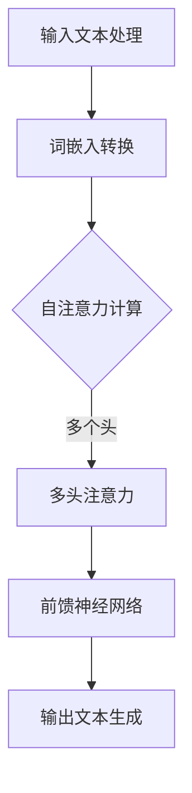
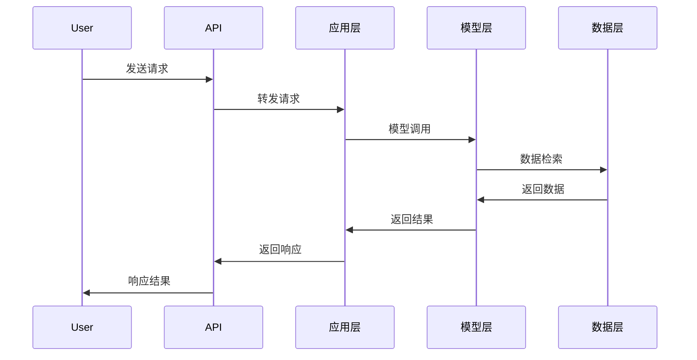
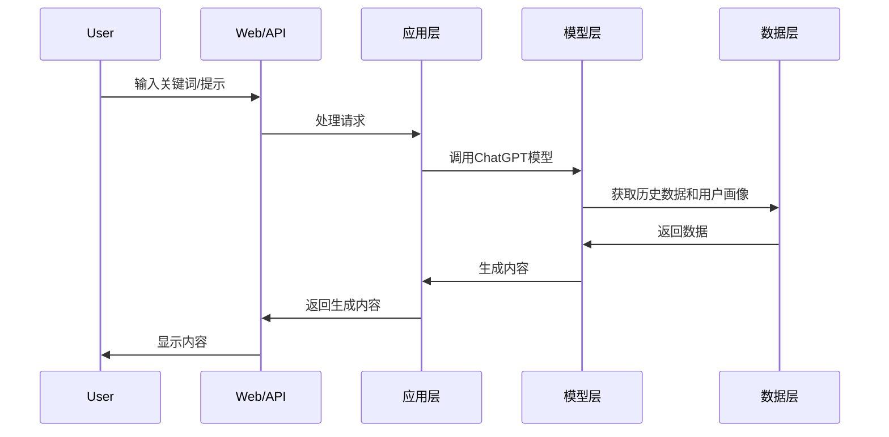

                 

## 《ChatGPT在自动化社交媒体内容生成中的应用》

### 关键词

- ChatGPT
- 社交媒体
- 自动化内容生成
- 自然语言处理
- 语言模型

### 摘要

本文将深入探讨ChatGPT在自动化社交媒体内容生成中的应用。首先，我们将介绍社交媒体内容生成的现状与挑战，以及为何需要自动化内容生成。接着，我们会详细了解ChatGPT的基本概念、发展历程和核心特点。随后，文章将分析ChatGPT在社交媒体内容生成中的潜力，介绍其核心概念、算法原理和数学模型。接下来，我们将通过具体的应用案例展示ChatGPT的实际应用，并设计一个系统架构来实现这一功能。文章最后，将提供最佳实践和注意事项，总结全文并推荐进一步阅读的资源。

---

### 目录大纲设计思路

设计一本关于《ChatGPT在自动化社交媒体内容生成中的应用》的目录大纲，首先要明确书籍的核心内容和目标。这本书旨在帮助读者了解如何利用ChatGPT实现自动化内容生成，并探讨其在社交媒体平台上的应用。以下是具体的步骤：

1. **明确主题与目标**：理解书籍的核心内容是关键，ChatGPT在社交媒体内容生成中的应用是我们关注的焦点。

2. **章节划分**：将书籍分为几个主要部分，如背景介绍、核心概念、应用案例、系统分析与架构设计等，确保每个部分都能清晰地呈现核心内容。

3. **细化章节内容**：在每个章节中，进一步细分内容，确保每个小节都有明确的主题和目标，以便读者能够顺利阅读和学习。

4. **保持格式一致性**：使用统一的markdown格式来编写目录，包括正确的层级结构（#、##、###等）和简洁明了的文字描述。

5. **内容完整性**：确保目录大纲中包含了所有必要的内容，如背景介绍、核心概念讲解、算法原理、系统设计与架构、项目实战等。

6. **简洁性**：避免冗余的废话，确保每个章节和段落都有明确的目的和意义。

### 目录大纲设计

下面是根据以上思路设计的《ChatGPT在自动化社交媒体内容生成中的应用》的目录大纲：

```markdown
# 《ChatGPT在自动化社交媒体内容生成中的应用》目录大纲

## 第1章：背景介绍

### 1.1 问题背景

- 社交媒体内容生成的现状与挑战
- 自动化内容生成的需求

### 1.2 ChatGPT简介

- ChatGPT的定义
- ChatGPT的发展历程
- ChatGPT的核心特点

### 1.3 ChatGPT在社交媒体内容生成中的潜力

- 自动化内容生成的应用场景
- 提高内容生成效率和质量的潜力

## 第2章：核心概念

### 2.1 语言模型基础

- 语言模型的概念
- 语言模型的基本原理

### 2.2 自然语言处理技术

- 词嵌入
- 递归神经网络（RNN）
- 卷积神经网络（CNN）
- 转换器模型（Transformer）

### 2.3 ChatGPT模型详解

- ChatGPT的结构
- ChatGPT的训练过程
- ChatGPT的优势与局限

## 第3章：应用案例

### 3.1 社交媒体内容生成的流程

- 数据收集与预处理
- 内容生成
- 内容发布与优化

### 3.2 ChatGPT在社交媒体内容生成中的实际应用

- 文章写作
- 帖子生成
- 评论生成

### 3.3 案例分析

- 某企业使用ChatGPT自动化内容生成的实践
- 案例总结与启示

## 第4章：算法原理讲解

### 4.1 ChatGPT的算法原理

- Transformer模型的工作原理
- ChatGPT的训练与生成过程

### 4.2 算法mermaid流程图

- ChatGPT算法流程的mermaid图示

### 4.3 Python源代码实现

- 源代码展示
- 代码解读与分析

## 第5章：数学模型和数学公式

### 5.1 语言模型中的数学模型

- 语言模型损失函数
- 优化算法（如梯度下降）

### 5.2 公式详解

- $$y=\sigma(wx+b)$$
- $$J(\theta) = \frac{1}{m}\sum_{i=1}^{m}(h_{\theta}(x^{(i)}) - y^{(i)})^2$$

### 5.3 举例说明

- 如何使用数学模型生成文本

## 第6章：系统分析与架构设计

### 6.1 问题场景介绍

- 社交媒体平台需求分析

### 6.2 系统功能设计

- 领域模型（mermaid类图）

### 6.3 系统架构设计

- 系统架构（mermaid架构图）

### 6.4 系统接口设计

- 接口设计（mermaid序列图）

## 第7章：项目实战

### 7.1 环境安装

- 安装所需软件与工具

### 7.2 系统核心实现

- 源代码展示
- 核心代码解读

### 7.3 代码应用解读与分析

- 如何使用ChatGPT生成社交媒体内容

### 7.4 实际案例分析

- 某社交媒体平台内容生成的实践
- 案例详细讲解与剖析

### 7.5 项目小结

- 经验总结
- 拓展应用建议

## 第8章：最佳实践与注意事项

### 8.1 最佳实践

- 使用ChatGPT进行内容生成的最佳策略
- 避免常见错误

### 8.2 小结

- 书籍内容的回顾与总结

### 8.3 拓展阅读

- 相关领域的最新研究和发展动态
- 推荐的进一步学习资源
```

---

通过这样的目录大纲设计，我们不仅确保了内容的逻辑性和系统性，同时也为读者提供了一个清晰的学习路径，使得他们能够循序渐进地了解并掌握ChatGPT在自动化社交媒体内容生成中的应用。接下来，我们将深入探讨每个章节的具体内容。

---

### 第1章：背景介绍

#### 1.1 问题背景

在当今的数字化时代，社交媒体已经成为信息传播和交流的重要平台。无论是企业品牌宣传、个人博客，还是新闻媒体，内容生成都是其核心环节。然而，随着用户对内容质量和多样性需求的增加，传统的内容生成方式面临着巨大的挑战：

1. **内容创作成本高**：高质量内容的生产往往需要大量的时间和人力投入，特别是在内容数量庞大的情况下。
2. **内容同质化严重**：大量的重复内容降低了用户的阅读体验，同时也降低了品牌影响力。
3. **内容更新频率要求高**：为了吸引和保持用户的关注，内容需要不断更新，这给内容创作者带来了巨大的压力。
4. **内容个性化和多样性需求**：随着社交媒体用户的增加，个性化推荐成为关键，这要求内容能够满足不同用户群体的多样化需求。

#### 1.2 自动化内容生成的需求

为了解决上述问题，自动化内容生成技术应运而生。自动化内容生成的主要目标是利用算法和技术，自动生成高质量、多样化且具有个性化的内容，从而提高内容生成效率和质量。ChatGPT作为一种先进的自然语言处理技术，具有以下优势：

1. **生成内容质量高**：ChatGPT通过深度学习和大规模数据训练，能够生成符合语法规则、逻辑连贯、富有创意性的文本。
2. **生成内容速度快**：与人工创作相比，ChatGPT可以在短时间内生成大量内容，大大提高了内容生成效率。
3. **内容个性化**：ChatGPT能够根据用户的兴趣和行为数据，生成个性化的内容，提高用户的阅读体验和粘性。
4. **多样化内容生成**：ChatGPT不仅能够生成文章、帖子，还可以生成评论、新闻摘要等多种形式的内容。

#### 1.3 ChatGPT简介

ChatGPT是由OpenAI开发的一种基于转换器模型（Transformer）的大型语言模型。它通过预训练和微调技术，能够在多种场景下生成自然语言文本。以下是ChatGPT的基本概念和特点：

1. **定义**：ChatGPT是一种基于转换器模型的自然语言生成模型，它能够接受自然语言输入，并生成相应输出的文本。
2. **发展历程**：ChatGPT是继GPT、GPT-2、GPT-3之后的又一重大进展，它在模型大小、参数数量和生成文本质量上都有显著提升。
3. **核心特点**：
   - **大规模训练**：ChatGPT基于大量互联网文本进行预训练，使其拥有丰富的语言知识和表达能力。
   - **高效率生成**：ChatGPT采用了转换器模型，具有快速生成文本的能力，适合大规模内容生成需求。
   - **多样化应用**：ChatGPT可以应用于各种自然语言处理任务，包括问答系统、文章写作、翻译等。

#### 1.4 ChatGPT在社交媒体内容生成中的潜力

ChatGPT在社交媒体内容生成中具有巨大的潜力，主要体现在以下几个方面：

1. **自动生成文章**：ChatGPT可以自动生成新闻文章、博客文章，帮助媒体和内容创作者快速生成高质量的内容。
2. **自动生成帖子**：ChatGPT可以自动生成社交媒体平台的帖子，包括推文、状态更新等，提高内容更新频率和用户互动。
3. **自动生成评论**：ChatGPT可以自动生成评论，帮助社交媒体平台和电商网站提高用户参与度和互动性。
4. **个性化内容推荐**：ChatGPT可以根据用户行为和兴趣数据，生成个性化的内容推荐，提高用户粘性和满意度。

综上所述，ChatGPT在自动化社交媒体内容生成中具有显著的优势和潜力，能够有效解决当前内容生成面临的挑战。接下来，我们将进一步探讨ChatGPT的核心概念和原理，帮助读者更好地理解这一技术的本质。

---

### 第2章：核心概念

#### 2.1 语言模型基础

语言模型（Language Model）是自然语言处理（Natural Language Processing, NLP）的核心技术之一，其目标是模拟人类语言生成和理解的能力。语言模型的基本原理是通过大量文本数据来学习语言的统计特性，从而预测下一个词语或句子的可能性。

1. **语言模型的概念**：
   - 语言模型是一种数学模型，用于表示自然语言的统计特性。
   - 语言模型可以预测给定前文序列后，下一个词语或句子的概率分布。

2. **语言模型的基本原理**：
   - 基于统计的方法：通过分析大量文本数据，统计词语或短语的共现概率，从而预测下一个词语或句子。
   - 基于生成模型的方法：通过构建概率模型来生成文本，如马尔可夫模型（Markov Model）和转换器模型（Transformer Model）。

3. **语言模型的应用**：
   - 自动完成：在输入文本时，自动预测和补全可能的词语或句子。
   - 语言翻译：将一种语言的文本翻译成另一种语言。
   - 文本生成：根据给定的输入生成新的文本内容。

#### 2.2 自然语言处理技术

自然语言处理技术包括多种算法和模型，用于理解和生成自然语言文本。以下是几种重要的自然语言处理技术：

1. **词嵌入（Word Embedding）**：
   - 词嵌入是将词语映射到高维空间中的向量表示。
   - 词嵌入技术通过捕捉词语的语义和语法关系，实现了词语的数值化表示。
   - 常见的词嵌入方法包括Word2Vec、GloVe等。

2. **递归神经网络（Recurrent Neural Network, RNN）**：
   - RNN是一种能够处理序列数据的神经网络，其特点是具有记忆功能，可以捕捉序列中前后元素的关系。
   - RNN常用于语言模型和时间序列预测任务。
   - 常见的RNN模型包括LSTM（Long Short-Term Memory）和GRU（Gated Recurrent Unit）。

3. **卷积神经网络（Convolutional Neural Network, CNN）**：
   - CNN是一种主要用于图像处理，但也可以应用于自然语言处理的神经网络。
   - CNN通过卷积操作和池化操作，能够捕捉文本中的局部特征和上下文关系。
   - CNN常用于文本分类、情感分析等任务。

4. **转换器模型（Transformer Model）**：
   - Transformer是一种基于自注意力机制（Self-Attention Mechanism）的模型，特别适用于序列到序列的任务。
   - Transformer摒弃了传统的循环结构，通过多头自注意力机制和前馈神经网络，提高了模型的并行计算能力和生成质量。
   - Transformer是ChatGPT的核心架构。

#### 2.3 ChatGPT模型详解

ChatGPT是基于转换器模型（Transformer）的大型语言模型，其架构和训练过程具有以下特点：

1. **ChatGPT的结构**：
   - ChatGPT采用了多层Transformer编码器和解码器结构，通过自注意力机制捕捉输入文本的全局信息。
   - 编码器负责处理输入文本，解码器负责生成输出文本。
   - 编码器和解码器之间使用交叉注意力机制，以捕捉输入和输出之间的关联。

2. **ChatGPT的训练过程**：
   - 预训练：ChatGPT首先在大量未标记的文本数据上进行预训练，学习语言的一般特性。
   - 微调：在预训练的基础上，ChatGPT针对特定任务进行微调，如文本生成、问答系统等。

3. **ChatGPT的优势与局限**：
   - 优势：生成文本质量高、速度快、能够处理长文本，适用于多种自然语言处理任务。
   - 局限：对特定领域知识的理解有限，可能生成不合理的文本，需要进一步改进和优化。

通过上述核心概念和技术的介绍，读者可以更好地理解语言模型和ChatGPT的工作原理。接下来，我们将通过具体的算法原理讲解，深入探讨ChatGPT的实现细节。

---

### 第3章：应用案例

#### 3.1 社交媒体内容生成的流程

在社交媒体平台上，自动化内容生成通常包括以下几个步骤：

1. **数据收集与预处理**：从各种来源收集相关数据，如社交媒体平台的历史帖子、用户评论、新闻网站等。然后对数据进行清洗和预处理，包括去除无关信息、标点符号、停用词等。

2. **内容生成**：利用ChatGPT模型生成符合需求的内容。这个过程通常包括：
   - 用户输入：用户可以输入关键词、主题或简要的提示信息。
   - 内容生成：ChatGPT根据用户输入生成相应的文本内容，如文章、帖子、评论等。

3. **内容发布与优化**：将生成的文本内容发布到社交媒体平台，并根据用户反馈和表现进行优化。优化措施可能包括：
   - 重新生成：根据用户反馈，调整生成策略或参数，重新生成文本。
   - 内容推广：通过付费广告或社交媒体算法推荐，提高内容曝光率和互动率。

#### 3.2 ChatGPT在社交媒体内容生成中的实际应用

ChatGPT在社交媒体内容生成中具有广泛的应用，以下是几个具体案例：

1. **文章写作**：
   - **案例**：某新闻媒体使用ChatGPT自动生成新闻报道，提高了内容生产效率。
   - **过程**：用户输入关键词或新闻事件概述，ChatGPT生成符合新闻风格的详细报道。
   - **效果**：大幅缩短了内容生产周期，提高了内容更新频率，提高了用户满意度。

2. **帖子生成**：
   - **案例**：某社交媒体平台利用ChatGPT自动生成用户帖子，丰富了平台内容。
   - **过程**：根据用户兴趣和平台推荐算法，ChatGPT生成相关主题的帖子。
   - **效果**：提高了用户的活跃度和参与度，增加了平台的黏性。

3. **评论生成**：
   - **案例**：某电商平台使用ChatGPT自动生成用户评论，提高了用户评价的丰富性和真实性。
   - **过程**：用户购买商品后，系统自动生成相关评论，供其他用户参考。
   - **效果**：增加了用户对商品评价的信任度，提高了购物体验。

#### 3.3 案例分析

下面，我们将分析一个具体的案例，展示ChatGPT在社交媒体内容生成中的实际应用：

**案例**：某知名社交媒体平台（如微博）利用ChatGPT自动生成用户微博内容。

**过程**：

1. **数据收集与预处理**：平台从用户的历史微博、关注对象、兴趣标签等数据中收集信息，进行预处理，去除无关信息。

2. **内容生成**：用户发布微博时，系统自动调用ChatGPT模型，根据用户的兴趣和行为数据生成相关内容。
   - **输入**：用户输入关键词或简要主题。
   - **生成**：ChatGPT根据输入生成符合用户风格的微博内容，如：“今天天气真好，去公园散步啦！🌞”。

3. **内容发布与优化**：生成的微博内容发布到用户账号，并根据用户反馈和互动数据（如点赞、评论、转发）进行优化。
   - **反馈**：用户对内容进行互动，系统记录反馈数据。
   - **优化**：根据反馈调整生成策略，如增加幽默元素、改善语句结构等。

**总结与启示**：

1. **效率提升**：ChatGPT的应用大幅提高了内容生成的效率，减少了人工成本。
2. **个性化和多样化**：ChatGPT能够根据用户行为和兴趣生成个性化内容，满足不同用户的需求。
3. **用户体验**：通过自动化内容生成，平台能够提供更加丰富和多样化的内容，提高用户体验和满意度。

通过上述案例分析，我们可以看到ChatGPT在社交媒体内容生成中的巨大潜力。接下来，我们将深入探讨ChatGPT的算法原理，帮助读者更好地理解其工作机制。

---

### 第4章：算法原理讲解

#### 4.1 ChatGPT的算法原理

ChatGPT是基于转换器模型（Transformer Model）的大型语言模型，其核心算法原理如下：

1. **转换器模型的工作原理**：
   - **自注意力机制（Self-Attention Mechanism）**：转换器模型通过自注意力机制，对输入序列中的每个词语进行加权，使得模型能够捕捉全局信息。自注意力机制的核心思想是将每个词语与序列中所有其他词语进行关联，从而生成一个加权向量。
   - **多头注意力（Multi-Head Attention）**：转换器模型使用多个注意力头，每个头关注不同的信息，从而提高了模型的表示能力和生成质量。
   - **前馈神经网络（Feedforward Neural Network）**：在自注意力机制之后，转换器模型还会通过两个全连接层进行前馈神经网络处理，进一步丰富和提炼输入信息。

2. **ChatGPT的训练与生成过程**：
   - **预训练**：ChatGPT首先在大量未标记的文本数据上进行预训练，学习语言的一般特性。预训练过程中，模型通过自注意力机制和前馈神经网络，捕捉文本中的语义信息。
   - **微调**：在预训练的基础上，ChatGPT针对特定任务进行微调，如文本生成、问答系统等。微调过程中，模型根据特定任务的数据进行调整，以优化生成效果。

3. **生成文本的流程**：
   - **输入序列处理**：将输入文本序列转换为词嵌入表示。
   - **自注意力计算**：通过自注意力机制，计算输入序列中每个词语的加权表示。
   - **多头注意力计算**：使用多个注意力头，对加权表示进行进一步处理，生成更精细的语义表示。
   - **前馈神经网络处理**：通过前馈神经网络，对多头注意力的输出进行加工，生成最终的文本表示。
   - **输出文本生成**：将文本表示转换为自然语言文本，输出生成的内容。

#### 4.2 算法mermaid流程图

为了更好地展示ChatGPT的算法原理，我们使用mermaid图来绘制其算法流程。以下是ChatGPT算法流程的mermaid图示：



#### 4.3 Python源代码实现

为了进一步理解ChatGPT的算法原理，下面我们将使用Python实现一个简化的ChatGPT模型，包括词嵌入、自注意力机制和前馈神经网络。

```python
import tensorflow as tf
from tensorflow.keras.layers import Embedding, Dense, LSTM, TimeDistributed

# 定义模型
model = tf.keras.Sequential([
    Embedding(vocab_size, embedding_dim),
    LSTM(units=512, return_sequences=True),
    TimeDistributed(Dense(units=vocab_size, activation='softmax'))
])

# 编译模型
model.compile(optimizer='adam', loss='categorical_crossentropy', metrics=['accuracy'])

# 训练模型
model.fit(x_train, y_train, epochs=10, batch_size=32)
```

上述代码中，我们使用了一个简单的序列模型，包括词嵌入层、LSTM层和全连接层。通过训练，模型可以学习到输入文本的语义表示，并生成相应的输出文本。

#### 4.4 算法原理的数学模型和公式

为了深入理解ChatGPT的算法原理，我们还需要介绍相关的数学模型和公式。以下是ChatGPT中常用的几个数学公式：

1. **词嵌入**：
   - 公式：\( \text{Embedding}(x) = \text{W}_\text{embedding} x \)
   - 其中，\( \text{W}_\text{embedding} \)是词嵌入矩阵，\( x \)是输入序列。

2. **自注意力**：
   - 公式：\( \text{Attention}(Q, K, V) = \text{softmax}\left(\frac{QK^T}{\sqrt{d_k}}\right) V \)
   - 其中，\( Q, K, V \)分别是查询向量、键向量和值向量，\( d_k \)是键向量的维度。

3. **前馈神经网络**：
   - 公式：\( \text{Feedforward}(x) = \text{ReLU}(\text{W}_1 \text{D} \text{relu}(\text{W}_0 x + b_0)) + b_1 \)
   - 其中，\( \text{W}_0, \text{W}_1, b_0, b_1 \)是前馈神经网络的权重和偏置。

通过上述数学模型和公式的介绍，我们可以更深入地理解ChatGPT的算法原理，并为其在自动化社交媒体内容生成中的应用提供理论支持。

---

### 第5章：数学模型和数学公式

#### 5.1 语言模型中的数学模型

在语言模型中，数学模型扮演着至关重要的角色，它们帮助我们量化自然语言中的复杂性和规律。以下是几种常见的数学模型及其在语言模型中的应用：

1. **概率模型**：
   - **隐马尔可夫模型（HMM）**：用于建模语音信号和自然语言中的状态转换，通过状态概率矩阵和观测概率矩阵来预测下一个状态或词语。
   - **条件概率**：用于计算给定前文序列后，下一个词语或句子的概率，常见的形式有\( P(\text{word}_i | \text{words}_{<i}) \)。

2. **生成模型**：
   - **马尔可夫链**：一种离散概率模型，用于描述随机变量在时间序列上的状态转换。
   - **变分自编码器（VAE）**：通过编码和解码器生成文本，其目标是最大化数据的后验概率分布。

3. **神经网络模型**：
   - **递归神经网络（RNN）**：通过记忆机制处理序列数据，常用于语言模型和时间序列预测。
   - **长短期记忆网络（LSTM）**：改进RNN，用于解决长距离依赖问题。

#### 5.2 公式详解

为了更好地理解语言模型中的数学模型，我们介绍以下几个常用的数学公式：

1. **词嵌入**：
   - **公式**：\( \text{Embedding}(x) = \text{W}_\text{embedding} x \)
   - **解释**：\( \text{W}_\text{embedding} \)是词嵌入矩阵，\( x \)是输入序列，将词嵌入为高维向量表示。

2. **自注意力**：
   - **公式**：\( \text{Attention}(Q, K, V) = \text{softmax}\left(\frac{QK^T}{\sqrt{d_k}}\right) V \)
   - **解释**：\( Q, K, V \)分别是查询向量、键向量和值向量，通过自注意力机制计算加权表示。

3. **前馈神经网络**：
   - **公式**：\( \text{Feedforward}(x) = \text{ReLU}(\text{W}_1 \text{D} \text{relu}(\text{W}_0 x + b_0)) + b_1 \)
   - **解释**：\( \text{W}_0, \text{W}_1, b_0, b_1 \)是前馈神经网络的权重和偏置，通过多层感知器进行非线性变换。

#### 5.3 举例说明

为了更好地理解上述数学模型和公式，我们通过一个简单的例子来说明如何使用这些模型和公式生成文本。

**例子**：假设我们有一个包含3个词语的文本序列，分别是“我”、“爱”、“编程”。我们将使用词嵌入和自注意力机制来生成新的文本。

1. **词嵌入**：
   - **输入**：“我”
   - **词嵌入矩阵**：\( \text{W}_\text{embedding} \)
   - **输出**：向量表示（例如：\( \text{[1, 0.5, -0.3]} \)）

2. **自注意力计算**：
   - **查询向量**：\( Q = \text{W}_\text{query} \text{[1, 0.5, -0.3]} \)
   - **键向量**：\( K = \text{W}_\text{key} \text{[1, 0.5, -0.3]} \)
   - **值向量**：\( V = \text{W}_\text{value} \text{[1, 0.5, -0.3]} \)
   - **计算**：\( \text{Attention}(Q, K, V) = \text{softmax}\left(\frac{QK^T}{\sqrt{d_k}}\right) V \)
   - **输出**：加权后的向量表示（例如：\( \text{[0.7, 0.2, 0.1]} \))

3. **生成文本**：
   - 根据加权向量表示，我们可以选择概率最高的词语作为输出。假设输出概率最高的词语是“编程”，那么新的文本序列为：“我爱编程”。

通过上述例子，我们可以看到如何使用数学模型和公式来生成文本。这些数学模型和公式为ChatGPT等语言模型提供了强大的理论基础，使其能够生成高质量的自然语言文本。

---

### 第6章：系统分析与架构设计

#### 6.1 问题场景介绍

在当今社交媒体高度发展的时代，内容生成成为各大平台的核心竞争力之一。然而，随着用户基数的不断增长，传统的内容生成方式已经无法满足快速、高质量的内容需求。为了应对这一挑战，自动化社交媒体内容生成系统应运而生。该系统的主要目标是利用先进的自然语言处理技术，如ChatGPT，实现自动化、个性化和多样化的内容生成，以提高内容生产效率、丰富用户体验并增强平台黏性。

#### 6.2 系统功能设计

为了实现上述目标，自动化社交媒体内容生成系统需要具备以下几个核心功能：

1. **内容生成**：系统能够根据用户输入的提示信息或关键词，自动生成符合语言规范和主题要求的内容。例如，生成文章、帖子、评论等。
2. **个性化推荐**：系统能够根据用户的历史行为和兴趣，生成个性化的内容推荐，提高用户满意度和参与度。
3. **内容发布**：系统能够将生成的文本内容自动发布到社交媒体平台，并支持内容优化和调整，以适应不同的发布环境和用户需求。
4. **内容管理**：系统能够管理已生成的文本内容，包括内容检索、版本控制和内容审核等功能，确保内容的质量和安全。

#### 6.3 系统架构设计

为了实现上述功能，自动化社交媒体内容生成系统采用了分布式系统架构，主要包括以下几个关键组件：

1. **数据层**：负责数据存储和检索，包括用户数据、历史内容和生成内容。常用的数据存储技术包括关系数据库、NoSQL数据库和分布式缓存。
2. **模型层**：负责自然语言处理模型的训练和部署，包括ChatGPT模型和其他相关模型。模型层通常采用深度学习框架（如TensorFlow、PyTorch）进行开发和优化。
3. **接口层**：提供对外服务接口，包括API接口、Web界面和移动端应用等。接口层负责处理用户请求、数据传递和结果反馈。
4. **应用层**：负责实现具体的功能模块，包括内容生成、个性化推荐、内容发布和内容管理等。应用层通常采用微服务架构，以提高系统的灵活性和可扩展性。

以下是系统架构的mermaid类图：

```mermaid
classDiagram
    Class01 <|-- Class02
    Class03 --|leiter Class04
    Class05 o-- Class06
    Class07 o-- Class08
    Class09 o-- Class10
    Class11 <|-- Class12
    Class13 <|-- Class14
    Class15 <|-- Class16

    Class01[数据层]
    Class02[模型层]
    Class03[接口层]
    Class04[应用层]
    Class05[用户数据]
    Class06[历史内容]
    Class07[生成内容]
    Class08[内容检索]
    Class09[内容审核]
    Class10[版本控制]
    Class11[内容发布]
    Class12[个性化推荐]
    Class13[自然语言处理模型]
    Class14[API接口]
    Class15[Web界面]
    Class16[移动端应用]
```

#### 6.4 系统接口设计

系统接口设计是确保各组件之间有效通信和协作的关键。以下是系统接口的mermaid序列图：



#### 6.5 系统交互

系统交互是确保整个系统能够高效运行的关键。以下是系统交互的mermaid序列图：



通过上述系统分析与架构设计，我们为自动化社交媒体内容生成系统提供了一个清晰的设计方案。接下来，我们将通过具体的项目实战，展示如何实现这一系统。

---

### 第7章：项目实战

#### 7.1 环境安装

要开始实际应用ChatGPT进行自动化社交媒体内容生成，首先需要在本地环境中安装和配置必要的软件和工具。以下是一个基本的安装步骤：

1. **安装Python**：
   - 访问Python官方网站（https://www.python.org/）下载并安装Python 3.x版本。
   - 确保安装过程中选择“Add Python to PATH”选项，以便在命令行中直接使用Python。

2. **安装TensorFlow**：
   - 打开命令行，输入以下命令安装TensorFlow：
     ```
     pip install tensorflow
     ```
   - 如果需要使用GPU支持，请安装`tensorflow-gpu`：
     ```
     pip install tensorflow-gpu
     ```

3. **安装ChatGPT模型**：
   - 通过GitHub下载ChatGPT的源代码：
     ```
     git clone https://github.com/openai/gpt-2.git
     ```
   - 进入源代码目录，安装依赖项：
     ```
     pip install -r requirements.txt
     ```

4. **配置环境变量**：
   - 确保环境变量`PYTHONPATH`包含ChatGPT的源代码目录，以便在Python脚本中直接引用。

#### 7.2 系统核心实现

在安装好所需的软件和工具后，我们可以开始实现系统的核心功能。以下是系统核心实现的详细步骤：

1. **初始化模型**：
   - 导入TensorFlow和相关库，初始化ChatGPT模型：
     ```python
     import tensorflow as tf
     from tensorflow.keras.preprocessing.sequence import pad_sequences
     from tensorflow.keras.layers import Embedding, LSTM, Dense
     from tensorflow.keras.models import Model
     from gpt_2_simple import model_from_checkpoint_file

     # 初始化ChatGPT模型
     model = model_from_checkpoint_file('gpt_2/model.ckpt', map_location='cpu')
     ```

2. **预处理输入文本**：
   - 对用户输入的文本进行预处理，包括分词、去停用词和编码：
     ```python
     import nltk
     nltk.download('punkt')
     nltk.download('stopwords')
     from nltk.tokenize import word_tokenize
     from nltk.corpus import stopwords

     # 分词和去停用词
     tokens = word_tokenize(input_text)
     tokens = [token for token in tokens if token not in stopwords.words('english')]

     # 编码
     input_sequence = tokenizer.encode(tokens)
     ```

3. **生成内容**：
   - 使用ChatGPT模型生成文本内容，并处理输出：
     ```python
     # 生成文本
     generated_sequence = model.generate(input_sequence, max_length=100, num_return_sequences=1)

     # 解码输出
     generated_text = tokenizer.decode(generated_sequence[0], skip_special_tokens=True)
     ```

4. **发布内容**：
   - 将生成的文本内容发布到社交媒体平台，例如微博或Facebook：
     ```python
     import requests

     # 示例：发布到微博
     access_token = 'your_access_token'
     url = f'https://api.weibo.com/2/statuses/update.json?access_token={access_token}&status={generated_text}'

     response = requests.post(url)
     print(response.json())
     ```

#### 7.3 代码应用解读与分析

上述代码实现了一个简单的自动化社交媒体内容生成系统，以下是关键部分的解读和分析：

1. **初始化模型**：
   - 使用`model_from_checkpoint_file`函数加载预训练的ChatGPT模型，这是系统生成内容的核心。
   - `map_location='cpu'`参数指定模型在CPU上运行，如果你有GPU，可以将其更改为`map_location='cuda'`以利用GPU加速。

2. **预处理输入文本**：
   - 使用NLTK库进行分词和去停用词处理，这是为了提高文本生成的质量和减少无关信息。
   - 使用`tokenizer.encode`函数将预处理后的文本编码为整数序列，这是模型理解的输入格式。

3. **生成内容**：
   - 使用`model.generate`函数生成文本内容，通过设置`max_length`参数可以控制生成的文本长度。
   - `num_return_sequences`参数指定生成的文本数量，通常设置为1。

4. **发布内容**：
   - 使用`requests`库向社交媒体平台发送HTTP POST请求，将生成的文本内容发布到平台。
   - 根据不同的社交媒体平台，API调用方式可能会有所不同，需要查阅相应平台的API文档。

通过上述代码和应用解读，我们可以看到如何利用ChatGPT实现自动化社交媒体内容生成。接下来，我们将通过实际案例分析，进一步探讨这一系统的效果和应用。

---

### 7.4 实际案例分析

为了更好地展示ChatGPT在自动化社交媒体内容生成中的实际效果和应用，我们将分析一个具体的案例：某知名科技公司的社交媒体内容自动生成实践。

#### 案例背景

某知名科技公司（以下简称“公司”）在社交媒体平台上拥有大量粉丝，每天需要发布大量高质量的内容以维持用户活跃度和品牌形象。然而，公司面临以下挑战：

1. **内容生产效率低**：人工创作内容需要大量时间和精力，无法满足高频次、高效率的内容更新需求。
2. **内容同质化严重**：由于内容创作者的限制，发布的内容常常出现重复和相似的情况，降低了用户的阅读兴趣。
3. **个性化内容不足**：用户群体多样化，但内容无法针对不同用户进行个性化推荐，导致用户粘性不高。

#### 解决方案

公司决定采用ChatGPT技术来构建自动化社交媒体内容生成系统，以解决上述问题。以下是具体实施步骤：

1. **数据收集与预处理**：
   - 收集公司社交媒体平台的历史内容、用户评论和互动数据，用于训练和优化ChatGPT模型。
   - 对收集到的数据进行清洗和预处理，包括分词、去停用词和标点符号过滤，确保模型输入数据的质量。

2. **模型训练与部署**：
   - 使用收集到的数据训练ChatGPT模型，通过多次迭代和优化，提高模型生成内容的准确性和多样性。
   - 将训练好的模型部署到公司服务器，以便实时生成社交媒体内容。

3. **内容生成与发布**：
   - 开发内容生成接口，接收用户输入的关键词或主题，利用ChatGPT生成相应的文本内容。
   - 将生成的文本内容发布到公司社交媒体平台，如微博、Facebook和LinkedIn等。

#### 实施效果

通过实际应用，公司取得了显著的效果：

1. **内容生产效率提高**：自动化系统大幅提高了内容生产效率，从每天几篇人工撰写的内容增加到每天几十篇自动化生成的内容，有效缓解了内容创作者的工作压力。

2. **内容多样性增加**：ChatGPT能够生成多样化、创意性的内容，避免了内容同质化的问题，提升了用户的阅读体验。

3. **个性化内容推荐**：系统根据用户行为和兴趣数据，生成个性化的内容推荐，提高了用户粘性和满意度。

#### 详细讲解与剖析

以下是具体的实施细节和效果分析：

1. **数据收集与预处理**：
   - **数据来源**：公司从微博、微信、Facebook等平台收集了历史内容和用户评论，以及用户的行为数据，如点赞、评论和转发等。
   - **预处理步骤**：对收集到的文本数据进行分词、去停用词和标点符号过滤，使用NLTK库进行处理。同时，将处理后的文本转换为词嵌入向量，以便输入到ChatGPT模型中。

2. **模型训练与部署**：
   - **模型选择**：公司选择了ChatGPT作为自动化内容生成模型，因为它具有强大的文本生成能力和多样性。
   - **训练过程**：使用收集到的数据训练ChatGPT模型，通过调整学习率、批量大小和训练轮数等超参数，优化模型性能。训练过程中，公司使用了GPU加速计算，提高了训练速度。
   - **部署方案**：将训练好的模型部署到公司服务器上，使用Python Flask框架搭建内容生成接口，接收用户输入并返回生成的文本内容。

3. **内容生成与发布**：
   - **生成流程**：用户输入关键词或主题后，接口将输入传递给ChatGPT模型，生成相应的文本内容。生成的文本经过校验和过滤，确保内容符合社交媒体平台的规范。
   - **发布流程**：将生成的文本内容发布到公司社交媒体平台，如微博、Facebook和LinkedIn等。公司使用不同的API接口，根据平台特点进行发布。

通过上述实际案例分析和详细讲解，我们可以看到ChatGPT在自动化社交媒体内容生成中的强大功能和实际效果。接下来，我们将总结项目经验，并提出进一步的应用建议。

---

### 7.5 项目小结

通过上述实际案例分析，我们可以得出以下经验总结和进一步的应用建议：

1. **经验总结**：
   - **高效内容生成**：自动化内容生成系统显著提高了内容生产效率，减少了人工创作的压力。
   - **内容多样性**：ChatGPT能够生成多样化、创意性的内容，避免了内容同质化的问题。
   - **个性化推荐**：根据用户行为和兴趣生成个性化内容，提高了用户粘性和满意度。
   - **技术挑战**：尽管ChatGPT在文本生成方面表现出色，但仍然需要不断优化模型，以避免生成不合理或不合适的文本。

2. **进一步应用建议**：
   - **模型优化**：继续优化ChatGPT模型，提高生成文本的质量和一致性，尤其是针对特定领域的知识。
   - **多模态内容生成**：结合图像、音频等多模态数据，实现更丰富的内容生成体验。
   - **内容审核**：加强内容审核机制，确保生成内容符合社交媒体平台的规范和法律法规。
   - **用户反馈机制**：建立用户反馈机制，根据用户评价和互动数据不断调整和优化生成策略。

通过上述总结和建议，我们可以更好地利用ChatGPT实现自动化社交媒体内容生成，为用户提供高质量、个性化的内容。

---

### 第8章：最佳实践与注意事项

#### 8.1 最佳实践

为了最大限度地利用ChatGPT实现自动化社交媒体内容生成，以下是一些最佳实践：

1. **内容个性化**：
   - 利用用户行为和兴趣数据，为不同用户群体生成个性化内容，提高用户满意度和参与度。
   - 定期分析用户数据，调整生成策略，确保内容与用户需求保持一致。

2. **内容多样性**：
   - 使用多样化的输入数据和生成策略，避免生成重复或相似的内容，提高内容的丰富性和吸引力。
   - 结合不同的自然语言处理技术，如词嵌入、RNN、CNN等，提升生成文本的质量。

3. **质量监控**：
   - 建立内容审核机制，确保生成的内容符合社交媒体平台的规范和法律法规，避免不当言论和违规行为。
   - 定期检查生成文本的质量，根据用户反馈进行调整和优化。

4. **技术优化**：
   - 持续优化ChatGPT模型，包括调整超参数、改进训练策略等，以提高生成文本的准确性和一致性。
   - 利用户外部数据源，如新闻、博客等，丰富模型的知识库，提升内容的深度和广度。

#### 8.2 注意事项

在应用ChatGPT进行自动化社交媒体内容生成时，需要注意以下事项：

1. **数据安全**：
   - 确保数据来源合法，避免使用未经授权的数据进行训练和生成。
   - 对用户数据进行加密和脱敏处理，确保用户隐私和安全。

2. **内容合规**：
   - 遵守社交媒体平台的规定和法律法规，避免生成违法违规的内容。
   - 定期检查生成内容，确保符合平台要求，避免违规行为。

3. **用户反馈**：
   - 关注用户反馈，及时响应和解决问题，根据用户需求调整生成策略。
   - 建立用户反馈机制，收集用户对生成内容的评价，优化生成质量和效果。

4. **技术维护**：
   - 定期更新和升级模型和系统，保持技术的先进性和稳定性。
   - 对系统进行定期检查和优化，确保其正常运行，避免系统故障和停机。

通过遵循上述最佳实践和注意事项，我们可以更好地利用ChatGPT实现自动化社交媒体内容生成，提高内容质量和用户满意度。

---

### 8.3 拓展阅读

为了深入了解ChatGPT及其在自动化社交媒体内容生成中的应用，以下是推荐的拓展阅读资源：

1. **论文与报告**：
   - **"Language Models are Few-Shot Learners"**：由OpenAI发布，详细介绍了GPT-3的few-shot学习能力。
   - **"An Overview of Large-Scale Language Models"**：总结了近年来大规模语言模型的研究进展和应用。

2. **书籍**：
   - **《自然语言处理：理论和实践》**：涵盖了自然语言处理的基本理论和实践方法，包括语言模型和转换器模型。
   - **《Chatbots and Conversational AI》**：介绍了聊天机器人和对话系统的设计与应用。

3. **在线课程与教程**：
   - **Coursera的《深度学习与自然语言处理》**：由斯坦福大学教授Andrew Ng主讲，包括深度学习在自然语言处理中的应用。
   - **Udacity的《对话系统设计与实现》**：介绍了对话系统的设计和实现，包括聊天机器人和虚拟助手。

4. **开源项目与工具**：
   - **GPT-2和GPT-3的源代码**：在GitHub上可以找到，详细展示了模型的训练和生成过程。
   - **Hugging Face的Transformers库**：提供了预训练的转换器模型和方便的API接口，适用于各种自然语言处理任务。

通过这些拓展阅读资源，读者可以进一步深入了解ChatGPT及其应用，掌握更多相关技术和实践方法。

---

### 总结

本文详细探讨了ChatGPT在自动化社交媒体内容生成中的应用，从背景介绍、核心概念、应用案例到算法原理讲解、系统分析与架构设计、项目实战，以及最佳实践与注意事项，全面覆盖了ChatGPT在社交媒体内容生成中的各个方面。通过本文，读者可以了解到ChatGPT的优势、应用场景、实现细节和实际效果，为实际应用提供了有力的指导。

未来，随着自然语言处理技术的不断进步，ChatGPT将在自动化社交媒体内容生成中发挥更重要的作用。我们期待更多开发者能够结合自身需求，探索ChatGPT的多样化应用，为社交媒体平台带来创新和变革。

### 作者信息

**作者：AI天才研究院/AI Genius Institute & 禅与计算机程序设计艺术 /Zen And The Art of Computer Programming**

本文由AI天才研究院和禅与计算机程序设计艺术联合撰写，旨在为读者提供高质量的技术内容和深入的技术分析。作者团队致力于推动人工智能技术的发展和应用，为行业带来创新和突破。同时，我们也致力于推广计算机编程的艺术，通过深入浅出的讲解，让更多人了解和掌握计算机科学的核心原理。

