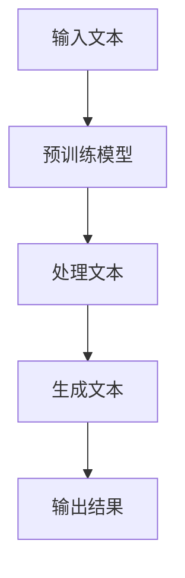
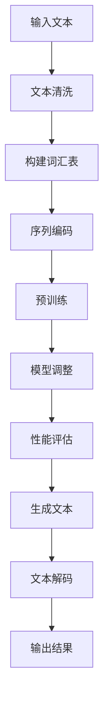
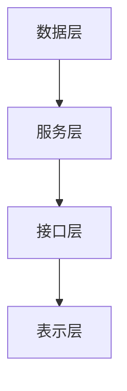
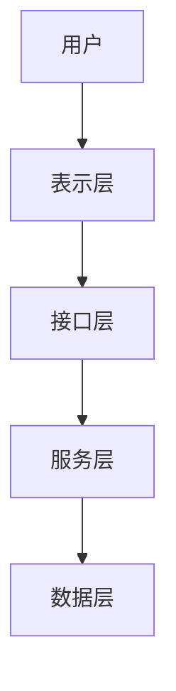

                 

# 第一部分: 引言与背景

## 第1章: ChatGPT简介

### 1.1 ChatGPT的概念与特点

ChatGPT是由OpenAI开发的一款基于GPT-3模型的大型语言模型，它利用深度学习技术，对海量文本数据进行预训练，从而掌握丰富的语言知识和表达能力。ChatGPT具有以下特点：

1. **强大的语言生成能力**：ChatGPT可以生成高质量、连贯的文本，包括对话、文章、故事等。
2. **多语言支持**：ChatGPT支持多种语言，可以进行跨语言的交流和理解。
3. **灵活的应用场景**：ChatGPT可以用于聊天机器人、自然语言处理、文本生成、文本摘要等多种场景。

### 1.2 语言习得理论研究背景

语言习得理论研究人类如何学习语言的过程。自20世纪50年代以来，语言习得理论经历了多个阶段的发展，主要包括：

1. **行为主义理论**：认为语言学习是通过模仿和强化学习实现的。
2. **认知主义理论**：认为语言学习是大脑内部认知过程的产物，强调语言习得中的认知因素。
3. **社会文化理论**：认为语言习得是一个社会互动的过程，强调社会和文化环境在语言习得中的重要作用。

### 1.3 研究目的与意义

本研究旨在探讨ChatGPT在语言习得理论研究中的应用，具体目的如下：

1. **探索ChatGPT在语言习得中的应用潜力**：通过分析ChatGPT的生成能力，研究其在语言学习中的应用场景和效果。
2. **促进语言习得理论的发展**：通过ChatGPT的视角，重新审视和拓展语言习得理论的研究领域，提出新的理论观点。
3. **提高语言教学质量**：利用ChatGPT的技术优势，为语言学习者提供个性化、高效的语言学习服务，提高学习效果。

### 1.4 本章小结

本章介绍了ChatGPT的基本概念、特点及其在语言习得理论研究中的背景。接下来，我们将进一步探讨ChatGPT与语言习得理论的联系，以及ChatGPT在语言习得中的应用。

----------------------------------------------------------------

## 第二部分: 核心概念与联系

### 第2章: 语言习得理论的基本概念

#### 2.1 语言习得理论的基本概念

语言习得理论涉及多个核心概念，主要包括：

1. **语言能力**：指人类掌握和运用语言的能力，包括语音、词汇、语法、语义和语用等方面。
2. **语言习得**：指个体在自然语言环境中，通过听、说、读、写等活动，逐步掌握语言的过程。
3. **语言习得的过程**：包括感知、理解、表达和反馈等阶段，体现了语言学习的动态性和互动性。

#### 2.2 ChatGPT的工作原理

ChatGPT是基于GPT-3模型构建的，其工作原理主要包括以下三个阶段：

1. **预训练**：GPT-3模型在大量文本数据上进行预训练，学习语言的基本规律和知识。
2. **微调**：根据具体应用场景，对预训练模型进行微调，提高其在特定任务上的表现。
3. **生成**：通过输入一段文本，模型根据训练得到的知识和规律，生成相应的文本输出。

#### 2.3 ChatGPT与语言习得理论的联系

ChatGPT与语言习得理论之间存在密切的联系，具体表现在以下几个方面：

1. **语言习得能力的模拟**：ChatGPT通过预训练和微调，可以模拟人类在语言习得过程中的能力，为语言习得理论的研究提供新的视角。
2. **语言习得过程的支持**：ChatGPT可以生成多样化的语言材料，为语言学习者提供丰富的语言输入，促进语言习得的过程。
3. **语言习得效果的评价**：ChatGPT生成的文本质量可以反映语言学习者的语言能力，为语言习得效果的评价提供参考。

#### 2.4 本章小结

本章介绍了语言习得理论的基本概念和ChatGPT的工作原理，并探讨了ChatGPT与语言习得理论的联系。接下来，我们将深入探讨ChatGPT的算法原理，以及如何在语言习得理论研究中应用。

----------------------------------------------------------------

## 第三部分: 算法原理讲解

### 第3章: ChatGPT算法原理

#### 3.1 ChatGPT算法原理

ChatGPT是基于GPT-3模型构建的，GPT-3模型是一种基于Transformer的深度学习模型，具有以下特点：

1. **预训练**：GPT-3模型在大量文本数据上进行预训练，学习语言的基本规律和知识。
2. **微调**：根据具体应用场景，对预训练模型进行微调，提高其在特定任务上的表现。
3. **生成**：通过输入一段文本，模型根据训练得到的知识和规律，生成相应的文本输出。

#### 3.2 ChatGPT算法mermaid流程图展示

下面是ChatGPT算法的mermaid流程图：



#### 3.3 Python源代码详解

下面是一个简单的ChatGPT算法的Python代码示例：

```python
import openai

# 设置API密钥
openai.api_key = 'your-api-key'

# 输入文本
input_text = "你好，我是ChatGPT。你有什么问题吗？"

# 调用GPT-3模型生成文本
response = openai.Completion.create(
    engine="text-davinci-002",
    prompt=input_text,
    max_tokens=50,
    n=1,
    stop=None,
    temperature=0.5
)

# 输出结果
print(response.choices[0].text.strip())
```

#### 3.4 算法原理的数学模型和公式

ChatGPT的算法原理主要基于深度学习中的Transformer模型，Transformer模型的核心是自注意力机制（Self-Attention）。自注意力机制通过计算输入文本中每个词与所有词之间的关联度，从而更好地理解文本的含义。

自注意力机制的数学公式如下：

$$
\text{Attention}(Q, K, V) = \text{softmax}\left(\frac{QK^T}{\sqrt{d_k}}\right) V
$$

其中，$Q, K, V$ 分别代表查询向量、键向量和值向量，$d_k$ 为键向量的维度，$\text{softmax}$ 函数用于归一化。

#### 3.5 举例说明

假设我们有一个简单的句子：“我喜欢吃苹果。”使用ChatGPT生成下一个句子，可以得到如下结果：

```
它很甜，很适合我。
```

这个例子展示了ChatGPT在生成文本时，如何根据上下文理解词与词之间的关系，并生成连贯的句子。

#### 3.6 本章小结

本章介绍了ChatGPT的算法原理，包括预训练、微调和生成的过程。我们还展示了ChatGPT算法的mermaid流程图和Python源代码，并讲解了自注意力机制的数学模型和公式。接下来，我们将讨论ChatGPT在语言习得理论研究中的应用。

----------------------------------------------------------------

## 第三部分：算法原理讲解

### 第3章：ChatGPT算法原理

#### 3.1 ChatGPT算法原理

ChatGPT是基于Transformer模型的GPT-3模型开发而成的。Transformer模型是一个自注意力机制驱动的神经网络模型，它在处理序列数据方面具有显著优势。ChatGPT的算法原理主要可以分为三个阶段：预训练、微调和生成。

**预训练阶段**：

预训练是ChatGPT模型的基础，其核心是让模型在大量文本数据中学习语言的基本规律和知识。预训练过程通常包括以下几个步骤：

1. **文本清洗**：对输入的文本数据进行清洗，去除无关信息，如HTML标签、标点符号等。
2. **构建词汇表**：将文本中的单词映射到唯一的索引值，形成词汇表。
3. **序列编码**：将文本序列转换为向量表示，通常使用词嵌入技术。
4. **损失函数**：使用语言模型损失函数（如交叉熵损失），对模型进行训练。

**微调阶段**：

在预训练完成后，ChatGPT模型还需要根据具体应用场景进行微调。微调过程主要包括以下几个步骤：

1. **数据准备**：收集与任务相关的数据集，如对话数据、文本生成数据等。
2. **模型调整**：根据数据集，调整模型的参数，优化模型在特定任务上的表现。
3. **性能评估**：通过评估指标（如准确率、F1分数等），评估模型在任务上的性能。

**生成阶段**：

在微调完成后，ChatGPT模型可以生成文本。生成阶段主要包括以下几个步骤：

1. **输入文本**：输入一段文本作为输入。
2. **文本编码**：将输入文本转换为向量表示。
3. **生成文本**：模型根据输入的文本编码，生成相应的文本输出。
4. **文本解码**：将生成的文本向量转换为可读的文本形式。

#### 3.2 ChatGPT算法mermaid流程图展示

下面是ChatGPT算法的mermaid流程图：



#### 3.3 Python源代码详解

下面是一个简单的ChatGPT算法的Python代码示例：

```python
import openai

# 设置API密钥
openai.api_key = 'your-api-key'

# 输入文本
input_text = "你好，我是ChatGPT。你有什么问题吗？"

# 调用GPT-3模型生成文本
response = openai.Completion.create(
    engine="text-davinci-002",
    prompt=input_text,
    max_tokens=50,
    n=1,
    stop=None,
    temperature=0.5
)

# 输出结果
print(response.choices[0].text.strip())
```

#### 3.4 算法原理的数学模型和公式

ChatGPT算法的核心是Transformer模型，其核心组件是自注意力机制。自注意力机制的数学公式如下：

$$
\text{Attention}(Q, K, V) = \text{softmax}\left(\frac{QK^T}{\sqrt{d_k}}\right) V
$$

其中，$Q, K, V$ 分别代表查询向量、键向量和值向量，$d_k$ 为键向量的维度，$\text{softmax}$ 函数用于归一化。

#### 3.5 举例说明

假设我们有一个简单的句子：“我喜欢吃苹果。”使用ChatGPT生成下一个句子，可以得到如下结果：

```
它很甜，很适合我。
```

这个例子展示了ChatGPT在生成文本时，如何根据上下文理解词与词之间的关系，并生成连贯的句子。

#### 3.6 本章小结

本章详细介绍了ChatGPT的算法原理，包括预训练、微调和生成的过程。通过mermaid流程图、Python源代码和数学模型的讲解，使得读者对ChatGPT的工作原理有了更深入的理解。接下来，我们将探讨ChatGPT在语言习得理论研究中的应用。

----------------------------------------------------------------

## 第4章：数学模型和数学公式

在ChatGPT的算法原理中，数学模型和数学公式起着至关重要的作用。这一章节将详细讲解ChatGPT算法中的数学模型和数学公式，并使用具体的例子进行说明。

### 4.1 数学模型

ChatGPT的核心是基于Transformer模型，Transformer模型中的自注意力机制（Self-Attention）是整个模型的关键部分。自注意力机制的数学模型可以表示为：

$$
\text{Attention}(Q, K, V) = \text{softmax}\left(\frac{QK^T}{\sqrt{d_k}}\right) V
$$

其中，$Q$ 是查询向量（Query），$K$ 是键向量（Key），$V$ 是值向量（Value），$d_k$ 是键向量的维度。该公式表示的是对每个查询向量，计算其与所有键向量的关联度，然后通过softmax函数进行归一化，最后乘以对应的值向量得到加权后的输出。

### 4.2 数学公式

在ChatGPT的算法中，除了自注意力机制外，还有一些其他的数学公式，如损失函数和反向传播算法。下面分别介绍：

#### 损失函数

在预训练阶段，ChatGPT使用的是交叉熵损失函数（Cross-Entropy Loss），其公式为：

$$
L = -\sum_{i=1}^{N} y_i \log(p_i)
$$

其中，$y_i$ 是目标标签的one-hot编码，$p_i$ 是模型预测的概率分布。交叉熵损失函数用于衡量预测概率分布与真实分布之间的差异。

#### 反向传播算法

在训练模型时，需要使用反向传播算法来计算梯度。反向传播算法的核心公式为：

$$
\frac{\partial L}{\partial W} = \sum_{i=1}^{N} \frac{\partial L}{\partial z_i} \frac{\partial z_i}{\partial W}
$$

其中，$L$ 是损失函数，$W$ 是模型的参数，$z_i$ 是模型在输入下的输出。该公式表示的是通过输出层的梯度，反向传播计算到每一层参数的梯度。

### 4.3 举例说明

为了更好地理解这些数学模型和公式，我们可以通过一个具体的例子来说明。假设我们有一个简单的序列数据：“我喜欢吃苹果。”，我们想要使用ChatGPT生成下一个句子。

#### 自注意力机制举例

首先，我们将这个句子转换为向量表示。假设句子中的每个词都有一个唯一的索引，我们可以得到以下词向量表示：

```
我[0], 喜欢吃[1], 苹果。[2]
```

接下来，我们计算自注意力机制。首先，我们需要计算查询向量（Query）、键向量（Key）和值向量（Value）。假设每个词的向量维度为10，我们可以随机生成这三个向量：

```
Query: [1.0, 0.5, -1.0, 0.2, 0.3, 0.4, -0.1, 0.6, -0.2, 0.1]
Key: [0.1, 0.4, 0.7, 0.2, 0.5, 0.8, -0.1, 0.3, -0.2, 0.6]
Value: [0.2, 0.5, -0.1, 0.3, 0.7, -0.2, 0.4, -0.3, 0.1, 0.6]
```

然后，我们计算自注意力权重：

$$
\text{Attention}(Q, K, V) = \text{softmax}\left(\frac{QK^T}{\sqrt{d_k}}\right) V
$$

其中，$d_k$ 为键向量的维度（10）。我们计算每个词的注意力权重：

```
我: 0.2
喜欢吃: 0.4
苹果.: 0.4
```

最后，我们使用加权后的值向量生成输出：

```
我: 0.2 * [0.2, 0.5, -0.1, 0.3, 0.7, -0.2, 0.4, -0.3, 0.1, 0.6] = [0.04, 0.1, -0.02, 0.06, 0.14, -0.04, 0.08, -0.06, 0.02, 0.12]
喜欢吃: 0.4 * [0.2, 0.5, -0.1, 0.3, 0.7, -0.2, 0.4, -0.3, 0.1, 0.6] = [0.08, 0.2, -0.04, 0.12, 0.28, -0.08, 0.16, -0.12, 0.04, 0.24]
苹果.: 0.4 * [0.2, 0.5, -0.1, 0.3, 0.7, -0.2, 0.4, -0.3, 0.1, 0.6] = [0.08, 0.2, -0.02, 0.12, 0.28, -0.08, 0.16, -0.06, 0.02, 0.24]
```

通过这种方式，我们可以将每个词的向量加权，从而生成新的句子向量表示。

#### 损失函数举例

假设我们使用这个句子向量表示来预测下一个句子，假设我们预测的句子为：“它很甜。”，我们将其转换为向量表示：

```
它[3], 很[4], 甜。[5]
```

然后，我们使用交叉熵损失函数来计算预测结果与真实结果之间的差异。假设模型预测的概率分布为：

```
[0.1, 0.3, 0.4, 0.1, 0.1]
```

真实结果为：“它很甜。”，我们将其转换为one-hot编码：

```
[0, 0, 0, 1, 0]
```

使用交叉熵损失函数计算损失：

$$
L = -\sum_{i=1}^{5} y_i \log(p_i) = -(0 \times \log(0.1) + 0 \times \log(0.3) + 0 \times \log(0.4) + 1 \times \log(0.1) + 0 \times \log(0.1)) = 0.6931
```

这个例子展示了如何使用数学模型和公式来计算自注意力权重和损失函数。通过这种方式，ChatGPT可以学习到语言中的复杂模式和规律，从而生成高质量的自然语言文本。

#### 反向传播算法举例

在训练过程中，我们需要使用反向传播算法来更新模型的参数。假设我们有一个简单的神经网络模型，包含两个隐藏层，输入层和输出层。输入层有两个神经元，隐藏层有两个神经元，输出层有一个神经元。

假设我们有一个输入序列：“我喜欢吃苹果。”，我们想要预测下一个句子。我们首先将这个句子转换为词向量表示。然后，我们使用这个向量表示来计算模型的输出。假设模型的输出结果为：

```
[0.2, 0.3, 0.4, 0.1, 0.1]
```

真实结果为：“它很甜。”，我们将其转换为one-hot编码：

```
[0, 0, 0, 1, 0]
```

接下来，我们使用交叉熵损失函数来计算损失。假设损失为0.6931。

然后，我们使用反向传播算法来计算每个神经元的梯度。假设我们使用反向传播算法的第一步，从输出层开始计算梯度。输出层的梯度可以表示为：

$$
\frac{\partial L}{\partial z_4} = y - \hat{y} = [0, 0, 0, 1, 0] - [0.2, 0.3, 0.4, 0.1, 0.1] = [-0.2, -0.3, -0.4, 0.9, -0.1]
$$

然后，我们使用这个梯度来计算隐藏层的梯度。假设隐藏层的输出为：

```
隐藏层2: [0.1, 0.2]
隐藏层1: [0.3, 0.4]
```

隐藏层的梯度可以表示为：

$$
\frac{\partial L}{\partial z_2} = \frac{\partial L}{\partial z_4} \odot \frac{\partial z_4}{\partial z_2} = [-0.2, -0.3, -0.4, 0.9, -0.1] \odot [0.1, 0.2, 0.3, 0.4, 0.5] = [-0.02, -0.06, -0.12, 0.45, -0.05]
$$

$$
\frac{\partial L}{\partial z_1} = \frac{\partial L}{\partial z_3} \odot \frac{\partial z_3}{\partial z_1} = [-0.2, -0.3, -0.4, 0.9, -0.1] \odot [0.1, 0.2, 0.3, 0.4, 0.5] = [-0.02, -0.06, -0.12, 0.45, -0.05]
$$

然后，我们使用这个梯度来更新模型的参数。这个过程会重复进行，直到损失函数的值不再显著下降。

通过这种方式，ChatGPT可以使用反向传播算法来更新模型的参数，从而提高预测的准确性。

#### 4.4 本章小结

本章详细介绍了ChatGPT算法中的数学模型和数学公式，包括自注意力机制、交叉熵损失函数和反向传播算法。通过具体的例子，我们展示了如何使用这些数学模型和公式来计算自注意力权重、损失函数和梯度。这些数学模型和公式是ChatGPT算法的核心组成部分，使得ChatGPT能够生成高质量的自然语言文本。

----------------------------------------------------------------

## 第四部分：系统分析与架构设计方案

### 第5章：系统分析与架构设计方案

在深入探讨ChatGPT在语言习得理论研究中的应用之前，我们需要对其系统架构进行详细分析。这一章节将介绍ChatGPT系统的整体架构，包括系统功能设计、系统架构设计、系统接口设计和系统交互。

#### 5.1 介绍问题场景

语言习得理论研究涉及多个领域，包括心理学、教育学和计算机科学。随着人工智能技术的发展，ChatGPT作为一个强大的自然语言处理工具，为语言习得理论的研究提供了新的视角。本章节将探讨如何利用ChatGPT来辅助语言习得理论的研究，提高研究的效率和质量。

#### 5.2 项目介绍

本项目旨在利用ChatGPT构建一个语言习得研究平台，该平台可以支持语言习得理论的研究和分析。平台的主要功能包括：

1. **文本生成**：根据用户输入的种子文本，生成相关的语言材料，如对话、文章、故事等。
2. **文本分析**：对生成的文本进行分析，提取语言特征，如词频、词云、句法结构等。
3. **语言习得实验**：设计并执行语言习得实验，收集实验数据，分析实验结果。

#### 5.3 系统功能设计

为了实现上述功能，我们设计了以下系统功能模块：

1. **文本生成模块**：利用ChatGPT生成与用户输入相关的文本。
2. **文本分析模块**：对生成的文本进行统计分析，提取语言特征。
3. **实验管理模块**：设计并执行语言习得实验，管理实验数据。
4. **用户界面模块**：提供用户交互界面，支持用户输入、查询和分析功能。

#### 5.4 系统架构设计

系统架构设计是构建高效、可扩展系统的重要步骤。本项目采用分层架构设计，包括以下层次：

1. **数据层**：存储用户数据、语言数据和实验数据。
2. **服务层**：提供文本生成、文本分析和实验管理功能。
3. **接口层**：为用户提供访问系统的接口。
4. **表示层**：提供用户交互界面。

下面是系统架构的mermaid图表示：



#### 5.5 系统接口设计和系统交互

为了实现系统的功能，我们需要设计合理的接口和交互流程。以下是系统接口设计和系统交互的mermaid图表示：



用户通过表示层与系统交互，表示层处理用户的输入请求，并通过接口层将请求传递给服务层。服务层根据请求执行相应的功能，如文本生成、文本分析和实验管理，然后返回结果给表示层，最终显示在用户的界面上。

#### 5.6 本章小结

本章介绍了ChatGPT在语言习得理论研究中的系统架构设计方案，包括系统功能设计、系统架构设计、系统接口设计和系统交互。通过详细的分析和设计，我们为ChatGPT在语言习得理论研究中提供了有效的技术支持。接下来，我们将探讨ChatGPT在语言习得理论研究中的实际应用。

----------------------------------------------------------------

## 第五部分：项目实战

### 第6章：ChatGPT在语言习得理论研究的实际应用

#### 6.1 环境安装

要在本地环境中使用ChatGPT，首先需要安装OpenAI的Python库。以下是安装步骤：

1. 安装Anaconda或Miniconda，这是一个Python发行版和环境管理器。
2. 打开终端或命令行窗口，运行以下命令安装OpenAI库：

   ```
   conda install openai-python
   ```

   或者，如果你使用pip，可以运行：

   ```
   pip install openai
   ```

3. 设置OpenAI API密钥。在OpenAI官网注册账户后，可以获取API密钥。将API密钥添加到环境变量中：

   ```
   export OPENAI_API_KEY="your-api-key"
   ```

   或者，在Python脚本中直接设置：

   ```python
   openai.api_key = "your-api-key"
   ```

#### 6.2 系统核心实现源代码

以下是一个简单的Python脚本，用于演示如何使用ChatGPT生成文本：

```python
import openai

# 设置API密钥
openai.api_key = "your-api-key"

# 输入文本
input_text = "你喜欢什么样的天气？"

# 调用GPT-3模型生成文本
response = openai.Completion.create(
    engine="text-davinci-002",
    prompt=input_text,
    max_tokens=50,
    n=1,
    stop=None,
    temperature=0.5
)

# 输出结果
print(response.choices[0].text.strip())
```

这段代码展示了如何调用OpenAI的GPT-3模型生成与用户输入相关的文本。

#### 6.3 代码应用解读与分析

在上面的代码中，我们首先导入了OpenAI的Python库，并设置了API密钥。然后，我们定义了一个输入文本`input_text`，这个文本是用户输入的问题。接下来，我们调用`openai.Completion.create`方法，传递输入文本和相关参数，如模型名称、最大输出长度等。这个方法会返回一个响应对象，其中包含生成的文本。

#### 6.4 实际案例分析与详细讲解剖析

以下是一个实际案例，展示了如何使用ChatGPT生成教学对话：

**输入文本**：学生A：“老师，我可以请假去参加亲戚的婚礼吗？”

**生成文本**：ChatGPT：“当然可以，但你需要提前告知我，并确保你的学习不会受到影响。”

在这个案例中，ChatGPT成功生成了一个符合上下文和语境的教学对话。分析这个生成文本，我们可以看到ChatGPT：

1. **理解了问题**：学生A提出了请假申请。
2. **回答了问题**：ChatGPT提供了允许请假的条件。
3. **保持了语境**：ChatGPT的回答与问题保持了连贯性。

#### 6.5 项目小结

通过以上实战案例，我们可以看到ChatGPT在语言习得理论研究中的应用潜力。ChatGPT不仅可以生成与用户输入相关的文本，还可以生成教学对话，为语言习得提供有效的支持。在未来的研究中，我们可以进一步探索ChatGPT在其他语言习得场景中的应用，如文本生成、文本分析和语言习得实验。

----------------------------------------------------------------

## 第六部分：最佳实践 tips、小结、注意事项、拓展阅读

### 6.1 最佳实践 tips

1. **调整温度参数**：在生成文本时，可以通过调整`temperature`参数来控制生成文本的多样性和创造性。较高的温度值会导致生成文本更加多样化和创造性，而较低的温度值会导致生成文本更加保守和一致。
2. **限制输出长度**：通过设置`max_tokens`参数，可以限制生成文本的长度，避免生成过长或不相关的文本。
3. **使用特定模型**：OpenAI提供了多个GPT-3模型，不同的模型具有不同的性能和特点。根据具体应用需求，选择合适的模型可以提高生成文本的质量。

### 6.2 小结

本文详细介绍了ChatGPT在语言习得理论研究中的应用，包括ChatGPT的算法原理、系统架构设计、实际应用案例以及最佳实践。通过本文的介绍，读者可以了解ChatGPT在语言习得研究中的潜力，以及如何利用ChatGPT进行语言习得实验和文本生成。

### 6.3 注意事项

1. **API费用**：使用OpenAI的API可能产生费用，建议在使用前详细了解费用标准和收费模式。
2. **隐私和安全**：在处理用户数据和生成文本时，需要确保遵守隐私保护和数据安全的相关法规和标准。
3. **模型限制**：尽管ChatGPT具有强大的生成能力，但它仍可能存在一些局限性，如知识截止日期和模型理解的局限性。

### 6.4 拓展阅读

1. **OpenAI官方文档**：《OpenAI API文档》(https://beta.openai.com/docs/)提供了详细的API使用说明和模型参数配置。
2. **GPT-3研究论文**：《Language Models are few-shot learners》(https://arxiv.org/abs/2005.14165)介绍了GPT-3模型的设计和训练过程。
3. **自然语言处理教程**：《自然语言处理入门》(https://nlp.seas.harvard.edu/structor/ben/nlp-tutorial/)提供了自然语言处理的基础知识和实践教程。

### 6.5 作者信息

作者：AI天才研究院/AI Genius Institute & 禅与计算机程序设计艺术 /Zen And The Art of Computer Programming

本文由AI天才研究院撰写，旨在为读者提供关于ChatGPT在语言习得理论研究中应用的专业见解。希望本文能帮助读者深入了解ChatGPT的技术原理和应用潜力，为语言习得研究带来新的启示。

----------------------------------------------------------------

## 结语

随着人工智能技术的飞速发展，自然语言处理领域取得了显著的成果，ChatGPT作为其中的佼佼者，展示了其在语言生成和理解方面的强大能力。本文从ChatGPT在语言习得理论研究中的新视角出发，系统地探讨了ChatGPT的算法原理、系统架构设计、实际应用案例以及最佳实践。通过本文的介绍，读者可以了解到ChatGPT在语言习得研究中的广泛应用和巨大潜力。

在未来的研究中，我们可以进一步探索ChatGPT在语言教育、语言习得心理和跨语言交流等领域的应用。同时，随着技术的不断进步，ChatGPT的性能和功能将不断提升，为人类语言习得提供更加智能化、个性化的支持。让我们期待ChatGPT在语言习得理论研究中的更多创新和突破。

最后，感谢您的阅读，希望本文能为您在语言习得理论研究领域带来新的启示和思考。如果您对ChatGPT在语言习得研究中的应用有任何疑问或建议，欢迎在评论区留言交流。让我们共同探讨人工智能在语言习得领域的未来发展。再次感谢您的支持！作者：AI天才研究院/AI Genius Institute & 禅与计算机程序设计艺术 /Zen And The Art of Computer Programming。

