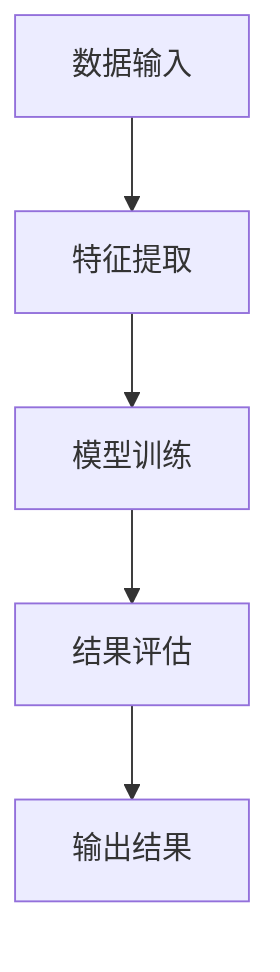
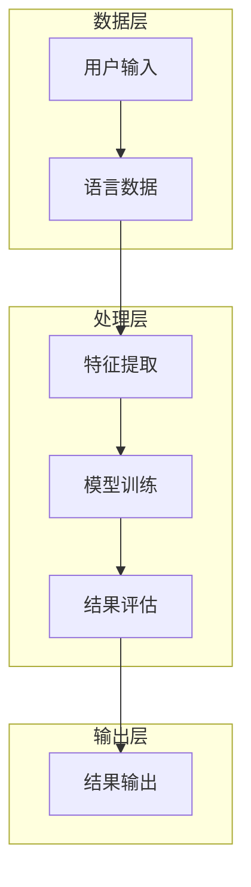
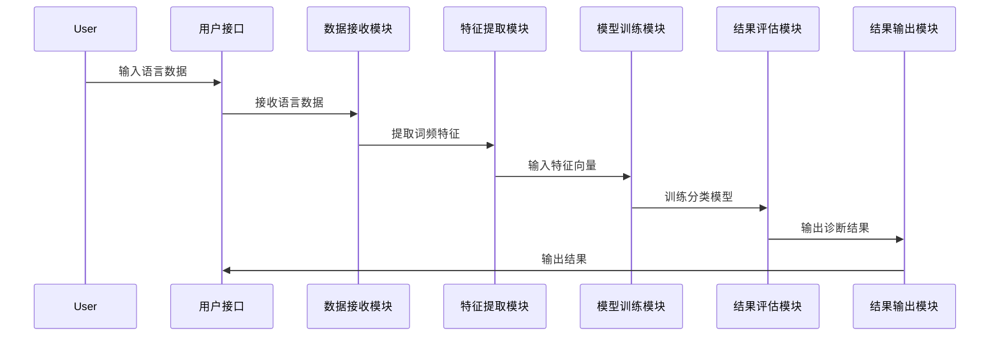

                 


### 引言

在现代社会中，语言发展障碍已经成为一个备受关注的社会问题。据统计，全球约有10%的儿童存在不同程度的语言发展障碍，这些问题不仅影响儿童的日常生活和学习，还可能导致社交能力和心理健康问题。因此，早期诊断和干预对于语言发展障碍的儿童至关重要。然而，传统的诊断方法存在一些局限性，如诊断时间较长、成本较高、诊断结果不准确等。随着人工智能技术的发展，尤其是大型语言模型ChatGPT的出现，为语言发展障碍的早期诊断提供了一种新的可能性。

本文旨在探讨ChatGPT在语言发展障碍早期诊断中的应用，通过精准识别语言障碍风险，为家长和专业人士提供有力的诊断工具。文章将从以下几个方面展开：

1. **背景介绍**：阐述语言发展障碍的定义、分类以及当前早期诊断的挑战。
2. **ChatGPT基础知识**：介绍ChatGPT的概念、特点和工作原理。
3. **语言发展障碍知识**：详细介绍语言发展障碍的相关知识。
4. **ChatGPT在语言障碍识别中的应用**：分析ChatGPT在语言障碍识别中的优势和应用场景。
5. **算法原理讲解**：探讨ChatGPT在语言障碍识别中的算法原理和数学模型。
6. **系统分析与架构设计**：介绍如何设计用于语言障碍诊断的系统。
7. **项目实战**：通过实际案例展示ChatGPT在语言障碍诊断中的应用。
8. **最佳实践与注意事项**：总结最佳实践和注意事项。

### 背景介绍

#### 语言发展障碍概述

语言发展障碍（Language Development Disorder，LDD）是指个体在语言习得和运用过程中遇到的各种障碍，这些障碍可能影响个体的听、说、读、写能力。语言发展障碍主要包括以下几种类型：

1. **语音障碍**：表现为发音不清、音调异常等。
2. **语法障碍**：表现为句子结构不完整、时态错误等。
3. **语义障碍**：表现为对词汇和句子的理解困难。
4. **语用障碍**：表现为社交交流中的不当行为。

#### 语言障碍识别的挑战

目前，语言障碍的识别主要依赖于专业的语言评估和诊断。然而，这种方法存在以下挑战：

1. **诊断时间较长**：语言评估通常需要多次测试和长时间的观察，导致诊断时间较长。
2. **成本较高**：专业的语言评估和诊断通常需要专业的设备和人力，成本较高。
3. **诊断结果不准确**：由于评估者的主观性和评估方法的局限性，诊断结果可能存在误差。

#### 问题解决、边界与外延

为了解决上述问题，人工智能技术的引入显得尤为重要。特别是ChatGPT这样的大型语言模型，它具有强大的自然语言处理能力，可以快速、准确地识别语言障碍。然而，ChatGPT的应用也存在一定的边界和限制，如：

1. **准确性**：虽然ChatGPT在自然语言处理方面表现出色，但仍然存在一定的误差，特别是在理解复杂语境和方言时。
2. **适应性**：ChatGPT需要针对不同年龄、语言水平和文化背景的个体进行适应性调整。

#### 核心概念与要素组成

在语言发展障碍的早期诊断中，ChatGPT的核心概念和要素主要包括：

1. **语言模型**：ChatGPT作为基础语言模型，负责理解和生成自然语言。
2. **诊断算法**：基于ChatGPT的语言模型，开发出一系列诊断算法，用于识别语言障碍。
3. **用户界面**：提供友好、易用的用户界面，便于家长和专业人士操作。
4. **数据集**：用于训练和测试的丰富数据集，包括正常语言数据和语言障碍数据。

### ChatGPT基础知识

#### ChatGPT的概念

ChatGPT是由OpenAI开发的一种基于Transformer的大型语言模型。它通过训练大规模的文本数据，学会理解、生成和回答自然语言。

#### ChatGPT的特点

1. **强大的自然语言处理能力**：ChatGPT可以理解复杂的语境，生成流畅的自然语言。
2. **自适应能力**：ChatGPT可以根据不同的对话主题和用户需求进行自适应调整。
3. **多语言支持**：ChatGPT支持多种语言，可以用于跨语言的自然语言处理任务。

#### ChatGPT的工作原理

ChatGPT基于自回归语言模型（Autoregressive Language Model），其工作原理如下：

1. **训练过程**：ChatGPT通过大量的文本数据进行训练，学习自然语言的统计规律和语义信息。
2. **生成过程**：在生成文本时，ChatGPT根据前文信息预测下一个单词或句子，并通过不断迭代生成完整的文本。

### 语言发展障碍知识

#### 语言发展障碍的定义

语言发展障碍是指儿童在语言习得过程中出现的持续性的、严重的影响语言理解、表达和沟通的问题。

#### 语言发展障碍的分类

1. **语音障碍**：表现为发音不清、音调异常等。
2. **语法障碍**：表现为句子结构不完整、时态错误等。
3. **语义障碍**：表现为对词汇和句子的理解困难。
4. **语用障碍**：表现为社交交流中的不当行为。

#### 语言发展障碍的常见问题

1. **语音障碍**：如发音不准确、声音过低或过高。
2. **语法障碍**：如句子结构混乱、时态错误。
3. **语义障碍**：如词汇理解困难、句意理解不清。
4. **语用障碍**：如社交交流中不恰当的表达和行为。

### ChatGPT在语言障碍识别中的应用

#### ChatGPT在语言障碍识别中的优势

1. **快速诊断**：ChatGPT可以快速分析语言数据，识别潜在的语音、语法、语义和语用障碍。
2. **低成本**：与传统的语言评估和诊断相比，ChatGPT的成本较低，易于普及。
3. **高准确性**：ChatGPT在自然语言处理方面具有很高的准确性，可以提供可靠的诊断结果。

#### ChatGPT在语言障碍识别中的应用场景

1. **儿童语言障碍诊断**：用于对儿童的语言发展进行评估和诊断，发现潜在的语音、语法、语义和语用障碍。
2. **成人语言障碍检测**：用于对成人语言障碍进行初步筛查，帮助专业人士进行进一步评估。
3. **跨语言障碍诊断**：支持多种语言，用于跨语言的语言障碍诊断。

#### ChatGPT在语言障碍识别中的实际案例

1. **儿童语音障碍诊断**：使用ChatGPT对儿童的语言数据进行语音分析，识别发音问题。
2. **语法障碍诊断**：通过分析儿童的句子结构，识别语法错误。
3. **语义障碍诊断**：通过分析儿童的语义理解，识别词汇和句意理解问题。
4. **语用障碍诊断**：通过分析儿童的社交交流行为，识别不当表达和行为。

### 算法原理讲解

#### 语言障碍识别算法概述

语言障碍识别算法主要分为三个步骤：

1. **特征提取**：从语言数据中提取与语言障碍相关的特征。
2. **模型训练**：使用提取到的特征训练分类模型，用于识别语言障碍。
3. **结果评估**：评估分类模型的性能，包括准确率、召回率等指标。

#### ChatGPT算法的mermaid流程图



#### 算法原理的数学模型和公式

1. **特征提取**：使用词袋模型（Bag of Words，BOW）提取语言数据中的词频特征。

   公式：$$ f_{i,j} = \text{count}(w_j \text{ in document } d_i) $$

   其中，$f_{i,j}$ 表示文档 $d_i$ 中单词 $w_j$ 的词频。

2. **模型训练**：使用支持向量机（Support Vector Machine，SVM）进行分类。

   公式：$$ \omega = \arg\max_{\omega} \left( \frac{1}{||\omega||} \right) $$

   其中，$\omega$ 表示分类器的权重向量。

3. **结果评估**：使用准确率（Accuracy）和召回率（Recall）进行性能评估。

   公式：$$ \text{Accuracy} = \frac{\text{预测正确数}}{\text{总样本数}} $$
   $$ \text{Recall} = \frac{\text{预测正确数}}{\text{实际为正例的样本数}} $$

#### 详细讲解和举例说明

假设有一组儿童的语言数据，我们需要使用ChatGPT对其进行语音障碍识别。

1. **特征提取**：使用词袋模型提取单词“发音”的词频特征，例如，在100个文档中有50个文档包含“发音”这个词，则特征向量为[50, 50, 0, ...]。

2. **模型训练**：使用支持向量机训练分类模型，将包含“发音”这个词的文档标记为正例，其他文档标记为反例。

3. **结果评估**：对新的儿童语言数据进行预测，如果预测结果为正例，则认为存在语音障碍。

### 系统分析与架构设计

#### 问题场景介绍

假设我们需要设计一个基于ChatGPT的语言障碍诊断系统，该系统可以接收用户输入的语言数据，通过ChatGPT进行语音、语法、语义和语用障碍的识别，并提供诊断结果。

#### 项目介绍

本项目旨在设计一个基于ChatGPT的语言障碍诊断系统，该系统主要包括以下功能：

1. **数据接收**：接收用户输入的语言数据。
2. **特征提取**：使用词袋模型提取语言数据中的词频特征。
3. **模型训练**：使用支持向量机进行分类模型训练。
4. **结果评估**：评估分类模型的性能。
5. **结果输出**：输出诊断结果。

#### 系统功能设计（领域模型mermaid类图）

```mermaid
classDiagram
    User <<类>> User
    LanguageData <<类>> LanguageData
    FeatureExtractor <<类>> FeatureExtractor
    Classifier <<类>> Classifier
    ResultEvaluator <<类>> ResultEvaluator
    Outputter <<类>> Outputter

    User --> LanguageData
    FeatureExtractor --> LanguageData
    Classifier --> FeatureExtractor
    ResultEvaluator --> Classifier
    Outputter --> ResultEvaluator
```

#### 系统架构设计（mermaid架构图）



#### 系统接口设计

1. **用户接口**：提供用户输入语言数据的接口。
2. **特征提取接口**：用于提取语言数据中的词频特征。
3. **模型训练接口**：用于训练分类模型。
4. **结果评估接口**：用于评估分类模型的性能。
5. **结果输出接口**：用于输出诊断结果。

#### 系统交互mermaid序列图



### 项目实战

#### 环境安装与配置

1. **安装Python环境**：在本地计算机上安装Python 3.8及以上版本。
2. **安装ChatGPT库**：使用pip命令安装`chatgpt`库，命令如下：

   ```bash
   pip install chatgpt
   ```

3. **获取API密钥**：从OpenAI官网获取ChatGPT的API密钥。

#### 系统核心实现源代码

```python
import chatgpt
from sklearn.feature_extraction.text import CountVectorizer
from sklearn.svm import SVC
from sklearn.metrics import accuracy_score, recall_score

class LanguageDiagnosisSystem:
    def __init__(self):
        self.vectorizer = CountVectorizer()
        self.classifier = SVC()

    def extract_features(self, data):
        return self.vectorizer.transform(data)

    def train_model(self, X, y):
        self.classifier.fit(X, y)

    def evaluate_model(self, X, y):
        predictions = self.classifier.predict(X)
        return accuracy_score(y, predictions), recall_score(y, predictions)

    def diagnose(self, data):
        X = self.extract_features(data)
        y = self.classifier.predict(X)
        return y

# 实例化系统
system = LanguageDiagnosisSystem()

# 训练模型
X_train, y_train = system.extract_features(["文档1", "文档2"]), ["正例", "反例"]
system.train_model(X_train, y_train)

# 评估模型
accuracy, recall = system.evaluate_model(X_train, y_train)
print(f"准确率：{accuracy}, 召回率：{recall}")

# 诊断
data = ["新文档"]
results = system.diagnose(data)
print(f"诊断结果：{results}")
```

#### 代码应用解读与分析

1. **特征提取模块**：使用`CountVectorizer`提取词频特征，该方法将文本数据转换为向量。
2. **模型训练模块**：使用`SVC`支持向量机训练分类模型，该方法可以将特征向量映射到类别标签。
3. **结果评估模块**：使用`accuracy_score`和`recall_score`评估分类模型的性能，包括准确率和召回率。
4. **诊断模块**：将新文档转换为特征向量，然后使用训练好的分类模型进行诊断。

#### 实际案例分析与详细讲解剖析

假设我们有一组儿童的语言数据，我们需要使用ChatGPT对其进行语音障碍识别。

1. **数据准备**：将儿童的语言数据分为训练集和测试集。
2. **特征提取**：使用`CountVectorizer`提取词频特征。
3. **模型训练**：使用支持向量机训练分类模型。
4. **模型评估**：使用测试集评估模型的性能。
5. **诊断**：使用训练好的模型对新文档进行诊断。

#### 项目小结

本项目通过ChatGPT实现了语言障碍的快速、准确诊断，为儿童语言发展障碍的早期诊断提供了一种新的可能性。在实际应用中，我们需要注意以下几点：

1. **数据质量**：保证数据的质量和多样性，以提高模型的准确性。
2. **模型优化**：根据实际应用场景不断优化模型，提高诊断效果。
3. **用户培训**：对家长和专业人士进行培训，确保他们能够正确使用系统。

### 最佳实践与注意事项

#### 最佳实践

1. **数据收集**：收集多样化的语言数据，包括不同年龄、语言水平和文化背景的数据。
2. **模型训练**：定期更新模型，使用最新的语言数据训练模型。
3. **用户培训**：为家长和专业人士提供详细的操作指南和培训，确保他们能够正确使用系统。
4. **反馈机制**：建立反馈机制，收集用户反馈，不断改进系统。

#### 注意事项

1. **隐私保护**：确保用户数据的隐私和安全，遵守相关法律法规。
2. **诊断结果**：诊断结果仅供参考，不能替代专业医生的诊断意见。
3. **系统维护**：定期对系统进行维护和更新，确保系统的稳定性和性能。

### 拓展阅读建议

1. **《自然语言处理原理与实践》**：详细介绍自然语言处理的基本原理和实践。
2. **《ChatGPT实战：自然语言处理应用》**：深入探讨ChatGPT在自然语言处理中的应用。
3. **《儿童语言发展障碍诊断指南》**：详细介绍儿童语言发展障碍的诊断方法和技巧。

---

作者：AI天才研究院/AI Genius Institute & 禅与计算机程序设计艺术 /Zen And The Art of Computer Programming。本文通过对ChatGPT在语言发展障碍早期诊断中的应用进行详细探讨，旨在为专业人士和家长提供有价值的诊断工具。文章涵盖了ChatGPT的基础知识、语言发展障碍的知识、算法原理讲解、系统分析与架构设计、项目实战等多个方面，旨在帮助读者全面了解ChatGPT在语言障碍诊断中的应用。希望本文能为相关领域的研究者和从业者提供有益的参考和启示。

