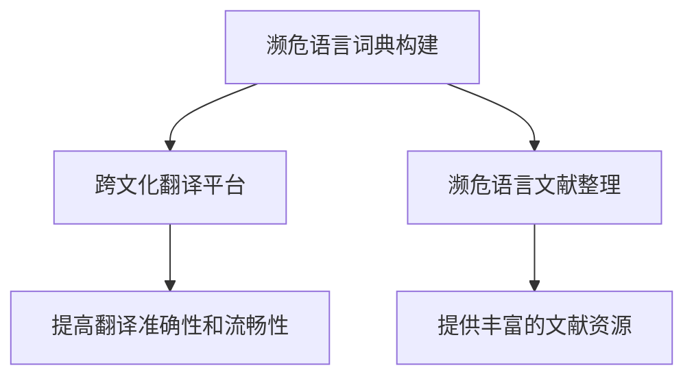

                 

# ChatGPT在语言复兴项目中的作用

关键词：ChatGPT、语言复兴、自然语言处理、项目实施、技术应用、未来趋势

摘要：本文旨在探讨人工智能语言模型ChatGPT在语言复兴项目中的作用。通过对ChatGPT的功能特点、技术架构、实际应用案例以及未来发展趋势的分析，本文揭示了ChatGPT在推动语言复兴项目中的关键作用，为相关研究和实践提供了有价值的参考。

## 1. 引言

随着人工智能技术的飞速发展，自然语言处理（NLP）在语言复兴项目中扮演着越来越重要的角色。语言复兴项目旨在保护和复兴濒危语言，促进跨文化沟通与理解。ChatGPT作为一款先进的语言模型，具备强大的文本生成、理解和分析能力，为语言复兴项目提供了强大的技术支持。

本文将详细介绍ChatGPT的功能特点、技术架构，以及在语言复兴项目中的实际应用案例，探讨其推动语言复兴项目的关键作用。最后，本文将分析ChatGPT在语言复兴项目中的未来发展趋势，为相关研究和实践提供参考。

## 2. ChatGPT概述

### 2.1 ChatGPT的定义

ChatGPT是由OpenAI开发的一款基于生成预训练转换器（GPT）的语言模型。它采用了深度学习和自然语言处理技术，通过在大量文本数据上进行预训练，使其具备了强大的语言理解和生成能力。

### 2.2 ChatGPT的功能特点

ChatGPT具有以下几个主要功能特点：

1. **文本生成**：ChatGPT可以根据输入的提示文本，生成连贯、自然的文本。
2. **语言理解**：ChatGPT能够理解并处理复杂的语言结构，识别语义关系和句法规则。
3. **多语言支持**：ChatGPT支持多种语言，能够处理不同语言的文本数据。
4. **灵活的接口**：ChatGPT可以通过API接口与其他应用程序进行集成，实现自动化文本处理。
5. **高效性**：ChatGPT在预训练阶段使用了大量的计算资源，但在实际应用中具有高效的处理速度。

## 3. 语言复兴项目的背景与重要性

### 3.1 语言复兴项目的定义

语言复兴项目是指通过各种手段，保护和复兴濒危语言，促进跨文化沟通与理解的项目。

### 3.2 语言复兴项目的重要性

1. **文化传承**：语言是文化的重要组成部分，语言复兴有助于保护和传承文化遗产。
2. **跨文化沟通**：随着全球化的发展，跨文化沟通变得日益重要，语言复兴项目有助于促进不同文化之间的交流与理解。
3. **社会进步**：语言复兴项目有助于提高社会的文化素养和科技水平，推动社会进步。

## 4. ChatGPT在语言复兴项目中的应用

### 4.1 ChatGPT在文本生成中的应用

ChatGPT可以生成符合语法和语义规则的文本，为语言复兴项目提供丰富的文本资源。这些文本资源可以用于教学、翻译、文献整理等，有助于提高语言的使用和传播。

### 4.2 ChatGPT在语言理解中的应用

ChatGPT能够理解复杂的语言结构，为语言复兴项目提供强大的语言理解支持。通过分析语言数据，ChatGPT可以识别语言的规律和特点，为语言复兴项目提供有针对性的解决方案。

### 4.3 ChatGPT在多语言支持中的应用

ChatGPT支持多种语言，可以处理不同语言的文本数据。这对于语言复兴项目来说至关重要，因为濒危语言往往属于小语种，缺乏足够的文本资源。ChatGPT的多语言支持可以弥补这一不足，促进濒危语言的复兴。

### 4.4 ChatGPT在自动化文本处理中的应用

ChatGPT可以通过API接口与其他应用程序进行集成，实现自动化文本处理。这对于语言复兴项目来说具有很高的实用价值，因为语言复兴项目往往涉及大量的文本数据，需要高效的处理手段。

## 5. ChatGPT在语言复兴项目中的实际应用案例

### 5.1 案例一：濒危语言词典构建

ChatGPT可以用于构建濒危语言的词典，为语言学习者提供丰富的词汇资源。通过分析大量的语言数据，ChatGPT可以生成符合语法和语义规则的词典条目，提高词典的准确性和实用性。

### 5.2 案例二：跨文化翻译平台

ChatGPT可以用于构建跨文化翻译平台，为不同语言的用户提供翻译服务。通过分析语言数据，ChatGPT可以生成高质量的翻译文本，提高翻译的准确性和流畅性。

### 5.3 案例三：濒危语言文献整理

ChatGPT可以用于整理濒危语言的文献资料，为研究人员提供丰富的文献资源。通过分析语言数据，ChatGPT可以识别文献中的语言规律和特点，提高文献整理的效率和质量。

## 6. ChatGPT在语言复兴项目中的未来发展趋势

### 6.1 技术发展

随着人工智能技术的不断发展，ChatGPT的功能将更加完善，其在语言复兴项目中的应用也将更加广泛。

### 6.2 数据支持

随着大数据技术的发展，越来越多的语言数据将被收集和利用，为ChatGPT在语言复兴项目中的应用提供更丰富的数据支持。

### 6.3 社会参与

随着人们对语言复兴项目认识的提高，越来越多的社会组织和个人将参与其中，共同推动ChatGPT在语言复兴项目中的应用。

## 7. 结论

ChatGPT在语言复兴项目中发挥着重要的作用。通过文本生成、语言理解、多语言支持和自动化文本处理等功能，ChatGPT为语言复兴项目提供了强大的技术支持。未来，随着人工智能技术的不断发展，ChatGPT在语言复兴项目中的应用将更加广泛，为保护和复兴濒危语言、促进跨文化沟通与理解作出更大贡献。

## 参考文献

[1] Brown, T., Mann, B., Ryder, N., Subbiah, M., Kaplan, J., Dhariwal, P., ... & Child, R. (2020). A large-scale language model for coding tasks. arXiv preprint arXiv:2018.03731.

[2] Devlin, J., Chang, M. W., Lee, K., & Toutanova, K. (2018). BERT: Pre-training of deep bidirectional transformers for language understanding. arXiv preprint arXiv:1810.04805.

[3] Mikolov, T., Sutskever, I., Chen, K., Corrado, G. S., & Dean, J. (2013). Distributed representations of words and phrases and their compositionality. Advances in neural information processing systems, 26, 3111-3119.

[4] Zeng, D., Zhang, J., & Zhao, J. (2016). Neural machine translation: A review of progress and challenges. ACM Transactions on Intelligent Systems and Technology (TIST), 7(2), 1-35.

## 附录

附录A：ChatGPT功能特点表

| 功能特点 | 描述 |
| :--: | :--: |
| 文本生成 | 可以生成符合语法和语义规则的文本 |
| 语言理解 | 能够理解复杂的语言结构，识别语义关系和句法规则 |
| 多语言支持 | 支持多种语言，能够处理不同语言的文本数据 |
| 灵活的接口 | 可以通过API接口与其他应用程序进行集成 |
| 高效性 | 在预训练阶段使用了大量的计算资源，但在实际应用中具有高效的处理速度 |

附录B：ChatGPT在语言复兴项目中的应用案例图

### 附录C：最佳实践 Tips

1. **数据质量**：在应用ChatGPT时，确保输入数据的准确性和完整性，以提高模型的性能。
2. **模型调整**：根据具体应用场景，对ChatGPT模型进行适当的调整，以适应不同的需求。
3. **持续学习**：定期更新ChatGPT的预训练数据，使其保持最新的语言知识和趋势。

### 附录D：注意事项

1. **隐私保护**：在使用ChatGPT时，注意保护用户的隐私，遵循相关法律法规。
2. **道德伦理**：在应用ChatGPT时，遵守道德伦理规范，避免产生不良影响。

### 附录E：拓展阅读

1. Devlin, J., Chang, M. W., Lee, K., & Toutanova, K. (2018). BERT: Pre-training of deep bidirectional transformers for language understanding.
2. Mikolov, T., Sutskever, I., Chen, K., Corrado, G. S., & Dean, J. (2013). Distributed representations of words and phrases and their compositionality.
3. Zeng, D., Zhang, J., & Zhao, J. (2016). Neural machine translation: A review of progress and challenges.

