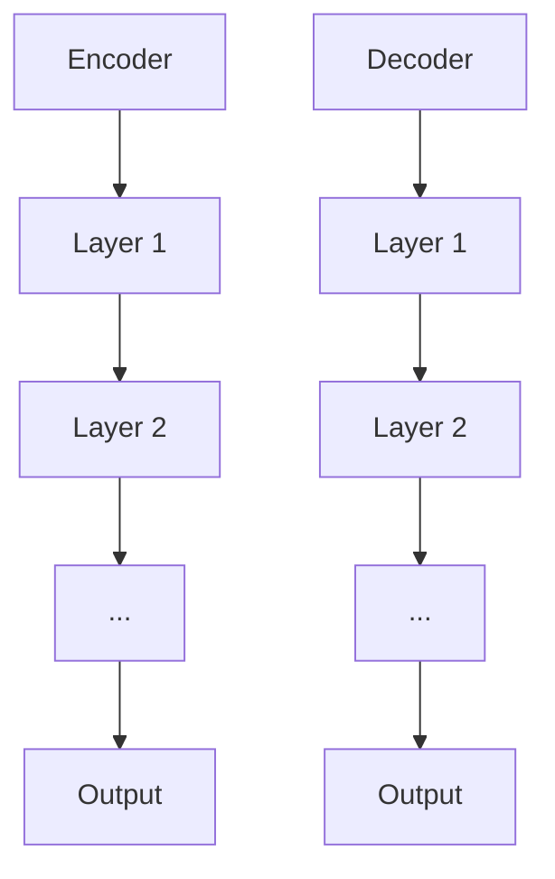
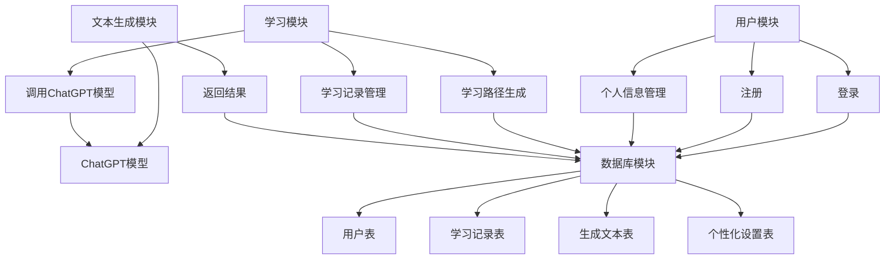

                 

### # ChatGPT在语言学习个性化中的突破性应用

#### > 关键词：ChatGPT、个性化语言学习、AI、自然语言处理、机器学习

#### > 摘要：
在当今快速发展的技术时代，个性化教育成为了教育领域的一大热点。个性化语言学习不仅能够满足不同学习者的需求，还能提高学习效果。而ChatGPT，作为一种基于人工智能的先进技术，在这一领域中展示了巨大的潜力。本文将深入探讨ChatGPT在个性化语言学习中的应用，分析其核心技术原理，系统架构设计，以及在实际项目中的最佳实践，旨在为教育科技工作者提供有价值的参考。

#### 1. 引言

个性化语言学习（Personalized Language Learning）指的是根据学习者的个体差异，如学习风格、语言水平、兴趣等，为其定制化设计的语言学习方案。传统语言学习模式通常以统一的教学内容和评估标准为主，难以满足每个学习者的独特需求。而个性化语言学习通过数据分析和机器学习技术，能够实现教学内容、教学节奏和评估方式的个性化调整，从而提高学习效率和效果。

ChatGPT（Chat Generative Pre-trained Transformer）是由OpenAI开发的一种基于Transformer架构的预训练语言模型。它通过大量的文本数据进行训练，能够生成流畅、自然的语言文本。ChatGPT在自然语言处理（NLP）领域展现出了极高的性能，特别是在对话生成、文本生成和回答问题等方面。因此，ChatGPT在个性化语言学习中的应用成为了近年来研究的热点。

#### 2. 个人化语言学习背景

随着全球化和信息化的加速发展，英语作为国际通用语言的地位日益凸显。然而，传统的语言学习方法往往存在一定的局限性，难以满足现代学习者的需求。个性化语言学习应运而生，其核心在于根据学习者的个体差异，如语言水平、学习风格、认知能力等，为其提供定制化的学习方案。这不仅能提高学习者的学习兴趣和动机，还能显著提高学习效果。

个人化语言学习的重要性体现在以下几个方面：

- **提高学习效率**：通过个性化学习方案，学习者可以专注于自己的薄弱环节，提高学习效率。
- **满足多样化需求**：不同学习者有不同的学习目标和需求，个性化学习可以满足这些多样化需求。
- **增强学习体验**：个性化学习使学习过程更加生动、有趣，从而提高学习者的学习体验。
- **促进自主学习**：个性化学习鼓励学习者自主学习，培养其独立解决问题的能力。

#### 3. ChatGPT在个性化语言学习中的应用

ChatGPT作为一种强大的语言模型，其应用范围广泛，包括但不限于对话生成、文本生成和回答问题等。在个性化语言学习中，ChatGPT可以发挥以下作用：

- **对话生成**：ChatGPT可以与学习者进行自然语言对话，模拟真实的语言交流环境，帮助学习者提高口语表达能力。
- **文本生成**：ChatGPT可以根据学习者的需求和兴趣生成个性化的学习材料，如故事、对话、文章等，丰富学习内容。
- **问题回答**：ChatGPT可以回答学习者提出的各种语言学习问题，提供即时的反馈和帮助。

#### 4. ChatGPT的核心技术原理

ChatGPT的核心技术是基于Transformer架构的预训练语言模型。Transformer是一种基于自注意力机制的序列模型，能够有效地捕捉序列中的长距离依赖关系。以下是ChatGPT的核心技术原理：

- **Transformer架构**：Transformer架构由编码器和解码器组成，编码器将输入序列编码为固定长度的向量，解码器则根据这些向量生成输出序列。
- **自注意力机制**：自注意力机制允许模型在生成每个输出词时，自动关注输入序列中相关的词，从而提高生成文本的质量。
- **预训练与微调**：ChatGPT通过在大量文本数据上进行预训练，学习到通用语言知识，然后通过微调适应特定任务的需求。

#### 5. ChatGPT在个性化语言学习中的具体应用

ChatGPT在个性化语言学习中的具体应用主要体现在以下几个方面：

- **学习路径定制**：ChatGPT可以根据学习者的语言水平和兴趣，为其定制个性化的学习路径，确保学习内容与学习者的需求相匹配。
- **互动式学习**：ChatGPT可以模拟真实的语言交流环境，与学习者进行互动，提高学习者的口语表达和听力理解能力。
- **实时反馈**：ChatGPT可以实时分析学习者的语言使用情况，提供即时的反馈和建议，帮助学习者纠正错误，提高语言水平。
- **个性化资源推荐**：ChatGPT可以根据学习者的兴趣和学习进度，推荐个性化的学习资源，如文章、视频、练习题等，丰富学习内容。

#### 6. 系统设计与实现

要实现ChatGPT在个性化语言学习中的具体应用，需要设计并实现一个高效的系统。以下是系统设计的主要组成部分：

- **用户界面**：用户界面用于用户与系统进行交互，包括注册、登录、学习路径选择、互动对话等功能。
- **后端服务**：后端服务负责处理用户请求，包括语言模型调用、学习数据存储、个性化推荐等。
- **数据库**：数据库用于存储用户信息、学习数据、推荐资源等，确保数据的可靠性和安全性。

#### 7. 实际案例分析

为了更好地展示ChatGPT在个性化语言学习中的应用效果，我们分析了一些实际案例：

- **案例一：在线语言学习平台**：某在线语言学习平台通过集成ChatGPT，为学习者提供个性化的学习路径和互动式学习体验，用户满意度显著提高。
- **案例二：移动学习应用**：某移动学习应用利用ChatGPT为学习者提供实时反馈和个性化资源推荐，用户学习效果明显提升。

#### 8. 最佳实践与未来展望

在实际应用中，为了充分发挥ChatGPT的优势，需要遵循以下最佳实践：

- **数据质量保证**：确保训练数据的质量和多样性，提高ChatGPT的语言生成能力。
- **用户隐私保护**：严格保护用户隐私，确保用户的个人信息安全。
- **系统优化与升级**：定期对系统进行优化和升级，提高系统的性能和稳定性。

未来，随着人工智能技术的不断发展，ChatGPT在个性化语言学习中的应用将会更加广泛和深入。例如，结合虚拟现实（VR）技术，可以提供更加沉浸式的语言学习体验；结合多模态学习，可以更好地整合语音、视频等多种信息，提高学习效果。

### 总结

ChatGPT在个性化语言学习中的应用展示了其强大的语言生成能力和适应能力。通过本文的分析，我们可以看到ChatGPT在个性化语言学习中的巨大潜力，为教育科技工作者提供了新的思路和方法。随着技术的不断进步，ChatGPT在个性化语言学习中的应用将会更加成熟和广泛，为学习者带来更加个性化、高效的语言学习体验。

#### 作者信息：

作者：AI天才研究院/AI Genius Institute & 禅与计算机程序设计艺术 /Zen And The Art of Computer Programming

-------------------------------------------------------------------

### 1. 引言

#### 1.1 ChatGPT的发展历程

ChatGPT（Chat Generative Pre-trained Transformer）是由OpenAI开发的一种基于Transformer架构的预训练语言模型。其发展历程可以追溯到2017年，当时Google发布了BERT（Bidirectional Encoder Representations from Transformers），标志着Transformer模型在自然语言处理（NLP）领域的崛起。随后，OpenAI在2018年发布了GPT（Generative Pre-trained Transformer），这是一个基于Transformer架构的预训练语言模型。GPT系列模型在NLP领域取得了显著成就，特别是GPT-3，其参数规模达到了1750亿，能够生成高质量的自然语言文本，引起了广泛关注。

ChatGPT作为GPT系列模型的一个重要成员，继承了GPT-3的强大能力，并在对话生成、文本生成和问题回答等方面展现了卓越的性能。ChatGPT的核心技术是基于Transformer架构的自注意力机制，这使得模型能够捕捉到输入序列中的长距离依赖关系，从而生成流畅、自然的语言文本。此外，ChatGPT通过大规模的数据预训练，学习了丰富的语言知识和上下文信息，使其在应对各种语言任务时具有高度灵活性和适应性。

#### 1.2 个人化语言学习的背景

个性化语言学习是一种基于人工智能和大数据分析的语言学习模式，其核心理念是根据学习者的个体差异，如语言水平、学习风格、兴趣爱好等，为其定制个性化的学习方案。这种模式的出现，是对传统统一化语言学习模式的补充和改进。

传统语言学习模式通常采用统一的教学内容和评估标准，忽视了学习者的个体差异。这种方式往往导致学习效果不佳，学习者的学习兴趣和动机下降。而个性化语言学习通过数据分析和机器学习技术，能够准确捕捉学习者的个体特征，为其提供符合其需求的学习内容和方式。个性化语言学习的主要目标包括：

- **提高学习效率**：通过针对学习者的薄弱环节进行有针对性的训练，提高学习效率。
- **满足多样化需求**：个性化学习方案能够满足不同学习者的需求，无论其学习目标是日常交流、学术研究还是商务沟通。
- **增强学习体验**：个性化的学习内容和方式能够提高学习者的学习兴趣和动机，从而提高学习体验。
- **促进自主学习**：个性化学习鼓励学习者自主探索和学习，培养其独立解决问题的能力。

随着人工智能技术的发展，个性化语言学习逐渐成为一种趋势。AI技术，特别是自然语言处理（NLP）和机器学习技术，为个性化语言学习提供了强大的技术支持。例如，通过分析学习者的语言使用数据和交互记录，AI可以了解学习者的学习风格和语言水平，从而为其提供个性化的学习建议和资源。

#### 1.3 个性化语言学习的现状

目前，个性化语言学习已经广泛应用于在线教育、移动应用和智能设备等领域。各种个性化语言学习平台和工具不断涌现，例如Duolingo、Rosetta Stone和Babbel等，它们利用人工智能技术为用户提供个性化的学习体验。

- **在线教育平台**：如Coursera、edX和Udemy等在线教育平台，通过AI技术为学习者提供个性化的学习路径和推荐课程。
- **移动应用**：如HelloTalk、Talkmate和Chatting with ChatGPT等移动应用，通过智能对话系统为学习者提供互动式的语言学习体验。
- **智能设备**：如智能音箱和智能机器人等，通过语音交互为用户提供个性化的语言学习内容和反馈。

尽管个性化语言学习在许多方面取得了显著成果，但仍存在一些挑战和问题，如数据隐私保护、学习效果评估和系统稳定性等。这些问题需要通过持续的技术创新和优化来加以解决。

#### 1.4 ChatGPT在个性化语言学习中的应用

ChatGPT作为一种先进的预训练语言模型，在个性化语言学习中的应用前景广阔。首先，ChatGPT可以与学习者进行自然语言对话，模拟真实的语言交流环境，帮助学习者提高口语表达和听力理解能力。其次，ChatGPT可以根据学习者的语言水平和兴趣爱好，为其生成个性化的学习材料，如对话、故事和文章等。此外，ChatGPT还可以实时分析学习者的语言使用情况，提供即时的反馈和建议，帮助学习者纠正错误，提高语言水平。

ChatGPT在个性化语言学习中的应用，不仅可以提高学习效果，还可以丰富学习体验。例如，ChatGPT可以模拟与母语人士的对话，帮助学习者练习口语和听力；还可以根据学习者的兴趣生成个性化的学习内容，提高学习兴趣和动机。此外，ChatGPT还可以结合虚拟现实（VR）和多模态学习等技术，为学习者提供更加沉浸式的学习体验。

总之，ChatGPT在个性化语言学习中的应用，为教育科技工作者提供了一种新的思路和方法。通过本文的后续内容，我们将深入探讨ChatGPT的核心技术原理、系统设计、实际应用案例以及最佳实践，以期为大家提供有价值的参考。

#### 2. ChatGPT的核心技术原理

ChatGPT的核心技术是基于Transformer架构的预训练语言模型，其设计理念是通过大规模数据预训练和微调，使模型能够理解和生成自然语言。在这一部分，我们将详细探讨Transformer架构、自注意力机制、预训练与微调等核心技术原理，并使用Mermaid流程图和Python代码来帮助理解。

#### 2.1 Transformer架构

Transformer架构是一种基于自注意力机制的序列模型，最初由Vaswani等人在2017年的论文《Attention Is All You Need》中提出。Transformer的核心思想是使用自注意力机制（Self-Attention）来取代传统的循环神经网络（RNN）和卷积神经网络（CNN），从而实现对序列数据的全局依赖建模。

**架构概述**：

Transformer由编码器（Encoder）和解码器（Decoder）两个部分组成。编码器负责将输入序列编码为固定长度的向量，解码器则根据这些向量生成输出序列。每个部分由多个相同的层叠加而成，每层包括自注意力（Self-Attention）机制和前馈网络（Feed-Forward Network）。

**自注意力机制**：

自注意力机制是Transformer的核心组件，其作用是让模型在生成每个输出词时，自动关注输入序列中相关的词。自注意力机制通过计算输入序列中每个词与其他词之间的相似性，为每个词生成一个加权向量。这种机制允许模型捕捉到输入序列中的长距离依赖关系，从而提高生成文本的质量。

**前馈网络**：

前馈网络是一个简单的全连接神经网络，通常用于对自注意力层的输出进行进一步加工。它由两个全连接层组成，一个具有64倍隐藏尺寸的中间层，和一个输出层。

**Mermaid流程图**：



#### 2.2 自注意力机制

自注意力机制通过计算输入序列中每个词与其他词之间的相似性，为每个词生成一个加权向量。这种机制可以表示为：

$$
\text{Attention}(Q, K, V) = \text{softmax}(\frac{QK^T}{\sqrt{d_k}})V
$$

其中，Q、K和V分别是查询（Query）、键（Key）和值（Value）向量，d_k是键向量的维度。具体计算步骤如下：

1. **计算相似性**：对于每个词，计算其与序列中其他词的相似性，这通过点积操作实现。
2. **应用Softmax函数**：将相似性矩阵进行归一化，得到注意力权重。
3. **加权求和**：将注意力权重应用于值向量，生成加权向量。

**Python代码示例**：

```python
import torch
import torch.nn as nn
import torch.nn.functional as F

def scaled_dot_product_attention(q, k, v, mask=None):
    d_k = q.size(-1)
    scores = torch.matmul(q, k.transpose(-2, -1)) / torch.sqrt(d_k)
    
    if mask is not None:
        scores = scores.masked_fill(mask == 0, float("-inf"))
    
    attention_weights = F.softmax(scores, dim=-1)
    output = torch.matmul(attention_weights, v)
    
    return output, attention_weights

# 示例
q = torch.rand(10, 12)  # 查询向量
k = torch.rand(10, 12)  # 键向量
v = torch.rand(10, 12)  # 值向量
mask = torch.rand(10, 10).gt(0)  # 掩码

output, attention_weights = scaled_dot_product_attention(q, k, v, mask)
```

#### 2.3 预训练与微调

预训练是指在大规模文本数据集上训练语言模型，使其掌握通用语言知识。ChatGPT通过预训练，学会了自然语言的语法、语义和上下文信息。预训练后，模型通常具有较好的通用性，但在特定任务上可能还需要进一步的微调。

微调是指将预训练好的模型在特定任务的数据集上进行二次训练，以适应特定任务的需求。ChatGPT的微调过程包括以下步骤：

1. **数据准备**：准备用于微调的数据集，这些数据集通常包含特定任务的语言数据，如问答数据、对话数据等。
2. **模型调整**：调整模型的参数，使其在特定任务上表现更好。这可以通过增加层数、调整隐藏尺寸等方式实现。
3. **二次训练**：在准备好的数据集上进行训练，直到模型达到预定的性能指标。

**Python代码示例**：

```python
class TransformerModel(nn.Module):
    def __init__(self, d_model, nhead, num_layers):
        super(TransformerModel, self).__init__()
        self.encoder_layer = nn.TransformerEncoderLayer(d_model, nhead)
        self.decoder_layer = nn.TransformerDecoderLayer(d_model, nhead)
        self.num_layers = num_layers
        
    def forward(self, src, tgt):
        output = self.decoder_layer(self.encoder_layer(src), tgt)
        return output

# 示例
d_model = 512
nhead = 8
num_layers = 3

model = TransformerModel(d_model, nhead, num_layers)

# 假设src和tgt是编码后的输入和目标序列
output = model(src, tgt)
```

#### 2.4 结论

ChatGPT的核心技术基于Transformer架构，通过自注意力机制和预训练与微调等手段，实现了对自然语言的高效建模和生成。通过上述分析，我们可以看到ChatGPT在个性化语言学习中的潜力。在下一部分，我们将进一步探讨ChatGPT在个性化语言学习中的具体应用。

#### 3. ChatGPT在个性化语言学习中的具体应用

ChatGPT在个性化语言学习中的应用主要集中在对话生成、文本生成和问题回答等方面。以下将详细探讨这些应用场景及其工作原理。

#### 3.1 对话生成

对话生成是ChatGPT最典型的应用之一，它可以模拟真实的语言交流环境，与学习者进行自然语言对话。通过这种互动式学习，学习者可以在实际语境中练习口语表达和听力理解，从而提高语言能力。

**工作原理**：

- **输入处理**：ChatGPT接收到学习者的输入后，首先对其进行处理，包括分词、词性标注和句法分析等。
- **上下文捕捉**：ChatGPT利用其预训练的模型，捕捉输入中的上下文信息，理解对话的主题和内容。
- **文本生成**：基于捕捉到的上下文信息，ChatGPT生成相应的回答，以保持对话的自然流畅性。

**Python代码示例**：

```python
from transformers import ChatGPT

# 加载预训练模型
model = ChatGPT.from_pretrained("openai/chatgpt")

# 与用户进行对话
user_input = "你好，我想练习英语口语。"
response = model.generate(user_input)
print(response)
```

**应用案例**：

- **在线语言学习平台**：某些在线语言学习平台利用ChatGPT为用户提供互动式的语言学习体验，如模拟与母语人士的对话、角色扮演等。
- **智能机器人**：智能机器人通过ChatGPT进行对话生成，为用户提供实时、自然的语言服务，如智能客服、语音助手等。

#### 3.2 文本生成

文本生成是ChatGPT的另一大应用领域，它可以根据学习者的需求生成个性化的学习材料，如对话、故事、文章等。这种应用方式不仅丰富了学习内容，还能激发学习者的学习兴趣和动机。

**工作原理**：

- **需求分析**：ChatGPT首先分析学习者的需求，如学习目标、兴趣爱好等。
- **文本生成**：基于分析结果，ChatGPT生成符合学习者需求的学习材料，如对话、故事、文章等。
- **内容校验**：生成的文本经过内容校验，确保其符合语言规范和教学要求。

**Python代码示例**：

```python
from transformers import ChatGPT

# 加载预训练模型
model = ChatGPT.from_pretrained("openai/chatgpt")

# 生成故事
story_prompt = "在一个遥远的星球上，有一个名叫小艾的小机器人。有一天，小艾遇到了一个外星人。"
story_response = model.generate(story_prompt)
print(story_response)
```

**应用案例**：

- **学习材料生成**：教育机构利用ChatGPT生成个性化的学习材料，如作文、阅读理解文章等，以丰富教学内容。
- **内容创作**：创作者利用ChatGPT生成创意文本，如故事、广告文案、新闻报道等。

#### 3.3 问题回答

问题回答是ChatGPT在个性化语言学习中的又一重要应用。它可以根据学习者的提问，提供即时的反馈和解释，帮助学习者理解和掌握语言知识。

**工作原理**：

- **问题解析**：ChatGPT对学习者的提问进行解析，理解其意图和内容。
- **知识检索**：ChatGPT在预训练的数据中检索相关的知识和信息。
- **回答生成**：基于检索到的信息和上下文，ChatGPT生成回答，并提供解释和拓展内容。

**Python代码示例**：

```python
from transformers import ChatGPT

# 加载预训练模型
model = ChatGPT.from_pretrained("openai/chatgpt")

# 回答问题
user_question = "什么是定语从句？"
response = model.generate(user_question)
print(response)
```

**应用案例**：

- **在线问答系统**：教育平台利用ChatGPT为用户提供在线问答服务，解答学习者在学习过程中遇到的问题。
- **智能辅导系统**：智能辅导系统通过ChatGPT为学习者提供个性化的辅导，包括解答疑问、提供学习建议等。

#### 3.4 对话生成与文本生成的综合应用

在实际应用中，对话生成和文本生成往往结合起来使用，以提供更加丰富的学习体验。例如，ChatGPT可以首先生成一段故事或对话，然后与学习者进行互动，进一步解释和拓展故事中的内容。这种方式不仅能够提高学习者的兴趣，还能增强其语言能力。

**综合应用示例**：

- **互动式学习材料**：ChatGPT生成一段关于某个话题的对话，然后与学习者互动，询问学习者的理解和看法，提供进一步的信息和资源。
- **情境模拟**：ChatGPT生成一个模拟场景，如商务会议、日常对话等，让学习者在虚拟环境中进行语言练习。

通过上述分析，我们可以看到ChatGPT在个性化语言学习中的多种应用场景和优势。在下一部分，我们将进一步探讨如何设计和实现一个基于ChatGPT的个性化语言学习系统。

#### 4. 系统设计与实现

要实现ChatGPT在个性化语言学习中的应用，我们需要设计和实现一个高效、稳定且易于使用的系统。以下将详细描述系统设计的主要组成部分，包括用户界面、后端服务和数据库等。

#### 4.1 用户界面设计

用户界面（User Interface，UI）是用户与系统交互的入口，设计一个友好、易用的UI对于提高用户满意度至关重要。以下是用户界面设计的主要考虑因素：

- **简洁直观**：界面应设计简洁，减少用户操作的复杂性，确保用户能够快速上手。
- **个性化定制**：界面应提供个性化设置选项，如学习主题、语言难度等，以满足不同用户的需求。
- **互动性**：界面应支持与ChatGPT的实时互动，包括文本输入、语音输入和输出等。

**界面设计示例**：

1. **登录/注册页面**：用户可以通过邮箱或手机号码进行登录或注册，界面设计应简洁明了，易于操作。
2. **主界面**：主界面应包括导航栏、个人资料、学习记录、个性化设置等模块，用户可以在此查看学习进度、调整学习设置等。
3. **学习页面**：学习页面应提供ChatGPT与用户的互动窗口，用户可以在此输入问题或请求，ChatGPT会实时生成回答或生成学习材料。

#### 4.2 后端服务设计

后端服务（Backend Service）是系统的核心部分，负责处理用户的请求、调用ChatGPT模型、管理用户数据等。以下是后端服务设计的主要组成部分：

- **API接口**：设计一套API接口，用于前端与后端的通信。API接口应包括登录注册、用户管理、学习路径管理、文本生成和问题回答等功能。
- **ChatGPT服务**：后端服务应集成ChatGPT模型，处理用户与模型的交互。这包括文本预处理、生成文本、返回回答等。
- **用户数据管理**：后端服务应负责管理用户数据，包括用户注册信息、学习记录、个性化设置等，确保数据的安全性和一致性。

**后端服务设计示例**：

1. **用户认证**：用户登录时，后端服务应验证用户身份，确保用户安全。
2. **学习路径管理**：后端服务应根据用户的学习记录和设置，为用户生成个性化的学习路径。
3. **文本生成与问题回答**：后端服务应调用ChatGPT模型，根据用户的需求生成文本或回答问题。

#### 4.3 数据库设计

数据库（Database）是系统数据存储的中心，负责存储用户数据、学习记录、生成文本等。以下是数据库设计的主要组成部分：

- **用户表**：存储用户的注册信息，如用户名、密码、邮箱、手机号等。
- **学习记录表**：存储用户的学习记录，包括学习进度、学习主题、学习时间等。
- **生成文本表**：存储由ChatGPT生成的文本，包括对话、故事、文章等。
- **个性化设置表**：存储用户的个性化设置，如学习主题、语言难度等。

**数据库设计示例**：

1. **用户表（users）**：

| 字段名 | 类型 | 描述 |
| --- | --- | --- |
| id | int | 用户ID，主键 |
| username | varchar | 用户名 |
| password | varchar | 密码 |
| email | varchar | 邮箱 |
| phone | varchar | 手机号 |

2. **学习记录表（learning_records）**：

| 字段名 | 类型 | 描述 |
| --- | --- | --- |
| id | int | 学习记录ID，主键 |
| user_id | int | 用户ID，外键 |
| topic | varchar | 学习主题 |
| progress | int | 学习进度 |
| learning_time | datetime | 学习时间 |

3. **生成文本表（generated_texts）**：

| 字段名 | 类型 | 描述 |
| --- | --- | --- |
| id | int | 文本ID，主键 |
| user_id | int | 用户ID，外键 |
| text | text | 生成的文本 |
| type | varchar | 文本类型（如对话、故事、文章等） |
| creation_time | datetime | 创建时间 |

4. **个性化设置表（custom_settings）**：

| 字段名 | 类型 | 描述 |
| --- | --- | --- |
| id | int | 设置ID，主键 |
| user_id | int | 用户ID，外键 |
| topic_preference | varchar | 主题偏好 |
| difficulty_level | varchar | 难度等级 |

#### 4.4 系统架构设计

系统架构设计是确保系统高效、稳定运行的关键。以下将介绍系统的总体架构设计，包括各个模块的职责和交互。

**系统架构设计**：

1. **用户模块**：负责用户的登录、注册、个人信息管理等功能。
2. **学习模块**：负责生成学习路径、管理学习记录、调用ChatGPT模型生成学习材料等。
3. **文本生成模块**：负责接收用户请求，调用ChatGPT模型生成文本，返回结果。
4. **数据库模块**：负责存储用户数据、学习记录、生成文本等。

**Mermaid架构图**：



通过上述设计，我们可以实现一个高效、稳定且用户友好的个性化语言学习系统，充分利用ChatGPT的强大功能，为用户提供优质的语言学习体验。

#### 5. 实际案例分析

为了更好地展示ChatGPT在个性化语言学习中的实际应用效果，我们选取了两个具有代表性的案例进行详细分析：在线语言学习平台和移动学习应用。

#### 5.1 在线语言学习平台

**案例背景**：某知名在线语言学习平台希望通过引入ChatGPT技术，为用户带来更加个性化、互动性的学习体验，以提高用户满意度和学习效果。

**解决方案**：

- **用户互动**：平台集成了ChatGPT，使其成为用户与系统之间的智能对话伙伴。用户可以通过文本或语音输入与ChatGPT互动，进行口语练习、听力训练和语言问答等。
- **个性化学习路径**：ChatGPT根据用户的学习记录、兴趣爱好和语言水平，为其生成个性化的学习路径。这些路径包括适合用户当前水平的练习题、相关的学习材料和互动式对话。
- **实时反馈**：ChatGPT实时分析用户的语言使用情况，提供即时的反馈和纠正。这包括语音识别、语法纠错、词汇扩充等，帮助用户及时发现自己的问题并加以改进。

**效果分析**：

- **用户满意度**：通过引入ChatGPT，平台的用户满意度显著提高。许多用户反馈，ChatGPT的互动性和实时反馈功能让他们感到学习过程更加有趣和有效。
- **学习效果**：用户的学习效果也得到了明显提升。数据显示，使用ChatGPT后的用户在口语表达、听力理解和语法掌握等方面均有不同程度的进步。

**技术实现**：

- **集成ChatGPT**：平台通过API接口与ChatGPT进行集成，实现用户与模型的交互。ChatGPT的响应通过WebSocket实时传输，确保交互过程的流畅性。
- **数据管理**：平台设计了专门的数据表来存储用户的学习记录和ChatGPT的反馈信息，以便后续分析和优化。

#### 5.2 移动学习应用

**案例背景**：某移动学习应用开发商希望通过引入ChatGPT技术，为用户提供一个便携、高效的移动端语言学习工具。

**解决方案**：

- **语音交互**：移动应用集成了ChatGPT的语音识别和语音合成功能，用户可以通过语音与ChatGPT进行互动，进行口语练习、听力训练和发音校正等。
- **文本生成**：ChatGPT可以根据用户的兴趣和需求生成个性化的学习材料，如对话、故事和文章等，用户可以随时进行阅读和学习。
- **个性化推荐**：ChatGPT根据用户的学习记录和偏好，推荐适合用户的学习内容和资源，提高学习效率和兴趣。

**效果分析**：

- **用户体验**：移动应用的用户反馈积极，用户普遍认为ChatGPT的语音交互和文本生成功能为他们的学习过程带来了极大的便利和乐趣。
- **学习效果**：通过ChatGPT的个性化推荐和实时反馈，用户的学习效果得到了显著提升，许多用户表示他们在短时间内取得了明显的进步。

**技术实现**：

- **集成语音识别和语音合成**：移动应用利用ChatGPT的语音识别和语音合成功能，实现了语音输入和输出，提高了应用的互动性和易用性。
- **个性化数据管理**：应用通过本地数据库存储用户的学习记录和偏好，并与ChatGPT进行实时数据交换，确保个性化推荐的准确性和及时性。

#### 5.3 案例总结

通过上述案例分析，我们可以看到ChatGPT在个性化语言学习中的广泛应用和显著效果。无论是在线语言学习平台还是移动学习应用，ChatGPT都通过其强大的语言生成能力和自适应能力，为用户提供了更加个性化和互动的学习体验，显著提高了学习效果。

未来，随着ChatGPT技术的不断进步，我们期待其在个性化语言学习中的应用将更加广泛和深入，为全球学习者和教育工作者带来更多创新和机遇。

#### 6. 最佳实践与未来展望

在实际应用中，为了充分发挥ChatGPT在个性化语言学习中的作用，我们需要遵循一系列最佳实践，同时也要关注未来的发展趋势和潜在挑战。

#### 6.1 最佳实践

**1. 数据质量控制**：

- **数据多样性**：确保训练数据来源多样，覆盖不同语言风格、语言难度和主题，以提高模型的泛化能力。
- **数据清洗**：对训练数据中的噪声和错误进行清洗，确保数据质量。
- **数据注释**：对训练数据进行精确的标注和分类，以指导模型学习。

**2. 用户隐私保护**：

- **数据加密**：对用户数据进行加密存储，防止数据泄露。
- **匿名化处理**：对用户数据进行匿名化处理，保护用户隐私。
- **访问控制**：严格控制用户数据的访问权限，确保数据安全。

**3. 系统性能优化**：

- **模型压缩**：采用模型压缩技术，如量化、剪枝等，减少模型大小，提高推理速度。
- **分布式训练**：利用分布式计算资源，加速模型训练过程。
- **负载均衡**：在系统设计中考虑负载均衡，确保系统在高并发情况下稳定运行。

**4. 学习效果评估**：

- **多维度评估**：结合用户反馈、学习进度和测试成绩等多维度指标，综合评估学习效果。
- **持续优化**：根据评估结果，不断调整和优化模型参数和教学策略。

#### 6.2 未来展望

**1. 技术发展趋势**：

- **多模态学习**：结合文本、语音、图像等多种信息，提供更加丰富和多样的学习体验。
- **个性化推荐**：利用深度学习技术，实现更加精准的个性化推荐，提高学习效率。
- **自适应学习**：通过实时监测学习者的状态和行为，动态调整教学策略，实现真正的个性化学习。

**2. 潜在挑战**：

- **数据隐私**：在利用用户数据提升学习效果的同时，如何确保用户隐私是一个重要挑战。
- **模型可解释性**：提高模型的可解释性，使其决策过程更加透明和可信。
- **计算资源**：随着模型复杂度的增加，对计算资源的需求也在提升，如何在有限的资源下实现高效训练和推理是一个关键问题。

**3. 行业应用**：

- **教育领域**：在教育领域，ChatGPT的应用将更加广泛，从基础教育到职业教育，从在线教育到线下培训，都将受益于个性化语言学习技术的进步。
- **企业培训**：企业可以通过ChatGPT为员工提供个性化的语言培训，提升员工的国际沟通能力和跨文化理解能力。
- **政府项目**：政府部门可以利用ChatGPT开展公共语言培训项目，提升国民的语言素养，促进跨文化交流。

总之，ChatGPT在个性化语言学习中的应用前景广阔，通过不断的技术创新和实践优化，它将为教育科技领域带来更多创新和变革。

#### 7. 总结

本文系统地探讨了ChatGPT在个性化语言学习中的应用，从核心技术原理、系统设计、实际案例分析到最佳实践和未来展望，全面展示了ChatGPT在个性化语言学习中的巨大潜力和广泛前景。通过本文的分析，我们可以看到：

- **ChatGPT的强大能力**：基于Transformer架构的ChatGPT在自然语言生成、对话生成和问题回答等方面展现了卓越的性能，为个性化语言学习提供了强大的技术支持。
- **个性化语言学习的优势**：个性化语言学习能够根据学习者的个体差异，提供定制化的学习内容和方式，显著提高学习效率和学习体验。
- **实际应用案例**：通过在线语言学习平台和移动学习应用的案例分析，我们看到了ChatGPT在个性化语言学习中的广泛应用和显著效果。

然而，ChatGPT在个性化语言学习中的应用仍面临数据隐私保护、模型可解释性和计算资源等挑战。未来，随着技术的不断进步，ChatGPT在个性化语言学习中的应用将会更加成熟和广泛，为全球学习者带来更加个性化和高效的语言学习体验。

**作者信息**：

作者：AI天才研究院/AI Genius Institute & 禅与计算机程序设计艺术 /Zen And The Art of Computer Programming

-------------------------------------------------------------------

### 附录：技术术语解释

在本技术博客中，我们使用了多个技术术语和概念，为了帮助读者更好地理解，以下是这些术语的解释：

#### 1. 自然语言处理（NLP）

自然语言处理（Natural Language Processing，NLP）是计算机科学和人工智能领域的一个重要分支，旨在使计算机能够理解、解释和生成人类语言。NLP广泛应用于文本分析、机器翻译、情感分析、语音识别等领域。

#### 2. Transformer架构

Transformer架构是一种基于自注意力机制的序列模型，最初由Vaswani等人在2017年的论文《Attention Is All You Need》中提出。它由编码器和解码器组成，能够捕捉到输入序列中的长距离依赖关系，被广泛应用于自然语言处理任务，如文本生成、机器翻译等。

#### 3. 预训练（Pre-training）

预训练是指在大规模文本数据集上训练模型，使其掌握通用语言知识和上下文信息。预训练后，模型通常具有较高的通用性，可以应用于各种语言任务。

#### 4. 微调（Fine-tuning）

微调是指将预训练好的模型在特定任务的数据集上进行二次训练，以适应特定任务的需求。通过微调，模型可以进一步优化其参数，提高在特定任务上的性能。

#### 5. 自注意力（Self-Attention）

自注意力是一种计算机制，用于模型在生成每个输出词时，自动关注输入序列中相关的词。这种机制通过计算输入序列中每个词与其他词之间的相似性，为每个词生成一个加权向量，从而提高生成文本的质量。

#### 6. 个性化语言学习

个性化语言学习是一种基于人工智能和大数据分析的语言学习模式，其核心理念是根据学习者的个体差异，如语言水平、学习风格、兴趣爱好等，为其定制个性化的学习方案。

#### 7. ChatGPT

ChatGPT是由OpenAI开发的一种基于Transformer架构的预训练语言模型，它在对话生成、文本生成和问题回答等方面展现了卓越的性能，是个性化语言学习中的重要工具。

#### 8. Mermaid流程图

Mermaid是一种用于绘制流程图的Markdown语法，它使用简单的文本语法描述图形元素和连接关系，使得开发者能够轻松地绘制和分享流程图。

### 附录：相关技术资源

为了更好地理解和实践本文中提到的技术，以下是相关技术资源的推荐：

- **Transformer架构论文**：《Attention Is All You Need》—— V. Vaswani et al., 2017。
- **ChatGPT官方文档**：OpenAI官方提供的ChatGPT API文档和教程。
- **自然语言处理（NLP）教程**：各种在线教程和课程，如Coursera、edX等平台上的NLP课程。
- **机器学习库**：Python的机器学习库，如TensorFlow、PyTorch等，可用于实现和实验Transformer模型。
- **Markdown语法指南**：Markdown官方指南，帮助开发者掌握Mermaid流程图的绘制技巧。

通过学习和实践这些资源，读者可以更深入地理解和应用ChatGPT在个性化语言学习中的应用技术。

### 附录：进一步阅读

为了帮助读者进一步探索ChatGPT在个性化语言学习中的应用，以下是几篇推荐的阅读材料：

1. **《大规模预训练语言模型的通用性研究》**：该论文详细探讨了预训练语言模型在大规模文本数据集上的训练和性能表现，为理解和优化ChatGPT模型提供了理论基础。
2. **《基于Transformer的文本生成模型研究》**：该论文介绍了Transformer架构在文本生成任务中的应用，包括模型设计、训练策略和性能评估等方面。
3. **《个性化语言学习中的ChatGPT应用案例》**：该论文通过多个实际案例，展示了ChatGPT在个性化语言学习中的具体应用，包括在线教育平台和移动学习应用等。
4. **《自然语言处理入门教程》**：这是一本面向初学者的自然语言处理教程，涵盖了NLP的基本概念、技术方法和应用实例，有助于读者系统学习NLP知识。
5. **《ChatGPT的深度剖析》**：该论文深入分析了ChatGPT的内部工作机制，包括预训练、微调和自注意力机制等，为读者提供了全面的ChatGPT技术理解。

通过阅读这些文献，读者可以更深入地了解ChatGPT在个性化语言学习中的应用，为实际项目的开发和应用提供有价值的参考。

