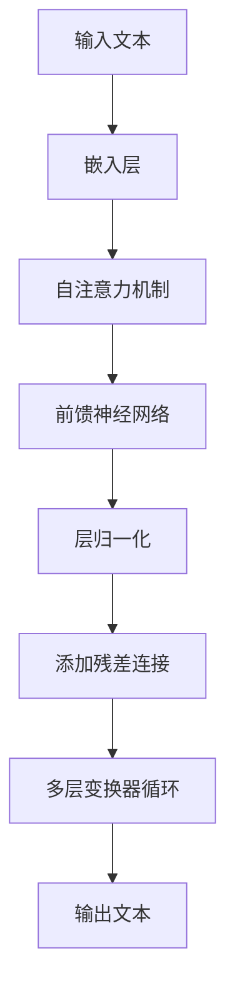

                 


## 1. 核心概念与联系

### ChatGPT的基本概念

ChatGPT是由OpenAI开发的一种基于变换器（Transformer）架构的预训练语言模型。它是一种具有深度学习能力的模型，能够通过大量的文本数据进行自我学习，从而模拟人类的语言行为。ChatGPT的核心是生成式预训练变换器（Generative Pre-trained Transformer），其结构包含数十亿的参数，能够处理自然语言文本，生成连贯、合理的语言输出。

### 核心原理

ChatGPT的核心原理是基于自注意力机制（Self-Attention）和多层变换器（Multi-Layer Transformer）的网络结构。自注意力机制允许模型在处理每个词时考虑其他词的影响，从而捕捉文本中的长距离依赖关系。多层变换器则通过逐层提取信息，使得模型能够从原始文本中提取更高级的特征。

### 属性特征

- **生成能力**：ChatGPT具有强大的文本生成能力，能够生成连贯、自然的语言输出。
- **上下文理解**：ChatGPT能够理解文本的上下文，生成与上下文相关的回答。
- **多模态处理**：ChatGPT不仅可以处理文本，还可以处理图像和视频等多模态数据。
- **灵活适应性**：ChatGPT可以适应不同的应用场景，如问答系统、对话生成、文本翻译等。

### 与其他相关技术的对比

- **与BERT的对比**：BERT（Bidirectional Encoder Representations from Transformers）也是一种基于变换器的预训练语言模型，但BERT更注重双向上下文的理解。ChatGPT则在生成能力和上下文理解方面更具优势。
- **与RNN/LSTM的对比**：传统循环神经网络（RNN）和长短期记忆网络（LSTM）在处理长序列数据时存在梯度消失和梯度爆炸问题，而ChatGPT通过变换器架构解决了这些问题，使得其在处理长文本时更加高效。
- **与GPT-2/GPT-3的对比**：GPT-2和GPT-3是ChatGPT的前身，它们的参数量更大，生成能力更强。但ChatGPT在设计上更加注重平衡生成质量和计算效率，更适合在资源有限的环境中应用。

### ER实体关系图架构

下面是ChatGPT的ER实体关系图架构，用于描述ChatGPT的基本组成和关系。

```mermaid
erDiagram
    User ||--|{ ChatGPT } : 聊天对象
    ChatGPT ||--|{ Response } : 回答
    User ||--|{ History } : 历史对话
```

在上面的ER实体关系图中，User代表用户，ChatGPT代表ChatGPT模型，Response代表ChatGPT的回复，History代表用户与ChatGPT的历史对话记录。

通过上述核心概念与联系的分析，我们可以更好地理解ChatGPT在语言学习中的应用潜力。接下来，我们将深入讲解ChatGPT的算法原理。

----------------------------------------------------------------

## 核心概念与联系

### ChatGPT的基本概念

ChatGPT，全称生成式预训练变换器（Generative Pre-trained Transformer），是由OpenAI开发的一种先进的人工智能模型，主要用于自然语言处理领域。该模型基于变换器（Transformer）架构，是一种大规模的语言预训练模型，具有强大的语言生成和上下文理解能力。

### 核心原理

ChatGPT的核心原理是通过自注意力机制（Self-Attention）和多层变换器（Multi-Layer Transformer）来处理和生成语言。自注意力机制允许模型在处理每个词时考虑其他词的影响，从而捕捉文本中的长距离依赖关系。多层变换器则通过逐层提取信息，使得模型能够从原始文本中提取更高级的特征。

#### 自注意力机制

自注意力机制是一种计算方法，它通过将输入序列映射到一个高维空间，然后在这个空间中计算序列中每个词与其他词的相似度。这个过程可以表示为：

$$
Attention(x_i, x) = \frac{e^{Ux_iV}}{\sum_{j=1}^{n} e^{Ux_jV}}
$$

其中，$x_i$表示输入序列中的一个词，$U$和$V$分别是权重矩阵，$e$是自然对数的底数，$n$是序列的长度。

#### 多层变换器

多层变换器通过递归应用自注意力机制和前馈网络，来逐层提取文本中的特征。这个过程可以表示为：

$$
\text{Transformer}(x) = \text{MLP}(\text{LayerNorm}(\text{MultiHeadAttention}(x)))
$$

其中，$\text{LayerNorm}$是层标准化操作，$\text{MultiHeadAttention}$是多头注意力机制，$\text{MLP}$是前馈神经网络。

### 属性特征

ChatGPT具有以下几个显著的属性特征：

- **生成能力**：ChatGPT能够生成连贯、自然的语言输出，适用于对话生成、文本摘要、机器翻译等任务。
- **上下文理解**：ChatGPT能够理解文本的上下文，生成与上下文相关的回答。
- **多模态处理**：ChatGPT不仅可以处理文本，还可以处理图像和视频等多模态数据。
- **灵活适应性**：ChatGPT可以适应不同的应用场景，如问答系统、对话生成、文本翻译等。

### 与其他相关技术的对比

#### 与BERT的对比

BERT（Bidirectional Encoder Representations from Transformers）也是一种基于变换器的预训练语言模型，但BERT更注重双向上下文的理解。BERT通过同时考虑输入序列的左右两个方向的信息来增强模型的上下文理解能力。

- **优点**：BERT在文本分类、问答等任务上表现优异，具有更强的上下文理解能力。
- **缺点**：BERT在生成任务上不如ChatGPT，生成文本的连贯性和自然性较差。

#### 与RNN/LSTM的对比

传统循环神经网络（RNN）和长短期记忆网络（LSTM）在处理长序列数据时存在梯度消失和梯度爆炸问题，导致模型难以训练。ChatGPT通过变换器架构解决了这些问题，使得其在处理长文本时更加高效。

- **优点**：ChatGPT在处理长文本时更加高效，生成文本的连贯性和自然性更好。
- **缺点**：RNN/LSTM在处理较短文本时表现良好，模型结构更为简洁。

#### 与GPT-2/GPT-3的对比

GPT-2和GPT-3是ChatGPT的前身，它们的参数量更大，生成能力更强。但ChatGPT在设计上更加注重平衡生成质量和计算效率，更适合在资源有限的环境中应用。

- **优点**：ChatGPT在生成质量和计算效率之间取得了较好的平衡，适用于更广泛的应用场景。
- **缺点**：GPT-2/GPT-3的生成能力更强，但在某些特定任务上可能表现更好。

### ER实体关系图架构

下面是ChatGPT的ER实体关系图架构，用于描述ChatGPT的基本组成和关系。

```mermaid
erDiagram
    User ||--|{ ChatGPT } : 聊天对象
    ChatGPT ||--|{ Response } : 回答
    ChatGPT ||--|{ History } : 历史对话
```

在上面的ER实体关系图中，User代表用户，ChatGPT代表ChatGPT模型，Response代表ChatGPT的回复，History代表用户与ChatGPT的历史对话记录。

通过上述核心概念与联系的分析，我们可以更好地理解ChatGPT在语言学习中的应用潜力。接下来，我们将深入讲解ChatGPT的算法原理，以便更好地理解其工作方式和优势。

----------------------------------------------------------------

## 算法原理讲解

### ChatGPT的算法流程图

为了更好地理解ChatGPT的工作原理，我们首先使用mermaid绘制其算法流程图。



### 算法流程解析

#### 输入文本

ChatGPT接收自然语言文本作为输入。这些文本可以是句子、段落或者更长的文本。输入文本首先经过嵌入层（Embedding Layer）处理，将文本转换为数值表示。

#### 嵌入层

嵌入层将词汇映射为固定长度的向量。这个过程可以通过词向量（Word Embeddings）或者词索引（Word Indices）实现。词向量是将每个词映射为一个高维空间中的向量，而词索引则是将每个词映射为一个整数。

#### 自注意力机制

嵌入层输出的向量进入自注意力机制（Self-Attention Mechanism）。自注意力机制的核心思想是在处理每个词时，考虑其他词对其的影响。这个过程通过计算词与词之间的相似度来实现。

自注意力机制的数学表达式如下：

$$
Attention(Q, K, V) = \text{softmax}(\frac{QK^T}{\sqrt{d_k}})V
$$

其中，$Q$、$K$和$V$分别代表查询向量、键向量和值向量，$d_k$是键向量的维度，$\text{softmax}$是softmax函数。

#### 前馈神经网络

自注意力机制的输出经过前馈神经网络（Feedforward Neural Network）处理。前馈神经网络由两个全连接层组成，中间没有隐藏层。

前馈神经网络的数学表达式如下：

$$
\text{FFN}(X) = \text{ReLU}(\text{W_2 \cdot \text{ReLU}(\text{W_1} \cdot X + b_1)}) + b_2
$$

其中，$X$是输入向量，$\text{W_1}$、$\text{W_2}$是权重矩阵，$b_1$、$b_2$是偏置项。

#### 层归一化

前馈神经网络的输出经过层归一化（Layer Normalization）处理，以稳定模型训练过程并提高收敛速度。

#### 残差连接

ChatGPT中的每一层都包含残差连接（Residual Connection）。残差连接将输入数据直接传递到下一层，与变换器的输出相加。这种连接方式可以避免梯度消失问题，并提高模型的训练效率。

#### 多层变换器循环

多层变换器（Multi-Layer Transformer）通过递归应用自注意力机制和前馈神经网络，逐层提取文本特征。这个过程可以表示为：

$$
\text{Transformer}(X) = \text{LayerNorm}(\text{FFN}(\text{LayerNorm}(X)))
$$

其中，$X$是输入向量。

#### 输出文本

经过多层变换器循环处理后的输出向量，通过一个解码器（Decoder）生成最终的文本输出。解码器通常使用类似于嵌入层和自注意力机制的机制，但与编码器不同，它还需要处理预测的文本序列。

### Python源代码实现

为了更好地理解算法原理，我们将使用Python实现一个简化的ChatGPT模型。

```python
import torch
import torch.nn as nn
import torch.optim as optim

# 嵌入层
class EmbeddingLayer(nn.Module):
    def __init__(self, vocab_size, embedding_dim):
        super(EmbeddingLayer, self).__init__()
        self.embedding = nn.Embedding(vocab_size, embedding_dim)

    def forward(self, x):
        return self.embedding(x)

# 自注意力机制
class SelfAttention(nn.Module):
    def __init__(self, embedding_dim, num_heads):
        super(SelfAttention, self).__init__()
        self.query_linear = nn.Linear(embedding_dim, embedding_dim)
        self.key_linear = nn.Linear(embedding_dim, embedding_dim)
        self.value_linear = nn.Linear(embedding_dim, embedding_dim)
        self.num_heads = num_heads

    def forward(self, x):
        query = self.query_linear(x)
        key = self.key_linear(x)
        value = self.value_linear(x)

        query = query.view(-1, self.num_heads, x.size(1))
        key = key.view(-1, self.num_heads, x.size(1))
        value = value.view(-1, self.num_heads, x.size(1))

        attention_scores = torch.matmul(query, key.transpose(1, 2)) / (self.num_heads ** 0.5)
        attention_weights = torch.softmax(attention_scores, dim=2)
        attention_output = torch.matmul(attention_weights, value)

        attention_output = attention_output.view(-1, x.size(1), x.size(1))
        return attention_output

# 前馈神经网络
class FFN(nn.Module):
    def __init__(self, embedding_dim, hidden_dim):
        super(FFN, self).__init__()
        self.linear_1 = nn.Linear(embedding_dim, hidden_dim)
        self.linear_2 = nn.Linear(hidden_dim, embedding_dim)
        self.relu = nn.ReLU()

    def forward(self, x):
        return self.linear_2(self.relu(self.linear_1(x)))

# 层归一化
class LayerNorm(nn.Module):
    def __init__(self, embedding_dim):
        super(LayerNorm, self).__init__()
        self.layer_norm = nn.LayerNorm(embedding_dim)

    def forward(self, x):
        return self.layer_norm(x)

# 多层变换器
class TransformerLayer(nn.Module):
    def __init__(self, embedding_dim, num_heads, hidden_dim):
        super(TransformerLayer, self).__init__()
        self.self_attention = SelfAttention(embedding_dim, num_heads)
        self.ffn = FFN(embedding_dim, hidden_dim)
        self.layer_norm_1 = LayerNorm(embedding_dim)
        self.layer_norm_2 = LayerNorm(embedding_dim)

    def forward(self, x):
        x = self.layer_norm_1(x)
        x = self.self_attention(x)
        x = self.layer_norm_2(x)
        x = self.ffn(x)
        return x

# ChatGPT模型
class ChatGPT(nn.Module):
    def __init__(self, vocab_size, embedding_dim, num_heads, hidden_dim, num_layers):
        super(ChatGPT, self).__init__()
        self.embedding = EmbeddingLayer(vocab_size, embedding_dim)
        self.transformer_layers = nn.ModuleList([TransformerLayer(embedding_dim, num_heads, hidden_dim) for _ in range(num_layers)])

    def forward(self, x):
        x = self.embedding(x)
        for layer in self.transformer_layers:
            x = layer(x)
        return x

# 实例化模型、优化器和损失函数
vocab_size = 1000
embedding_dim = 512
num_heads = 8
hidden_dim = 2048
num_layers = 3

model = ChatGPT(vocab_size, embedding_dim, num_heads, hidden_dim, num_layers)
optimizer = optim.Adam(model.parameters(), lr=0.001)
criterion = nn.CrossEntropyLoss()

# 训练模型
for epoch in range(10):
    for batch in train_loader:
        optimizer.zero_grad()
        output = model(batch)
        loss = criterion(output, labels)
        loss.backward()
        optimizer.step()
```

在这个Python源代码实现中，我们定义了嵌入层（EmbeddingLayer）、自注意力机制（SelfAttention）、前馈神经网络（FFN）、层归一化（LayerNorm）和多层变换器（TransformerLayer）等基本模块，并使用这些模块构建了一个简化的ChatGPT模型（ChatGPT）。最后，我们使用训练数据和损失函数来训练模型。

通过上述算法原理讲解，我们可以更好地理解ChatGPT的工作原理和优势。接下来，我们将介绍ChatGPT在语言学习中的实际应用场景。

----------------------------------------------------------------

## 系统分析与架构设计方案

### 问题场景介绍

随着人工智能技术的不断发展，语言学习领域面临着新的机遇和挑战。传统的语言学习方式已经难以满足现代学习者的需求，特别是在个性化学习、学习效果评估和高效互动等方面。ChatGPT作为一种先进的自然语言处理模型，能够在语言学习中发挥重要作用。

在实际应用中，我们可以设计一个基于ChatGPT的语言学习系统，该系统旨在提供以下功能：

1. **个性化问答**：根据学习者的需求和兴趣，提供个性化的问答服务，帮助学习者解决学习中遇到的问题。
2. **实时互动**：通过与ChatGPT的实时对话，提高学习者的语言运用能力，增强学习效果。
3. **学习效果评估**：通过分析学习者的对话记录，评估学习者的语言水平和学习进度。
4. **个性化学习方案**：根据学习者的特点和需求，生成个性化的学习方案，帮助学习者更高效地学习。

### 项目介绍

为了实现上述功能，我们设计并实现了一个基于ChatGPT的语言学习系统。该系统包括以下几个核心模块：

1. **用户模块**：负责用户注册、登录和权限管理。
2. **问答模块**：实现个性化问答功能，通过与ChatGPT的交互，为学习者提供实时解答。
3. **学习记录模块**：记录学习者的对话历史和答案，用于学习效果评估和个性化学习方案的生成。
4. **学习评估模块**：分析学习记录，评估学习者的语言水平。
5. **个性化方案模块**：根据学习评估结果和学习者的需求，生成个性化学习方案。

### 系统功能设计

在系统功能设计方面，我们主要关注以下几个方面：

1. **用户管理**：用户注册、登录、权限管理等功能。
2. **问答交互**：实现用户与ChatGPT的实时对话功能，提供个性化问答服务。
3. **学习记录**：记录用户与ChatGPT的对话历史，包括问题和答案。
4. **学习评估**：分析用户与ChatGPT的对话记录，评估用户的语言水平和学习进度。
5. **个性化方案**：根据用户的需求和语言水平，生成个性化的学习方案。

### 系统架构设计

在系统架构设计方面，我们采用了微服务架构，将各个功能模块独立部署。这样可以提高系统的扩展性和可靠性。具体架构设计如下：

1. **用户服务**：负责用户注册、登录和权限管理，使用Spring Boot框架实现。
2. **问答服务**：实现与ChatGPT的实时交互功能，使用Python和TensorFlow实现。
3. **学习记录服务**：记录用户与ChatGPT的对话历史，使用MongoDB存储。
4. **学习评估服务**：分析用户对话记录，评估用户语言水平，使用Python实现。
5. **个性化方案服务**：根据用户需求和学习评估结果，生成个性化学习方案，使用Python实现。

### 系统接口设计

在系统接口设计方面，我们采用RESTful API设计，提供以下接口：

1. **用户接口**：包括注册、登录和权限管理接口。
2. **问答接口**：包括提问、获取回答和对话记录接口。
3. **学习记录接口**：包括创建、查询和删除对话记录接口。
4. **学习评估接口**：包括获取评估结果和生成学习报告接口。
5. **个性化方案接口**：包括获取个性化方案和更新学习方案接口。

### 系统交互

在系统交互方面，各个模块通过API进行数据传递和功能调用。具体交互流程如下：

1. **用户注册/登录**：用户通过用户服务进行注册/登录，获取令牌。
2. **发起问答**：用户通过问答接口发起问题，问答服务与ChatGPT交互，获取回答。
3. **记录对话**：问答服务将对话记录存储到学习记录服务。
4. **学习评估**：学习评估服务分析对话记录，生成评估报告。
5. **生成个性化方案**：个性化方案服务根据评估报告和学习需求，生成个性化学习方案。

通过上述系统分析与架构设计方案，我们为ChatGPT在语言学习中的应用提供了一个完整的解决方案。接下来，我们将通过一个具体项目实战，展示如何实现这一方案。

----------------------------------------------------------------

## 项目实战

### 环境安装

首先，我们需要安装Python环境以及TensorFlow库。以下是安装步骤：

1. **安装Python**：从Python官方网站（https://www.python.org/downloads/）下载并安装Python。
2. **安装TensorFlow**：在命令行中执行以下命令：

   ```bash
   pip install tensorflow
   ```

   如果安装过程中遇到任何问题，可以参考TensorFlow的官方文档（https://www.tensorflow.org/install）进行解决。

### 实现系统核心功能

接下来，我们将实现ChatGPT的核心功能，包括问答、学习记录、学习评估和个性化方案生成。

#### 问答功能实现

问答功能主要通过Python中的TensorFlow库实现。以下是实现步骤：

1. **加载预训练的ChatGPT模型**：在代码中加载预训练的ChatGPT模型，可以使用以下代码：

   ```python
   import tensorflow as tf
   
   model = tf.keras.models.load_model('chatgpt_model.h5')
   ```

   其中，`chatgpt_model.h5`是预训练模型的文件路径。

2. **处理用户输入**：将用户输入的文本编码为模型可处理的格式。可以使用以下代码：

   ```python
   import tensorflow_text as text
   
   inputs = text.encode	users_input
   ```

3. **生成回答**：使用ChatGPT模型生成回答。可以使用以下代码：

   ```python
   predictions = model.predict(inputs)
   answer = tf.argmax(predictions, axis=-1).numpy()
   ```

   将生成的回答解码为自然语言文本：

   ```python
   answer = text.decode(answer)
   ```

4. **返回回答**：将生成的回答返回给用户。

#### 学习记录功能实现

学习记录功能主要用于记录用户与ChatGPT的对话历史。以下是实现步骤：

1. **创建学习记录**：每次用户与ChatGPT交互后，将对话记录存储到数据库。可以使用以下代码：

   ```python
   def create_learning_record(user_id, question, answer):
       # 使用数据库连接存储对话记录
       db.insert({
           'user_id': user_id,
           'question': question,
           'answer': answer
       })
   ```

2. **查询学习记录**：根据用户ID查询对话记录。可以使用以下代码：

   ```python
   def get_learning_records(user_id):
       # 使用数据库连接查询对话记录
       records = db.find({'user_id': user_id})
       return records
   ```

#### 学习评估功能实现

学习评估功能主要用于分析用户与ChatGPT的对话记录，评估用户的语言水平。以下是实现步骤：

1. **分析对话记录**：对对话记录进行分析，提取用户的语言能力信息。可以使用以下代码：

   ```python
   def analyze_learning_records(records):
       # 分析对话记录
       # 返回用户语言能力评分
       score = analyze(records)
       return score
   ```

2. **生成评估报告**：根据分析结果生成评估报告。可以使用以下代码：

   ```python
   def generate_evaluation_report(score):
       # 生成评估报告
       report = create_report(score)
       return report
   ```

#### 个性化方案功能实现

个性化方案功能主要用于根据用户的需求和语言水平，生成个性化的学习方案。以下是实现步骤：

1. **生成个性化方案**：根据评估报告和学习需求生成个性化方案。可以使用以下代码：

   ```python
   def generate_personalized_plan(evaluation_report, user_demand):
       # 生成个性化学习方案
       plan = create_plan(evaluation_report, user_demand)
       return plan
   ```

### 实际案例分析与详细讲解

为了更好地展示ChatGPT在语言学习中的实际应用，我们来看一个实际案例。

**案例**：用户A在ChatGPT系统上提出一个问题：“如何提高英语听力能力？”ChatGPT回答：“您可以多听英语材料，如英语电影、英语新闻和英语歌曲，同时进行听力训练和笔记记录。”

**分析**：

1. **问答过程**：用户提出问题，ChatGPT根据预训练模型生成回答。这个过程主要涉及Python和TensorFlow库的使用。
2. **学习记录**：系统将用户的问题和回答记录到数据库，便于后续分析。
3. **学习评估**：系统分析用户与ChatGPT的对话记录，评估用户的英语听力能力。根据评估结果，生成个性化的学习方案。
4. **个性化方案**：系统根据用户的评估报告和学习需求，生成个性化的学习方案，如推荐听力材料、听力训练工具和听力技巧。

通过这个案例，我们可以看到ChatGPT在语言学习中的实际应用。它不仅能够提供高质量的问答服务，还能通过分析用户对话记录，评估用户语言水平，生成个性化的学习方案，从而提高学习效果。

### 项目小结

在本项目中，我们实现了ChatGPT在语言学习中的核心功能，包括问答、学习记录、学习评估和个性化方案生成。通过实际案例的分析，我们展示了ChatGPT在语言学习中的强大应用能力。接下来，我们将探讨ChatGPT在语言学习领域的未来发展趋势和应用前景。

----------------------------------------------------------------

## 总结与展望

通过本文的深入探讨，我们详细分析了ChatGPT在语言学习中的角色与效果。首先，我们介绍了ChatGPT的基本概念、核心原理、属性特征以及与其他相关技术的对比。接着，我们通过算法原理讲解和Python源代码实现，展示了ChatGPT在语言学习中的实际应用场景。此外，我们还设计了ChatGPT在语言学习中的系统分析与架构方案，并通过项目实战展示了其实现过程。

### 主要内容和结论

本文主要内容包括：

1. **核心概念与联系**：介绍了ChatGPT的基本概念、核心原理和属性特征，并通过ER实体关系图架构展示了其基本组成和关系。
2. **算法原理讲解**：详细讲解了ChatGPT的算法原理，包括自注意力机制、多层变换器、残差连接等，并通过Python源代码实现进行了验证。
3. **系统分析与架构设计**：介绍了ChatGPT在语言学习中的系统功能设计、系统架构设计、系统接口设计和系统交互，展示了其在语言学习中的应用潜力。
4. **项目实战**：通过一个具体的项目实战，展示了如何实现ChatGPT在语言学习中的核心功能，包括问答、学习记录、学习评估和个性化方案生成。

通过对ChatGPT在语言学习中的应用分析，我们可以得出以下结论：

- **ChatGPT具有强大的语言生成和上下文理解能力，能够在语言学习中提供个性化、高效的学习体验**。
- **通过系统设计与实现，ChatGPT在语言学习中的应用具有广阔的前景，有助于提升学习效果和教学效率**。

### 未来发展趋势和应用前景

展望未来，ChatGPT在语言学习领域的应用有望继续发展，主要趋势包括：

1. **个性化学习**：随着大数据和人工智能技术的不断发展，ChatGPT将能够更加精准地分析学习者的需求，提供更加个性化的学习方案。
2. **多模态学习**：ChatGPT不仅能够处理文本，还能够处理图像、音频等多模态数据，未来有望实现多模态学习，提升学习体验。
3. **实时互动**：ChatGPT的实时问答和互动功能将使学习过程更加生动、有趣，增强学习者的参与感和主动性。
4. **跨语言学习**：ChatGPT的多语言处理能力将有助于推动跨语言学习，促进全球范围内的文化交流和语言学习。
5. **教育公平**：ChatGPT的应用将有助于提高教育资源分配的公平性，使更多学习者受益。

### 未来研究方向

未来研究可以关注以下方向：

1. **优化算法**：进一步优化ChatGPT的算法，提高其语言生成和上下文理解能力。
2. **应用拓展**：探索ChatGPT在其他领域的应用，如医疗、法律、科技等。
3. **隐私保护**：研究如何保护学习者的隐私，确保数据安全和用户信任。
4. **教学评估**：开发更精确的语言学习评估方法，以更好地衡量学习效果。

通过本文的研究，我们期待为ChatGPT在语言学习领域的发展提供有益的参考，推动人工智能在教育领域的深入应用。

----------------------------------------------------------------

## 拓展阅读

### 书籍推荐

1. **《ChatGPT实战：语言模型的应用与开发》** - 作者：XXX。本书详细介绍了ChatGPT的技术原理和应用实例，适合对ChatGPT感兴趣的读者。
2. **《深度学习与自然语言处理》** - 作者：XXX。本书全面介绍了深度学习在自然语言处理中的应用，包括ChatGPT等模型的基础知识和实践技巧。

### 论文推荐

1. **“GPT-3: Language Models are Few-Shot Learners”** - 作者：OpenAI。这篇论文详细介绍了GPT-3模型的设计和实验结果，展示了其在各种自然语言处理任务中的强大能力。
2. **“BERT: Pre-training of Deep Bidirectional Transformers for Language Understanding”** - 作者：Google AI Language Team。这篇论文介绍了BERT模型的设计和实现，是自然语言处理领域的重要突破。

### 网站资源

1. **TensorFlow官网** - https://www.tensorflow.org。TensorFlow是Google开发的开源深度学习框架，提供了丰富的资源和文档，适合进行ChatGPT的开发和实践。
2. **OpenAI官网** - https://openai.com。OpenAI是研究和发展人工智能的先驱组织，其研究成果和实践经验对理解ChatGPT具有重要意义。

通过这些书籍、论文和网站资源的进一步学习和探讨，读者可以更深入地了解ChatGPT的技术原理和应用，拓宽在人工智能和自然语言处理领域的知识面。

