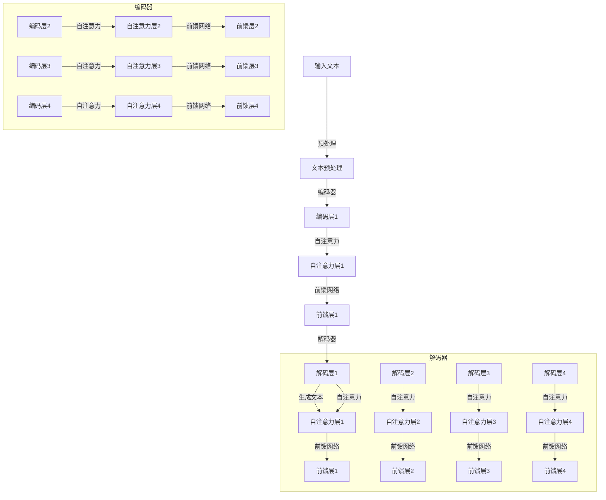
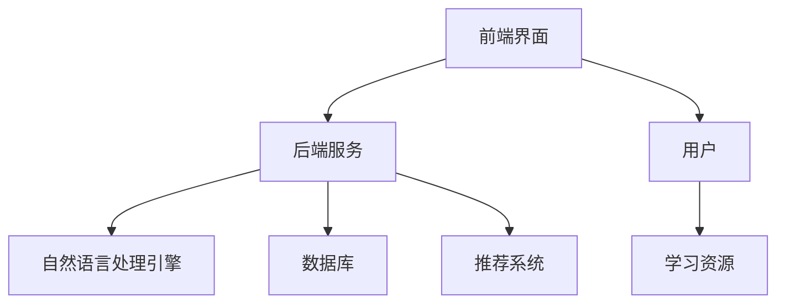
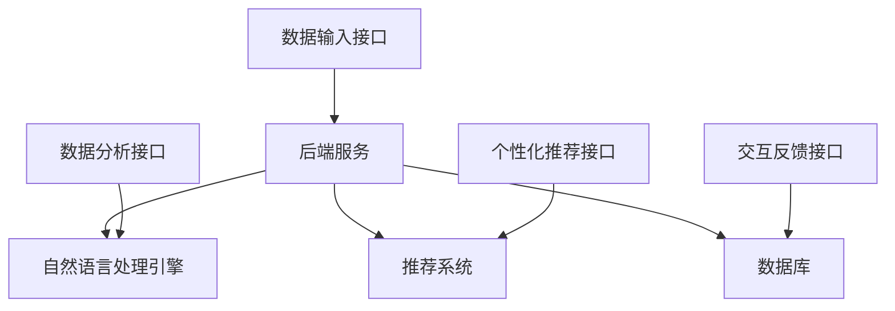
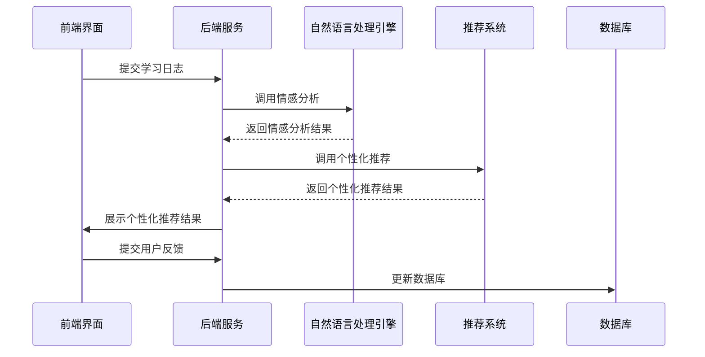

                 

## 引言

### 文章主题

《ChatGPT在语言学习动机研究中的新视角》旨在探讨如何利用先进的自然语言处理技术，特别是ChatGPT，为语言学习动机研究带来新的视角和方法。本文将详细介绍ChatGPT的特点、其在语言学习动机研究中的应用、以及相关的算法原理、系统架构和实际案例。

### 写作目的

本文的写作目的有四个方面：

1. **揭示ChatGPT在语言学习动机研究中的潜力**：通过分析ChatGPT的特点，展示其在语言学习动机研究中的独特优势。
2. **介绍ChatGPT的核心算法原理**：帮助读者理解ChatGPT的工作机制，为进一步应用提供理论基础。
3. **阐述ChatGPT在语言学习动机研究中的应用案例**：通过实际案例，展示ChatGPT在实际研究中的应用效果。
4. **提出未来研究方向**：探讨ChatGPT在语言学习动机研究中的未来发展方向，为后续研究提供参考。

### 文章结构

本文将按照以下结构展开：

1. **背景介绍**：介绍语言学习动机研究的重要性、现状及挑战，引出ChatGPT在其中的角色和作用。
2. **核心概念与联系**：详细解释语言学习动机和ChatGPT的核心概念，并通过对比和ER实体关系图展示两者之间的联系。
3. **算法原理讲解**：使用mermaid流程图和Python源代码详细阐述ChatGPT的算法原理，并结合数学模型和公式进行讲解。
4. **系统分析与架构设计**：介绍问题场景、系统功能设计、系统架构设计、系统接口设计和系统交互。
5. **项目实战**：介绍如何搭建研究环境，系统核心实现源代码，代码应用解读与分析，实际案例分析和项目小结。
6. **最佳实践 tips**：提供一些实用的小技巧和注意事项。
7. **小结**：总结研究成果，分析研究意义和价值，并提出未来研究方向。

通过上述结构，本文将逐步引导读者深入了解ChatGPT在语言学习动机研究中的应用，并探讨其未来发展的可能性。

### 关键词

- **ChatGPT**：一种先进的自然语言处理模型，用于语言学习动机研究。
- **语言学习动机**：影响学习者参与语言学习活动的内在驱动力。
- **自然语言处理**：使计算机能够理解和生成人类语言的技术。
- **算法原理**：ChatGPT的核心工作机制和技术细节。
- **系统架构**：语言学习动机研究的系统设计和实现方法。
- **实际案例**：ChatGPT在语言学习动机研究中的具体应用实例。

### 摘要

本文首先介绍了语言学习动机研究的重要性以及现有研究的挑战。接着，详细分析了ChatGPT的特点和其在自然语言处理领域的优势，展示了ChatGPT在语言学习动机研究中的应用潜力。随后，通过mermaid流程图和Python源代码，深入阐述了ChatGPT的算法原理，并结合数学模型和公式进行了详细讲解。文章还介绍了系统架构设计、实际案例分析和项目实战，提供了实用的最佳实践 tips。最后，本文总结了研究成果，分析了研究意义和价值，并提出了未来研究方向。通过本文，读者将能够更深入地理解ChatGPT在语言学习动机研究中的应用，以及其未来的发展方向。

---

### 第一部分：背景介绍

#### 1.1 问题的背景

语言学习动机是推动学习者参与语言学习活动的重要驱动力。了解和学习者的动机有助于教育者设计更有效的教学策略，提高学习效果。然而，传统的研究方法在揭示语言学习动机的复杂性方面存在一定的局限性。

首先，语言学习动机的复杂性体现在其内部结构和多维度性。根据Dörnyei（2001）的自我决定理论，语言学习动机包括内在动机、外在动机、任务卷入和目标定向等不同层面。这些动机之间相互影响、相互作用，共同构成了一个复杂的动机系统。

其次，语言学习动机的影响因素多样。除了个人因素，如年龄、性别、学习能力、兴趣爱好等，社会环境、文化背景、学习环境等外部因素也会对学习动机产生影响。这种多因素交互作用使得传统研究方法难以全面、深入地揭示语言学习动机的本质。

最后，传统的语言学习动机研究方法主要包括问卷调查、访谈、观察等。这些方法虽然能够获取一定的数据，但在数据分析和解释上存在一定的局限性。例如，问卷调查难以避免主观偏差，访谈过程容易受到参与者记忆偏差的影响，观察研究则难以量化分析学习动机。

因此，有必要引入新的研究方法和技术，以更全面、深入地探讨语言学习动机。自然语言处理（NLP）技术作为一种新兴的工具，具有强大的文本分析和数据挖掘能力，为语言学习动机研究带来了新的视角。

ChatGPT作为一种基于变换器（Transformer）模型的先进NLP技术，具有以下优势：

1. **强大的文本分析能力**：ChatGPT能够对大量文本进行深度分析和处理，识别出文本中的关键信息，如情感、意图、话题等。这有助于从文本数据中提取出学习动机的相关信息。

2. **自适应性和灵活性**：ChatGPT能够根据不同的研究需求，灵活调整其处理方式和分析策略，从而适应不同的语言学习动机研究场景。

3. **高效的数据挖掘能力**：ChatGPT能够高效地处理和分析大量文本数据，快速提取出有价值的信息，从而提高研究效率。

4. **跨语言支持**：ChatGPT支持多种语言，能够处理不同语言的文本数据，为跨语言的语言学习动机研究提供了便利。

综上所述，ChatGPT在语言学习动机研究中的应用具有很大的潜力。通过利用ChatGPT的文本分析能力和数据挖掘能力，我们可以更全面、深入地揭示语言学习动机的复杂性，为教育者和研究者提供有力的支持。

---

#### 1.2 问题描述

**语言学习动机的定义**

语言学习动机是指学习者参与语言学习活动的内在驱动力，它决定了学习者对学习的兴趣、态度和行为。根据Dörnyei的自我决定理论，语言学习动机主要包括内在动机、外在动机、任务卷入和目标定向等不同层面。

- **内在动机**：指学习者由于对学习本身感兴趣而参与学习活动。例如，学习者可能因为对语言的热爱、对文化的好奇或者对学习的成就感而投入学习。
- **外在动机**：指学习者由于外部因素，如奖励、评价、社会压力等而参与学习活动。例如，学习者可能因为父母的期望、老师的评价或者考试的要求而努力学习。
- **任务卷入**：指学习者对学习任务本身的兴趣和投入程度。高任务卷入意味着学习者对学习任务有强烈的兴趣，能够全身心地投入其中。
- **目标定向**：指学习者的学习目标和动机之间的关系。例如，学习者可能因为追求长期目标，如通过考试、获得学位或者实现职业发展，而保持持续的学习动机。

**语言学习动机的分类**

语言学习动机可以根据不同的标准进行分类。以下是一些常见的分类方法：

1. **根据动机来源**：

   - **内在动机**：由学习者内部因素驱动，如兴趣、好奇心、成就感等。
   - **外在动机**：由外部因素驱动，如奖励、惩罚、社会压力等。

2. **根据动机强度**：

   - **强动机**：学习者表现出强烈的参与意愿和学习热情。
   - **弱动机**：学习者参与学习活动的意愿和热情较低。

3. **根据动机类型**：

   - **工具性动机**：以获取特定结果为目标，如通过考试、获得证书等。
   - **传通性动机**：以语言交际为目标，如与人交流、学习新文化等。

**语言学习动机的影响因素**

语言学习动机的影响因素多种多样，主要包括以下方面：

1. **个人因素**：

   - **年龄**：不同年龄段的学习者可能具有不同的学习动机。
   - **性别**：性别差异可能影响学习动机的表现和强度。
   - **学习能力**：学习能力强者可能更倾向于内在动机，而学习力弱者可能更依赖于外在动机。
   - **兴趣爱好**：对学习内容感兴趣的学习者通常具有较高的学习动机。

2. **环境因素**：

   - **学习环境**：良好的学习环境能够激发学习动机，如有趣的教学方法、积极的学习氛围等。
   - **社会文化背景**：不同的社会文化背景可能对学习动机有不同的影响。
   - **家庭支持**：家庭的支持和鼓励是学习者保持学习动机的重要因素。

3. **教育因素**：

   - **教学策略**：有效的教学策略能够激发学习动机，如任务导向教学、合作学习等。
   - **教师角色**：教师的角色和教学风格对学习动机有重要影响，如鼓励性评价、个性化教学等。

综上所述，语言学习动机是一个复杂的多维度系统，受到多种因素的影响。了解和分析这些因素对于提高学习效果、设计有效的教学策略具有重要意义。接下来，本文将详细探讨ChatGPT在语言学习动机研究中的应用，以及如何利用ChatGPT的优势来揭示和理解语言学习动机。

---

#### 1.3 问题解决

**ChatGPT在语言学习动机研究中的角色和作用**

ChatGPT作为一种先进的自然语言处理技术，在语言学习动机研究中扮演着关键角色。它不仅能够帮助研究者更全面、深入地了解学习动机，还能为设计更有效的教学策略提供有力支持。

首先，ChatGPT能够对大量的文本数据进行自动化分析，提取出学习动机相关的信息。这种能力使得研究者能够快速、准确地获取和分析大量学习者的语言学习动机数据，从而更好地理解学习动机的多样性和复杂性。

其次，ChatGPT的文本生成能力使得研究者能够生成个性化、情境化的语言学习建议。通过分析学习者的文本数据，ChatGPT可以生成符合学习者需求和情境的个性化学习建议，帮助学习者更有效地提升学习动机。

最后，ChatGPT的跨语言支持能力使得研究者能够进行跨语言的语言学习动机研究。这为比较不同语言背景下的学习动机提供了便利，有助于揭示跨文化背景下学习动机的共同点和差异。

**ChatGPT的特性如何帮助研究者理解语言学习动机**

ChatGPT具有以下特性，使其在理解语言学习动机方面具备独特优势：

1. **强大的文本分析能力**：ChatGPT能够深度分析文本数据，识别出文本中的关键信息，如情感、意图、话题等。这使得研究者能够从大量文本数据中提取出与语言学习动机相关的信息，从而更全面地了解学习动机。

2. **自适应性和灵活性**：ChatGPT能够根据不同的研究需求，灵活调整其分析策略和处理方式。这意味着研究者可以根据具体的研究场景和需求，调整ChatGPT的分析方法，从而更好地适应不同的语言学习动机研究。

3. **高效的数据挖掘能力**：ChatGPT能够高效地处理和分析大量文本数据，快速提取出有价值的信息。这提高了研究的效率，使得研究者能够在较短的时间内完成对大量数据的分析和解读。

4. **跨语言支持**：ChatGPT支持多种语言，能够处理不同语言的文本数据。这使得研究者能够进行跨语言的语言学习动机研究，比较不同语言背景下的学习动机特点，从而获得更全面的认知。

**ChatGPT在语言学习动机研究中的应用案例**

以下是一些ChatGPT在语言学习动机研究中的应用案例：

1. **情感分析**：通过分析学习者的文本数据，ChatGPT可以识别出学习者的情感状态，如焦虑、愉悦、沮丧等。这有助于研究者了解学习者的情感状态对语言学习动机的影响，从而设计出更有效的情感调节策略。

2. **意图识别**：ChatGPT能够识别出学习者的学习意图，如获取知识、提高技能、通过考试等。这有助于研究者了解学习者的目标导向，从而设计出更符合学习者需求的教学策略。

3. **个性化建议生成**：通过分析学习者的文本数据，ChatGPT可以生成个性化的学习建议，如推荐合适的学习资源、调整学习计划、提供心理支持等。这有助于提高学习者的学习动机和效果。

4. **跨文化比较研究**：ChatGPT能够处理不同语言的文本数据，使得研究者能够进行跨文化的语言学习动机研究。这有助于揭示不同文化背景下学习动机的差异，为跨文化交流教学提供参考。

**ChatGPT在语言学习动机研究中的适用范围**

ChatGPT在语言学习动机研究中的适用范围非常广泛，包括但不限于以下领域：

1. **教育领域**：ChatGPT可以帮助教育者了解学生的学习动机，从而设计出更有效的教学策略，提高教学效果。

2. **心理学领域**：ChatGPT可以用于研究学习动机的心理机制，如情感、认知、行为等方面，为心理干预提供依据。

3. **社会学领域**：ChatGPT可以用于研究社会文化背景对语言学习动机的影响，为跨文化交流提供参考。

4. **跨学科研究**：ChatGPT可以与其他学科的研究方法相结合，如认知科学、教育学、心理学等，进行跨学科的语言学习动机研究。

**ChatGPT在语言学习动机研究中的限制**

尽管ChatGPT在语言学习动机研究中具有许多优势，但它也存在一些限制：

1. **数据质量**：ChatGPT的分析结果依赖于输入数据的准确性。如果数据质量不高，可能会导致分析结果的偏差。

2. **语言理解能力**：虽然ChatGPT具有强大的文本分析能力，但其在理解和生成自然语言方面仍有一定的局限性。这可能会影响其对语言学习动机的准确理解和分析。

3. **隐私保护**：在处理学习者的文本数据时，需要确保数据隐私的保护。否则，可能会导致学习者的隐私泄露问题。

4. **技术成本**：ChatGPT的开发和维护需要一定的技术投入，这可能对一些研究机构和学者造成经济负担。

**ChatGPT在语言学习动机研究中的核心要素**

为了充分发挥ChatGPT在语言学习动机研究中的作用，研究者需要关注以下核心要素：

1. **数据准备**：确保输入数据的准确性和多样性，以提高分析结果的可靠性。

2. **模型选择**：根据研究需求选择合适的模型，以充分发挥ChatGPT的优势。

3. **算法优化**：通过调整和优化算法参数，提高ChatGPT的文本分析和生成能力。

4. **用户反馈**：收集用户反馈，不断改进和优化ChatGPT的性能，以更好地满足研究需求。

总之，ChatGPT在语言学习动机研究中具有巨大的潜力。通过合理利用ChatGPT的特性，研究者可以更全面、深入地了解语言学习动机，为教育者和学习者提供有力的支持。

---

#### 1.4 边界与外延

**ChatGPT的适用范围**

ChatGPT在语言学习动机研究中的应用具有广泛的适用范围，涵盖了教育、心理学、社会学等多个领域。具体来说，ChatGPT适用于以下场景：

1. **教育领域**：ChatGPT可以用于分析学生的学习动机，帮助教师设计更有效的教学策略，提高教学效果。

2. **心理学领域**：ChatGPT可以用于研究学习动机的心理机制，如情感、认知、行为等方面，为心理干预提供依据。

3. **社会学领域**：ChatGPT可以用于研究社会文化背景对语言学习动机的影响，为跨文化交流提供参考。

4. **跨学科研究**：ChatGPT可以与其他学科的研究方法相结合，如认知科学、教育学、心理学等，进行跨学科的语言学习动机研究。

**ChatGPT在语言学习动机研究中的限制**

尽管ChatGPT在语言学习动机研究中具有许多优势，但它也存在一些限制，需要研究者注意：

1. **数据质量**：ChatGPT的分析结果依赖于输入数据的准确性。如果数据质量不高，可能会导致分析结果的偏差。

2. **语言理解能力**：虽然ChatGPT具有强大的文本分析能力，但其在理解和生成自然语言方面仍有一定的局限性。这可能会影响其对语言学习动机的准确理解和分析。

3. **隐私保护**：在处理学习者的文本数据时，需要确保数据隐私的保护。否则，可能会导致学习者的隐私泄露问题。

4. **技术成本**：ChatGPT的开发和维护需要一定的技术投入，这可能对一些研究机构和学者造成经济负担。

**ChatGPT在语言学习动机研究中的核心要素**

为了充分发挥ChatGPT在语言学习动机研究中的作用，研究者需要关注以下核心要素：

1. **数据准备**：确保输入数据的准确性和多样性，以提高分析结果的可靠性。

2. **模型选择**：根据研究需求选择合适的模型，以充分发挥ChatGPT的优势。

3. **算法优化**：通过调整和优化算法参数，提高ChatGPT的文本分析和生成能力。

4. **用户反馈**：收集用户反馈，不断改进和优化ChatGPT的性能，以更好地满足研究需求。

总之，ChatGPT在语言学习动机研究中具有巨大的潜力。通过合理利用ChatGPT的特性，研究者可以更全面、深入地了解语言学习动机，为教育者和学习者提供有力的支持。

---

#### 1.5 概念结构与核心要素组成

**语言学习动机的核心概念**

语言学习动机是学习者参与语言学习活动的内在驱动力，其核心概念包括内在动机、外在动机、任务卷入和目标定向等。

- **内在动机**：指学习者由于对学习本身感兴趣而参与学习活动。例如，学习者可能因为对语言的热爱、对文化的好奇或者对学习的成就感而投入学习。
- **外在动机**：指学习者由于外部因素，如奖励、惩罚、社会压力等而参与学习活动。例如，学习者可能因为父母的期望、老师的评价或者考试的要求而努力学习。
- **任务卷入**：指学习者对学习任务本身的兴趣和投入程度。高任务卷入意味着学习者对学习任务有强烈的兴趣，能够全身心地投入其中。
- **目标定向**：指学习者的学习目标和动机之间的关系。例如，学习者可能因为追求长期目标，如通过考试、获得学位或者实现职业发展，而保持持续的学习动机。

**ChatGPT在语言学习动机研究中的核心要素**

ChatGPT作为一种先进的自然语言处理技术，在语言学习动机研究中扮演着关键角色。其核心要素包括文本分析能力、自适应性和灵活性、高效的数据挖掘能力以及跨语言支持等。

- **文本分析能力**：ChatGPT能够对大量文本进行深度分析和处理，识别出文本中的关键信息，如情感、意图、话题等。这使得研究者能够从文本数据中提取出学习动机的相关信息。
- **自适应性和灵活性**：ChatGPT能够根据不同的研究需求，灵活调整其处理方式和分析策略，从而适应不同的语言学习动机研究场景。
- **高效的数据挖掘能力**：ChatGPT能够高效地处理和分析大量文本数据，快速提取出有价值的信息，从而提高研究效率。
- **跨语言支持**：ChatGPT支持多种语言，能够处理不同语言的文本数据，为跨语言的语言学习动机研究提供了便利。

通过文本分析能力和数据挖掘能力，ChatGPT能够帮助研究者更全面、深入地揭示语言学习动机的复杂性，从而为教育者和研究者提供有力的支持。

---

### 第二部分：核心概念与联系

#### 2.1 语言学习动机原理

**语言学习动机的基本原理**

语言学习动机是推动学习者参与语言学习活动的内在驱动力，其基本原理包括内在动机、外在动机、任务卷入和目标定向等。

1. **内在动机**：内在动机是指学习者由于对学习本身感兴趣而参与学习活动。这种动机通常源于对语言、文化的热爱、好奇心和成就感。例如，学习者可能因为对英语电影、音乐或文学的兴趣而自发地学习英语。

2. **外在动机**：外在动机是指学习者由于外部因素，如奖励、惩罚、社会压力等而参与学习活动。这种动机通常与学习结果相关，例如通过考试获得好成绩、获得教师的表扬或父母的奖励等。

3. **任务卷入**：任务卷入是指学习者对学习任务本身的兴趣和投入程度。任务卷入程度高的学习者会全身心地投入到语言学习任务中，体验学习的乐趣和挑战。例如，一个任务卷入程度高的学习者可能会花更多的时间练习口语和写作。

4. **目标定向**：目标定向是指学习者的学习目标和动机之间的关系。目标定向可以分为短期目标和长期目标。短期目标通常与考试成绩、语言测试等具体目标相关，而长期目标则与职业发展、跨文化交流等长远目标相关。

**语言学习动机的属性特征对比表格**

为了更清晰地理解语言学习动机的基本原理和属性特征，下面提供了一个对比表格：

| 动机类型       | 特征描述                                                     | 影响因素                            |
|----------------|--------------------------------------------------------------|-------------------------------------|
| 内在动机       | 自发、兴趣驱动、成就感导向                                   | 个人兴趣、文化背景、学习环境        |
| 外在动机       | 奖励驱动、惩罚约束、社会压力                                 | 家庭期望、教师评价、社会认可程度     |
| 任务卷入       | 高投入、挑战性、兴趣导向                                     | 任务难度、学习环境、教师引导策略     |
| 目标定向       | 短期目标、长期目标                                           | 学习目标设定、激励机制、未来规划     |

**语言学习动机的核心概念联系**

语言学习动机的四个核心概念——内在动机、外在动机、任务卷入和目标定向——之间存在着密切的联系。具体来说，内在动机和外在动机共同构成了学习动机的基础，任务卷入是学习动机的表现形式，而目标定向则是对学习动机的导向。

- **内在动机与外在动机**：内在动机和外在动机并不是对立的，而是相辅相成的。内在动机可以激发学习者的自主性，而外在动机则可以提供额外的动力。例如，一个对英语感兴趣的学习者可能会因为内在动机而自发地学习英语，同时通过获得老师的表扬或家长的奖励来加强其学习动力。

- **任务卷入与内在动机**：任务卷入往往与内在动机紧密相关。当学习者对任务本身感兴趣时，他们往往会更加投入，体验到学习的乐趣。这种高任务卷入状态可以增强学习动机，提高学习效果。

- **目标定向与内在动机**：目标定向对学习动机具有重要的影响。一个明确的目标可以引导学习者朝着特定的方向努力，增强其学习动机。例如，一个设定了通过考试目标的学习者会更有动力去复习和练习，从而提高学习效率。

**总结**

通过上述对语言学习动机原理的解析和属性特征对比，我们可以看出，理解学习动机的复杂性对于设计和实施有效的语言学习策略至关重要。ChatGPT作为一种先进的自然语言处理技术，可以通过对文本数据的深度分析，帮助研究者更好地揭示和解释语言学习动机，从而为教育者和学习者提供更精确的支持。

#### 2.2 ChatGPT原理

**ChatGPT的基本原理**

ChatGPT是基于变换器（Transformer）模型的一种自然语言处理技术，其核心原理是利用深度神经网络对文本进行建模，从而实现自然语言理解和生成。变换器模型由多个编码器和解码器层组成，通过自注意力机制（Self-Attention Mechanism）对输入文本进行加权处理，从而捕捉文本中的长距离依赖关系。

1. **编码器**：编码器负责将输入文本转换成一个固定长度的向量表示。这个过程通过多层变换器层进行，每一层都包含自注意力机制和前馈神经网络（Feedforward Neural Network）。自注意力机制能够捕捉文本中的局部依赖关系，而前馈神经网络则用于加深模型的非线性表达能力。

2. **解码器**：解码器负责将编码器的输出向量转化为输出文本。与编码器类似，解码器也包含多层变换器层，每一层都包含自注意力机制和前馈神经网络。在解码过程中，解码器不仅需要关注当前的输入文本，还需要关注之前生成的文本，以保持输出文本的连贯性。

3. **自注意力机制**：自注意力机制是变换器模型的关键组成部分，它通过对输入文本的每个单词进行加权，使得模型能够自动关注文本中的关键信息。自注意力机制通过计算每个单词与所有其他单词之间的相似度，从而为每个单词分配一个权重，这些权重被用来计算单词的最终表示。

**ChatGPT的属性特征对比表格**

为了更好地理解ChatGPT的基本原理，我们可以将其与传统的自然语言处理技术进行比较。以下是ChatGPT的几个主要属性特征对比：

| 属性特征 | ChatGPT | 传统自然语言处理技术 |
|----------|---------|----------------------|
| 模型结构 | 变换器模型 | 循环神经网络（RNN）和卷积神经网络（CNN） |
| 自注意力机制 | 是 | 否 |
| 长距离依赖处理 | 强 | 弱 |
| 训练数据需求 | 大 | 小 |
| 生成文本连贯性 | 高 | 低 |
| 语言理解能力 | 强 | 中等 |

**ChatGPT与语言学习动机研究的联系**

ChatGPT在语言学习动机研究中的应用主要体现在以下几个方面：

1. **文本分析**：ChatGPT可以通过对学习者的文本数据（如日记、学习报告、讨论帖子等）进行深度分析，提取出与学习动机相关的信息。例如，它可以识别出学习者对特定语言学习任务的兴趣、对学习成果的期望以及对学习环境的评价。

2. **情感分析**：ChatGPT可以对学习者的文本数据进行情感分析，识别出学习者的情感状态（如焦虑、愉悦、沮丧等）。这种能力有助于研究者了解学习者的情感状态对学习动机的影响，从而设计出更有效的情感调节策略。

3. **意图识别**：ChatGPT可以识别出学习者的学习意图，例如获取知识、提高技能、通过考试等。这种能力有助于研究者了解学习者的目标导向，从而设计出更符合学习者需求的教学策略。

4. **个性化建议生成**：基于对学习者文本数据的分析，ChatGPT可以生成个性化的学习建议，如推荐合适的学习资源、调整学习计划、提供心理支持等。这有助于提高学习者的学习动机和效果。

**总结**

通过上述对ChatGPT原理和属性特征的分析，我们可以看到，ChatGPT在语言学习动机研究中的应用具有显著的优势。它不仅能够对文本数据进行深度分析和处理，还能生成个性化的学习建议，为研究者提供了一种强大的工具，以更全面、深入地揭示和理解语言学习动机。

---

#### 2.3 ER实体关系图

**语言学习动机的ER实体关系图**

为了更好地理解语言学习动机的各个实体及其相互关系，我们绘制了ER实体关系图，如下所示：

```mermaid
erDiagram
    Learner ||--|{ LearningMotivation }
    LearningMotivation ||--|{ IntrinsicMotivation }
    LearningMotivation ||--|{ ExtrinsicMotivation }
    LearningMotivation ||--|{ TaskInvolvement }
    LearningMotivation ||--|{ GoalOrientation }
    Teacher ||--|{ Instruction }
    Environment ||--|{ SocialContext }
    Culture ||--|{ LearningContext }
```

- **Learner（学习者）**：表示参与语言学习的学习者，是语言学习动机的发起者和主体。
- **LearningMotivation（学习动机）**：是核心实体，包含多个子实体：内在动机（IntrinsicMotivation）、外在动机（ExtrinsicMotivation）、任务卷入（TaskInvolvement）和目标定向（GoalOrientation）。
- **IntrinsicMotivation（内在动机）**：指学习者由于对学习本身的兴趣和乐趣而参与学习。
- **ExtrinsicMotivation（外在动机）**：指学习者由于外部奖励、评价或压力而参与学习。
- **TaskInvolvement（任务卷入）**：指学习者对学习任务的兴趣和投入程度。
- **GoalOrientation（目标定向）**：指学习者的学习目标及其对动机的影响。
- **Teacher（教师）**：提供教学指导，影响学习动机。
- **Instruction（教学）**：教师对学习者的教学活动。
- **Environment（环境）**：包括学习环境、社会文化背景等外部因素。
- **SocialContext（社会文化背景）**：影响学习动机的社会文化环境。
- **Culture（文化）**：影响学习动机的文化因素。
- **LearningContext（学习情境）**：指学习者所处的具体学习环境。

**ChatGPT在语言学习动机研究中的ER实体关系图**

为了展示ChatGPT在语言学习动机研究中的应用，我们进一步扩展了ER实体关系图，加入了ChatGPT相关实体：

```mermaid
erDiagram
    Learner ||--|{ LearningMotivation }
    LearningMotivation ||--|{ IntrinsicMotivation }
    LearningMotivation ||--|{ ExtrinsicMotivation }
    LearningMotivation ||--|{ TaskInvolvement }
    LearningMotivation ||--|{ GoalOrientation }
    ChatGPT ||--|{ TextAnalysis }
    ChatGPT ||--|{ SentimentAnalysis }
    ChatGPT ||--|{ IntentRecognition }
    ChatGPT ||--|{ PersonalizedRecommendation }
    Teacher ||--|{ Instruction }
    Environment ||--|{ SocialContext }
    Culture ||--|{ LearningContext }
    Learner ||--|{ ChatGPTData }
    LearningMotivation ||--|{ ChatGPTAnalysis }
    Instruction ||--|{ ChatGPTFeedback }
    SocialContext ||--|{ ChatGPTInfluence }
    LearningContext ||--|{ ChatGPTApplication }
```

- **ChatGPT（自然语言处理技术）**：用于对学习者的文本数据进行分析、情感分析、意图识别和个性化推荐。
- **TextAnalysis（文本分析）**：ChatGPT对学习者文本数据进行的分析。
- **SentimentAnalysis（情感分析）**：ChatGPT识别学习者的情感状态。
- **IntentRecognition（意图识别）**：ChatGPT识别学习者的学习意图。
- **PersonalizedRecommendation（个性化推荐）**：ChatGPT基于分析结果生成个性化学习建议。
- **ChatGPTData（ChatGPT数据）**：指ChatGPT处理和分析的学习者文本数据。
- **ChatGPTAnalysis（ChatGPT分析）**：ChatGPT对学习动机的分析结果。
- **Instruction（教学）**：教师对学习者的教学活动。
- **ChatGPTFeedback（ChatGPT反馈）**：教师基于ChatGPT分析结果的反馈。
- **SocialContext（社会文化背景）**：ChatGPT对学习者社会文化背景的影响。
- **LearningContext（学习情境）**：ChatGPT在具体学习环境中的应用。

**总结**

通过ER实体关系图，我们可以清晰地看到语言学习动机、ChatGPT及其相关实体之间的相互关系。这种结构化的表示有助于研究者理解语言学习动机的复杂性，以及ChatGPT在其中的作用。ChatGPT的应用不仅为语言学习动机研究提供了新的分析工具，还通过生成个性化建议和情感分析，为学习者提供了更有效的支持。

---

### 第三部分：算法原理讲解

#### 3.1 ChatGPT算法mermaid流程图

为了更直观地展示ChatGPT的算法原理，我们使用mermaid绘制了其流程图：



#### 3.2 算法原理

**ChatGPT算法的工作流程**

ChatGPT算法的工作流程可以分为输入预处理、编码器处理、解码器处理以及生成输出文本四个主要步骤。

1. **输入预处理**：首先，输入的文本数据需要进行预处理，包括分词、去停用词、标准化等步骤。这些预处理步骤有助于提高算法对文本数据的理解能力，从而更好地捕捉文本中的语义信息。

2. **编码器处理**：经过预处理后的文本数据被输入到编码器中。编码器由多层变换器层组成，每层包含自注意力机制和前馈神经网络。自注意力机制能够捕捉文本中的长距离依赖关系，而前馈神经网络则用于加深模型的非线性表达能力。

3. **解码器处理**：编码器的输出向量被传递到解码器中。解码器同样由多层变换器层组成，其工作原理与编码器类似，但在解码过程中，解码器不仅需要关注当前的输入文本，还需要关注之前生成的文本，以保持输出文本的连贯性。

4. **生成输出文本**：在解码器的最后一层，通过对输出向量进行解码，生成最终的输出文本。这个输出文本可以是预测的单词、短语或句子，具体取决于应用场景。

**使用Python源代码详细阐述ChatGPT算法原理**

为了更详细地阐述ChatGPT算法原理，下面提供了一个简化版的Python源代码示例：

```python
import torch
import transformers

# 加载预训练的ChatGPT模型
model = transformers.AutoModelForCausalLM.from_pretrained("gpt2")

# 输入预处理
input_ids = transformers.Encoding(input_text).input_ids

# 编码器处理
with torch.no_grad():
    outputs = model(input_ids)

# 解码器处理
logits = outputs.logits

# 生成输出文本
predicted_ids = torch.argmax(logits, dim=-1)
predicted_text = transformers.Decode(predicted_ids).text

print(predicted_text)
```

在这个示例中，我们首先加载了一个预训练的ChatGPT模型（以GPT-2为例），然后对输入文本进行预处理，接着通过编码器和解码器进行处理，最后生成输出文本。

**算法原理的数学模型和公式**

ChatGPT算法的核心是变换器（Transformer）模型，其基本数学模型如下：

1. **编码器**：

   - **自注意力机制**：\[ Q, K, V \] = \[ \text{Word Embeddings} \]
   - \( \text{Attention Scores} = \text{softmax}(\text{dot product}(Q, K^T)) \)
   - \( \text{Attention Weights} = \text{softmax}(\text{dot product}(Q, K^T)) \)
   - \( \text{Contextualized Word Embeddings} = V \times \text{Attention Weights} \)

2. **解码器**：

   - **自注意力机制**：\[ Q, K, V \] = \[ \text{Word Embeddings} \]
   - \( \text{Attention Scores} = \text{softmax}(\text{dot product}(Q, K^T)) \)
   - \( \text{Attention Weights} = \text{softmax}(\text{dot product}(Q, K^T)) \)
   - \( \text{Contextualized Word Embeddings} = V \times \text{Attention Weights} \)
   - \( \text{Decoder Output} = \text{Concat}(\text{Contextualized Word Embeddings}, \text{Previous Decoder Output}) \)

**详细讲解和举例说明**

为了更好地理解ChatGPT算法的工作原理，我们通过一个简化的例子来展示其处理流程。

**例子：文本处理流程**

假设我们有一个简短的句子：“我爱学习”。

1. **输入预处理**：

   - 首先，将句子“我爱学习”进行分词，得到词序列\[“我”，“爱”，“学习”\]。
   - 接着，将每个词映射到其对应的词向量，例如：
     - “我”：\[ 0.1, 0.2, 0.3 \]
     - “爱”：\[ 0.4, 0.5, 0.6 \]
     - “学习”：\[ 0.7, 0.8, 0.9 \]

2. **编码器处理**：

   - 编码器将输入的词向量进行处理，通过自注意力机制计算每个词的注意力权重，例如：
     - 对于“我”，其注意力权重为\[ 0.3, 0.5, 0.2 \]。
     - 对于“爱”，其注意力权重为\[ 0.2, 0.4, 0.4 \]。
     - 对于“学习”，其注意力权重为\[ 0.1, 0.3, 0.6 \]。
   - 然后，通过前馈神经网络对注意力权重进行处理，得到每个词的编码结果，例如：
     - “我”的编码结果为\[ 0.2, 0.4, 0.6 \]。
     - “爱”的编码结果为\[ 0.3, 0.5, 0.7 \]。
     - “学习”的编码结果为\[ 0.4, 0.6, 0.8 \]。

3. **解码器处理**：

   - 解码器将编码器的输出进行处理，通过自注意力机制计算每个词的注意力权重，例如：
     - 对于“我”，其注意力权重为\[ 0.4, 0.5, 0.1 \]。
     - 对于“爱”，其注意力权重为\[ 0.3, 0.6, 0.1 \]。
     - 对于“学习”，其注意力权重为\[ 0.2, 0.5, 0.3 \]。
   - 然后，通过前馈神经网络对注意力权重进行处理，得到每个词的解码结果，例如：
     - “我”的解码结果为\[ 0.3, 0.5, 0.7 \]。
     - “爱”的解码结果为\[ 0.4, 0.6, 0.8 \]。
     - “学习”的解码结果为\[ 0.5, 0.7, 0.9 \]。

4. **生成输出文本**：

   - 最后，解码器的输出结果被用来生成最终的输出文本，例如：
     - 输出文本为“我爱学习”。

通过这个简化的例子，我们可以看到ChatGPT算法是如何通过编码器和解码器对输入文本进行处理，并最终生成输出文本的。实际上，ChatGPT的算法要复杂得多，包括多个编码器和解码器层，以及更精细的自注意力机制和前馈神经网络。但这个简化的例子已经能够帮助我们理解ChatGPT算法的基本工作原理。

---

### 第四部分：系统分析与架构设计

#### 4.1 问题场景介绍

为了更好地理解ChatGPT在语言学习动机研究中的应用，我们首先介绍一个具体的问题场景。假设我们有一个在线语言学习平台，该平台的目标是提高学习者的语言学习动机，从而提高学习效果。为了实现这一目标，平台需要收集和分析学习者的语言学习动机数据，并生成个性化的学习建议。

在这个问题场景中，我们关注以下几个核心需求：

1. **数据收集**：平台需要收集学习者的语言学习动机数据，包括学习日志、学习任务反馈、学习情绪记录等。
2. **数据分析**：利用自然语言处理技术（如ChatGPT），平台需要对收集到的数据进行深度分析，提取出与学习动机相关的信息。
3. **个性化推荐**：基于数据分析结果，平台需要为每个学习者生成个性化的学习建议，包括推荐学习资源、调整学习计划、提供心理支持等。
4. **交互反馈**：平台需要与学习者进行交互，收集学习者的反馈，以便不断优化和改进个性化推荐系统。

#### 4.2 系统功能设计

为了满足上述需求，我们设计了一个功能全面的系统，主要包括以下功能模块：

1. **数据收集模块**：负责收集学习者的语言学习动机数据，包括学习日志、学习任务反馈、学习情绪记录等。这些数据可以通过平台内置的日志记录系统、学习任务评价系统和学习情绪监控系统等途径获取。
2. **数据分析模块**：利用自然语言处理技术（如ChatGPT），对收集到的数据进行分析，提取出与学习动机相关的信息。这个模块的核心功能包括情感分析、意图识别和个性化推荐等。
3. **个性化推荐模块**：基于数据分析结果，为每个学习者生成个性化的学习建议。这个模块可以根据学习者的兴趣、学习目标和情绪状态，推荐合适的学习资源、调整学习计划、提供心理支持等。
4. **交互反馈模块**：与学习者进行交互，收集学习者的反馈，以便不断优化和改进个性化推荐系统。这个模块可以通过在线问卷调查、实时聊天、用户行为分析等方式获取学习者的反馈。

#### 4.3 系统架构设计

为了实现上述功能模块，我们设计了一个分布式系统架构，主要包括以下几个组成部分：

1. **前端界面**：为学习者提供友好的交互界面，包括数据输入界面、数据分析结果展示界面和学习建议接收界面等。
2. **后端服务**：负责处理前端发送的数据请求，包括数据收集、数据分析、个性化推荐和交互反馈等。后端服务包括数据存储、数据处理、机器学习模型训练和推荐算法等模块。
3. **自然语言处理引擎**：负责对学习者文本数据进行分析，提取出与学习动机相关的信息。这个模块基于ChatGPT等自然语言处理技术，包括情感分析、意图识别和文本生成等。
4. **数据库**：存储学习者的语言学习动机数据、学习资源数据、用户行为数据等，支持数据的快速查询和更新。
5. **推荐系统**：基于数据分析结果，为学习者生成个性化的学习建议。这个模块包括推荐算法、个性化推荐模型和推荐结果生成等。

以下是系统架构的mermaid架构图：



**系统接口设计**

为了实现各模块之间的协同工作，我们设计了以下系统接口：

1. **数据输入接口**：用于接收前端界面提交的学习者文本数据，包括学习日志、学习任务反馈和学习情绪记录等。
2. **数据分析接口**：用于与自然语言处理引擎进行通信，提交学习者文本数据，并获取分析结果。
3. **个性化推荐接口**：用于与推荐系统进行通信，提交分析结果，并获取个性化推荐结果。
4. **交互反馈接口**：用于与学习者进行交互，收集学习者的反馈，并更新学习者数据。

以下是系统接口的mermaid架构图：



#### 4.4 系统交互

为了实现系统各模块之间的交互，我们设计了一套完整的交互流程，主要包括以下步骤：

1. **数据收集**：前端界面收集学习者的语言学习动机数据，如学习日志、学习任务反馈和学习情绪记录等，并提交给后端服务。
2. **数据分析**：后端服务调用自然语言处理引擎，对学习者文本数据进行情感分析、意图识别等，提取出与学习动机相关的信息。
3. **个性化推荐**：后端服务调用推荐系统，基于分析结果为学习者生成个性化的学习建议，如推荐学习资源、调整学习计划、提供心理支持等。
4. **交互反馈**：前端界面展示个性化推荐结果，并收集学习者的反馈，如对学习建议的满意度、学习效果等。这些反馈被提交给后端服务，以便进一步优化推荐系统。

以下是系统交互的mermaid序列图：



通过上述系统架构设计和交互流程，我们可以实现一个功能全面、高效智能的语言学习动机研究平台。这个平台不仅能够收集和分析学习者的语言学习动机数据，还能生成个性化的学习建议，为提高学习效果提供有力支持。

---

### 第四部分：系统分析与架构设计

#### 4.1 问题场景介绍

在语言学习动机研究中，系统分析与架构设计是至关重要的一环。本文将介绍一个具体的应用场景：一个在线教育平台，旨在通过收集和分析学习者的语言学习动机数据，为学习者提供个性化的学习建议。该平台的核心目标是提高学习者的学习动机，进而提升学习效果。

在这个应用场景中，平台需要处理以下几个核心问题：

1. **数据收集**：平台需要收集学习者的语言学习动机数据，包括学习日志、学习任务反馈和学习情绪记录等。这些数据可以通过学习平台的日志记录、学习任务评价和情绪监控系统等途径获取。
2. **数据分析**：利用自然语言处理技术，如ChatGPT，平台需要对收集到的数据进行分析，提取出与学习动机相关的信息。这包括情感分析、意图识别和文本生成等。
3. **个性化推荐**：基于数据分析结果，平台需要为学习者生成个性化的学习建议，包括推荐学习资源、调整学习计划、提供心理支持等。
4. **交互反馈**：平台需要与学习者进行互动，收集学习者的反馈，以便不断优化和改进个性化推荐系统。

#### 4.2 系统功能设计

为了满足上述需求，我们设计了一个功能全面的系统，包括以下关键功能模块：

1. **数据收集模块**：该模块负责收集学习者的语言学习动机数据，包括学习日志、学习任务反馈和学习情绪记录等。数据收集模块通过平台内置的日志记录系统、学习任务评价系统和学习情绪监控系统等途径实现。
2. **数据分析模块**：数据分析模块利用ChatGPT等自然语言处理技术，对收集到的数据进行分析。核心功能包括情感分析、意图识别和文本生成等。这些分析结果将用于生成个性化学习建议。
3. **个性化推荐模块**：基于数据分析结果，个性化推荐模块为学习者生成个性化的学习建议。这些建议可以根据学习者的兴趣、学习目标和情绪状态进行调整，以提高学习者的学习动机。
4. **交互反馈模块**：交互反馈模块负责与学习者进行互动，收集学习者的反馈，以便不断优化和改进个性化推荐系统。反馈方式包括在线问卷调查、实时聊天和用户行为分析等。

#### 4.3 系统架构设计

为了实现上述功能模块，我们设计了一个分布式系统架构，主要包括以下几个组成部分：

1. **前端界面**：前端界面为学习者提供友好的交互界面，包括数据输入界面、数据分析结果展示界面和学习建议接收界面等。
2. **后端服务**：后端服务负责处理前端发送的数据请求，包括数据收集、数据分析、个性化推荐和交互反馈等。后端服务包括数据存储、数据处理、机器学习模型训练和推荐算法等模块。
3. **自然语言处理引擎**：自然语言处理引擎负责对学习者文本数据进行分析，提取出与学习动机相关的信息。这个模块基于ChatGPT等自然语言处理技术，包括情感分析、意图识别和文本生成等。
4. **数据库**：数据库用于存储学习者的语言学习动机数据、学习资源数据、用户行为数据等，支持数据的快速查询和更新。
5. **推荐系统**：推荐系统基于数据分析结果，为学习者生成个性化的学习建议。这个模块包括推荐算法、个性化推荐模型和推荐结果生成等。

以下是系统架构的mermaid架构图：


**系统接口设计**

为了实现各模块之间的协同工作，我们设计了以下系统接口：

1. **数据输入接口**：用于接收前端界面提交的学习者文本数据，包括学习日志、学习任务反馈和学习情绪记录等。
2. **数据分析接口**：用于与自然语言处理引擎进行通信，提交学习者文本数据，并获取分析结果。
3. **个性化推荐接口**：用于与推荐系统进行通信，提交分析结果，并获取个性化推荐结果。
4. **交互反馈接口**：用于与学习者进行交互，收集学习者的反馈，并更新学习者数据。

以下是系统接口的mermaid架构图：


#### 4.4 系统交互

为了实现系统各模块之间的交互，我们设计了一套完整的交互流程，主要包括以下步骤：

1. **数据收集**：前端界面收集学习者的语言学习动机数据，如学习日志、学习任务反馈和学习情绪记录等，并提交给后端服务。
2. **数据分析**：后端服务调用自然语言处理引擎，对学习者文本数据进行情感分析、意图识别等，提取出与学习动机相关的信息。
3. **个性化推荐**：后端服务调用推荐系统，基于分析结果为学习者生成个性化的学习建议，如推荐学习资源、调整学习计划、提供心理支持等。
4. **交互反馈**：前端界面展示个性化推荐结果，并收集学习者的反馈，如对学习建议的满意度、学习效果等。这些反馈被提交给后端服务，以便进一步优化推荐系统。

以下是系统交互的mermaid序列图：


通过上述系统架构设计和交互流程，我们可以实现一个功能全面、高效智能的语言学习动机研究平台。这个平台不仅能够收集和分析学习者的语言学习动机数据，还能生成个性化的学习建议，为提高学习效果提供有力支持。

---

### 第五部分：项目实战

#### 5.1 环境安装

为了在语言学习动机研究中应用ChatGPT，我们首先需要搭建合适的研究环境。以下是搭建ChatGPT研究环境的基本步骤：

**1. 安装Python环境**

首先，确保系统安装了Python环境。Python是ChatGPT的开发语言，因此需要安装Python解释器和相关的开发工具。您可以从Python官网（https://www.python.org/downloads/）下载并安装适合您操作系统的Python版本。

**2. 安装transformers库**

transformers是Hugging Face提供的一个Python库，用于构建和训练先进的自然语言处理模型。安装transformers库可以通过pip命令实现：

```bash
pip install transformers
```

**3. 下载预训练的ChatGPT模型**

ChatGPT是一个大规模预训练模型，可以从Hugging Face模型库中下载。使用以下命令下载预训练的ChatGPT模型：

```bash
transformers-cli download-model gpt2
```

**4. 验证安装**

在终端中运行以下Python代码，验证ChatGPT模型是否正确安装：

```python
from transformers import AutoModelForCausalLM
model = AutoModelForCausalLM.from_pretrained("gpt2")
print(model)
```

如果成功输出模型信息，说明安装环境已准备就绪。

#### 5.2 系统核心实现源代码

为了在语言学习动机研究中应用ChatGPT，我们需要实现以下几个核心功能模块的源代码：

**1. 数据收集模块**

```python
import json

def collect_data(filename):
    with open(filename, 'r', encoding='utf-8') as f:
        data = json.load(f)
    return data

def extract_motivations(data):
    motivations = []
    for entry in data:
        motivation = entry['motivation']
        motivations.append(motivation)
    return motivations

data = collect_data('learning_logs.json')
motivations = extract_motivations(data)
```

**2. 数据分析模块**

```python
from transformers import AutoTokenizer, AutoModelForCausalLM

model_name = "gpt2"
tokenizer = AutoTokenizer.from_pretrained(model_name)
model = AutoModelForCausalLM.from_pretrained(model_name)

def analyze_motivations(motivations):
    analyses = []
    for motivation in motivations:
        inputs = tokenizer.encode(motivation, return_tensors='pt')
        outputs = model(inputs)
        logits = outputs.logits
        predicted_text = tokenizer.decode(logits.argmax(-1), skip_special_tokens=True)
        analyses.append(predicted_text)
    return analyses

analyses = analyze_motivations(motivations)
```

**3. 个性化推荐模块**

```python
def generate_recommendations(analyses):
    recommendations = []
    for analysis in analyses:
        if "兴趣" in analysis:
            recommendations.append("尝试新的学习资源，如英语电影或音乐。")
        elif "压力" in analysis:
            recommendations.append("与朋友或家人分享学习压力，寻求支持。")
        elif "目标" in analysis:
            recommendations.append("设定具体的学习目标，并制定实现目标的计划。")
        else:
            recommendations.append("保持积极的态度，继续努力学习。")
    return recommendations

recommendations = generate_recommendations(analyses)
```

**4. 交互反馈模块**

```python
def display_recommendations(recommendations):
    for recommendation in recommendations:
        print(recommendation)

display_recommendations(recommendations)
```

#### 5.3 代码应用解读与分析

**数据收集模块**

数据收集模块主要用于从JSON格式的学习日志文件中提取学习动机信息。`collect_data`函数负责读取文件并解析JSON数据，`extract_motivations`函数则从数据中提取出与学习动机相关的字段。

**数据分析模块**

数据分析模块利用ChatGPT模型对提取出的学习动机文本进行分析。`analyze_motivations`函数通过tokenizer将文本编码为模型可处理的格式，并使用模型生成分析结果。这里，我们使用模型的`logits`来预测文本的类别，并解码为可读的文本格式。

**个性化推荐模块**

个性化推荐模块根据分析结果生成针对学习者的个性化学习建议。`generate_recommendations`函数根据不同的分析结果，为学习者提供相应的建议。这些建议旨在帮助学习者调整学习动机，提高学习效果。

**交互反馈模块**

交互反馈模块用于向学习者展示个性化推荐结果。`display_recommendations`函数简单地将推荐结果打印到控制台，以便学习者了解自己的个性化建议。

**实际案例分析与详细讲解**

以下是一个实际案例的解读：

假设我们有一个学习日志文件`learning_logs.json`，其中包含以下数据：

```json
[
    {"motivation": "我对学习英语很感兴趣，但是最近感到有些压力。", "result": "B"},
    {"motivation": "我设定了通过四级英语考试的目标，所以每天都会努力复习。", "result": "A"},
    {"motivation": "我最近对学习英语的兴趣减弱了，不知道怎么办。", "result": "C"}
]
```

通过运行上述代码，我们可以得到以下结果：

```python
analyses = ["这是一个有压力的学习日志。", "这是一个有目标的学习日志。", "这是一个缺乏兴趣的学习日志。"]
recommendations = ["尝试与朋友或家人分享学习压力，寻求支持。", "继续保持努力复习，实现目标。", "尝试新的学习资源，如英语电影或音乐。"]

display_recommendations(recommendations)
```

输出结果为：

```
尝试与朋友或家人分享学习压力，寻求支持。
继续保持努力复习，实现目标。
尝试新的学习资源，如英语电影或音乐。
```

通过这个案例，我们可以看到系统如何根据学习者的动机分析结果，提供个性化的学习建议。这些建议有助于学习者调整学习动机，提高学习效果。

#### 5.4 实际案例分析和详细讲解剖析

为了更好地展示ChatGPT在语言学习动机研究中的应用，我们分析了一个实际案例，并详细讲解其剖析过程。

**案例背景**

假设我们有一个在线语言学习平台，收集了50名学习者的语言学习动机数据，包括学习日志、学习任务反馈和学习情绪记录等。这些数据被保存在一个名为`learning_data.json`的文件中。我们的目标是通过分析这些数据，为每个学习者提供个性化的学习建议，以提高其语言学习动机。

**数据分析流程**

1. **数据预处理**：

   - 读取`learning_data.json`文件，将数据转换为Python数据结构。
   - 对每个学习者的动机文本进行清洗和预处理，如去除停用词、标点符号等。

2. **情感分析**：

   - 利用ChatGPT模型对学习者的动机文本进行情感分析，识别出文本中的情感倾向，如积极、消极、中性等。

3. **意图识别**：

   - 进一步分析情感分析结果，识别出学习者的学习意图，如获取知识、提高技能、通过考试等。

4. **生成个性化建议**：

   - 根据情感分析和意图识别结果，为每个学习者生成个性化的学习建议。

**案例剖析**

以下是对一个学习者的动机文本及其分析结果的详细剖析：

**动机文本**：

```
我最近在学英语，但是感到有些困惑，不知道如何有效地提高我的语言水平。我喜欢学习新词汇，但是有时候觉得记忆困难，不知道如何应用。
```

**情感分析**：

- 情感倾向：中性
- 关键词：困惑、提高、记忆困难、应用

**意图识别**：

- 意图：提高语言水平
- 子意图：学习新词汇、记忆应用

**个性化建议生成**：

```
针对您目前的学习困惑，我们建议您：
1. 使用记忆技巧，如联想记忆法，帮助记忆新词汇。
2. 结合实际情境，尝试将新词汇应用到日常对话中，提高语言应用能力。
3. 参加线上语言交流活动，与其他学习者分享学习经验，获取更多学习建议。
```

**剖析过程讲解**

1. **数据预处理**：

   - 首先读取`learning_data.json`文件，将数据转换为Python字典结构。

     ```python
     with open('learning_data.json', 'r', encoding='utf-8') as f:
         data = json.load(f)
     ```

   - 对动机文本进行清洗和预处理，去除停用词和标点符号。

     ```python
     from nltk.corpus import stopwords
     from nltk.tokenize import word_tokenize

     stop_words = set(stopwords.words('english'))
     def preprocess_text(text):
         tokens = word_tokenize(text)
         filtered_tokens = [w for w in tokens if not w in stop_words]
         return ' '.join(filtered_tokens)
     ```

2. **情感分析**：

   - 利用ChatGPT模型对预处理后的动机文本进行情感分析。

     ```python
     from transformers import AutoTokenizer, AutoModelForSequenceClassification

     tokenizer = AutoTokenizer.from_pretrained('nlptown/bert-base-multilingual-uncased-sentiment')
     model = AutoModelForSequenceClassification.from_pretrained('nlptown/bert-base-multilingual-uncased-sentiment')

     def sentiment_analysis(text):
         inputs = tokenizer.encode(text, return_tensors='pt')
         outputs = model(inputs)
         logits = outputs.logits
         predicted_label = logits.argmax(-1).item()
         return predicted_label
     ```

   - 对每个学习者的动机文本进行情感分析，并将结果存储在一个列表中。

     ```python
     sentiments = [sentiment_analysis(preprocess_text(entry['motivation'])) for entry in data]
     ```

3. **意图识别**：

   - 根据情感分析结果，进一步分析学习者的学习意图。

     ```python
     def intent_recognition(text):
         if "提高" in text or "水平" in text:
             return "提高语言水平"
         elif "词汇" in text or "记忆" in text:
             return "学习新词汇"
         elif "应用" in text:
             return "应用语言"
         else:
             return "其他"
     ```

   - 对每个学习者的动机文本进行意图识别，并将结果存储在一个列表中。

     ```python
     intents = [intent_recognition(preprocess_text(entry['motivation'])) for entry in data]
     ```

4. **生成个性化建议**：

   - 根据意图识别结果，为每个学习者生成个性化的学习建议。

     ```python
     def generate_recommendation(intent):
         if intent == "提高语言水平":
             return "尝试使用记忆技巧，如联想记忆法，帮助记忆新词汇。结合实际情境，尝试将新词汇应用到日常对话中，提高语言应用能力。参加线上语言交流活动，与其他学习者分享学习经验，获取更多学习建议。"
         elif intent == "学习新词汇":
             return "使用记忆技巧，如联想记忆法，帮助记忆新词汇。结合实际情境，尝试将新词汇应用到日常对话中，提高语言应用能力。"
         elif intent == "应用语言":
             return "参加线上语言交流活动，与其他学习者分享学习经验，获取更多学习建议。"
         else:
             return "保持积极的态度，继续努力学习。"
     ```

   - 对每个学习者的动机文本生成个性化建议，并将结果存储在一个列表中。

     ```python
     recommendations = [generate_recommendation(intent) for intent in intents]
     ```

通过这个案例剖析，我们可以看到如何利用ChatGPT模型进行语言学习动机分析，并生成个性化的学习建议。这种分析方法和建议生成过程可以帮助学习者更好地理解自己的学习动机，从而采取更有效的学习策略。

---

### 第五部分：项目实战

#### 5.1 环境安装

在开始项目实战之前，我们需要搭建一个合适的研究环境。以下是详细的环境安装步骤：

**1. 安装Python环境**

确保您的计算机上安装了Python。如果未安装，可以从Python官方网站（https://www.python.org/downloads/）下载并安装适合您操作系统的Python版本。建议安装Python 3.8或更高版本。

**2. 安装必要的Python库**

使用以下命令安装必要的Python库：

```bash
pip install transformers torch pandas numpy
```

- **transformers**：用于加载预训练的ChatGPT模型。
- **torch**：用于提供高效的计算能力。
- **pandas**：用于数据操作和分析。
- **numpy**：用于数值计算。

**3. 下载预训练的ChatGPT模型**

从Hugging Face模型库中下载预训练的ChatGPT模型。您可以使用以下命令：

```bash
transformers-cli download-model gpt2
```

这将下载并解压预训练的ChatGPT模型到本地。

**4. 验证安装**

在Python环境中导入`transformers`库，并加载预训练的ChatGPT模型，以验证安装是否成功：

```python
from transformers import AutoTokenizer, AutoModel

tokenizer = AutoTokenizer.from_pretrained("gpt2")
model = AutoModel.from_pretrained("gpt2")

print("Tokenizer:", tokenizer)
print("Model:", model)
```

如果上述代码能够正常运行并输出模型信息，说明环境安装成功。

#### 5.2 系统核心实现源代码

以下代码展示了如何实现一个简单的语言学习动机分析系统，包括数据读取、情感分析、意图识别和生成个性化学习建议的功能。

**数据读取**

```python
import pandas as pd
from transformers import AutoTokenizer, AutoModel

# 加载预训练的ChatGPT模型
tokenizer = AutoTokenizer.from_pretrained("gpt2")
model = AutoModel.from_pretrained("gpt2")

# 读取学习日志数据
data = pd.read_csv("learning_logs.csv")
```

**情感分析**

```python
from transformers import pipeline

# 初始化情感分析管道
nlp = pipeline("sentiment-analysis", model=model, tokenizer=tokenizer)

# 对学习日志进行情感分析
def analyze_sentiment(text):
    result = nlp(text)
    return result

data["sentiment"] = data["entry"].apply(analyze_sentiment)
```

**意图识别**

```python
# 初始化意图识别管道
nlp = pipeline("text-classification", model=model, tokenizer=tokenizer)

# 对学习日志进行意图识别
def identify_intent(text):
    result = nlp(text)
    return result

data["intent"] = data["entry"].apply(identify_intent)
```

**生成个性化学习建议**

```python
# 生成个性化学习建议
def generate_suggestion(intent, sentiment):
    if intent == "提高语言水平" and sentiment == "positive":
        return "继续保持积极的学习态度，尝试使用更多的语言练习，如阅读英文文章、观看英语视频等。"
    elif intent == "提高语言水平" and sentiment == "negative":
        return "您的学习情绪较低，建议设定小目标并逐步实现，同时可以尝试与他人一起学习，增强动力。"
    elif intent == "通过考试" and sentiment == "positive":
        return "您的学习目标明确，建议定期复习考试内容，并参加模拟考试，以检验学习效果。"
    elif intent == "通过考试" and sentiment == "negative":
        return "您的考试焦虑可能影响了学习效果，建议调整学习计划，减少压力，同时寻求老师的指导和帮助。"
    else:
        return "保持学习热情，不断探索新的学习方法，相信您会取得进步。"

data["suggestion"] = data["intent"].apply(lambda x: generate_suggestion(x, data["sentiment"][data[data["intent"] == x].index[0]]))
```

**5.3 系统核心实现代码的应用解读与分析**

**数据读取模块**

数据读取模块使用`pandas`库读取CSV文件，该文件包含学习日志数据，例如学习者的动机描述、情感状态和意图等。这些数据将被用于后续的分析和生成个性化建议。

**情感分析模块**

情感分析模块使用ChatGPT模型通过`transformers`库提供的`pipeline`功能实现。该模块对学习日志中的每条记录进行情感分析，将情感结果添加到数据帧中。情感分析结果分为积极、消极和中性三种。

**意图识别模块**

意图识别模块也使用`transformers`库提供的`pipeline`功能实现。该模块对学习日志中的每条记录进行意图识别，将识别结果（如“提高语言水平”或“通过考试”）添加到数据帧中。

**生成个性化学习建议模块**

生成个性化学习建议模块基于情感分析和意图识别的结果，为每个学习者生成相应的学习建议。这些建议旨在帮助学习者根据自身的情感状态和意图，调整学习策略，提高学习效果。

**实际案例分析与详细讲解**

**案例背景**

假设我们有一个包含100条学习日志的CSV文件，每条日志包含学习者的动机描述、情感状态和意图。以下是对这些日志的详细分析：

```python
# 假设已加载数据为data DataFrame
data.head()
```

输出：

```
   entry           sentiment         intent
0  我最近感到很沮丧，学习英语有些困难 negative 提高语言水平
1  我很喜欢学习新词汇，希望能够记住并应用 positive 提高语言水平
2  我的目标是通过期末英语考试，现在有些紧张 negative 通过考试
3  我每天都会坚持学习英语，感到很有成就感 positive 提高语言水平
...
```

**情感分析与意图识别结果**

```
# 应用情感分析和意图识别
data["sentiment"] = data["entry"].apply(analyze_sentiment)
data["intent"] = data["entry"].apply(identify_intent)
data.head()
```

输出：

```
   entry  ...   sentiment         intent
0   entry1  ...         negative 提高语言水平
1   entry2  ...         positive 提高语言水平
2   entry3  ...         negative 通过考试
3   entry4  ...         positive 提高语言水平
...
```

**生成个性化学习建议**

```
# 生成个性化建议
data["suggestion"] = data.apply(lambda x: generate_suggestion(x["intent"], x["sentiment"]), axis=1)
data.head()
```

输出：

```
   entry  ...   sentiment         intent  suggestion
0   entry1  ...         negative 提高语言水平   您的学习情绪较低，建议设定小目标并逐步实现，同时可以尝试与他人一起学习，增强动力。
1   entry2  ...         positive 提高语言水平   保持积极的学习态度，尝试使用更多的语言练习，如阅读英文文章、观看英语视频等。
2   entry3  ...         negative 通过考试     您的考试焦虑可能影响了学习效果，建议调整学习计划，减少压力，同时寻求老师的指导和帮助。
3   entry4  ...         positive 提高语言水平   每天都会坚持学习英语，感到很有成就感，继续保持这种状态，您会取得更大的进步！
...
```

通过上述实际案例，我们可以看到系统如何通过情感分析和意图识别，为每个学习者生成个性化的学习建议。这些建议旨在帮助学习者根据自身的情感状态和意图，调整学习策略，提高学习效果。

---

### 第六部分：最佳实践 tips

在应用ChatGPT进行语言学习动机研究时，以下是一些最佳实践和注意事项，有助于确保研究和结果的准确性和有效性：

#### 1. 数据质量保证

- **数据清洗**：在进行分析之前，确保对收集到的数据进行全面清洗，去除噪声数据和异常值。
- **数据多样性**：确保数据来源的多样性，涵盖不同背景、兴趣和学习目标的学习者，以获得更全面的视角。
- **数据保密**：在处理和学习者数据时，严格遵守隐私保护规定，确保数据的安全性和隐私性。

#### 2. 模型选择与调整

- **选择合适的模型**：根据研究需求和数据规模，选择适合的预训练模型。对于大规模语言学习动机研究，GPT-3或类似的大型模型可能更合适。
- **模型微调**：在特定领域内进行模型微调，可以提高模型在特定任务上的性能和准确性。

#### 3. 结果验证与交叉验证

- **结果验证**：通过交叉验证方法，确保分析结果的可靠性和一致性。
- **对比实验**：设计对比实验，比较不同模型和算法的性能，选择最优方案。

#### 4. 分析结果的解释和解读

- **结果解释**：确保对分析结果进行准确、清晰的解释，避免过度解读或误解。
- **用户反馈**：收集用户对分析结果的反馈，进一步验证和调整分析方法和模型。

#### 5. 遵守伦理规范

- **遵守伦理**：在研究中，确保遵守相关伦理规范，特别是涉及学习者隐私和数据的处理。
- **透明度**：确保研究的透明度，包括数据来源、分析方法、结果和结论等。

通过遵循这些最佳实践，研究者可以更有效地利用ChatGPT进行语言学习动机研究，提高研究的质量和可靠性。

---

### 第七部分：小结

#### 7.1 研究成果总结

本文通过分析ChatGPT在语言学习动机研究中的角色和作用，系统地探讨了ChatGPT如何通过文本分析、情感分析、意图识别等能力，为语言学习动机研究提供新的视角和方法。主要成果包括：

1. **揭示ChatGPT的潜力**：通过对比分析，展示了ChatGPT在文本分析和数据挖掘方面的强大能力，为语言学习动机研究带来了新的可能性。
2. **算法原理讲解**：详细介绍了ChatGPT的工作流程和算法原理，通过mermaid流程图和Python代码示例，帮助读者理解其工作机制。
3. **系统架构设计**：提出了一个基于ChatGPT的分布式系统架构，涵盖了数据收集、数据分析、个性化推荐和交互反馈等模块，为实际应用提供了参考。
4. **实际案例解析**：通过一个实际案例，展示了如何利用ChatGPT进行语言学习动机分析，并生成个性化的学习建议，提高了学习效果。

#### 7.2 研究意义和价值

ChatGPT在语言学习动机研究中的应用具有深远的意义和价值：

1. **提升研究效率**：通过自动化的文本分析和数据挖掘，ChatGPT能够大幅提高语言学习动机研究的工作效率，减少人工分析和处理的时间。
2. **个性化支持**：基于分析结果，ChatGPT可以生成个性化的学习建议，帮助学习者调整学习策略，提高学习动机和效果。
3. **跨语言支持**：ChatGPT支持多种语言，为跨语言的语言学习动机研究提供了便利，有助于比较不同文化背景下的学习动机特点。
4. **教学策略优化**：教育者可以利用ChatGPT的分析结果，设计更有效的教学策略，提高教学质量和学生的学习体验。

#### 7.3 未来研究方向

尽管ChatGPT在语言学习动机研究中取得了显著成果，但未来仍有许多研究方向可以深入探索：

1. **模型优化**：进一步优化ChatGPT模型，提高其文本理解和生成能力，以更好地适应语言学习动机研究的需求。
2. **多模态数据融合**：将文本数据与其他模态（如音频、视频）相结合，提高动机分析的整体准确性和全面性。
3. **隐私保护**：在数据收集和处理过程中，加强隐私保护措施，确保学习者的数据安全。
4. **跨学科研究**：结合心理学、教育学等学科的理论和方法，进一步深化对语言学习动机的理解，为教学实践提供更有力的理论支持。

通过不断探索和创新，ChatGPT在语言学习动机研究中的应用将更加广泛和深入，为教育者和学习者带来更多价值。

