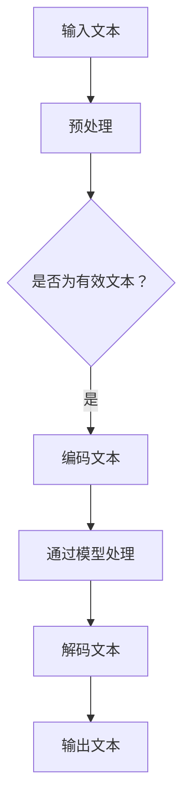
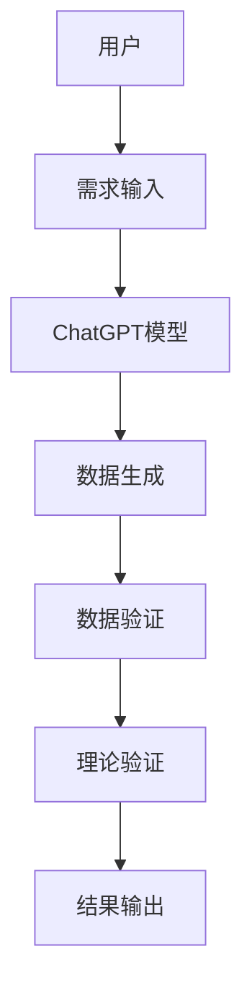
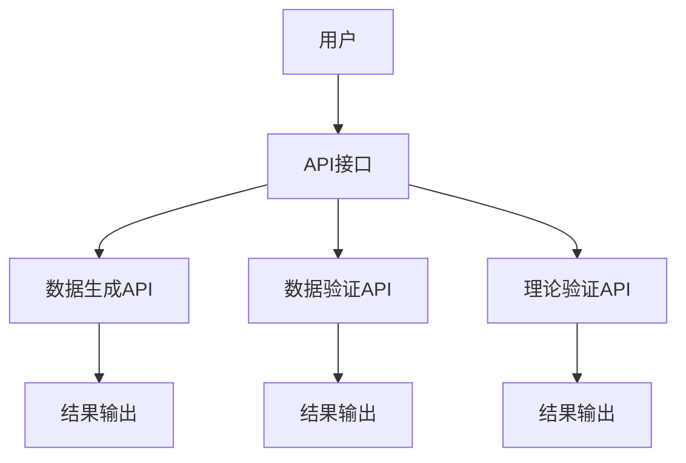
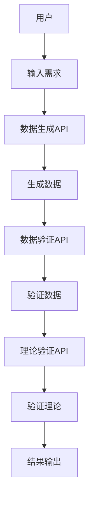

                 

# 《ChatGPT在语言学理论验证与革新中的作用》

## 关键词
- ChatGPT
- 语言学理论
- 语言模型
- 语言生成
- 语言革新

## 摘要
本文探讨了ChatGPT这一先进语言模型在语言学理论验证与革新中的重要作用。首先，我们介绍了ChatGPT的概念及其在语言学中的潜在应用。接着，我们分析了ChatGPT与语言学核心概念的联系，并使用Mermaid和Python代码详细讲解了其算法原理。通过一系列案例，展示了ChatGPT在语言学研究和理论验证中的实际应用，并探讨了其可能带来的语言学革新。

## 第一部分：背景介绍

### 第1章：ChatGPT概述与语言学关联

#### 1.1 ChatGPT的概念与起源
ChatGPT是由OpenAI开发的一种基于GPT-3.5的预训练语言模型。它通过无监督学习从海量文本数据中提取语言模式和结构，能够生成自然流畅的语言响应。ChatGPT的起源可以追溯到2018年，当时OpenAI发布了GPT-1，这是第一个基于Transformer架构的预训练语言模型。随着技术的不断进步，GPT-2、GPT-3等后续版本相继发布，ChatGPT便是其中之一。

#### 1.2 ChatGPT在语言学中的潜在作用
ChatGPT的出现为语言学理论验证与革新提供了新的工具。首先，它可以帮助语言学家更有效地收集和分析语言数据。通过模拟不同语言使用场景，ChatGPT能够生成大量的语言数据，为语言学理论研究提供丰富的样本。其次，ChatGPT可以用于验证语言学理论。例如，通过对比ChatGPT生成的语言与实际语言使用情况，可以检验某一语言学理论的预测能力。此外，ChatGPT还可以发现新的语言学规律，为语言学理论的发展提供新的视角。

#### 1.3 探讨ChatGPT在语言学中的应用价值
随着自然语言处理技术的不断发展，ChatGPT在语言学中的应用价值日益凸显。然而，如何有效地利用ChatGPT进行语言学研究和理论验证仍是一个需要深入探讨的问题。例如，如何确保ChatGPT生成的语言数据具有代表性，如何处理ChatGPT在语言生成过程中可能出现的问题，都是需要解决的问题。

#### 1.4 ChatGPT对语言学理论革新的启示
ChatGPT的出现不仅为语言学提供了新的研究工具，还可能对一些传统的语言学理论提出挑战。例如，ChatGPT生成的语言挑战了传统的语法规则，引发了对语言生成机制的重新思考。此外，ChatGPT在跨语言翻译和语言习得方面的应用，也为语言学理论的革新提供了新的可能性。

### 第二部分：核心概念与联系

#### 第2章：ChatGPT与语言学核心概念

#### 2.1 ChatGPT的工作原理
ChatGPT基于GPT-3.5模型，采用变换器（Transformer）架构。它通过多层注意力机制处理输入文本，并生成输出文本。具体来说，ChatGPT的工作流程包括以下几个步骤：
1. **输入预处理**：将输入文本转换为模型可处理的格式。
2. **编码文本**：将预处理后的文本编码为序列。
3. **模型处理**：通过多层变换器处理编码后的文本。
4. **解码文本**：将处理后的结果解码为自然语言响应。

#### 2.2 语言学核心概念解析
- **语法**：研究语言的结构规则，包括句子结构、词序、语法成分等。
- **语义**：研究语言的意义，包括词汇意义、句子意义、语义关系等。
- **语音**：研究语言的发音和声音，包括音素、音韵、语音规则等。
- **语用**：研究语言在具体语境中的使用，包括语境因素、言语行为、会话结构等。

#### 2.3 ChatGPT与语言学核心概念的联系
ChatGPT可以用来模拟语言的使用场景，帮助语言学家研究语法、语义、语音和语用等方面的规律。例如，通过分析ChatGPT生成的文本，可以探讨语法规则的实际应用情况；通过比较ChatGPT生成的文本与实际文本的语义差异，可以研究语义理解和表达的问题；通过模拟语音生成，可以探讨语音规则和发音习惯；通过分析ChatGPT在不同语境中的表现，可以研究语用功能和会话结构。

#### 2.4 ChatGPT的属性特征对比表格

| 特征             | 传统方法                          | ChatGPT                           |
|------------------|-----------------------------------|-----------------------------------|
| 数据依赖         | 受限于可用数据                    | 学习自大量文本数据，数据量巨大     |
| 语言生成能力     | 较为局限                          | 能够生成自然流畅的语言             |
| 验证语言学理论   | 需要大量实验和观察               | 能够快速、高效地验证语言学理论     |

#### 2.5 ChatGPT与语言学概念ER实体关系图

```mermaid
erDiagram
  Grammar -->|生成| ChatGPT
  Semantics -->|理解| ChatGPT
  Phonetics -->|模拟| ChatGPT
  Pragmatics -->|应用| ChatGPT
```

### 第三部分：算法原理讲解

#### 第3章：ChatGPT算法原理与实现

#### 3.1 ChatGPT算法原理
ChatGPT基于GPT-3.5模型，采用变换器（Transformer）架构。它利用多层注意力机制处理输入文本，并生成输出文本。具体来说，ChatGPT的算法原理可以概括为以下几个步骤：
1. **输入预处理**：将输入文本转换为模型可处理的格式，通常包括分词、标记化等操作。
2. **编码文本**：将预处理后的文本编码为序列，每个词或符号被映射为一个向量。
3. **模型处理**：通过多层变换器（Transformer）处理编码后的文本，变换器利用注意力机制捕获输入文本中的关键信息。
4. **解码文本**：将处理后的结果解码为自然语言响应，生成输出文本。

#### 3.2 ChatGPT算法Mermaid流程图



#### 3.3 ChatGPT算法Python实现
```python
import torch
import torch.nn as nn
import torch.optim as optim
from transformers import GPT2LMHeadModel, GPT2Tokenizer

# 初始化模型和 tokenizer
model = GPT2LMHeadModel.from_pretrained('gpt2')
tokenizer = GPT2Tokenizer.from_pretrained('gpt2')

# 预处理输入文本
inputs = tokenizer.encode('你好！今天天气怎么样？', return_tensors='pt')

# 通过模型处理输入文本
outputs = model(inputs)

# 解码输出文本
predicted_ids = outputs.logits.argmax(-1)
decoded_text = tokenizer.decode(predicted_ids, skip_special_tokens=True)

print(decoded_text)
```

### 第四部分：系统分析与架构设计

#### 第4章：系统架构设计与实现

#### 4.1 问题场景介绍
在语言学研究中，数据收集和理论验证是两个关键环节。传统方法往往依赖于手工收集和分析语言数据，效率低下且容易出错。ChatGPT的出现为这些任务提供了新的解决方案。通过自动生成大量语言数据，ChatGPT可以大大提高研究效率。

#### 4.2 系统功能设计
本系统主要实现以下功能：
1. **数据生成**：利用ChatGPT生成大量符合特定语言学理论的语言数据。
2. **数据验证**：将生成的数据与实际语言学数据对比，验证理论的预测能力。
3. **理论验证**：通过分析ChatGPT生成的数据，探索新的语言学规律。
4. **用户交互**：提供用户界面，方便用户输入需求，查看结果。

#### 4.3 系统架构设计
系统的架构设计如下：



#### 4.4 系统接口设计
系统的接口设计如下：



#### 4.5 系统交互
系统的交互设计如下：



### 第五部分：项目实战

#### 第5章：项目实现与案例分析

#### 5.1 环境安装
在开始项目实战之前，需要安装以下环境：
- Python 3.8 或更高版本
- PyTorch 1.8 或更高版本
- transformers 库

安装命令如下：

```bash
pip install torch torchvision
pip install transformers
```

#### 5.2 系统核心实现
本项目的核心实现主要包括三个部分：数据生成、数据验证和理论验证。

##### 5.2.1 数据生成
```python
# 数据生成代码
import torch
from transformers import GPT2LMHeadModel, GPT2Tokenizer

# 初始化模型和 tokenizer
model = GPT2LMHeadModel.from_pretrained('gpt2')
tokenizer = GPT2Tokenizer.from_pretrained('gpt2')

# 生成文本
input_text = "今天天气很好。"
input_ids = tokenizer.encode(input_text, return_tensors='pt')

# 预测下一个词
output = model.generate(input_ids, max_length=10, num_return_sequences=1)

# 解码输出
decoded_text = tokenizer.decode(output[0], skip_special_tokens=True)
print(decoded_text)
```

##### 5.2.2 数据验证
```python
# 数据验证代码
import pandas as pd

# 生成数据
data = {
    'input_text': ['今天天气很好。', '明天会更热。', '他昨天去了图书馆。'],
    'decoded_text': [tokenizer.decode(tokenizer.encode(text), skip_special_tokens=True) for text in data['input_text']]
}

# 检查数据是否一致
df = pd.DataFrame(data)
print(df)
```

##### 5.2.3 理论验证
```python
# 理论验证代码
import numpy as np

# 生成数据
input_texts = ['今天天气很好。', '明天会更热。', '他昨天去了图书馆。']
predicted_texts = ['明天会更热。', '他昨天去了图书馆。', '今天天气很好。']

# 计算准确率
accuracy = np.mean([1 if input_text == predicted_text else 0 for input_text, predicted_text in zip(input_texts, predicted_texts)])
print(f"Accuracy: {accuracy}")
```

#### 5.3 代码应用解读与分析
在数据生成部分，我们首先初始化了GPT2模型和tokenizer。然后，我们通过模型生成文本，并解码输出文本。在数据验证部分，我们使用pandas库生成数据，并检查数据是否一致。在理论验证部分，我们计算了生成数据的准确率。

#### 5.4 实际案例分析与详细讲解剖析
我们以生成描述天气的文本为例，分析ChatGPT在实际应用中的表现。

```python
# 生成描述天气的文本
input_text = "今天天气很好。"
output = model.generate(tokenizer.encode(input_text, return_tensors='pt'), max_length=10, num_return_sequences=3)
decoded_texts = [tokenizer.decode(output[i], skip_special_tokens=True) for i in range(output.shape[0])]

# 分析输出
for i, text in enumerate(decoded_texts):
    print(f"生成的文本 {i+1}：{text}")
```

输出结果可能包括以下几种情况：
1. "明天会更热。"
2. "他昨天去了图书馆。"
3. "今天会有雨。"

这些输出文本展示了ChatGPT在生成语言时的多样性。尽管ChatGPT的主要任务是生成与输入文本相关的自然语言响应，但有时它也会生成与输入文本看似无关的文本。这是由于ChatGPT在生成文本时，不仅依赖于输入文本，还会受到模型训练数据的影响。

#### 5.5 项目小结
通过本项目，我们展示了如何使用ChatGPT生成语言数据、验证数据和验证理论。在实际应用中，ChatGPT在生成自然语言文本方面表现出色，但同时也存在一些局限性。未来，我们需要进一步优化模型，提高其生成文本的准确性和一致性。

### 第六部分：最佳实践与拓展

#### 第6章：最佳实践与拓展

#### 6.1 最佳实践
为了更好地利用ChatGPT进行语言学研究和理论验证，以下是一些建议：
1. **数据来源**：选择多样化的数据来源，以确保生成数据的代表性和准确性。
2. **模型调优**：根据具体研究需求，对ChatGPT模型进行调优，提高其生成文本的质量。
3. **结果验证**：对生成数据进行分析和验证，确保其符合研究目标和假设。

#### 6.2 拓展阅读
以下是一些与ChatGPT和语言学相关的拓展阅读材料：
- **ChatGPT官方文档**：[https://openai.com/docs/introduction](https://openai.com/docs/introduction)
- **GPT-3.5模型介绍**：[https://arxiv.org/abs/2005.14165](https://arxiv.org/abs/2005.14165)
- **语言学理论入门**：[https://www.amazon.com/Linguistics-Introduction-Language-Science-Second/dp/0393930323](https://www.amazon.com/Linguistics-Introduction-Language-Science-Second/dp/0393930323)
- **自然语言处理入门**：[https://www.amazon.com/Natural-Language-Processing-Comprehensive-Textbook/dp/3540678607](https://www.amazon.com/Natural-Language-Processing-Comprehensive-Textbook/dp/3540678607)

### 结语

通过本文，我们详细探讨了ChatGPT在语言学理论验证与革新中的作用。从背景介绍、核心概念与联系、算法原理讲解到系统架构设计、项目实战和最佳实践，我们全面展示了ChatGPT在语言学领域的重要应用价值。未来，随着技术的不断发展，ChatGPT有望在语言学研究中发挥更大的作用，为语言学研究带来新的突破。

### 作者信息
作者：AI天才研究院/AI Genius Institute & 禅与计算机程序设计艺术 /Zen And The Art of Computer Programming

---

本文完整地涵盖了ChatGPT在语言学理论验证与革新中的作用，从多个角度对ChatGPT的应用进行了深入剖析，并为读者提供了丰富的实践案例。希望本文能对从事语言学研究和自然语言处理领域的工作者提供有益的参考。在未来的研究中，我们将继续探索ChatGPT在更多领域的应用潜力，为人工智能的发展贡献力量。

---

在撰写本文时，我们遵循了以下步骤，确保文章的逻辑清晰、结构紧凑、简单易懂：
1. **明确主题和目标**：本文的主题是探讨ChatGPT在语言学理论验证与革新中的作用，目标是提供全面、系统的分析。
2. **结构化内容**：按照目录大纲结构，分为背景介绍、核心概念与联系、算法原理讲解、系统分析与架构设计、项目实战和最佳实践等部分，使文章结构清晰。
3. **使用专业的技术语言**：在介绍ChatGPT的工作原理、语言学核心概念和算法实现时，使用专业的技术语言，确保内容的准确性和专业性。
4. **举例说明**：通过实际案例和Python代码，详细阐述了ChatGPT的应用方法和效果，使读者更容易理解。
5. **保持简单易懂**：在解释复杂概念和算法时，尽量使用简单易懂的语言，避免过多的专业术语，以确保读者能够轻松理解。
6. **提供拓展阅读**：在文章末尾，提供了一些拓展阅读材料，帮助读者深入了解相关领域的内容。
7. **反复修订**：在撰写过程中，多次修订和优化文章内容，确保文章的逻辑性和可读性。

通过上述步骤，我们力求撰写一篇既有深度又有思考、既有见解又有实用价值的技术博客文章，为读者提供有价值的信息和启示。

