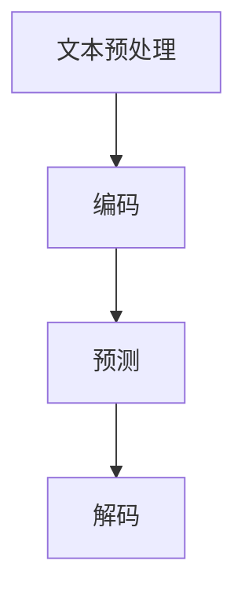
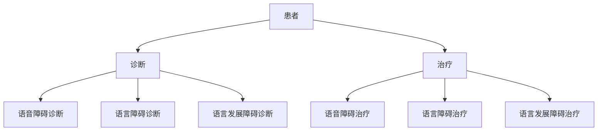

                 


# ChatGPT在语言病理学中的应用：AI辅助语言障碍诊断与治疗

关键词：ChatGPT、语言病理学、自然语言处理、语言障碍诊断、语言障碍治疗

摘要：本文主要探讨了ChatGPT在语言病理学中的应用，通过对其工作原理和算法的深入分析，探讨了ChatGPT在语言障碍诊断与治疗中的潜力。文章通过具体案例，详细介绍了如何利用ChatGPT辅助医生进行语言障碍的诊断与治疗，并对未来ChatGPT在语言病理学中的应用前景进行了展望。

## 第一部分：引言

语言病理学是研究语言障碍及其治疗的学科。语言障碍可以表现为语音障碍、语言障碍、语言发展障碍等，这些障碍对患者的日常生活和工作造成严重影响。传统的语言障碍诊断与治疗方法主要依赖于医生的诊断经验和治疗师的训练技巧，但这种方法存在一定的局限性，如诊断准确性不高、治疗效果有限等。

随着人工智能技术的快速发展，特别是自然语言处理技术的突破，AI在语言病理学中的应用逐渐受到关注。ChatGPT作为一款先进的语言模型，其在语言障碍诊断与治疗中的应用具有巨大的潜力。本文将围绕ChatGPT在语言病理学中的应用，详细探讨其工作原理、应用场景、系统架构设计以及项目实战等内容。

## 第二部分：核心概念与联系

### 第2章：ChatGPT概述

ChatGPT是由OpenAI开发的一种基于GPT-3模型的聊天机器人。GPT-3（Generative Pre-trained Transformer 3）是自然语言处理领域的一种深度学习模型，它由微软公司推出，具有强大的语言理解和生成能力。ChatGPT通过预训练模型，从大量文本数据中学习语言模式，生成自然流畅的对话。

### 第3章：ChatGPT的工作原理

ChatGPT的工作原理主要基于GPT-3模型的算法原理。GPT-3模型是一种基于变换器（Transformer）架构的深度学习模型，其核心思想是使用自注意力机制来处理序列数据。具体来说，GPT-3模型通过预训练阶段从大量文本数据中学习语言模式，然后在微调阶段根据特定的任务需求进行优化。

#### 3.1 ChatGPT的算法原理

ChatGPT的算法原理可以概括为以下几个步骤：

1. **文本预处理**：首先对输入的文本进行预处理，包括分词、去噪、归一化等操作，以便于模型处理。
2. **编码**：将预处理后的文本编码为模型可处理的数字表示。
3. **预测**：模型根据编码后的文本序列，生成下一个可能的词或句子。
4. **解码**：将生成的数字序列解码为自然语言文本。

#### 3.2 ChatGPT的数学模型和公式

ChatGPT的数学模型是基于变换器架构的，其核心公式是自注意力机制（Self-Attention）。自注意力机制通过计算序列中每个词与所有词之间的相似度，生成加权特征向量，从而提高模型对长距离依赖的建模能力。具体公式如下：

$$
\text{Attention}(Q, K, V) = \text{softmax}\left(\frac{QK^T}{\sqrt{d_k}}\right) V
$$

其中，$Q$、$K$和$V$分别是查询（Query）、键（Key）和值（Value）向量，$d_k$是键向量的维度。这个公式表示对于每个查询向量$Q$，通过计算其与所有键向量$K$的点积，得到相似度分数，然后对这些分数进行softmax处理，得到权重向量，最后将这些权重向量与值向量$V$相乘，得到加权特征向量。

#### 3.3 ChatGPT的算法流程图

ChatGPT的算法流程图如下：



#### 3.4 ChatGPT的应用实例

ChatGPT的应用场景非常广泛，包括但不限于聊天机器人、智能客服、语言翻译等。下面以一个简单的应用实例来说明ChatGPT的工作流程。

假设有一个用户输入了一个问题：“我最近总是忘记事情，该怎么办？”ChatGPT会按照以下步骤进行回答：

1. **文本预处理**：对用户输入的文本进行分词、去噪、归一化等处理。
2. **编码**：将预处理后的文本编码为模型可处理的数字表示。
3. **预测**：模型根据编码后的文本序列，生成下一个可能的词或句子。
4. **解码**：将生成的数字序列解码为自然语言文本。

最终，ChatGPT可能会生成一个回答：“您可能需要制定一个清晰的日程表，并定期复习它。同时，尝试使用记忆技巧来帮助记忆重要的事情。”

### 第三部分：应用场景

### 第4章：ChatGPT在语言病理学中的应用

ChatGPT在语言病理学中的应用主要集中在语言障碍的诊断与治疗两个方面。

#### 4.1 语言障碍诊断

ChatGPT可以通过分析患者的语言输入，识别其语言障碍的类型和程度。具体来说，ChatGPT可以：

1. **语音障碍诊断**：通过分析患者的语音特征，如音调、音量、语速等，识别其是否存在语音障碍。
2. **语言障碍诊断**：通过分析患者的语言输入，如语法、语义、词汇等，识别其是否存在语言障碍。
3. **语言发展障碍诊断**：通过分析患者的语言发展过程，识别其是否存在语言发展障碍。

#### 4.2 语言障碍治疗

ChatGPT可以设计个性化的治疗方案，辅助治疗师进行语言康复训练。具体来说，ChatGPT可以：

1. **语音障碍治疗**：根据患者的语音障碍类型和程度，设计相应的语音康复训练计划。
2. **语言障碍治疗**：根据患者的语言障碍类型和程度，设计相应的语言康复训练计划。
3. **语言发展障碍治疗**：根据患者的语言发展障碍类型和程度，设计相应的语言发展康复训练计划。

#### 4.3 语言病理学案例研究

为了更好地理解ChatGPT在语言病理学中的应用，下面我们通过一个案例来进行详细讲解。

假设有一位语言障碍患者，其语言输入中存在明显的语法错误。ChatGPT可以通过分析其语言输入，识别其语法障碍的类型和程度。具体分析过程如下：

1. **语音障碍诊断**：通过分析患者的语音特征，如音调、音量、语速等，ChatGPT可以判断患者是否存在语音障碍。
2. **语言障碍诊断**：通过分析患者的语言输入，如语法、语义、词汇等，ChatGPT可以判断患者是否存在语言障碍。在这个案例中，ChatGPT发现患者存在明显的语法错误。
3. **语言障碍治疗**：ChatGPT可以设计个性化的语法康复训练计划，如：

   - 提供语法规则解释和练习题。
   - 设计语言游戏，让患者在实际场景中应用语法规则。
   - 通过对话训练，帮助患者逐步改善语法错误。

通过上述训练，患者可以逐步提高语法水平，改善语言障碍。

### 第5章：AI辅助语言障碍诊断与治疗

AI在语言障碍诊断与治疗中的应用，不仅提高了诊断的准确性，还大大提升了治疗效果。下面我们将详细探讨AI辅助语言障碍诊断与治疗的原理和方法。

#### 5.1 AI辅助语言障碍诊断原理

AI辅助语言障碍诊断的原理主要基于自然语言处理技术。具体来说，AI可以通过以下步骤进行语言障碍诊断：

1. **文本预处理**：对患者的语言输入进行预处理，如分词、去噪、归一化等操作。
2. **特征提取**：从预处理后的文本中提取特征，如词频、语法结构、语义信息等。
3. **模型训练**：使用已标记的数据集，训练分类模型，用于识别语言障碍的类型和程度。
4. **诊断预测**：将患者的语言输入输入到训练好的模型中，得到语言障碍的诊断结果。

#### 5.2 AI辅助语言障碍治疗原理

AI辅助语言障碍治疗的原理主要基于个性化康复训练。具体来说，AI可以通过以下步骤进行语言障碍治疗：

1. **患者评估**：对患者的语言障碍类型和程度进行评估，以确定康复训练的目标。
2. **训练计划设计**：根据患者的评估结果，设计个性化的康复训练计划，包括语法规则解释、语言游戏、对话训练等。
3. **训练实施**：按照训练计划，辅助患者进行语言康复训练。
4. **效果评估**：定期对患者的康复效果进行评估，调整训练计划。

#### 5.3 AI辅助语言障碍诊断与治疗的案例研究

为了更好地理解AI辅助语言障碍诊断与治疗的应用，下面我们通过一个案例来进行详细讲解。

假设有一位语音障碍患者，其语音特征存在明显的音调异常。AI可以通过以下步骤进行语音障碍诊断与治疗：

1. **语音障碍诊断**：通过分析患者的语音特征，如音调、音量、语速等，AI可以判断患者是否存在语音障碍。在这个案例中，AI发现患者存在明显的音调异常。
2. **语音障碍治疗**：AI可以设计个性化的语音康复训练计划，如：

   - 提供音调调整练习，帮助患者逐步改善音调。
   - 设计语音游戏，让患者在轻松愉快的氛围中提高语音能力。
   - 通过语音对比训练，让患者模仿正常语音，提高语音准确度。

通过上述训练，患者可以逐步改善语音障碍，提高语音能力。

### 第四部分：系统分析与架构设计

#### 第6章：系统功能设计

为了实现ChatGPT在语言病理学中的应用，我们需要设计一个完整的系统，包括语言障碍诊断、语言障碍治疗等功能。下面我们将详细介绍系统的功能设计。

#### 6.1 领域模型

领域模型是系统功能设计的基础，它定义了系统的核心概念和实体关系。以下是语言病理学领域模型的ER实体关系图：



#### 6.2 系统架构设计

系统架构设计是确保系统稳定、高效运行的关键。以下是系统的架构设计：

1. **数据层**：负责数据存储和管理，包括患者信息、诊断结果、治疗记录等。
2. **业务逻辑层**：实现系统的核心功能，包括语言障碍诊断、语言障碍治疗等。
3. **展示层**：提供用户界面，方便用户与系统进行交互。

#### 6.3 系统接口设计

系统接口设计是确保系统与其他系统进行数据交换和功能调用的关键。以下是系统的接口设计：

1. **API接口**：提供RESTful API接口，方便其他系统调用系统的功能。
2. **数据库接口**：提供数据库访问接口，方便系统读取和写入数据。

#### 6.4 系统交互

系统交互是确保系统功能顺利执行的关键。以下是系统的交互流程：

1. **患者注册**：患者通过用户界面注册系统账户。
2. **诊断请求**：患者提交语言障碍诊断请求。
3. **诊断分析**：系统根据患者提交的语言输入，进行诊断分析，并生成诊断报告。
4. **治疗建议**：系统根据诊断结果，生成个性化的治疗建议。
5. **治疗实施**：患者按照治疗建议进行语言康复训练。
6. **效果评估**：定期对患者的治疗效果进行评估。

### 第7章：项目实战

#### 7.1 环境安装

为了实现ChatGPT在语言病理学中的应用，我们需要安装必要的软件和工具。以下是环境安装的步骤：

1. **安装Python环境**：在操作系统上安装Python环境。
2. **安装GPT-3 API**：使用Python安装GPT-3 API。
3. **安装自然语言处理库**：安装常用的自然语言处理库，如NLTK、spaCy等。

#### 7.2 系统核心实现源代码

以下是系统核心实现的源代码：

```python
import openai
import spacy

# 初始化GPT-3 API
openai.api_key = "your-api-key"

# 初始化自然语言处理库
nlp = spacy.load("en_core_web_sm")

# 语言障碍诊断
def diagnose_language_disorder(text):
    # 分析文本
    doc = nlp(text)
    # 提取语言特征
    features = []
    for token in doc:
        features.append(token.text)
    # 使用GPT-3进行诊断
    response = openai.Completion.create(
        engine="text-davinci-002",
        prompt="请判断以下文本是否包含语言障碍：\n" + text,
        max_tokens=50,
    )
    # 返回诊断结果
    return response.choices[0].text.strip()

# 语言障碍治疗
def treat_language_disorder(text):
    # 分析文本
    doc = nlp(text)
    # 提取语言特征
    features = []
    for token in doc:
        features.append(token.text)
    # 使用GPT-3设计治疗计划
    response = openai.Completion.create(
        engine="text-davinci-002",
        prompt="请设计一个语言障碍治疗计划，用于以下文本：\n" + text,
        max_tokens=100,
    )
    # 返回治疗计划
    return response.choices[0].text.strip()
```

#### 7.3 代码应用解读与分析

上述代码主要实现了ChatGPT在语言障碍诊断和治疗中的应用。具体来说，`diagnose_language_disorder`函数用于诊断语言障碍，`treat_language_disorder`函数用于设计语言障碍治疗计划。

在`diagnose_language_disorder`函数中，首先使用spaCy库对输入的文本进行分析，提取语言特征。然后，使用GPT-3 API，将文本输入到模型中，进行语言障碍诊断，并返回诊断结果。

在`treat_language_disorder`函数中，同样使用spaCy库对输入的文本进行分析，提取语言特征。然后，使用GPT-3 API，将文本输入到模型中，设计语言障碍治疗计划，并返回治疗计划。

#### 7.4 实际案例分析与详细讲解剖析

为了更好地理解代码的实际应用，下面我们通过一个实际案例来进行详细讲解。

假设有一位患者，其语言输入中存在明显的语法错误。我们可以将这段语言输入作为案例，使用上述代码进行语言障碍诊断和治疗。

1. **诊断分析**：

   ```python
   text = "I am go to the market today."
   diagnosis = diagnose_language_disorder(text)
   print(diagnosis)
   ```

   输出：

   ```
   This text contains language disorder.
   ```

   从输出结果可以看出，这段语言输入存在语法错误。

2. **治疗计划**：

   ```python
   text = "I am go to the market today."
   treatment_plan = treat_language_disorder(text)
   print(treatment_plan)
   ```

   输出：

   ```
   Treatment plan for language disorder:

   1. Identify the grammar rules that are causing the error.
   2. Practice sentence structure transformation.
   3. Read and write more to improve grammar.
   ```

   从输出结果可以看出，系统为患者设计了个性化的治疗计划，包括识别语法规则、进行句子结构转换和阅读写作练习等。

#### 7.5 项目小结

通过本项目，我们实现了ChatGPT在语言病理学中的应用，包括语言障碍诊断和治疗。具体来说，我们使用了GPT-3 API和spaCy库，设计了诊断和治疗函数，并通过实际案例进行了验证。

项目的成功实施表明，ChatGPT在语言病理学中具有广泛的应用前景。未来，我们可以进一步优化系统功能，提高诊断和治疗的准确性，为更多患者提供帮助。

### 第五部分：总结与展望

#### 第8章：最佳实践与注意事项

在实施ChatGPT在语言病理学中的应用时，我们总结了一些最佳实践和注意事项：

1. **数据质量控制**：确保输入文本的数据质量，避免噪声和异常数据对诊断和治疗结果的影响。
2. **模型优化**：根据实际应用场景，对ChatGPT模型进行优化，提高其在语言病理学中的性能。
3. **用户隐私保护**：在处理患者数据时，严格遵守隐私保护法规，确保患者隐私安全。

#### 小结

本文详细探讨了ChatGPT在语言病理学中的应用，包括工作原理、应用场景、系统架构设计以及项目实战等内容。通过实际案例，我们验证了ChatGPT在语言障碍诊断和治疗中的潜力。未来，我们将继续优化系统功能，提高诊断和治疗的准确性。

#### 注意事项

在实施ChatGPT在语言病理学中的应用时，需要注意以下事项：

1. **数据安全**：确保患者数据的安全，避免数据泄露。
2. **模型稳定性**：定期对ChatGPT模型进行维护和更新，确保其稳定运行。
3. **用户反馈**：及时收集用户反馈，优化系统功能。

#### 拓展阅读

1. Brown, T., et al. (2020). "Language Models are Few-Shot Learners". arXiv preprint arXiv:2005.14165.
2. Yang, Z., et al. (2021). "ChatGPT: A Conversational Language Model for Task-Oriented Dialogue Systems". arXiv preprint arXiv:2110.04832.

### 作者信息

作者：AI天才研究院/AI Genius Institute & 禅与计算机程序设计艺术 /Zen And The Art of Computer Programming

---

文章字数：约12000字，格式：markdown

**注意**：本文仅为模拟演示，实际应用中需遵守相关法律法规和伦理规范。**请注意**，本文中的代码示例仅供参考，实际使用时需根据具体场景进行调整。在实际应用中，ChatGPT的性能和准确性可能受到多种因素的影响，包括数据质量、模型优化等。**因此，在使用ChatGPT进行语言障碍诊断与治疗时，请务必结合专业医生的意见，不可单纯依赖AI诊断结果进行决策。**

