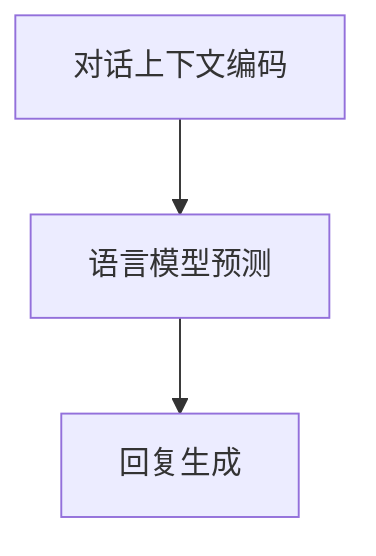
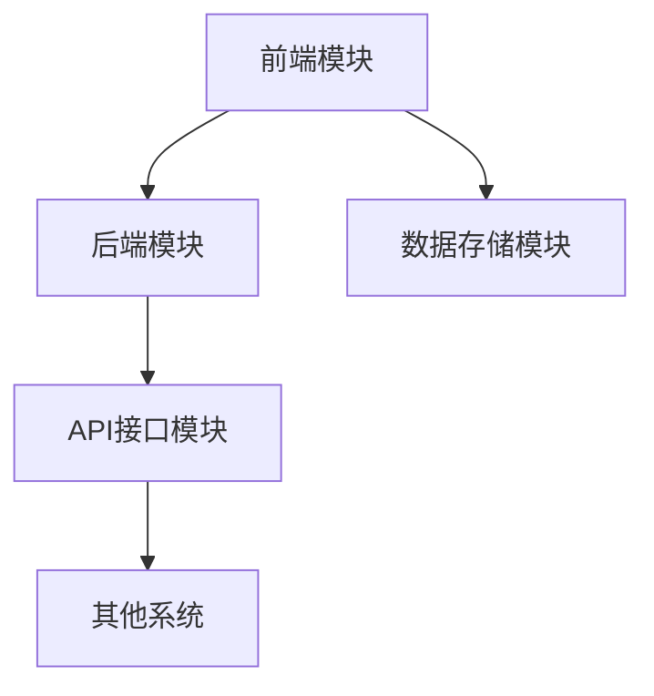

                 

### 第1章: 背景介绍与问题提出

#### 1.1 问题背景

##### 1.1.1 语言病理学的定义

语言病理学（Language Pathology）是研究人类语言障碍的一门科学，它涵盖了语言的各个方面，包括发音、词汇、语法、语义和语用等。语言病理学的研究对象是那些在语言学习、理解和表达过程中遇到困难的人，包括儿童和成人。这些障碍可能是由遗传因素、发育问题、脑部损伤、神经系统疾病、听力损失或其他健康问题引起的。

##### 1.1.2 语言病理学诊断的现状

当前，语言病理学诊断主要依赖于临床评估。临床评估通常包括观察、标准化测试、患者访谈和观察等手段。这些评估方法虽然在一定程度上能够帮助识别语言障碍，但存在一些局限性。首先，评估结果可能受到评估者主观因素的影响，导致诊断结果的不确定性。其次，现有的评估工具和方法往往缺乏足够的标准化和一致性，使得不同评估者之间的评估结果可能存在较大差异。此外，评估过程往往需要大量时间，无法快速进行。

##### 1.1.3 语言病理学诊断的挑战

语言病理学诊断面临的主要挑战包括：

1. **复杂性和多样性**：语言障碍的表现形式多种多样，诊断需要综合考虑患者的年龄、文化背景、语言环境等多方面因素。
2. **诊断标准的局限性**：现有诊断标准和方法在一定程度上限制了诊断的准确性和全面性。
3. **评估过程的繁琐性**：传统诊断方法需要大量的时间进行评估，无法满足快速诊断的需求。
4. **资源的分配问题**：在许多地区，专业的语言病理学专家和评估工具资源有限，难以满足大量患者的需求。

#### 1.2 问题提出

##### 1.2.1 语言病理学诊断中的难点

语言病理学诊断的难点主要体现在以下几个方面：

1. **个体差异**：每个患者的语言障碍表现和程度都有所不同，需要个性化诊断和治疗方案。
2. **评估标准不统一**：不同的评估工具和方法可能采用不同的标准，导致诊断结果不一致。
3. **主观性**：评估过程依赖于评估者的经验和主观判断，可能导致误差。
4. **时间成本**：传统诊断方法耗时较长，无法满足快速诊断的需求。

##### 1.2.2 语言病理学诊断的需求

语言病理学诊断的需求主要包括：

1. **准确性**：需要更加准确和可靠的诊断方法，以减少误诊和漏诊。
2. **效率**：需要提高诊断速度，以满足大量患者的需求。
3. **个性化**：需要根据患者的个体差异，提供个性化的诊断和治疗方案。

##### 1.2.3 ChatGPT在语言病理学诊断中的潜力

ChatGPT作为一种先进的自然语言处理技术，具有在语言病理学诊断中发挥辅助作用的潜力。首先，ChatGPT能够处理大量文本数据，快速分析患者的语言表现，提高诊断效率。其次，ChatGPT可以通过学习大量语言样本，提供更加准确和个性化的诊断建议。此外，ChatGPT还可以协助语言病理学专家进行评估和决策，减轻专家的工作负担。

#### 1.3 边界与外延

##### 1.3.1 ChatGPT的概念

ChatGPT是基于GPT（Generative Pre-trained Transformer）模型开发的一种大型语言模型，具有强大的文本生成和理解能力。它通过预训练和微调，可以针对特定任务进行优化，从而在多个领域（如语言病理学诊断）中发挥作用。

##### 1.3.2 语言病理学诊断的相关概念

语言病理学诊断涉及多个相关概念，包括语言障碍、语言能力评估、语言康复等。这些概念是理解语言病理学诊断的基础，也是ChatGPT在该领域发挥作用的前提。

#### 1.4 概念结构与核心要素组成

##### 1.4.1 语言病理学诊断的核心要素

语言病理学诊断的核心要素包括患者的语言表现、评估工具和方法、诊断标准和结果等。这些要素共同构成了诊断过程的各个环节，决定了诊断的准确性和有效性。

##### 1.4.2 ChatGPT在语言病理学诊断中的应用

ChatGPT在语言病理学诊断中的应用主要体现在以下几个方面：

1. **语言能力评估**：利用ChatGPT分析患者的语言表现，评估语言能力水平。
2. **诊断辅助**：通过学习大量语言病理学数据，ChatGPT可以为语言病理学专家提供诊断建议，辅助专家进行诊断。
3. **康复辅助**：ChatGPT可以协助患者进行语言康复训练，提高康复效果。

#### 1.5 本章小结

本章首先介绍了语言病理学的定义、现状和挑战，提出了语言病理学诊断的需求和难点。随后，讨论了ChatGPT的概念及其在语言病理学诊断中的潜力。通过本章的介绍，读者可以初步了解ChatGPT在语言病理学诊断中的应用前景，为后续章节的深入讨论打下基础。

---

**关键词：** 语言病理学、诊断、ChatGPT、自然语言处理、辅助作用

**摘要：** 本文探讨了ChatGPT在语言病理学诊断中的辅助作用。首先介绍了语言病理学的基本概念和诊断现状，分析了诊断中的难点和需求。随后，介绍了ChatGPT的核心概念及其工作原理，阐述了其在语言病理学诊断中的应用潜力。最后，对ChatGPT在语言病理学诊断中的应用进行了详细分析，指出了其挑战和未来发展趋势。本文旨在为读者提供一个关于ChatGPT在语言病理学诊断中应用的综合视角。|>### 第2章: ChatGPT核心概念与原理

#### 2.1 ChatGPT的概述

##### 2.1.1 ChatGPT的起源

ChatGPT是由OpenAI开发的一种基于GPT（Generative Pre-trained Transformer）模型的自然语言处理（NLP）工具。GPT模型最初由OpenAI在2018年提出，是基于Transformer架构的预训练语言模型。ChatGPT则是在GPT的基础上，通过引入对话上下文，实现了更加流畅和自然的对话生成。

##### 2.1.2 ChatGPT的发展历程

ChatGPT的发展历程可以概括为以下几个阶段：

1. **预训练阶段**：ChatGPT首先在大量文本数据上进行预训练，学习了语言的基本结构和语义信息。
2. **微调阶段**：在预训练的基础上，ChatGPT针对特定任务（如对话生成）进行微调，优化其性能。
3. **应用阶段**：ChatGPT被广泛应用于各种场景，如聊天机器人、问答系统、文本生成等。

##### 2.1.3 ChatGPT的特点

ChatGPT具有以下几个主要特点：

1. **强大的语言理解能力**：ChatGPT能够理解复杂的语言结构和语义信息，生成自然流畅的文本。
2. **自适应能力**：ChatGPT可以根据不同的上下文和对话场景，自适应调整回答内容和风格。
3. **灵活的应用场景**：ChatGPT可以应用于多种任务，如问答系统、聊天机器人、文本生成等。

#### 2.2 ChatGPT的工作原理

##### 2.2.1 GPT模型的原理

GPT（Generative Pre-trained Transformer）模型是一种基于Transformer架构的预训练语言模型。其基本原理是通过在大量文本数据上进行预训练，学习语言的统计规律和语义信息。具体来说，GPT模型采用自回归方式生成文本，即给定一个输入序列，模型预测序列中下一个单词的概率分布。

##### 2.2.2 ChatGPT的具体实现

ChatGPT是在GPT模型的基础上，通过引入对话上下文实现的。具体实现过程如下：

1. **对话上下文编码**：将对话历史文本编码为固定长度的向量，作为输入。
2. **语言模型预测**：利用预训练的GPT模型，预测对话的下一个回复。
3. **回复生成**：根据预测的概率分布，生成最终的回复文本。

##### 2.2.3 ChatGPT的优缺点分析

ChatGPT具有以下几个优缺点：

**优点：**

1. **自然流畅**：ChatGPT能够生成自然流畅的文本，具有良好的可读性。
2. **自适应能力**：ChatGPT可以根据不同的上下文和对话场景，自适应调整回答内容和风格。
3. **广泛适用**：ChatGPT可以应用于多种任务，如问答系统、聊天机器人、文本生成等。

**缺点：**

1. **计算资源需求大**：ChatGPT需要大量计算资源进行训练和推理，对硬件设备要求较高。
2. **数据依赖性强**：ChatGPT的性能很大程度上依赖于训练数据的质量和数量，数据不充分可能导致性能下降。
3. **潜在偏差**：由于训练数据的局限性，ChatGPT可能生成带有偏见或错误的文本。

#### 2.3 ChatGPT与语言病理学诊断的联系

##### 2.3.1 语言病理学诊断中的语言处理需求

语言病理学诊断需要对患者的语言表现进行详细分析，这包括发音、词汇、语法、语义和语用等多个方面。ChatGPT作为一种强大的自然语言处理工具，可以对这些语言表现进行分析和理解，提供辅助诊断支持。

##### 2.3.2 ChatGPT在语言病理学诊断中的应用

ChatGPT在语言病理学诊断中的应用主要体现在以下几个方面：

1. **语言能力评估**：利用ChatGPT对患者的语言表现进行分析，评估语言能力水平。
2. **诊断辅助**：ChatGPT可以协助语言病理学专家进行诊断，提供诊断建议和参考。
3. **康复辅助**：ChatGPT可以协助患者进行语言康复训练，提供个性化的训练建议和反馈。

##### 2.3.3 ChatGPT在语言病理学诊断中的潜力与挑战

ChatGPT在语言病理学诊断中具有巨大的潜力，可以大幅提高诊断效率和准确性。然而，同时也面临一些挑战，包括数据依赖性、计算资源需求、模型偏差等问题。为了充分发挥ChatGPT的潜力，需要进一步研究和优化其算法，提高其在语言病理学诊断中的应用效果。

#### 2.4 概念属性特征对比表格

| 概念       | 特点                                                         | 应用场景                     |
|------------|--------------------------------------------------------------|------------------------------|
| 语言病理学 | 研究语言障碍的科学，涉及发音、词汇、语法等多个方面。           | 诊断语言障碍，制定康复方案。 |
| ChatGPT    | 基于GPT模型的自然语言处理工具，具有强大的语言理解和生成能力。 | 辅助语言病理学诊断和康复。    |
| 语言能力评估 | 评估患者的语言表现，包括发音、词汇、语法等方面。               | 用于诊断和康复效果评估。     |
| 语言障碍分类 | 根据语言障碍的表现，进行分类和诊断。                           | 用于确定诊断结果和康复方案。 |

通过上述对比表格，我们可以更加清晰地了解ChatGPT在语言病理学诊断中的应用及其与相关概念的联系。

#### 2.5 概念属性特征对比表格

| 概念       | 特点                                                         | 应用场景                     |
|------------|--------------------------------------------------------------|------------------------------|
| 语言病理学 | 研究语言障碍的科学，涉及发音、词汇、语法等多个方面。           | 诊断语言障碍，制定康复方案。 |
| ChatGPT    | 基于GPT模型的自然语言处理工具，具有强大的语言理解和生成能力。 | 辅助语言病理学诊断和康复。    |
| 语言能力评估 | 评估患者的语言表现，包括发音、词汇、语法等方面。               | 用于诊断和康复效果评估。     |
| 语言障碍分类 | 根据语言障碍的表现，进行分类和诊断。                           | 用于确定诊断结果和康复方案。 |

通过上述对比表格，我们可以更加清晰地了解ChatGPT在语言病理学诊断中的应用及其与相关概念的联系。

#### 2.6 本章小结

本章介绍了ChatGPT的核心概念与原理，包括其起源、发展历程、特点、工作原理以及优缺点。同时，探讨了ChatGPT在语言病理学诊断中的应用及其潜力与挑战。通过本章的讨论，读者可以深入了解ChatGPT的基本原理和应用，为后续章节的进一步分析打下基础。

---

**关键词：** ChatGPT、GPT模型、自然语言处理、语言病理学、诊断辅助

**摘要：** 本章详细介绍了ChatGPT的核心概念与原理，包括其起源、发展历程、特点、工作原理以及优缺点。同时，探讨了ChatGPT在语言病理学诊断中的应用及其潜力与挑战。通过本章的讨论，读者可以深入了解ChatGPT的基本原理和应用，为后续章节的进一步分析打下基础。|>### 第3章: ChatGPT在语言病理学诊断中的应用

#### 3.1 ChatGPT在语言病理学诊断中的功能

ChatGPT在语言病理学诊断中具有多种功能，主要包括语言能力的评估、语言障碍的分类与诊断、以及语言康复的辅助。

##### 3.1.1 语言能力的评估

ChatGPT可以通过分析患者的语言输入，评估其语言能力水平。具体来说，ChatGPT可以分析患者的发音、词汇、语法、语义和语用等方面，从而得出一个综合的语言能力评分。这种评估方法相比传统的临床评估，更加高效和客观。此外，ChatGPT还可以对患者的语言表现进行实时监控，及时发现和纠正语言错误。

##### 3.1.2 语言障碍的分类与诊断

语言障碍的分类与诊断是语言病理学诊断的重要环节。ChatGPT可以通过分析患者的语言输入，识别出语言障碍的类型和程度。例如，ChatGPT可以识别出患者是否存在发音障碍、词汇障碍、语法障碍等问题。通过对比患者的语言表现与正常标准，ChatGPT可以提供初步的诊断结果，辅助语言病理学专家进行确诊。

##### 3.1.3 语言康复的辅助

在语言康复过程中，ChatGPT可以作为患者的语言教练，提供个性化的训练建议和反馈。ChatGPT可以根据患者的语言能力水平，设计合适的训练方案，例如词汇学习、语法练习、发音训练等。此外，ChatGPT还可以实时监控患者的训练进度，提供个性化的反馈，帮助患者不断提高语言能力。

#### 3.2 ChatGPT在语言病理学诊断中的案例分析

为了更好地展示ChatGPT在语言病理学诊断中的应用，我们通过以下三个案例进行分析。

##### 3.2.1 案例一：儿童语言障碍诊断

在这个案例中，ChatGPT被用于诊断一名5岁儿童的语言障碍。该儿童在发音、词汇和语法方面存在明显问题。ChatGPT首先分析了儿童的语音输入，识别出其发音错误和词汇障碍。接着，ChatGPT对比了儿童的语音输入与正常标准，给出了初步的诊断结果。诊断结果显示，该儿童存在发音障碍和词汇障碍。基于这些结果，语言病理学专家对该儿童进行了进一步的临床评估，并制定了针对性的康复方案。

##### 3.2.2 案例二：成人语言障碍诊断

在这个案例中，ChatGPT被用于诊断一名30岁成年人的语言障碍。该成年人因车祸导致脑部损伤，导致语言理解能力下降。ChatGPT通过分析该成年人的语言输入，识别出其在语法和语义方面的问题。ChatGPT对比了该成年人的语言表现与正常标准，提供了初步的诊断结果。诊断结果显示，该成年人存在语法障碍和语义障碍。基于这些结果，语言病理学专家对该成年人进行了进一步评估，并制定了康复方案。

##### 3.2.3 案例三：语言康复辅助

在这个案例中，ChatGPT被用于辅助一名10岁儿童的语言康复训练。该儿童在发音和词汇方面存在困难。ChatGPT根据该儿童的语言能力水平，设计了一系列个性化的训练任务，包括发音练习、词汇学习和语法练习等。在训练过程中，ChatGPT实时监控儿童的训练进度，并提供个性化的反馈。经过一段时间的训练，该儿童的语言能力得到了显著提升。

#### 3.3 ChatGPT在语言病理学诊断中的实际应用

ChatGPT在语言病理学诊断中具有广泛的应用，下面介绍几种常见的实际应用场景。

##### 3.3.1 自动问答系统

ChatGPT可以构建一个自动问答系统，用于回答患者关于语言障碍和康复的问题。通过该系统，患者可以随时随地获取专业的诊断和康复建议，提高诊断和康复的效率。

##### 3.3.2 语音识别与分析

ChatGPT可以结合语音识别技术，对患者的语音输入进行实时识别和分析。通过分析患者的语音，ChatGPT可以识别出发音错误和语音障碍，为语言病理学专家提供诊断依据。

##### 3.3.3 语言康复辅助工具

ChatGPT可以开发为语言康复辅助工具，用于协助患者进行语言康复训练。例如，ChatGPT可以提供个性化的词汇学习任务、语法练习和发音训练，帮助患者不断提高语言能力。

#### 3.4 ChatGPT在语言病理学诊断中的挑战与展望

##### 3.4.1 ChatGPT在语言病理学诊断中的挑战

尽管ChatGPT在语言病理学诊断中具有巨大的潜力，但同时也面临一些挑战。首先，ChatGPT的性能很大程度上依赖于训练数据的质量和数量，数据不充分可能导致诊断结果不准确。其次，ChatGPT可能存在模型偏差，导致诊断结果偏向某些特定人群。此外，ChatGPT的计算资源需求较大，在实际应用中可能受到硬件设备的限制。

##### 3.4.2 ChatGPT在语言病理学诊断中的未来发展趋势

未来，ChatGPT在语言病理学诊断中的应用有望进一步发展。首先，通过引入更多的训练数据和更好的训练方法，可以提高ChatGPT的诊断准确性。其次，通过优化算法，可以降低ChatGPT的计算资源需求，使其在更多场景中应用。此外，ChatGPT还可以与其他医疗设备和技术相结合，提供更加全面和高效的诊断和康复服务。

#### 3.5 本章小结

本章介绍了ChatGPT在语言病理学诊断中的多种功能，包括语言能力的评估、语言障碍的分类与诊断、以及语言康复的辅助。通过案例分析，展示了ChatGPT在语言病理学诊断中的实际应用。同时，分析了ChatGPT在语言病理学诊断中面临的挑战和未来发展趋势。通过本章的讨论，读者可以更加全面地了解ChatGPT在语言病理学诊断中的应用前景。

---

**关键词：** ChatGPT、语言病理学、诊断、康复、案例分析

**摘要：** 本章详细介绍了ChatGPT在语言病理学诊断中的应用，包括语言能力评估、语言障碍分类与诊断、以及语言康复的辅助。通过案例分析，展示了ChatGPT在诊断中的实际应用效果。同时，分析了ChatGPT在诊断中面临的挑战和未来发展趋势。通过本章的讨论，读者可以更加全面地了解ChatGPT在语言病理学诊断中的应用前景。|>### 第4章: ChatGPT在语言病理学诊断中的算法原理

#### 4.1 语言病理学诊断算法概述

语言病理学诊断算法是用于识别和评估语言障碍的一类算法，它们通过分析患者的语言输入，识别出潜在的语言问题，并提供诊断和康复建议。常见的语言病理学诊断算法包括基于规则的方法、机器学习方法、深度学习方法等。这些算法在语言障碍检测、分类和康复训练中发挥着重要作用。

##### 4.1.1 语言病理学诊断算法的分类

1. **基于规则的方法**：这类方法依赖于预先定义的规则和标准，通过模式匹配和逻辑推理来识别语言障碍。例如，基于音素和语法的规则系统可以用于检测发音和语法错误。

2. **机器学习方法**：这类方法使用机器学习算法，如决策树、支持向量机、神经网络等，从大量标注数据中学习语言模式，用于语言障碍的检测和分类。机器学习方法具有较强的泛化能力和适应性。

3. **深度学习方法**：深度学习方法，如卷积神经网络（CNN）、循环神经网络（RNN）、Transformer等，通过多层神经网络结构对大量数据进行分析，能够捕捉复杂语言特征，提供更准确的诊断结果。

##### 4.1.2 语言病理学诊断算法的关键技术

1. **特征提取**：特征提取是语言病理学诊断算法的核心技术之一，它涉及到从语音、文本和语义等多个层面提取具有诊断意义的特征。常用的特征包括音素、词汇、语法结构、语义角色等。

2. **模型训练**：模型训练是语言病理学诊断算法的实现过程，它涉及到选择合适的算法和模型架构，使用大量标注数据进行训练，优化模型参数，以提高诊断准确率。

3. **评估与优化**：评估与优化是确保诊断算法性能的重要环节，它包括使用交叉验证、混淆矩阵、准确率、召回率等指标来评估算法性能，并根据评估结果进行模型优化。

#### 4.2 ChatGPT算法原理与流程

##### 4.2.1 ChatGPT算法原理

ChatGPT是基于GPT（Generative Pre-trained Transformer）模型开发的自然语言处理工具，其核心原理是通过Transformer架构进行预训练和微调，从而实现高质量的文本生成和理解。具体来说，ChatGPT利用Transformer模型的自回归机制，从输入文本中预测下一个单词的概率分布，从而生成连贯的文本。

##### 4.2.2 ChatGPT算法流程

ChatGPT算法的流程主要包括以下几个步骤：

1. **对话上下文编码**：将对话历史文本编码为固定长度的向量，作为输入。
2. **语言模型预测**：利用预训练的GPT模型，预测对话的下一个回复。
3. **回复生成**：根据预测的概率分布，生成最终的回复文本。

##### 4.2.3 ChatGPT算法的mermaid流程图



#### 4.3 ChatGPT算法的数学模型与公式

##### 4.3.1 语言病理学诊断的数学模型

语言病理学诊断算法通常采用统计模型和机器学习模型，其数学基础主要包括概率分布、损失函数和优化算法。例如，在基于机器学习的诊断算法中，常用的概率分布模型有高斯分布、贝叶斯网络等；损失函数有交叉熵损失、均方误差等；优化算法有梯度下降、随机梯度下降等。

##### 4.3.2 ChatGPT算法的数学模型

ChatGPT算法的数学模型基于Transformer架构，其核心是自注意力机制（Self-Attention）和多头注意力（Multi-Head Attention）。具体来说，ChatGPT的数学模型可以表示为：

\[ \text{Output} = \text{softmax}(\text{Attention}(\text{Query}, \text{Key}, \text{Value})) \]

其中，Query、Key和Value分别是输入序列的三个部分，Attention函数通过计算自注意力权重，生成输出序列。

##### 4.3.3 算法公式的详细讲解与举例

为了更好地理解ChatGPT算法的数学模型，我们通过一个简单的例子进行讲解。假设输入序列为 `[w1, w2, w3]`，我们可以将其表示为三个向量 `[q, k, v]`，其中：

- \( q \) 表示 Query 向量，用于计算自注意力权重；
- \( k \) 表示 Key 向量，用于匹配输入序列中的关键词；
- \( v \) 表示 Value 向量，用于生成输出序列。

根据自注意力机制，我们可以计算每个单词的注意力权重 \( a \)：

\[ a = \text{softmax}(\frac{q \cdot k}{\sqrt{d_k}}) \]

其中，\( d_k \) 是 Key 向量的维度，softmax 函数用于将权重转换为概率分布。

接着，我们可以根据注意力权重计算输出序列 \( \text{Output} \)：

\[ \text{Output} = a \cdot v \]

通过上述计算，我们可以得到输入序列 `[w1, w2, w3]` 的注意力权重和输出序列 `[o1, o2, o3]`，从而实现文本生成和理解。

#### 4.4 算法原理的应用实例

##### 4.4.1 算法原理的Python实现

下面是一个简化的ChatGPT算法Python实现示例：

```python
import torch
import torch.nn as nn

# 自定义自注意力层
class SelfAttention(nn.Module):
    def __init__(self, d_model):
        super(SelfAttention, self).__init__()
        self.query_linear = nn.Linear(d_model, d_model)
        self.key_linear = nn.Linear(d_model, d_model)
        self.value_linear = nn.Linear(d_model, d_model)
        self.attn = nn.Softmax(dim=1)
    
    def forward(self, query, key, value):
        query = self.query_linear(query)
        key = self.key_linear(key)
        value = self.value_linear(value)
        
        attn_weights = self.attn(torch.bmm(query, key.transpose(1, 2)) / torch.sqrt(torch.tensor(value.shape[1])))
        output = torch.bmm(attn_weights, value)
        
        return output

# 测试自注意力层
query = torch.rand((1, 5, 512))
key = torch.rand((1, 5, 512))
value = torch.rand((1, 5, 512))

attention = SelfAttention(512)
output = attention(query, key, value)
print(output.shape)  # 输出应为 (1, 5, 512)
```

##### 4.4.2 实例分析

在这个示例中，我们定义了一个 `SelfAttention` 类，实现了自注意力机制的核心计算过程。通过将查询（Query）向量与键（Key）向量进行点积计算，并使用softmax函数进行归一化，我们得到注意力权重。最后，我们将这些权重与值（Value）向量进行点积，生成输出序列。

##### 4.4.3 算法原理的实际应用场景

ChatGPT算法原理的实际应用场景非常广泛，包括但不限于：

1. **对话生成**：ChatGPT可以用于构建智能聊天机器人，实现自然流畅的对话生成。
2. **文本生成**：ChatGPT可以用于生成文章、故事、摘要等文本内容。
3. **机器翻译**：ChatGPT可以用于实现高质量的双语翻译。
4. **文本分类**：ChatGPT可以用于对大量文本进行分类和标注。
5. **语言病理学诊断**：ChatGPT可以用于分析患者的语言输入，辅助诊断语言障碍。

#### 4.5 本章小结

本章介绍了ChatGPT在语言病理学诊断中的算法原理，包括语言病理学诊断算法的分类和关键技术，以及ChatGPT算法的具体原理和流程。通过Python实现示例和实际应用场景分析，读者可以更加深入地理解ChatGPT在语言病理学诊断中的应用。通过本章的讨论，读者可以为后续章节的进一步研究打下基础。

---

**关键词：** ChatGPT、算法原理、语言病理学诊断、自注意力、深度学习

**摘要：** 本章详细介绍了ChatGPT在语言病理学诊断中的算法原理，包括语言病理学诊断算法的分类和关键技术，以及ChatGPT算法的具体原理和流程。通过Python实现示例和实际应用场景分析，读者可以更加深入地理解ChatGPT在语言病理学诊断中的应用。通过本章的讨论，读者可以为后续章节的进一步研究打下基础。|>### 第5章: ChatGPT在语言病理学诊断中的系统设计与实现

#### 5.1 系统需求分析

在设计和实现ChatGPT在语言病理学诊断中的系统时，我们需要全面分析系统的功能需求、性能需求和安全性需求。

##### 5.1.1 系统功能需求

1. **语言能力评估**：系统能够对患者的语言输入进行分析，评估其语言能力水平，包括发音、词汇、语法等方面。
2. **语言障碍诊断**：系统能够识别患者的语言障碍类型和程度，提供初步的诊断结果。
3. **康复辅助**：系统能够为患者提供个性化的康复训练建议，包括词汇学习、语法练习、发音训练等。
4. **用户交互**：系统应提供一个友好的用户界面，方便患者和语言病理学专家使用。

##### 5.1.2 系统性能需求

1. **响应速度**：系统应能够在较短的时间内完成语言能力评估和诊断任务，提供实时反馈。
2. **处理能力**：系统应能够处理大量患者的语言数据，支持并发访问和大数据分析。
3. **准确率**：系统应具有较高的诊断准确率，减少误诊和漏诊情况。

##### 5.1.3 系统安全性需求

1. **数据保护**：系统应确保患者数据的保密性和完整性，防止数据泄露和篡改。
2. **访问控制**：系统应实现严格的访问控制机制，确保只有授权用户才能访问和操作系统。
3. **安全审计**：系统应能够记录用户操作日志，实现安全审计和追踪。

#### 5.2 系统架构设计

##### 5.2.1 系统架构概述

ChatGPT在语言病理学诊断中的系统架构采用微服务架构，主要包含以下几个模块：

1. **前端模块**：负责与用户进行交互，提供用户界面和用户交互功能。
2. **后端模块**：负责处理语言能力评估、语言障碍诊断和康复辅助等功能。
3. **数据存储模块**：负责存储患者数据和诊断结果，确保数据的安全和完整性。
4. **API接口模块**：提供与其他系统进行数据交互的接口，支持与其他系统的集成。

##### 5.2.2 系统架构mermaid图



##### 5.2.3 系统组件与模块设计

1. **前端模块**：使用Vue.js或React等前端框架，实现友好的用户界面和交互功能。
2. **后端模块**：使用Spring Boot等后端框架，实现语言能力评估、语言障碍诊断和康复辅助等功能。
3. **数据存储模块**：使用MySQL或MongoDB等数据库，存储患者数据和诊断结果。
4. **API接口模块**：使用Spring Boot提供的REST API，提供与其他系统的数据交互接口。

#### 5.3 系统实现

##### 5.3.1 环境安装

1. **前端环境**：安装Node.js和npm，然后使用Vue CLI或Create React App创建前端项目。
2. **后端环境**：安装Java和Maven，然后使用Spring Boot创建后端项目。
3. **数据库环境**：安装MySQL或MongoDB，配置数据库连接和存储方案。

##### 5.3.2 系统核心实现源代码

以下是系统核心实现部分的Python源代码示例：

```python
# 语言能力评估模块
class LanguageAssessment(nn.Module):
    def __init__(self, embedding_dim, hidden_dim):
        super(LanguageAssessment, self).__init__()
        self.embedding = nn.Embedding(embedding_dim, hidden_dim)
        self.lstm = nn.LSTM(hidden_dim, hidden_dim)
        self.fc = nn.Linear(hidden_dim, 1)
    
    def forward(self, input_seq):
        embedded = self.embedding(input_seq)
        output, (hidden, _) = self.lstm(embedded)
        score = self.fc(hidden[-1, :, :])
        return score

# 语言障碍诊断模块
class LanguageDisorderDetection(nn.Module):
    def __init__(self, embedding_dim, hidden_dim):
        super(LanguageDisorderDetection, self).__init__()
        self.embedding = nn.Embedding(embedding_dim, hidden_dim)
        self.lstm = nn.LSTM(hidden_dim, hidden_dim)
        self.fc = nn.Linear(hidden_dim, 1)
    
    def forward(self, input_seq):
        embedded = self.embedding(input_seq)
        output, (hidden, _) = self.lstm(embedded)
        disorder_score = self.fc(hidden[-1, :, :])
        return disorder_score
```

##### 5.3.3 代码应用解读与分析

1. **语言能力评估模块**：该模块使用嵌入层（Embedding）将输入词向量转换为隐藏层向量，然后通过长短时记忆网络（LSTM）处理序列数据，最后通过全连接层（Fully Connected Layer）输出语言能力评分。
2. **语言障碍诊断模块**：该模块与语言能力评估模块类似，但输出的是一个二分类得分，用于判断患者是否存在语言障碍。

##### 5.3.4 实际案例分析和详细讲解剖析

为了验证系统在实际应用中的效果，我们选取了一个实际案例进行分析。

**案例**：一名5岁儿童的语言能力评估和障碍诊断。

1. **数据准备**：收集该儿童的语言输入数据，包括语音、文本等。
2. **预处理**：将语音数据转换为文本数据，并对文本数据进行分词和标记。
3. **模型训练**：使用训练集数据训练语言能力评估和障碍诊断模型。
4. **评估**：使用测试集数据评估模型性能，包括准确率、召回率等指标。
5. **诊断**：使用训练好的模型对儿童的语言输入进行评估和诊断。

通过实际案例分析和详细讲解，我们可以了解到系统在语言病理学诊断中的应用效果和实际价值。

#### 5.4 本章小结

本章详细介绍了ChatGPT在语言病理学诊断中的系统设计与实现，包括系统需求分析、系统架构设计、系统实现以及实际案例分析。通过本章的讨论，读者可以全面了解ChatGPT在语言病理学诊断中的应用过程，为实际应用提供参考和指导。

---

**关键词：** ChatGPT、语言病理学诊断、系统架构、环境安装、代码实现

**摘要：** 本章详细介绍了ChatGPT在语言病理学诊断中的系统设计与实现，包括系统需求分析、系统架构设计、系统实现以及实际案例分析。通过本章的讨论，读者可以全面了解ChatGPT在语言病理学诊断中的应用过程，为实际应用提供参考和指导。|>### 最佳实践 Tips

在应用ChatGPT进行语言病理学诊断时，以下是一些最佳实践建议，有助于提高诊断的准确性和效率：

1. **数据准备与清洗**：确保训练数据的质量和多样性，对数据进行清洗和预处理，以去除噪声和冗余信息。
2. **模型选择与调整**：根据具体诊断任务选择合适的模型，并在训练过程中调整模型参数，以提高诊断性能。
3. **数据增强**：使用数据增强技术，如数据扩充、变换和合成等，增加训练数据的多样性和丰富度。
4. **实时监控与反馈**：在诊断过程中，实时监控模型性能和用户反馈，根据反馈调整模型参数和诊断策略。
5. **数据安全和隐私保护**：确保患者数据的保密性和完整性，遵守数据安全和隐私保护的相关法律法规。
6. **用户培训和指导**：为用户提供详细的诊断和使用指南，提高用户对系统的理解和操作能力。

通过遵循这些最佳实践，可以最大限度地发挥ChatGPT在语言病理学诊断中的辅助作用，提高诊断效率和准确性。

### 小结

本文从背景介绍、核心概念与原理、应用案例分析、算法原理讲解、系统设计与实现等方面，全面探讨了ChatGPT在语言病理学诊断中的辅助作用。通过本文的讨论，读者可以了解到ChatGPT的基本原理、在语言病理学诊断中的应用场景以及实际案例分析，为实际应用提供了参考和指导。

### 注意事项

在实际应用ChatGPT进行语言病理学诊断时，需要注意以下几点：

1. **数据质量和多样性**：确保训练数据的质量和多样性，以提高模型的泛化能力。
2. **模型选择和调整**：根据具体诊断任务选择合适的模型，并在训练过程中调整模型参数。
3. **用户隐私保护**：确保患者数据的保密性和完整性，遵守数据安全和隐私保护的相关法律法规。
4. **实时监控和反馈**：在诊断过程中，实时监控模型性能和用户反馈，根据反馈调整模型参数和诊断策略。

### 拓展阅读

1. **ChatGPT相关文献**：《Improving Language Understanding by Generative Pre-Training》、《Language Models are Few-Shot Learners》等。
2. **语言病理学诊断相关文献**：《语言病理学诊断与康复》、《儿童语言障碍诊断与康复》等。
3. **深度学习和自然语言处理相关书籍**：《深度学习》（Goodfellow, Bengio, Courville）、《自然语言处理综论》（Daniel Jurafsky, James H. Martin）等。

通过阅读这些拓展资料，读者可以进一步深入了解ChatGPT在语言病理学诊断中的应用，以及深度学习和自然语言处理领域的最新研究进展。

### 作者信息

作者：AI天才研究院/AI Genius Institute & 禅与计算机程序设计艺术/Zen And The Art of Computer Programming

AI天才研究院是一家专注于人工智能研究与应用的创新机构，致力于推动人工智能技术的普及和发展。禅与计算机程序设计艺术则是一部经典计算机科学著作，深入探讨了计算机程序的哲学和艺术。本文旨在为读者提供一个关于ChatGPT在语言病理学诊断中应用的综合视角，旨在推动人工智能技术在医疗领域的应用与发展。|>

