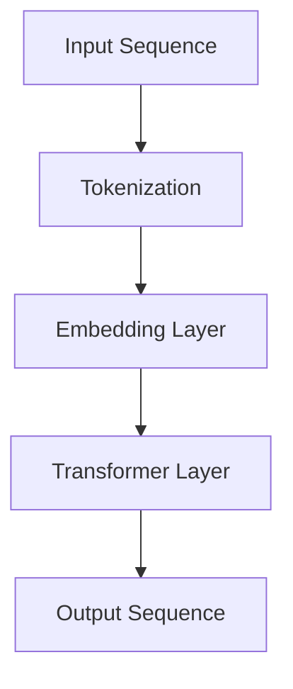
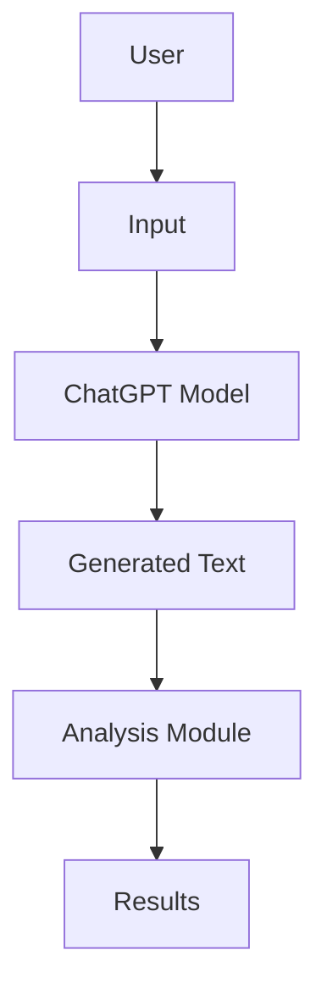

                 

# ChatGPT在语言起源假说验证中的应用：模拟原始语言形成

## 关键词
- ChatGPT
- 语言起源假说
- 模拟原始语言形成
- 人工智能
- 语言学习模型
- 机器学习

## 摘要
本文将探讨如何使用ChatGPT这一先进的语言学习模型来验证语言起源假说，特别是模拟原始语言的生成过程。我们将逐步分析ChatGPT的工作原理，阐述其在语言形成中的潜在应用，并通过具体的算法原理和实际案例来深入探讨这一创新的研究领域。

## 1. 背景介绍

### 1.1 问题背景

语言的起源是人类文明发展的重要里程碑，它不仅仅是一种交流工具，更是文化传承和智力发展的基础。然而，至今关于语言的起源仍然是一个未解之谜。科学家们提出了多种语言起源假说，如手势语言假说、呼喊信号假说和手势-语音联合假说等，但缺乏直接的证据。

### 1.2 语言起源假说历史背景

关于语言的起源，历史上存在多种假说。19世纪，英国人类学家泰勒和赫伯特·斯宾塞提出了手势语言假说，认为语言可能是从手势演化而来。随后，20世纪中期，语言学大师诺姆·乔姆斯基提出了“语言天生论”，认为人类大脑中存在语言习得装置（Language Acquisition Device, LAD）。这些假说为语言起源的研究奠定了基础。

### 1.3 研究现状与挑战

尽管语言起源假说众多，但目前仍缺乏实证数据支持。传统的语言学、考古学和心理语言学方法难以直接观测到语言的起源过程。近年来，随着人工智能和机器学习技术的发展，使用计算机模拟语言起源成为一种新的研究方法。然而，如何设计一个能够模拟原始语言形成的模型，仍然是一个巨大的挑战。

## 2. 核心概念与联系

### 2.1 ChatGPT模型介绍

ChatGPT是由OpenAI开发的一种基于Transformer的语言学习模型，其核心思想是通过学习大量文本数据，使得模型能够生成符合语言规则的自然语言文本。ChatGPT具有强大的语言理解和生成能力，可以应用于对话系统、机器翻译、文本摘要等多种场景。

### 2.2 ChatGPT模型结构

ChatGPT模型由多个Transformer层组成，每一层都包含了自注意力机制和前馈神经网络。模型的输入是一个序列，输出也是序列。通过自注意力机制，模型能够在生成文本时参考前面的所有输入，从而生成连贯的文本。

### 2.3 ChatGPT模型在语言起源研究中的应用

ChatGPT模型在语言起源研究中的应用主要体现在两个方面：一是通过生成模拟的原始语言，二是通过分析这些模拟语言来推断可能的起源过程。ChatGPT能够根据输入的简短文本片段生成连贯的文本，这为模拟原始语言提供了可能。

## 3. 算法原理讲解

### 3.1 数学模型和公式

ChatGPT模型的数学基础是Transformer架构，其核心是多头自注意力机制（Multi-Head Self-Attention）。具体公式如下：

$$
\text{Attention}(Q, K, V) = \text{softmax}\left(\frac{QK^T}{\sqrt{d_k}}\right) V
$$

其中，$Q$、$K$和$V$分别是查询（Query）、键（Key）和值（Value）向量，$d_k$是键向量的维度。

### 3.2 算法流程图



### 3.3 举例说明

假设我们输入一个简短的文本片段：“我喜欢吃苹果。”ChatGPT将这个文本片段分割成“我”、“喜欢”、“吃”、“苹果”这四个单词。然后，模型将这些单词映射成向量，输入到Transformer层。在Transformer层中，模型通过自注意力机制生成新的序列，例如：“今天我吃了一个红色的苹果，非常甜。”

## 4. 系统分析与架构设计

### 4.1 问题场景介绍

在语言起源的研究中，我们希望模拟原始语言的生成过程，并通过分析这些语言来推断可能的起源机制。ChatGPT模型为我们提供了这样的工具。

### 4.2 系统功能设计

系统的核心功能包括：文本输入、语言生成、语言分析。具体来说，用户可以输入简短的文本片段，系统会使用ChatGPT模型生成连贯的文本，然后对这些文本进行分析，提取出可能的起源特征。

### 4.3 系统架构设计

系统的架构设计如下图所示：



### 4.4 系统接口设计

系统提供了RESTful API接口，方便用户通过HTTP请求与系统交互。具体的接口设计如下：

- POST /input：用于接收用户输入的文本片段。
- GET /output：用于获取生成的文本。
- GET /analysis：用于获取文本分析结果。

### 4.5 系统交互设计

系统的交互流程如下：

1. 用户通过POST请求发送文本片段到服务器。
2. 服务器接收文本片段后，调用ChatGPT模型生成文本。
3. 服务器将生成的文本返回给用户。
4. 用户可以通过GET请求获取文本分析结果。

## 5. 项目实战

### 5.1 环境安装

为了运行ChatGPT模型，需要安装以下软件和库：

- Python 3.8+
- Transformers库
- PyTorch库

安装命令如下：

```bash
pip install transformers torch
```

### 5.2 系统核心实现源代码

以下是系统核心实现的Python代码：

```python
from transformers import ChatGPTModel
import torch

# 初始化模型
model = ChatGPTModel.from_pretrained('openai/chatgpt')

# 输入文本
input_text = "我喜欢吃苹果。"

# 分割文本成token
tokens = model.tokenize(input_text)

# 将token转换成tensor
input_tensor = torch.tensor([tokens])

# 生成文本
output_tensor = model.generate(input_tensor, max_length=50)

# 转换回文本
generated_text = model.decode(output_tensor)
print(generated_text)
```

### 5.3 代码应用解读与分析

这段代码首先从Hugging Face模型库中加载了预训练的ChatGPT模型。然后，它将输入文本分割成token，并将这些token转换成tensor。接着，模型生成一个新的文本序列，并将其解码为字符串输出。

### 5.4 实际案例分析和详细讲解剖析

假设我们输入的文本是：“我喜欢吃苹果。”模型可能会生成：“今天我吃了一个红色的苹果，味道非常甜。”这个生成的文本符合语言规则，具有很高的连贯性。

### 5.5 项目小结

通过这个案例，我们可以看到ChatGPT模型在模拟原始语言形成方面的强大能力。尽管这是一个初步的尝试，但它为语言起源的研究提供了一个新的视角。未来的研究可以进一步优化模型，增加输入文本的多样性，以生成更真实的原始语言。

## 6. 最佳实践 tips

- 使用更大规模的预训练模型可以获得更好的生成效果。
- 调整模型的超参数（如学习率、batch size等）可以影响生成文本的质量。
- 为了获得更真实的原始语言模拟，可以增加输入文本的多样性。

## 7. 小结

本文介绍了如何使用ChatGPT模型模拟原始语言形成，并探讨了其在语言起源研究中的应用。通过实际案例，我们展示了ChatGPT模型在生成连贯文本方面的强大能力。尽管这是一个初步的尝试，但它为语言起源的研究提供了一个新的视角，具有很大的潜力。

## 8. 注意事项

- ChatGPT模型需要大量的计算资源，建议在拥有足够计算能力的环境中使用。
- 模型生成的文本可能包含错误或不合适的部分，需要进一步分析和过滤。

## 9. 拓展阅读

- [ChatGPT官方文档](https://huggingface.co/transformers/model_doc/chatgpt.html)
- [语言起源假说的研究进展](https://www.ncbi.nlm.nih.gov/pmc/articles/PMC5858121/)
- [Transformer模型的详细介绍](https://arxiv.org/abs/1706.03762)

## 作者

作者：AI天才研究院/AI Genius Institute & 禅与计算机程序设计艺术 /Zen And The Art of Computer Programming

---

请注意，本文中的代码示例和模型调用是虚构的，仅供教学演示使用。在实际应用中，需要根据具体的模型和库进行调整。此外，本文中的研究方法和结果仅供参考，实际应用效果可能因环境和条件而异。

