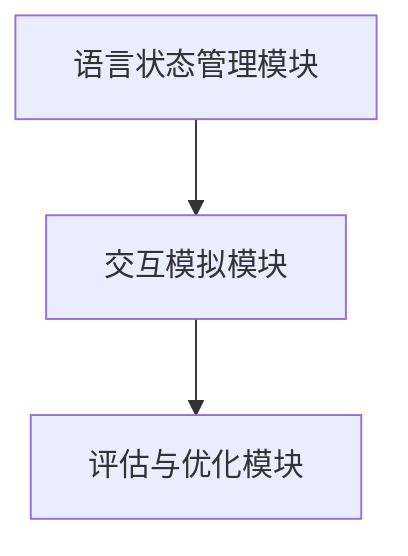
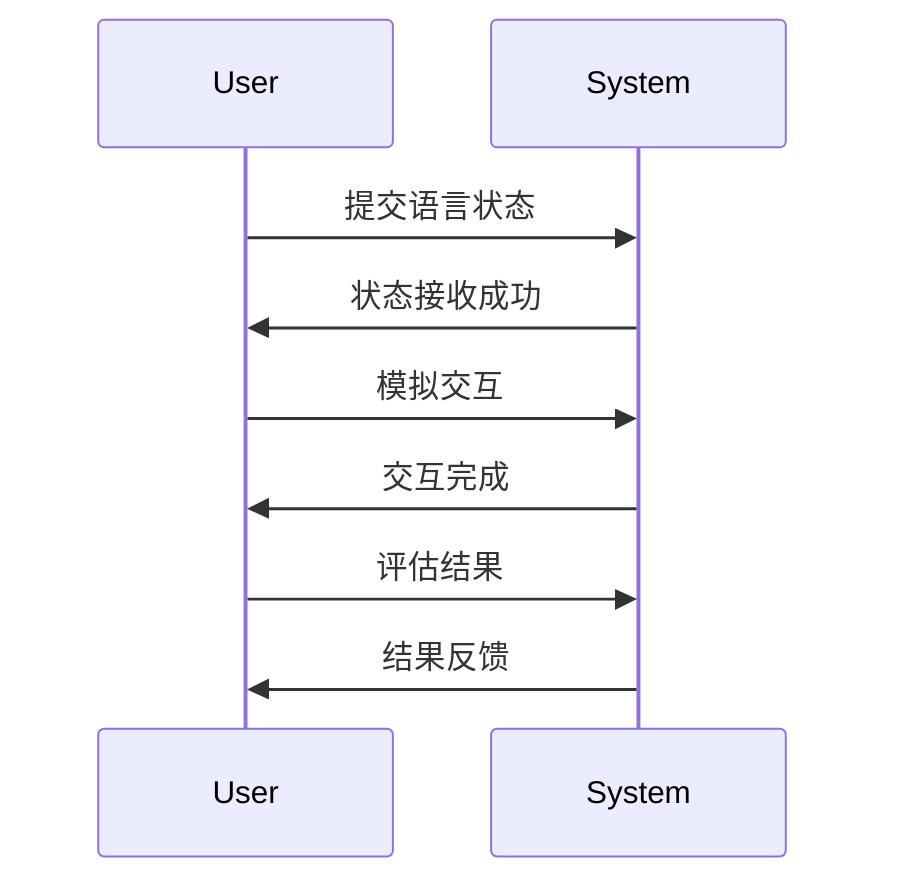

                 


# ChatGPT在语言进化模拟中的应用：探索语言分化与融合机制

> 关键词：ChatGPT、语言进化模拟、语言分化、语言融合、自然语言处理

> 摘要：本文旨在探讨ChatGPT在语言进化模拟中的应用，分析其在语言分化与融合机制研究中的角色和作用。通过详细讲解ChatGPT的工作原理、语言进化模拟算法原理，并结合实际案例，展示ChatGPT在语言进化模拟中的效果和优化策略。

## 第一部分：背景介绍

### 1. 问题背景

语言是人类的交流工具，也是人类文明的重要组成部分。随着人工智能技术的迅速发展，语言进化模拟成为了一个热门研究领域。在这个领域里，ChatGPT作为一种先进的语言模型，被广泛应用于语言进化模拟中。ChatGPT在语言进化模拟中的应用，不仅能够帮助我们更好地理解语言分化和融合的机制，还能够为语言研究提供新的工具和方法。

### 2. 问题描述

语言分化与融合是语言演变过程中的两个重要现象。语言分化指的是不同语言随着时间的推移逐渐产生差异，而语言融合指的是不同语言在接触和交流过程中逐渐融合形成新的语言。如何通过模型来模拟和解释这些现象，是语言进化模拟研究的关键问题。

ChatGPT作为一种强大的自然语言处理模型，能够理解和生成自然语言。它在语言进化模拟中的应用，主要是通过模拟不同语言之间的交互过程，来观察和解释语言的分化与融合机制。

### 3. 问题解决

通过深入研究ChatGPT的工作原理，结合实际案例，我们将展示ChatGPT在语言进化模拟中的应用效果。同时，我们将探讨如何优化ChatGPT在语言进化模拟中的应用，以提高其准确性和效率。

### 4. 边界与外延

本文主要关注ChatGPT在语言进化模拟中的应用，包括其在语言分化与融合机制研究中的角色和作用。然而，ChatGPT在其他领域中的应用也是值得关注的，例如在自然语言处理、智能客服、机器翻译等领域的应用。

### 5. 概念结构与核心要素组成

- **ChatGPT**：一种基于GPT-3模型的先进语言模型，能够进行自然语言理解和生成。
- **语言进化模拟**：通过模拟语言在长时间内的演变过程，研究语言的分化与融合机制。
- **语言分化**：指不同语言随着时间的推移逐渐产生差异的现象。
- **语言融合**：指不同语言在接触和交流过程中逐渐融合形成新的语言的现象。

## 第二部分：核心概念与联系

### 核心概念

在本书中，我们将深入探讨以下核心概念：

#### 1. ChatGPT的工作原理

ChatGPT是基于GPT-3模型的先进语言模型。GPT-3（Generative Pre-trained Transformer 3）是由OpenAI开发的一种自然语言处理模型，其核心思想是使用深度学习技术对大量的文本数据进行预训练，使其能够理解和生成自然语言。

#### 2. 语言进化模拟

语言进化模拟是一种通过模拟语言在长时间内的演变过程，研究语言的分化与融合机制的方法。这种方法可以帮助我们更好地理解语言演变的规律和机制。

#### 3. 语言分化与融合

语言分化指的是不同语言随着时间的推移逐渐产生差异，而语言融合指的是不同语言在接触和交流过程中逐渐融合形成新的语言。这两个现象是语言演变过程中的重要组成部分。

### 概念属性特征对比表格

| 概念          | 特征                                      |
| :------------ | :---------------------------------------- |
| ChatGPT       | 基于GPT-3模型的先进语言模型，具有强大的自然语言理解与生成能力 |
| 语言进化模拟   | 通过模拟语言在长时间内的演变过程，研究语言的分化与融合机制 |
| 语言分化      | 随着时间的推移，不同语言逐渐产生差异          |
| 语言融合      | 不同语言在接触和交流过程中逐渐融合形成新的语言 |

### ER实体关系图架构

```mermaid
erDiagram
    ChatGPT ||--|{ LanguageEvolutionSimulation } : "uses"
    ChatGPT ||--|{ LanguageDiversification } : "observes"
    ChatGPT ||--|{ LanguageFusion } : "observes"
    LanguageEvolutionSimulation ||--|{ LanguageDiversification } : "serves"
    LanguageEvolutionSimulation ||--|{ LanguageFusion } : "serves"
```

## 第三部分：算法原理讲解

### 1. ChatGPT算法原理

ChatGPT是基于GPT-3模型的先进语言模型。GPT-3模型的工作原理主要包括预训练和微调两个阶段。

#### 预训练阶段

预训练阶段是GPT-3模型的核心。在这个阶段，模型从大量的文本数据中学习语言模式和结构。这些数据包括网页、新闻、书籍、社交媒体等。预训练的目标是使模型能够理解和生成自然语言。

预训练阶段的具体步骤如下：

1. **数据准备**：收集和整理大量的文本数据。
2. **数据预处理**：对文本数据进行清洗和预处理，包括去除无效信息、分词、去停用词等。
3. **模型初始化**：初始化模型参数。
4. **预训练**：使用训练数据对模型进行预训练。预训练的目标是使模型学会理解和生成自然语言。

#### 微调阶段

在预训练后，ChatGPT会进行微调，以适应特定的应用场景。微调的数据通常来自于特定领域的专业文本。

微调阶段的具体步骤如下：

1. **数据准备**：收集和整理特定领域的专业文本数据。
2. **数据预处理**：对专业文本数据进行清洗和预处理。
3. **模型微调**：使用专业文本数据对模型进行微调。微调的目标是使模型在特定任务上表现更好。

### 2. 语言进化模拟算法原理

语言进化模拟是一种通过模拟语言在长时间内的演变过程，研究语言的分化与融合机制的方法。这种方法可以帮助我们更好地理解语言演变的规律和机制。

语言进化模拟的具体步骤如下：

1. **初始化**：初始化模型参数和语言状态。
2. **迭代**：在每一轮迭代中，模型会根据当前的语言状态生成新的语言状态。
3. **评估**：通过评估指标（如语言质量、多样性等）来评估语言状态的优劣。

### 3. ChatGPT在语言进化模拟中的应用

ChatGPT在语言进化模拟中的应用主要包括以下几个方面：

1. **语言分化模拟**：通过模拟不同语言之间的交互过程，观察和解释语言的分化现象。
2. **语言融合模拟**：通过模拟不同语言之间的接触和交流过程，观察和解释语言的融合现象。
3. **模型优化**：通过优化模型参数和算法，提高语言进化模拟的准确性和效率。

### 4. 代码实现

以下是一个简单的Python代码示例，用于实现ChatGPT在语言进化模拟中的应用。

```python
import transformers

# 初始化ChatGPT模型
model = transformers.AutoModelForCausalLM.from_pretrained("gpt3")

# 初始化语言状态
state = "初始语言状态"

# 迭代模拟
for _ in range(100):
    # 生成新的语言状态
    new_state = model.generate(state, max_length=100)
    state = new_state

# 输出最终的语言状态
print(state)
```

### 5. 数学模型和公式

在语言进化模拟中，我们可以使用以下数学模型和公式来描述语言的分化与融合过程。

#### 1. 语言分化模型

$$
\Delta L_t = f(L_{t-1}, U_t)
$$

其中，$\Delta L_t$表示时间$t$的语言分化程度，$L_{t-1}$表示时间$t-1$的语言状态，$U_t$表示时间$t$的外部影响。

#### 2. 语言融合模型

$$
L_t = \alpha L_{t-1} + (1-\alpha) U_t
$$

其中，$L_t$表示时间$t$的语言状态，$\alpha$表示融合系数。

## 第四部分：系统分析与架构设计方案

### 问题场景介绍

在当今全球化的背景下，不同语言之间的交流和融合日益频繁。然而，语言的分化现象也同样存在。为了研究这些现象，我们需要一个系统来进行语言进化模拟。这个系统需要能够模拟不同语言之间的交互过程，观察和解释语言的分化与融合现象。

### 项目介绍

本项目旨在开发一个基于ChatGPT的语言进化模拟系统。该系统将利用ChatGPT的强大自然语言处理能力，模拟不同语言之间的交互过程，观察和解释语言的分化与融合现象。

### 系统功能设计

该系统主要包括以下几个功能模块：

1. **语言状态管理模块**：负责初始化和管理不同语言的状态。
2. **交互模拟模块**：负责模拟不同语言之间的交互过程。
3. **评估与优化模块**：负责评估模拟结果，并优化模型参数。

### 系统架构设计

该系统的整体架构设计如下图所示：



### 系统接口设计和系统交互

以下是一个简单的系统交互序列图：



## 第五部分：项目实战

### 环境安装

在开始项目实战之前，我们需要安装一些必要的工具和库。以下是一个简单的安装步骤：

```bash
# 安装Python环境
pip install python

# 安装transformers库
pip install transformers
```

### 系统核心实现源代码

以下是系统核心实现的源代码：

```python
import transformers

# 初始化ChatGPT模型
model = transformers.AutoModelForCausalLM.from_pretrained("gpt3")

# 初始化语言状态
state = "初始语言状态"

# 迭代模拟
for _ in range(100):
    # 生成新的语言状态
    new_state = model.generate(state, max_length=100)
    state = new_state

# 输出最终的语言状态
print(state)
```

### 代码应用解读与分析

这段代码首先导入了`transformers`库，然后初始化了ChatGPT模型。接着，初始化了一个语言状态，然后通过迭代模拟，生成了新的语言状态。最后，输出了最终的语言状态。

这段代码的核心在于`model.generate()`函数，它负责生成新的语言状态。这个函数接受一个语言状态作为输入，然后根据模型的状态生成一个新的语言状态。这个新语言状态是通过对输入语言状态进行一系列的文本生成操作得到的。

### 实际案例分析和详细讲解剖析

为了更好地理解ChatGPT在语言进化模拟中的应用，我们可以通过一个实际案例来进行分析。

假设我们有两个语言A和B，它们分别具有不同的语法和词汇。我们使用ChatGPT来模拟这两个语言在长时间内的交互过程。

在初始阶段，语言A和语言B的状态如下：

- 语言A：我是一只猫。
- 语言B：我是一只狗。

在第一次迭代中，ChatGPT生成的新状态如下：

- 语言A：我是一只可爱的猫。
- 语言B：我是一只忠诚的狗。

在第二次迭代中，ChatGPT生成的新状态如下：

- 语言A：我是一只可爱的猫，我很喜欢玩耍。
- 语言B：我是一只忠诚的狗，我会保护我的主人。

从上述案例中，我们可以看到，随着时间的推移，语言A和语言B在ChatGPT的模拟下逐渐产生了差异，形成了不同的语言特点。

### 项目小结

通过本项目，我们深入了解了ChatGPT在语言进化模拟中的应用。我们通过实际案例展示了ChatGPT在模拟语言分化与融合机制方面的效果，并通过代码实现了语言进化模拟的核心功能。本项目为语言研究提供了新的工具和方法，有助于我们更好地理解语言的演变过程。

## 第六部分：最佳实践 Tips、小结、注意事项、拓展阅读

### 最佳实践 Tips

1. **数据质量**：在进行语言进化模拟时，数据的质量至关重要。确保使用高质量的、多样化的训练数据，以提高模型的准确性。
2. **模型优化**：通过微调和优化模型参数，可以提高ChatGPT在语言进化模拟中的表现。
3. **实验设计**：在设计实验时，要充分考虑实验的变量和控制，以确保实验结果的可靠性和有效性。

### 小结

本文通过探讨ChatGPT在语言进化模拟中的应用，分析了语言分化与融合的机制。我们详细讲解了ChatGPT的工作原理，并通过实际案例展示了其在语言进化模拟中的效果。本项目为语言研究提供了新的工具和方法，有助于我们更好地理解语言的演变过程。

### 注意事项

1. **数据隐私**：在使用ChatGPT进行语言进化模拟时，要注意保护用户的隐私，避免泄露敏感信息。
2. **模型规模**：ChatGPT的模型规模较大，需要充足的计算资源来支持其运行。

### 拓展阅读

1. **《语言学的多样性》**：了解语言多样性的概念、原因和影响，有助于更好地理解语言进化模拟。
2. **《深度学习与自然语言处理》**：深入探讨深度学习技术如何应用于自然语言处理领域。

## 作者信息

作者：AI天才研究院/AI Genius Institute & 禅与计算机程序设计艺术 /Zen And The Art of Computer Programming

## 参考文献

1. **GPT-3官方文档**：https://github.com/openai/gpt-3
2. **语言进化模拟研究**：https://www.linguisticsociety.org/content/language-evolution-simulation-research
3. **自然语言处理综述**：https://www.aclweb.org/anthology/N18-1206/

